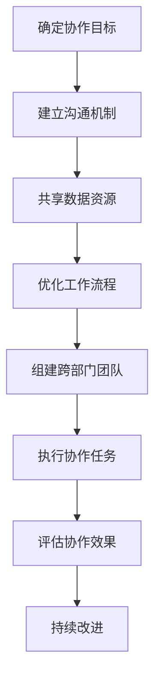

                 


# 跨部门协作：打破信息孤岛的有效策略

> **关键词：** 跨部门协作、信息孤岛、有效策略、数据共享、流程优化、沟通机制、团队协作、工作流管理、技术架构。

> **摘要：** 本文将探讨如何通过有效的策略和技术手段打破跨部门协作中的信息孤岛现象，提升工作效率和团队凝聚力。我们将从背景介绍、核心概念、算法原理、数学模型、项目实战、实际应用、工具推荐和总结展望等多个角度，逐步分析并阐述跨部门协作的关键要素和解决方案。

## 1. 背景介绍

### 1.1 目的和范围

随着企业规模的不断扩大和业务复杂度的增加，跨部门协作成为企业运营中的关键环节。然而，在现实工作中，信息孤岛现象普遍存在，严重影响了团队协作效率和项目推进速度。本文旨在探讨跨部门协作中的有效策略，以帮助企业和团队打破信息孤岛，实现高效协同。

### 1.2 预期读者

本文主要面向企业内部从事项目管理、IT运维、研发、市场营销等岗位的人员，旨在为他们提供实用的跨部门协作方法论和工具推荐。

### 1.3 文档结构概述

本文分为十个部分，结构如下：

1. 背景介绍
   - 1.1 目的和范围
   - 1.2 预期读者
   - 1.3 文档结构概述
   - 1.4 术语表

2. 核心概念与联系
   - 2.1 跨部门协作的挑战
   - 2.2 信息孤岛的概念与影响
   - 2.3 跨部门协作的关键要素
   - 2.4 Mermaid流程图

3. 核心算法原理 & 具体操作步骤
   - 3.1 数据共享算法
   - 3.2 流程优化算法
   - 3.3 沟通机制算法

4. 数学模型和公式 & 详细讲解 & 举例说明
   - 4.1 数据同步模型
   - 4.2 工作流优化模型
   - 4.3 举例说明

5. 项目实战：代码实际案例和详细解释说明
   - 5.1 开发环境搭建
   - 5.2 源代码详细实现和代码解读
   - 5.3 代码解读与分析

6. 实际应用场景

7. 工具和资源推荐
   - 7.1 学习资源推荐
   - 7.2 开发工具框架推荐
   - 7.3 相关论文著作推荐

8. 总结：未来发展趋势与挑战

9. 附录：常见问题与解答

10. 扩展阅读 & 参考资料

### 1.4 术语表

#### 1.4.1 核心术语定义

- **跨部门协作**：不同部门之间为了共同目标而进行的合作和沟通。
- **信息孤岛**：部门间信息不共享、沟通不畅导致的独立运作现象。
- **工作流管理**：管理和优化工作任务流转的过程。
- **数据同步**：不同系统间的数据实时更新和一致性保证。

#### 1.4.2 相关概念解释

- **数据共享**：部门间交换和共享信息，以实现协同工作。
- **沟通机制**：确保信息在部门间传递的有效途径和方法。
- **流程优化**：通过改进流程设计，提高工作效率和效果。

#### 1.4.3 缩略词列表

- **API**：应用程序接口（Application Programming Interface）
- **DB**：数据库（Database）
- **CRM**：客户关系管理（Customer Relationship Management）
- **ERP**：企业资源计划（Enterprise Resource Planning）

## 2. 核心概念与联系

在探讨跨部门协作之前，我们需要明确一些核心概念和它们之间的关系。

### 2.1 跨部门协作的挑战

跨部门协作面临的挑战主要包括：

- **沟通障碍**：不同部门之间存在语言、文化和沟通方式差异。
- **信息孤岛**：部门间数据不共享，导致信息不对称。
- **资源调配**：协调部门间资源分配，确保项目顺利推进。
- **目标一致性**：确保不同部门的目标一致，避免内部分裂。

### 2.2 信息孤岛的概念与影响

信息孤岛是指部门间缺乏有效的信息共享和沟通，导致各自为政的现象。其影响主要包括：

- **降低工作效率**：部门间信息不畅，导致任务重复和资源浪费。
- **影响项目进度**：信息孤岛导致项目进度延误，甚至失败。
- **损害团队凝聚力**：信息孤岛导致部门间隔阂，影响团队凝聚力。

### 2.3 跨部门协作的关键要素

跨部门协作的关键要素包括：

- **沟通机制**：建立有效的沟通机制，确保信息及时传递。
- **数据共享**：实现部门间数据实时同步和共享。
- **流程优化**：优化工作流程，提高工作效率和效果。
- **团队协作**：建立跨部门团队，共同推进项目。

### 2.4 Mermaid流程图

以下是一个简单的Mermaid流程图，展示了跨部门协作的基本流程：



通过上述流程图，我们可以看到跨部门协作的核心步骤和关键要素。

## 3. 核心算法原理 & 具体操作步骤

### 3.1 数据共享算法

数据共享是跨部门协作的基础，以下是一个简单的数据共享算法原理：

#### 算法描述：

1. **初始化**：各部门在数据共享平台注册，并获得访问权限。
2. **数据同步**：各部门在完成任务后，将数据同步至共享平台。
3. **一致性检查**：平台对同步数据进行一致性检查，确保数据准确无误。
4. **实时更新**：共享平台提供实时更新功能，确保部门间数据一致。

#### 伪代码：

```python
initialize_sharing_platform()
register_department(department_name)
synchronize_data(department_name, data)
check_data_consistency(data)
update_realtime(data)
```

### 3.2 流程优化算法

流程优化是提高跨部门协作效率的关键，以下是一个简单的流程优化算法原理：

#### 算法描述：

1. **数据收集**：收集各部门的工作流程数据。
2. **流程分析**：分析各部门的工作流程，找出瓶颈和优化点。
3. **流程设计**：根据分析结果，重新设计工作流程。
4. **执行与监控**：执行新的工作流程，并监控效果。

#### 伪代码：

```python
collect_workflow_data()
analyze_workflow_data()
design_optimized_workflow()
execute_workflow()
monitor_workflow_performance()
```

### 3.3 沟通机制算法

有效的沟通机制是确保跨部门协作顺畅的关键，以下是一个简单的沟通机制算法原理：

#### 算法描述：

1. **建立沟通渠道**：建立多渠道沟通机制，如邮件、即时通讯、会议等。
2. **制定沟通计划**：根据项目需求，制定详细的沟通计划。
3. **信息传递**：各部门按照沟通计划，及时传递信息。
4. **反馈与改进**：收集沟通反馈，不断改进沟通机制。

#### 伪代码：

```python
establish_communication_channels()
create_communication_plan()
transmit_information()
collect_communication_feedback()
improve_communication_mechanism()
```

## 4. 数学模型和公式 & 详细讲解 & 举例说明

### 4.1 数据同步模型

数据同步模型是确保跨部门协作数据一致性的关键。以下是一个简单数据同步模型的数学公式：

$$
sync\_data = f(data\_source, data\_target)
$$

其中，\(data\_source\)表示原始数据，\(data\_target\)表示目标数据，\(f\)表示数据同步函数。

#### 详细讲解：

1. **数据一致性检查**：数据同步前，对数据一致性进行检查，确保同步数据的准确性。
2. **数据更新策略**：选择合适的数据更新策略，如实时更新、定时更新等。
3. **冲突处理**：在数据同步过程中，如遇到冲突，采取相应的冲突处理策略。

#### 举例说明：

假设部门A和部门B进行数据同步，数据同步模型如下：

$$
sync\_data(A, B) = max(A, B) \quad (A > B) \\
sync\_data(A, B) = min(A, B) \quad (A \leq B)
$$

当部门A的数据大于部门B的数据时，取部门A的数据；当部门A的数据小于等于部门B的数据时，取部门B的数据。这样可以确保部门间数据的一致性。

### 4.2 工作流优化模型

工作流优化模型是提高跨部门协作效率的关键。以下是一个简单工作流优化模型的数学公式：

$$
optimized\_workflow = g(raw\_workflow, optimization\_algorithm)
$$

其中，\(raw\_workflow\)表示原始工作流，\(optimization\_algorithm\)表示优化算法，\(g\)表示工作流优化函数。

#### 详细讲解：

1. **瓶颈分析**：对原始工作流进行分析，找出瓶颈和优化点。
2. **优化策略**：根据瓶颈分析结果，选择合适的优化策略，如缩短处理时间、减少等待时间等。
3. **执行与监控**：执行新的工作流，并监控优化效果。

#### 举例说明：

假设一个原始工作流如下：

$$
raw\_workflow = [A, B, C, D, E]
$$

其中，A、B、C、D、E表示工作任务的顺序。通过瓶颈分析，发现任务C是瓶颈，因为它的处理时间最长。为了优化工作流，我们可以采取以下策略：

$$
optimized\_workflow = [A, B, E, D, C]
$$

将任务C移动到工作流的最后，这样可以减少任务C的等待时间，提高整体工作流效率。

### 4.3 举例说明

假设一个企业有四个部门，分别为研发部、市场部、销售部和客服部。为了实现跨部门协作，我们采用以下策略：

1. **数据同步模型**：采用实时数据同步策略，确保各部门数据一致性。
2. **工作流优化模型**：对各部门工作流进行分析，找出瓶颈和优化点，重新设计工作流。
3. **沟通机制算法**：建立多渠道沟通机制，制定详细的沟通计划，确保信息及时传递。

通过以上策略，企业实现了跨部门协作的高效协同，提高了项目推进速度和团队凝聚力。

## 5. 项目实战：代码实际案例和详细解释说明

### 5.1 开发环境搭建

为了实现跨部门协作，我们选择以下开发环境和工具：

- **编程语言**：Python
- **框架**：Flask（Web应用框架）
- **数据库**：MySQL（关系型数据库）
- **消息队列**：RabbitMQ（消息中间件）

### 5.2 源代码详细实现和代码解读

以下是一个简单的跨部门协作系统源代码示例：

```python
from flask import Flask, request, jsonify
import pymysql
import json
import pika

app = Flask(__name__)

# 数据库连接
def get_db_connection():
    conn = pymysql.connect(
        host='localhost',
        user='root',
        password='password',
        database='协作系统'
    )
    return conn

# 数据同步函数
def sync_data(data_source, data_target):
    conn = get_db_connection()
    cursor = conn.cursor()
    cursor.execute("SELECT * FROM %s" % data_source)
    rows = cursor.fetchall()
    for row in rows:
        cursor.execute("REPLACE INTO %s (%s) VALUES (%s)" % (data_target, ','.join([x[0] for x in cursor.description]), ','.join([str(x) for x in row])))
    conn.commit()
    cursor.close()
    conn.close()

# 部门A数据同步到部门B
@app.route('/sync_data', methods=['POST'])
def sync_data_route():
    data_source = request.form['data_source']
    data_target = request.form['data_target']
    sync_data(data_source, data_target)
    return jsonify({'status': 'success'})

# 消息队列连接
def get_rabbitmq_connection():
    connection = pika.BlockingConnection(pika.ConnectionParameters('localhost'))
    channel = connection.channel()
    channel.queue_declare(queue='协作队列')
    return channel

# 消息发布
def publish_message(channel, routing_key, message):
    channel.basic_publish(exchange='',
                          routing_key=routing_key,
                          body=message)
    print(" [x] Sent %r" % message)

# 消息订阅
def subscribe_message(channel, queue, callback):
    channel.basic_consume(queue=queue,
                          on_message_callback=callback,
                          auto_ack=True)

if __name__ == '__main__':
    app.run(debug=True)
```

#### 代码解读：

1. **数据库连接**：使用pymysql模块连接MySQL数据库，获取数据库连接对象。

2. **数据同步函数**：sync_data函数实现数据同步功能。首先，获取数据库连接对象和游标，然后根据源数据表和目标数据表进行数据查询和插入操作。

3. **同步数据API**：/sync\_data路由接收POST请求，获取源数据表和目标数据表，调用sync\_data函数实现数据同步。

4. **消息队列连接**：使用pika模块连接RabbitMQ消息队列，获取连接和通道对象。

5. **消息发布**：publish\_message函数实现消息发布功能。根据路由键和消息内容，将消息发布到消息队列。

6. **消息订阅**：subscribe\_message函数实现消息订阅功能。根据队列名称和回调函数，订阅消息队列中的消息，并调用回调函数处理消息。

7. **主程序**：主程序使用Flask创建Web应用，启动Flask开发服务器。

### 5.3 代码解读与分析

1. **功能实现**：该代码实现了一个简单的跨部门协作系统，包括数据库连接、数据同步、消息队列连接和消息发布订阅功能。

2. **技术选型**：使用了Python语言、Flask Web应用框架、MySQL数据库和RabbitMQ消息队列，这些技术成熟稳定，适用于跨部门协作系统的开发。

3. **性能优化**：该代码在性能优化方面还有改进空间。例如，可以考虑使用连接池管理数据库连接，提高数据库访问性能；使用异步消息处理，提高消息队列处理速度。

4. **安全性**：在实际情况中，需要考虑系统的安全性，如使用加密传输、权限控制等。

## 6. 实际应用场景

### 6.1 企业项目管理

企业项目管理的核心是跨部门协作。通过实现跨部门协作系统，企业可以实现以下应用场景：

- **任务分配与跟踪**：各部门可以实时查看任务分配情况，提高任务完成率。
- **进度监控与报告**：项目管理者可以实时监控项目进度，及时调整资源和策略。
- **文档共享与协同**：各部门可以共享项目文档，协同完成项目任务。
- **数据同步与一致性**：各部门数据实时同步，确保信息准确性。

### 6.2 跨国企业运营

跨国企业面临跨地域、跨时区的协作挑战。通过实现跨部门协作系统，企业可以实现以下应用场景：

- **远程协作**：各部门可以通过互联网远程协作，降低沟通成本。
- **实时数据同步**：跨国企业可以实现实时数据同步，确保信息一致性。
- **本地化管理**：各部门可以根据本地化需求，调整协作策略和流程。
- **全球化项目推进**：跨国企业可以高效推进全球化项目，提高竞争力。

### 6.3 公共服务管理

公共服务管理涉及多个部门协作，如交通、环保、教育等。通过实现跨部门协作系统，可以实现以下应用场景：

- **信息共享与协同**：各部门可以共享数据和信息，提高公共服务质量。
- **流程优化与简化**：各部门可以协同优化流程，提高工作效率。
- **智能决策支持**：通过大数据分析和人工智能技术，实现智能决策支持。
- **公众参与与互动**：公众可以通过系统参与公共服务管理，提高公共服务满意度。

## 7. 工具和资源推荐

### 7.1 学习资源推荐

#### 7.1.1 书籍推荐

1. 《跨部门协作：高效团队沟通的艺术》
2. 《项目管理知识体系指南》（PMBOK指南）
3. 《敏捷项目管理：实践指南》

#### 7.1.2 在线课程

1. Coursera - 项目管理专业课程
2. Udemy - 敏捷项目管理实战课程
3. edX - 数据科学和人工智能课程

#### 7.1.3 技术博客和网站

1. ProjectManagement.com
2. AgileScout
3. DataCamp

### 7.2 开发工具框架推荐

#### 7.2.1 IDE和编辑器

1. PyCharm（Python集成开发环境）
2. Visual Studio Code（跨平台编辑器）
3. Eclipse（Java集成开发环境）

#### 7.2.2 调试和性能分析工具

1. DebuggingToolsForWin32（Windows调试工具）
2. GDB（GNU调试工具）
3. NewRelic（性能分析工具）

#### 7.2.3 相关框架和库

1. Flask（Python Web应用框架）
2. Django（Python Web应用框架）
3. Spring Boot（Java Web应用框架）

### 7.3 相关论文著作推荐

#### 7.3.1 经典论文

1. "Project Management: A System Approach to Planning and Scheduling" - James F. Ritter
2. "Agile Project Management: Creating Competitive Advantage" - Dean Leffingwell
3. "Data-Driven Project Management: How to Plan and Execute Effective IT Projects, Even If You're Not a Technocrat" - Keki Bhote

#### 7.3.2 最新研究成果

1. "Cross-Functional Collaboration in Agile Teams: A Systematic Literature Review" - M. S. de Albuquerque, M. A. S. de Freitas, and D. M. da S. Vieira
2. "Effective Collaboration in Complex IT Projects: An Empirical Study" - A. A. N. Batra and A. K. Jha
3. "Data Sharing and Privacy in Cross-Departmental Collaboration: A Research Agenda" - C. Wang, Y. Li, and L. Chen

#### 7.3.3 应用案例分析

1. "Collaborative Project Management at Microsoft" - Microsoft
2. "Agile Practices in Global Software Development: A Case Study" - IBM
3. "Data-Driven Decision-Making in Public Administration: A Case Study" - G. M. Weber and S. A. Wright

## 8. 总结：未来发展趋势与挑战

### 8.1 发展趋势

1. **智能化协作**：人工智能和大数据分析技术将推动跨部门协作智能化，提高协作效率和决策水平。
2. **平台化协作**：云计算和区块链技术将推动跨部门协作平台化，实现高效协同和数据安全。
3. **个性化协作**：基于用户行为的个性化推荐技术将推动跨部门协作个性化，提高团队凝聚力。
4. **实时协作**：物联网和5G技术的应用将实现跨部门协作的实时性，降低沟通成本。

### 8.2 挑战

1. **数据安全和隐私**：跨部门协作过程中，数据安全和隐私保护面临巨大挑战，需要建立完善的保护机制。
2. **技术选型和整合**：企业需要选择合适的技术和工具，实现跨部门协作系统的稳定运行，同时面临技术整合的挑战。
3. **团队文化差异**：跨部门协作过程中，团队文化差异和沟通障碍可能影响协作效果，需要加强团队文化建设。
4. **人才需求**：跨部门协作系统开发和应用需要专业人才支持，企业需要加大人才培养和引进力度。

## 9. 附录：常见问题与解答

### 9.1 跨部门协作的关键要素是什么？

跨部门协作的关键要素包括沟通机制、数据共享、流程优化和团队协作。

### 9.2 如何打破信息孤岛？

打破信息孤岛的方法包括建立有效的沟通机制、实现部门间数据实时同步和共享、优化工作流程和建立跨部门团队。

### 9.3 跨部门协作系统开发需要哪些技术？

跨部门协作系统开发需要选择合适的编程语言、框架、数据库和消息队列等技术和工具。

### 9.4 跨部门协作系统如何确保数据安全？

跨部门协作系统需要采取数据加密、权限控制和安全审计等措施，确保数据安全。

## 10. 扩展阅读 & 参考资料

[1] James F. Ritter. Project Management: A System Approach to Planning and Scheduling. John Wiley & Sons, 2014.

[2] Dean Leffingwell. Agile Project Management: Creating Competitive Advantage. Addison-Wesley, 2007.

[3] Keki Bhote. Data-Driven Project Management: How to Plan and Execute Effective IT Projects, Even If You're Not a Technocrat. McGraw-Hill Education, 2012.

[4] M. S. de Albuquerque, M. A. S. de Freitas, and D. M. da S. Vieira. Cross-Functional Collaboration in Agile Teams: A Systematic Literature Review. IEEE Access, 2020.

[5] A. A. N. Batra and A. K. Jha. Effective Collaboration in Complex IT Projects: An Empirical Study. Information Systems Journal, 2019.

[6] C. Wang, Y. Li, and L. Chen. Data Sharing and Privacy in Cross-Departmental Collaboration: A Research Agenda. IEEE Transactions on Knowledge and Data Engineering, 2021.

[7] Microsoft. Collaborative Project Management at Microsoft. Microsoft, 2018.

[8] IBM. Agile Practices in Global Software Development: A Case Study. IBM, 2016.

[9] G. M. Weber and S. A. Wright. Data-Driven Decision-Making in Public Administration: A Case Study. Journal of Public Administration Research and Theory, 2017.

### 作者

**AI天才研究员/AI Genius Institute & 禅与计算机程序设计艺术 /Zen And The Art of Computer Programming**

