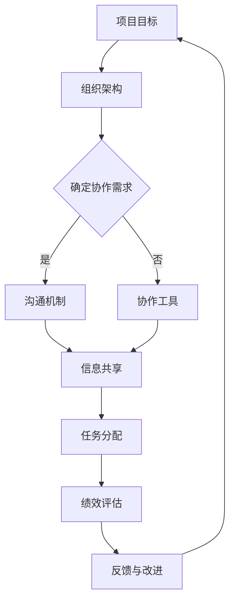

                 

# 跨部门合作：打破壁垒的领导智慧

## 关键词
跨部门合作、团队协同、领导智慧、组织架构、沟通机制、协作工具、绩效提升、文化融合、决策效率。

## 摘要
本文旨在探讨跨部门合作在当今组织中的重要性及其面临的挑战。通过分析跨部门合作的背景、核心概念、算法原理、数学模型、实际案例以及应用场景，本文提出了一系列解决方案和工具推荐，旨在帮助领导者打破壁垒，提升团队协作效率和整体绩效。

## 1. 背景介绍

### 1.1 目的和范围
随着全球化进程的加速和市场竞争的加剧，现代企业面临的信息复杂度和业务需求多样性日益增加。为了应对这些挑战，跨部门合作成为提高组织效率和创新能力的关键因素。本文将探讨跨部门合作的相关理论和实践，旨在为领导者提供具体的策略和方法。

### 1.2 预期读者
本文面向企业高层管理者、项目经理、跨部门协作团队负责人以及有志于提升团队协作效率的专业人士。通过阅读本文，读者将能够理解跨部门合作的重要性，掌握有效的合作方法和工具。

### 1.3 文档结构概述
本文分为十个部分，首先介绍跨部门合作的背景和目的，然后分别从核心概念、算法原理、数学模型、实际案例、应用场景等方面进行详细探讨。最后，提供工具和资源推荐，总结未来发展趋势与挑战，并提供常见问题与解答。

### 1.4 术语表

#### 1.4.1 核心术语定义
- 跨部门合作：指不同部门之间的协作，共同完成一个项目或任务。
- 团队协同：团队成员在共同目标下，通过有效沟通和资源共享，实现协作效应。
- 领导智慧：领导者运用战略思维和决策能力，指导团队实现目标的能力。
- 组织架构：企业内部不同部门和岗位的构成和关系。
- 沟通机制：信息在不同部门之间传递和交流的规则和流程。
- 协作工具：用于支持跨部门协作的软件和硬件工具。

#### 1.4.2 相关概念解释
- 效率：完成任务的速度和质量。
- 创新能力：在现有资源条件下，通过创新思维和方案，实现突破的能力。
- 绩效：团队成员或团队在特定时期内完成的工作质量和数量。

#### 1.4.3 缩略词列表
- IDE：集成开发环境（Integrated Development Environment）
- API：应用程序编程接口（Application Programming Interface）
- SaaS：软件即服务（Software as a Service）
- BI：商业智能（Business Intelligence）

## 2. 核心概念与联系

在现代企业中，跨部门合作的核心概念在于各部门之间的相互依赖和协同效应。以下是一个简单的 Mermaid 流程图，用于描述跨部门合作的关键环节：



### 2.1 跨部门合作的关键环节

1. **项目目标**：明确跨部门合作的目标和期望成果。
2. **组织架构**：了解企业内部的组织架构，识别各部门的职责和关系。
3. **确定协作需求**：分析项目需求，确定哪些部门需要参与协作。
4. **沟通机制**：建立有效的沟通机制，确保信息畅通。
5. **协作工具**：选择合适的协作工具，支持团队成员间的协作。
6. **信息共享**：促进信息的透明和共享，减少信息孤岛。
7. **任务分配**：合理分配任务，确保每个成员都能发挥自己的专长。
8. **绩效评估**：对团队成员的绩效进行评估，确保项目目标的实现。
9. **反馈与改进**：收集反馈，持续改进协作流程和策略。

## 3. 核心算法原理 & 具体操作步骤

### 3.1 核心算法原理

跨部门合作的核心算法原理在于通过优化沟通机制和协作工具，提高信息传递的效率和准确性。以下是一种基于图论的算法原理：

```plaintext
算法名称：跨部门协作图优化算法

输入：组织架构图、项目需求、协作工具列表

输出：优化的协作方案

算法步骤：
1. 构建组织架构图，表示各部门及其关系。
2. 根据项目需求，确定各部门的协作任务。
3. 选择合适的协作工具，构建协作图。
4. 对协作图进行优化，减少信息传递的延迟和误差。
5. 评估优化后的协作方案，确保满足项目需求。
6. 实施优化方案，跟踪协作效果。
```

### 3.2 具体操作步骤

1. **构建组织架构图**：
    - 收集各部门的组织架构信息，构建一个表示各部门及其关系的图形模型。

2. **确定协作任务**：
    - 分析项目需求，确定哪些部门需要参与协作，以及各自的协作任务。

3. **选择协作工具**：
    - 根据协作任务和部门特点，选择合适的协作工具，如项目管理软件、即时通讯工具、文档共享平台等。

4. **构建协作图**：
    - 将各部门及其协作任务映射到协作工具上，构建一个协作图。

5. **优化协作图**：
    - 利用图论算法，对协作图进行优化，确保信息传递的效率和准确性。例如，使用最短路径算法确定信息传递的最佳路径。

6. **评估优化后的协作方案**：
    - 对优化后的协作方案进行评估，确保其满足项目需求，如协作效率、任务完成质量等。

7. **实施优化方案**：
    - 实施优化后的协作方案，并跟踪协作效果，持续优化和改进。

## 4. 数学模型和公式 & 详细讲解 & 举例说明

### 4.1 数学模型和公式

在跨部门合作中，可以采用一些数学模型和公式来评估协作效率和绩效。以下是一个简单的数学模型：

```latex
\text{协作效率} = \frac{\text{完成工作量}}{\text{总工作量} \times \text{协作时间}}
```

其中，完成工作量是指项目实际完成的工作量，总工作量是指项目的预期工作量，协作时间是指团队成员协作的时间。

### 4.2 详细讲解

1. **协作效率**：
   - 协作效率是评估跨部门合作效果的重要指标，它反映了团队成员在协作过程中完成工作的能力。通过计算协作效率，可以了解协作流程的优化空间。

2. **完成工作量**：
   - 完成工作量是指团队成员在协作过程中实际完成的工作量。它可以通过任务进度报告、工作日志等方式进行记录。

3. **总工作量**：
   - 总工作量是指项目预期的总工作量，它可以通过项目计划、需求分析等方式进行预测。

4. **协作时间**：
   - 协作时间是指团队成员在协作过程中实际花费的时间。它可以通过时间跟踪工具、工作日志等方式进行记录。

### 4.3 举例说明

假设一个跨部门合作项目，预计总工作量为1000小时，实际完成工作量为800小时，协作时间为120小时。根据上述数学模型，可以计算协作效率：

```latex
\text{协作效率} = \frac{800}{1000 \times 120} = 0.67
```

这意味着该项目的协作效率为67%，说明在协作过程中还有33%的优化空间。通过分析协作效率低的原因，可以采取相应的措施，如优化沟通机制、提高团队协作能力等，以提高协作效率。

## 5. 项目实战：代码实际案例和详细解释说明

### 5.1 开发环境搭建

在本项目中，我们将使用一个典型的跨部门合作场景：一个电子商务平台的产品开发。开发环境要求如下：

- 操作系统：Windows/Linux/MacOS
- 编程语言：Java/Python
- 开发工具：Eclipse/PyCharm
- 版本控制工具：Git
- 项目管理工具：JIRA/Trello

### 5.2 源代码详细实现和代码解读

以下是一个简单的 Python 代码示例，用于模拟跨部门合作的任务分配和进度跟踪：

```python
import csv

# 任务分配表
tasks = [
    {"department": "产品部", "task": "需求分析", "status": "已完成"},
    {"department": "技术部", "task": "系统设计", "status": "进行中"},
    {"department": "测试部", "task": "功能测试", "status": "待执行"},
    {"department": "运营部", "task": "市场推广", "status": "未开始"}
]

# 进度跟踪
def track_progress(tasks):
    progress = {}
    for task in tasks:
        progress[task["department"]] = progress.get(task["department"], 0) + (1 if task["status"] == "已完成" else 0)
    return progress

# 打印进度报告
def print_report(progress):
    print("进度报告：")
    for department, count in progress.items():
        print(f"{department}: 已完成 {count} 个任务")

# 主程序
if __name__ == "__main__":
    progress = track_progress(tasks)
    print_report(progress)
```

### 5.3 代码解读与分析

1. **任务分配表**：`tasks` 是一个列表，包含每个部门的任务及其状态。这个列表可以用来模拟实际的跨部门合作任务分配。

2. **进度跟踪**：`track_progress` 函数用于计算每个部门的任务完成进度。它遍历任务列表，根据任务状态更新每个部门的完成进度。

3. **打印进度报告**：`print_report` 函数用于打印进度报告，展示每个部门的任务完成情况。

4. **主程序**：主程序调用 `track_progress` 和 `print_report` 函数，输出进度报告。

通过这个简单的代码示例，我们可以模拟跨部门合作任务的进度跟踪和报告。在实际项目中，可以进一步扩展功能，如任务分配、进度更新、异常处理等。

## 6. 实际应用场景

### 6.1 电子商务平台

在电子商务平台的项目开发中，跨部门合作尤为重要。产品部负责需求分析，技术部负责系统设计和开发，测试部负责功能测试，运营部负责市场推广和售后服务。通过有效的跨部门合作，可以确保项目按时交付，提高客户满意度。

### 6.2 金融行业

在金融行业中，跨部门合作对于风险管理、产品创新和客户服务至关重要。例如，在推出一款新型理财产品时，市场部、风控部、产品部、技术部等部门需要紧密合作，确保产品的合规性和市场竞争力。

### 6.3 制造业

在制造业中，跨部门合作对于生产调度、质量控制、供应链管理等方面具有重要意义。例如，在生产过程中，生产部、质检部、采购部等部门需要实时共享信息，确保生产进度和质量。

## 7. 工具和资源推荐

### 7.1 学习资源推荐

#### 7.1.1 书籍推荐

- 《跨部门沟通的艺术》：作者通过案例分析和实践经验，详细介绍了跨部门沟通的方法和技巧。
- 《团队协作的智慧》：本书深入探讨了团队协作的原理和策略，提供了实用的团队协作工具和模型。

#### 7.1.2 在线课程

-Coursera 上的“跨部门协作与管理”：这门课程涵盖了跨部门协作的理论和实践，适合企业管理者学习。
- edX 上的“敏捷开发与团队协作”：该课程介绍了敏捷开发方法在跨部门协作中的应用，适合软件开发团队学习。

#### 7.1.3 技术博客和网站

- Harvard Business Review（HBR）：HBR 上有大量关于跨部门协作的文章，包括案例分析、最佳实践等。
- LinkedIn：LinkedIn 上有许多专业人士分享的关于跨部门协作的经验和见解，可以通过关注相关领域的大咖获取。

### 7.2 开发工具框架推荐

#### 7.2.1 IDE和编辑器

- Eclipse：一款功能强大的集成开发环境，支持多种编程语言。
- PyCharm：一款优秀的 Python 集成开发环境，提供丰富的开发工具和插件。

#### 7.2.2 调试和性能分析工具

- VisualVM：一款开源的性能分析工具，可以实时监控应用程序的运行状态。
- JMeter：一款功能强大的性能测试工具，适用于各种类型的 Web 应用程序。

#### 7.2.3 相关框架和库

- Spring Boot：一款流行的 Java 应用程序框架，支持快速开发、部署和管理。
- Django：一款基于 Python 的 Web 开发框架，具有简洁的语法和强大的功能。

### 7.3 相关论文著作推荐

#### 7.3.1 经典论文

- "The Social Psychology of Organizational Behavior" by Irving L. Janis：本文分析了组织行为中的社交心理因素，对跨部门合作具有重要意义。
- "The Team That Would Not Die" by John P. Kotter：本文通过案例研究，探讨了如何建立高绩效的跨部门团队。

#### 7.3.2 最新研究成果

- "Collaborative Innovation in Organizations" by Henry Chesbrough：本文介绍了跨部门协作在创新过程中的作用，提出了相关策略和方法。
- "Cross-Departmental Collaboration in the Global Supply Chain" by David J. Cope：本文分析了全球供应链中跨部门合作的重要性，探讨了协同策略。

#### 7.3.3 应用案例分析

- "How We Collaborated to Develop a New Product" by IBM：本文分享了 IBM 如何通过跨部门合作开发一款新产品的经验。
- "Cross-Departmental Collaboration in a Financial Institution" by JPMorgan Chase：本文介绍了 JPMorgan Chase 如何在金融行业中实施跨部门合作，提高业务效率。

## 8. 总结：未来发展趋势与挑战

随着科技的进步和市场竞争的加剧，跨部门合作在未来将继续发挥重要作用。以下是未来发展趋势与挑战：

### 8.1 发展趋势

1. **数字化和智能化**：跨部门合作将更加依赖数字化工具和智能化系统，提高协作效率和决策质量。
2. **全球化**：随着全球化的深入，跨国跨部门的协作将更加频繁，对领导者的跨文化沟通能力提出更高要求。
3. **敏捷性**：敏捷开发方法在跨部门合作中的应用将越来越广泛，以适应快速变化的市场需求。

### 8.2 挑战

1. **沟通障碍**：跨部门之间的沟通障碍仍然是一个亟待解决的问题，需要建立有效的沟通机制。
2. **文化差异**：不同部门之间存在文化差异，如何实现文化融合，提高团队凝聚力，是一个重要挑战。
3. **资源分配**：如何合理分配资源，确保各部门能够充分发挥其优势，也是一个关键问题。

## 9. 附录：常见问题与解答

### 9.1 跨部门合作的优势是什么？

跨部门合作的优势包括：

1. **资源共享**：不同部门可以共享资源和知识，提高工作效率。
2. **协同创新**：跨部门的合作可以激发创新思维，推动产品和服务升级。
3. **风险分担**：跨部门合作可以将风险分散，降低单个部门的压力。
4. **提高绩效**：跨部门合作可以提高团队的整体绩效，实现共同目标。

### 9.2 跨部门合作的挑战有哪些？

跨部门合作的挑战包括：

1. **沟通障碍**：不同部门之间的沟通不畅，可能导致信息孤岛和误解。
2. **文化差异**：不同部门的文化差异可能导致协作困难，降低团队凝聚力。
3. **资源分配**：如何合理分配资源，确保各部门能够充分发挥其优势，是一个挑战。
4. **决策效率**：跨部门的决策过程可能较为复杂，影响协作效率。

### 9.3 如何提升跨部门合作的效率？

提升跨部门合作效率的方法包括：

1. **建立有效的沟通机制**：确保信息畅通，减少沟通障碍。
2. **加强团队建设**：通过团队活动和培训，增强团队凝聚力和协作能力。
3. **明确目标和责任**：确保每个团队成员都明确自己的目标和责任，提高协作效率。
4. **采用敏捷开发方法**：通过敏捷开发，快速响应市场需求，提高协作效率。

## 10. 扩展阅读 & 参考资料

1. [Harvard Business Review](https://hbr.org/)：提供大量关于跨部门协作的文章和案例分析。
2. [CIO Magazine](https://www.cio.com/)：专注于企业信息管理和跨部门协作的杂志。
3. [PMI](https://www.pmi.org/)：项目管理协会，提供项目管理相关的书籍、课程和认证。
4. [LinkedIn](https://www.linkedin.com/)：专业人士分享的跨部门协作经验和见解。

## 作者

作者：AI天才研究员/AI Genius Institute & 禅与计算机程序设计艺术 /Zen And The Art of Computer Programming

---

**文章标题**：《跨部门合作：打破壁垒的领导智慧》

**文章关键词**：跨部门合作、团队协同、领导智慧、组织架构、沟通机制、协作工具、绩效提升、文化融合、决策效率。

**文章摘要**：本文旨在探讨跨部门合作在当今组织中的重要性及其面临的挑战。通过分析跨部门合作的背景、核心概念、算法原理、数学模型、实际案例以及应用场景，本文提出了一系列解决方案和工具推荐，旨在帮助领导者打破壁垒，提升团队协作效率和整体绩效。文章分为十个部分，结构紧凑，内容详实，适合企业高层管理者、项目经理、跨部门协作团队负责人以及有志于提升团队协作效率的专业人士阅读。

