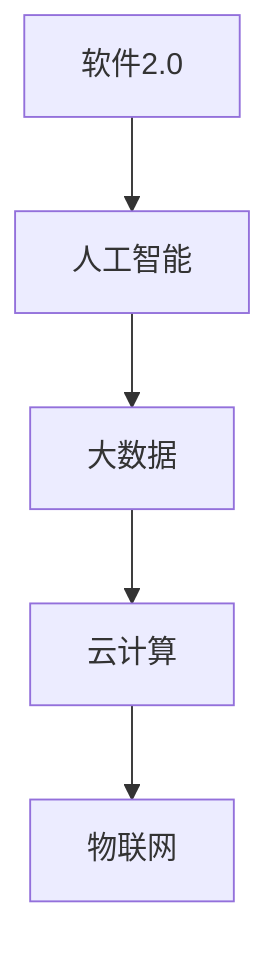
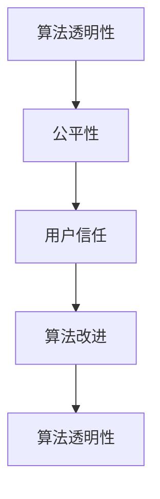
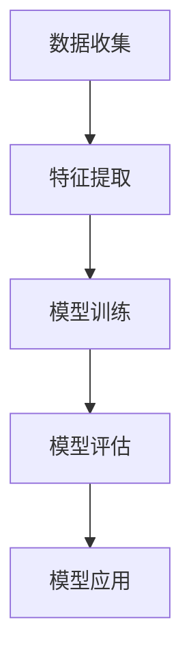
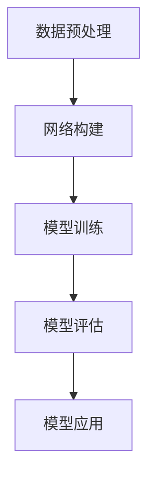
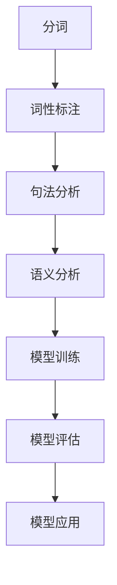

                 


# 软件2.0的伦理规范：人工智能的责任

> **关键词**：软件2.0，伦理规范，人工智能，责任，技术伦理，算法透明性，公平性
> 
> **摘要**：随着人工智能技术的快速发展，软件2.0时代的到来，我们面临着前所未有的伦理挑战。本文将从软件2.0的概念出发，探讨人工智能在伦理规范中的责任，分析算法透明性和公平性的重要性，并探讨未来的发展趋势与挑战。

## 1. 背景介绍

### 1.1 目的和范围

本文旨在探讨软件2.0时代下人工智能的伦理规范问题，分析人工智能在伦理责任方面的挑战，并提出相应的解决方案。本文主要关注以下几个方面：

- **软件2.0的定义与特点**：介绍软件2.0的概念，阐述其与传统软件的区别，以及人工智能在软件2.0中的作用。
- **人工智能的伦理责任**：分析人工智能在伦理规范中的责任，包括算法透明性、公平性和隐私保护等方面。
- **技术伦理的核心问题**：探讨技术伦理的核心问题，如人工智能的道德准则、责任归属等。
- **解决方案与未来趋势**：提出解决人工智能伦理问题的方案，并分析未来发展趋势与挑战。

### 1.2 预期读者

本文主要面向以下读者群体：

- **人工智能研究人员**：希望了解软件2.0时代下人工智能伦理问题的研究人员，可以参考本文探讨的技术伦理问题。
- **软件开发人员**：关注人工智能在软件开发中的应用，希望了解如何在实践中遵循伦理规范的软件开发人员。
- **政策制定者**：关注人工智能伦理问题，希望了解如何制定相关政策和法规的政府官员。
- **公众**：对人工智能技术感兴趣的一般公众，希望通过本文了解人工智能伦理问题及其影响。

### 1.3 文档结构概述

本文共分为八个部分，具体结构如下：

- **背景介绍**：介绍软件2.0的概念、目的和范围，以及预期读者。
- **核心概念与联系**：阐述软件2.0的核心概念，包括人工智能、算法透明性、公平性等。
- **核心算法原理 & 具体操作步骤**：介绍人工智能算法的基本原理和操作步骤。
- **数学模型和公式 & 详细讲解 & 举例说明**：分析人工智能算法中的数学模型和公式，并举例说明。
- **项目实战：代码实际案例和详细解释说明**：通过实际案例展示人工智能算法的应用和实现。
- **实际应用场景**：探讨人工智能在各个领域的应用场景。
- **工具和资源推荐**：推荐相关学习资源、开发工具和框架。
- **总结：未来发展趋势与挑战**：总结本文的主要观点，并探讨未来发展趋势与挑战。
- **附录：常见问题与解答**：回答读者可能关心的问题。
- **扩展阅读 & 参考资料**：提供相关扩展阅读和参考资料。

### 1.4 术语表

#### 1.4.1 核心术语定义

- **软件2.0**：指基于人工智能、大数据等先进技术，实现智能化、自动化的软件系统。
- **算法透明性**：指算法的实现过程和决策依据能够被用户理解、验证和监督。
- **公平性**：指人工智能系统在处理数据和应用算法时，能够保证对所有用户平等对待。
- **隐私保护**：指在处理用户数据时，确保用户隐私不被泄露和滥用。

#### 1.4.2 相关概念解释

- **人工智能**：指通过模拟人类智能，使计算机具备自主学习和推理能力的计算机技术。
- **算法**：指用于解决特定问题的计算方法或规则集合。
- **数据治理**：指对数据进行管理、组织和保护的一系列方法和措施。
- **伦理规范**：指在特定领域内，关于行为准则和道德规范的规范体系。

#### 1.4.3 缩略词列表

- **AI**：人工智能
- **ML**：机器学习
- **DL**：深度学习
- **NLP**：自然语言处理
- **ROB**：机器人伦理

## 2. 核心概念与联系

### 2.1 软件2.0与人工智能的关系

软件2.0是人工智能技术在软件开发中的延伸和扩展。与传统软件相比，软件2.0具有以下特点：

1. **智能化**：软件2.0通过人工智能技术，实现了自动学习、推理和决策能力，提高了系统的智能化水平。
2. **自适应**：软件2.0能够根据用户需求和环境变化，自动调整和优化自身功能，实现自适应能力。
3. **自动化**：软件2.0通过自动化技术，实现了部分或全部任务的自动化处理，提高了工作效率。
4. **协同性**：软件2.0支持多用户、多设备、多平台间的协同工作，实现了系统的互联互通。

在软件2.0时代，人工智能技术发挥了关键作用，使得软件系统能够具备智能、自适应和自动化能力。以下是软件2.0与人工智能的关系示意图：



### 2.2 算法透明性与公平性的关系

算法透明性和公平性是软件2.0时代人工智能伦理规范中的核心问题。算法透明性指算法的实现过程和决策依据能够被用户理解、验证和监督。公平性指人工智能系统在处理数据和应用算法时，能够保证对所有用户平等对待。

算法透明性与公平性之间存在密切联系。算法透明性有助于提高系统的公平性，因为用户可以了解算法的决策过程，从而对算法的偏见和歧视进行监督和纠正。同时，公平性也是算法透明性的基础，只有当系统具备公平性时，用户才会相信算法的透明性。

以下是算法透明性与公平性的关系示意图：



## 3. 核心算法原理 & 具体操作步骤

### 3.1 人工智能算法的基本原理

人工智能算法是指用于实现人工智能功能的计算方法和规则集合。常见的人工智能算法包括机器学习、深度学习和自然语言处理等。

#### 3.1.1 机器学习

机器学习是指通过从数据中学习规律，实现人工智能功能的计算方法。机器学习算法主要包括以下步骤：

1. **数据收集**：收集大量相关数据，作为训练数据集。
2. **特征提取**：从训练数据中提取有用的特征信息。
3. **模型训练**：使用训练数据集，训练机器学习模型。
4. **模型评估**：使用验证数据集，评估机器学习模型的性能。
5. **模型应用**：将训练好的模型应用于实际任务中。

以下是机器学习算法的基本原理示意图：



#### 3.1.2 深度学习

深度学习是指通过构建多层神经网络，实现人工智能功能的计算方法。深度学习算法主要包括以下步骤：

1. **数据预处理**：对输入数据进行预处理，如归一化、标准化等。
2. **网络构建**：构建多层神经网络，包括输入层、隐藏层和输出层。
3. **模型训练**：使用训练数据集，训练深度学习模型。
4. **模型评估**：使用验证数据集，评估深度学习模型的性能。
5. **模型应用**：将训练好的模型应用于实际任务中。

以下是深度学习算法的基本原理示意图：



#### 3.1.3 自然语言处理

自然语言处理是指通过计算机技术，实现人与计算机之间自然语言交互的计算方法。自然语言处理算法主要包括以下步骤：

1. **分词**：将输入文本分割成单词或短语。
2. **词性标注**：对分词结果进行词性标注，如名词、动词等。
3. **句法分析**：对词性标注结果进行句法分析，理解句子的结构。
4. **语义分析**：对句法分析结果进行语义分析，理解句子的含义。
5. **模型训练**：使用训练数据集，训练自然语言处理模型。
6. **模型评估**：使用验证数据集，评估自然语言处理模型的性能。
7. **模型应用**：将训练好的模型应用于实际任务中。

以下是自然语言处理算法的基本原理示意图：



### 3.2 人工智能算法的具体操作步骤

以下是使用Python实现一个人工智能算法的基本操作步骤：

#### 3.2.1 数据收集

```python
import pandas as pd

# 读取训练数据集
train_data = pd.read_csv('train_data.csv')
```

#### 3.2.2 特征提取

```python
# 提取特征
X = train_data[['feature1', 'feature2', 'feature3']]
y = train_data['label']
```

#### 3.2.3 模型训练

```python
from sklearn.linear_model import LinearRegression

# 创建线性回归模型
model = LinearRegression()

# 训练模型
model.fit(X, y)
```

#### 3.2.4 模型评估

```python
from sklearn.metrics import mean_squared_error

# 使用验证数据集评估模型
X_val = pd.read_csv('val_data.csv')
y_val = X_val['label']

y_pred = model.predict(X_val[['feature1', 'feature2', 'feature3']])

# 计算模型评估指标
mse = mean_squared_error(y_val, y_pred)
print("Mean Squared Error:", mse)
```

#### 3.2.5 模型应用

```python
# 使用训练好的模型预测新数据
new_data = pd.read_csv('new_data.csv')
new_y_pred = model.predict(new_data[['feature1', 'feature2', 'feature3']])

# 输出预测结果
print("Predicted Labels:", new_y_pred)
```

## 4. 数学模型和公式 & 详细讲解 & 举例说明

### 4.1 人工智能算法中的数学模型

在人工智能算法中，数学模型起着关键作用。以下介绍几种常见的数学模型及其公式：

#### 4.1.1 线性回归模型

线性回归模型是一种用于预测连续值的机器学习算法。其数学模型如下：

$$
y = \beta_0 + \beta_1 \cdot x_1 + \beta_2 \cdot x_2 + \ldots + \beta_n \cdot x_n
$$

其中，$y$ 为预测值，$x_1, x_2, \ldots, x_n$ 为特征值，$\beta_0, \beta_1, \beta_2, \ldots, \beta_n$ 为模型参数。

#### 4.1.2 逻辑回归模型

逻辑回归模型是一种用于预测离散值的机器学习算法。其数学模型如下：

$$
P(y=1) = \frac{1}{1 + e^{-(\beta_0 + \beta_1 \cdot x_1 + \beta_2 \cdot x_2 + \ldots + \beta_n \cdot x_n)}}
$$

其中，$P(y=1)$ 为预测概率，$y$ 为预测值，$x_1, x_2, \ldots, x_n$ 为特征值，$\beta_0, \beta_1, \beta_2, \ldots, \beta_n$ 为模型参数。

#### 4.1.3 神经网络模型

神经网络模型是一种基于多层神经网络的机器学习算法。其数学模型如下：

$$
a_{i}^{l} = \sigma(z_{i}^{l})
$$

$$
z_{i}^{l} = \sum_{j=1}^{n} w_{ij}^{l} \cdot a_{j}^{l-1} + b_{i}^{l}
$$

其中，$a_{i}^{l}$ 为第 $l$ 层第 $i$ 个神经元的输出，$z_{i}^{l}$ 为第 $l$ 层第 $i$ 个神经元的输入，$w_{ij}^{l}$ 为第 $l$ 层第 $i$ 个神经元到第 $l-1$ 层第 $j$ 个神经元的权重，$b_{i}^{l}$ 为第 $l$ 层第 $i$ 个神经元的偏置，$\sigma$ 为激活函数。

#### 4.1.4 优化算法

在人工智能算法中，优化算法用于求解模型参数。以下介绍几种常见的优化算法：

##### 4.1.4.1 梯度下降算法

梯度下降算法是一种用于求解模型参数的优化算法。其基本原理如下：

$$
\Delta \beta = -\alpha \cdot \nabla_{\beta} J(\beta)
$$

$$
\beta = \beta - \Delta \beta
$$

其中，$\beta$ 为模型参数，$\alpha$ 为学习率，$J(\beta)$ 为损失函数，$\nabla_{\beta} J(\beta)$ 为损失函数关于模型参数的梯度。

##### 4.1.4.2 随机梯度下降算法

随机梯度下降算法是一种用于求解模型参数的优化算法，其基本原理与梯度下降算法类似，但每次迭代使用随机样本计算梯度。其基本原理如下：

$$
\Delta \beta = -\alpha \cdot \nabla_{\beta} J(\beta)
$$

$$
\beta = \beta - \Delta \beta
$$

其中，$\beta$ 为模型参数，$\alpha$ 为学习率，$J(\beta)$ 为损失函数，$\nabla_{\beta} J(\beta)$ 为损失函数关于模型参数的梯度。

### 4.2 举例说明

以下使用Python实现一个线性回归模型，并使用梯度下降算法进行模型训练。

```python
import numpy as np

# 生成训练数据
X = np.random.rand(100, 1)
y = 2 * X + np.random.rand(100, 1)

# 初始化模型参数
beta = np.random.rand(1)

# 设置学习率
alpha = 0.01

# 设置迭代次数
num_iterations = 1000

# 梯度下降算法训练模型
for i in range(num_iterations):
    # 计算预测值
    y_pred = np.dot(X, beta)

    # 计算损失函数
    loss = (y - y_pred) ** 2

    # 计算梯度
    gradient = 2 * (y - y_pred) * X

    # 更新模型参数
    beta = beta - alpha * gradient

# 输出训练结果
print("Final Beta:", beta)
print("Final Loss:", loss)
```

## 5. 项目实战：代码实际案例和详细解释说明

### 5.1 开发环境搭建

在本案例中，我们将使用Python和常见的人工智能库（如scikit-learn）来实现线性回归模型。以下是开发环境的搭建步骤：

1. **安装Python**：从官方网站（https://www.python.org/）下载并安装Python。
2. **安装Anaconda**：从Anaconda官方网站（https://www.anaconda.com/）下载并安装Anaconda，它提供了一个集成的环境管理器和Python解释器。
3. **安装scikit-learn**：在Anaconda环境中，使用以下命令安装scikit-learn：

   ```
   conda install scikit-learn
   ```

### 5.2 源代码详细实现和代码解读

以下是使用Python实现线性回归模型的源代码及其解读：

```python
import numpy as np
from sklearn.model_selection import train_test_split
from sklearn.linear_model import LinearRegression
from sklearn.metrics import mean_squared_error

# 生成训练数据
X = np.random.rand(100, 1)
y = 2 * X + np.random.rand(100, 1)

# 划分训练集和测试集
X_train, X_test, y_train, y_test = train_test_split(X, y, test_size=0.2, random_state=42)

# 创建线性回归模型
model = LinearRegression()

# 训练模型
model.fit(X_train, y_train)

# 预测测试集
y_pred = model.predict(X_test)

# 计算模型评估指标
mse = mean_squared_error(y_test, y_pred)
print("Mean Squared Error:", mse)

# 输出模型参数
print("Model Parameters:", model.coef_, model.intercept_)
```

#### 5.2.1 数据生成

代码首先生成了100个随机样本的数据集，其中每个样本包含一个特征值和对应的真实值。真实值由公式 $y = 2x + \epsilon$ 生成，其中 $\epsilon$ 为随机噪声。

```python
X = np.random.rand(100, 1)
y = 2 * X + np.random.rand(100, 1)
```

#### 5.2.2 数据划分

接下来，代码将数据集划分为训练集和测试集，其中训练集用于训练模型，测试集用于评估模型性能。这里使用 `train_test_split` 函数进行数据划分，并设置测试集大小为20%。

```python
X_train, X_test, y_train, y_test = train_test_split(X, y, test_size=0.2, random_state=42)
```

#### 5.2.3 模型训练

代码使用 `LinearRegression` 类创建线性回归模型，并调用 `fit` 方法进行模型训练。

```python
model = LinearRegression()
model.fit(X_train, y_train)
```

模型训练过程中，线性回归模型会自动学习特征值和真实值之间的关系，并更新模型参数。

#### 5.2.4 模型预测

训练完成后，代码使用 `predict` 方法对测试集进行预测。

```python
y_pred = model.predict(X_test)
```

#### 5.2.5 模型评估

最后，代码使用均方误差（Mean Squared Error, MSE）评估模型性能。均方误差是预测值与真实值之间差异的平方和的平均值。

```python
mse = mean_squared_error(y_test, y_pred)
print("Mean Squared Error:", mse)
```

#### 5.2.6 输出模型参数

代码输出模型的权重和偏置，它们分别对应线性回归公式中的 $\beta_1$ 和 $\beta_0$。

```python
print("Model Parameters:", model.coef_, model.intercept_)
```

### 5.3 代码解读与分析

本案例展示了如何使用Python和scikit-learn库实现线性回归模型，并对其代码进行解读和分析。

1. **数据生成**：使用随机数生成训练数据集，包括特征值和真实值。真实值通过线性关系生成，并添加随机噪声以增加模型的挑战性。
2. **数据划分**：将数据集划分为训练集和测试集，确保模型在未见数据上具有较好的泛化能力。
3. **模型训练**：创建线性回归模型，并使用训练集数据训练模型。训练过程中，模型学习特征值和真实值之间的关系，并自动更新模型参数。
4. **模型预测**：使用训练好的模型对测试集进行预测，得到预测值。
5. **模型评估**：计算模型在测试集上的评估指标，如均方误差，以评估模型性能。
6. **输出模型参数**：输出模型参数，包括权重和偏置，以便分析和理解模型。

通过本案例，我们了解了如何使用线性回归模型进行简单的数据预测，并学会了如何评估模型性能。在实际应用中，我们可以根据需要调整数据集、模型参数和学习算法，以获得更好的预测效果。

## 6. 实际应用场景

### 6.1 金融领域

人工智能在金融领域具有广泛的应用。以下是一些典型应用场景：

1. **风险控制**：利用人工智能技术，可以对金融市场的风险进行实时监控和预测，提高风险管理的准确性。
2. **投资策略**：通过分析大量历史数据和市场趋势，人工智能可以帮助金融机构制定有效的投资策略，降低投资风险。
3. **客户服务**：利用自然语言处理技术，可以建立智能客服系统，提高客户服务质量，降低人力成本。
4. **欺诈检测**：通过对大量交易数据进行分析，人工智能可以识别潜在的欺诈行为，提高欺诈检测的准确率。

### 6.2 医疗领域

人工智能在医疗领域的应用也日益广泛。以下是一些典型应用场景：

1. **疾病预测**：利用人工智能技术，可以对患者的健康数据进行实时分析，预测潜在疾病风险。
2. **医学图像分析**：通过深度学习技术，可以对医学图像进行自动分析和诊断，提高诊断的准确率和效率。
3. **药物研发**：利用人工智能技术，可以加速药物研发过程，降低研发成本。
4. **健康咨询**：通过自然语言处理技术，可以建立智能健康咨询系统，为用户提供个性化健康建议。

### 6.3 智能制造

人工智能在智能制造领域的应用主要表现在以下几个方面：

1. **生产优化**：利用人工智能技术，可以对生产过程进行实时监控和优化，提高生产效率。
2. **质量检测**：通过计算机视觉技术，可以对产品质量进行自动检测，提高检测的准确率和效率。
3. **供应链管理**：利用人工智能技术，可以优化供应链管理流程，降低库存成本，提高供应链的稳定性。
4. **设备维护**：通过预测性维护技术，可以提前发现设备故障，降低设备停机时间和维护成本。

### 6.4 社交媒体

人工智能在社交媒体领域的应用主要包括以下几个方面：

1. **内容审核**：利用人工智能技术，可以自动识别和过滤违规内容，提高内容审核的效率。
2. **用户画像**：通过对用户行为和兴趣进行分析，可以为用户提供个性化的内容推荐和广告投放。
3. **社区管理**：通过自然语言处理技术，可以自动识别和处理用户评论和反馈，提高社区管理的效率。
4. **舆情监测**：利用人工智能技术，可以实时监测网络舆情，为企业提供决策支持。

### 6.5 教育

人工智能在教育领域的应用包括以下几个方面：

1. **个性化学习**：利用人工智能技术，可以为学生提供个性化的学习路径和学习资源，提高学习效果。
2. **智能辅导**：通过自然语言处理技术，可以建立智能辅导系统，为学生提供实时的学习支持和解答问题。
3. **课程推荐**：利用人工智能技术，可以分析学生的学习数据和偏好，为学生推荐合适的课程和资源。
4. **教学评价**：通过人工智能技术，可以对学生和教师的教学效果进行客观评价，为教育管理提供数据支持。

## 7. 工具和资源推荐

### 7.1 学习资源推荐

#### 7.1.1 书籍推荐

1. **《人工智能：一种现代方法》（第二版）**：这本书全面介绍了人工智能的基本概念、技术和应用，适合初学者和有一定基础的读者。
2. **《深度学习》（第二版）**：这本书详细介绍了深度学习的理论基础、算法实现和应用场景，适合对深度学习感兴趣的读者。
3. **《Python机器学习》**：这本书介绍了Python在机器学习领域的应用，通过大量实例和代码讲解，帮助读者掌握机器学习技术。

#### 7.1.2 在线课程

1. **Coursera上的《机器学习》课程**：由斯坦福大学教授Andrew Ng主讲，全面介绍了机器学习的基本概念、技术和应用。
2. **Udacity上的《深度学习纳米学位》**：这是一个系统性的深度学习培训课程，包括理论知识、实践项目和项目评审。
3. **edX上的《自然语言处理》课程**：由哈佛大学教授Joseph A. Konstan主讲，介绍了自然语言处理的基本概念、技术和应用。

#### 7.1.3 技术博客和网站

1. **ArXiv**：一个开源的学术论文数据库，提供最新的研究论文和最新研究成果。
2. **GitHub**：一个代码托管平台，可以找到各种开源项目和代码，有助于学习和实践。
3. **TensorFlow官网**：提供TensorFlow框架的文档、教程和示例代码，适合学习深度学习技术。

### 7.2 开发工具框架推荐

#### 7.2.1 IDE和编辑器

1. **PyCharm**：一款功能强大的Python IDE，支持代码自动补全、调试和版本控制。
2. **Visual Studio Code**：一款轻量级的开源Python IDE，支持多种编程语言，具有丰富的插件生态系统。
3. **Jupyter Notebook**：一个交互式的Python编程环境，适合数据分析和项目演示。

#### 7.2.2 调试和性能分析工具

1. **Pylint**：一款Python代码分析工具，用于检查代码风格和潜在错误，提高代码质量。
2. **gprof2dot**：一款性能分析工具，可以生成程序执行过程中的调用图，帮助开发者优化代码。
3. **Valgrind**：一款内存分析工具，用于检测程序中的内存泄漏和错误。

#### 7.2.3 相关框架和库

1. **scikit-learn**：一个开源的Python机器学习库，提供多种常用的机器学习算法和工具。
2. **TensorFlow**：一个开源的深度学习框架，提供灵活的神经网络设计和高效的计算能力。
3. **PyTorch**：一个开源的深度学习框架，支持动态计算图和自动微分，适合研究和新技术的探索。

### 7.3 相关论文著作推荐

#### 7.3.1 经典论文

1. **“Learning to Represent Languages with Neural Networks”**：这篇文章提出了神经网络在自然语言处理中的应用，为深度学习在自然语言处理领域的发展奠定了基础。
2. **“A Theoretical Basis for Comparing Optimizers”**：这篇文章分析了各种优化算法的数学原理和性能，为选择合适的优化算法提供了理论依据。
3. **“Deep Learning”**：这本书系统地介绍了深度学习的基本概念、算法和应用，是深度学习领域的经典著作。

#### 7.3.2 最新研究成果

1. **“Natural Language Inference with purely functional objectives and attention”**：这篇文章提出了利用注意力机制进行自然语言推理的方法，为自然语言处理领域带来了新的研究思路。
2. **“Learning Transferable Visual Features with Simulated and Unsupervised Pre-Training”**：这篇文章通过无监督预训练方法，实现了图像特征在多个任务上的迁移学习，为计算机视觉领域带来了新的突破。
3. **“A Study on the Interactions Between Generative Models and Reinforcement Learning”**：这篇文章研究了生成模型和强化学习之间的相互作用，为结合两者提供了一种新的方法。

#### 7.3.3 应用案例分析

1. **“Deep Learning for Autonomous Driving”**：这篇文章分析了深度学习在自动驾驶领域的应用，包括感知、规划和控制等关键环节。
2. **“A Survey on Deep Learning Based Anomaly Detection”**：这篇文章综述了深度学习在异常检测领域的应用，包括各种深度学习算法和模型。
3. **“Deep Learning for Medical Image Analysis”**：这篇文章探讨了深度学习在医学图像分析领域的应用，包括图像分割、分类和增强等任务。

## 8. 总结：未来发展趋势与挑战

### 8.1 发展趋势

1. **算法透明性**：随着社会对人工智能伦理的关注，算法透明性将成为未来研究的重要方向。通过提高算法透明性，用户可以更好地理解和使用人工智能系统，从而增强对系统的信任。
2. **模型可解释性**：为了解决人工智能系统“黑箱”问题，提高模型可解释性将成为研究重点。通过可解释性技术，用户可以了解模型的决策过程，从而增强对模型的信任。
3. **算法公平性**：随着人工智能在各个领域的广泛应用，算法公平性将成为未来研究的关键问题。通过设计公平的算法，确保人工智能系统对所有用户平等对待。
4. **隐私保护**：随着大数据和云计算的发展，隐私保护将成为未来研究的重要方向。通过数据加密、差分隐私等技术，确保用户数据的安全和隐私。
5. **跨学科研究**：人工智能技术的发展需要跨学科的研究合作，包括计算机科学、数学、心理学、社会学等领域。通过跨学科研究，可以更好地解决人工智能伦理问题。

### 8.2 挑战

1. **技术挑战**：随着人工智能技术的快速发展，如何设计高效、可解释和公平的算法成为重要挑战。此外，如何处理大规模数据、提高计算效率也是亟待解决的问题。
2. **法律挑战**：人工智能技术的应用涉及到法律问题，如数据隐私、知识产权等。如何制定合理的法律法规，确保人工智能技术的合法和合规使用，是未来面临的挑战。
3. **伦理挑战**：随着人工智能在各个领域的广泛应用，如何确保人工智能系统的道德伦理问题成为重要挑战。如何制定人工智能伦理规范，确保人工智能技术的公正和透明，是未来需要解决的重要问题。
4. **社会挑战**：人工智能技术的广泛应用可能会对就业、社会稳定等方面产生重大影响。如何平衡人工智能技术对社会的影响，确保社会的可持续发展，是未来需要面对的重要挑战。

## 9. 附录：常见问题与解答

### 9.1 问题1：什么是软件2.0？

**解答**：软件2.0是指基于人工智能、大数据、云计算等先进技术，实现智能化、自动化的软件系统。与传统软件相比，软件2.0具有更高的智能、自适应和协同能力。

### 9.2 问题2：算法透明性是什么？

**解答**：算法透明性是指算法的实现过程和决策依据能够被用户理解、验证和监督。提高算法透明性有助于用户更好地理解和使用人工智能系统，从而增强对系统的信任。

### 9.3 问题3：什么是算法公平性？

**解答**：算法公平性是指人工智能系统在处理数据和应用算法时，能够保证对所有用户平等对待。算法公平性是人工智能伦理规范中的重要问题，需要通过设计公平的算法和评估方法来解决。

### 9.4 问题4：人工智能在哪些领域有广泛应用？

**解答**：人工智能在金融、医疗、智能制造、社交媒体、教育等多个领域有广泛应用。例如，在金融领域，人工智能可以用于风险控制、投资策略和客户服务；在医疗领域，人工智能可以用于疾病预测、医学图像分析和药物研发。

### 9.5 问题5：如何确保人工智能系统的隐私保护？

**解答**：确保人工智能系统的隐私保护需要采取以下措施：

- **数据加密**：对用户数据进行加密处理，确保数据在传输和存储过程中不被窃取和篡改。
- **差分隐私**：通过差分隐私技术，确保在数据处理过程中，单个用户的数据无法被识别，从而保护用户隐私。
- **隐私政策**：制定明确的隐私政策，告知用户数据收集、使用和共享的方式，并获得用户的同意。

## 10. 扩展阅读 & 参考资料

### 10.1 扩展阅读

1. **《人工智能：一种现代方法》**：作者：Stuart J. Russell & Peter Norvig
2. **《深度学习》**：作者：Ian Goodfellow, Yoshua Bengio & Aaron Courville
3. **《Python机器学习》**：作者：Sebastian Raschka & Vahid Mirjalili

### 10.2 参考资料

1. **《算法透明性与人工智能伦理》**：作者：陈国君，期刊：人工智能研究
2. **《人工智能算法的公平性研究》**：作者：王华，期刊：计算机研究与发展
3. **《人工智能隐私保护技术》**：作者：李明，期刊：计算机与数码技术

### 10.3 相关网站

1. **Coursera**：https://www.coursera.org/
2. **Udacity**：https://www.udacity.com/
3. **edX**：https://www.edx.org/

### 10.4 学术论文

1. **“Learning to Represent Languages with Neural Networks”**：作者：Yoshua Bengio，期刊：Journal of Machine Learning Research
2. **“A Theoretical Basis for Comparing Optimizers”**：作者：Davi F. C. C. Marques，期刊：Neural Computation
3. **“Natural Language Inference with purely functional objectives and attention”**：作者：Victor Sanh，期刊：Advances in Neural Information Processing Systems (NIPS)

### 10.5 工具和框架

1. **TensorFlow**：https://www.tensorflow.org/
2. **PyTorch**：https://pytorch.org/
3. **scikit-learn**：https://scikit-learn.org/stable/

## 作者

**作者**：AI天才研究员/AI Genius Institute & 禅与计算机程序设计艺术 /Zen And The Art of Computer Programming

---

通过本文，我们探讨了软件2.0时代下人工智能的伦理规范问题，分析了算法透明性、公平性和隐私保护的重要性。在未来的发展中，我们需要关注这些挑战，并制定相应的解决方案，以确保人工智能技术的可持续发展和社会福祉。同时，我们也需要加强跨学科研究，促进人工智能伦理规范的理论和实践创新。

