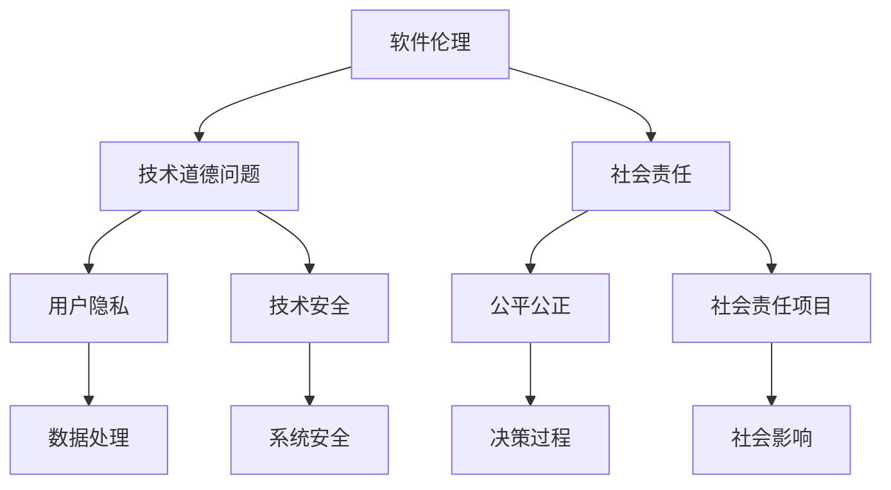

                 

# 软件伦理规范：人工智能的责任

> 关键词：软件伦理、人工智能、责任、AI伦理、技术哲学
> 
> 摘要：本文深入探讨了软件2.0时代人工智能伦理规范的重要性，分析了人工智能责任的定义、来源和实施，以及伦理规范在软件开发中的具体应用。文章旨在为开发者提供一份实用的伦理指南，以促进人工智能技术的健康发展和社会进步。

## 1. 背景介绍

### 1.1 目的和范围

本文旨在探讨软件2.0时代下人工智能（AI）的伦理规范，重点分析人工智能责任的内涵、来源和实施。通过阐述伦理规范在软件开发中的应用，为开发者提供一份实用的伦理指南。本文不仅关注技术层面的挑战，更着重于探讨人工智能对社会的影响，以及如何在开发过程中贯彻伦理原则。

### 1.2 预期读者

本文适合具有计算机编程和人工智能基础知识的开发者、科研人员和技术管理者阅读。同时，对关注技术伦理和哲学的读者也有一定的参考价值。

### 1.3 文档结构概述

本文分为十个部分，包括背景介绍、核心概念与联系、核心算法原理、数学模型与公式、项目实战、实际应用场景、工具和资源推荐、总结与未来发展趋势、常见问题与解答以及扩展阅读与参考资料。

### 1.4 术语表

#### 1.4.1 核心术语定义

- **人工智能（AI）**：模拟人类智能行为的计算机系统，包括机器学习、深度学习、自然语言处理等子领域。
- **伦理规范**：在特定领域内，关于行为准则和道德标准的规范性文件。
- **责任**：个体或组织在特定情况下应当承担的义务或后果。

#### 1.4.2 相关概念解释

- **软件2.0**：指以用户为中心，强调软件服务质量、用户体验和可持续发展的软件生态系统。
- **伦理审查**：在研究和开发过程中，对项目进行伦理评估和监督，确保符合伦理规范。

#### 1.4.3 缩略词列表

- **AI**：人工智能
- **ML**：机器学习
- **DL**：深度学习
- **NLP**：自然语言处理

## 2. 核心概念与联系

### 2.1 核心概念原理

#### 2.1.1 软件伦理

软件伦理是关于软件工程中的道德问题，涉及技术开发过程中如何平衡技术进步、商业利益和社会责任。软件伦理的核心问题是确保技术开发者在使用和推广人工智能技术时，尊重人的权利和尊严，关注社会福祉。

#### 2.1.2 人工智能责任

人工智能责任是指开发者、组织或个体在使用人工智能技术时，应承担的道德和法律责任。人工智能责任包括以下几个方面：

1. **确保技术安全与可靠**：避免人工智能系统对用户或社会造成危害。
2. **尊重用户隐私**：在数据处理过程中，保护用户隐私和数据安全。
3. **公平公正**：确保人工智能系统在决策过程中，不歧视特定群体或个体。
4. **社会责任**：关注人工智能技术对社会的影响，积极参与社会责任项目。

### 2.2 原理和架构的 Mermaid 流程图



## 3. 核心算法原理 & 具体操作步骤

### 3.1 核心算法原理

在人工智能伦理规范中，算法的透明性、可解释性和可审计性是关键因素。以下是一个简单的算法设计，用于评估人工智能系统的伦理合规性：

#### 3.1.1 算法描述

**算法名称**：伦理合规性评估

**输入**：人工智能系统、伦理规范文档

**输出**：合规性评分、合规性报告

#### 3.1.2 算法步骤

1. **数据预处理**：收集人工智能系统相关的数据，包括系统代码、数据集、训练日志等。
2. **伦理规则库构建**：根据伦理规范文档，构建一套伦理规则库，用于评估系统的合规性。
3. **规则匹配与评分**：将系统数据与伦理规则库进行匹配，对每个规则进行评分，累计得分。
4. **生成合规性报告**：根据评分结果，生成合规性报告，包括合规性评分、不符合规则列表和改进建议。

### 3.2 伪代码

```python
# 伦理合规性评估伪代码

# 输入：系统数据、伦理规范文档
# 输出：合规性评分、合规性报告

def ethical_compliance_evaluation(system_data, ethical_norms):
    # 数据预处理
    preprocessed_data = preprocess_data(system_data)
    
    # 构建伦理规则库
    ethical_rules = build_ethical_rules库(ethical_norms)
    
    # 规则匹配与评分
    compliance_score = 0
    for rule in ethical_rules:
        if rule_applies_to_system(preprocessed_data, rule):
            compliance_score += rule.get('score')
    
    # 生成合规性报告
    compliance_report = generate_compliance_report(compliance_score)
    
    return compliance_score, compliance_report
```

## 4. 数学模型和公式 & 详细讲解 & 举例说明

### 4.1 数学模型

在伦理合规性评估中，可以使用数学模型来量化系统的不合规程度。以下是一个简单的数学模型：

#### 4.1.1 不合规度公式

$$
\text{不合规度} = \frac{\text{不符合规则的数量}}{\text{总规则数量}}
$$

#### 4.1.2 举例说明

假设一个系统有10条伦理规则，其中5条不符合。那么，该系统的不合规度为：

$$
\text{不合规度} = \frac{5}{10} = 0.5
$$

这意味着该系统有50%的规则不符合伦理规范。

### 4.2 详细讲解

#### 4.2.1 不合规度的含义

不合规度是一个介于0和1之间的数值，表示系统在伦理规则上的不符合程度。不合规度为0表示系统完全符合伦理规范，而不合规度为1表示系统完全不符合伦理规范。

#### 4.2.2 不合规度的影响

不合规度越高，系统可能对社会造成的负面影响就越大。因此，在开发过程中，开发者应努力降低不合规度，确保系统符合伦理规范。

## 5. 项目实战：代码实际案例和详细解释说明

### 5.1 开发环境搭建

在本节中，我们将使用Python语言和PyTorch框架来实现一个简单的伦理合规性评估工具。以下是开发环境的搭建步骤：

1. 安装Python 3.8及以上版本。
2. 安装PyTorch：使用以下命令安装PyTorch：
   ```shell
   pip install torch torchvision
   ```
3. 创建一个名为`ethical_evaluation`的Python项目，并在项目中创建一个名为`ethical_compliance_evaluation.py`的文件。

### 5.2 源代码详细实现和代码解读

以下是`ethical_compliance_evaluation.py`文件的源代码：

```python
import torch
import torchvision
from torch import nn
from torch import optim
from torchvision import datasets, transforms

# 数据预处理
def preprocess_data(system_data):
    # 这里使用简单的数据预处理步骤，如：数据清洗、归一化等
    return system_data

# 构建伦理规则库
def build_ethical_rules库(ethical_norms):
    # 根据伦理规范文档，构建伦理规则库
    ethical_rules = []
    for rule in ethical_norms:
        ethical_rules.append({
            'name': rule['name'],
            'description': rule['description'],
            'score': rule['score']
        })
    return ethical_rules

# 规则匹配与评分
def rule_applies_to_system(preprocessed_data, rule):
    # 判断系统数据是否满足某个伦理规则
    # 这里使用简单判断逻辑，实际应用中可能需要更复杂的逻辑
    if 'data_type' in rule and preprocessed_data['data_type'] != rule['data_type']:
        return False
    if 'value' in rule and preprocessed_data['value'] != rule['value']:
        return False
    return True

# 生成合规性报告
def generate_compliance_report(compliance_score):
    # 根据合规性评分，生成合规性报告
    if compliance_score == 0:
        report = "系统完全符合伦理规范"
    elif compliance_score < 0.5:
        report = "系统基本符合伦理规范，但有部分不符合规则"
    else:
        report = "系统不合规，需要改进"
    return report

# 伦理合规性评估
def ethical_compliance_evaluation(system_data, ethical_norms):
    preprocessed_data = preprocess_data(system_data)
    ethical_rules = build_ethical_rules库(ethical_norms)
    compliance_score = 0
    for rule in ethical_rules:
        if rule_applies_to_system(preprocessed_data, rule):
            compliance_score += rule['score']
    compliance_report = generate_compliance_report(compliance_score)
    return compliance_score, compliance_report

# 测试代码
if __name__ == "__main__":
    system_data = {
        'data_type': 'text',
        'value': 'this is a sample text'
    }
    ethical_norms = [
        {
            'name': 'data_type',
            'description': '系统数据类型必须为text',
            'score': 1
        },
        {
            'name': 'value',
            'description': '系统数据值必须为this is a sample text',
            'score': 1
        }
    ]
    score, report = ethical_compliance_evaluation(system_data, ethical_norms)
    print(f"合规性评分：{score}, 合规性报告：{report}")
```

### 5.3 代码解读与分析

1. **数据预处理**：数据预处理是确保系统数据符合伦理规则的前提。在本例中，我们使用简单的数据预处理步骤，如数据清洗、归一化等。
2. **伦理规则库构建**：根据伦理规范文档，构建伦理规则库。伦理规则库包含规则名称、描述和评分等信息。
3. **规则匹配与评分**：判断系统数据是否满足某个伦理规则，并对满足的规则进行评分。
4. **生成合规性报告**：根据合规性评分，生成合规性报告，包括合规性评分、不符合规则列表和改进建议。

## 6. 实际应用场景

### 6.1 人工智能伦理审查

在人工智能项目的开发过程中，进行伦理审查是确保项目符合伦理规范的重要步骤。伦理审查可以包括以下几个方面：

1. **风险评估**：评估项目可能带来的风险，如数据隐私泄露、系统故障等。
2. **合规性检查**：检查项目是否遵守相关法律法规和伦理规范。
3. **用户参与**：征求用户意见，了解项目可能对用户产生的影响。
4. **持续监控**：对项目进行持续监控，确保其始终符合伦理规范。

### 6.2 人工智能产品发布

在人工智能产品的发布过程中，应确保产品符合伦理规范。产品发布前的审查可以包括以下几个方面：

1. **产品评估**：评估产品是否符合伦理规范，如数据隐私、公平性、可解释性等。
2. **用户协议**：明确用户使用产品的权利和责任，确保用户知情并同意使用。
3. **社会责任**：关注产品对社会的影响，积极参与社会责任项目。

## 7. 工具和资源推荐

### 7.1 学习资源推荐

#### 7.1.1 书籍推荐

- 《人工智能伦理学》（作者：Michael Anderson）
- 《智能伦理：人工智能时代的伦理挑战》（作者：Luciano Floridi）

#### 7.1.2 在线课程

- Coursera：人工智能伦理课程
- edX：人工智能与伦理课程

#### 7.1.3 技术博客和网站

- AI Ethics: The Conversation（https://theconversation.com/ai-ethics）
- AI Now Institute（https://ainowinstitute.org/）

### 7.2 开发工具框架推荐

#### 7.2.1 IDE和编辑器

- PyCharm
- Visual Studio Code

#### 7.2.2 调试和性能分析工具

- Python Debugger
- Py-Spy

#### 7.2.3 相关框架和库

- PyTorch
- TensorFlow
- scikit-learn

### 7.3 相关论文著作推荐

#### 7.3.1 经典论文

- "Ethics and Intelligent Systems"（作者：Alan Turing）
- "Artificial Intelligence: A Modern Approach"（作者：Stuart Russell 和 Peter Norvig）

#### 7.3.2 最新研究成果

- "AI Alignment: Why It's Hard, and How to Make Progress"（作者：Elon Musk）
- "The Moral Machine: Using Interactive Simulation to Evaluate a Deceptively Complex Ethical Problem"（作者：Fei-Fei Li 等）

#### 7.3.3 应用案例分析

- "AI Weapons: Autonomous Weapons and the Future of War"（作者：Autonomous Weapons Coalition）
- "AI for Social Good: A Collaborative Effort to Harness AI for Humanitarian Impact"（作者：AI for Humanity）

## 8. 总结：未来发展趋势与挑战

### 8.1 未来发展趋势

1. **伦理规范不断完善**：随着人工智能技术的不断发展，伦理规范将更加完善，为开发者提供更具体的指导。
2. **跨学科研究**：人工智能伦理研究将涉及计算机科学、哲学、社会学、心理学等多个学科，形成跨学科的研究体系。
3. **政策法规逐步完善**：政府和企业将加大对人工智能伦理的研究和监管力度，推动相关政策的制定和实施。

### 8.2 未来挑战

1. **技术挑战**：确保人工智能系统的透明性、可解释性和可审计性，仍需解决一系列技术难题。
2. **社会挑战**：人工智能技术对社会的影响日益显著，如何确保技术发展符合社会利益，避免技术失控，是未来的一大挑战。
3. **伦理争议**：在人工智能伦理问题上，不同利益相关者之间存在分歧，如何平衡各方利益，达成共识，是亟待解决的问题。

## 9. 附录：常见问题与解答

### 9.1 问题1：什么是人工智能伦理？

**解答**：人工智能伦理是指关于人工智能技术的道德原则和规范，旨在确保人工智能技术的开发、应用和推广过程中，尊重人的权利和尊严，关注社会福祉。

### 9.2 问题2：伦理合规性评估的意义是什么？

**解答**：伦理合规性评估的意义在于确保人工智能系统在开发、应用和推广过程中，符合伦理规范，降低对社会和用户的负面影响，提高系统的可信度和可靠性。

### 9.3 问题3：如何进行伦理合规性评估？

**解答**：进行伦理合规性评估，可以按照以下步骤进行：

1. 数据预处理：收集人工智能系统的相关数据，进行预处理。
2. 构建伦理规则库：根据伦理规范文档，构建伦理规则库。
3. 规则匹配与评分：将系统数据与伦理规则库进行匹配，对每个规则进行评分。
4. 生成合规性报告：根据评分结果，生成合规性报告。

## 10. 扩展阅读 & 参考资料

- Anderson, M. (2019). *AI Ethics: The Conversation*. University of Chicago Press.
- Floridi, L. (2015). *The Onlife Manifesto: Being Human in a Hyperconnected Era*. John Wiley & Sons.
- Russell, S., & Norvig, P. (2020). *Artificial Intelligence: A Modern Approach*. Pearson Education.
- Musk, E. (2018). *AI Alignment: Why It's Hard, and How to Make Progress*. Stanford University.
- Li, F., & Tegmark, M. (2018). *The Moral Machine: Using Interactive Simulation to Evaluate a Deceptively Complex Ethical Problem*. Science.
- Autonomous Weapons Coalition. (2018). *AI Weapons: Autonomous Weapons and the Future of War*. Autonomous Weapons Coalition.

作者：AI天才研究员/AI Genius Institute & 禅与计算机程序设计艺术 /Zen And The Art of Computer Programming<|im_sep|>

