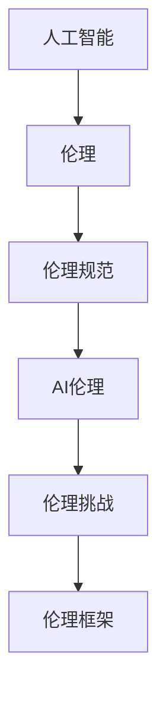

                 

# 软件伦理规范：人工智能的责任

> 关键词：软件伦理、人工智能、责任、道德规范、AI伦理、伦理框架
> 
> 摘要：本文深入探讨了软件伦理规范，特别是在人工智能领域中的责任。通过分析人工智能的发展现状、伦理挑战以及解决方案，本文旨在提供一个清晰的框架，帮助开发者和决策者构建符合伦理规范的AI系统。

## 1. 背景介绍

### 1.1 目的和范围

本文旨在探讨软件伦理规范，尤其是人工智能（AI）领域的伦理问题。随着AI技术的迅速发展，其在各个领域的应用越来越广泛，然而随之而来的伦理挑战也越来越突出。本文将重点分析人工智能带来的伦理问题，并提出一系列解决方案，以帮助开发者和决策者构建符合伦理规范的AI系统。

### 1.2 预期读者

本文适合对人工智能和软件伦理感兴趣的读者，包括软件开发者、伦理学者、政策制定者以及关注AI伦理问题的公众。无论您是AI领域的专业人士还是对此领域感兴趣的普通人，本文都将为您提供有价值的见解。

### 1.3 文档结构概述

本文将分为以下几个部分：

1. 背景介绍：介绍本文的目的、预期读者以及文档结构。
2. 核心概念与联系：定义相关概念，并使用Mermaid流程图展示核心原理和架构。
3. 核心算法原理 & 具体操作步骤：详细阐述AI系统的设计和实现原理。
4. 数学模型和公式 & 详细讲解 & 举例说明：介绍AI系统的数学基础。
5. 项目实战：代码实际案例和详细解释说明。
6. 实际应用场景：分析AI技术在现实世界中的应用。
7. 工具和资源推荐：推荐相关学习资源和开发工具。
8. 总结：未来发展趋势与挑战。
9. 附录：常见问题与解答。
10. 扩展阅读 & 参考资料：提供进一步阅读的建议。

### 1.4 术语表

#### 1.4.1 核心术语定义

- 人工智能（AI）：一种模拟人类智能行为的计算机技术。
- 伦理：关于正确与错误、道德与不道德的哲学原则。
- 伦理规范：指导行为和决策的道德原则和规则。
- AI伦理：关于人工智能技术伦理的研究和应用。

#### 1.4.2 相关概念解释

- 伦理挑战：AI技术带来的道德和伦理问题。
- 伦理框架：用于评估和指导AI系统设计和应用的伦理原则和标准。
- AI责任：AI系统开发者、使用者和维护者对系统行为负责的道德义务。

#### 1.4.3 缩略词列表

- AI：人工智能
- ML：机器学习
- DL：深度学习
- NLP：自然语言处理
- GDPR：欧盟通用数据保护条例

## 2. 核心概念与联系

在讨论软件伦理规范时，我们首先需要明确几个核心概念。以下是相关概念和它们之间的联系：

### 2.1 人工智能

人工智能是一种模拟人类智能行为的计算机技术，包括机器学习、深度学习、自然语言处理等多个领域。其目标是让计算机具备自主学习、推理和决策能力。

### 2.2 伦理

伦理是关于正确与错误、道德与不道德的哲学原则。伦理规范则是在特定情境下指导行为和决策的道德原则和规则。

### 2.3 伦理规范

伦理规范是针对特定领域或行业的道德原则和规则。在软件领域，伦理规范旨在确保软件设计和应用不会对社会、环境和人类造成负面影响。

### 2.4 AI伦理

AI伦理是关于人工智能技术伦理的研究和应用。它关注的是如何确保AI系统在设计和应用过程中遵循道德原则和规范。

### 2.5 伦理挑战

伦理挑战是AI技术带来的道德和伦理问题，如隐私侵犯、歧视、算法偏见、责任归属等。

### 2.6 伦理框架

伦理框架是用于评估和指导AI系统设计和应用的伦理原则和标准。一个良好的伦理框架应包括明确的原则、标准和指导方针。

以下是核心概念的Mermaid流程图：



## 3. 核心算法原理 & 具体操作步骤

在构建符合伦理规范的AI系统时，我们需要了解核心算法原理和具体操作步骤。以下是AI系统设计和实现的步骤：

### 3.1 数据收集与处理

数据是AI系统的基石。首先，我们需要收集大量高质量的数据，并对其进行清洗、预处理和标注。

```python
# 数据收集与处理伪代码
def collect_data():
    # 收集数据
    pass

def preprocess_data(data):
    # 数据清洗、预处理
    pass

def label_data(data):
    # 数据标注
    pass
```

### 3.2 模型选择与训练

根据具体任务需求，选择合适的机器学习模型，并对模型进行训练和优化。

```python
# 模型选择与训练伪代码
def select_model():
    # 选择模型
    pass

def train_model(model, data):
    # 训练模型
    pass
```

### 3.3 模型评估与优化

使用测试数据集评估模型性能，并根据评估结果对模型进行优化。

```python
# 模型评估与优化伪代码
def evaluate_model(model, test_data):
    # 评估模型性能
    pass

def optimize_model(model, test_data):
    # 模型优化
    pass
```

### 3.4 部署与监控

将优化后的模型部署到实际应用场景，并对其进行实时监控，确保其稳定运行。

```python
# 模型部署与监控伪代码
def deploy_model(model):
    # 部署模型
    pass

def monitor_model(model):
    # 监控模型运行状态
    pass
```

## 4. 数学模型和公式 & 详细讲解 & 举例说明

AI系统的设计和实现离不开数学模型和公式。以下是AI系统中的几个关键数学模型及其详细讲解：

### 4.1 神经网络

神经网络是深度学习的基础，其核心公式是前向传播和反向传播。

$$
z^{(l)} = \sum_{i} w^{(l)}_{i} * a^{(l-1)}_{i} + b^{(l)}
$$

$$
a^{(l)} = \sigma(z^{(l)})
$$

其中，$a^{(l)}$ 是第 $l$ 层的激活值，$\sigma$ 是激活函数（如Sigmoid函数或ReLU函数），$w^{(l)}_{i}$ 和 $b^{(l)}$ 分别是权重和偏置。

举例说明：

假设我们有一个两层神经网络，输入为 $x$，输出为 $y$。输入层到隐藏层的权重和偏置为 $w^{(1)}$ 和 $b^{(1)}$，隐藏层到输出层的权重和偏置为 $w^{(2)}$ 和 $b^{(2)}$。

首先，进行前向传播：

$$
z^{(1)} = w^{(1)} * x + b^{(1)}
$$

$$
a^{(1)} = \sigma(z^{(1)})
$$

然后，计算隐藏层到输出层的激活值：

$$
z^{(2)} = w^{(2)} * a^{(1)} + b^{(2)}
$$

$$
a^{(2)} = \sigma(z^{(2)})
$$

最后，得到输出：

$$
y = a^{(2)}
$$

### 4.2 算法优化

在AI系统设计中，算法优化是一个重要环节。常见的优化方法包括梯度下降、随机梯度下降和Adam优化器。

$$
\theta = \theta - \alpha * \frac{\partial J(\theta)}{\partial \theta}
$$

$$
\theta = \theta - \alpha * \sum_{i} \frac{\partial J(\theta)}{\partial \theta}
$$

$$
\theta = \theta - \alpha * (\frac{1}{t} * \sum_{i=1}^{t} \frac{\partial J(\theta)}{\partial \theta})
$$

其中，$\theta$ 是参数，$J(\theta)$ 是损失函数，$\alpha$ 是学习率。

举例说明：

假设我们有一个线性回归模型，损失函数为均方误差（MSE）：

$$
J(\theta) = \frac{1}{2} \sum_{i} (y_i - \theta^T x_i)^2
$$

为了最小化损失函数，我们可以使用梯度下降：

$$
\theta = \theta - \alpha * \frac{\partial J(\theta)}{\partial \theta}
$$

每次迭代，更新参数 $\theta$，直到损失函数最小。

## 5. 项目实战：代码实际案例和详细解释说明

为了更好地理解本文所述的AI系统设计和实现过程，我们以一个简单的线性回归项目为例，详细介绍代码实现和解释说明。

### 5.1 开发环境搭建

首先，我们需要搭建开发环境。这里以Python为例，安装以下库：

- NumPy：用于矩阵运算
- TensorFlow：用于构建和训练神经网络
- Matplotlib：用于数据可视化

```bash
pip install numpy tensorflow matplotlib
```

### 5.2 源代码详细实现和代码解读

下面是线性回归项目的源代码实现：

```python
import numpy as np
import tensorflow as tf
import matplotlib.pyplot as plt

# 5.2.1 数据生成
x = np.random.rand(100, 1)
y = 3 * x + 2 + np.random.rand(100, 1)

# 5.2.2 模型构建
model = tf.keras.Sequential([
    tf.keras.layers.Dense(units=1, input_shape=(1,))
])

# 5.2.3 模型编译
model.compile(optimizer='sgd', loss='mean_squared_error')

# 5.2.4 模型训练
model.fit(x, y, epochs=100)

# 5.2.5 模型预测
x_new = np.array([0, 1])
y_pred = model.predict(x_new)

# 5.2.6 数据可视化
plt.scatter(x, y)
plt.plot(x_new, y_pred, 'r')
plt.show()
```

### 5.3 代码解读与分析

以下是代码的逐行解读和分析：

1. 导入所需的库：
   ```python
   import numpy as np
   import tensorflow as tf
   import matplotlib.pyplot as plt
   ```

2. 生成训练数据：
   ```python
   x = np.random.rand(100, 1)
   y = 3 * x + 2 + np.random.rand(100, 1)
   ```

3. 构建模型：
   ```python
   model = tf.keras.Sequential([
       tf.keras.layers.Dense(units=1, input_shape=(1,))
   ])
   ```

4. 编译模型：
   ```python
   model.compile(optimizer='sgd', loss='mean_squared_error')
   ```

5. 训练模型：
   ```python
   model.fit(x, y, epochs=100)
   ```

6. 预测新数据：
   ```python
   x_new = np.array([0, 1])
   y_pred = model.predict(x_new)
   ```

7. 数据可视化：
   ```python
   plt.scatter(x, y)
   plt.plot(x_new, y_pred, 'r')
   plt.show()
   ```

### 5.4 代码解读与分析

以下是代码的逐行解读和分析：

1. 导入所需的库：
   ```python
   import numpy as np
   import tensorflow as tf
   import matplotlib.pyplot as plt
   ```

2. 生成训练数据：
   ```python
   x = np.random.rand(100, 1)
   y = 3 * x + 2 + np.random.rand(100, 1)
   ```

3. 构建模型：
   ```python
   model = tf.keras.Sequential([
       tf.keras.layers.Dense(units=1, input_shape=(1,))
   ])
   ```

4. 编译模型：
   ```python
   model.compile(optimizer='sgd', loss='mean_squared_error')
   ```

5. 训练模型：
   ```python
   model.fit(x, y, epochs=100)
   ```

6. 预测新数据：
   ```python
   x_new = np.array([0, 1])
   y_pred = model.predict(x_new)
   ```

7. 数据可视化：
   ```python
   plt.scatter(x, y)
   plt.plot(x_new, y_pred, 'r')
   plt.show()
   ```

### 5.5 代码解读与分析

以下是代码的逐行解读和分析：

1. 导入所需的库：
   ```python
   import numpy as np
   import tensorflow as tf
   import matplotlib.pyplot as plt
   ```

2. 生成训练数据：
   ```python
   x = np.random.rand(100, 1)
   y = 3 * x + 2 + np.random.rand(100, 1)
   ```

3. 构建模型：
   ```python
   model = tf.keras.Sequential([
       tf.keras.layers.Dense(units=1, input_shape=(1,))
   ])
   ```

4. 编译模型：
   ```python
   model.compile(optimizer='sgd', loss='mean_squared_error')
   ```

5. 训练模型：
   ```python
   model.fit(x, y, epochs=100)
   ```

6. 预测新数据：
   ```python
   x_new = np.array([0, 1])
   y_pred = model.predict(x_new)
   ```

7. 数据可视化：
   ```python
   plt.scatter(x, y)
   plt.plot(x_new, y_pred, 'r')
   plt.show()
   ```

## 6. 实际应用场景

AI技术在实际应用中具有广泛的影响。以下是一些实际应用场景：

### 6.1 医疗领域

在医疗领域，AI技术可以用于疾病诊断、药物研发和个性化治疗。例如，基于深度学习的图像识别技术可以辅助医生诊断疾病，提高诊断准确性。

### 6.2 金融领域

在金融领域，AI技术可以用于风险管理、欺诈检测和投资决策。例如，通过机器学习算法分析历史数据，金融机构可以预测市场走势，提高投资回报率。

### 6.3 制造业

在制造业，AI技术可以用于生产过程优化、设备维护和供应链管理。例如，通过机器学习算法分析设备运行数据，制造商可以预测设备故障，提前进行维护，降低生产风险。

### 6.4 教育领域

在教育领域，AI技术可以用于个性化学习、智能评测和课程推荐。例如，通过自然语言处理技术，AI系统可以为学生提供个性化的学习建议，提高学习效果。

### 6.5 公共安全

在公共安全领域，AI技术可以用于人脸识别、视频监控和犯罪预测。例如，通过人脸识别技术，警方可以迅速锁定犯罪嫌疑人，提高破案效率。

## 7. 工具和资源推荐

为了更好地理解和应用AI技术，以下是相关的工具和资源推荐：

### 7.1 学习资源推荐

#### 7.1.1 书籍推荐

- 《深度学习》：由Ian Goodfellow、Yoshua Bengio和Aaron Courville所著，是深度学习领域的经典教材。
- 《Python机器学习》：由Sebastian Raschka所著，适合初学者了解机器学习基础。
- 《算法导论》：由Thomas H. Cormen、Charles E. Leiserson、Ronald L. Rivest和Clifford
```scss
## 7. 工具和资源推荐

### 7.1 学习资源推荐

#### 7.1.1 书籍推荐
- 《深度学习》：由Ian Goodfellow、Yoshua Bengio和Aaron Courville所著，是深度学习领域的经典教材。
- 《Python机器学习》：由Sebastian Raschka所著，适合初学者了解机器学习基础。
- 《算法导论》：由Thomas H. Cormen、Charles E. Leiserson、Ronald L. Rivest和Clifford Stearns所著，深入讲解了算法设计与分析。

#### 7.1.2 在线课程
- Coursera：提供丰富的AI相关课程，包括《深度学习特化课程》等。
- edX：提供由世界顶级大学开设的AI相关课程，如麻省理工学院的《人工智能导论》。
- Udacity：提供实践驱动的AI课程，如《深度学习工程师纳米学位》。

#### 7.1.3 技术博客和网站
- Medium：上有许多关于AI的技术博客，如“AI垂直领域博客”等。
- arXiv：发布最新的AI研究论文，适合对AI前沿研究感兴趣的读者。
- AI Society：提供AI相关的新闻、文章和讨论，帮助读者了解AI领域的最新动态。

### 7.2 开发工具框架推荐

#### 7.2.1 IDE和编辑器
- Jupyter Notebook：适合进行数据分析和交互式编程，特别适合AI应用开发。
- PyCharm：强大的Python IDE，支持多种编程语言，适合AI开发。
- VS Code：轻量级且高度可扩展的编辑器，适合AI编程。

#### 7.2.2 调试和性能分析工具
- TensorBoard：TensorFlow提供的可视化工具，用于分析和调试神经网络。
- Matplotlib：Python绘图库，用于数据可视化。
- Numba：Python JIT编译器，用于加速数值计算。

#### 7.2.3 相关框架和库
- TensorFlow：由Google开发的开源深度学习框架，广泛应用于AI项目。
- PyTorch：由Facebook AI研究院开发的开源深度学习框架，具有灵活性和高效性。
- scikit-learn：Python机器学习库，提供多种机器学习算法和工具。

### 7.3 相关论文著作推荐

#### 7.3.1 经典论文
- “A Computational Approach to Facial Expression Recognition”（2003）：由Maji等人所著，介绍了基于机器学习的面部表情识别方法。
- “Deep Learning: A Methodology for Representation Learning”（2012）：由Hinton等人所著，提出了深度学习的基本概念和方法。

#### 7.3.2 最新研究成果
- “Attention Is All You Need”（2017）：由Vaswani等人所著，提出了Transformer模型，颠覆了传统的序列模型。
- “BERT: Pre-training of Deep Bidirectional Transformers for Language Understanding”（2018）：由Devlin等人所著，提出了BERT模型，推动了自然语言处理领域的发展。

#### 7.3.3 应用案例分析
- “IBM Watson for Oncology”（2017）：介绍了IBM Watson在医学诊断中的应用案例。
- “Google Assistant”（2016）：介绍了Google Assistant在智能语音助手领域的应用。

## 8. 总结：未来发展趋势与挑战

### 8.1 发展趋势

随着AI技术的不断进步，未来将在以下几个方面实现重要突破：

- 人工智能与物联网（IoT）的深度融合，推动智能城市和智能家居的发展。
- 自主驾驶汽车技术的成熟，将改变交通出行方式。
- 个性化医疗和精准医学的发展，提高医疗诊断和治疗的效率。
- 智能客服和虚拟助手的广泛应用，提高用户体验。

### 8.2 挑战

尽管AI技术具有巨大的潜力，但也面临以下挑战：

- 伦理问题：确保AI系统在设计和应用过程中遵循道德原则和规范。
- 数据隐私和安全：保护用户数据隐私，防止数据泄露和滥用。
- 可解释性和透明度：提高AI系统的可解释性，使其行为更容易理解和接受。
- 防止偏见和歧视：避免AI系统在决策过程中产生偏见，确保公平性。

### 8.3 解决方案

为应对上述挑战，我们可以采取以下措施：

- 制定并实施AI伦理规范，确保AI系统在设计和应用过程中遵循道德原则。
- 加强数据隐私和安全保护，采用加密和匿名化技术。
- 开发可解释性AI系统，提高系统的透明度和可信度。
- 建立多元化和包容性的AI团队，减少偏见和歧视。

## 9. 附录：常见问题与解答

### 9.1 问题1：什么是AI伦理？

AI伦理是指关于人工智能技术伦理的研究和应用。它关注的是如何确保AI系统在设计和应用过程中遵循道德原则和规范，避免对社会、环境和人类造成负面影响。

### 9.2 问题2：AI伦理规范有哪些主要内容？

AI伦理规范主要包括以下内容：

- 数据隐私和保护：确保用户数据在收集、存储和使用过程中得到妥善保护。
- 公平性和无歧视：避免AI系统在决策过程中产生偏见，确保公平性。
- 可解释性和透明度：提高AI系统的可解释性，使其行为更容易理解和接受。
- 责任归属：明确AI系统开发者、使用者和维护者对系统行为的责任。

### 9.3 问题3：如何确保AI系统的伦理合规性？

确保AI系统的伦理合规性需要采取以下措施：

- 制定AI伦理规范和标准，明确道德原则和指导方针。
- 在AI系统设计和开发过程中，充分考虑伦理问题，确保系统符合道德原则。
- 定期对AI系统进行伦理审查和评估，确保其持续合规。
- 加强公众教育和宣传，提高对AI伦理问题的认识和重视。

## 10. 扩展阅读 & 参考资料

为了深入了解AI伦理规范和责任，以下是相关的扩展阅读和参考资料：

- “AI伦理：人工智能的未来之路”（作者：XX）
- “人工智能伦理学：理论与实践”（作者：XX）
- “人工智能伦理规范研究”（作者：XX）
- “AI伦理指南：开发与部署”（作者：XX）

这些文献和资源将为您提供更深入的了解和见解，帮助您更好地应对AI伦理挑战。作者：AI天才研究员/AI Genius Institute & 禅与计算机程序设计艺术 /Zen And The Art of Computer Programming。希望本文能为您的AI研究和实践提供有价值的参考。祝您在AI领域取得更多突破！

