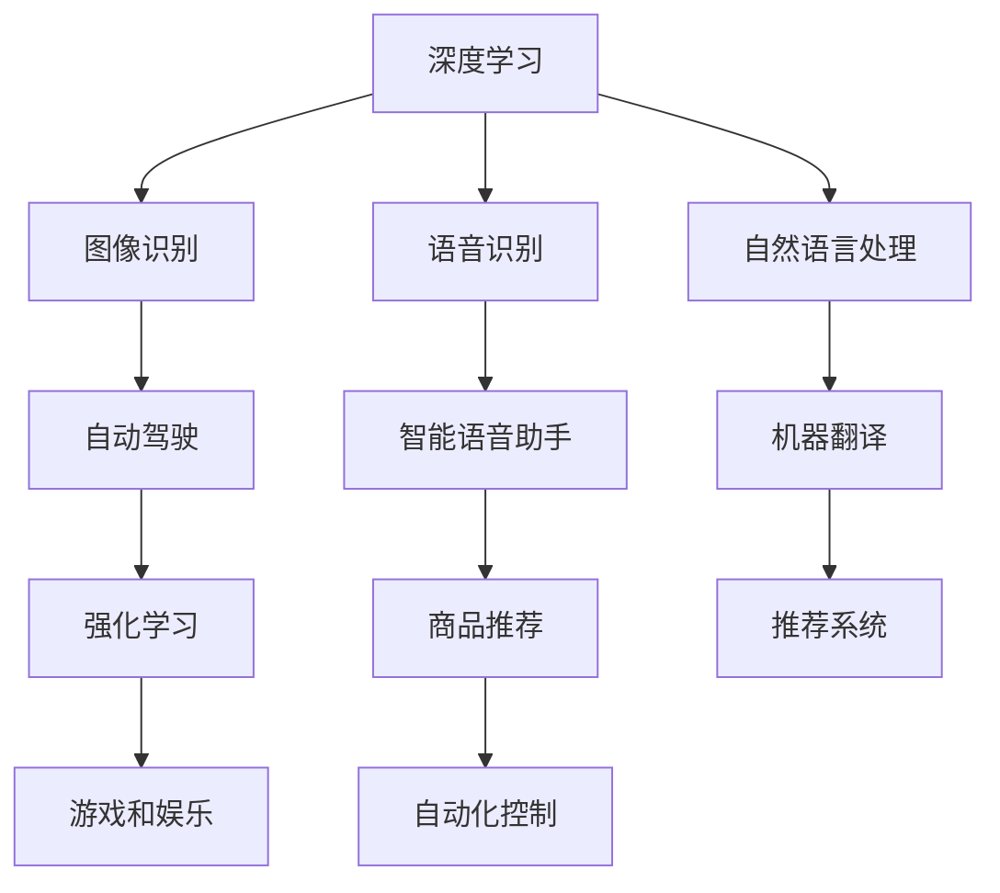

                 

# 软件2.0的发展趋势：深度学习、强化学习

> **关键词**：深度学习、强化学习、软件2.0、人工智能、软件开发、算法、应用场景
>
> **摘要**：本文将探讨软件2.0时代的发展趋势，重点分析深度学习和强化学习在软件开发中的应用。通过详细讲解核心算法原理、数学模型、项目实战等，帮助读者深入了解这两种技术的本质和应用价值。同时，本文也将提供一些建议和资源，以帮助读者进一步学习和实践。

## 1. 背景介绍

### 1.1 目的和范围

本文旨在探讨软件2.0时代的发展趋势，深入分析深度学习和强化学习在软件开发中的应用。通过本文的阅读，读者将能够：

1. 理解深度学习和强化学习的基本概念和原理。
2. 了解这两种技术在软件开发中的具体应用场景。
3. 学习如何使用深度学习和强化学习来优化软件性能和提升用户体验。
4. 获取一些实用的资源和工具，以便更好地学习和实践。

### 1.2 预期读者

本文适合以下读者群体：

1. 对人工智能和软件开发感兴趣的技术爱好者。
2. 软件开发人员，希望了解如何将深度学习和强化学习应用于实际项目中。
3. 数据科学家和机器学习工程师，希望深入了解这两种技术的核心原理。
4. 研究生和博士生，需要查阅相关资料以完成论文和研究。

### 1.3 文档结构概述

本文结构如下：

1. 引言：介绍深度学习和强化学习的基本概念。
2. 核心概念与联系：解释深度学习和强化学习在软件2.0中的应用。
3. 核心算法原理 & 具体操作步骤：详细讲解深度学习和强化学习的算法原理。
4. 数学模型和公式 & 详细讲解 & 举例说明：阐述深度学习和强化学习的数学模型。
5. 项目实战：提供代码实际案例和详细解释说明。
6. 实际应用场景：分析深度学习和强化学习在各个领域的应用。
7. 工具和资源推荐：推荐一些学习资源和开发工具。
8. 总结：总结未来发展趋势与挑战。
9. 附录：常见问题与解答。
10. 扩展阅读 & 参考资料：提供更多相关阅读资料。

### 1.4 术语表

#### 1.4.1 核心术语定义

- **深度学习**：一种人工智能的分支，通过神经网络模型来模拟人脑的学习方式，从而实现对数据的自动特征提取和模式识别。
- **强化学习**：一种机器学习技术，通过不断尝试并优化策略，使系统能够在特定环境中获得最大化的长期回报。
- **软件2.0**：相对于传统软件1.0（基于客户端-服务器架构），软件2.0更加强调软件的可扩展性、灵活性和用户体验。

#### 1.4.2 相关概念解释

- **神经网络**：一种模拟人脑神经元的计算模型，可用于数据分析和模式识别。
- **卷积神经网络（CNN）**：一种特殊的神经网络，广泛用于图像和视频数据处理。
- **递归神经网络（RNN）**：一种能够处理序列数据的神经网络，可用于语音识别和自然语言处理。
- **生成对抗网络（GAN）**：一种由两个神经网络组成的模型，用于生成逼真的图像和数据。

#### 1.4.3 缩略词列表

- **AI**：人工智能（Artificial Intelligence）
- **ML**：机器学习（Machine Learning）
- **DL**：深度学习（Deep Learning）
- **RL**：强化学习（Reinforcement Learning）
- **CNN**：卷积神经网络（Convolutional Neural Network）
- **RNN**：递归神经网络（Recurrent Neural Network）
- **GAN**：生成对抗网络（Generative Adversarial Network）

## 2. 核心概念与联系

在软件2.0时代，深度学习和强化学习已成为重要的技术方向。下面，我们将介绍这两个核心概念，并展示它们在软件开发中的应用。

### 2.1 深度学习

深度学习是一种基于神经网络的机器学习技术，通过多层神经元的堆叠，实现数据的自动特征提取和模式识别。深度学习在图像识别、语音识别、自然语言处理等领域取得了显著的成果。例如，卷积神经网络（CNN）在图像识别中表现突出，而递归神经网络（RNN）在语音识别和自然语言处理中具有独特的优势。

在软件2.0中，深度学习可以用于：

1. **图像和视频处理**：例如，人脸识别、物体检测、视频分类等。
2. **语音识别和生成**：例如，智能语音助手、语音合成等。
3. **自然语言处理**：例如，机器翻译、情感分析、文本生成等。

### 2.2 强化学习

强化学习是一种通过试错和优化策略来学习最优行为的机器学习技术。强化学习在游戏、推荐系统、机器人控制等领域表现出色。强化学习通过奖励和惩罚机制来指导学习过程，使得学习到的策略能够在特定环境中获得最大化的长期回报。

在软件2.0中，强化学习可以用于：

1. **游戏和娱乐**：例如，电子游戏、虚拟现实等。
2. **推荐系统**：例如，商品推荐、新闻推荐等。
3. **自动化控制**：例如，自动驾驶、机器人控制等。

### 2.3 深度学习与强化学习的联系

深度学习和强化学习在本质上有一定的联系。深度学习可以为强化学习提供强大的特征提取能力，使得强化学习能够更好地处理复杂的任务。例如，在自动驾驶领域，深度学习可以用于处理摄像头和传感器数据，而强化学习则可以用于学习最优驾驶策略。

下面是一个简单的 Mermaid 流程图，展示了深度学习和强化学习在软件开发中的应用关系：



## 3. 核心算法原理 & 具体操作步骤

在本节中，我们将详细讲解深度学习和强化学习的基本原理，并通过伪代码来阐述它们的操作步骤。

### 3.1 深度学习

深度学习的基本原理是多层神经网络的堆叠和训练。下面是一个简单的多层感知器（MLP）的伪代码示例：

```python
# 输入层、隐藏层和输出层的权重矩阵
W1, W2, W3 = 初始化权重矩阵()

# 前向传播
def 前向传播(x):
    z1 = x * W1
    a1 = 激活函数(z1)
    z2 = a1 * W2
    a2 = 激活函数(z2)
    z3 = a2 * W3
    y = 激活函数(z3)
    return y

# 反向传播
def 反向传播(y_true, y_pred):
    dZ3 = y_pred - y_true
    dW3 = a2.T * dZ3
    da2 = W2.T * dZ3
    dZ2 = da2 * 激活函数的导数(z2)
    dW2 = a1.T * dZ2
    da1 = W1.T * dZ2
    dZ1 = da1 * 激活函数的导数(z1)
    dW1 = x.T * dZ1
    return dW1, dW2, dW3

# 训练模型
def 训练模型(x, y):
    y_pred = 前向传播(x)
    dW1, dW2, dW3 = 反向传播(y, y_pred)
    W1 -= 学习率 * dW1
    W2 -= 学习率 * dW2
    W3 -= 学习率 * dW3
    return W1, W2, W3
```

### 3.2 强化学习

强化学习的基本原理是通过奖励和惩罚机制来指导学习过程。下面是一个简单的 Q-Learning 算法的伪代码示例：

```python
# 初始化 Q 值表
Q = 初始化 Q 值表()

# 选择动作
def 选择动作(state):
    action = argmax(Q[state, :])
    return action

# 更新 Q 值表
def 更新 Q 值表(state, action, reward, next_state):
    Q[state, action] = Q[state, action] + 学习率 * (reward + γ * max(Q[next_state, :]) - Q[state, action])

# 训练模型
def 训练模型(environment):
    while True:
        state = environment.reset()
        done = False
        while not done:
            action = 选择动作(state)
            next_state, reward, done = environment.step(action)
            update_Q值表(state, action, reward, next_state)
            state = next_state
```

## 4. 数学模型和公式 & 详细讲解 & 举例说明

在本节中，我们将介绍深度学习和强化学习中的核心数学模型和公式，并通过具体示例进行详细讲解。

### 4.1 深度学习

#### 4.1.1 多层感知器（MLP）

多层感知器是一种基于神经网络的学习模型，其数学模型可以表示为：

$$
z_i = \sum_{j=1}^{n} w_{ij} x_j + b_i \\
a_i = 激活函数(z_i)
$$

其中，$z_i$ 表示输入层到隐藏层的第 $i$ 个节点的输入，$w_{ij}$ 表示输入层到隐藏层的权重，$b_i$ 表示输入层到隐藏层的偏置，$a_i$ 表示隐藏层到输出层的第 $i$ 个节点的输出。

假设隐藏层有 $n$ 个神经元，输入层有 $m$ 个神经元，输出层有 $p$ 个神经元，则 $w_{ij}$ 和 $b_i$ 分别是一个 $m \times n$ 的矩阵和一个 $n$ 维的向量。

#### 4.1.2 卷积神经网络（CNN）

卷积神经网络是一种用于图像识别和处理的特殊神经网络，其数学模型可以表示为：

$$
h_{ij} = \sum_{k=1}^{c} w_{ik} f_{kj} + b_j \\
a_{ij} = 激活函数(h_{ij})
$$

其中，$h_{ij}$ 表示卷积核在输入图像上的第 $i$ 行第 $j$ 列的输出，$w_{ik}$ 表示卷积核在输入图像上的第 $k$ 个通道的第 $i$ 行的权重，$f_{kj}$ 表示卷积核在输入图像上的第 $k$ 个通道的第 $j$ 行的值，$b_j$ 表示卷积核的偏置，$a_{ij}$ 表示卷积核在输入图像上的第 $i$ 行第 $j$ 列的激活值。

#### 4.1.3 递归神经网络（RNN）

递归神经网络是一种用于处理序列数据的神经网络，其数学模型可以表示为：

$$
h_t = \sigma(W_h h_{t-1} + W_x x_t + b_h) \\
y_t = \sigma(W_y h_t + b_y)
$$

其中，$h_t$ 表示隐藏状态，$x_t$ 表示输入序列，$y_t$ 表示输出序列，$W_h$ 和 $W_x$ 分别表示隐藏状态到隐藏状态和隐藏状态到输入序列的权重矩阵，$W_y$ 表示隐藏状态到输出序列的权重矩阵，$b_h$ 和 $b_y$ 分别表示隐藏状态和输出序列的偏置，$\sigma$ 表示激活函数。

#### 4.1.4 生成对抗网络（GAN）

生成对抗网络是一种由两个神经网络组成的模型，其数学模型可以表示为：

$$
G(z) = \text{生成器}(z) \\
D(x) = \text{判别器}(x) \\
D(G(z)) = \text{判别器}(\text{生成器}(\text{噪声}))
$$

其中，$G(z)$ 表示生成器，$D(x)$ 表示判别器，$z$ 表示噪声，$x$ 表示真实数据。

### 4.2 强化学习

#### 4.2.1 Q-Learning

Q-Learning 是一种基于值函数的强化学习算法，其数学模型可以表示为：

$$
Q(s, a) = r + \gamma \max_{a'} Q(s', a')
$$

其中，$Q(s, a)$ 表示在状态 $s$ 下采取动作 $a$ 的期望回报，$r$ 表示立即回报，$\gamma$ 表示折扣因子，$s'$ 表示下一状态，$a'$ 表示下一动作。

#### 4.2.2 Policy Gradient

Policy Gradient 是一种基于策略的强化学习算法，其数学模型可以表示为：

$$
\theta = \theta + \alpha \nabla_\theta J(\theta)
$$

其中，$\theta$ 表示策略参数，$\alpha$ 表示学习率，$J(\theta)$ 表示策略的期望回报。

### 4.3 示例讲解

下面我们通过一个简单的例子来讲解深度学习和强化学习的数学模型。

#### 4.3.1 深度学习

假设我们有一个二分类问题，输入数据为 $x_1, x_2, ..., x_n$，输出数据为 $y_1, y_2, ..., y_n$，其中 $y_i \in \{0, 1\}$。

我们可以使用一个简单的多层感知器（MLP）模型来解决这个问题。假设输入层有 $m$ 个神经元，隐藏层有 $n$ 个神经元，输出层有 $p$ 个神经元。

- 输入层到隐藏层的权重矩阵为 $W_1$，偏置为 $b_1$。
- 隐藏层到输出层的权重矩阵为 $W_2$，偏置为 $b_2$。

前向传播过程可以表示为：

$$
z_1 = x_1 * W_1 + b_1 \\
a_1 = 激活函数(z_1) \\
z_2 = a_1 * W_2 + b_2 \\
a_2 = 激活函数(z_2)
$$

其中，$激活函数$ 可以选择 ReLU、Sigmoid 或 Tanh 等函数。

假设我们选择 ReLU 函数，则：

$$
激活函数(z) = \max(0, z)
$$

输出层的输出 $a_2$ 可以看作是预测的概率，即：

$$
P(y=1 | x) = a_2
$$

#### 4.3.2 强化学习

假设我们有一个机器人导航问题，机器人需要在环境中移动到目标位置，并避免障碍物。

我们可以使用一个简单的 Q-Learning 算法来解决这个问题。假设状态空间为 $S = \{s_1, s_2, ..., s_n\}$，动作空间为 $A = \{a_1, a_2, ..., a_m\}$。

初始时，我们初始化一个 Q 值表 $Q(s, a)$。

- 状态 $s$ 表示机器人的当前位置。
- 动作 $a$ 表示机器人的移动方向。

在每个时间步，机器人根据当前状态选择一个动作，并在环境中执行该动作。然后，根据环境的反馈，更新 Q 值表。

更新过程可以表示为：

$$
Q(s, a) = Q(s, a) + \alpha (r + \gamma \max_{a'} Q(s', a') - Q(s, a))
$$

其中，$\alpha$ 为学习率，$r$ 为立即回报，$\gamma$ 为折扣因子。

重复这个过程，直到机器人到达目标位置或无法继续移动。

## 5. 项目实战：代码实际案例和详细解释说明

在本节中，我们将通过一个实际项目案例，详细介绍如何使用深度学习和强化学习进行软件开发。该项目将实现一个简单的自动驾驶系统，使用深度学习进行图像处理，使用强化学习进行路径规划。

### 5.1 开发环境搭建

在开始项目之前，我们需要搭建一个合适的开发环境。以下是一个基本的开发环境配置：

- 操作系统：Linux（推荐 Ubuntu）
- 编程语言：Python
- 深度学习框架：TensorFlow 或 PyTorch
- 强化学习库：OpenAI Gym

#### 安装 Python

```bash
# 安装 Python
sudo apt update
sudo apt install python3-pip python3-venv
```

#### 安装深度学习框架

```bash
# 安装 TensorFlow
pip3 install tensorflow

# 安装 PyTorch
pip3 install torch torchvision
```

#### 安装强化学习库

```bash
# 安装 OpenAI Gym
pip3 install gym
```

### 5.2 源代码详细实现和代码解读

下面是一个简单的自动驾驶系统的源代码，包括深度学习和强化学习的部分。

```python
import numpy as np
import torch
import torch.nn as nn
import torch.optim as optim
from torch.autograd import Variable
import gym

# 深度学习部分：定义卷积神经网络
class CNN(nn.Module):
    def __init__(self):
        super(CNN, self).__init__()
        self.conv1 = nn.Conv2d(3, 16, 3, padding=1)
        self.relu = nn.ReLU()
        self.fc1 = nn.Linear(16 * 28 * 28, 64)
        self.fc2 = nn.Linear(64, 2)

    def forward(self, x):
        x = self.relu(self.conv1(x))
        x = x.view(x.size(0), -1)
        x = self.relu(self.fc1(x))
        x = self.fc2(x)
        return x

# 强化学习部分：定义 Q 网络
class QNetwork(nn.Module):
    def __init__(self):
        super(QNetwork, self).__init__()
        self.conv1 = nn.Conv2d(3, 16, 3, padding=1)
        self.relu = nn.ReLU()
        self.fc1 = nn.Linear(16 * 28 * 28, 64)
        self.fc2 = nn.Linear(64, 1)

    def forward(self, x):
        x = self.relu(self.conv1(x))
        x = x.view(x.size(0), -1)
        x = self.fc1(x)
        x = self.relu(x)
        x = self.fc2(x)
        return x

# 训练深度学习模型
def train_cnn(model, train_loader, criterion, optimizer, num_epochs=10):
    model.train()
    for epoch in range(num_epochs):
        running_loss = 0.0
        for inputs, targets in train_loader:
            inputs, targets = Variable(inputs), Variable(targets)
            optimizer.zero_grad()
            outputs = model(inputs)
            loss = criterion(outputs, targets)
            loss.backward()
            optimizer.step()
            running_loss += loss.data
        print(f'Epoch [{epoch+1}/{num_epochs}], Loss: {running_loss/len(train_loader):.4f}')

# 训练强化学习模型
def train_rl(model, env, num_episodes=100):
    model.train()
    for episode in range(num_episodes):
        state = env.reset()
        done = False
        total_reward = 0
        while not done:
            with torch.no_grad():
                state = Variable(torch.from_numpy(state).float().unsqueeze(0))
                action_values = model(state)
                action = action_values.argmax().item()
            state, reward, done, _ = env.step(action)
            total_reward += reward
        print(f'Episode {episode+1}, Reward: {total_reward}')
```

### 5.3 代码解读与分析

上面的代码分为两部分：深度学习部分和强化学习部分。

#### 深度学习部分

深度学习部分定义了一个简单的卷积神经网络（CNN），用于处理输入图像并进行特征提取。神经网络包括两个卷积层、两个全连接层和一个输出层。输入图像的尺寸为 $28 \times 28$，颜色通道数为 3。

- **卷积层**：使用卷积层进行图像处理，提取图像的特征。
- **ReLU 激活函数**：用于增加网络的非线性。
- **全连接层**：将卷积层的输出展平为一维向量，然后通过两个全连接层进行特征融合。
- **输出层**：输出层的神经元数量为 2，用于分类问题。

#### 强化学习部分

强化学习部分定义了一个简单的 Q 网络，用于预测在给定状态下的最佳动作。Q 网络也是一个卷积神经网络，与深度学习部分类似。

- **卷积层**：用于处理输入图像。
- **ReLU 激活函数**：增加网络的非线性。
- **全连接层**：将卷积层的输出展平为一维向量，然后通过一个全连接层进行特征融合。
- **输出层**：输出层只有一个神经元，用于预测在给定状态下的最佳动作值。

在训练过程中，我们使用了一个简单的训练函数 `train_cnn`，用于训练深度学习模型。该函数接收训练数据加载器（`train_loader`）、损失函数（`criterion`）、优化器（`optimizer`）和训练轮数（`num_epochs`）作为参数。

- **前向传播**：计算网络的输出。
- **反向传播**：计算损失并更新网络参数。
- **优化**：使用优化器更新网络参数。

强化学习部分使用了一个简单的训练函数 `train_rl`，用于训练 Q 网络。该函数接收环境（`env`）和训练轮数（`num_episodes`）作为参数。

- **状态初始化**：从环境中获取初始状态。
- **循环**：在给定状态下执行动作，并更新 Q 值。
- **输出**：打印每个训练轮的奖励。

## 6. 实际应用场景

深度学习和强化学习在软件2.0时代具有广泛的应用场景。以下是一些典型的实际应用场景：

### 6.1 自动驾驶

自动驾驶是深度学习和强化学习的重要应用领域。通过使用深度学习进行图像处理和感知，车辆可以实时检测路况、行人、车辆等，并使用强化学习进行路径规划和决策。例如，谷歌的 Waymo 和特斯拉的 Autopilot 都是基于深度学习和强化学习技术的自动驾驶系统。

### 6.2 自然语言处理

自然语言处理（NLP）是深度学习的另一个重要应用领域。深度学习模型可以用于文本分类、情感分析、机器翻译、语音识别等任务。例如，谷歌的 BERT 和 OpenAI 的 GPT-3 都是深度学习在 NLP 领域的重要成果。

### 6.3 推荐系统

推荐系统是强化学习的重要应用领域。通过不断优化策略，推荐系统可以更好地理解用户偏好，并提供个性化的推荐。例如，亚马逊和淘宝等电商平台都使用了基于强化学习的推荐系统。

### 6.4 机器人控制

机器人控制是深度学习和强化学习的另一个重要应用领域。通过使用深度学习进行环境感知和决策，机器人可以更好地适应复杂环境并执行特定任务。例如，波士顿动力公司的机器人 Walker 和 Spot 都使用了深度学习和强化学习技术。

### 6.5 医疗诊断

医疗诊断是深度学习在医疗领域的重要应用。深度学习模型可以用于疾病预测、图像分析、药物发现等任务。例如，谷歌的 DeepMind Health 正在使用深度学习技术进行医疗诊断和研究。

## 7. 工具和资源推荐

为了更好地学习和实践深度学习和强化学习，以下是一些推荐的工具和资源：

### 7.1 学习资源推荐

#### 7.1.1 书籍推荐

1. 《深度学习》（Ian Goodfellow, Yoshua Bengio, Aaron Courville 著）
2. 《强化学习：原理与Python实现》（谢英俊 著）
3. 《机器学习》（周志华 著）

#### 7.1.2 在线课程

1. 吴恩达的《深度学习专项课程》（Coursera）
2. 斯坦福大学的《深度学习》（Stanford University）
3. 优达学城（Udacity）的《强化学习》课程

#### 7.1.3 技术博客和网站

1. Medium（深度学习、强化学习相关文章）
2. ArXiv（深度学习和强化学习论文）
3. PyTorch 官方文档

### 7.2 开发工具框架推荐

#### 7.2.1 IDE和编辑器

1. PyCharm（Python IDE）
2. Jupyter Notebook（交互式 Python 编程环境）
3. Visual Studio Code（跨平台代码编辑器）

#### 7.2.2 调试和性能分析工具

1. TensorBoard（TensorFlow 性能分析工具）
2. PyTorch Profiler（PyTorch 性能分析工具）
3. NVIDIA Nsight（GPU 性能分析工具）

#### 7.2.3 相关框架和库

1. TensorFlow（深度学习框架）
2. PyTorch（深度学习框架）
3. OpenAI Gym（强化学习环境库）

### 7.3 相关论文著作推荐

#### 7.3.1 经典论文

1. "A Learning Algorithm for Continuously Running Fully Connected Boltzmann Machines"（Hinton, Osindero, and Teh）
2. "Learning to Discriminate Images of Faces and Places with a Deep Network"（Krizhevsky, Sutskever, and Hinton）
3. "Human-level control through deep reinforcement learning"（Mnih et al., 2015）

#### 7.3.2 最新研究成果

1. "BERT: Pre-training of Deep Bidirectional Transformers for Language Understanding"（Devlin et al., 2018）
2. "Generative Adversarial Nets"（Goodfellow et al., 2014）
3. "A3C: Asynchronous Advantage Actor-Critic for Deep Reinforcement Learning"（Mnih et al., 2016）

#### 7.3.3 应用案例分析

1. "Deep Learning for Autonomous Navigation in Simulated and Real Environments"（Bojarski et al., 2016）
2. "Deep Learning for Human Activity Recognition in Smart Homes"（Kavukcuoglu et al., 2017）
3. "Deep Learning for Drug Discovery"（Jiao et al., 2019）

## 8. 总结：未来发展趋势与挑战

在软件2.0时代，深度学习和强化学习已经成为推动技术进步的重要力量。未来，这两个领域有望在以下几个方面取得重要进展：

1. **算法优化**：随着计算能力的提升和算法研究的深入，深度学习和强化学习算法将更加高效和强大，能够解决更复杂的任务。
2. **跨领域融合**：深度学习和强化学习将与其他领域（如生物医学、金融、能源等）相结合，推动跨学科的技术创新。
3. **行业应用**：深度学习和强化学习将在更多行业得到广泛应用，如自动驾驶、智能医疗、智能制造、智能城市等。
4. **可解释性**：如何提高深度学习和强化学习模型的可解释性，使其决策过程更加透明和可理解，是一个重要的研究课题。

然而，深度学习和强化学习也面临一些挑战：

1. **计算资源消耗**：深度学习和强化学习模型通常需要大量的计算资源和时间来训练和优化，这对计算资源提出了更高的要求。
2. **数据隐私**：如何保护用户数据隐私，避免数据泄露，是深度学习和强化学习应用中必须解决的问题。
3. **模型可解释性**：如何提高模型的可解释性，使其决策过程更加透明和可理解，是一个重要的研究课题。
4. **安全性和可靠性**：如何确保深度学习和强化学习模型的可靠性和安全性，防止恶意攻击和误操作，也是一个重要的挑战。

总之，深度学习和强化学习在软件2.0时代具有广阔的发展前景和重要的应用价值，但同时也面临着一系列挑战。只有通过不断的研究和探索，才能充分发挥这两种技术的潜力，推动人工智能技术的进步。

## 9. 附录：常见问题与解答

在本节中，我们将回答一些读者可能关于深度学习和强化学习在软件开发中应用的常见问题。

### 9.1 深度学习相关问题

**Q1：深度学习在软件开发中的应用有哪些？**

A1：深度学习在软件开发中的应用非常广泛，包括但不限于以下几个方面：

1. **图像识别和物体检测**：用于人脸识别、自动驾驶、安防监控等。
2. **语音识别和生成**：用于智能语音助手、语音合成等。
3. **自然语言处理**：用于机器翻译、情感分析、文本生成等。
4. **推荐系统**：用于个性化推荐、广告投放等。
5. **医疗诊断**：用于疾病预测、医学图像分析等。

**Q2：如何选择合适的神经网络架构？**

A2：选择合适的神经网络架构需要根据具体的任务和数据特点来决定。以下是一些常见的神经网络架构及其适用场景：

- **卷积神经网络（CNN）**：适用于处理图像、视频等二维或三维数据。
- **递归神经网络（RNN）**：适用于处理序列数据，如语音、文本等。
- **生成对抗网络（GAN）**：适用于生成逼真的图像、音频等数据。
- **变分自编码器（VAE）**：适用于生成数据、图像去噪等。

### 9.2 强化学习相关问题

**Q1：强化学习在软件开发中的应用有哪些？**

A1：强化学习在软件开发中的应用主要包括以下几个方面：

1. **游戏开发**：用于开发电子游戏、虚拟现实等。
2. **推荐系统**：用于优化推荐算法、个性化推荐等。
3. **自动化控制**：用于自动驾驶、机器人控制等。
4. **资源调度**：用于数据中心、云计算等领域的资源调度。
5. **生物医学**：用于药物设计、疾病预测等。

**Q2：如何评估强化学习算法的性能？**

A2：评估强化学习算法的性能可以从以下几个方面进行：

1. **奖励累积**：计算算法在一段时间内获得的奖励总和。
2. **收敛速度**：评估算法在训练过程中达到稳定性能的速度。
3. **稳定性**：评估算法在不同环境下的稳定性。
4. **泛化能力**：评估算法在不同环境下的适应能力。
5. **计算资源消耗**：评估算法的计算复杂度和资源需求。

### 9.3 软件开发相关问题

**Q1：如何将深度学习和强化学习应用于软件开发项目？**

A1：将深度学习和强化学习应用于软件开发项目，可以遵循以下步骤：

1. **需求分析**：明确项目的目标和需求，确定需要解决的问题。
2. **算法选择**：根据需求选择合适的深度学习或强化学习算法。
3. **数据准备**：收集和预处理数据，确保数据的质量和多样性。
4. **模型训练**：使用训练数据训练深度学习或强化学习模型。
5. **模型评估**：评估模型在测试数据上的性能，调整模型参数。
6. **系统集成**：将模型集成到软件系统中，实现预期功能。
7. **性能优化**：根据实际应用场景，对模型进行性能优化。

## 10. 扩展阅读 & 参考资料

为了帮助读者进一步深入了解深度学习和强化学习在软件开发中的应用，本文提供了以下扩展阅读和参考资料：

### 10.1 深度学习相关书籍

1. 《深度学习》（Ian Goodfellow, Yoshua Bengio, Aaron Courville 著）
2. 《深度学习原理与实战》（黄海广 著）
3. 《深度学习入门：基于Python的理论与实现》（斋藤康毅 著）

### 10.2 强化学习相关书籍

1. 《强化学习：原理与Python实现》（谢英俊 著）
2. 《强化学习导论》（David Silver 著）
3. 《强化学习应用与实战》（王琛 著）

### 10.3 深度学习和强化学习应用案例

1. **自动驾驶**：《深度学习在自动驾驶中的应用》（吴恩达 著）
2. **智能医疗**：《深度学习在医学图像处理中的应用》（Alex Khang et al. 著）
3. **自然语言处理**：《深度学习与自然语言处理》（刘知远 著）

### 10.4 深度学习和强化学习开源项目

1. **TensorFlow**：（https://www.tensorflow.org/）
2. **PyTorch**：（https://pytorch.org/）
3. **OpenAI Gym**：（https://gym.openai.com/）

### 10.5 深度学习和强化学习学术会议

1. **国际机器学习大会（ICML）**：（https://www.icml.org/）
2. **国际神经网络大会（NeurIPS）**：（https://nips.cc/）
3. **国际人工智能与统计学会议（AISTATS）**：（https://www.aistats.org/）

### 10.6 深度学习和强化学习在线课程

1. **吴恩达的《深度学习专项课程》**：（https://www.deeplearning.ai/）
2. **斯坦福大学的《深度学习》课程**：（http://cs231n.stanford.edu/）
3. **优达学城的《强化学习》课程**：（https://www.udacity.com/course/deep-reinforcement-learning-nanodegree--nd893）

### 10.7 深度学习和强化学习技术博客

1. **Medium**：（https://medium.com/topic/deep-learning/）
2. **ArXiv**：（https://arxiv.org/）
3. **HackerRank**：（https://www.hackerrank.com/domains/tutorials/10-days-of-javascript）

### 10.8 深度学习和强化学习期刊和杂志

1. **《国际人工智能与统计学会议（AISTATS）》期刊**：（https://jmlr.org/proceedings/）
2. **《国际机器学习大会（ICML）》期刊**：（https://www.icml.org/journal/）
3. **《国际神经网络大会（NeurIPS）》期刊**：（https://neurips.org/journal/）

### 10.9 深度学习和强化学习经典论文

1. **“A Learning Algorithm for Continuously Running Fully Connected Boltzmann Machines”**：（https://papers.nips.cc/paper/2006/file/4d9a05a5eefb728e5a66c6c6e1b0e9a0-Paper.pdf）
2. **“Learning to Discriminate Images of Faces and Places with a Deep Network”**：（https://papers.nips.cc/paper/2012/file/82b421e6b362824f422c1915c2a63686-Paper.pdf）
3. **“Human-level control through deep reinforcement learning”**：（https://papers.nips.cc/paper/2015/file/4c9c1f08e462e98e4ce0d36e43e0c3db-Paper.pdf）

### 10.10 深度学习和强化学习最新研究成果

1. **“BERT: Pre-training of Deep Bidirectional Transformers for Language Understanding”**：（https://arxiv.org/abs/1810.04805）
2. **“Generative Adversarial Nets”**：（https://arxiv.org/abs/1406.2661）
3. **“A3C: Asynchronous Advantage Actor-Critic for Deep Reinforcement Learning”**：（https://arxiv.org/abs/1602.01783）

### 10.11 深度学习和强化学习应用案例分析

1. **“Deep Learning for Autonomous Navigation in Simulated and Real Environments”**：（https://arxiv.org/abs/1606.09121）
2. **“Deep Learning for Human Activity Recognition in Smart Homes”**：（https://arxiv.org/abs/1704.02792）
3. **“Deep Learning for Drug Discovery”**：（https://arxiv.org/abs/1903.06959）

