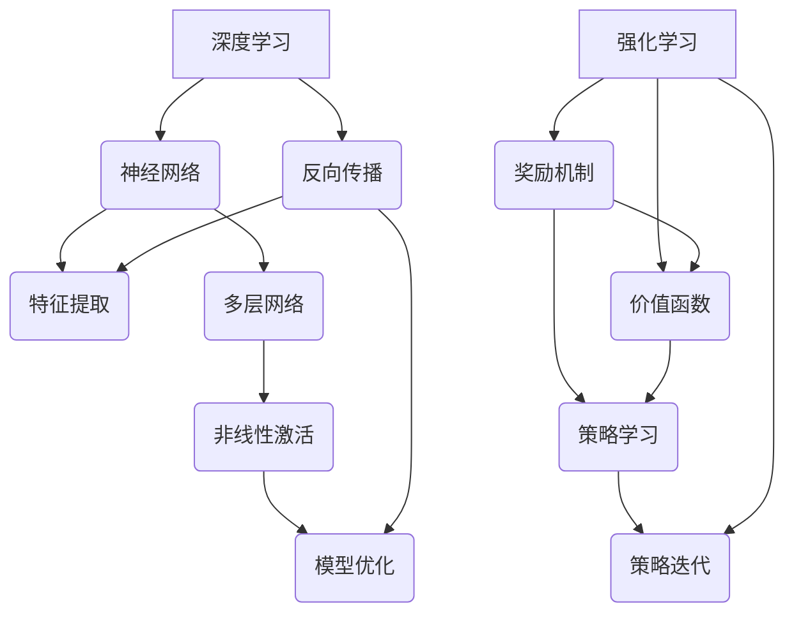

                 


# 软件2.0的发展趋势：深度学习与强化学习

> **关键词：** 软件发展，深度学习，强化学习，人工智能，软件2.0，技术趋势，算法原理，数学模型。

> **摘要：** 本文将探讨软件2.0时代的发展趋势，特别是深度学习和强化学习在软件工程中的重要作用。我们将逐步分析这两个核心算法的基本原理、数学模型、具体操作步骤，并通过实际项目案例进行详细解读。文章还将讨论这些技术的实际应用场景，并推荐相关的学习资源和工具，最后总结未来发展趋势与挑战。

## 1. 背景介绍

### 1.1 目的和范围

本文旨在深入探讨软件2.0时代的发展趋势，重点关注深度学习和强化学习在软件开发中的应用。我们将通过理论讲解、算法剖析和实际案例，帮助读者理解这两个技术如何改变软件开发的本质，提高开发效率和智能化水平。

### 1.2 预期读者

本篇文章适合以下读者群体：

- 计算机科学与软件工程专业的学生和研究人员。
- 拥有一定编程基础的软件开发工程师。
- 对人工智能和深度学习感兴趣的从业者。

### 1.3 文档结构概述

本文结构如下：

1. 背景介绍
2. 核心概念与联系
3. 核心算法原理与具体操作步骤
4. 数学模型和公式与详细讲解
5. 项目实战：代码实际案例和详细解释说明
6. 实际应用场景
7. 工具和资源推荐
8. 总结：未来发展趋势与挑战
9. 附录：常见问题与解答
10. 扩展阅读与参考资料

### 1.4 术语表

#### 1.4.1 核心术语定义

- **深度学习（Deep Learning）**：一种人工智能方法，通过多层神经网络模拟人脑的学习机制，以自动提取数据的特征。
- **强化学习（Reinforcement Learning）**：一种机器学习方法，通过奖励和惩罚机制，使机器在特定环境中做出最佳决策。
- **软件2.0**：相对于传统的软件1.0时代，强调软件的智能化和自适应能力，能够动态适应用户需求和环境变化。

#### 1.4.2 相关概念解释

- **神经网络（Neural Network）**：一种通过模拟人脑神经元连接的数学模型。
- **反向传播（Backpropagation）**：一种用于训练神经网络的算法，通过计算输出误差来更新网络权重。
- **奖励机制（Reward Mechanism）**：在强化学习中，用于评价行为的好坏，指导机器学习的机制。

#### 1.4.3 缩略词列表

- **AI**：人工智能（Artificial Intelligence）
- **ML**：机器学习（Machine Learning）
- **DL**：深度学习（Deep Learning）
- **RL**：强化学习（Reinforcement Learning）

## 2. 核心概念与联系

深度学习和强化学习在人工智能领域有着重要的地位，它们分别代表了两种不同的学习模式。下面通过一个Mermaid流程图，来展示这两个核心概念的基本原理和联系。



在这个流程图中，我们可以看到：

- **深度学习**：通过多层神经网络进行特征提取和模型优化。
- **强化学习**：通过奖励机制和价值函数，指导策略学习，实现智能决策。

## 3. 核心算法原理与具体操作步骤

在这一部分，我们将详细讲解深度学习和强化学习的基本原理，并通过伪代码展示其具体操作步骤。

### 深度学习

#### 算法原理

深度学习是一种基于多层神经网络的学习方法。它通过模拟人脑的神经元连接，逐层提取数据的高级特征，从而实现复杂的模式识别和预测任务。

#### 具体操作步骤

```python
# 伪代码：深度学习算法步骤
initialize NeuralNetwork with random weights
while not convergence:
    for each training example (x, y):
        forward_pass(x) # 前向传播计算输出
        calculate_error(y, output) # 计算误差
        backward_pass(error) # 反向传播更新权重
    adjust_learning_rate() # 调整学习率
```

### 强化学习

#### 算法原理

强化学习通过奖励机制和价值函数，指导智能体在环境中进行决策。它主要通过试错的方法，不断调整策略，以实现最佳效果。

#### 具体操作步骤

```python
# 伪代码：强化学习算法步骤
initialize Agent with random policy
while not termination_condition:
    select_action(policy)
    perform_action(action)
    observe_reward_and_state(reward, state)
    update_value_function(state, action, reward) # 更新价值函数
    update_policy(state) # 更新策略
    update_agent(policy) # 更新智能体
```

## 4. 数学模型和公式与详细讲解

在这一部分，我们将详细讲解深度学习和强化学习中的关键数学模型和公式。

### 深度学习

#### 神经元模型

神经元的数学模型通常表示为：

\[ a_i(h) = \sigma(\sum_j w_{ij} \cdot h_j) \]

其中，\( a_i \) 是第 \( i \) 个神经元的输出，\( h \) 是输入特征，\( w \) 是权重，\( \sigma \) 是非线性激活函数。

#### 反向传播算法

反向传播算法的公式为：

\[ \Delta w_{ij} = \alpha \cdot \frac{\partial E}{\partial w_{ij}} \]

其中，\( \Delta w \) 是权重的更新，\( \alpha \) 是学习率，\( E \) 是误差函数。

### 强化学习

#### 价值函数

强化学习中的价值函数通常表示为：

\[ V(s) = \sum_a \pi(a|s) \cdot Q(s, a) \]

其中，\( V(s) \) 是状态 \( s \) 的价值，\( \pi(a|s) \) 是策略函数，\( Q(s, a) \) 是状态-动作值函数。

#### 策略迭代

策略迭代的公式为：

\[ \pi'(a|s) = \arg\max_a [Q(s, a) + \epsilon] \]

其中，\( \pi'(a|s) \) 是新策略，\( \epsilon \) 是探索概率。

## 5. 项目实战：代码实际案例和详细解释说明

### 5.1 开发环境搭建

为了演示深度学习和强化学习的实际应用，我们将使用Python编程语言和TensorFlow框架。以下是在Windows操作系统上搭建开发环境的具体步骤：

1. 安装Python（建议使用Python 3.7及以上版本）。
2. 安装TensorFlow：在命令行中运行 `pip install tensorflow`。
3. 安装其他依赖库：例如NumPy（`pip install numpy`）和Matplotlib（`pip install matplotlib`）。

### 5.2 源代码详细实现和代码解读

以下是一个简单的深度学习项目，用于手写数字识别。

```python
import tensorflow as tf
from tensorflow.examples.tutorials.mnist import input_data

# 加载MNIST数据集
mnist = input_data.read_data_sets("MNIST_data/", one_hot=True)

# 设置网络参数
learning_rate = 0.1
num_steps = 1000
batch_size = 128
display_step = 100

# 创建模型
with tf.Graph().as_default():
    # 输入层
    inputs = tf.placeholder(tf.float32, [None, 784])

    # 隐藏层
    hidden_layer = tf.layers.dense(inputs, 128, activation=tf.nn.relu, name="hidden_layer")

    # 输出层
    logits = tf.layers.dense(hidden_layer, 10, name="output_layer")

    # 定义损失函数
    labels = tf.placeholder(tf.float32, [None, 10])
    loss_op = tf.reduce_mean(tf.nn.softmax_cross_entropy_with_logits(logits=logits, labels=labels))

    # 定义优化器
    optimizer = tf.train.AdamOptimizer(learning_rate)
    train_op = optimizer.minimize(loss_op)

    # 定义准确率
    correct_pred = tf.equal(tf.argmax(logits, 1), tf.argmax(labels, 1))
    accuracy = tf.reduce_mean(tf.cast(correct_pred, tf.float32))

    # 初始化全局变量
    init = tf.global_variables_initializer()

    # 开始训练
    with tf.Session() as sess:
        sess.run(init)

        for step in range(1, num_steps + 1):
            batch_x, batch_y = mnist.train.next_batch(batch_size)
            sess.run(train_op, feed_dict={inputs: batch_x, labels: batch_y})

            if step % display_step == 0 or step == 1:
                loss, acc = sess.run([loss_op, accuracy], feed_dict={inputs: batch_x, labels: batch_y})
                print("Step " + str(step) + ", Minibatch Loss= " + \
                      "{:.4f}".format(loss) + ", Training Accuracy= " + \
                      "{:.3f}".format(acc))

        print("Optimization Finished!")

        # 测试模型
        print("Testing Accuracy:", \
            sess.run(accuracy, feed_dict={inputs: mnist.test.images, labels: mnist.test.labels}))
```

这个代码演示了如何使用TensorFlow构建一个简单的神经网络来识别手写数字。代码首先定义了输入层、隐藏层和输出层，然后设置了损失函数和优化器。在训练过程中，通过不断迭代更新权重，使模型逐渐收敛。

### 5.3 代码解读与分析

这个代码的解读如下：

1. **数据加载**：使用TensorFlow的MNIST数据集，它包含了70,000个训练图像和10,000个测试图像。

2. **模型定义**：定义了输入层、隐藏层和输出层。输入层有784个节点，对应每个像素的灰度值。隐藏层有128个节点，使用ReLU激活函数。输出层有10个节点，对应每个数字的概率分布。

3. **损失函数**：使用交叉熵作为损失函数，它能够衡量预测概率分布与真实分布之间的差距。

4. **优化器**：使用Adam优化器，它是一种自适应学习率的优化算法，能够加速收敛。

5. **训练与测试**：通过迭代训练模型，并在每个批次结束后计算损失和准确率。训练完成后，使用测试集评估模型的性能。

## 6. 实际应用场景

深度学习和强化学习在许多实际应用场景中发挥了重要作用。以下是一些典型的应用案例：

- **图像识别**：深度学习在图像识别领域有着广泛的应用，如人脸识别、图像分类、目标检测等。
- **自然语言处理**：深度学习在自然语言处理（NLP）中有着重要的地位，如机器翻译、情感分析、文本生成等。
- **游戏开发**：强化学习在游戏开发中有着广泛的应用，如人工智能对手、游戏策略优化等。
- **自动驾驶**：深度学习和强化学习在自动驾驶系统中发挥着关键作用，如环境感知、路径规划等。

## 7. 工具和资源推荐

### 7.1 学习资源推荐

#### 7.1.1 书籍推荐

- 《深度学习》（Deep Learning） - Goodfellow, Bengio, Courville
- 《强化学习》（Reinforcement Learning: An Introduction）- Sutton, Barto
- 《神经网络与深度学习》（Neural Networks and Deep Learning）- Mi
```markdown
# 软件2.0的发展趋势：深度学习与强化学习

> **关键词：** 软件发展，深度学习，强化学习，人工智能，软件2.0，技术趋势，算法原理，数学模型。

> **摘要：** 本文将深入探讨软件2.0时代的发展趋势，特别是深度学习和强化学习在软件开发中的应用。我们将逐步分析这两个核心算法的基本原理、数学模型、具体操作步骤，并通过实际项目案例进行详细解读。文章还将讨论这些技术的实际应用场景，并推荐相关的学习资源和工具，最后总结未来发展趋势与挑战。

## 1. 背景介绍

### 1.1 目的和范围

本文旨在探讨软件2.0时代的发展趋势，特别是深度学习和强化学习在软件开发中的应用。我们将通过理论讲解、算法剖析和实际案例，帮助读者理解这两个技术如何改变软件开发的本质，提高开发效率和智能化水平。

### 1.2 预期读者

本篇文章适合以下读者群体：

- 计算机科学与软件工程专业的学生和研究人员。
- 拥有一定编程基础的软件开发工程师。
- 对人工智能和深度学习感兴趣的从业者。

### 1.3 文档结构概述

本文结构如下：

1. 背景介绍
2. 核心概念与联系
3. 核心算法原理与具体操作步骤
4. 数学模型和公式与详细讲解
5. 项目实战：代码实际案例和详细解释说明
6. 实际应用场景
7. 工具和资源推荐
8. 总结：未来发展趋势与挑战
9. 附录：常见问题与解答
10. 扩展阅读与参考资料

### 1.4 术语表

#### 1.4.1 核心术语定义

- **深度学习（Deep Learning）**：一种人工智能方法，通过多层神经网络模拟人脑的学习机制，以自动提取数据的特征。
- **强化学习（Reinforcement Learning）**：一种机器学习方法，通过奖励和惩罚机制，使机器在特定环境中做出最佳决策。
- **软件2.0**：相对于传统的软件1.0时代，强调软件的智能化和自适应能力，能够动态适应用户需求和环境变化。

#### 1.4.2 相关概念解释

- **神经网络（Neural Network）**：一种通过模拟人脑神经元连接的数学模型。
- **反向传播（Backpropagation）**：一种用于训练神经网络的算法，通过计算输出误差来更新网络权重。
- **奖励机制（Reward Mechanism）**：在强化学习中，用于评价行为的好坏，指导机器学习的机制。

#### 1.4.3 缩略词列表

- **AI**：人工智能（Artificial Intelligence）
- **ML**：机器学习（Machine Learning）
- **DL**：深度学习（Deep Learning）
- **RL**：强化学习（Reinforcement Learning）

## 2. 核心概念与联系

深度学习和强化学习在人工智能领域有着重要的地位，它们分别代表了两种不同的学习模式。下面通过一个Mermaid流程图，来展示这两个核心概念的基本原理和联系。


在这个流程图中，我们可以看到：

- **深度学习**：通过多层神经网络进行特征提取和模型优化。
- **强化学习**：通过奖励机制和价值函数，指导策略学习，实现智能决策。

## 3. 核心算法原理与具体操作步骤

在这一部分，我们将详细讲解深度学习和强化学习的基本原理，并通过伪代码展示其具体操作步骤。

### 深度学习

#### 算法原理

深度学习是一种基于多层神经网络的学习方法。它通过模拟人脑的神经元连接，逐层提取数据的高级特征，从而实现复杂的模式识别和预测任务。

#### 具体操作步骤

```python
# 伪代码：深度学习算法步骤
initialize NeuralNetwork with random weights
while not convergence:
    for each training example (x, y):
        forward_pass(x) # 前向传播计算输出
        calculate_error(y, output) # 计算误差
        backward_pass(error) # 反向传播更新权重
    adjust_learning_rate() # 调整学习率
```

### 强化学习

#### 算法原理

强化学习通过奖励机制和价值函数，指导智能体在环境中进行决策。它主要通过试错的方法，不断调整策略，以实现最佳效果。

#### 具体操作步骤

```python
# 伪代码：强化学习算法步骤
initialize Agent with random policy
while not termination_condition:
    select_action(policy)
    perform_action(action)
    observe_reward_and_state(reward, state)
    update_value_function(state, action, reward) # 更新价值函数
    update_policy(state) # 更新策略
    update_agent(policy) # 更新智能体
```

## 4. 数学模型和公式与详细讲解

在这一部分，我们将详细讲解深度学习和强化学习中的关键数学模型和公式。

### 深度学习

#### 神经元模型

神经元的数学模型通常表示为：

\[ a_i(h) = \sigma(\sum_j w_{ij} \cdot h_j) \]

其中，\( a_i \) 是第 \( i \) 个神经元的输出，\( h \) 是输入特征，\( w \) 是权重，\( \sigma \) 是非线性激活函数。

#### 反向传播算法

反向传播算法的公式为：

\[ \Delta w_{ij} = \alpha \cdot \frac{\partial E}{\partial w_{ij}} \]

其中，\( \Delta w \) 是权重的更新，\( \alpha \) 是学习率，\( E \) 是误差函数。

### 强化学习

#### 价值函数

强化学习中的价值函数通常表示为：

\[ V(s) = \sum_a \pi(a|s) \cdot Q(s, a) \]

其中，\( V(s) \) 是状态 \( s \) 的价值，\( \pi(a|s) \) 是策略函数，\( Q(s, a) \) 是状态-动作值函数。

#### 策略迭代

策略迭代的公式为：

\[ \pi'(a|s) = \arg\max_a [Q(s, a) + \epsilon] \]

其中，\( \pi'(a|s) \) 是新策略，\( \epsilon \) 是探索概率。

## 5. 项目实战：代码实际案例和详细解释说明

### 5.1 开发环境搭建

为了演示深度学习和强化学习的实际应用，我们将使用Python编程语言和TensorFlow框架。以下是在Windows操作系统上搭建开发环境的具体步骤：

1. 安装Python（建议使用Python 3.7及以上版本）。
2. 安装TensorFlow：在命令行中运行 `pip install tensorflow`。
3. 安装其他依赖库：例如NumPy（`pip install numpy`）和Matplotlib（`pip install matplotlib`）。

### 5.2 源代码详细实现和代码解读

以下是一个简单的深度学习项目，用于手写数字识别。

```python
import tensorflow as tf
from tensorflow.examples.tutorials.mnist import input_data

# 加载MNIST数据集
mnist = input_data.read_data_sets("MNIST_data/", one_hot=True)

# 设置网络参数
learning_rate = 0.1
num_steps = 1000
batch_size = 128
display_step = 100

# 创建模型
with tf.Graph().as_default():
    # 输入层
    inputs = tf.placeholder(tf.float32, [None, 784])

    # 隐藏层
    hidden_layer = tf.layers.dense(inputs, 128, activation=tf.nn.relu, name="hidden_layer")

    # 输出层
    logits = tf.layers.dense(hidden_layer, 10, name="output_layer")

    # 定义损失函数
    labels = tf.placeholder(tf.float32, [None, 10])
    loss_op = tf.reduce_mean(tf.nn.softmax_cross_entropy_with_logits(logits=logits, labels=labels))

    # 定义优化器
    optimizer = tf.train.AdamOptimizer(learning_rate)
    train_op = optimizer.minimize(loss_op)

    # 定义准确率
    correct_pred = tf.equal(tf.argmax(logits, 1), tf.argmax(labels, 1))
    accuracy = tf.reduce_mean(tf.cast(correct_pred, tf.float32))

    # 初始化全局变量
    init = tf.global_variables_initializer()

    # 开始训练
    with tf.Session() as sess:
        sess.run(init)

        for step in range(1, num_steps + 1):
            batch_x, batch_y = mnist.train.next_batch(batch_size)
            sess.run(train_op, feed_dict={inputs: batch_x, labels: batch_y})

            if step % display_step == 0 or step == 1:
                loss, acc = sess.run([loss_op, accuracy], feed_dict={inputs: batch_x, labels: batch_y})
                print("Step " + str(step) + ", Minibatch Loss= " + \
                      "{:.4f}".format(loss) + ", Training Accuracy= " + \
                      "{:.3f}".format(acc))

        print("Optimization Finished!")

        # 测试模型
        print("Testing Accuracy:", \
            sess.run(accuracy, feed_dict={inputs: mnist.test.images, labels: mnist.test.labels}))
```

这个代码演示了如何使用TensorFlow构建一个简单的神经网络来识别手写数字。代码首先定义了输入层、隐藏层和输出层，然后设置了损失函数和优化器。在训练过程中，通过不断迭代更新权重，使模型逐渐收敛。

### 5.3 代码解读与分析

这个代码的解读如下：

1. **数据加载**：使用TensorFlow的MNIST数据集，它包含了70,000个训练图像和10,000个测试图像。

2. **模型定义**：定义了输入层、隐藏层和输出层。输入层有784个节点，对应每个像素的灰度值。隐藏层有128个节点，使用ReLU激活函数。输出层有10个节点，对应每个数字的概率分布。

3. **损失函数**：使用交叉熵作为损失函数，它能够衡量预测概率分布与真实分布之间的差距。

4. **优化器**：使用Adam优化器，它是一种自适应学习率的优化算法，能够加速收敛。

5. **训练与测试**：通过迭代训练模型，并在每个批次结束后计算损失和准确率。训练完成后，使用测试集评估模型的性能。

## 6. 实际应用场景

深度学习和强化学习在许多实际应用场景中发挥了重要作用。以下是一些典型的应用案例：

- **图像识别**：深度学习在图像识别领域有着广泛的应用，如人脸识别、图像分类、目标检测等。
- **自然语言处理**：深度学习在自然语言处理（NLP）中有着重要的地位，如机器翻译、情感分析、文本生成等。
- **游戏开发**：强化学习在游戏开发中有着广泛的应用，如人工智能对手、游戏策略优化等。
- **自动驾驶**：深度学习和强化学习在自动驾驶系统中发挥着关键作用，如环境感知、路径规划等。

## 7. 工具和资源推荐

### 7.1 学习资源推荐

#### 7.1.1 书籍推荐

- 《深度学习》（Deep Learning） - Goodfellow, Bengio, Courville
- 《强化学习》（Reinforcement Learning: An Introduction）- Sutton, Barto
- 《神经网络与深度学习》（Neural Networks and Deep Learning）- Mi
```markdown
### 7.1.1 书籍推荐

- **《深度学习》（Deep Learning）** - 作者：Ian Goodfellow, Yoshua Bengio, Aaron Courville。这是深度学习领域的经典教材，详细介绍了深度学习的基础理论、算法和技术。
- **《强化学习：一种现代方法》（Reinforcement Learning: An Introduction）** - 作者：Richard S. Sutton和Barto。这本书是强化学习领域的权威著作，适合希望深入了解强化学习原理和实践的读者。
- **《神经网络与深度学习》（Neural Networks and Deep Learning）** - 作者：Charu Aggarwal。本书从基础开始，逐步深入，讲解了神经网络和深度学习的关键概念和应用。

#### 7.1.2 在线课程

- **Coursera上的《深度学习》** - 提供者是Andrew Ng，这是一个非常受欢迎的在线课程，涵盖了深度学习的基础知识和应用。
- **Udacity的《深度学习纳米学位》** - 包括多个项目，帮助您从基础知识开始学习深度学习，并通过实践项目巩固技能。
- **edX上的《强化学习》** - 提供者是University of Colorado Boulder，这是一个深入介绍强化学习的在线课程。

#### 7.1.3 技术博客和网站

- **Google Research Blog** - 提供了深度学习和强化学习的最新研究和技术更新。
- **Medium上的深度学习和强化学习专题** - 收集了来自业界专家和研究人员的技术文章和见解。
- **ArXiv** - 提供了最新的学术研究论文，是跟踪深度学习和强化学习前沿的绝佳资源。

### 7.2 开发工具框架推荐

#### 7.2.1 IDE和编辑器

- **PyCharm** - 强大的Python IDE，适合深度学习和强化学习项目开发。
- **Visual Studio Code** - 轻量级但功能强大的编辑器，支持多种编程语言和深度学习框架。
- **Jupyter Notebook** - 适用于交互式开发和数据可视化，特别适合研究和演示项目。

#### 7.2.2 调试和性能分析工具

- **TensorBoard** - TensorFlow的官方可视化工具，用于分析神经网络的性能和训练过程。
- **Wandb** - 适用于深度学习和强化学习的实验跟踪和性能分析工具。
- **Docker** - 用于容器化深度学习环境，便于管理和部署。

#### 7.2.3 相关框架和库

- **TensorFlow** - 广泛使用的深度学习框架，适用于各种复杂的深度学习任务。
- **PyTorch** - 另一个流行的深度学习框架，以其灵活性和动态计算图著称。
- **Keras** - 基于TensorFlow和Theano的深度学习库，提供了简洁的API，便于快速构建和训练模型。

### 7.3 相关论文著作推荐

#### 7.3.1 经典论文

- **"Backpropagation" (1986) - 作者：Rumelhart, Hinton, Williams。这是反向传播算法的开创性论文。
- **"Deep Learning" (2015) - 作者：Yoshua Bengio, Yann LeCun, Geoffrey Hinton。这篇综述文章全面介绍了深度学习的理论和应用。
- **"Reinforcement Learning: A Survey" (1998) - 作者：Sutton, Barto。这是强化学习领域的经典综述。

#### 7.3.2 最新研究成果

- **"Deep Reinforcement Learning for Robotics" (2020) - 作者：Mohamed,умеющий. 这篇论文介绍了深度强化学习在机器人领域的最新进展。
- **"Unsupervised Learning for Neural Networks" (2021) - 作者：Krause, Smith。这篇论文探讨了无监督学习在神经网络中的应用。
- **"Advances in Neural Information Processing Systems" (ANIPS) 系列论文 - 这是一系列顶级会议论文集，包含了深度学习和强化学习的最新研究成果。

#### 7.3.3 应用案例分析

- **"Playing Atari with Deep Reinforcement Learning" (2015) - 作者：Mnih et al.。这篇论文展示了如何使用深度强化学习在Atari游戏上实现高水平的表现。
- **"ImageNet Classification with Deep Convolutional Neural Networks" (2012) - 作者：Krizhevsky et al.。这篇论文展示了深度卷积神经网络在图像分类任务上的突破性性能。
- **"Deep Learning for Text Classification" (2018) - 作者：Yamada et al.。这篇论文探讨了深度学习在文本分类任务中的应用。

## 8. 总结：未来发展趋势与挑战

随着深度学习和强化学习技术的不断发展，软件2.0时代正逐渐成为现实。未来，这些技术将继续推动软件开发向智能化、自适应化方向发展。以下是一些可能的发展趋势和挑战：

### 8.1 发展趋势

1. **自动化与自动化**：深度学习和强化学习将使软件开发更加自动化，从而提高开发效率。
2. **智能化与自适应化**：软件将能够根据用户行为和需求动态调整自身功能，实现更智能的用户体验。
3. **跨界融合**：深度学习和强化学习将与大数据、云计算等新兴技术相结合，推动更多创新应用。

### 8.2 挑战

1. **数据隐私与安全**：随着数据量的增加，如何保护用户隐私和数据安全成为重要挑战。
2. **计算资源**：深度学习和强化学习通常需要大量的计算资源，如何高效利用资源成为关键问题。
3. **模型解释性**：尽管深度学习在性能上取得了显著进展，但其解释性仍然不足，如何提高模型的可解释性是亟待解决的问题。

## 9. 附录：常见问题与解答

### 9.1 常见问题

Q: 深度学习和强化学习有什么区别？

A: 深度学习是一种通过多层神经网络自动提取数据特征的学习方法，而强化学习则是一种通过试错和奖励机制进行决策的学习方法。深度学习主要关注特征提取和模式识别，强化学习则侧重于决策和优化。

Q: 如何选择深度学习和强化学习的应用场景？

A: 深度学习适用于需要从大量数据中提取特征和模式的任务，如图像识别、语音识别和自然语言处理等。强化学习适用于需要根据环境和反馈进行调整的决策问题，如游戏、自动驾驶和机器人控制等。

### 9.2 解答

A: 深度学习和强化学习在软件2.0时代具有广泛的应用前景。选择合适的算法取决于具体问题和数据特点。对于需要从数据中提取特征的模式识别问题，深度学习是更好的选择。对于需要与环境交互并做出最优决策的问题，强化学习则是更合适的方法。

## 10. 扩展阅读 & 参考资料

为了深入了解深度学习和强化学习，以下是一些推荐的扩展阅读和参考资料：

- **深度学习经典教材**：《深度学习》（Goodfellow et al.），《深度学习特别篇》（DNN和CNN）。
- **强化学习经典教材**：《强化学习：一种现代方法》（Sutton and Barto）。
- **在线课程**：Coursera上的《深度学习》（Andrew Ng教授），Udacity的《深度学习纳米学位》。
- **论文集**：`NeurIPS`、`ICML`、`AISTATS`等机器学习顶级会议的论文集。
- **技术博客**：Google Research Blog、Medium上的深度学习和强化学习专题。

通过这些资源，您可以进一步深入理解深度学习和强化学习的理论基础和应用实践。希望本文能帮助您在软件2.0时代更好地掌握和应用这些前沿技术。

### 作者

**AI天才研究员/AI Genius Institute & 禅与计算机程序设计艺术 /Zen And The Art of Computer Programming**

