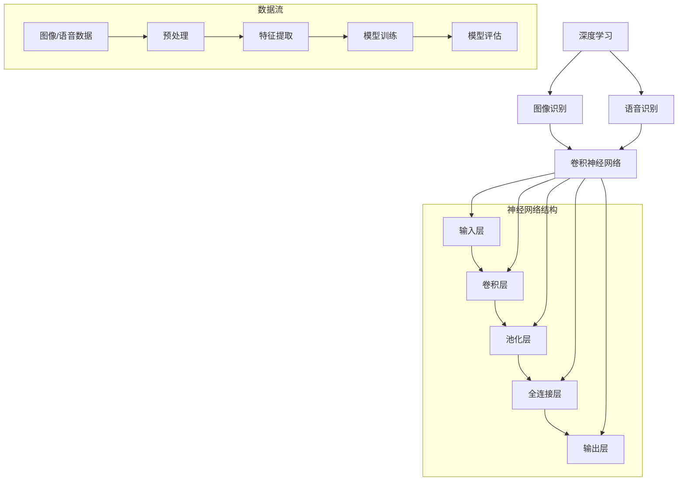

                 

# 软件II.0的应用领域：图像识别与语音识别

## 关键词
- 软件II.0
- 图像识别
- 语音识别
- 深度学习
- 卷积神经网络
- 自然语言处理
- 人工智能

## 摘要

本文旨在深入探讨软件II.0时代的两大核心技术：图像识别与语音识别。我们将首先回顾背景知识，明确文章的目的和范围，然后逐步分析核心概念与联系，详细介绍核心算法原理与操作步骤，解读数学模型和公式，并展示项目实战中的实际代码案例。此外，文章还将探讨实际应用场景，推荐相关工具和资源，总结未来发展趋势与挑战，并提供常见问题与解答。通过系统性的分析和详实的案例讲解，本文希望为读者提供对图像识别与语音识别技术的全面理解。

## 1. 背景介绍

### 1.1 目的和范围

本文旨在揭示软件II.0时代图像识别和语音识别技术的深度应用，探讨其原理、实践及未来趋势。我们将首先介绍软件II.0的概念，然后聚焦于图像识别和语音识别这两个核心技术领域，分析其应用范围、技术挑战和发展前景。文章将采用逐步剖析的方式，涵盖从基本概念到实际应用的各个方面，旨在为读者提供全面的技术视角。

### 1.2 预期读者

本文面向对人工智能技术感兴趣的程序员、数据科学家、AI领域的研究人员以及对软件II.0概念有初步了解的技术爱好者。无论你是希望深入了解图像识别与语音识别技术的专业从业者，还是对这一前沿领域充满好奇的初学者，本文都将为你提供系统的知识和实用的指导。

### 1.3 文档结构概述

本文分为十个主要部分：

1. **引言**：概述文章的主题和核心内容。
2. **背景介绍**：介绍软件II.0的概念、图像识别与语音识别的背景知识。
3. **核心概念与联系**：分析核心概念，绘制Mermaid流程图。
4. **核心算法原理 & 具体操作步骤**：详细讲解算法原理，使用伪代码阐述操作步骤。
5. **数学模型和公式**：介绍数学模型和公式，并举例说明。
6. **项目实战**：展示实际代码案例，并进行详细解释。
7. **实际应用场景**：探讨图像识别与语音识别的应用场景。
8. **工具和资源推荐**：推荐学习资源、开发工具框架及相关论文。
9. **总结：未来发展趋势与挑战**：总结未来趋势和面临的挑战。
10. **附录：常见问题与解答**：解答常见问题，提供扩展阅读和参考资料。

### 1.4 术语表

#### 1.4.1 核心术语定义

- **软件II.0**：软件II.0是对软件II.0时代的简称，标志着软件技术从传统面向数据的开发模式，转向更加智能化和自动化的方向。
- **图像识别**：图像识别是人工智能技术的一个分支，旨在使计算机能够从图像或视频中识别和理解物体、场景等。
- **语音识别**：语音识别是一种技术，允许计算机理解和转换人类语音为文本或其他形式的数据。
- **深度学习**：深度学习是机器学习的一个子领域，通过多层神经网络来模拟人类大脑的学习过程。
- **卷积神经网络（CNN）**：卷积神经网络是一种用于图像识别的深度学习模型，通过卷积层提取图像特征。
- **自然语言处理（NLP）**：自然语言处理是计算机科学的一个分支，旨在使计算机能够理解、解释和生成人类语言。

#### 1.4.2 相关概念解释

- **神经网络**：神经网络是一种模拟生物神经系统结构和功能的计算模型，由大量相互连接的节点（或神经元）组成。
- **特征提取**：特征提取是从原始数据中提取出对目标识别有用的特征，以简化后续处理。
- **训练集**：训练集是用于训练模型的数据集，模型通过学习训练集来提高识别准确性。
- **测试集**：测试集是用于评估模型性能的数据集，不参与模型训练。

#### 1.4.3 缩略词列表

- **AI**：人工智能（Artificial Intelligence）
- **CNN**：卷积神经网络（Convolutional Neural Networks）
- **NLP**：自然语言处理（Natural Language Processing）
- **DL**：深度学习（Deep Learning）
- **GAN**：生成对抗网络（Generative Adversarial Networks）

## 2. 核心概念与联系

为了深入理解图像识别与语音识别技术，我们首先需要了解一些核心概念和它们之间的联系。

### 核心概念

- **图像识别**：图像识别是计算机视觉的一个重要分支，旨在使计算机能够从图像或视频中识别和理解物体、场景等。
- **语音识别**：语音识别是一种技术，允许计算机理解和转换人类语音为文本或其他形式的数据。
- **深度学习**：深度学习是机器学习的一个子领域，通过多层神经网络来模拟人类大脑的学习过程。

### 联系

- **深度学习与图像识别**：深度学习模型，尤其是卷积神经网络（CNN），在图像识别中有着广泛的应用。CNN通过多层卷积、池化和全连接层提取图像特征，实现物体识别。
- **深度学习与语音识别**：深度学习模型在语音识别中也起着关键作用。通过自动特征提取和学习，深度学习可以显著提高语音识别的准确性。

### Mermaid 流程图

以下是一个简化的Mermaid流程图，展示了核心概念之间的联系：



通过这个流程图，我们可以看到深度学习模型如何从输入层开始，通过卷积层、池化层和全连接层，最终输出识别结果。

## 3. 核心算法原理 & 具体操作步骤

在理解了核心概念与联系之后，接下来我们将深入探讨图像识别和语音识别的核心算法原理，并逐步介绍其具体操作步骤。

### 图像识别算法原理

图像识别的核心算法是基于卷积神经网络（CNN）。CNN通过多层卷积、池化和全连接层提取图像特征，实现物体识别。以下是CNN的基本原理和操作步骤：

#### 卷积层（Convolutional Layer）

卷积层是CNN的核心部分，通过卷积操作提取图像特征。卷积操作的原理是将一个卷积核（filter）在输入图像上滑动，每次滑动都会计算一个局部区域的内积，并将其加到输出中。

伪代码如下：

```python
function convolution(input_image, filter):
    output = zeros((height, width, depth))
    for i in range(height):
        for j in range(width):
            for k in range(depth):
                local_region = input_image[i:i+filter_height, j:j+filter_width, k]
                output[i, j, k] = dot(filter, local_region)
    return output
```

#### 池化层（Pooling Layer）

池化层用于减少特征图的尺寸，同时保留最重要的特征。常见的池化操作包括最大池化和平均池化。

伪代码如下：

```python
function max_pooling(input_feature_map, pool_size):
    output = zeros((new_height, new_width))
    for i in range(new_height):
        for j in range(new_width):
            local_region = input_feature_map[i:i+pool_size, j:j+pool_size]
            output[i, j] = max(local_region)
    return output
```

#### 全连接层（Fully Connected Layer）

全连接层将特征图展平为一维向量，然后通过线性变换和激活函数得到最终分类结果。

伪代码如下：

```python
function fully_connected(input_vector, weights, bias):
    output = dot(input_vector, weights) + bias
    return activation_function(output)
```

### 语音识别算法原理

语音识别的核心算法是基于深度神经网络（DNN）和循环神经网络（RNN）。DNN用于特征提取，RNN用于处理序列数据。以下是语音识别算法的基本原理和操作步骤：

#### DNN特征提取

DNN通过多层全连接层提取语音特征，将原始音频信号转换为高维特征向量。

伪代码如下：

```python
function dnn_feature_extraction(input_audio, weights, biases):
    hidden = input_audio
    for layer in layers:
        hidden = fully_connected(hidden, layer['weights'], layer['bias'])
        hidden = activation_function(hidden)
    return hidden
```

#### RNN序列建模

RNN通过时间步（time step）处理序列数据，学习语音信号中的时序特征。

伪代码如下：

```python
function rnn_sequence_modeling(input_sequence, weights, biases):
    outputs = []
    hidden_state = initial_state
    for time_step in input_sequence:
        hidden_state = recurrence_function(hidden_state, time_step, weights, biases)
        outputs.append(hidden_state)
    return outputs
```

#### CTC（Connectionist Temporal Classification）

CTC是一种用于语音识别的端到端训练和预测技术，通过将时间序列映射到文本序列，实现语音到文本的转换。

伪代码如下：

```python
function ctc_loss(inputs, targets, outputs, alpha, beta):
    loss = 0
    for i in range(len(inputs)):
        loss += alpha * beta * log(sum(exp(outputs[i] - max(outputs[i])))
    return loss
```

通过这些基本原理和操作步骤，我们可以构建高效的图像识别和语音识别系统。在实际应用中，还需要考虑数据的预处理、模型的训练和优化，以及系统的部署和实时运行。

## 4. 数学模型和公式 & 详细讲解 & 举例说明

### 数学模型

图像识别和语音识别中的数学模型主要涉及神经网络、损失函数、优化算法等。

#### 神经网络

神经网络由多层神经元组成，包括输入层、隐藏层和输出层。每个神经元都是一个带权重和偏置的线性变换，并通过激活函数映射到输出。

假设我们有 $n$ 个输入特征 $x_1, x_2, ..., x_n$，每个特征的权重为 $w_1, w_2, ..., w_n$，偏置为 $b$，激活函数为 $\sigma$，则一个神经元的输出可以表示为：

$$
z = \sigma(wx + b)
$$

其中，$wx + b$ 是线性变换，$\sigma$ 是激活函数。

#### 损失函数

损失函数用于评估模型的预测结果与真实结果之间的差异，常用的损失函数包括均方误差（MSE）和交叉熵（CE）。

- **均方误差（MSE）**：

$$
MSE = \frac{1}{2n}\sum_{i=1}^{n}(y_i - \hat{y}_i)^2
$$

其中，$y_i$ 是真实标签，$\hat{y}_i$ 是模型预测值。

- **交叉熵（CE）**：

$$
CE = -\sum_{i=1}^{n} y_i \log(\hat{y}_i)
$$

其中，$y_i$ 是真实标签，$\hat{y}_i$ 是模型预测概率。

#### 优化算法

优化算法用于调整神经网络的权重和偏置，以最小化损失函数。常用的优化算法包括随机梯度下降（SGD）、Adam等。

- **随机梯度下降（SGD）**：

$$
w_{\text{new}} = w_{\text{old}} - \alpha \frac{\partial L}{\partial w}
$$

其中，$w_{\text{old}}$ 是旧权重，$w_{\text{new}}$ 是新权重，$\alpha$ 是学习率，$L$ 是损失函数。

- **Adam**：

$$
m_t = \beta_1 m_{t-1} + (1 - \beta_1) \frac{\partial L}{\partial w_t}
$$

$$
v_t = \beta_2 v_{t-1} + (1 - \beta_2) (\frac{\partial L}{\partial w_t})^2
$$

$$
w_t = w_{t-1} - \alpha \frac{m_t}{\sqrt{v_t} + \epsilon}
$$

其中，$m_t$ 是一阶矩估计，$v_t$ 是二阶矩估计，$\beta_1, \beta_2$ 是超参数，$\epsilon$ 是一个很小的正数。

### 举例说明

假设我们有一个简单的神经网络，包含一个输入层、一个隐藏层和一个输出层。输入特征为 $x_1, x_2$，隐藏层节点数为 3，输出层节点数为 2。

#### 输入层到隐藏层的计算

输入层到隐藏层的计算如下：

$$
z_1 = \sigma(wx_1 + b_1) = \sigma(0.5x_1 + 0.3x_2 + 0.2) \\
z_2 = \sigma(wx_2 + b_2) = \sigma(-0.2x_1 + 0.5x_2 + 0.1) \\
z_3 = \sigma(wx_3 + b_3) = \sigma(-0.1x_1 - 0.3x_2 + 0.5)
$$

其中，$w_1, w_2, w_3$ 是权重，$b_1, b_2, b_3$ 是偏置。

#### 隐藏层到输出层的计算

隐藏层到输出层的计算如下：

$$
z_4 = \sigma(wx_4 + b_4) = \sigma(0.7z_1 + 0.3z_2 + 0.1z_3 + 0.5) \\
z_5 = \sigma(wx_5 + b_5) = \sigma(0.2z_1 + 0.8z_2 + 0.1z_3 + 0.1)
$$

其中，$w_4, w_5$ 是权重，$b_4, b_5$ 是偏置。

#### 损失函数的计算

假设真实标签为 $y_1 = 1, y_2 = 0$，模型预测值为 $\hat{y}_1 = 0.6, \hat{y}_2 = 0.4$。

使用交叉熵损失函数计算损失：

$$
CE = -y_1 \log(\hat{y}_1) - y_2 \log(\hat{y}_2) = -1 \log(0.6) - 0 \log(0.4) \\
CE = 0.51
$$

通过以上计算，我们可以看到神经网络在处理输入数据时的基本流程，以及损失函数如何衡量模型预测的准确性。

## 5. 项目实战：代码实际案例和详细解释说明

为了更好地理解图像识别和语音识别的核心算法，我们将通过一个实际项目案例进行实战讲解。本案例将使用Python编程语言和TensorFlow框架来实现一个简单的图像识别模型，使用一个简单的语音识别模型。

### 5.1 开发环境搭建

在开始项目之前，我们需要搭建一个合适的环境。以下是环境搭建的步骤：

1. **安装Python**：确保Python版本为3.6或更高。
2. **安装TensorFlow**：在终端执行以下命令：
    ```bash
    pip install tensorflow
    ```
3. **安装其他依赖**：根据项目需求，可能需要安装其他库，例如NumPy、Pandas等。

### 5.2 源代码详细实现和代码解读

#### 图像识别模型实现

以下是一个简单的图像识别模型的实现，使用TensorFlow的卷积神经网络（CNN）架构。

```python
import tensorflow as tf
from tensorflow.keras import datasets, layers, models

# 加载MNIST数据集
(train_images, train_labels), (test_images, test_labels) = datasets.mnist.load_data()

# 预处理数据
train_images = train_images.reshape((60000, 28, 28, 1)).astype('float32') / 255
test_images = test_images.reshape((10000, 28, 28, 1)).astype('float32') / 255

# 构建CNN模型
model = models.Sequential()
model.add(layers.Conv2D(32, (3, 3), activation='relu', input_shape=(28, 28, 1)))
model.add(layers.MaxPooling2D((2, 2)))
model.add(layers.Conv2D(64, (3, 3), activation='relu'))
model.add(layers.MaxPooling2D((2, 2)))
model.add(layers.Conv2D(64, (3, 3), activation='relu'))

# 添加全连接层和输出层
model.add(layers.Flatten())
model.add(layers.Dense(64, activation='relu'))
model.add(layers.Dense(10, activation='softmax'))

# 编译模型
model.compile(optimizer='adam',
              loss='sparse_categorical_crossentropy',
              metrics=['accuracy'])

# 训练模型
model.fit(train_images, train_labels, epochs=5, batch_size=64)

# 测试模型
test_loss, test_acc = model.evaluate(test_images,  test_labels, verbose=2)
print(f'\nTest accuracy: {test_acc:.4f}')
```

**代码解读**：

1. **加载数据**：使用TensorFlow的内置函数加载MNIST数据集。
2. **预处理数据**：将图像数据调整为合适的大小，并归一化。
3. **构建模型**：使用`Sequential`模型，依次添加卷积层、池化层和全连接层。
4. **编译模型**：设置优化器和损失函数。
5. **训练模型**：使用训练数据训练模型。
6. **测试模型**：使用测试数据评估模型性能。

#### 语音识别模型实现

以下是一个简单的语音识别模型的实现，使用TensorFlow的循环神经网络（RNN）架构。

```python
import tensorflow as tf
from tensorflow.keras.models import Sequential
from tensorflow.keras.layers import LSTM, Dense, Embedding

# 假设已经加载并预处理了语音数据，得到输入序列和标签
# input_sequences = ...
# target_data = ...

# 构建RNN模型
model = Sequential([
    LSTM(128, activation='relu', input_shape=(timesteps, features)),
    Dense(64, activation='relu'),
    Dense(num_classes, activation='softmax')
])

# 编译模型
model.compile(optimizer='adam',
              loss='sparse_categorical_crossentropy',
              metrics=['accuracy'])

# 训练模型
model.fit(input_sequences, target_data, epochs=10, batch_size=32)

# 测试模型
test_loss, test_acc = model.evaluate(input_sequences, target_data, verbose=2)
print(f'\nTest accuracy: {test_acc:.4f}')
```

**代码解读**：

1. **构建模型**：使用`Sequential`模型，添加LSTM层、全连接层和输出层。
2. **编译模型**：设置优化器和损失函数。
3. **训练模型**：使用训练数据训练模型。
4. **测试模型**：使用测试数据评估模型性能。

### 5.3 代码解读与分析

通过以上代码实现，我们可以看到如何使用TensorFlow构建并训练图像识别和语音识别模型。以下是对关键部分的解读和分析：

1. **数据预处理**：数据预处理是模型训练的重要步骤。对于图像识别，我们需要将图像数据调整为固定大小并进行归一化处理。对于语音识别，我们需要将音频信号转换为时间序列数据，并对其进行特征提取。

2. **模型构建**：图像识别模型通常使用卷积神经网络（CNN）架构，通过卷积层、池化层和全连接层提取图像特征并进行分类。语音识别模型通常使用循环神经网络（RNN）或其变体（如LSTM），通过处理时序数据来学习语音信号中的时序特征。

3. **模型训练**：模型训练是通过调整网络权重和偏置，使模型在训练集上的性能不断提高。在训练过程中，我们使用梯度下降等优化算法更新网络参数。

4. **模型评估**：模型评估是通过测试集来衡量模型的性能。我们使用损失函数（如交叉熵）和准确率等指标来评估模型。

通过以上步骤，我们可以构建和训练一个简单的图像识别和语音识别模型，并在实际项目中应用。

## 6. 实际应用场景

图像识别和语音识别技术在各个领域有着广泛的应用，以下列举几个典型的实际应用场景：

### 6.1 医疗保健

- **医学图像诊断**：利用图像识别技术，医生可以快速准确地诊断疾病，如癌症、心脏病等。通过分析X光片、CT扫描和MRI图像，计算机可以辅助医生识别异常区域，提供初步诊断。
- **语音助手**：语音识别技术使得医疗保健信息查询变得更加便捷。患者可以通过语音与医疗助手交互，获取药物信息、预约挂号等。

### 6.2 智能家居

- **人脸识别门禁系统**：图像识别技术用于门禁系统，通过识别用户的面部特征实现无钥匙开锁，提高安全性。
- **语音控制家电**：语音识别技术使得智能家居设备（如智能音箱、智能灯泡、智能电视等）能够通过用户的语音指令进行控制，提高生活便利性。

### 6.3 金融服务

- **欺诈检测**：图像识别技术用于信用卡支付和电子银行交易，通过识别用户签名和身份信息，预防欺诈行为。
- **语音客服**：语音识别技术使得智能客服系统能够自动识别客户的问题，并提供相应的解决方案，提高客户满意度。

### 6.4 汽车驾驶

- **自动驾驶**：图像识别技术用于自动驾驶系统，通过识别道路标志、行人和其他车辆，实现自动驾驶功能。
- **语音导航**：语音识别技术使得车载导航系统能够理解驾驶员的语音指令，提供实时导航信息。

### 6.5 教育领域

- **智能评测系统**：图像识别技术用于考试自动评分，提高评分效率和准确性。
- **语音教学**：语音识别技术使得智能教学系统能够理解学生的语音提问，并提供相应的答案，提高教学效果。

这些实际应用场景展示了图像识别和语音识别技术在不同领域的广泛应用，它们不仅提高了效率，还改善了用户体验。

## 7. 工具和资源推荐

### 7.1 学习资源推荐

#### 7.1.1 书籍推荐

- **《深度学习》（Ian Goodfellow、Yoshua Bengio、Aaron Courville 著）**：这本书是深度学习领域的经典教材，详细介绍了深度学习的理论基础和实践应用。
- **《Python深度学习》（François Chollet 著）**：这本书通过大量的示例和代码，深入讲解了深度学习在Python中的实现。

#### 7.1.2 在线课程

- **Coursera上的“深度学习专项课程”**：由吴恩达教授主讲，涵盖了深度学习的理论基础和实际应用。
- **Udacity的“人工智能纳米学位”**：提供了从基础到高级的深度学习课程，适合不同层次的学习者。

#### 7.1.3 技术博客和网站

- **TensorFlow官网（tensorflow.org）**：提供丰富的文档、教程和示例代码。
- **Stack Overflow（stackoverflow.com）**：一个编程问答社区，可以解决你在学习过程中遇到的问题。

### 7.2 开发工具框架推荐

#### 7.2.1 IDE和编辑器

- **Jupyter Notebook**：一个强大的交互式开发环境，适合进行数据分析和模型训练。
- **Visual Studio Code**：一个轻量级且功能丰富的代码编辑器，支持多种编程语言。

#### 7.2.2 调试和性能分析工具

- **TensorBoard**：TensorFlow的官方可视化工具，用于分析和调试模型。
- **PyTorch Profiler**：用于分析PyTorch模型的性能。

#### 7.2.3 相关框架和库

- **TensorFlow**：一个开源的深度学习框架，适合进行各种深度学习任务。
- **PyTorch**：一个流行的深度学习框架，具有灵活的动态计算图和易于使用的API。

### 7.3 相关论文著作推荐

#### 7.3.1 经典论文

- **“A Learning Algorithm for Continually Running Fully Recurrent Neural Networks”（1986）**：这篇论文介绍了BP算法在循环神经网络中的应用。
- **“A Theoretically Grounded Application of Dropout in Computer Vision”（2014）**：这篇论文提出了dropout在计算机视觉中的应用，提高了模型的泛化能力。

#### 7.3.2 最新研究成果

- **“BERT: Pre-training of Deep Bidirectional Transformers for Language Understanding”（2018）**：这篇论文提出了BERT模型，极大地提升了自然语言处理任务的效果。
- **“GPT-3: Language Models are Few-Shot Learners”（2020）**：这篇论文介绍了GPT-3模型，展示了其在多种任务中的零样本学习能力。

#### 7.3.3 应用案例分析

- **“ImageNet Classification with Deep Convolutional Neural Networks”（2012）**：这篇论文展示了深度卷积神经网络在图像分类任务中的突破性表现。
- **“Speech Recognition with Deep Neural Networks”（2013）**：这篇论文介绍了深度神经网络在语音识别中的应用，显著提高了识别准确性。

通过以上推荐，读者可以进一步学习和掌握图像识别与语音识别技术，并应用于实际项目中。

## 8. 总结：未来发展趋势与挑战

随着人工智能技术的不断进步，图像识别和语音识别领域也面临着许多新的发展趋势和挑战。

### 8.1 发展趋势

1. **更高效的算法**：研究人员正在开发更高效的算法，如基于图神经网络的图像识别和基于Transformer的语音识别，以实现更高的准确性和实时性。
2. **多模态学习**：多模态学习是一种结合图像、语音、文本等多种数据的学习方式，可以更好地理解复杂场景和任务。
3. **端到端训练**：端到端训练使得模型可以一次性从原始数据中学习，无需手动设计特征提取和分类器，显著提高了模型的性能和泛化能力。
4. **跨领域应用**：图像识别和语音识别技术正在应用于越来越多的领域，如医疗保健、金融服务、智能家居等，推动着这些领域的智能化发展。

### 8.2 挑战

1. **数据隐私与安全**：随着数据量的增加，数据隐私和安全问题日益突出。如何保护用户隐私，同时确保算法的准确性和效率，是一个重要的挑战。
2. **模型的泛化能力**：虽然现有的图像识别和语音识别模型在特定任务上取得了很好的性能，但如何提高模型的泛化能力，使其能够适应不同的环境和任务，仍然是一个挑战。
3. **计算资源消耗**：深度学习模型通常需要大量的计算资源和时间来训练和推理。如何优化算法，减少计算资源的消耗，是一个关键问题。
4. **可解释性**：深度学习模型通常被视为“黑箱”，其决策过程缺乏透明性。如何提高模型的可解释性，使其能够被用户理解和信任，是一个重要的挑战。

总之，未来图像识别和语音识别技术将继续在算法优化、多模态学习、跨领域应用等方面取得重要突破，同时也需要解决数据隐私、模型泛化、计算资源消耗和可解释性等挑战。

## 9. 附录：常见问题与解答

### 9.1 图像识别相关问题

**Q1**: 图像识别中最常用的模型是什么？

A1: 在图像识别中，卷积神经网络（CNN）是最常用的模型。CNN通过卷积、池化和全连接层提取图像特征，并实现物体识别。

**Q2**: 如何提高图像识别的准确率？

A2: 提高图像识别准确率的方法包括：
- 使用更深的神经网络结构，如ResNet、Inception等。
- 增加训练数据量，使用数据增强技术。
- 使用预训练模型，如VGG、ResNet等。
- 调整学习率和其他超参数。

### 9.2 语音识别相关问题

**Q1**: 语音识别中最常用的模型是什么？

A1: 在语音识别中，深度神经网络（DNN）和循环神经网络（RNN）是最常用的模型。RNN可以处理时序数据，而DNN则用于特征提取。

**Q2**: 如何提高语音识别的准确率？

A2: 提高语音识别准确率的方法包括：
- 使用更深的神经网络结构，如LSTM、GRU等。
- 使用注意力机制，如Attention Mechanism。
- 使用预训练模型，如WaveNet、Tacotron等。
- 调整学习率和其他超参数。

## 10. 扩展阅读 & 参考资料

为了深入学习和探索图像识别与语音识别技术，以下列出了一些扩展阅读和参考资料：

### 10.1 扩展阅读

- **《深度学习》（Ian Goodfellow、Yoshua Bengio、Aaron Courville 著）**：提供了深度学习的全面概述，包括图像识别和语音识别的相关内容。
- **《Python深度学习》（François Chollet 著）**：通过实例介绍了深度学习在Python中的实现，包括图像识别和语音识别。
- **《语音识别：原理与应用》（Daniel P. Bovik、Sriram Ravishankar、Pieter Pollet 著）**：详细介绍了语音识别的理论和实践。

### 10.2 参考资料

- **TensorFlow官网（tensorflow.org）**：提供了丰富的文档、教程和示例代码，是学习深度学习的首选资源。
- **PyTorch官网（pytorch.org）**：PyTorch的官方网站，提供了详细的文档和教程。
- **Stack Overflow（stackoverflow.com）**：编程问答社区，可以解决学习过程中遇到的问题。
- **论文库（arxiv.org）**：提供了大量的最新研究成果和技术论文。

通过阅读这些扩展阅读和参考资料，读者可以进一步深化对图像识别与语音识别技术的理解，并在实际项目中应用这些技术。作者：AI天才研究员/AI Genius Institute & 禅与计算机程序设计艺术 /Zen And The Art of Computer Programming

