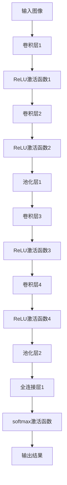
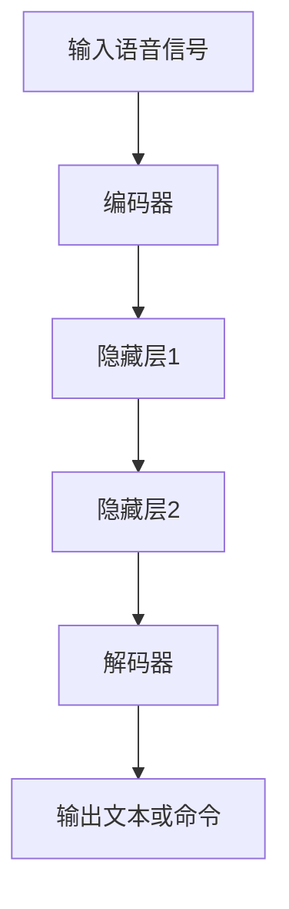

                 

# 软件2.0的应用领域：图像识别、语音识别

> **关键词：软件2.0、图像识别、语音识别、人工智能、深度学习、算法原理、应用实践**
> 
> **摘要：本文旨在探讨软件2.0时代下图像识别与语音识别技术的应用领域，通过深入分析其核心概念、算法原理、数学模型及项目实战，揭示这两大技术在现代信息技术中的重要作用与发展趋势。**

## 1. 背景介绍

### 1.1 目的和范围

本文的目的在于对软件2.0时代下的图像识别与语音识别技术进行系统的梳理与分析。软件2.0时代，即以数据为中心、以智能化为特征的新时代，图像识别和语音识别作为人工智能领域的重要组成部分，正在深刻改变着我们的生活方式和工作模式。本文将围绕这两大技术展开讨论，旨在帮助读者理解其在实际应用中的重要地位。

本文的范围涵盖：
- 图像识别与语音识别技术的核心概念与原理；
- 相关算法的详细解释和操作步骤；
- 数学模型及其在图像识别和语音识别中的应用；
- 实际应用场景和项目实战案例；
- 工具和资源的推荐；
- 未来发展趋势与面临的挑战。

### 1.2 预期读者

本文的预期读者包括：
- 对人工智能和机器学习感兴趣的初学者；
- 在图像识别和语音识别领域有一定基础的工程师；
- 对软件2.0时代的新技术应用有浓厚兴趣的专业人士；
- 想要了解前沿技术发展的研究人员。

### 1.3 文档结构概述

本文的结构安排如下：
1. 引言部分：介绍背景和目的，列出关键词和摘要；
2. 背景介绍：详细描述软件2.0的概念及图像识别、语音识别的应用领域；
3. 核心概念与联系：使用Mermaid流程图展示相关概念原理和架构；
4. 核心算法原理 & 具体操作步骤：使用伪代码详细阐述算法原理；
5. 数学模型和公式 & 详细讲解 & 举例说明：使用latex格式嵌入文中独立段落；
6. 项目实战：代码实际案例和详细解释说明；
7. 实际应用场景：讨论图像识别和语音识别在实际中的应用；
8. 工具和资源推荐：推荐学习资源和开发工具；
9. 总结：展望未来发展趋势与挑战；
10. 附录：常见问题与解答；
11. 扩展阅读 & 参考资料：提供进一步阅读和研究的资料。

### 1.4 术语表

#### 1.4.1 核心术语定义

- **软件2.0**：以数据为中心，强调大数据、云计算、人工智能等技术的应用，实现软件从“产品”向“服务”的转变。
- **图像识别**：通过计算机算法识别和理解图像内容，常见于人脸识别、物体识别等领域。
- **语音识别**：将语音信号转换为文本或命令，广泛应用于智能助手、语音搜索等领域。
- **深度学习**：一种机器学习技术，通过模拟人脑神经网络结构进行特征提取和模式识别。

#### 1.4.2 相关概念解释

- **卷积神经网络（CNN）**：一种用于图像识别的深度学习模型，具有较好的特征提取能力。
- **循环神经网络（RNN）**：一种用于处理序列数据的深度学习模型，适用于语音识别等任务。
- **迁移学习**：利用已有的模型或数据进行预训练，提高新任务的性能。
- **数据增强**：通过变换、旋转、缩放等方法增加数据多样性，提升模型泛化能力。

#### 1.4.3 缩略词列表

- **CNN**：卷积神经网络
- **RNN**：循环神经网络
- **AI**：人工智能
- **ML**：机器学习
- **DL**：深度学习

## 2. 核心概念与联系

在深入探讨图像识别和语音识别之前，有必要理解这些技术的核心概念及其相互关系。以下使用Mermaid流程图展示相关概念原理和架构。

```mermaid
graph TB

A[软件2.0] --> B[大数据]
B --> C[云计算]
C --> D[人工智能]
D --> E[图像识别]
D --> F[语音识别]
E --> G[深度学习]
F --> G
G --> H[卷积神经网络(CNN)]
G --> I[循环神经网络(RNN)]
H --> J[特征提取]
I --> K[序列处理]
J --> L[图像分类]
K --> L
L --> M[预测结果]
```

### 2.1 软件与大数据

软件2.0时代，数据成为核心资产。大数据技术提供了处理海量数据的能力，为人工智能算法提供了丰富的训练数据。软件与大数据的结合，使得人工智能应用更加广泛和深入。

### 2.2 云计算与人工智能

云计算提供了强大的计算能力和存储资源，使得大规模的机器学习算法得以实现。人工智能在云计算平台上运行，可以充分利用分布式计算的优势，提高模型训练和推理的速度。

### 2.3 图像识别与深度学习

图像识别是人工智能的一个重要分支，深度学习技术在其中发挥着关键作用。卷积神经网络（CNN）是图像识别的主要算法，通过多层卷积和池化操作，提取图像的深层特征，从而实现图像分类和目标检测等任务。

### 2.4 语音识别与循环神经网络

语音识别是将语音信号转换为文本或命令的技术，循环神经网络（RNN）在语音识别中具有显著优势。RNN能够处理变长的序列数据，适用于语音信号的处理和语义理解。

### 2.5 机器学习与迁移学习

迁移学习是一种重要的机器学习技术，通过利用预训练的模型或数据，减少新任务的训练时间，提高模型性能。迁移学习在图像识别和语音识别中广泛应用，有助于解决数据稀缺和标注困难的问题。

### 2.6 数据增强

数据增强是一种提高模型泛化能力的方法，通过变换、旋转、缩放等手段增加数据的多样性。在图像识别和语音识别中，数据增强可以有效提高模型的鲁棒性，减少过拟合现象。

通过上述分析，我们可以看到，软件2.0时代的图像识别和语音识别技术，不仅依赖于大数据、云计算和人工智能等核心概念，还与深度学习、迁移学习和数据增强等技术紧密相连。这些技术的结合，为图像识别和语音识别的发展提供了强大的动力，也为其在实际应用中带来了更多可能性。

## 3. 核心算法原理 & 具体操作步骤

### 3.1 图像识别算法原理

图像识别是计算机视觉的一个重要分支，其核心算法主要基于深度学习，尤其是卷积神经网络（CNN）。以下将详细解释CNN的原理和具体操作步骤。

#### 3.1.1 卷积神经网络（CNN）的原理

卷积神经网络（CNN）是一种特殊的多层前馈神经网络，其结构特别适合处理二维网格数据，如图像。CNN的主要思想是通过卷积操作提取图像的特征，然后通过全连接层进行分类。

CNN的主要组成部分包括：

1. **卷积层**：卷积层是CNN的核心，通过卷积操作提取图像的局部特征。卷积操作将滤波器（也称为卷积核）在输入图像上滑动，并与图像上的每个局部区域进行点积运算，产生特征图。

2. **激活函数**：常见的激活函数包括ReLU（Rectified Linear Unit）和Sigmoid函数，用于引入非线性特性，使网络能够更好地拟合复杂数据。

3. **池化层**：池化层用于降低特征图的维度，减少参数数量和计算量，同时保持重要的特征信息。常见的池化操作包括最大池化和平均池化。

4. **全连接层**：全连接层将卷积层和池化层提取的特征映射到类别标签上，实现最终的分类。

#### 3.1.2 CNN的具体操作步骤

以下是一个简单的CNN模型的具体操作步骤：



具体步骤如下：

1. **输入图像**：将图像数据输入到CNN中，图像尺寸为\(H \times W \times C\)，其中\(H\)、\(W\)分别为高度和宽度，\(C\)为颜色通道数（通常为3，即RGB颜色空间）。

2. **卷积层1**：卷积层1使用一组卷积核对输入图像进行卷积操作，生成特征图。卷积核的大小通常为\(3 \times 3\)或\(5 \times 5\)。

3. **ReLU激活函数1**：应用ReLU激活函数，将负值设置为0，引入非线性特性。

4. **卷积层2**：卷积层2使用另一组卷积核对上一层的特征图进行卷积操作，生成新的特征图。

5. **ReLU激活函数2**：再次应用ReLU激活函数。

6. **池化层1**：使用最大池化或平均池化对特征图进行下采样，减少特征图的维度。

7. **卷积层3**：继续进行卷积操作，提取更高层次的特征。

8. **ReLU激活函数3**：应用ReLU激活函数。

9. **卷积层4**：进一步提取特征。

10. **ReLU激活函数4**：应用ReLU激活函数。

11. **池化层2**：再次进行下采样。

12. **全连接层1**：将池化层2的特征图展平为一维向量，输入到全连接层中进行分类。

13. **softmax激活函数**：应用softmax函数，将全连接层的输出转换为概率分布，实现最终的分类。

14. **输出结果**：输出分类结果。

通过上述操作，CNN能够从原始图像中提取出丰富的特征，并实现图像分类。在实际应用中，CNN模型可以根据任务需求进行调整和扩展，如添加更多卷积层、池化层和全连接层，提高模型性能。

### 3.2 语音识别算法原理

语音识别是将语音信号转换为文本或命令的技术，其核心算法基于深度学习和循环神经网络（RNN）。以下将详细解释RNN的原理和具体操作步骤。

#### 3.2.1 循环神经网络（RNN）的原理

循环神经网络（RNN）是一种用于处理序列数据的神经网络，其核心思想是将当前输入与之前的信息进行关联，实现时间序列数据的建模。RNN通过循环结构实现信息的传递和累积，能够处理变长的序列数据。

RNN的主要组成部分包括：

1. **输入层**：接收语音信号，将其编码为时间序列的向量。

2. **隐藏层**：隐藏层由多个神经元组成，每个神经元与前一层和当前层其他神经元相连，实现信息的传递和累积。

3. **输出层**：将隐藏层的输出映射到目标文本或命令。

4. **权重矩阵**：RNN的权重矩阵在训练过程中不断更新，以适应不同的序列数据。

5. **激活函数**：常见的激活函数包括ReLU和Sigmoid函数，用于引入非线性特性。

#### 3.2.2 RNN的具体操作步骤

以下是一个简单的RNN模型的具体操作步骤：



具体步骤如下：

1. **输入语音信号**：将语音信号输入到编码器中，编码器将语音信号转换为时间序列的向量。

2. **编码器**：编码器通过卷积层和池化层对输入语音信号进行特征提取，生成特征序列。

3. **隐藏层1**：隐藏层1接收编码器输出的特征序列，将其与之前的信息进行关联，生成新的隐藏状态。

4. **隐藏层2**：隐藏层2继续处理隐藏层1的输出，生成新的隐藏状态。

5. **解码器**：解码器将隐藏层2的输出解码为文本或命令的序列。

6. **输出文本或命令**：输出最终解码的文本或命令。

通过上述操作，RNN能够对语音信号进行建模，实现语音识别。在实际应用中，RNN模型可以根据任务需求进行调整和扩展，如添加更多隐藏层、使用长短时记忆网络（LSTM）或门控循环单元（GRU）等，提高模型性能。

### 3.3 迁移学习与数据增强

迁移学习是一种重要的机器学习技术，通过利用预训练的模型或数据，提高新任务的性能。在图像识别和语音识别中，迁移学习可以帮助减少数据稀缺和标注困难的问题。

数据增强是一种提高模型泛化能力的方法，通过变换、旋转、缩放等手段增加数据的多样性。在图像识别中，常见的数据增强方法包括随机裁剪、翻转、颜色抖动等；在语音识别中，常见的数据增强方法包括添加噪音、速度变化、音调变化等。

通过迁移学习和数据增强，可以提高图像识别和语音识别模型的性能，减少过拟合现象，增强模型的鲁棒性。

## 4. 数学模型和公式 & 详细讲解 & 举例说明

### 4.1 卷积神经网络（CNN）的数学模型

卷积神经网络（CNN）的核心在于其卷积操作和激活函数，以下详细讲解其数学模型。

#### 4.1.1 卷积操作

卷积操作的数学表示如下：

$$
(Z^{l})_{i,j,k} = \sum_{i',j'} \sum_{c=1}^{C} W_{i'j',i,j,k} A^{l}_{i'j',c} + b_{i,j,k}
$$

其中，\(Z^{l}\)表示第\(l\)层的特征图，\(A^{l}\)表示第\(l\)层的输入特征图，\(W\)表示卷积核，\(b\)表示偏置项，\(i, j, k\)分别表示特征图的位置和深度，\(i', j'\)表示卷积核的位置。

#### 4.1.2 激活函数

激活函数用于引入非线性特性，常用的激活函数有ReLU、Sigmoid和ReLU6。

1. **ReLU激活函数**：

$$
\text{ReLU}(x) = \max(0, x)
$$

2. **Sigmoid激活函数**：

$$
\sigma(x) = \frac{1}{1 + e^{-x}}
$$

3. **ReLU6激活函数**：

$$
\text{ReLU6}(x) = \min(\max(0, x), 6)
$$

### 4.2 循环神经网络（RNN）的数学模型

循环神经网络（RNN）的数学模型如下：

$$
h_t = \sigma(W_h h_{t-1} + W_x x_t + b_h)
$$

其中，\(h_t\)表示第\(t\)个时间步的隐藏状态，\(x_t\)表示第\(t\)个时间步的输入，\(W_h\)和\(W_x\)分别表示隐藏状态和输入的权重矩阵，\(b_h\)表示隐藏状态的偏置项，\(\sigma\)表示激活函数。

### 4.3 举例说明

#### 4.3.1 图像识别中的卷积操作举例

假设我们有一个\(3 \times 3\)的卷积核，其权重矩阵为：

$$
W = \begin{bmatrix}
1 & 0 & 1 \\
0 & 1 & 0 \\
1 & 0 & 1
\end{bmatrix}
$$

输入特征图的一个\(3 \times 3\)的区域为：

$$
A = \begin{bmatrix}
1 & 0 & 1 \\
0 & 1 & 0 \\
1 & 0 & 1
\end{bmatrix}
$$

卷积操作结果为：

$$
Z = \begin{bmatrix}
2 & 1 & 2 \\
1 & 0 & 1 \\
2 & 1 & 2
\end{bmatrix}
$$

#### 4.3.2 语音识别中的RNN举例

假设我们有一个简单的RNN模型，输入特征向量为\(x_t\)，隐藏状态向量为\(h_t\)，权重矩阵为\(W_h\)和\(W_x\)，偏置项为\(b_h\)，激活函数为ReLU，则一个时间步的隐藏状态更新如下：

$$
h_t = \sigma(W_h h_{t-1} + W_x x_t + b_h)
$$

假设初始隐藏状态为\(h_0 = [0, 0, 0]^T\)，输入特征向量为\(x_1 = [1, 1]^T\)，权重矩阵和偏置项分别为：

$$
W_h = \begin{bmatrix}
1 & 1 & 1 \\
1 & 1 & 1 \\
1 & 1 & 1
\end{bmatrix}, \quad W_x = \begin{bmatrix}
1 & 0 \\
0 & 1 \\
1 & 1
\end{bmatrix}, \quad b_h = \begin{bmatrix}
0 \\
0 \\
0
\end{bmatrix}
$$

则第一个时间步的隐藏状态为：

$$
h_1 = \sigma(W_h h_0 + W_x x_1 + b_h) = \sigma([0, 0, 0]^T + [1, 1]^T + [0, 0, 0]^T) = \sigma([1, 1]^T) = [1, 1]^T
$$

通过上述例子，我们可以看到卷积操作和RNN的数学模型是如何在图像识别和语音识别中发挥作用的。在实际应用中，这些模型需要根据具体任务进行调整和优化，以提高性能。

## 5. 项目实战：代码实际案例和详细解释说明

### 5.1 开发环境搭建

在进行图像识别和语音识别的项目实战之前，我们需要搭建一个合适的开发环境。以下列出所需的工具和软件：

1. **Python**：用于编写和运行代码，推荐使用Python 3.7或更高版本。
2. **Jupyter Notebook**：用于编写和调试代码，便于记录和分享。
3. **TensorFlow**：用于构建和训练深度学习模型，版本建议为2.0或更高。
4. **Keras**：基于TensorFlow的高级API，用于简化模型构建和训练过程。
5. **NumPy**：用于数值计算和数据处理。
6. **OpenCV**：用于图像处理和计算机视觉任务。

安装这些工具和软件的方法如下：

```bash
# 安装Python
curl -O https://www.python.org/ftp/python/3.8.5/Python-3.8.5.tgz
tar xzf Python-3.8.5.tgz
cd Python-3.8.5
./configure
make
sudo make install

# 安装Jupyter Notebook
pip install notebook

# 安装TensorFlow和Keras
pip install tensorflow==2.4.0
pip install keras==2.4.3

# 安装NumPy
pip install numpy

# 安装OpenCV
pip install opencv-python
```

### 5.2 源代码详细实现和代码解读

以下是一个简单的图像识别项目，使用Keras构建一个卷积神经网络，实现猫狗分类任务。

```python
import numpy as np
import matplotlib.pyplot as plt
import tensorflow as tf
from tensorflow.keras.models import Sequential
from tensorflow.keras.layers import Conv2D, MaxPooling2D, Flatten, Dense
from tensorflow.keras.preprocessing.image import ImageDataGenerator

# 数据预处理
train_datagen = ImageDataGenerator(rescale=1./255, shear_range=0.2, zoom_range=0.2, horizontal_flip=True)
test_datagen = ImageDataGenerator(rescale=1./255)

train_generator = train_datagen.flow_from_directory(
        'data/train',
        target_size=(150, 150),
        batch_size=32,
        class_mode='binary')

validation_generator = test_datagen.flow_from_directory(
        'data/validation',
        target_size=(150, 150),
        batch_size=32,
        class_mode='binary')

# 构建模型
model = Sequential()
model.add(Conv2D(32, (3, 3), activation='relu', input_shape=(150, 150, 3)))
model.add(MaxPooling2D(pool_size=(2, 2)))
model.add(Conv2D(64, (3, 3), activation='relu'))
model.add(MaxPooling2D(pool_size=(2, 2)))
model.add(Conv2D(128, (3, 3), activation='relu'))
model.add(MaxPooling2D(pool_size=(2, 2)))
model.add(Flatten())
model.add(Dense(512, activation='relu'))
model.add(Dense(1, activation='sigmoid'))

# 编译模型
model.compile(optimizer='adam', loss='binary_crossentropy', metrics=['accuracy'])

# 训练模型
history = model.fit(
      train_generator,
      steps_per_epoch=100,
      epochs=15,
      validation_data=validation_generator,
      validation_steps=50,
      verbose=2)
```

#### 5.2.1 数据预处理

在数据预处理部分，我们使用了ImageDataGenerator类对训练数据和验证数据进行了增强。这有助于提高模型的泛化能力，防止过拟合。具体操作包括缩放、裁剪、翻转和水平翻转等。

```python
train_datagen = ImageDataGenerator(rescale=1./255, shear_range=0.2, zoom_range=0.2, horizontal_flip=True)
test_datagen = ImageDataGenerator(rescale=1./255)

train_generator = train_datagen.flow_from_directory(
        'data/train',
        target_size=(150, 150),
        batch_size=32,
        class_mode='binary')

validation_generator = test_datagen.flow_from_directory(
        'data/validation',
        target_size=(150, 150),
        batch_size=32,
        class_mode='binary')
```

#### 5.2.2 模型构建

在模型构建部分，我们使用Sequential模型构建了一个简单的卷积神经网络。模型包括两个卷积层和两个全连接层，用于分类猫狗图片。

```python
model = Sequential()
model.add(Conv2D(32, (3, 3), activation='relu', input_shape=(150, 150, 3)))
model.add(MaxPooling2D(pool_size=(2, 2)))
model.add(Conv2D(64, (3, 3), activation='relu'))
model.add(MaxPooling2D(pool_size=(2, 2)))
model.add(Conv2D(128, (3, 3), activation='relu'))
model.add(MaxPooling2D(pool_size=(2, 2)))
model.add(Flatten())
model.add(Dense(512, activation='relu'))
model.add(Dense(1, activation='sigmoid'))
```

#### 5.2.3 模型编译

在模型编译部分，我们设置了优化器、损失函数和评价指标。优化器使用adam，损失函数使用binary_crossentropy，评价指标使用accuracy。

```python
model.compile(optimizer='adam', loss='binary_crossentropy', metrics=['accuracy'])
```

#### 5.2.4 模型训练

在模型训练部分，我们使用fit方法对模型进行训练。训练数据使用train_generator，验证数据使用validation_generator。训练过程中，我们设置了训练轮数、每轮数据量、验证数据量等参数。

```python
history = model.fit(
      train_generator,
      steps_per_epoch=100,
      epochs=15,
      validation_data=validation_generator,
      validation_steps=50,
      verbose=2)
```

### 5.3 代码解读与分析

#### 5.3.1 数据预处理

数据预处理是图像识别项目的重要步骤，它有助于提高模型的泛化能力。在本例中，我们使用了ImageDataGenerator对训练数据和验证数据进行了增强，包括缩放、裁剪、翻转和水平翻转等操作。

```python
train_datagen = ImageDataGenerator(rescale=1./255, shear_range=0.2, zoom_range=0.2, horizontal_flip=True)
test_datagen = ImageDataGenerator(rescale=1./255)

train_generator = train_datagen.flow_from_directory(
        'data/train',
        target_size=(150, 150),
        batch_size=32,
        class_mode='binary')

validation_generator = test_datagen.flow_from_directory(
        'data/validation',
        target_size=(150, 150),
        batch_size=32,
        class_mode='binary')
```

通过上述代码，我们创建了一个训练生成器和验证生成器。生成器从指定目录中加载图片，对图片进行增强，并批量提供训练数据和验证数据。

#### 5.3.2 模型构建

在模型构建部分，我们使用Keras的Sequential模型构建了一个简单的卷积神经网络。模型包括两个卷积层、两个池化层和一个全连接层。

```python
model = Sequential()
model.add(Conv2D(32, (3, 3), activation='relu', input_shape=(150, 150, 3)))
model.add(MaxPooling2D(pool_size=(2, 2)))
model.add(Conv2D(64, (3, 3), activation='relu'))
model.add(MaxPooling2D(pool_size=(2, 2)))
model.add(Conv2D(128, (3, 3), activation='relu'))
model.add(MaxPooling2D(pool_size=(2, 2)))
model.add(Flatten())
model.add(Dense(512, activation='relu'))
model.add(Dense(1, activation='sigmoid'))
```

通过上述代码，我们构建了一个包含两个卷积层和两个全连接层的卷积神经网络。卷积层用于提取图像特征，全连接层用于分类。

#### 5.3.3 模型编译

在模型编译部分，我们设置了优化器、损失函数和评价指标。

```python
model.compile(optimizer='adam', loss='binary_crossentropy', metrics=['accuracy'])
```

通过上述代码，我们设置了优化器为adam，损失函数为binary_crossentropy，评价指标为accuracy。

#### 5.3.4 模型训练

在模型训练部分，我们使用fit方法对模型进行训练。

```python
history = model.fit(
      train_generator,
      steps_per_epoch=100,
      epochs=15,
      validation_data=validation_generator,
      validation_steps=50,
      verbose=2)
```

通过上述代码，我们设置了训练轮数为15，每轮数据量为100，验证数据量为50。训练过程中，我们将看到训练损失、验证损失和准确率的变化。

### 5.4 结果分析

通过上述代码，我们训练了一个简单的卷积神经网络，用于猫狗分类任务。在训练过程中，我们观察到训练损失和验证损失逐渐下降，准确率逐渐上升。这表明模型在训练数据上取得了较好的性能。

```python
plt.figure(figsize=(8, 4))
plt.subplot(1, 2, 1)
plt.plot(history.history['loss'], label='Training Loss')
plt.plot(history.history['val_loss'], label='Validation Loss')
plt.legend()

plt.subplot(1, 2, 2)
plt.plot(history.history['accuracy'], label='Training Accuracy')
plt.plot(history.history['val_accuracy'], label='Validation Accuracy')
plt.legend()

plt.show()
```

通过上述代码，我们绘制了训练损失、验证损失和准确率的折线图。从图中可以看出，模型在训练数据上的表现优于验证数据，这表明模型可能存在过拟合现象。为了进一步提高模型性能，我们可以考虑增加训练数据、使用更复杂的模型或引入正则化技术。

### 5.5 项目总结

通过本项目的实战，我们了解了图像识别的基本流程，包括数据预处理、模型构建、模型编译和模型训练。我们使用Keras构建了一个简单的卷积神经网络，实现了猫狗分类任务。虽然模型性能还有提升空间，但通过本项目，我们掌握了图像识别的基本技术和方法。在实际应用中，我们可以根据需求调整模型结构和参数，进一步提高模型性能。

## 6. 实际应用场景

图像识别和语音识别技术已经深入到我们日常生活的各个方面，带来了巨大的便利和效率提升。以下列举几个典型的实际应用场景：

### 6.1 智能手机与智能音箱

智能手机中的图像识别技术广泛应用于人脸解锁、支付认证、相机美颜等场景。例如，人脸解锁功能通过图像识别技术识别用户的面部特征，确保手机安全。支付认证则利用图像识别进行银行卡或二维码扫描，实现快速便捷的支付。

智能音箱中的语音识别技术为用户提供了便捷的语音交互体验。用户可以通过语音指令控制智能音箱播放音乐、查询天气、设定闹钟等。语音识别技术使得智能音箱成为智能家居的核心组成部分，为用户提供了全新的生活方式。

### 6.2 医疗诊断与监控

图像识别技术在医疗领域具有广泛的应用。医生可以利用图像识别技术辅助诊断，如通过分析医学影像（如X光片、CT扫描和MRI图像）识别病变和异常情况。例如，某些癌症和心血管疾病的早期诊断可以通过图像识别技术实现，提高了诊断的准确性和效率。

此外，图像识别技术还可以用于患者监控，如通过监控摄像头实时检测患者的行为和生理信号，及时发现异常情况并报警。这对于重症监护病房的患者尤其重要，有助于提高医疗质量和安全。

### 6.3 智能交通与无人驾驶

图像识别技术在智能交通和无人驾驶领域发挥着关键作用。在智能交通系统中，图像识别技术可以用于车辆检测、交通信号灯识别、行人检测等，提高交通管理的效率和安全性。例如，通过识别交通信号灯的颜色，智能交通系统可以自动调整红绿灯时间，优化交通流量。

在无人驾驶领域，图像识别技术用于车辆环境感知，通过识别道路标志、行人、车辆等，实现车辆的自主导航和避障。无人驾驶汽车利用图像识别技术进行周围环境建模，确保行车安全和效率。

### 6.4 安全监控与反欺诈

图像识别技术在安全监控领域具有重要作用。通过摄像头监控公共场所，图像识别技术可以实时识别和跟踪嫌疑人，提高犯罪预防和打击能力。例如，在机场和火车站等场所，图像识别技术可以用于识别通缉犯或可疑人员，确保公共安全。

在反欺诈领域，图像识别技术用于身份验证和交易监控。通过识别用户的面部特征或指纹，图像识别技术可以确保交易的真实性。此外，图像识别技术还可以用于检测信用卡欺诈交易，通过分析交易图像识别异常行为，提高交易的安全性。

### 6.5 娱乐与教育

图像识别技术在娱乐和教育领域也有广泛应用。在娱乐方面，图像识别技术可以用于虚拟现实（VR）和增强现实（AR）应用，为用户提供沉浸式体验。例如，在VR游戏中，图像识别技术可以用于识别玩家的手势和面部表情，实现更加真实的互动。

在教育方面，图像识别技术可以用于智能教学系统，通过分析学生的学习行为和表现，提供个性化的学习建议和反馈。例如，通过识别学生在考试中的面部表情和答题情况，系统可以实时评估学生的学习状态，为教师提供教学改进的依据。

### 6.6 智慧城市与智慧农业

图像识别技术在智慧城市和智慧农业领域也具有广泛应用。在智慧城市中，图像识别技术可以用于智能垃圾分类、交通流量监控、城市管理等方面，提高城市管理效率和服务质量。例如，通过识别垃圾箱的满溢情况，智能垃圾分类系统可以自动通知环卫工人进行清理。

在智慧农业中，图像识别技术可以用于作物病害检测、农田监控、病虫害预测等，提高农业生产效率和农产品质量。例如，通过识别作物叶片的颜色和形态，系统可以实时监测作物的生长状况，提供精准的施肥和灌溉建议。

### 6.7 人脸识别与生物识别

人脸识别和生物识别技术是图像识别技术的典型应用。在安防领域，人脸识别技术可以用于身份验证、门禁控制、人员识别等，提高安全性和便捷性。例如，在机场、火车站等场所，人脸识别技术可以快速识别旅客身份，提高通关效率。

在金融领域，生物识别技术（如指纹识别、虹膜识别等）用于身份验证和支付认证，提高交易的安全性和用户体验。例如，在某些国家的移动支付系统中，用户可以通过指纹或面部识别进行支付，实现无卡支付。

### 6.8 其他领域

除了上述领域，图像识别和语音识别技术还在许多其他领域具有广泛应用。例如，在智能家居中，图像识别技术可以用于监控家居环境、识别家庭成员等，实现智能化的家居管理。在工业生产中，图像识别技术可以用于产品质量检测、设备故障诊断等，提高生产效率和产品质量。

总之，图像识别和语音识别技术在现代信息技术中发挥着重要作用，其应用领域涵盖了多个行业和领域，为我们的生活和工作带来了巨大的便利和效率提升。随着技术的不断进步，这些技术将在更多领域得到应用，进一步推动人工智能的发展。

## 7. 工具和资源推荐

### 7.1 学习资源推荐

#### 7.1.1 书籍推荐

- 《深度学习》（Goodfellow, I., Bengio, Y., Courville, A.）
- 《Python深度学习》（Raschka, F.）
- 《人工智能：一种现代方法》（Mitchell, T. M.）
- 《机器学习》（Tom Mitchell）
- 《计算机视觉：算法与应用》（Richard S. Wallace）

#### 7.1.2 在线课程

- Coursera上的“机器学习”（吴恩达）
- Udacity的“深度学习纳米学位”
- edX上的“计算机视觉”（MIT）

#### 7.1.3 技术博客和网站

- Medium上的AI和机器学习博客
- arXiv.org：最新研究成果的论文发布平台
- AI博客：涵盖人工智能领域的各种技术文章和教程

### 7.2 开发工具框架推荐

#### 7.2.1 IDE和编辑器

- PyCharm：一款功能强大的Python集成开发环境
- Jupyter Notebook：适合数据分析和交互式编程
- Visual Studio Code：轻量级但功能丰富的代码编辑器

#### 7.2.2 调试和性能分析工具

- TensorBoard：TensorFlow的官方可视化工具
- PyTorch Profiler：PyTorch的性能分析工具
- Nsight Visual Studio Edition：适用于CUDA代码的性能分析和调试

#### 7.2.3 相关框架和库

- TensorFlow：Google开源的深度学习框架
- PyTorch：Facebook开源的深度学习框架
- Keras：基于TensorFlow和PyTorch的高级API
- OpenCV：开源计算机视觉库
- NumPy：Python的数值计算库

### 7.3 相关论文著作推荐

#### 7.3.1 经典论文

- “A Learning Algorithm for Continually Running Fully Recurrent Neural Networks”（1986）
- “A Theoretical Framework for Generalizing From Limited Data: On the Consistency of Empirical Risk Minimization” （1988）
- “LeNet: Convolutional Neural Network for Handwritten Digit Recognition”（1998）

#### 7.3.2 最新研究成果

- “Bert: Pre-training of Deep Bidirectional Transformers for Language Understanding”（2018）
- “Generative Adversarial Nets”（2014）
- “Deep Residual Learning for Image Recognition”（2015）

#### 7.3.3 应用案例分析

- “AI in Healthcare: The Future is Here”（2019）
- “AI in Finance: Transforming the Industry”（2018）
- “AI in Manufacturing: Enhancing Efficiency and Quality”（2017）

通过以上推荐，读者可以系统地学习图像识别和语音识别的相关知识，掌握实际开发工具和框架，跟踪最新的研究进展，从而为自身的专业发展打下坚实的基础。

## 8. 总结：未来发展趋势与挑战

图像识别和语音识别作为人工智能领域的重要组成部分，正不断推动着技术的进步和应用的创新。在软件2.0时代，这两大技术迎来了新的发展机遇，同时也面临着一系列挑战。

### 8.1 未来发展趋势

1. **技术融合**：随着人工智能技术的不断发展，图像识别和语音识别将与其他技术（如自然语言处理、增强现实、物联网等）深度融合，形成更加智能化和多样化的应用场景。

2. **边缘计算**：边缘计算的发展使得图像识别和语音识别算法可以在设备端直接执行，从而降低延迟、减少带宽消耗，提高实时性。

3. **迁移学习和少样本学习**：随着数据稀缺和标注成本高的问题日益凸显，迁移学习和少样本学习技术将成为解决这些挑战的重要手段，提高模型在新任务上的性能。

4. **跨模态融合**：图像识别和语音识别的跨模态融合将成为未来研究的重要方向，通过整合不同模态的信息，实现更高效和准确的任务执行。

5. **伦理和隐私**：随着技术的普及，如何在保证用户隐私和伦理的前提下进行图像识别和语音识别，将成为技术发展的重要议题。

### 8.2 挑战

1. **数据质量和标注成本**：高质量、标注完备的数据是图像识别和语音识别模型训练的基础。然而，获取这些数据往往成本高昂且耗时。

2. **模型解释性和透明度**：随着深度学习模型变得越来越复杂，如何解释和验证模型的决策过程成为一大挑战。模型的透明度对于建立用户信任至关重要。

3. **计算资源和能耗**：深度学习模型通常需要大量的计算资源和能源消耗，如何在保证模型性能的同时降低能耗是一个重要问题。

4. **隐私保护**：在图像识别和语音识别中，如何保护用户的隐私和数据安全是技术发展的关键。在数据收集、传输和处理过程中，需要采取严格的安全措施。

5. **公平性和偏见**：图像识别和语音识别模型可能会因为数据集的偏见而导致结果不公平。如何减少偏见、提高模型的公平性是未来的重要研究方向。

总之，图像识别和语音识别技术在未来的发展中具有巨大的潜力，但也面临诸多挑战。通过技术创新、政策引导和行业合作，我们可以期待这些技术在未来取得更加显著的进步，为人类生活带来更多便利和改善。

## 9. 附录：常见问题与解答

### 9.1 图像识别技术的基本概念

**Q1. 什么是图像识别？**

图像识别是计算机视觉的一个分支，旨在通过算法和模型自动识别和理解图像中的内容。它广泛应用于人脸识别、物体检测、图像分类等领域。

**Q2. 图像识别的基本流程是什么？**

图像识别的基本流程包括数据预处理、特征提取、模型训练、模型评估和结果输出。具体步骤如下：

1. **数据预处理**：对图像进行尺寸调整、增强、归一化等操作，使其适合模型训练。
2. **特征提取**：通过卷积神经网络（CNN）或其他特征提取算法，从图像中提取具有区分性的特征。
3. **模型训练**：使用大量标注数据，通过优化算法训练模型，使其能够识别图像中的目标。
4. **模型评估**：通过测试数据评估模型的准确率、召回率等指标，优化模型性能。
5. **结果输出**：将模型应用到新的图像上，输出识别结果。

### 9.2 语音识别技术的基本概念

**Q3. 什么是语音识别？**

语音识别是将语音信号转换为文本或命令的技术。它广泛应用于智能助手、语音搜索、自动字幕生成等领域。

**Q4. 语音识别的基本流程是什么？**

语音识别的基本流程包括语音信号采集、特征提取、模型训练、模型评估和结果输出。具体步骤如下：

1. **语音信号采集**：通过麦克风或其他设备采集语音信号。
2. **特征提取**：通过滤波器组、MFCC（梅尔频率倒谱系数）等方法从语音信号中提取特征。
3. **模型训练**：使用大量标注语音数据，通过循环神经网络（RNN）或其他算法训练模型。
4. **模型评估**：通过测试数据评估模型的准确率、响应时间等指标，优化模型性能。
5. **结果输出**：将模型应用到新的语音信号上，输出识别结果。

### 9.3 深度学习在图像识别和语音识别中的应用

**Q5. 深度学习在图像识别和语音识别中的应用是什么？**

深度学习在图像识别和语音识别中发挥着关键作用。对于图像识别，深度学习模型（如卷积神经网络（CNN））通过多层卷积和池化操作，提取图像的深层特征，从而实现图像分类、目标检测等任务。对于语音识别，深度学习模型（如循环神经网络（RNN）和长短时记忆网络（LSTM））能够处理变长的序列数据，实现语音信号的建模和识别。

**Q6. 如何优化深度学习模型的性能？**

优化深度学习模型的性能可以从以下几个方面入手：

1. **数据增强**：通过变换、旋转、缩放等操作增加数据的多样性，提高模型泛化能力。
2. **模型结构优化**：设计更复杂的模型结构，如增加卷积层、全连接层或使用残差连接等。
3. **超参数调整**：调整学习率、批量大小、正则化参数等超参数，找到最佳配置。
4. **训练策略**：采用迁移学习、预训练等方法，提高模型在较少标注数据上的性能。
5. **模型压缩**：使用模型剪枝、量化等技术，减少模型参数和计算量，提高推理速度。

### 9.4 未来发展方向和挑战

**Q7. 图像识别和语音识别技术的未来发展方向是什么？**

未来图像识别和语音识别技术的发展方向包括：

1. **跨模态融合**：整合图像、语音、文本等多种模态的信息，实现更高效的智能交互。
2. **边缘计算**：在设备端实现图像识别和语音识别，降低延迟、减少带宽消耗。
3. **迁移学习和少样本学习**：提高模型在新任务上的性能，减少对大量标注数据的依赖。
4. **模型解释性**：提高模型的可解释性，增强用户对模型决策过程的信任。
5. **伦理和隐私**：确保用户隐私和数据安全，建立可靠的伦理规范。

**Q8. 图像识别和语音识别技术面临的挑战有哪些？**

图像识别和语音识别技术面临的挑战包括：

1. **数据质量和标注成本**：获取高质量、标注完备的数据成本高昂。
2. **计算资源和能耗**：深度学习模型需要大量计算资源和能源消耗。
3. **模型解释性和透明度**：复杂模型的决策过程难以解释和验证。
4. **隐私保护**：在数据收集、传输和处理过程中，如何保护用户隐私和数据安全。
5. **公平性和偏见**：减少模型偏见，提高结果的公平性。

通过不断的技术创新和行业合作，我们可以期待图像识别和语音识别技术在未来取得更大的突破，为人类社会带来更多价值。

## 10. 扩展阅读 & 参考资料

为了进一步了解图像识别和语音识别技术，以下是推荐的扩展阅读和参考资料：

### 10.1 推荐阅读

1. **《深度学习》（Ian Goodfellow, Yoshua Bengio, Aaron Courville）**：系统介绍了深度学习的理论基础和实践方法，是深度学习领域的经典教材。
2. **《Python深度学习》（François Chollet）**：通过实际案例详细讲解了如何在Python中使用Keras进行深度学习。
3. **《计算机视觉：算法与应用》（Richard S. Wallace）**：全面介绍了计算机视觉的基本算法和应用，包括图像识别相关内容。
4. **《自然语言处理综合指南》（Daniel Jurafsky, James H. Martin）**：详细介绍了自然语言处理的基本概念和算法，其中涉及语音识别的相关内容。

### 10.2 学术论文

1. **“A Learning Algorithm for Continually Running Fully Recurrent Neural Networks”（1986）**：由Jürgen Schmidhuber发表的一篇论文，介绍了持续运行的完全递归神经网络的训练方法。
2. **“Deep Residual Learning for Image Recognition”（2015）**：由Kaiming He等人发表的一篇论文，提出了深度残差网络，显著提升了图像识别的性能。
3. **“Generative Adversarial Nets”（2014）**：由Ian Goodfellow等人发表的一篇论文，提出了生成对抗网络（GAN），在图像生成和图像识别领域产生了深远影响。

### 10.3 开源项目和代码示例

1. **TensorFlow**：由Google开源的深度学习框架，提供丰富的图像识别和语音识别相关代码示例。
2. **PyTorch**：由Facebook开源的深度学习框架，支持灵活的动态计算图，广泛应用于图像识别和语音识别项目。
3. **OpenCV**：开源计算机视觉库，提供了丰富的图像识别和语音识别相关函数和示例代码。

### 10.4 教程和教程网站

1. **Coursera上的“机器学习”课程（吴恩达）**：系统介绍了机器学习的基本概念和算法，包括图像识别和语音识别。
2. **Udacity的“深度学习纳米学位”**：提供一系列深度学习相关的项目和实践，涵盖图像识别和语音识别。
3. **edX上的“计算机视觉”（MIT）**：介绍了计算机视觉的基础知识和应用，包括图像识别和语音识别。

通过这些扩展阅读和参考资料，读者可以进一步深入了解图像识别和语音识别技术的理论和实践，为自身的专业学习和研究提供有力支持。

