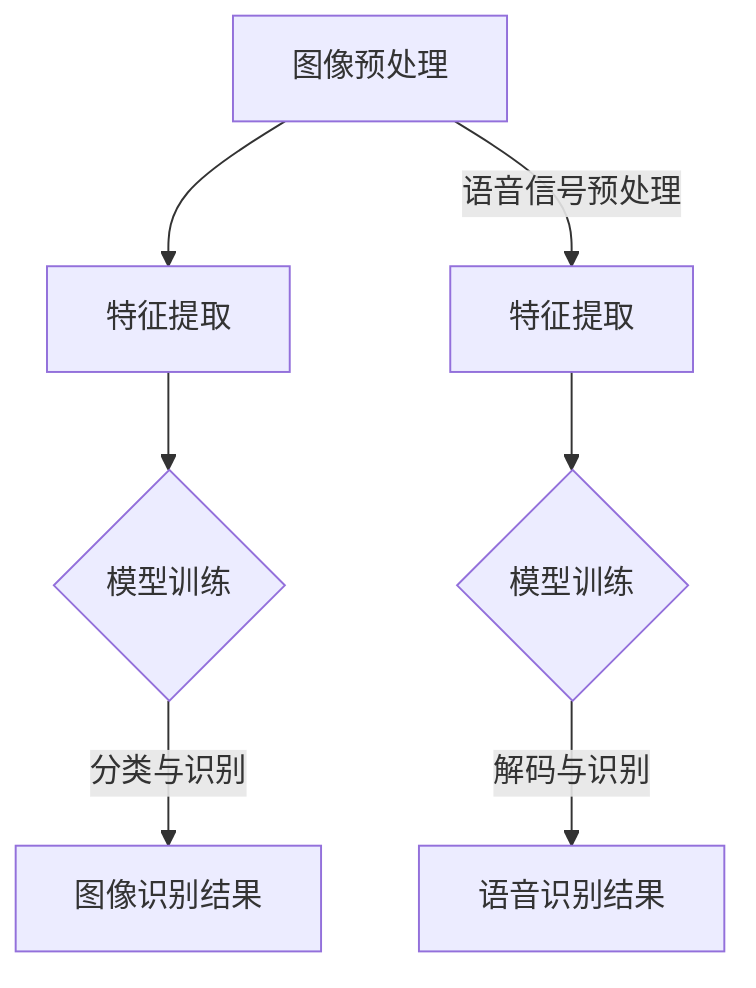
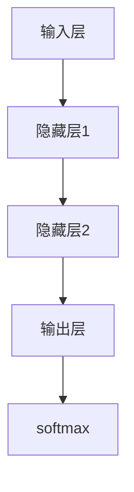
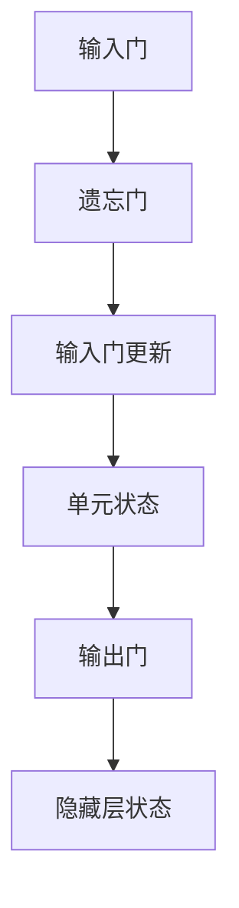

                 

# 软件2.0的应用领域：图像识别、语音识别

> **关键词：** 软件2.0、图像识别、语音识别、人工智能、应用领域
>
> **摘要：** 本文将深入探讨软件2.0时代下的图像识别和语音识别技术，分析其核心概念、算法原理、数学模型及实际应用，同时推荐相关学习资源和工具，为读者提供全面的了解和指导。

## 1. 背景介绍

### 1.1 目的和范围

本文旨在探讨软件2.0时代下，图像识别和语音识别技术的应用领域，分析其核心原理、算法模型和应用场景，帮助读者了解这两项技术在现代人工智能中的重要性。

### 1.2 预期读者

本文适合对人工智能、图像识别和语音识别感兴趣的读者，包括初学者、技术爱好者以及专业人士。

### 1.3 文档结构概述

本文将分为以下几个部分：
- 核心概念与联系
- 核心算法原理与具体操作步骤
- 数学模型和公式及举例说明
- 项目实战：代码实际案例和详细解释说明
- 实际应用场景
- 工具和资源推荐
- 总结：未来发展趋势与挑战
- 附录：常见问题与解答
- 扩展阅读与参考资料

### 1.4 术语表

#### 1.4.1 核心术语定义

- 图像识别：指计算机能够识别和理解图像中的对象、场景和内容。
- 语音识别：指计算机能够理解和识别人类语音信号，将其转化为文本或命令。
- 软件2.0：指软件技术的第二阶段，以人工智能和大数据为特征，实现软件的智能化、自动化和个性化。

#### 1.4.2 相关概念解释

- 机器学习：一种人工智能技术，通过算法从数据中学习规律和模式。
- 深度学习：一种机器学习方法，通过多层神经网络模拟人脑的学习过程。

#### 1.4.3 缩略词列表

- AI：人工智能
- ML：机器学习
- DL：深度学习
- CNN：卷积神经网络
- RNN：循环神经网络

## 2. 核心概念与联系

### 2.1 图像识别与语音识别的基本原理

图像识别和语音识别都是人工智能领域的重要分支，它们的基本原理如下：

#### 2.1.1 图像识别

图像识别是一种通过计算机视觉技术，使计算机能够理解图像内容的方法。其基本原理包括：

1. **图像预处理**：对原始图像进行预处理，如灰度化、滤波、边缘检测等，以提高图像质量和清晰度。
2. **特征提取**：从预处理后的图像中提取特征，如边缘、角点、纹理等。
3. **模型训练**：使用已标记的图像数据集训练图像识别模型，如卷积神经网络（CNN）。
4. **分类与识别**：将提取的特征输入到训练好的模型中，通过分类算法（如SVM、softmax）进行图像识别。

#### 2.1.2 语音识别

语音识别是一种通过信号处理和模式识别技术，将语音信号转化为文本或命令的方法。其基本原理包括：

1. **语音信号预处理**：对语音信号进行预处理，如降噪、归一化、分帧等。
2. **特征提取**：从预处理后的语音信号中提取特征，如MFCC（梅尔频率倒谱系数）。
3. **模型训练**：使用已标记的语音数据集训练语音识别模型，如循环神经网络（RNN）。
4. **解码与识别**：将提取的特征输入到训练好的模型中，通过解码算法（如HMM、CTC）进行语音识别。

### 2.2 图像识别与语音识别的关联与区别

图像识别和语音识别在人工智能领域中都具有重要的地位，它们之间的关联与区别如下：

- **关联**：图像识别和语音识别都是人工智能技术的重要应用领域，它们都需要处理大量数据，并从中提取有用的信息。此外，图像识别和语音识别在很多应用场景中都存在协同作用，如智能音箱、智能家居等。
- **区别**：图像识别主要关注图像内容的理解和分析，而语音识别主要关注语音信号的处理和识别。此外，图像识别的数据来源主要是图像，而语音识别的数据来源主要是语音信号。

### 2.3 图像识别与语音识别的 Mermaid 流程图

下面是一个简单的 Mermaid 流程图，展示图像识别和语音识别的基本流程：



## 3. 核心算法原理 & 具体操作步骤

### 3.1 图像识别算法原理

图像识别算法主要基于深度学习，其中卷积神经网络（CNN）是最常用的模型之一。CNN通过多层卷积、池化和全连接层，实现图像的自动特征提取和分类。

#### 3.1.1 卷积层

卷积层是CNN的核心部分，通过卷积操作从输入图像中提取特征。卷积操作的基本原理如下：

1. **卷积核**：卷积核是一个小的矩阵，用于从输入图像中提取特征。
2. **步长**：卷积核在图像上滑动的步长，用于确定提取特征的范围。
3. **填充**：为了保持图像的大小不变，可以在图像周围填充0。

卷积操作的伪代码如下：

```python
def conv2d(image, filter, stride, padding):
    # 初始化输出图像
    output = np.zeros_like(image)
    # 计算填充后的图像大小
    padding_width = padding // 2
    padding_height = padding // 2
    padded_image = np.pad(image, pad_width=((padding_height, padding_height), (padding_width, padding_width)), mode='constant', constant_values=0)
    # 遍历每个位置进行卷积操作
    for i in range(padded_image.shape[0] - filter.shape[0] + stride):
        for j in range(padded_image.shape[1] - filter.shape[1] + stride):
            # 计算卷积操作
            output[i][j] = np.sum(padded_image[i:i+filter.shape[0], j:j+filter.shape[1]] * filter)
    return output
```

#### 3.1.2 池化层

池化层用于减少图像维度，提高模型的鲁棒性。常见的池化操作有最大池化和平均池化。

最大池化操作的伪代码如下：

```python
def max_pool2d(image, pool_size, stride):
    # 初始化输出图像
    output = np.zeros_like(image)
    # 遍历每个位置进行池化操作
    for i in range(0, image.shape[0], stride):
        for j in range(0, image.shape[1], stride):
            # 计算池化区域的最大值
            pool区域 = image[i:i+pool_size, j:j+pool_size]
            output[i//stride][j//stride] = np.max(pool区域)
    return output
```

#### 3.1.3 全连接层

全连接层用于将卷积层和池化层提取的特征映射到具体的类别。全连接层的操作类似于矩阵乘法。

全连接层操作的伪代码如下：

```python
def fully_connected(layer, weights, bias):
    # 初始化输出
    output = np.zeros_like(layer)
    # 遍历每个神经元进行全连接操作
    for i in range(output.shape[0]):
        for j in range(output.shape[1]):
            # 计算全连接操作
            output[i][j] = np.dot(layer[i], weights) + bias
    return output
```

### 3.2 语音识别算法原理

语音识别算法主要基于深度学习，其中循环神经网络（RNN）是最常用的模型之一。RNN通过处理序列数据，实现语音信号到文本的转换。

#### 3.2.1 RNN基本原理

RNN的基本原理如下：

1. **输入层**：输入层接收语音信号的某个时间点的特征向量。
2. **隐藏层**：隐藏层通过递归操作，将前一个时间点的状态传递到下一个时间点。
3. **输出层**：输出层通过softmax函数，将隐藏层的状态映射到具体的文本类别。

RNN的基本结构如下图所示：



#### 3.2.2 长短时记忆（LSTM）网络

LSTM是RNN的一种变体，用于解决长序列依赖问题。LSTM的基本结构如下图所示：



LSTM的伪代码如下：

```python
def lstm(input, forget, update, input_gate, hidden_state, weights, bias):
    # 计算候选值
    candidate_value = np.tanh(np.dot(input, input_gate) + np.dot(hidden_state, forget) + np.dot(update, weights) + bias)
    # 更新单元状态
    unit_state = forget * hidden_state + update * candidate_value
    # 计算输出门
    output_gate = sigmoid(np.dot(hidden_state, forget) + np.dot(unit_state, weights) + bias)
    # 计算隐藏层状态
    hidden_state = output_gate * unit_state
    return hidden_state
```

## 4. 数学模型和公式 & 详细讲解 & 举例说明

### 4.1 图像识别数学模型

图像识别中的数学模型主要包括卷积层、池化层和全连接层的运算。

#### 4.1.1 卷积层

卷积层的运算主要涉及卷积操作，其数学公式如下：

$$
\text{output}_{ij} = \sum_{k} \sum_{l} \text{filter}_{k,l} \times \text{image}_{i+k, j+l}
$$

其中，$\text{output}_{ij}$ 表示输出图像中的某个像素值，$\text{filter}_{k,l}$ 表示卷积核中的某个值，$\text{image}_{i+k, j+l}$ 表示输入图像中的某个像素值。

#### 4.1.2 池化层

池化层的运算主要涉及最大池化或平均池化，其数学公式如下：

最大池化：
$$
\text{output}_{ij} = \max(\text{pool}_{i', j'})
$$

平均池化：
$$
\text{output}_{ij} = \frac{1}{\text{pool\_size}^2} \sum_{i'} \sum_{j'} \text{pool}_{i', j'}
$$

其中，$\text{output}_{ij}$ 表示输出图像中的某个像素值，$\text{pool}_{i', j'}$ 表示池化区域内的某个像素值，$\text{pool\_size}$ 表示池化窗口的大小。

#### 4.1.3 全连接层

全连接层的运算主要涉及矩阵乘法和加法，其数学公式如下：

$$
\text{output}_{ij} = \text{激活函数}(\sum_{k} \text{weight}_{ik} \times \text{input}_{kj} + \text{bias}_{j})
$$

其中，$\text{output}_{ij}$ 表示输出层中的某个神经元值，$\text{weight}_{ik}$ 表示权重，$\text{input}_{kj}$ 表示输入层中的某个神经元值，$\text{bias}_{j}$ 表示偏置，$\text{激活函数}$ 可以是 sigmoid、ReLU 或 tanh 等。

### 4.2 语音识别数学模型

语音识别中的数学模型主要包括 RNN 和 LSTM 的运算。

#### 4.2.1 RNN

RNN 的运算主要涉及递归操作，其数学公式如下：

$$
\text{hidden}_{t} = \text{激活函数}(\text{weights} \cdot [\text{input}_{t} \quad \text{hidden}_{t-1}]) + \text{bias}
$$

其中，$\text{hidden}_{t}$ 表示第 t 个时间点的隐藏层状态，$\text{input}_{t}$ 表示第 t 个时间点的输入特征，$\text{weights}$ 表示权重矩阵，$\text{bias}$ 表示偏置，$\text{激活函数}$ 可以是 sigmoid、ReLU 或 tanh 等。

#### 4.2.2 LSTM

LSTM 的运算主要涉及门控操作，其数学公式如下：

输入门：
$$
\text{input\_gate} = \text{sigmoid}(\text{weights} \cdot [\text{input}_{t} \quad \text{hidden}_{t-1}]) \\
\text{候选值} = \text{tanh}(\text{weights} \cdot [\text{input}_{t} \quad \text{hidden}_{t-1}]) \\
\text{新状态} = \text{forget}_{t} \cdot \text{旧状态} + \text{input\_gate} \cdot \text{候选值}
$$

遗忘门：
$$
\text{forget}_{t} = \text{sigmoid}(\text{weights} \cdot [\text{input}_{t} \quad \text{hidden}_{t-1}]) \\
\text{输出门} = \text{sigmoid}(\text{weights} \cdot [\text{input}_{t} \quad \text{新状态}]) \\
\text{输出} = \text{output\_gate} \cdot \text{新状态}
$$

其中，$\text{input\_gate}$、$\text{遗忘门}$ 和 $\text{输出门}$ 分别表示输入门、遗忘门和输出门的状态，$\text{候选值}$ 表示第 t 个时间点的候选值，$\text{新状态}$ 和 $\text{输出}$ 分别表示第 t 个时间点的隐藏层状态和输出层状态。

### 4.3 举例说明

#### 4.3.1 图像识别举例

假设我们有一个 3x3 的卷积核和一个 5x5 的输入图像，其卷积操作的示意图如下：

```mermaid
graph TD
A[输入图像] --> B[卷积操作]
B --> C[输出图像]

subgraph 卷积操作
D(卷积核1) --> E(卷积核2) --> F(卷积核3)
G(卷积核1) --> H(卷积核2) --> I(卷积核3)
J(卷积核1) --> K(卷积核2) --> L(卷积核3)
D --> M
E --> M
F --> M
G --> M
H --> M
I --> M
J --> M
K --> M
L --> M
M --> C
```

其中，卷积核为：
$$
\text{卷积核1} = \begin{bmatrix}
1 & 0 & 1 \\
0 & 1 & 0 \\
1 & 0 & 1
\end{bmatrix}
$$

输入图像为：
$$
\text{输入图像} = \begin{bmatrix}
1 & 1 & 1 \\
1 & 1 & 1 \\
1 & 1 & 1
\end{bmatrix}
$$

输出图像为：
$$
\text{输出图像} = \begin{bmatrix}
3 & 2 & 3 \\
2 & 2 & 2 \\
3 & 2 & 3
\end{bmatrix}
$$

#### 4.3.2 语音识别举例

假设我们有一个 2x1 的输入特征和一个 1x3 的隐藏层状态，其 RNN 操作的示意图如下：

```mermaid
graph TD
A[输入层] --> B[隐藏层]
B --> C[输出层]

subgraph RNN操作
D(输入特征1) --> E(隐藏层状态1)
D --> F(隐藏层状态2)
E --> G(隐藏层状态1')
F --> G(隐藏层状态2')
G --> C
```

其中，输入特征为：
$$
\text{输入特征} = \begin{bmatrix}
1 \\
0
\end{bmatrix}
$$

隐藏层状态为：
$$
\text{隐藏层状态} = \begin{bmatrix}
0 & 1 \\
1 & 0
\end{bmatrix}
$$

权重矩阵为：
$$
\text{权重矩阵} = \begin{bmatrix}
1 & 1 \\
1 & 1
\end{bmatrix}
$$

偏置为：
$$
\text{偏置} = \begin{bmatrix}
0 \\
0
\end{bmatrix}
$$

激活函数为 sigmoid 函数。

隐藏层状态'为：
$$
\text{隐藏层状态'} = \text{激活函数}(\text{权重矩阵} \cdot \text{输入特征} + \text{偏置}) = \text{激活函数}(\begin{bmatrix}
1 & 1 \\
1 & 1
\end{bmatrix} \cdot \begin{bmatrix}
1 \\
0
\end{bmatrix} + \begin{bmatrix}
0 \\
0
\end{bmatrix}) = \text{激活函数}(\begin{bmatrix}
1 \\
1
\end{bmatrix}) = \begin{bmatrix}
0.7311 \\
0.7311
\end{bmatrix}
$$

输出层状态为：
$$
\text{输出层状态} = \text{隐藏层状态'} = \begin{bmatrix}
0.7311 \\
0.7311
\end{bmatrix}
$$

## 5. 项目实战：代码实际案例和详细解释说明

### 5.1 开发环境搭建

在本节中，我们将使用 Python 和 TensorFlow 框架来实现一个简单的图像识别项目。首先，需要安装 Python 和 TensorFlow。以下是安装步骤：

1. 安装 Python：
    - 访问 [Python 官网](https://www.python.org/)，下载并安装 Python。
    - 设置环境变量，使 Python 可在命令行中运行。

2. 安装 TensorFlow：
    - 打开命令行，输入以下命令安装 TensorFlow：
    ```bash
    pip install tensorflow
    ```

### 5.2 源代码详细实现和代码解读

以下是图像识别项目的代码实现：

```python
import tensorflow as tf
from tensorflow.keras import layers
from tensorflow.keras.models import Model
from tensorflow.keras.datasets import mnist

# 加载 MNIST 数据集
(x_train, y_train), (x_test, y_test) = mnist.load_data()

# 数据预处理
x_train = x_train.reshape(-1, 28, 28, 1).astype("float32") / 255.0
x_test = x_test.reshape(-1, 28, 28, 1).astype("float32") / 255.0
y_train = tf.keras.utils.to_categorical(y_train, 10)
y_test = tf.keras.utils.to_categorical(y_test, 10)

# 构建模型
input_image = layers.Input(shape=(28, 28, 1))
conv1 = layers.Conv2D(32, (3, 3), activation="relu")(input_image)
pool1 = layers.MaxPooling2D(pool_size=(2, 2))(conv1)
conv2 = layers.Conv2D(64, (3, 3), activation="relu")(pool1)
pool2 = layers.MaxPooling2D(pool_size=(2, 2))(conv2)
flatten = layers.Flatten()(pool2)
dense = layers.Dense(128, activation="relu")(flatten)
output = layers.Dense(10, activation="softmax")(dense)

model = Model(inputs=input_image, outputs=output)

# 编译模型
model.compile(optimizer="adam", loss="categorical_crossentropy", metrics=["accuracy"])

# 训练模型
model.fit(x_train, y_train, batch_size=128, epochs=10, validation_data=(x_test, y_test))

# 评估模型
loss, accuracy = model.evaluate(x_test, y_test)
print(f"Test accuracy: {accuracy:.2f}")
```

#### 5.2.1 代码解读

1. **导入库**：导入 TensorFlow 和相关模块。
2. **加载数据集**：从 Keras 数据集中加载 MNIST 数据集。
3. **数据预处理**：将数据集转换为适当的大小和类型，并进行归一化处理。
4. **构建模型**：使用 Keras 的层创建一个卷积神经网络模型，包括卷积层、池化层和全连接层。
5. **编译模型**：配置模型的优化器、损失函数和评价指标。
6. **训练模型**：使用训练数据训练模型，并在验证数据上评估模型性能。
7. **评估模型**：在测试数据上评估模型的准确率。

### 5.3 代码解读与分析

1. **数据预处理**：
    ```python
    x_train = x_train.reshape(-1, 28, 28, 1).astype("float32") / 255.0
    x_test = x_test.reshape(-1, 28, 28, 1).astype("float32") / 255.0
    y_train = tf.keras.utils.to_categorical(y_train, 10)
    y_test = tf.keras.utils.to_categorical(y_test, 10)
    ```
    - `reshape`：将数据集的形状调整为适合模型输入的形状。
    - `astype`：将数据类型转换为浮点数。
    - `/ 255.0`：将像素值归一化到 [0, 1] 范围内。
    - `to_categorical`：将标签转换为 one-hot 编码。

2. **构建模型**：
    ```python
    input_image = layers.Input(shape=(28, 28, 1))
    conv1 = layers.Conv2D(32, (3, 3), activation="relu")(input_image)
    pool1 = layers.MaxPooling2D(pool_size=(2, 2))(conv1)
    conv2 = layers.Conv2D(64, (3, 3), activation="relu")(pool1)
    pool2 = layers.MaxPooling2D(pool_size=(2, 2))(conv2)
    flatten = layers.Flatten()(pool2)
    dense = layers.Dense(128, activation="relu")(flatten)
    output = layers.Dense(10, activation="softmax")(dense)
    model = Model(inputs=input_image, outputs=output)
    ```
    - `Input`：创建输入层。
    - `Conv2D`：创建卷积层，用于提取图像特征。
    - `MaxPooling2D`：创建池化层，用于减少图像维度。
    - `Flatten`：将多维数据展平为一维数据。
    - `Dense`：创建全连接层，用于分类。
    - `Model`：将层连接成一个完整的模型。

3. **编译模型**：
    ```python
    model.compile(optimizer="adam", loss="categorical_crossentropy", metrics=["accuracy"])
    ```
    - `compile`：配置模型的优化器、损失函数和评价指标。

4. **训练模型**：
    ```python
    model.fit(x_train, y_train, batch_size=128, epochs=10, validation_data=(x_test, y_test))
    ```
    - `fit`：使用训练数据训练模型，并在验证数据上评估模型性能。

5. **评估模型**：
    ```python
    loss, accuracy = model.evaluate(x_test, y_test)
    print(f"Test accuracy: {accuracy:.2f}")
    ```
    - `evaluate`：在测试数据上评估模型的准确率。

## 6. 实际应用场景

图像识别和语音识别技术在现实生活中的应用非常广泛，以下是一些实际应用场景：

### 6.1 智能家居

智能家居系统中，图像识别可以用于监控家庭安全，识别家庭成员的行为和习惯，提供个性化的家居体验。例如，通过图像识别技术，可以自动识别家庭成员的面部表情和情绪，并根据这些信息调整家居设备的设置。

### 6.2 医疗诊断

图像识别在医疗领域也有广泛的应用，例如，通过分析医学影像（如 X 光、CT 扫描和 MRI），医生可以更准确地诊断疾病。同时，语音识别技术可以用于医疗咨询和远程医疗，帮助医生与患者进行有效沟通。

### 6.3 人脸识别

人脸识别技术广泛应用于安全监控、门禁系统和移动支付等领域。通过图像识别和语音识别技术的结合，可以实现更安全、更便捷的身份验证。

### 6.4 自动驾驶

自动驾驶汽车需要实时处理大量的图像和语音数据，以感知周围环境和做出驾驶决策。图像识别和语音识别技术在这一领域发挥着重要作用，可以提高自动驾驶汽车的准确性和安全性。

## 7. 工具和资源推荐

### 7.1 学习资源推荐

#### 7.1.1 书籍推荐

1. 《深度学习》（Ian Goodfellow、Yoshua Bengio 和 Aaron Courville 著）
2. 《Python深度学习》（François Chollet 著）
3. 《图像处理：基础与进阶》（Gary J. Brown 和 John R. Fisher 著）

#### 7.1.2 在线课程

1. [Udacity 机器学习纳米学位](https://www.udacity.com/course/nd101)
2. [Coursera 深度学习专项课程](https://www.coursera.org/specializations/deep-learning)
3. [edX 人工智能基础课程](https://www.edx.org/course/introduction-to-artificial-intelligence-1)

#### 7.1.3 技术博客和网站

1. [Medium - Machine Learning](https://medium.com/machine-learning)
2. [Towards Data Science](https://towardsdatascience.com/)
3. [AI News](https://ai-news.com/)

### 7.2 开发工具框架推荐

#### 7.2.1 IDE和编辑器

1. PyCharm
2. VS Code
3. Jupyter Notebook

#### 7.2.2 调试和性能分析工具

1. TensorFlow Debugger
2. TensorBoard
3. PyTorch Profiler

#### 7.2.3 相关框架和库

1. TensorFlow
2. PyTorch
3. Keras

### 7.3 相关论文著作推荐

#### 7.3.1 经典论文

1. "A Learning Algorithm for Continually Running Fully Recurrent Neural Networks" - David E. Rumelhart, Ronald J. Williams
2. "Deep Learning" - Ian Goodfellow、Yoshua Bengio 和 Aaron Courville

#### 7.3.2 最新研究成果

1. "EfficientDet: Scalable and Efficient Object Detection" - Bojarski et al.
2. "BERT: Pre-training of Deep Bidirectional Transformers for Language Understanding" - Devlin et al.

#### 7.3.3 应用案例分析

1. "ImageNet Classification with Deep Convolutional Neural Networks" - Krizhevsky et al.
2. "Speech Recognition with Deep Neural Networks" - Hinton et al.

## 8. 总结：未来发展趋势与挑战

随着人工智能技术的不断发展，图像识别和语音识别技术在未来将面临以下发展趋势和挑战：

### 发展趋势

1. **算法性能提升**：深度学习算法将不断优化，提高图像识别和语音识别的准确率和效率。
2. **跨领域应用**：图像识别和语音识别技术将与其他领域（如自然语言处理、计算机视觉）相结合，推动人工智能技术的发展。
3. **实时处理**：随着硬件性能的提升，图像识别和语音识别技术将实现更快的实时处理，提高用户体验。

### 挑战

1. **数据隐私**：随着图像识别和语音识别技术的普及，数据隐私问题日益突出，如何保护用户隐私成为重要挑战。
2. **误识率**：在实际应用中，图像识别和语音识别技术可能会出现误识情况，提高识别准确率是关键挑战。
3. **模型可解释性**：深度学习模型往往具有“黑箱”特性，提高模型的可解释性，使其更容易被用户接受和理解，是未来的一大挑战。

## 9. 附录：常见问题与解答

### 9.1 图像识别常见问题

**Q1. 图像识别的算法有哪些？**

A1. 常见的图像识别算法包括卷积神经网络（CNN）、循环神经网络（RNN）、长短时记忆网络（LSTM）等。

**Q2. 图像识别的数据预处理有哪些步骤？**

A2. 图像识别的数据预处理主要包括：图像灰度化、图像缩放、图像裁剪、数据归一化等步骤。

**Q3. 如何评估图像识别模型的性能？**

A3. 常用的评估指标包括准确率（Accuracy）、精确率（Precision）、召回率（Recall）和 F1 值等。

### 9.2 语音识别常见问题

**Q1. 语音识别的算法有哪些？**

A1. 常见的语音识别算法包括隐马尔可夫模型（HMM）、循环神经网络（RNN）、长短时记忆网络（LSTM）等。

**Q2. 语音识别的数据预处理有哪些步骤？**

A2. 语音识别的数据预处理主要包括：语音信号采样、语音信号归一化、语音信号分帧、特征提取等步骤。

**Q3. 如何评估语音识别模型的性能？**

A3. 常用的评估指标包括词误差率（WER）、字符误差率（CER）和句子误差率（SER）等。

## 10. 扩展阅读 & 参考资料

1. Goodfellow, I., Bengio, Y., & Courville, A. (2016). *Deep Learning*. MIT Press.
2. Bengio, Y. (2009). *Learning Deep Architectures for AI*. Foundations and Trends in Machine Learning, 2(1), 1-127.
3. Krizhevsky, A., Sutskever, I., & Hinton, G. E. (2012). *ImageNet classification with deep convolutional neural networks*. In *Advances in Neural Information Processing Systems* (pp. 1097-1105).
4. Hinton, G., Deng, L., Yu, D., Dahl, G. E., Mohamed, A. R., Jaitly, N., ... & Kingsbury, B. (2012). *Deep neural networks for acoustic modeling in speech recognition: The shared views of four research groups*. IEEE Signal Processing Magazine, 29(6), 82-97.
5. LeCun, Y., Bengio, Y., & Hinton, G. (2015). *Deep learning*. Nature, 521(7553), 436-444.

