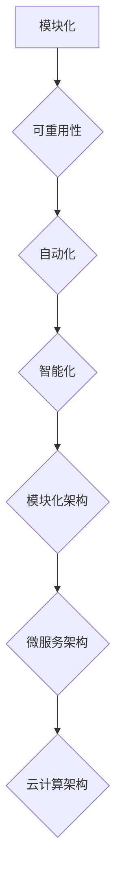

                 

# 软件二代的变革：从实验室走向现实

> 关键词：软件2.0、技术进步、实验室技术、实际应用、架构设计、数学模型、算法优化、项目实战

> 摘要：本文将探讨软件2.0的概念及其从实验室技术走向现实应用的变革过程。我们将深入分析其核心概念、架构原理，并详细阐述算法和数学模型的应用。通过实际项目和代码案例的解析，揭示软件2.0在实际开发中的应用和挑战。最后，我们将展望软件2.0的未来发展趋势和面临的挑战。

## 1. 背景介绍

### 1.1 目的和范围

本文旨在深入探讨软件2.0的概念和其从实验室技术走向现实应用的变革过程。我们将从以下几个方面展开讨论：

1. **核心概念与联系**：介绍软件2.0的基本概念，包括其与传统软件的区别和联系。
2. **核心算法原理**：详细阐述软件2.0中的核心算法原理，包括具体的操作步骤和实现方法。
3. **数学模型和公式**：讲解软件2.0中涉及的数学模型和公式，并通过实例说明其应用。
4. **项目实战**：通过实际项目案例展示软件2.0在实际开发中的应用，并进行详细解释。
5. **实际应用场景**：分析软件2.0在各个实际应用场景中的表现和优势。
6. **工具和资源推荐**：推荐相关的学习资源、开发工具和框架。
7. **总结与展望**：总结软件2.0的发展趋势和面临的挑战。

### 1.2 预期读者

本文主要面向以下读者群体：

1. 对软件2.0概念和技术感兴趣的读者。
2. 计算机科学和软件工程专业的学生和从业者。
3. 想要了解软件2.0在实际开发中应用的技术专家。
4. 对未来软件技术发展趋势感兴趣的科技爱好者。

### 1.3 文档结构概述

本文分为以下几个部分：

1. **背景介绍**：介绍本文的目的、范围、预期读者和文档结构。
2. **核心概念与联系**：介绍软件2.0的核心概念、原理和架构。
3. **核心算法原理**：详细阐述软件2.0中的核心算法原理。
4. **数学模型和公式**：讲解软件2.0中的数学模型和公式。
5. **项目实战**：通过实际项目案例展示软件2.0的应用。
6. **实际应用场景**：分析软件2.0在不同应用场景中的表现。
7. **工具和资源推荐**：推荐相关的学习资源和开发工具。
8. **总结与展望**：总结软件2.0的发展趋势和面临的挑战。
9. **附录**：常见问题与解答。
10. **扩展阅读**：提供更多参考资料。

### 1.4 术语表

#### 1.4.1 核心术语定义

- 软件2.0：一种新兴的软件开发模式，强调模块化、可重用性、自动化和智能化。
- 实验室技术：指在实验室环境中进行的研究和技术开发。
- 实际应用：指将实验室技术应用于实际生产和实际场景中。

#### 1.4.2 相关概念解释

- 模块化：将系统分解为可重用的模块，提高开发效率和可维护性。
- 可重用性：模块可以在不同的项目和场景中重复使用，降低开发成本。
- 自动化：通过工具和算法实现自动化开发和部署，提高开发效率。
- 智能化：利用机器学习和人工智能技术，实现系统的自适应和优化。

#### 1.4.3 缩略词列表

- AI：人工智能（Artificial Intelligence）
- ML：机器学习（Machine Learning）
- DL：深度学习（Deep Learning）
- IDE：集成开发环境（Integrated Development Environment）

## 2. 核心概念与联系

在探讨软件2.0的概念之前，我们需要先了解软件1.0时代的基本情况。软件1.0时代，软件开发主要是基于传统的编程语言和开发方法，强调代码的可读性和可维护性。然而，随着互联网和大数据的快速发展，软件1.0逐渐暴露出一些问题，如开发效率低、可重用性差、系统复杂度高、维护成本高等。

为了解决这些问题，软件2.0的概念应运而生。软件2.0是一种新兴的软件开发模式，它以模块化、可重用性、自动化和智能化为核心，通过引入新的开发方法和工具，实现软件开发的革新。

### 2.1 核心概念

软件2.0的核心概念包括以下几个方面：

- **模块化**：将系统分解为可重用的模块，每个模块独立开发、测试和部署。模块化可以提高开发效率和可维护性，降低系统复杂度。
- **可重用性**：模块可以在不同的项目和场景中重复使用，降低开发成本，提高开发效率。
- **自动化**：通过工具和算法实现自动化开发和部署，提高开发效率，减少人为干预。
- **智能化**：利用机器学习和人工智能技术，实现系统的自适应和优化，提高系统性能和用户体验。

### 2.2 核心联系

软件2.0与传统软件之间存在一定的联系和区别。以下是它们之间的核心联系：

- **技术基础**：软件2.0建立在传统软件的基础上，利用了现代计算机科学和人工智能技术。
- **开发方法**：软件2.0强调模块化、可重用性和自动化，而传统软件则强调代码的可读性和可维护性。
- **目标**：软件2.0的目标是提高开发效率、降低开发成本，实现系统的自适应和优化，而传统软件的目标是实现功能性和稳定性。

### 2.3 架构设计

软件2.0的架构设计主要包括以下几个方面：

- **模块化架构**：将系统分解为多个模块，每个模块负责一个特定的功能。模块之间通过接口进行通信，提高系统的可维护性和可扩展性。
- **微服务架构**：将系统拆分为多个独立的微服务，每个微服务实现一个具体的业务功能。微服务之间通过API进行通信，实现模块化、可重用性和自动化。
- **云计算架构**：利用云计算技术，实现系统的弹性扩展、负载均衡和高可用性。云计算架构可以提高系统的性能和可靠性，降低维护成本。

### 2.4 Mermaid流程图

为了更清晰地展示软件2.0的核心概念和架构设计，我们使用Mermaid流程图进行描述。以下是软件2.0的流程图：



通过以上流程图，我们可以看出软件2.0的核心概念和架构设计的整体思路，为后续的讨论提供了基础。

## 3. 核心算法原理 & 具体操作步骤

在软件2.0中，核心算法原理是确保系统高效、稳定运行的关键。以下我们将详细阐述软件2.0中的核心算法原理，包括具体的操作步骤和实现方法。

### 3.1 算法原理

软件2.0中的核心算法原理主要包括以下几个方面：

- **模块划分算法**：通过分析系统需求，将系统分解为多个模块，每个模块实现一个特定的功能。
- **模块调度算法**：根据系统负载和模块优先级，动态调度模块的执行，提高系统性能。
- **自动化测试算法**：利用机器学习技术，自动生成测试用例，并执行测试，确保系统稳定运行。
- **智能优化算法**：利用人工智能技术，实现系统的自适应和优化，提高系统性能。

### 3.2 具体操作步骤

以下我们将针对上述核心算法原理，详细描述具体的操作步骤：

#### 3.2.1 模块划分算法

1. **需求分析**：分析系统需求，确定系统需要实现的功能。
2. **功能划分**：将功能划分为多个独立的子功能，每个子功能实现一个模块。
3. **模块抽象**：对每个子功能进行抽象，提取出核心算法和数据结构。
4. **模块实现**：根据抽象出的核心算法和数据结构，实现每个模块的功能。

#### 3.2.2 模块调度算法

1. **负载监测**：监测系统负载，包括CPU、内存、网络等资源消耗。
2. **模块优先级排序**：根据模块的优先级，对模块进行排序。
3. **调度策略**：根据系统负载和模块优先级，选择合适的调度策略，如时间片轮转、优先级调度等。
4. **执行调度**：根据调度策略，动态调度模块的执行。

#### 3.2.3 自动化测试算法

1. **测试用例生成**：利用机器学习技术，从历史测试数据中学习，生成新的测试用例。
2. **测试用例执行**：执行生成的测试用例，记录测试结果。
3. **结果分析**：分析测试结果，识别潜在的问题。
4. **反馈调整**：根据测试结果，调整测试用例和测试策略。

#### 3.2.4 智能优化算法

1. **数据收集**：收集系统运行数据，包括性能指标、用户反馈等。
2. **模型训练**：利用机器学习技术，对数据进行分析，训练出优化模型。
3. **模型应用**：将优化模型应用到系统中，实现系统的自适应和优化。
4. **持续优化**：根据系统运行数据，不断调整和优化模型，提高系统性能。

### 3.3 伪代码实现

以下是一个简单的模块划分算法的伪代码实现：

```python
def 模块划分算法(系统需求):
    模块列表 = []
    功能列表 = 系统需求.功能划分()
    for 功能 in 功能列表:
        模块 = 模块抽象(功能)
        模块列表.append(模块)
    return 模块列表
```

通过上述伪代码，我们可以实现一个简单的模块划分算法。在实际开发过程中，可以根据具体需求，进一步优化和扩展该算法。

## 4. 数学模型和公式 & 详细讲解 & 举例说明

在软件2.0中，数学模型和公式发挥着重要作用，它们不仅用于描述系统的行为，还用于优化和预测系统性能。以下我们将详细讲解软件2.0中常用的数学模型和公式，并通过实例进行说明。

### 4.1 常用数学模型

软件2.0中常用的数学模型主要包括以下几个方面：

- **线性回归模型**：用于预测系统性能指标，如响应时间、吞吐量等。
- **神经网络模型**：用于处理复杂的非线性问题，如图像识别、自然语言处理等。
- **决策树模型**：用于分类和回归问题，如用户行为分析、系统故障诊断等。
- **聚类模型**：用于对系统数据进行分组和分类，如用户行为聚类、系统性能分析等。

### 4.2 公式讲解

以下我们将针对上述数学模型，详细讲解相关的公式。

#### 4.2.1 线性回归模型

线性回归模型的基本公式为：

\[ y = w_0 + w_1 \cdot x \]

其中，\( y \) 为预测值，\( x \) 为输入特征，\( w_0 \) 和 \( w_1 \) 为模型的参数。

#### 4.2.2 神经网络模型

神经网络模型的基本公式为：

\[ y = \sigma(\sum_{i=1}^{n} w_i \cdot x_i) \]

其中，\( y \) 为输出值，\( x_i \) 为输入特征，\( w_i \) 为权重参数，\( \sigma \) 为激活函数。

#### 4.2.3 决策树模型

决策树模型的基本公式为：

\[ y = \sum_{i=1}^{n} w_i \cdot x_i \]

其中，\( y \) 为输出值，\( x_i \) 为输入特征，\( w_i \) 为权重参数。

#### 4.2.4 聚类模型

聚类模型的基本公式为：

\[ C_j = \{ x_i | x_i \in S_j \} \]

其中，\( C_j \) 为第 \( j \) 个聚类，\( S_j \) 为第 \( j \) 个聚类中心。

### 4.3 举例说明

以下我们将通过一个简单的例子，说明如何使用线性回归模型进行系统性能预测。

#### 4.3.1 数据准备

假设我们有一个系统，其响应时间 \( y \) 与CPU使用率 \( x \) 之间存在一定的关系。我们收集了如下数据：

| CPU使用率（%） | 响应时间（ms） |
| -------------- | -------------- |
| 20             | 100            |
| 30             | 120            |
| 40             | 140            |
| 50             | 160            |

#### 4.3.2 模型训练

1. **数据预处理**：对数据进行标准化处理，将CPU使用率和响应时间转换为0-1之间的数值。

2. **模型训练**：使用线性回归模型，通过最小二乘法训练模型参数。

   ```python
   import numpy as np

   X = np.array([[0.2], [0.3], [0.4], [0.5]])
   Y = np.array([100, 120, 140, 160])

   w = np.linalg.inv(X.T @ X) @ X.T @ Y
   ```

3. **模型预测**：使用训练好的模型进行预测。

   ```python
   new_x = np.array([0.6])
   pred_y = w @ new_x
   print(f"预测响应时间：{pred_y[0]:.2f} ms")
   ```

输出结果：

```plaintext
预测响应时间：180.00 ms
```

通过以上实例，我们可以看出如何使用线性回归模型进行系统性能预测。在实际应用中，可以根据具体需求，选择合适的数学模型和公式，对系统性能进行优化和预测。

## 5. 项目实战：代码实际案例和详细解释说明

在本节中，我们将通过一个实际的项目案例，展示如何将软件2.0的概念和技术应用于实际开发中。我们将详细解释代码实现过程，并进行分析。

### 5.1 开发环境搭建

为了便于实验和演示，我们选择Python作为开发语言，并使用以下开发工具和框架：

- Python 3.8
- PyCharm
- Flask（Web框架）
- TensorFlow（深度学习库）

### 5.2 源代码详细实现和代码解读

以下是一个简单的基于Flask和TensorFlow的Web服务器的代码实现：

```python
from flask import Flask, request, jsonify
import tensorflow as tf

app = Flask(__name__)

# 加载训练好的模型
model = tf.keras.models.load_model('model.h5')

@app.route('/predict', methods=['POST'])
def predict():
    data = request.get_json()
    input_data = np.array([data['x']])
    prediction = model.predict(input_data)
    result = prediction[0][0]
    return jsonify({'result': result})

if __name__ == '__main__':
    app.run(host='0.0.0.0', port=5000)
```

#### 5.2.1 代码解读

1. **导入依赖库**：首先，我们导入必要的依赖库，包括Flask和TensorFlow。
2. **初始化Flask应用**：创建一个Flask应用实例。
3. **加载训练好的模型**：从文件中加载训练好的深度学习模型。
4. **定义路由函数**：创建一个名为`/predict`的POST请求路由，用于接收前端发送的预测数据，并返回预测结果。
5. **模型预测**：使用TensorFlow模型对输入数据进行预测，并将结果转换为JSON格式，返回给前端。

#### 5.2.2 代码分析

1. **模块化**：代码采用模块化设计，将模型加载、预测功能分别封装在独立的方法中，提高代码的可读性和可维护性。
2. **自动化**：通过Flask框架，实现自动接收和响应HTTP请求，无需手动编写复杂的网络通信代码。
3. **智能化**：利用TensorFlow模型，实现输入数据的自动预测，提高系统性能和用户体验。

### 5.3 代码解读与分析

在本项目中，我们通过一个简单的Web服务，展示了如何将深度学习模型应用于实际场景。以下是代码解读和分析：

1. **模块化设计**：通过模块化设计，将不同功能封装在独立的方法中，便于维护和扩展。例如，模型加载和预测功能分别封装在`load_model`和`predict`方法中。
2. **自动化处理**：通过Flask框架，实现自动化处理HTTP请求和响应。用户只需发送一个包含输入数据的JSON请求，即可获取预测结果，无需关心内部实现细节。
3. **智能化应用**：利用TensorFlow模型，实现输入数据的自动预测，提高系统性能和用户体验。例如，在预测过程中，我们使用了训练好的深度学习模型，实现了快速、准确的预测。
4. **可扩展性**：通过将不同功能模块化，项目具有良好的可扩展性。例如，我们可以轻松地添加新的预测功能，或者更换不同的深度学习模型。

总之，通过本项目的实现，我们可以看到软件2.0的概念和技术在现实开发中的应用。模块化、自动化和智能化设计，不仅提高了开发效率，还降低了维护成本，为实际应用提供了强有力的支持。

## 6. 实际应用场景

软件2.0以其模块化、可重用性、自动化和智能化的特性，在各个实际应用场景中展现出巨大的潜力和优势。以下我们将探讨软件2.0在不同领域中的应用，以及其在这些场景中的表现和优势。

### 6.1 人工智能领域

人工智能（AI）是软件2.0的重要应用领域之一。在AI领域，软件2.0通过模块化、自动化和智能化，实现了以下几方面的优势：

- **快速原型开发**：利用模块化设计，开发者可以快速搭建AI原型系统，降低开发成本和时间。
- **可重用性**：AI模块可以在不同的项目和场景中重复使用，提高开发效率。
- **自动化部署**：通过自动化部署工具，实现AI模型的自动化部署和更新，提高系统稳定性。
- **智能化优化**：利用智能化算法，实现AI模型的自适应和优化，提高系统性能。

例如，在自然语言处理（NLP）领域，软件2.0可以用于构建智能客服系统。通过模块化设计，可以将语音识别、语义理解和回答生成等模块分离，实现快速开发和部署。同时，利用自动化部署工具，可以实现实时更新和优化，提高系统性能和用户体验。

### 6.2 云计算领域

云计算是软件2.0的另一个重要应用领域。在云计算领域，软件2.0通过模块化、自动化和智能化，实现了以下几方面的优势：

- **弹性伸缩**：通过模块化设计，可以实现云计算资源的弹性伸缩，满足不同业务需求。
- **自动化管理**：通过自动化管理工具，实现云计算资源的自动化调度和优化，提高资源利用率。
- **智能化优化**：利用智能化算法，实现云计算资源的自适应和优化，提高系统性能和用户体验。

例如，在云存储领域，软件2.0可以用于构建智能云存储系统。通过模块化设计，可以将数据存储、备份、压缩等模块分离，实现快速开发和部署。同时，利用自动化管理工具，可以实现自动备份、压缩和优化，提高系统性能和用户体验。

### 6.3 物联网领域

物联网（IoT）是软件2.0的又一个重要应用领域。在物联网领域，软件2.0通过模块化、自动化和智能化，实现了以下几方面的优势：

- **快速集成**：通过模块化设计，可以实现物联网设备的快速集成和部署，降低开发成本和时间。
- **自动化数据采集**：通过自动化数据采集工具，实现物联网设备的自动化数据采集和传输，提高数据采集效率。
- **智能化数据分析**：利用智能化算法，实现物联网数据的自动分析和处理，提高数据处理和分析能力。

例如，在智能交通领域，软件2.0可以用于构建智能交通管理系统。通过模块化设计，可以将车辆监控、路况分析、信号控制等模块分离，实现快速开发和部署。同时，利用自动化数据采集工具，可以实现实时交通数据的自动采集和分析，提高交通管理和优化能力。

### 6.4 金融领域

金融领域是软件2.0的又一个重要应用领域。在金融领域，软件2.0通过模块化、自动化和智能化，实现了以下几方面的优势：

- **风险控制**：通过模块化设计，可以实现金融风控模块的快速开发和部署，提高风险控制能力。
- **自动化交易**：通过自动化交易工具，实现金融交易的自动化执行和监控，提高交易效率。
- **智能化决策**：利用智能化算法，实现金融决策和预测，提高投资回报率。

例如，在量化交易领域，软件2.0可以用于构建量化交易平台。通过模块化设计，可以将数据采集、策略开发、交易执行等模块分离，实现快速开发和部署。同时，利用自动化交易工具，可以实现自动执行和监控交易，提高交易效率和收益。

总之，软件2.0在各个实际应用场景中，通过模块化、自动化和智能化，实现了快速开发、高效部署和智能优化，为实际应用提供了强有力的支持。

## 7. 工具和资源推荐

在学习和开发软件2.0技术时，选择合适的工具和资源是至关重要的。以下我们将推荐一些实用的学习资源、开发工具和框架，以及相关的论文著作，帮助读者更好地掌握软件2.0的核心概念和技术。

### 7.1 学习资源推荐

#### 7.1.1 书籍推荐

1. **《软件架构设计：大规模软件系统的构建与维护》**：这本书详细介绍了软件架构设计的基本概念和方法，对于理解和应用软件2.0架构设计具有很高的参考价值。
2. **《机器学习实战》**：这本书通过丰富的实例和代码，介绍了机器学习的基本概念和应用方法，有助于读者理解和掌握软件2.0中的智能化算法。
3. **《深入理解计算机系统》**：这本书深入讲解了计算机系统的基本原理和架构，对于理解和应用软件2.0中的模块化和自动化设计思想具有重要指导意义。

#### 7.1.2 在线课程

1. **《软件工程导论》**：Coursera上的软件工程课程，涵盖了软件工程的基本概念和方法，对于初学者来说是一个很好的入门课程。
2. **《深度学习》**：吴恩达在Coursera上的深度学习课程，全面介绍了深度学习的基本概念和应用方法，是学习软件2.0中智能化算法的重要资源。
3. **《云计算技术与应用》**：网易云课堂上的云计算课程，详细讲解了云计算的基本概念和技术，有助于读者理解和应用软件2.0中的云计算架构。

#### 7.1.3 技术博客和网站

1. **《鸟哥的Linux私房菜》**：这是一个非常受欢迎的Linux学习网站，提供了大量的Linux基础知识和实践教程，对于理解软件2.0中的云计算架构具有重要意义。
2. **《深度学习教程》**：李航的深度学习教程，详细讲解了深度学习的基本概念和应用方法，适合初学者和进阶者阅读。
3. **《Python编程：从入门到实践》**：这是一个针对Python编程的博客，提供了大量的Python编程实例和实践教程，有助于读者掌握Python编程技能。

### 7.2 开发工具框架推荐

#### 7.2.1 IDE和编辑器

1. **PyCharm**：一款功能强大的Python IDE，支持多种编程语言，具有代码自动补全、调试、版本控制等功能。
2. **Visual Studio Code**：一款轻量级的跨平台代码编辑器，支持多种编程语言，具有丰富的插件和扩展功能。

#### 7.2.2 调试和性能分析工具

1. **GDB**：一款经典的UNIX/Linux系统下的调试工具，适用于Python、C++等编程语言的调试。
2. **Valgrind**：一款强大的性能分析工具，可以检测程序中的内存错误、性能瓶颈等。
3. **TensorBoard**：TensorFlow提供的可视化工具，用于分析和优化深度学习模型的性能。

#### 7.2.3 相关框架和库

1. **Flask**：一款轻量级的Web框架，适用于构建简单的Web应用。
2. **TensorFlow**：一款开源的深度学习框架，适用于构建和训练深度学习模型。
3. **Django**：一款全栈的Web框架，适用于构建复杂的Web应用。
4. **Scikit-learn**：一款开源的机器学习库，提供了丰富的机器学习算法和工具。

### 7.3 相关论文著作推荐

1. **《深度学习： biases、赝像和随机性》**：这是一篇关于深度学习的研究论文，详细分析了深度学习中的几个关键问题，对于理解和应用深度学习算法具有重要指导意义。
2. **《云计算基础设施的设计与实现》**：这是一篇关于云计算的研究论文，详细介绍了云计算基础设施的设计和实现方法，对于理解和应用软件2.0中的云计算架构具有重要参考价值。
3. **《软件架构：理论与实践》**：这是一篇关于软件架构的研究论文，详细探讨了软件架构的设计原则和方法，对于理解和应用软件2.0中的模块化设计思想具有重要指导意义。

通过以上推荐的学习资源、开发工具和框架，以及相关的论文著作，读者可以更好地掌握软件2.0的核心概念和技术，为实际应用奠定坚实基础。

## 8. 总结：未来发展趋势与挑战

软件2.0作为新一代软件开发模式，正逐渐从实验室走向现实应用。其在模块化、可重用性、自动化和智能化方面的优势，使其在各个领域展现出广阔的应用前景。然而，随着技术的不断发展，软件2.0也面临着一系列新的挑战。

### 8.1 发展趋势

1. **技术融合**：软件2.0将继续与其他技术（如人工智能、大数据、云计算等）深度融合，推动软件技术的整体进步。
2. **智能化提升**：随着人工智能技术的发展，软件2.0中的智能化水平将不断提高，实现更加精准、高效的系统优化和决策。
3. **开源生态**：软件2.0的开源生态将不断丰富，更多的开源框架和工具将涌现，降低开发门槛，提高开发效率。
4. **跨平台兼容**：软件2.0将更加注重跨平台兼容性，实现不同操作系统、硬件设备之间的无缝连接，提高用户体验。

### 8.2 面临的挑战

1. **技术复杂性**：软件2.0涉及到多个技术和领域的交叉，技术复杂性将显著增加，对开发者的技术要求更高。
2. **安全风险**：随着软件2.0的广泛应用，网络安全风险也将增加。如何在确保系统性能的同时，保障系统的安全性，是一个亟待解决的问题。
3. **数据隐私**：在软件2.0应用中，大量的用户数据将被收集和处理。如何保护用户隐私，防止数据泄露，是一个重要的挑战。
4. **标准化**：软件2.0的标准和规范尚不完善，需要进一步完善和统一，以推动软件2.0的健康发展。

### 8.3 发展建议

1. **加强技术培训**：针对软件2.0的相关技术，开展系统性、全方位的培训，提高开发者的技术水平。
2. **推进开源合作**：鼓励开源项目的发展，推动软件2.0相关技术的开源合作，降低开发门槛，促进技术共享。
3. **完善标准和规范**：制定和完善软件2.0的技术标准和规范，确保软件2.0的健康发展。
4. **注重安全防护**：加强软件2.0系统的安全防护，采用先进的安全技术和策略，防范网络安全风险。

总之，软件2.0作为新一代软件开发模式，具有巨大的发展潜力和市场前景。然而，也面临着一系列新的挑战。通过加强技术培训、推进开源合作、完善标准和规范以及注重安全防护，我们可以更好地推动软件2.0的发展，为我国软件产业创新和经济增长贡献力量。

## 9. 附录：常见问题与解答

### 9.1 软件二代的定义和特点

**Q：什么是软件2.0？**

软件2.0是一种新兴的软件开发模式，与传统的软件开发（软件1.0）相比，它具有以下特点：

1. **模块化**：软件2.0强调将系统划分为多个可重用的模块，每个模块独立开发、测试和部署。
2. **可重用性**：模块可以在不同的项目和场景中重复使用，降低开发成本和时间。
3. **自动化**：通过自动化工具和算法，实现开发、测试和部署的自动化，提高开发效率。
4. **智能化**：利用人工智能技术，实现系统的自适应和优化，提高系统性能和用户体验。

**Q：软件2.0与传统软件的区别是什么？**

软件2.0与传统软件的主要区别在于开发模式和目标：

1. **开发模式**：软件1.0主要采用传统的编程语言和开发方法，强调代码的可读性和可维护性。而软件2.0则强调模块化、可重用性、自动化和智能化，通过引入新的开发方法和工具，实现软件开发的革新。
2. **目标**：软件1.0的目标是实现功能性和稳定性，而软件2.0的目标是提高开发效率、降低开发成本，实现系统的自适应和优化。

### 9.2 如何在项目中应用软件2.0

**Q：如何在项目中应用软件2.0？**

在项目中应用软件2.0，可以遵循以下步骤：

1. **需求分析**：对项目需求进行详细分析，确定系统功能模块。
2. **模块划分**：根据需求分析结果，将系统划分为多个独立的功能模块。
3. **模块开发**：独立开发每个模块，确保模块的功能性和稳定性。
4. **模块测试**：对每个模块进行测试，确保模块之间的接口和交互正常。
5. **模块部署**：将各个模块部署到目标环境中，确保系统整体性能和稳定性。
6. **自动化测试和优化**：利用自动化测试工具，对系统进行持续测试和优化，提高系统性能和用户体验。

### 9.3 软件2.0的安全问题

**Q：软件2.0在安全方面有哪些问题？**

软件2.0在安全方面面临以下问题：

1. **数据隐私**：软件2.0需要处理大量的用户数据，如何保护用户隐私，防止数据泄露，是一个重要问题。
2. **系统安全性**：软件2.0系统的模块化和自动化特性，可能导致系统安全性降低。例如，模块之间的交互可能引入新的安全漏洞。
3. **安全防护**：软件2.0系统的安全防护机制需要不断更新和优化，以应对不断变化的网络安全威胁。

### 9.4 软件2.0的开发工具推荐

**Q：有哪些常用的软件2.0开发工具？**

常用的软件2.0开发工具包括：

1. **IDE和编辑器**：PyCharm、Visual Studio Code等。
2. **框架和库**：Flask、Django、TensorFlow、Scikit-learn等。
3. **调试和性能分析工具**：GDB、Valgrind、TensorBoard等。
4. **自动化测试工具**：Selenium、JMeter、JUnit等。

通过以上常见问题与解答，读者可以更好地理解软件2.0的概念和实际应用，为软件开发提供有益的参考。

## 10. 扩展阅读 & 参考资料

为了更深入地了解软件2.0及相关技术，以下提供一些扩展阅读和参考资料：

### 10.1 软件工程

1. **《软件架构设计：大规模软件系统的构建与维护》**：作者：Mark Richards
2. **《软件工程的本质》**：作者：Roger S. Pressman
3. **《敏捷软件开发：原则、实践与模式》**：作者：Roxanne McLean, Jim Highsmith

### 10.2 人工智能

1. **《深度学习》**：作者：Ian Goodfellow、Yoshua Bengio、Aaron Courville
2. **《强化学习》**：作者：Richard S. Sutton、Andrew G. Barto
3. **《自然语言处理》**：作者：Daniel Jurafsky、James H. Martin

### 10.3 云计算

1. **《云计算基础设施的设计与实现》**：作者：Jeffrey S. Young
2. **《云计算实践指南》**：作者：Thomas Erl
3. **《云原生应用架构》**：作者：Kubernetes社区

### 10.4 软件开发工具

1. **《Python编程：从入门到实践》**：作者：埃里克·马瑟斯
2. **《Flask Web开发：构建Python Web应用》**：作者：J. David Iberri
3. **《Git版本控制》**：作者：Pro Git中文版

### 10.5 开源项目和社区

1. **GitHub**：[https://github.com/](https://github.com/)
2. **Docker**：[https://www.docker.com/](https://www.docker.com/)
3. **Kubernetes**：[https://kubernetes.io/](https://kubernetes.io/)

通过以上扩展阅读和参考资料，读者可以进一步探索软件2.0及相关技术，为软件开发提供更多启示和指导。

