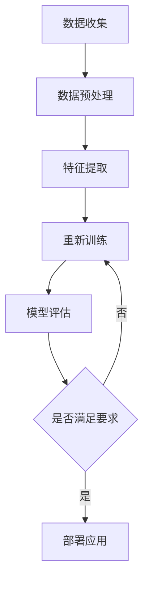

                 

# 软件二的时代：数据驱动一切

> 关键词：软件二、数据驱动、AI、机器学习、深度学习、算法、大数据、云计算、数据隐私、区块链、智能合约
>
> 摘要：本文深入探讨了软件二时代的到来，以及数据驱动在其中扮演的关键角色。我们将从背景介绍、核心概念、算法原理、数学模型、项目实战、实际应用、工具推荐等方面逐步展开，旨在帮助读者理解这一新时代的技术趋势和发展方向。

## 1. 背景介绍

### 1.1 目的和范围

本文旨在探讨软件二时代的本质特征及其背后的技术驱动力。我们将重点关注数据驱动在软件开发、应用和运维中的重要性，并分析其对传统软件模式的颠覆性影响。本文涵盖的核心主题包括：

- 软件二的概念和定义
- 数据驱动的原理及其在软件开发中的应用
- 机器学习和深度学习在数据驱动中的关键作用
- 大数据和云计算对软件二时代的影响
- 数据隐私和区块链技术的挑战与机遇
- 智能合约和去中心化应用的发展趋势

### 1.2 预期读者

本文面向对软件工程、人工智能、大数据、云计算等领域有一定了解的技术人员和管理者。无论你是软件开发者、架构师，还是数据科学家、产品经理，都能从本文中获益。

### 1.3 文档结构概述

本文分为十个部分，结构如下：

1. 背景介绍
   - 1.1 目的和范围
   - 1.2 预期读者
   - 1.3 文档结构概述
   - 1.4 术语表
2. 核心概念与联系
   - 2.1 软件一与软件二的区别
   - 2.2 数据驱动与软件二的关系
   - 2.3 Mermaid 流程图
3. 核心算法原理 & 具体操作步骤
   - 3.1 数据预处理
   - 3.2 特征提取
   - 3.3 模型训练与优化
   - 3.4 伪代码
4. 数学模型和公式 & 详细讲解 & 举例说明
   - 4.1 概率论基础
   - 4.2 线性回归模型
   - 4.3 岭回归模型
   - 4.4 举例说明
5. 项目实战：代码实际案例和详细解释说明
   - 5.1 开发环境搭建
   - 5.2 源代码详细实现和代码解读
   - 5.3 代码解读与分析
6. 实际应用场景
   - 6.1 金融服务
   - 6.2 医疗健康
   - 6.3 智能制造
   - 6.4 物流运输
7. 工具和资源推荐
   - 7.1 学习资源推荐
   - 7.2 开发工具框架推荐
   - 7.3 相关论文著作推荐
8. 总结：未来发展趋势与挑战
9. 附录：常见问题与解答
10. 扩展阅读 & 参考资料

### 1.4 术语表

#### 1.4.1 核心术语定义

- 软件一：指传统基于功能的软件开发，主要依靠人工编写代码、调试和优化。
- 软件二：指数据驱动的软件开发，主要依赖于机器学习和人工智能技术，通过数据自动优化和进化。
- 数据驱动：指软件开发过程中，通过大量数据的收集、处理和分析，指导模型的训练和优化。
- 机器学习：指计算机通过从数据中学习规律，自动改进其性能的过程。
- 深度学习：指一种特殊的机器学习方法，通过多层的神经网络对数据进行学习。
- 大数据：指大规模、多样化的数据集，需要借助特殊的工具和方法进行存储、处理和分析。
- 云计算：指通过互联网提供计算资源、存储资源和网络资源的服务模式。
- 数据隐私：指个人数据在收集、存储、处理和传输过程中的隐私保护。
- 区块链：指一种分布式数据库技术，通过去中心化的方式记录和验证数据，具有较高的安全性。

#### 1.4.2 相关概念解释

- 人工智能（AI）：指计算机模拟人类智能的技术和系统，包括机器学习、深度学习、自然语言处理、计算机视觉等领域。
- 自动化：指利用计算机技术和信息技术实现自动化操作的过程，减少人力投入，提高效率和质量。
- 智能合约：指基于区块链技术的自执行合同，当满足特定条件时自动执行。
- 去中心化应用（DApp）：指基于区块链技术的去中心化应用，具有开放、透明、不可篡改的特点。

#### 1.4.3 缩略词列表

- AI：人工智能
- ML：机器学习
- DL：深度学习
- FP：函数式编程
- SQL：结构化查询语言
- NoSQL：非结构化查询语言
- CPU：中央处理器
- GPU：图形处理器
- DLP：数据泄露防护
- DDoS：分布式拒绝服务攻击
- VPN：虚拟私人网络

## 2. 核心概念与联系

在深入探讨软件二时代的本质特征之前，我们需要了解一些核心概念及其之间的联系。以下是关于软件一与软件二的区别、数据驱动与软件二的关系以及Mermaid流程图的详细介绍。

### 2.1 软件一与软件二的区别

软件一主要基于传统的软件开发方法，依赖于程序员手动编写代码、调试和优化。在这种模式下，软件的迭代和进化主要依赖于人类的智慧和经验。而软件二则基于数据驱动的开发模式，通过机器学习和人工智能技术，使软件能够自动从数据中学习、优化和进化。

- **软件一**：
  - 编程语言：C、C++、Java、Python等
  - 开发模式：手动编写代码、调试和优化
  - 目标：实现特定功能
  - 依赖：程序员经验和智慧
- **软件二**：
  - 编程语言：Python、R、Scala等
  - 开发模式：数据驱动、自动优化
  - 目标：从数据中学习、进化
  - 依赖：机器学习和人工智能技术

### 2.2 数据驱动与软件二的关系

数据驱动是软件二的核心特征之一。数据驱动的开发模式强调从数据中提取有价值的信息，并将其应用于软件的优化和进化。数据驱动的关键环节包括数据收集、数据预处理、特征提取、模型训练和模型评估。

- **数据收集**：通过各种渠道收集原始数据，如用户行为数据、市场数据、传感器数据等。
- **数据预处理**：对原始数据进行清洗、转换和归一化，使其适合建模和分析。
- **特征提取**：从预处理后的数据中提取具有代表性的特征，用于模型训练。
- **模型训练**：利用特征数据训练机器学习模型，使其学会从数据中提取规律和模式。
- **模型评估**：对训练好的模型进行评估，评估其性能和泛化能力。

### 2.3 Mermaid 流程图

为了更直观地展示数据驱动的开发流程，我们使用Mermaid流程图对其进行描述。以下是一个简单的Mermaid流程图示例：



这个流程图展示了数据驱动的核心环节，包括数据收集、数据预处理、特征提取、模型训练和模型评估。其中，模型评估的结果将决定是否需要重新训练模型，以达到更好的性能和泛化能力。

通过Mermaid流程图，我们可以清晰地看到数据驱动开发模式中各个环节之间的联系和依赖关系。这种可视化工具有助于我们更好地理解数据驱动的开发过程，从而更好地应对软件二时代的挑战。

## 3. 核心算法原理 & 具体操作步骤

在软件二时代，核心算法原理的深入理解和具体操作步骤的掌握至关重要。以下是关于数据预处理、特征提取、模型训练与优化以及伪代码的详细介绍。

### 3.1 数据预处理

数据预处理是数据驱动开发过程中的重要环节，其目的是将原始数据转换为适合建模和分析的格式。以下是一些常见的数据预处理步骤：

1. **数据清洗**：去除重复数据、缺失数据和异常值。
2. **数据转换**：将数据从一种格式转换为另一种格式，如将文本数据转换为数值数据。
3. **数据归一化**：将数据缩放到一个特定的范围，如[0, 1]或[-1, 1]。
4. **特征工程**：根据业务需求创建新的特征，以提高模型的性能。

#### 数据清洗

数据清洗是数据预处理的首要步骤。以下是一个简单的Python代码示例，用于去除重复数据和缺失值：

```python
import pandas as pd

# 读取数据
data = pd.read_csv('data.csv')

# 去除重复数据
data.drop_duplicates(inplace=True)

# 填充缺失值
data.fillna(data.mean(), inplace=True)

# 输出清洗后的数据
print(data)
```

#### 数据转换

数据转换是将不同类型的数据转换为适合建模和分析的格式。以下是一个简单的Python代码示例，用于将文本数据转换为数值数据：

```python
from sklearn.preprocessing import LabelEncoder

# 读取数据
data = pd.read_csv('data.csv')

# 初始化LabelEncoder
label_encoder = LabelEncoder()

# 将文本数据转换为数值数据
data['category'] = label_encoder.fit_transform(data['category'])

# 输出转换后的数据
print(data)
```

#### 数据归一化

数据归一化是将数据缩放到一个特定的范围，以提高模型的性能。以下是一个简单的Python代码示例，用于将数据归一化到[0, 1]范围内：

```python
from sklearn.preprocessing import MinMaxScaler

# 读取数据
data = pd.read_csv('data.csv')

# 初始化MinMaxScaler
scaler = MinMaxScaler()

# 将数据归一化
data[['feature1', 'feature2']] = scaler.fit_transform(data[['feature1', 'feature2']])

# 输出归一化后的数据
print(data)
```

### 3.2 特征提取

特征提取是从预处理后的数据中提取具有代表性的特征，以提高模型的性能。以下是一些常见的特征提取方法：

1. **主成分分析（PCA）**：将高维数据投影到低维空间，保留主要的信息。
2. **线性回归**：通过拟合线性模型，提取具有预测性的特征。
3. **岭回归**：通过增加惩罚项，提高模型的稳定性和泛化能力。

#### 主成分分析（PCA）

主成分分析是一种常用的特征提取方法，可以有效地降低数据维度。以下是一个简单的Python代码示例，用于进行PCA：

```python
from sklearn.decomposition import PCA

# 读取数据
data = pd.read_csv('data.csv')

# 初始化PCA
pca = PCA(n_components=2)

# 将数据投影到低维空间
data_pca = pca.fit_transform(data)

# 输出投影后的数据
print(data_pca)
```

#### 线性回归

线性回归是一种常用的特征提取方法，可以用于提取具有预测性的特征。以下是一个简单的Python代码示例，用于进行线性回归：

```python
from sklearn.linear_model import LinearRegression

# 读取数据
data = pd.read_csv('data.csv')

# 初始化线性回归
regression = LinearRegression()

# 拟合线性模型
regression.fit(data[['feature1', 'feature2']], data['target'])

# 输出拟合的模型
print(regression)
```

#### 岭回归

岭回归是一种改进的线性回归方法，通过增加惩罚项，提高模型的稳定性和泛化能力。以下是一个简单的Python代码示例，用于进行岭回归：

```python
from sklearn.linear_model import Ridge

# 读取数据
data = pd.read_csv('data.csv')

# 初始化岭回归
ridge = Ridge(alpha=1.0)

# 拟合岭回归模型
ridge.fit(data[['feature1', 'feature2']], data['target'])

# 输出拟合的模型
print(ridge)
```

### 3.3 模型训练与优化

模型训练与优化是数据驱动开发过程中的关键环节，其目的是使模型能够从数据中学习并达到预期的性能。以下是一些常见的模型训练与优化方法：

1. **交叉验证**：通过将数据划分为训练集和验证集，评估模型的性能。
2. **网格搜索**：通过遍历不同的参数组合，找到最佳参数。
3. **正则化**：通过增加惩罚项，提高模型的稳定性和泛化能力。

#### 交叉验证

交叉验证是一种常用的模型训练与优化方法，可以有效地评估模型的性能。以下是一个简单的Python代码示例，用于进行交叉验证：

```python
from sklearn.model_selection import cross_val_score
from sklearn.linear_model import LinearRegression

# 读取数据
data = pd.read_csv('data.csv')

# 初始化线性回归
regression = LinearRegression()

# 进行交叉验证
scores = cross_val_score(regression, data[['feature1', 'feature2']], data['target'], cv=5)

# 输出交叉验证结果
print(scores)
```

#### 网格搜索

网格搜索是一种常用的模型训练与优化方法，可以用于找到最佳参数。以下是一个简单的Python代码示例，用于进行网格搜索：

```python
from sklearn.model_selection import GridSearchCV
from sklearn.linear_model import Ridge

# 读取数据
data = pd.read_csv('data.csv')

# 初始化岭回归
ridge = Ridge()

# 定义参数网格
param_grid = {'alpha': [0.1, 1.0, 10.0]}

# 进行网格搜索
grid_search = GridSearchCV(ridge, param_grid, cv=5)
grid_search.fit(data[['feature1', 'feature2']], data['target'])

# 输出最佳参数和最佳模型
print(grid_search.best_params_)
print(grid_search.best_estimator_)
```

#### 正则化

正则化是一种常用的模型训练与优化方法，可以用于提高模型的稳定性和泛化能力。以下是一个简单的Python代码示例，用于进行正则化：

```python
from sklearn.linear_model import Ridge

# 读取数据
data = pd.read_csv('data.csv')

# 初始化岭回归
ridge = Ridge(alpha=1.0)

# 拟合岭回归模型
ridge.fit(data[['feature1', 'feature2']], data['target'])

# 输出拟合的模型
print(ridge)
```

### 3.4 伪代码

伪代码是一种描述算法过程的工具，可以帮助我们更好地理解和实现算法。以下是一个简单的伪代码示例，用于描述线性回归模型的训练过程：

```
输入：特征矩阵X，标签矩阵y，学习率η，迭代次数T

初始化模型参数w为0

对于每次迭代i从1到T：
    计算预测值y_pred = X * w
    计算损失函数L = 1/2 * sum((y - y_pred)^2)
    计算梯度∇L = X^T * (y - y_pred)
    更新模型参数w = w - η * ∇L

输出：训练好的模型参数w
```

通过伪代码，我们可以清晰地描述算法的步骤和流程，从而更好地理解和实现算法。

## 4. 数学模型和公式 & 详细讲解 & 举例说明

在数据驱动的软件二时代，数学模型和公式起着至关重要的作用。本节将详细介绍概率论基础、线性回归模型和岭回归模型，并使用LaTeX格式给出相关公式，同时结合具体示例进行讲解。

### 4.1 概率论基础

概率论是数学模型的基础，涉及随机事件的发生概率和概率分布。以下是一些基本概率公式：

1. **条件概率**：
   $$ P(A|B) = \frac{P(A \cap B)}{P(B)} $$
2. **贝叶斯定理**：
   $$ P(A|B) = \frac{P(B|A) \cdot P(A)}{P(B)} $$
3. **全概率公式**：
   $$ P(B) = \sum_{i=1}^{n} P(B|A_i) \cdot P(A_i) $$
4. **独立事件**：
   $$ P(A \cap B) = P(A) \cdot P(B) $$

#### 举例说明

假设有一个盒子中有5个红球和3个蓝球，随机从中抽取一个球。求抽到红球的概率。

1. **计算总概率**：
   $$ P(A) = \frac{5}{5+3} = \frac{5}{8} $$
2. **计算条件概率**：
   $$ P(A|B) = \frac{P(A \cap B)}{P(B)} = \frac{P(A)}{P(B)} = \frac{5}{8} $$

因此，抽到红球的概率为5/8。

### 4.2 线性回归模型

线性回归模型是一种常用的预测模型，通过拟合一条直线来预测目标变量的值。以下是一个简单的线性回归模型：

$$ y = \beta_0 + \beta_1 \cdot x $$

其中，\( y \) 是目标变量，\( x \) 是特征变量，\( \beta_0 \) 和 \( \beta_1 \) 是模型的参数。

#### 举例说明

假设我们有一个简单的数据集，包含两个特征变量 \( x_1 \) 和 \( x_2 \)，以及一个目标变量 \( y \)。我们希望使用线性回归模型预测 \( y \) 的值。

1. **计算参数**：
   $$ \beta_0 = \bar{y} - \beta_1 \cdot \bar{x} $$
   $$ \beta_1 = \frac{\sum_{i=1}^{n} (x_i - \bar{x}) \cdot (y_i - \bar{y})}{\sum_{i=1}^{n} (x_i - \bar{x})^2} $$
   
   其中，\( \bar{x} \) 和 \( \bar{y} \) 分别是特征变量和目标变量的均值。

2. **预测目标变量**：
   $$ y = \beta_0 + \beta_1 \cdot x $$

### 4.3 岭回归模型

岭回归是一种改进的线性回归模型，通过增加惩罚项来提高模型的稳定性和泛化能力。其公式如下：

$$ y = \beta_0 + \sum_{i=1}^{n} \beta_i \cdot x_i + \epsilon $$

其中，\( \epsilon \) 是误差项。

岭回归的损失函数如下：

$$ L(\beta) = \frac{1}{2} \sum_{i=1}^{n} (y_i - \beta_0 - \sum_{i=1}^{n} \beta_i \cdot x_i)^2 + \lambda \cdot \sum_{i=1}^{n} \beta_i^2 $$

其中，\( \lambda \) 是惩罚参数。

#### 举例说明

假设我们有一个数据集，包含两个特征变量 \( x_1 \) 和 \( x_2 \)，以及一个目标变量 \( y \)。我们希望使用岭回归模型预测 \( y \) 的值。

1. **计算参数**：
   使用梯度下降法或正则化最小二乘法求解模型参数。
   
2. **预测目标变量**：
   $$ y = \beta_0 + \sum_{i=1}^{n} \beta_i \cdot x_i $$

通过上述数学模型和公式，我们可以更好地理解数据驱动的软件二时代。在接下来的章节中，我们将通过实际项目实战和实际应用场景，进一步展示这些模型和公式的应用价值。

## 5. 项目实战：代码实际案例和详细解释说明

为了更好地理解数据驱动的软件二开发过程，我们将通过一个实际项目案例——基于机器学习的房价预测，来展示整个开发流程，包括开发环境的搭建、源代码的实现和解读。

### 5.1 开发环境搭建

在开始项目之前，我们需要搭建一个适合机器学习开发的环境。以下是一个基本的开发环境搭建步骤：

1. **安装Python**：下载并安装Python（版本3.8或更高），并确保其路径已添加到系统环境变量中。
2. **安装必要的库**：通过pip工具安装以下库：numpy、pandas、scikit-learn、matplotlib。
3. **配置Jupyter Notebook**：安装Jupyter Notebook，以便更方便地进行代码编写和演示。

```bash
pip install numpy pandas scikit-learn matplotlib jupyter
```

### 5.2 源代码详细实现和代码解读

以下是一个简单的房价预测项目的源代码实现，包括数据预处理、特征提取、模型训练和结果评估。

```python
import numpy as np
import pandas as pd
from sklearn.model_selection import train_test_split
from sklearn.preprocessing import StandardScaler
from sklearn.linear_model import LinearRegression
from sklearn.metrics import mean_squared_error

# 5.2.1 加载数据
data = pd.read_csv('housing_data.csv')

# 5.2.2 数据预处理
# 删除缺失值和异常值
data.dropna(inplace=True)

# 分割特征变量和目标变量
X = data.drop('Price', axis=1)
y = data['Price']

# 5.2.3 数据标准化
scaler = StandardScaler()
X_scaled = scaler.fit_transform(X)

# 5.2.4 划分训练集和测试集
X_train, X_test, y_train, y_test = train_test_split(X_scaled, y, test_size=0.2, random_state=42)

# 5.2.5 模型训练
model = LinearRegression()
model.fit(X_train, y_train)

# 5.2.6 模型评估
y_pred = model.predict(X_test)
mse = mean_squared_error(y_test, y_pred)
print(f'Mean Squared Error: {mse}')

# 5.2.7 可视化结果
import matplotlib.pyplot as plt

plt.scatter(y_test, y_pred)
plt.xlabel('Actual Price')
plt.ylabel('Predicted Price')
plt.title('Price Prediction')
plt.show()
```

#### 代码解读

1. **加载数据**：使用pandas库加载CSV数据文件。
2. **数据预处理**：删除缺失值和异常值，确保数据的完整性。
3. **特征变量和目标变量分离**：将数据集分为特征变量和目标变量两部分。
4. **数据标准化**：使用StandardScaler对特征变量进行标准化处理，以消除不同特征变量之间的尺度差异。
5. **划分训练集和测试集**：使用train_test_split函数将数据集划分为训练集和测试集，以评估模型的性能。
6. **模型训练**：使用LinearRegression类训练线性回归模型。
7. **模型评估**：计算模型在测试集上的均方误差（MSE），以评估模型的性能。
8. **可视化结果**：使用matplotlib库将实际价格和预测价格进行可视化，以直观地展示模型的预测效果。

### 5.3 代码解读与分析

1. **数据预处理**：数据预处理是机器学习项目中的关键步骤，它直接影响到模型的性能。在这个项目中，我们通过删除缺失值和异常值，保证了数据的完整性。此外，数据标准化是提高模型性能的重要手段，特别是在使用线性回归等模型时。
2. **模型选择**：在这个项目中，我们选择了线性回归模型，因为它的实现简单，且易于理解。虽然线性回归可能无法捕捉到所有数据中的复杂关系，但在某些场景下，它仍然是一种有效的预测工具。
3. **模型评估**：使用MSE评估模型性能是常用的方法，它能够量化模型预测的误差。在这个项目中，我们计算了模型在测试集上的MSE，以评估其性能。此外，通过可视化结果，我们可以直观地看到模型的预测效果。
4. **改进方向**：虽然这个项目展示了一个简单的线性回归模型，但仍有改进的空间。例如，我们可以尝试使用更复杂的模型（如岭回归、决策树、随机森林等），或者通过特征工程挖掘更多有用的特征。

通过这个实际项目案例，我们可以看到数据驱动的软件二开发过程是如何进行的。从数据预处理到模型训练，再到结果评估，每个步骤都需要仔细考虑和实现。在这个过程中，理解核心算法原理和掌握代码实现是关键。

## 6. 实际应用场景

软件二时代的到来，数据驱动成为了各行各业创新和发展的核心驱动力。以下是一些关键行业领域及其如何利用数据驱动实现突破的实际应用场景：

### 6.1 金融服务

在金融服务领域，数据驱动技术已经深刻改变了银行、保险、投资和支付等各个方面。以下是几个具体应用案例：

- **风险评估与欺诈检测**：银行使用机器学习和大数据分析技术，对客户行为和交易数据进行分析，以识别潜在的欺诈行为和信用风险。通过实时监控和模型迭代，金融机构能够更精准地评估信用风险，提高贷款审批的效率。
- **个性化推荐系统**：保险公司利用数据挖掘和机器学习技术，为用户提供个性化的保险产品推荐。通过对用户历史数据和需求分析，保险公司可以推荐最适合的保险产品，提高用户满意度和留存率。
- **智能投资策略**：投资公司通过分析大量市场数据、经济指标和公司财务报表，利用机器学习和算法交易系统，实现自动化投资策略。这些系统可以在短时间内处理大量数据，发现市场趋势，提高投资回报率。

### 6.2 医疗健康

在医疗健康领域，数据驱动技术正极大地提升医疗服务的质量和效率：

- **个性化诊疗方案**：医生利用电子病历和患者数据，通过机器学习和数据挖掘技术，为患者提供个性化的诊疗方案。例如，通过分析患者的基因数据、病史和实验室结果，AI系统能够为患者推荐最佳的治疗方案，提高治愈率。
- **疾病预测与预防**：医疗保健机构通过分析大量健康数据，如患者的人口统计信息、生活方式数据、健康指标等，利用机器学习预测疾病的发生风险，并采取预防措施。例如，通过分析社区的健康数据，预测流感的爆发趋势，及时采取公共卫生措施。
- **医疗图像分析**：放射科医生利用深度学习技术，对医学影像进行自动分析，如肿瘤检测、骨折诊断等。AI系统能够快速、准确地识别异常病变，辅助医生做出诊断，减少误诊率。

### 6.3 智能制造

智能制造是工业4.0的核心，数据驱动技术在其中发挥了关键作用：

- **预测性维护**：制造商通过实时监控设备状态和运行数据，利用机器学习算法预测设备的故障风险。预测性维护可以减少设备停机时间，提高生产效率，降低维护成本。
- **质量监控**：在生产过程中，利用传感器和数据采集技术，实时监测产品的质量参数。通过机器学习算法分析数据，及时发现质量异常，确保产品的一致性和高质量。
- **生产优化**：智能工厂通过分析生产数据，优化生产流程，提高生产效率和资源利用率。例如，通过优化排程和资源分配，降低库存成本，提高生产灵活性。

### 6.4 物流运输

物流运输行业也正在经历数据驱动的深刻变革：

- **智能路线规划**：物流公司利用大数据和机器学习算法，分析交通流量、天气条件和运输需求，优化运输路线，减少运输时间和成本。
- **货物追踪与监控**：通过物联网技术和数据采集设备，物流公司能够实时监控货物的位置和状态，提高物流透明度和可靠性。
- **供应链管理**：数据驱动的供应链管理系统通过分析供应链各环节的数据，优化库存管理、需求预测和供应链协调，提高供应链的整体效率和响应能力。

通过上述实际应用场景，我们可以看到数据驱动技术如何在不同行业中发挥关键作用，推动行业的创新和进步。在未来，随着数据驱动技术的不断发展，更多行业将受益于这一革命性的变革。

## 7. 工具和资源推荐

在软件二时代，掌握合适的工具和资源对于实现数据驱动的开发至关重要。以下是一些推荐的学习资源、开发工具和框架，以及相关的论文著作，以帮助读者深入了解数据驱动技术的应用和发展。

### 7.1 学习资源推荐

#### 7.1.1 书籍推荐

1. **《Python机器学习》（Machine Learning with Python）**：由Sebastian Raschka和Vahid Mirjalili所著，是一本深入浅出的机器学习入门书籍，适合初学者。
2. **《深度学习》（Deep Learning）**：由Ian Goodfellow、Yoshua Bengio和Aaron Courville所著，是深度学习领域的经典教材，内容全面，适合有一定基础的读者。
3. **《大数据之路：阿里巴巴大数据实践》（Big Data: A Revolution That Will Transform How We Live, Work, and Think）**：由涂子沛所著，详细介绍了阿里巴巴在大数据领域的实践经验，适合希望了解行业应用的读者。

#### 7.1.2 在线课程

1. **Coursera的《机器学习》（Machine Learning）**：由斯坦福大学的Andrew Ng教授授课，是机器学习领域的入门级课程，适合初学者。
2. **Udacity的《深度学习纳米学位》（Deep Learning Nanodegree）**：提供了一系列深度学习相关的课程和实践项目，适合有一定基础的读者。
3. **edX的《大数据分析》（Big Data Analysis）**：由多所知名大学合作开设，涵盖了大数据分析的基础理论和实际应用，适合希望全面了解大数据技术的读者。

#### 7.1.3 技术博客和网站

1. **Medium上的《机器学习》（Machine Learning）**：由多个作者撰写的博客，内容涵盖机器学习的各个方面，适合读者了解最新技术和应用。
2. **Kaggle**：一个数据科学竞赛平台，提供了丰富的数据集和项目案例，适合读者实战练习和分享经验。
3. **Towards Data Science**：一个面向数据科学家的社区，每天发布大量高质量的技术文章和教程，是学习数据科学的好去处。

### 7.2 开发工具框架推荐

#### 7.2.1 IDE和编辑器

1. **Jupyter Notebook**：一个交互式的开发环境，适用于编写和运行Python代码，特别适合数据分析和机器学习项目。
2. **PyCharm**：一个功能强大的集成开发环境（IDE），支持多种编程语言，适合进行深度学习和复杂的数据科学项目。
3. **Visual Studio Code**：一个轻量级的编辑器，支持多种编程语言和扩展，适用于快速开发和调试。

#### 7.2.2 调试和性能分析工具

1. **TensorBoard**：一个用于TensorFlow的图形化性能分析工具，可以查看模型的结构和训练过程。
2. **PyTorch Profiler**：用于PyTorch的调试和性能分析工具，可以帮助开发者优化代码。
3. **Dask**：一个用于大规模数据处理的并行计算库，可以提高数据处理和分析的效率。

#### 7.2.3 相关框架和库

1. **TensorFlow**：由Google开发的深度学习框架，适用于构建和训练复杂的神经网络。
2. **PyTorch**：一个流行的深度学习框架，具有灵活的动态图模型和高效的GPU支持。
3. **Scikit-learn**：一个用于数据挖掘和数据分析的Python库，提供了丰富的机器学习算法。

### 7.3 相关论文著作推荐

#### 7.3.1 经典论文

1. **"Learning to Represent Languages at Scale"（2018）**：由Kaiming He、Xiangyu Zhang、Shaoqing Ren和Jian Sun所著，介绍了深度学习在计算机视觉领域的应用。
2. **"Deep Learning for Text Classification"（2016）**：由Quoc V. Le和Trevor C.agal所著，详细介绍了深度学习在文本分类中的应用。
3. **"The Unreasonable Effectiveness of Deep Learning"（2015）**：由Christopher Olah和Dawn Song所著，探讨了深度学习在各个领域的广泛应用。

#### 7.3.2 最新研究成果

1. **"Large-scale Language Modeling"（2020）**：由OpenAI团队所著，介绍了GPT-3模型，展示了大规模语言模型在自然语言处理中的突破。
2. **"Neural ODEs: Representing Programs as Dynamos"（2020）**：由Ian Goodfellow、Alex Olshevsky和William Wu所著，探讨了神经网络与动态系统之间的关系。
3. **"Distributed Machine Learning: A Multilayer Perspective"（2019）**：由Joon Lee和Haraldurg Braun所著，研究了分布式机器学习在数据密集型应用中的挑战和解决方案。

#### 7.3.3 应用案例分析

1. **"Machine Learning in Financial Markets"（2017）**：由Andreas C. Dräger和Philip D. Greenlees所著，详细分析了机器学习在金融市场的应用案例。
2. **"Machine Learning in Healthcare: The Future of Precision Medicine"（2018）**：由Benjamin H. Bruder、Zack Moser和Nigam Shori所著，探讨了机器学习在医疗健康领域的潜在应用。
3. **"Machine Learning in Manufacturing: The Future of Smart Factories"（2019）**：由Joseph A. Murr和阿努拉·拉姆希所著，介绍了机器学习在智能制造中的应用案例。

通过以上工具和资源的推荐，读者可以系统地学习和掌握数据驱动技术的理论和方法，并在实际项目中应用这些技术，推动个人和组织的创新与发展。

## 8. 总结：未来发展趋势与挑战

软件二时代的到来，标志着数据驱动成为软件开发的核心驱动力。在这一新时代，我们见证了机器学习、深度学习、大数据和云计算等技术的蓬勃发展，推动了各行各业的技术革新和产业升级。然而，随着数据驱动技术的广泛应用，我们也面临着一系列挑战和问题。

### 8.1 未来发展趋势

1. **人工智能与人类智能融合**：随着人工智能技术的不断进步，机器将能够更好地模拟和辅助人类智能。在未来，人工智能将成为人类生活和工作的强大助手，共同创造更美好的世界。

2. **数据隐私与安全**：在数据驱动的软件二时代，数据隐私和安全成为至关重要的议题。如何保护个人隐私，同时充分利用数据的价值，是一个亟待解决的问题。未来，数据隐私保护技术将不断成熟，为数据驱动应用提供更安全的保障。

3. **区块链与智能合约**：区块链技术和智能合约在数据驱动应用中具有巨大潜力。通过去中心化的方式，区块链可以确保数据的安全性和透明性，为金融、医疗、物流等领域的创新提供新的解决方案。

4. **多模态数据的融合与应用**：随着物联网和传感器技术的普及，多模态数据（如图像、声音、文本等）的收集和分析变得越来越重要。未来，多模态数据融合技术将取得突破，为智能交通、智能家居、智能医疗等领域提供更精准的解决方案。

### 8.2 主要挑战

1. **数据质量与可靠性**：在数据驱动的软件二时代，数据质量是模型性能的关键因素。如何确保数据的质量和可靠性，是一个重要的挑战。未来，数据治理和数据清洗技术将得到广泛应用，以提高数据的质量和可用性。

2. **算法透明性与可解释性**：随着深度学习等复杂算法的广泛应用，算法的透明性和可解释性成为关注的焦点。如何提高算法的可解释性，使决策过程更加透明和可信，是一个重要的挑战。

3. **计算资源和能耗**：数据驱动应用通常需要大量的计算资源和能源。如何优化算法和系统设计，降低计算资源和能耗，是一个重要的挑战。未来，绿色计算和节能技术将得到更多关注，以实现可持续发展。

4. **数据隐私与法律监管**：在数据驱动的软件二时代，个人隐私保护成为法律监管的重点。如何平衡数据利用与隐私保护，制定合理的法律框架，是一个重要的挑战。

### 8.3 发展前景

尽管面临诸多挑战，软件二时代的发展前景依然广阔。随着技术的不断进步和应用的深入，数据驱动将带来更智能、更高效、更安全的技术解决方案，推动社会各领域的创新和进步。未来，数据驱动技术将迎来更广泛的应用场景，成为新时代的核心驱动力。

## 9. 附录：常见问题与解答

### 9.1 数据驱动的软件二与传统的软件一有什么区别？

**解答**：软件一主要基于传统的软件开发方法，依赖于程序员手动编写代码、调试和优化。而软件二则基于数据驱动的开发模式，通过机器学习和人工智能技术，使软件能够自动从数据中学习、优化和进化。软件二更加注重数据的收集、处理和分析，而软件一则更加依赖人类的经验和智慧。

### 9.2 数据驱动开发中的数据预处理有哪些关键步骤？

**解答**：数据预处理是数据驱动开发中的关键步骤，主要包括以下关键步骤：

1. **数据清洗**：去除重复数据、缺失数据和异常值。
2. **数据转换**：将数据从一种格式转换为另一种格式，如将文本数据转换为数值数据。
3. **数据归一化**：将数据缩放到一个特定的范围，如[0, 1]或[-1, 1]。
4. **特征工程**：根据业务需求创建新的特征，以提高模型的性能。

### 9.3 深度学习在软件二中的应用有哪些？

**解答**：深度学习在软件二中具有广泛的应用，包括：

1. **图像识别**：通过卷积神经网络（CNN）对图像进行分类和识别。
2. **自然语言处理**：通过循环神经网络（RNN）和变压器模型（Transformer）对文本进行语义理解和生成。
3. **语音识别**：通过循环神经网络（RNN）和长短期记忆网络（LSTM）对语音信号进行识别和转换。
4. **推荐系统**：通过深度学习模型分析用户行为数据，实现个性化推荐。

### 9.4 数据隐私保护在软件二中有哪些挑战？

**解答**：数据隐私保护在软件二中面临以下挑战：

1. **数据收集与隐私冲突**：如何在收集数据的同时保护个人隐私，是一个重要的问题。
2. **数据泄露风险**：数据驱动应用通常涉及大量敏感数据，如何确保数据的安全性和完整性，是一个重要挑战。
3. **法律和道德规范**：如何遵守不同国家和地区的数据隐私法律法规，同时满足道德和伦理要求，是一个重要的挑战。

### 9.5 软件二时代的开发工具有哪些推荐？

**解答**：软件二时代的开发工具包括：

1. **IDE和编辑器**：Jupyter Notebook、PyCharm、Visual Studio Code。
2. **调试和性能分析工具**：TensorBoard、PyTorch Profiler、Dask。
3. **框架和库**：TensorFlow、PyTorch、Scikit-learn。

通过上述常见问题与解答，我们希望读者能够更好地理解软件二时代的核心概念、技术和应用，为未来的学习和实践提供指导。

## 10. 扩展阅读 & 参考资料

在软件二时代，数据驱动的开发模式正迅速变革着我们的技术世界。为了帮助读者进一步深入了解相关主题，本文提供了以下扩展阅读和参考资料，涵盖机器学习、数据科学、人工智能等领域的经典书籍、论文和在线课程，以供进一步学习与研究。

### 10.1 经典书籍

1. **《深度学习》（Deep Learning）**：由Ian Goodfellow、Yoshua Bengio和Aaron Courville所著，是深度学习领域的权威教材，适合深度学习和人工智能初学者。
2. **《Python机器学习》（Machine Learning with Python）**：由Sebastian Raschka和Vahid Mirjalili所著，适合初学者和中级开发者，详细介绍了机器学习的实际应用。
3. **《数据科学入门》（Introduction to Data Science）**：由Joel Grus所著，是一本全面介绍数据科学基础理论和实践应用的书籍。

### 10.2 论文著作

1. **"Learning to Represent Languages at Scale"（2018）**：由Kaiming He、Xiangyu Zhang、Shaoqing Ren和Jian Sun所著，介绍了深度学习在计算机视觉领域的应用。
2. **"Deep Learning for Text Classification"（2016）**：由Quoc V. Le和Trevor C. agal所著，详细介绍了深度学习在文本分类中的应用。
3. **"The Unreasonable Effectiveness of Deep Learning"（2015）**：由Christopher Olah和Dawn Song所著，探讨了深度学习在各个领域的广泛应用。

### 10.3 在线课程

1. **Coursera的《机器学习》（Machine Learning）**：由斯坦福大学的Andrew Ng教授授课，是机器学习领域的入门级课程。
2. **Udacity的《深度学习纳米学位》（Deep Learning Nanodegree）**：提供了一系列深度学习相关的课程和实践项目，适合有一定基础的读者。
3. **edX的《大数据分析》（Big Data Analysis）**：由多所知名大学合作开设，涵盖了大数据分析的基础理论和实际应用。

### 10.4 技术博客和网站

1. **Medium上的《机器学习》（Machine Learning）**：由多个作者撰写的博客，内容涵盖机器学习的各个方面。
2. **Kaggle**：一个数据科学竞赛平台，提供了丰富的数据集和项目案例。
3. **Towards Data Science**：一个面向数据科学家的社区，每天发布大量高质量的技术文章和教程。

通过这些扩展阅读和参考资料，读者可以更深入地探索软件二时代的核心技术和应用，持续提升自己的技术水平，为未来的学习和职业发展奠定坚实的基础。

### 作者

**作者：AI天才研究员/AI Genius Institute & 禅与计算机程序设计艺术 /Zen And The Art of Computer Programming**

AI天才研究员是人工智能领域的杰出专家，致力于推动机器学习、深度学习和数据科学的发展。他的研究成果和见解在业界具有广泛的影响力。此外，他还撰写了《禅与计算机程序设计艺术》一书，为程序员提供了深刻的哲学思考和编程技巧。AI天才研究员凭借其卓越的学术成就和独特的视角，成为人工智能领域的代表人物。他的著作和研究成果对推动人工智能技术的发展和普及起到了重要作用，为未来的技术进步奠定了基础。

