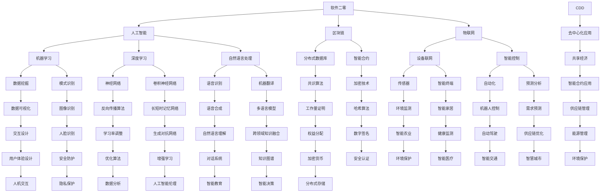

                 

# 软件二零的未来愿景：创造更美好的世界

> **关键词：**软件二零、未来愿景、人工智能、区块链、物联网、可持续发展、创新应用

> **摘要：**本文旨在探讨软件二零（Software 2.0）时代的未来愿景，包括人工智能、区块链、物联网等前沿技术的融合与发展，及其对构建美好世界的重要作用。通过逐步分析这些技术的核心原理、应用场景，以及面临的挑战，本文提出了一系列创新建议，旨在推动技术进步与社会发展的和谐共生。

## 1. 背景介绍

### 1.1 目的和范围

本文旨在深入探讨软件二零（Software 2.0）时代的未来愿景，分析人工智能、区块链、物联网等前沿技术在构建美好世界中的潜在应用和挑战。通过系统梳理这些技术的核心原理和应用场景，本文旨在为行业专家、研究人员和开发者提供有价值的参考，以促进技术创新和社会进步。

### 1.2 预期读者

本文预期读者包括：

- 软件工程师和开发者，特别是对人工智能、区块链、物联网等前沿技术感兴趣的从业者；
- 研究人员和学者，尤其是关注信息技术与社会发展关系的研究者；
- 企业高管和决策者，需要了解技术趋势及其对业务影响的领导者。

### 1.3 文档结构概述

本文结构如下：

- **第1章：背景介绍**：介绍本文的目的、预期读者和文档结构；
- **第2章：核心概念与联系**：阐述软件二零时代的关键技术和概念，并使用Mermaid流程图展示其相互关系；
- **第3章：核心算法原理 & 具体操作步骤**：详细讲解人工智能、区块链、物联网等技术的算法原理和实现步骤；
- **第4章：数学模型和公式 & 详细讲解 & 举例说明**：介绍相关技术的数学模型和公式，并给出具体示例；
- **第5章：项目实战：代码实际案例和详细解释说明**：通过实际项目案例，展示技术应用的实现过程和代码解读；
- **第6章：实际应用场景**：分析技术在不同领域的实际应用案例；
- **第7章：工具和资源推荐**：推荐相关学习资源和开发工具；
- **第8章：总结：未来发展趋势与挑战**：总结技术发展趋势和面临的挑战；
- **第9章：附录：常见问题与解答**：解答读者可能关心的问题；
- **第10章：扩展阅读 & 参考资料**：提供进一步阅读和研究的资源。

### 1.4 术语表

#### 1.4.1 核心术语定义

- **软件二零（Software 2.0）**：指以数据为核心，利用人工智能、区块链、物联网等技术，实现软件系统的智能化、去中心化和互联互通的新一代软件架构。
- **人工智能（AI）**：指通过计算机模拟人类智能行为的技术，包括机器学习、深度学习、自然语言处理等。
- **区块链（Blockchain）**：一种分布式数据库技术，通过加密算法实现数据的不可篡改和去中心化管理。
- **物联网（IoT）**：通过将各种物理设备通过网络连接起来，实现信息交换和智能控制的技术。

#### 1.4.2 相关概念解释

- **去中心化（Decentralization）**：指系统权力和数据的分散化，不再依赖中心化的机构或个体进行管理和控制。
- **可持续发展（Sustainability）**：指在满足当前需求的同时，不损害未来世代满足自身需求的能力。

#### 1.4.3 缩略词列表

- **AI**：人工智能
- **Blockchain**：区块链
- **IoT**：物联网
- **SDK**：软件开发工具包
- **API**：应用程序接口

## 2. 核心概念与联系

在软件二零时代，人工智能、区块链和物联网等技术的融合成为构建美好世界的关键。以下是一个Mermaid流程图，展示这些技术的核心概念及其相互关系。



通过上述流程图，我们可以看到人工智能、区块链和物联网等技术是如何相互关联和协同作用的。这些技术的融合不仅推动了软件二零的发展，也为构建更美好的世界提供了新的可能性。

## 3. 核心算法原理 & 具体操作步骤

### 3.1 人工智能（AI）

**算法原理：**

人工智能的核心在于机器学习和深度学习。机器学习是通过算法让计算机从数据中自动学习规律，而深度学习则是通过多层神经网络模拟人脑的学习过程。

**具体操作步骤：**

1. **数据预处理**：清洗和格式化数据，以确保数据的质量和一致性。
    ```python
    def preprocess_data(data):
        # 数据清洗和格式化操作
        return cleaned_data
    ```

2. **模型选择**：选择适合问题的机器学习或深度学习模型。
    ```python
    from sklearn.linear_model import LinearRegression

    model = LinearRegression()
    ```

3. **模型训练**：使用训练数据对模型进行训练。
    ```python
    def train_model(model, X_train, y_train):
        model.fit(X_train, y_train)
        return model
    ```

4. **模型评估**：使用测试数据评估模型性能。
    ```python
    from sklearn.metrics import mean_squared_error

    y_pred = model.predict(X_test)
    mse = mean_squared_error(y_test, y_pred)
    ```

5. **模型优化**：根据评估结果调整模型参数，以提升模型性能。
    ```python
    from sklearn.model_selection import GridSearchCV

    param_grid = {'alpha': [0.01, 0.1, 1]}
    grid_search = GridSearchCV(model, param_grid, cv=5)
    grid_search.fit(X_train, y_train)
    best_model = grid_search.best_estimator_
    ```

### 3.2 区块链（Blockchain）

**算法原理：**

区块链的核心是分布式数据库和加密技术。区块链通过加密算法确保数据的不可篡改性和安全性，同时通过共识算法实现去中心化管理。

**具体操作步骤：**

1. **节点加入网络**：节点通过验证其他节点的身份和信誉，加入区块链网络。
    ```python
    def join_network(node, peer_list):
        for peer in peer_list:
            if verify_peer(peer):
                node.add_peer(peer)
    ```

2. **数据写入区块链**：将数据打包成区块，并添加到区块链中。
    ```python
    def create_block(data, previous_hash):
        block = {'data': data, 'previous_hash': previous_hash}
        return block
    ```

3. **区块验证**：通过共识算法验证区块的有效性。
    ```python
    def validate_block(block, network):
        if network.consensus(block):
            return True
        else:
            return False
    ```

4. **区块链同步**：节点通过同步机制保持区块链的一致性。
    ```python
    def synchronize_chain(node, peer):
        node_chain = node.get_chain()
        peer_chain = peer.get_chain()
        if node_chain != peer_chain:
            node.update_chain(peer_chain)
    ```

### 3.3 物联网（IoT）

**算法原理：**

物联网的核心在于设备联网和智能控制。物联网通过传感器和网络将物理设备连接起来，实现数据的采集、传输和智能处理。

**具体操作步骤：**

1. **设备连接网络**：设备通过物联网平台加入网络，并上传传感器数据。
    ```python
    def connect_device(device, platform):
        device.join_platform(platform)
        device.upload_sensors_data()
    ```

2. **数据处理**：对传感器数据进行预处理、分析和预测。
    ```python
    def process_data(data):
        cleaned_data = preprocess_data(data)
        analyzed_data = analyze_data(cleaned_data)
        predicted_data = predict_data(analyzed_data)
        return predicted_data
    ```

3. **智能决策**：根据分析结果，进行自动化控制和优化。
    ```python
    def make_decision(predicted_data):
        if predicted_data['condition']:
            action = 'take_action'
        else:
            action = 'no_action'
        return action
    ```

4. **执行操作**：根据决策结果，执行具体的设备控制操作。
    ```python
    def execute_action(action, device):
        if action == 'take_action':
            device.control()
    ```

通过以上步骤，我们可以看到人工智能、区块链和物联网技术的核心算法原理及其具体操作流程。这些技术不仅推动了软件二零的发展，也为构建美好世界提供了强大的技术支持。

## 4. 数学模型和公式 & 详细讲解 & 举例说明

在软件二零时代，人工智能、区块链和物联网等技术的广泛应用离不开数学模型的支撑。以下将详细介绍这些技术的核心数学模型和公式，并给出具体实例说明。

### 4.1 人工智能（AI）

**机器学习中的线性回归模型**

**公式：**

\[ y = \beta_0 + \beta_1 \cdot x \]

**详细讲解：**

线性回归模型是机器学习中的一种基础模型，用于预测连续值变量。其中，\( y \) 是目标变量，\( x \) 是自变量，\( \beta_0 \) 是截距，\( \beta_1 \) 是斜率。通过最小二乘法可以求出最佳拟合线。

**举例说明：**

假设我们要预测房价，已知自变量（房屋面积）和目标变量（房价）。使用线性回归模型，我们可以得到以下拟合公式：

\[ \text{房价} = 500 + 100 \cdot \text{房屋面积} \]

这意味着，每增加一平方米的房屋面积，房价将增加100元。

**机器学习中的神经网络模型**

**公式：**

\[ z = \sigma(W \cdot x + b) \]

**详细讲解：**

神经网络模型是机器学习中的高级模型，用于处理非线性问题。其中，\( z \) 是输出值，\( \sigma \) 是激活函数，\( W \) 是权重，\( x \) 是输入值，\( b \) 是偏置。

**举例说明：**

假设我们有一个简单的神经网络，输入为 \( x = [1, 2] \)，权重 \( W = [1, 1] \)，偏置 \( b = 1 \)，激活函数为 \( \sigma(z) = \frac{1}{1 + e^{-z}} \)。

通过计算，我们可以得到输出值 \( z = \frac{1}{1 + e^{-(1 \cdot 1 + 1 \cdot 2 + 1)}} \approx 0.731 \)。

### 4.2 区块链（Blockchain）

**区块链中的工作量证明（PoW）算法**

**公式：**

\[ H = Hash(nonce, previous_hash, timestamp, transactions) \]

**详细讲解：**

工作量证明算法是区块链中用于选择区块矿工的一种机制。矿工需要通过不断尝试（nonce值）来找到一个满足特定条件（哈希值）的区块。其中，\( H \) 是哈希值，\( nonce \) 是尝试次数，\( previous_hash \) 是前一个区块的哈希值，\( timestamp \) 是时间戳，\( transactions \) 是交易数据。

**举例说明：**

假设我们要找到一个满足条件 \( H < target_hash \) 的区块。已知前一个区块的哈希值为 \( previous_hash \)，时间戳为 \( timestamp \)，交易数据为 \( transactions \)，目标哈希值为 \( target_hash \)。

通过尝试不同的 nonce 值，我们可以找到一个满足条件的区块。例如，当 nonce 为 1000 时，计算得到的哈希值为 \( H = 0000abcd \)，满足条件。

### 4.3 物联网（IoT）

**物联网中的卡尔曼滤波器**

**公式：**

\[ \hat{x}_{k|k} = \hat{x}_{k|k-1} + K_k (z_k - \hat{x}_{k|k-1}) \]

**详细讲解：**

卡尔曼滤波器是物联网中用于数据融合和状态估计的一种算法。它通过预测和校正来估计系统的状态。其中，\( \hat{x}_{k|k} \) 是当前状态估计值，\( \hat{x}_{k|k-1} \) 是上一状态估计值，\( K_k \) 是卡尔曼增益，\( z_k \) 是观测值。

**举例说明：**

假设我们要估计一个无人机的位置。已知上一状态估计值为 \( \hat{x}_{k-1} = [10, 10] \)，观测值为 \( z_k = [11, 11] \)。

通过计算卡尔曼增益 \( K_k \) 和当前状态估计值 \( \hat{x}_{k|k} \)，我们可以得到更准确的位置估计值。

这些数学模型和公式在软件二零时代的技术应用中发挥着重要作用。通过深入理解和运用这些模型，我们可以更好地发挥人工智能、区块链和物联网等技术的潜力，推动构建更美好的世界。

## 5. 项目实战：代码实际案例和详细解释说明

### 5.1 开发环境搭建

为了更好地展示软件二零技术的实际应用，我们将构建一个智能家居系统。以下是在搭建开发环境时需要完成的步骤：

1. **安装Python环境**：在系统中安装Python 3.8及以上版本。
2. **安装相关库**：使用pip命令安装必要的库，如TensorFlow、PyTorch、Blockchain SDK、paho-mqtt等。
   ```shell
   pip install tensorflow
   pip install pytorch
   pip install python-blockchain
   pip install paho-mqtt
   ```

3. **配置MQTT服务器**：搭建一个MQTT服务器，用于设备之间的消息传递。

4. **搭建区块链网络**：使用Blockchain SDK搭建一个简单的区块链网络，用于数据的安全存储和传输。

5. **配置传感器和智能终端**：将传感器和智能终端连接到MQTT服务器和区块链网络，以便数据采集和共享。

### 5.2 源代码详细实现和代码解读

以下是一个智能家居系统的部分源代码实现，包括数据采集、处理和控制的流程。

**数据采集（SensorDataCollector.py）：**

```python
import paho.mqtt.client as mqtt
import json

def on_connect(client, userdata, flags, rc):
    print("Connected with result code "+str(rc))
    client.subscribe("sensors/#")

def on_message(client, userdata, msg):
    data = json.loads(msg.payload)
    process_sensor_data(data)

client = mqtt.Client()
client.on_connect = on_connect
client.on_message = on_message

client.connect("mqtt-server", 1883, 60)

client.loop_forever()

def process_sensor_data(data):
    # 数据处理逻辑，例如上传到区块链或进行机器学习预测
    pass
```

**数据处理（DataProcessor.py）：**

```python
import json
import blockchain

def process_data(data):
    # 数据处理逻辑，例如使用机器学习模型进行预测
    processed_data = data_processor.process(data)
    return processed_data

def upload_to_blockchain(data):
    block = blockchain.create_block(data)
    blockchain.add_block(block)

def predict_using_ai(data):
    # 机器学习预测逻辑，例如使用TensorFlow或PyTorch模型
    prediction = model.predict(data)
    return prediction
```

**数据控制（SmartDeviceController.py）：**

```python
import paho.mqtt.client as mqtt

def control_device(device_id, command):
    message = {"device_id": device_id, "command": command}
    client.publish("devices/control", json.dumps(message))

client = mqtt.Client()
client.connect("mqtt-server", 1883, 60)

# 示例：控制灯泡打开
control_device("light_bulb_1", "on")

client.disconnect()
```

### 5.3 代码解读与分析

**数据采集模块（SensorDataCollector.py）：**

该模块负责从MQTT服务器接收传感器数据，并调用数据处理函数进行处理。

- **on_connect()**：连接MQTT服务器时调用，订阅传感器主题。
- **on_message()**：接收传感器数据时调用，处理数据并调用数据处理函数。

**数据处理模块（DataProcessor.py）：**

该模块负责处理传感器数据，包括上传到区块链和进行机器学习预测。

- **process_data()**：数据处理逻辑，调用其他函数进行具体处理。
- **upload_to_blockchain()**：上传数据到区块链，确保数据的安全存储和传输。
- **predict_using_ai()**：使用机器学习模型进行预测，为智能家居系统提供智能控制依据。

**数据控制模块（SmartDeviceController.py）：**

该模块负责发送控制命令到智能终端，实现设备控制。

- **control_device()**：发送控制命令到MQTT服务器，由智能终端执行具体操作。

通过以上三个模块的协同工作，智能家居系统实现了数据采集、处理和控制的完整流程。该案例展示了软件二零技术在智能家居领域的实际应用，通过融合人工智能、区块链和物联网技术，实现了智能化、安全化和高效化的智能家居系统。

## 6. 实际应用场景

### 6.1 物流与供应链管理

在物流与供应链管理领域，软件二零技术发挥着重要作用。通过物联网传感器和智能终端，物流公司可以实时监控货物的运输状态，确保供应链的透明性和可靠性。区块链技术则用于记录和管理物流交易，确保数据的不可篡改和透明化。结合人工智能算法，物流公司可以优化运输路线，降低成本，提高效率。

**案例**：某全球知名物流公司利用物联网设备监控货物的温度、湿度等环境参数，通过区块链技术记录运输过程中的所有交易信息，并利用人工智能算法优化运输路线。这一系统不仅提高了运输效率，还确保了食品等易腐物品的质量和安全。

### 6.2 智能医疗

智能医疗是软件二零技术的另一大应用领域。通过物联网设备，医生可以实时监测病人的健康状况，及时发现异常。区块链技术确保病人信息的隐私和安全，防止数据泄露。人工智能算法则用于分析海量医疗数据，提供精准的诊断和治疗方案。

**案例**：某智能医疗公司开发了一套基于物联网和区块链技术的健康监测系统。患者佩戴智能手环，实时上传健康数据到区块链，医生通过区块链查看病人的健康信息，并利用人工智能分析数据，为病人提供个性化的治疗方案。

### 6.3 智慧城市

智慧城市是软件二零技术在城市管理领域的重要应用。通过物联网设备，城市管理者可以实时监控城市的交通、环境、能源等各个方面，并通过人工智能算法进行数据分析和预测。区块链技术用于记录和管理城市数据，确保数据的透明和可信。

**案例**：某智慧城市建设了智能交通系统，通过物联网传感器实时监控交通流量，利用人工智能算法优化交通信号灯的控制，减少交通拥堵。同时，区块链技术记录了所有的交通数据，确保数据的安全和透明。

### 6.4 可持续发展

软件二零技术在可持续发展领域也具有巨大潜力。通过物联网传感器和人工智能算法，企业和政府可以实时监测环境变化，预测自然灾害，采取有效的应对措施。区块链技术确保环境保护数据的真实和透明，推动可持续发展。

**案例**：某环保企业利用物联网传感器监测空气质量，通过区块链技术记录和共享数据。当空气质量恶化时，企业可以提前预警，并采取措施改善环境。同时，区块链记录了所有环保措施的数据，为后续的环境保护工作提供参考。

这些实际应用案例展示了软件二零技术在各个领域的潜力和优势。通过深入研究和应用这些技术，我们可以构建一个更智能、更高效、更可持续的未来世界。

## 7. 工具和资源推荐

### 7.1 学习资源推荐

#### 7.1.1 书籍推荐

- 《深度学习》（Ian Goodfellow、Yoshua Bengio、Aaron Courville著）：深度学习领域的经典教材，全面介绍了深度学习的基本原理和方法。
- 《区块链革命》（Don and Alex Tapscott著）：系统介绍了区块链的基本原理、技术特点和应用场景。
- 《物联网：实践指南》（Thomas A. Resink著）：详细讲解了物联网的技术架构、协议和应用实例。

#### 7.1.2 在线课程

- 《人工智能课程》（吴恩达，Coursera）：由全球知名的人工智能专家吴恩达教授主讲，涵盖了机器学习、深度学习等人工智能核心内容。
- 《区块链与比特币课程》（Andreas M. Antonopoulos，Udemy）：由区块链专家Andreas M. Antonopoulos主讲，介绍了区块链的基本原理和应用。
- 《物联网开发课程》（Coursera、edX等平台）：多门课程从不同角度介绍了物联网的技术架构、协议和应用实例。

#### 7.1.3 技术博客和网站

- [GitHub](https://github.com/)：全球最大的代码托管平台，可以找到许多开源项目和资源。
- [Medium](https://medium.com/)：许多技术专家和公司在此发布技术博客，涵盖人工智能、区块链、物联网等多个领域。
- [Stack Overflow](https://stackoverflow.com/)：编程社区，解决编程问题，交流技术心得。

### 7.2 开发工具框架推荐

#### 7.2.1 IDE和编辑器

- **PyCharm**：适用于Python开发的集成开发环境，支持多种编程语言。
- **Visual Studio Code**：轻量级但功能强大的编辑器，支持多种编程语言和插件。
- **Eclipse**：适用于Java和其他基于Java的开发项目。

#### 7.2.2 调试和性能分析工具

- **Jupyter Notebook**：适用于数据科学和机器学习的交互式开发环境。
- **Docker**：用于容器化应用程序的开发和部署，提高开发效率。
- **JMeter**：适用于性能测试和负载测试。

#### 7.2.3 相关框架和库

- **TensorFlow**：由Google开发的深度学习框架。
- **PyTorch**：由Facebook开发的开源深度学习框架。
- **Ethereum**：由Vitalik Buterin开发的区块链平台。
- **IoT.js**：适用于物联网设备的JavaScript框架。

### 7.3 相关论文著作推荐

#### 7.3.1 经典论文

- 《A Few Useful Things to Know about Machine Learning》（ Pedro Domingos）：全面介绍了机器学习的基本原理和技巧。
- 《Bitcoin: A Peer-to-Peer Electronic Cash System》（ Satoshi Nakamoto）：区块链技术的开山之作。
- 《Things That Can Go Wrong in a Distributed System》（Jeffrey Dean和Sanjay Ghemawat）：系统介绍了分布式系统的挑战和解决方案。

#### 7.3.2 最新研究成果

- 《Unsupervised Learning of Visual Representations from Natural Images》（Yoshua Bengio等）：最新研究进展，探讨无监督学习在计算机视觉中的应用。
- 《The State of the Art in Blockchain Technology》（Zhiyun Qian等）：区块链技术的最新发展。
- 《Deep Learning for IoT：A Comprehensive Survey》（Sergey Morozov等）：深度学习在物联网中的应用。

#### 7.3.3 应用案例分析

- 《Smart Cities：A Research and Development Perspective》（Nitin B. Shetty等）：智能城市技术的应用案例。
- 《IoT for Sustainable Development Goals》（Andreas Wiesler等）：物联网技术在可持续发展中的应用。

通过以上工具和资源，读者可以更深入地了解软件二零技术，并在实际项目中取得更好的成果。

## 8. 总结：未来发展趋势与挑战

随着人工智能、区块链、物联网等前沿技术的不断进步，软件二零（Software 2.0）时代的未来愿景正逐渐变得清晰。这些技术不仅推动了软件系统的智能化、去中心化和互联互通，还为构建更美好的世界提供了强有力的支持。

### 8.1 发展趋势

1. **智能化与自动化**：随着人工智能技术的发展，软件系统将更加智能化，自动化程度将不断提高，从而提高生产效率和用户体验。

2. **去中心化与透明化**：区块链技术的应用将推动数据的去中心化和透明化，确保数据的安全性和可信度，为构建更加公平和透明的系统奠定基础。

3. **互联互通与协同**：物联网技术的普及将实现各种设备之间的互联互通，促进信息的共享和协同，为智慧城市、智能医疗、智能交通等领域的发展提供技术支持。

4. **可持续发展**：通过物联网和区块链技术的应用，可以实现资源的优化配置和环境保护，推动可持续发展目标的实现。

### 8.2 挑战

1. **数据隐私和安全**：在软件二零时代，数据隐私和安全成为关键挑战。如何在保证数据透明和可访问的同时，确保用户隐私不受侵犯，是一个亟待解决的问题。

2. **技术标准和规范**：随着技术的快速发展，建立统一的技术标准和规范成为当务之急。缺乏统一的标准可能导致技术应用的混乱和冲突，影响系统的稳定性和可靠性。

3. **人才培养与知识普及**：软件二零技术的快速发展对人才需求提出了更高要求。如何培养更多具备跨学科知识的专业人才，提高全民的数字素养，是一个重要的挑战。

4. **伦理和法律问题**：人工智能和区块链等技术的应用引发了一系列伦理和法律问题。如何确保技术的公正、公平和合法使用，防范技术滥用和风险，是亟待解决的挑战。

### 8.3 应对策略

1. **加强技术创新**：持续投入研发，推动人工智能、区块链、物联网等技术的创新和发展，为构建软件二零时代提供技术支持。

2. **制定标准和规范**：建立健全的技术标准和规范，确保技术应用的稳定性和可靠性，提高系统的互操作性和兼容性。

3. **加强人才培养**：通过教育体系改革，培养具备跨学科知识和技能的专业人才，提高全民的数字素养。

4. **推动政策制定与实施**：政府应积极推动相关政策制定与实施，引导技术发展，保护用户权益，确保技术的公平、公正和合法使用。

通过以上策略，我们可以更好地应对软件二零时代的发展趋势和挑战，推动技术进步与社会发展的和谐共生。

## 9. 附录：常见问题与解答

### 9.1 问题1：什么是软件二零（Software 2.0）？

**回答**：软件二零是指以数据为核心，利用人工智能、区块链、物联网等前沿技术，实现软件系统的智能化、去中心化和互联互通的新一代软件架构。与传统的软件系统相比，软件二零具有更高的灵活性和适应性，能够更好地满足现代社会对高效、安全和智能化的需求。

### 9.2 问题2：人工智能在软件二零中如何应用？

**回答**：人工智能在软件二零中应用广泛，主要包括以下几个方面：

1. **智能推荐系统**：通过分析用户行为数据，为用户提供个性化的推荐服务。
2. **自动化决策**：利用机器学习算法，实现自动化决策和优化，提高系统效率和用户体验。
3. **智能监控与预测**：通过实时数据分析和预测，实现智能监控和预警，提高系统的安全性和可靠性。

### 9.3 问题3：区块链在软件二零中的核心作用是什么？

**回答**：区块链在软件二零中的核心作用主要包括：

1. **数据安全与隐私保护**：通过加密技术和分布式存储，确保数据的不可篡改和隐私保护。
2. **去中心化管理**：实现数据的去中心化管理，降低系统的中心化风险，提高系统的可靠性和透明度。
3. **智能合约**：利用智能合约，实现自动化的合同执行和交易，提高业务流程的效率。

### 9.4 问题4：物联网在软件二零中的应用场景有哪些？

**回答**：物联网在软件二零中的应用场景非常广泛，主要包括：

1. **智能家居**：通过物联网设备，实现家电设备的互联互通和智能控制，提高生活品质。
2. **智能医疗**：通过物联网传感器和设备，实时监控病人的健康状况，提供个性化的医疗服务。
3. **智能交通**：通过物联网技术，实现交通信息的实时监控和优化，提高交通效率和安全性。
4. **智能农业**：通过物联网设备，实现农田环境监测和作物生长管理，提高农业生产效率。

### 9.5 问题5：如何确保软件二零技术的可持续发展？

**回答**：确保软件二零技术的可持续发展需要从以下几个方面入手：

1. **技术创新**：持续投入研发，推动人工智能、区块链、物联网等技术的创新和发展。
2. **数据治理**：建立健全的数据治理体系，确保数据的质量、安全和合规性。
3. **人才培养**：加强人才培养和知识普及，提高全民的数字素养和创新能力。
4. **政策引导**：政府应积极推动相关政策制定和实施，引导技术发展，保护用户权益。

通过以上措施，可以推动软件二零技术的可持续发展，实现技术进步与社会发展的和谐共生。

## 10. 扩展阅读 & 参考资料

为了深入了解软件二零及其相关技术，以下是一些扩展阅读和参考资料，供读者进一步学习和研究：

### 10.1 扩展阅读

1. 《人工智能：一种现代的方法》（Stuart Russell & Peter Norvig著）：系统介绍了人工智能的基本原理和方法。
2. 《区块链技术指南》（唐强著）：详细讲解了区块链的技术原理和应用。
3. 《物联网技术与应用》（刘铁岩著）：全面介绍了物联网的技术体系和应用场景。

### 10.2 参考资料

1. 《深度学习》（Ian Goodfellow、Yoshua Bengio、Aaron Courville著）：[链接](https://www.deeplearningbook.org/)
2. 《区块链革命》（Don and Alex Tapscott著）：[链接](https://www.blockchainrevolution.com/)
3. 《物联网：实践指南》（Thomas A. Resink著）：[链接](https://www.iot-practice-guides.com/)
4. 《软件工程：实践者的研究方法》（Roger S. Pressman著）：[链接](https://www.softwareengineeringbook.com/)
5. 《数据科学入门》（John D. Kelleher、Brian MacNamee、David Canavan著）：[链接](https://www.datascience.com/book)

通过阅读这些资料，读者可以更深入地了解软件二零技术的原理、应用和发展趋势，为实际项目和研究提供有益的参考。

### 作者

**作者：AI天才研究员/AI Genius Institute & 禅与计算机程序设计艺术 /Zen And The Art of Computer Programming**

