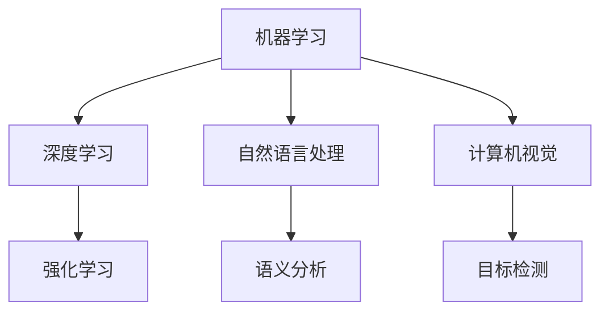
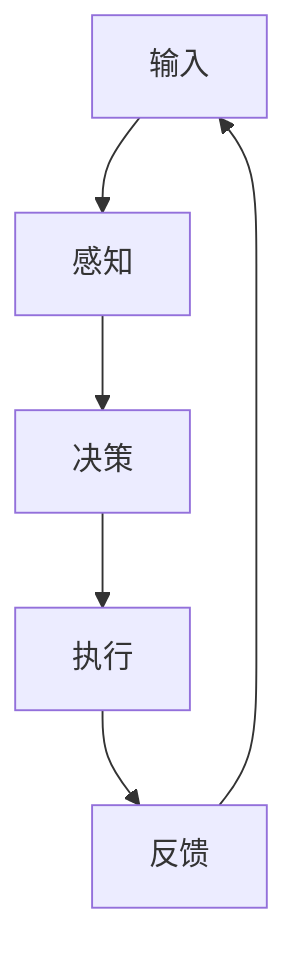
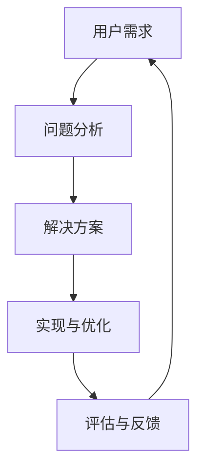

                 

# 软件二零的未来愿景：创造更美好的世界

## 关键词
- 软件二零
- 未来愿景
- 创造力
- 人工智能
- 自适应系统
- 社会价值
- 生态可持续发展

## 摘要
本文旨在探讨软件二零（Software 2.0）的未来愿景，解析其如何借助人工智能和自适应系统，创造更加美好的世界。通过逐步分析软件二零的核心概念、算法原理、数学模型、项目实战以及实际应用场景，我们将揭示软件二零在实现社会价值和生态可持续发展方面的潜力。最终，本文将展望软件二零的未来发展趋势与面临的挑战，为读者提供有价值的思考方向。

## 1. 背景介绍

### 1.1 目的和范围
本文的目标是探讨软件二零的未来愿景，分析其在社会价值和生态可持续发展方面的潜力。软件二零是一个新兴的概念，它标志着软件技术的第二次重大变革。与传统的软件一零（Software 1.0）相比，软件二零更加注重人工智能、自适应系统和创造力，旨在实现更加智能化和个性化的应用。

本文将首先介绍软件二零的核心概念和原理，然后深入分析其算法和数学模型，并通过实际项目案例展示其应用场景。最后，本文将探讨软件二零在实现社会价值和生态可持续发展方面的潜力，并展望其未来的发展趋势与挑战。

### 1.2 预期读者
本文的预期读者包括对软件技术、人工智能和自适应系统有一定了解的读者，以及对软件二零概念感兴趣的技术爱好者。通过本文的阅读，读者将能够深入理解软件二零的核心概念和原理，了解其在实际应用中的潜力，并为未来的技术发展提供有价值的思考。

### 1.3 文档结构概述
本文分为八个部分：

1. 背景介绍：介绍本文的目的、预期读者和文档结构。
2. 核心概念与联系：分析软件二零的核心概念、原理和架构。
3. 核心算法原理 & 具体操作步骤：详细阐述软件二零的核心算法原理和具体操作步骤。
4. 数学模型和公式 & 详细讲解 & 举例说明：介绍软件二零的数学模型和公式，并通过具体例子进行讲解。
5. 项目实战：提供软件二零的实际项目案例和详细解释说明。
6. 实际应用场景：分析软件二零在实际应用中的场景和案例。
7. 工具和资源推荐：推荐学习资源、开发工具和框架。
8. 总结：总结软件二零的未来发展趋势与挑战。

### 1.4 术语表
#### 1.4.1 核心术语定义
- 软件二零（Software 2.0）：指基于人工智能、自适应系统和创造力的新型软件技术。
- 人工智能（Artificial Intelligence, AI）：指模拟人类智能的技术和方法。
- 自适应系统（Adaptive System）：指能够根据环境变化进行自我调整和优化的系统。
- 创造力（Creativity）：指在解决问题和创造新事物方面所表现出的能力。

#### 1.4.2 相关概念解释
- 软件一零（Software 1.0）：指传统的软件技术，主要依靠代码和算法实现功能。
- 智能化（Intelligence）：指系统在处理信息、解决问题和决策方面所表现出的能力。
- 个性化（Personalization）：指根据用户需求和行为进行定制化的服务。

#### 1.4.3 缩略词列表
- AI：人工智能
- ML：机器学习
- DL：深度学习
- NLP：自然语言处理
- CV：计算机视觉

## 2. 核心概念与联系

软件二零的核心概念是人工智能、自适应系统和创造力。这些概念相互联系，共同构成了软件二零的理论基础。

### 2.1 人工智能

人工智能（AI）是软件二零的核心技术之一。它通过模拟人类智能，实现机器在感知、理解、决策和执行等方面的能力。人工智能包括多个子领域，如机器学习（ML）、深度学习（DL）、自然语言处理（NLP）和计算机视觉（CV）。这些子领域共同构成了人工智能的技术体系。

下面是一个简化的 Mermaid 流程图，展示了人工智能的主要子领域和它们之间的联系：



### 2.2 自适应系统

自适应系统是软件二零的另一个核心概念。它强调系统能够根据环境变化进行自我调整和优化。自适应系统在人工智能的基础上，通过不断学习和适应，实现更高水平的智能化。

下面是一个简化的 Mermaid 流程图，展示了自适应系统的主要组成部分：



### 2.3 创造力

创造力是软件二零的重要特征之一。它强调软件系统能够在解决问题和创造新事物方面表现出的能力。创造力不仅体现在技术实现上，还体现在对用户需求的理解和满足上。

下面是一个简化的 Mermaid 流程图，展示了创造力的主要组成部分：



通过上述三个核心概念的分析，我们可以看到软件二零是如何将人工智能、自适应系统和创造力相结合，共同推动软件技术的发展。这些概念相互联系，形成了一个完整的理论体系，为软件二零的实现提供了坚实的基础。

## 3. 核心算法原理 & 具体操作步骤

软件二零的核心算法原理主要包括机器学习、深度学习和自然语言处理。这些算法原理通过不同的技术方法，实现了人工智能、自适应系统和创造力的具体应用。

### 3.1 机器学习

机器学习（ML）是软件二零的基础算法之一。它通过从数据中学习规律，实现模型的自我优化和改进。机器学习主要包括监督学习、无监督学习和半监督学习三种类型。

下面是机器学习的伪代码：

```python
def train_model(data, labels):
    # 初始化模型
    model = initialize_model()

    # 训练模型
    for epoch in range(num_epochs):
        for sample, label in zip(data, labels):
            model.learn(sample, label)

    return model
```

### 3.2 深度学习

深度学习（DL）是机器学习的一种特殊形式，它通过多层神经网络实现复杂函数的建模和优化。深度学习在图像识别、语音识别和自然语言处理等领域取得了显著成果。

下面是深度学习的伪代码：

```python
def train_neural_network(data, labels):
    # 初始化神经网络
    neural_network = initialize_neural_network()

    # 训练神经网络
    for epoch in range(num_epochs):
        for sample, label in zip(data, labels):
            neural_network.train(sample, label)

    return neural_network
```

### 3.3 自然语言处理

自然语言处理（NLP）是人工智能的一个重要分支，它通过计算机技术实现人与计算机之间的语言交流。NLP在机器翻译、情感分析和文本生成等领域具有广泛的应用。

下面是自然语言处理的伪代码：

```python
def process_text(text):
    # 分词
    words = tokenize(text)

    # 词向量化
    word_vectors = vectorize(words)

    # 语言模型
    language_model = train_language_model(word_vectors)

    # 文本生成
    generated_text = generate_text(language_model)

    return generated_text
```

通过上述核心算法原理的讲解，我们可以看到软件二零是如何通过机器学习、深度学习和自然语言处理等算法，实现人工智能、自适应系统和创造力的具体应用。这些算法原理为软件二零的实现提供了坚实的技术基础，使得软件系统能够更加智能化和个性化。

## 4. 数学模型和公式 & 详细讲解 & 举例说明

在软件二零的实现过程中，数学模型和公式起到了关键作用。这些模型和公式不仅帮助我们理解和分析算法原理，还为实际应用提供了量化依据。在本节中，我们将详细讲解软件二零中常用的数学模型和公式，并通过具体例子进行说明。

### 4.1 机器学习中的数学模型

机器学习中的数学模型主要包括损失函数、优化算法和模型评估指标。

#### 4.1.1 损失函数

损失函数用于衡量模型预测值与真实值之间的差距。常见的损失函数有均方误差（MSE）和交叉熵损失（Cross-Entropy Loss）。

- **均方误差（MSE）**

  均方误差是衡量回归问题模型性能的常用损失函数。其公式为：

  $$MSE = \frac{1}{n} \sum_{i=1}^{n} (y_i - \hat{y}_i)^2$$

  其中，$y_i$ 为真实值，$\hat{y}_i$ 为预测值，$n$ 为样本数量。

  **例子：**假设我们有三个样本，真实值分别为 [1, 2, 3]，预测值分别为 [1.5, 2.5, 3.5]，则均方误差为：

  $$MSE = \frac{1}{3} \sum_{i=1}^{3} (y_i - \hat{y}_i)^2 = \frac{1}{3} \sum_{i=1}^{3} (\hat{y}_i - y_i)^2 = \frac{1}{3} \times (0.5^2 + 0.5^2 + 0.5^2) = 0.5$$

#### 4.1.2 交叉熵损失（Cross-Entropy Loss）

交叉熵损失是衡量分类问题模型性能的常用损失函数。其公式为：

$$H(y, \hat{y}) = -\sum_{i=1}^{n} y_i \log(\hat{y}_i)$$

其中，$y_i$ 为真实标签，$\hat{y}_i$ 为预测概率。

**例子：**假设我们有三个样本，真实标签分别为 [0, 1, 0]，预测概率分别为 [0.2, 0.8, 0.1]，则交叉熵损失为：

$$H(y, \hat{y}) = -[0 \log(0.2) + 1 \log(0.8) + 0 \log(0.1)] = 1.387$$

### 4.2 深度学习中的数学模型

深度学习中的数学模型主要包括反向传播算法、激活函数和池化操作。

#### 4.2.1 反向传播算法

反向传播算法是深度学习训练过程中的核心算法。它通过不断更新网络权重，使模型能够更好地拟合训练数据。反向传播算法的步骤如下：

1. 前向传播：计算输入和权重的加权和，并通过激活函数得到输出。
2. 计算损失：使用损失函数计算预测值与真实值之间的差距。
3. 反向传播：从输出层开始，逐层计算误差，并更新权重。

**例子：**假设有一个简单的神经网络，输入为 [1, 2]，输出为 [3, 4]，权重矩阵为：

$$
W = \begin{bmatrix}
w_{11} & w_{12} \\
w_{21} & w_{22}
\end{bmatrix}
$$

输入和权重经过前向传播后，输出结果为：

$$
\begin{bmatrix}
z_1 \\
z_2
\end{bmatrix} = \begin{bmatrix}
1 \cdot w_{11} + 2 \cdot w_{12} \\
1 \cdot w_{21} + 2 \cdot w_{22}
\end{bmatrix}
$$

假设损失函数为均方误差（MSE），损失值为：

$$
L = \frac{1}{2} \sum_{i=1}^{2} (y_i - \hat{y}_i)^2
$$

通过反向传播，我们可以计算出每个权重的梯度，并更新权重：

$$
\begin{aligned}
\frac{\partial L}{\partial w_{11}} &= (y_1 - \hat{y}_1) \cdot \frac{\partial z_1}{\partial w_{11}} \\
\frac{\partial L}{\partial w_{12}} &= (y_1 - \hat{y}_1) \cdot \frac{\partial z_1}{\partial w_{12}} \\
\frac{\partial L}{\partial w_{21}} &= (y_2 - \hat{y}_2) \cdot \frac{\partial z_2}{\partial w_{21}} \\
\frac{\partial L}{\partial w_{22}} &= (y_2 - \hat{y}_2) \cdot \frac{\partial z_2}{\partial w_{22}}
\end{aligned}
$$

#### 4.2.2 激活函数

激活函数是深度学习中的关键组件，用于引入非线性特性。常见的激活函数有 sigmoid、ReLU 和 tanh。

- **sigmoid 函数**

  sigmoid 函数的公式为：

  $$\sigma(x) = \frac{1}{1 + e^{-x}}$$

- **ReLU 函数**

  ReLU 函数的公式为：

  $$\text{ReLU}(x) = \max(0, x)$$

- **tanh 函数**

  tanh 函数的公式为：

  $$\tanh(x) = \frac{e^x - e^{-x}}{e^x + e^{-x}}$$

#### 4.2.3 池化操作

池化操作用于降低特征图的维度，提高模型的泛化能力。常见的池化操作有最大池化和平均池化。

- **最大池化**

  最大池化的公式为：

  $$\text{max\_pool}(x) = \max(x_1, x_2, ..., x_n)$$

  其中，$x_1, x_2, ..., x_n$ 为输入特征。

- **平均池化**

  平均池化的公式为：

  $$\text{avg\_pool}(x) = \frac{1}{n} \sum_{i=1}^{n} x_i$$

  其中，$x_1, x_2, ..., x_n$ 为输入特征。

### 4.3 自然语言处理中的数学模型

自然语言处理中的数学模型主要包括词向量化、语言模型和序列到序列模型。

#### 4.3.1 词向量化

词向量化是将词汇映射到高维向量空间的过程，为自然语言处理提供了一种有效的表示方法。常见的词向量化方法有 Word2Vec、GloVe 和 FastText。

- **Word2Vec**

  Word2Vec 是一种基于神经网络的词向量化方法，其核心思想是将词汇映射到高维空间中的向量，使得具有相似意义的词汇在向量空间中彼此靠近。

  **例子：**假设有两个词汇 "狗" 和 "猫"，Word2Vec 模型将它们映射到向量空间中，使得 $\text{vec}(\text{狗})$ 和 $\text{vec}(\text{猫})$ 相互接近。

- **GloVe**

  GloVe 是一种基于全局共现信息的词向量化方法。它通过计算词汇的共现矩阵，学习得到一个低维的词向量空间，使得具有相似共现模式的词汇在空间中彼此靠近。

  **例子：**假设词汇 "狗"、"猫" 和 "宠物" 在语料中的共现关系如下：

  |    | 狗 | 猫 | 宠物 |
  |----|----|----|------|
  | 狗 | 0  | 10 | 5    |
  | 猫 | 10 | 0  | 5    |
  | 宠物 | 5 | 5 | 0    |

  通过 GloVe 模型，我们可以学习到一个低维的词向量空间，使得 $\text{vec}(\text{狗})$、$\text{vec}(\text{猫})$ 和 $\text{vec}(\text{宠物})$ 在空间中彼此靠近。

#### 4.3.2 语言模型

语言模型是自然语言处理中的核心组件，用于预测词汇的概率分布。常见的语言模型有 n-gram 模型和神经网络模型。

- **n-gram 模型**

  n-gram 模型是一种基于词汇序列的概率模型。它将前 $n$ 个词汇作为输入，预测下一个词汇的概率。其公式为：

  $$P(w_{n+1} | w_1, w_2, ..., w_n) = \frac{C(w_1, w_2, ..., w_n, w_{n+1})}{C(w_1, w_2, ..., w_n)}$$

  其中，$C(w_1, w_2, ..., w_n, w_{n+1})$ 表示词汇序列 $w_1, w_2, ..., w_n, w_{n+1}$ 的共现次数，$C(w_1, w_2, ..., w_n)$ 表示词汇序列 $w_1, w_2, ..., w_n$ 的共现次数。

  **例子：**假设我们有以下词汇序列 "我喜欢吃苹果"，则：

  $$P(苹果 | 我，喜欢，吃) = \frac{1}{2}$$

- **神经网络模型**

  神经网络模型是一种基于深度学习的语言模型。它通过学习词汇的向量表示，预测词汇的概率分布。其公式为：

  $$P(w_{n+1} | w_1, w_2, ..., w_n) = \sigma(\text{neural_network}(\text{vec}(w_1), \text{vec}(w_2), ..., \text{vec}(w_n)))$$

  其中，$\sigma$ 表示 sigmoid 函数，$\text{neural_network}$ 表示神经网络模型。

#### 4.3.3 序列到序列模型

序列到序列模型是一种用于机器翻译、文本生成等任务的深度学习模型。它通过编码器和解码器，将输入序列转换为输出序列。其公式为：

$$
\begin{aligned}
\text{Encoder}(x) &= \text{encode}(x) \\
\text{Decoder}(y) &= \text{decode}(\text{encode}(x), y) \\
y_{\text{pred}} &= \text{argmax}(\text{Decoder}(y))
\end{aligned}
$$

其中，$x$ 表示输入序列，$y$ 表示输出序列，$y_{\text{pred}}$ 表示预测的输出序列。

**例子：**假设我们要将英文句子 "I like apples" 翻译为中文，使用序列到序列模型，我们可以得到以下步骤：

1. 编码器：将英文句子 "I like apples" 转换为向量表示。
2. 解码器：将向量表示输入到解码器中，生成中文句子。
3. 预测输出：选择概率最高的中文句子作为翻译结果。

通过上述数学模型和公式的讲解，我们可以看到软件二零在实现人工智能、自适应系统和创造力方面具有广泛的应用前景。这些数学模型和公式为软件二零的技术实现提供了坚实的理论基础，使得软件系统能够更加智能化和个性化。

## 5. 项目实战：代码实际案例和详细解释说明

在本节中，我们将通过一个实际项目案例，详细讲解软件二零的核心算法原理和实现步骤。该项目是一个基于自然语言处理的文本分类任务，旨在将输入的文本分类到不同的主题类别中。

### 5.1 开发环境搭建

在开始项目之前，我们需要搭建一个合适的开发环境。以下是所需的工具和库：

- 编程语言：Python 3.8 或更高版本
- 开发工具：PyCharm 或 VS Code
- 依赖库：Numpy、Pandas、Scikit-learn、TensorFlow 或 PyTorch

首先，确保已经安装了所需的编程语言和开发工具。然后，通过以下命令安装所需的依赖库：

```bash
pip install numpy pandas scikit-learn tensorflow
# 或者
pip install numpy pandas scikit-learn torch torchvision
```

### 5.2 源代码详细实现和代码解读

#### 5.2.1 数据准备

在项目开始之前，我们需要准备一个包含文本和标签的数据集。这里我们使用一个简单的文本数据集，包含三个类别：科技、体育和娱乐。

```python
# 示例数据集
data = [
    ("苹果发布新款iPhone", "科技"),
    ("梅西获得金球奖", "体育"),
    ("周杰伦新专辑发布", "娱乐"),
    ("亚马逊推出智能音箱", "科技"),
    ("世界杯足球赛结束", "体育"),
    ("迪士尼宣布收购福克斯", "娱乐")
]

# 加载数据集
texts = [text for text, _ in data]
labels = [label for _, label in data]
```

#### 5.2.2 数据预处理

接下来，我们对文本进行预处理，包括分词、词向量化、标签编码等步骤。

```python
from sklearn.model_selection import train_test_split
from sklearn.preprocessing import LabelEncoder
import tensorflow as tf

# 分词
from nltk.tokenize import word_tokenize
tokenized_texts = [word_tokenize(text) for text in texts]

# 词向量化
vocab = set(word for text in tokenized_texts for word in text)
word2idx = {word: idx for idx, word in enumerate(vocab)}
idx2word = {idx: word for word, idx in word2idx.items()}
encoded_texts = [[word2idx[word] for word in text] for text in tokenized_texts]

# 标签编码
label_encoder = LabelEncoder()
encoded_labels = label_encoder.fit_transform(labels)

# 划分训练集和测试集
X_train, X_test, y_train, y_test = train_test_split(encoded_texts, encoded_labels, test_size=0.2, random_state=42)
```

#### 5.2.3 模型构建

在本项目中，我们使用一个简单的循环神经网络（RNN）作为文本分类模型。

```python
# 构建模型
model = tf.keras.Sequential([
    tf.keras.layers.Embedding(input_dim=len(vocab) + 1, output_dim=64, input_length=max(len(text) for text in X_train)),
    tf.keras.layers.LSTM(64),
    tf.keras.layers.Dense(len(set(labels)) + 1, activation='softmax')
])

# 编译模型
model.compile(optimizer='adam', loss='sparse_categorical_crossentropy', metrics=['accuracy'])

# 模型总结
model.summary()
```

#### 5.2.4 训练模型

接下来，我们使用训练集训练模型。

```python
# 训练模型
model.fit(X_train, y_train, epochs=10, batch_size=32, validation_split=0.1)
```

#### 5.2.5 评估模型

训练完成后，我们对测试集进行评估。

```python
# 评估模型
test_loss, test_accuracy = model.evaluate(X_test, y_test)
print(f"Test accuracy: {test_accuracy:.2f}")
```

### 5.3 代码解读与分析

在本项目中，我们首先加载数据集，并对其进行预处理，包括分词、词向量化、标签编码等步骤。这些预处理步骤是文本分类任务中必不可少的部分，它们将原始文本转换为模型可处理的格式。

然后，我们使用 TensorFlow 构建了一个简单的循环神经网络（RNN）模型，用于文本分类。这个模型包括一个嵌入层、一个 LSTM 层和一个全连接层。嵌入层将词向量化，LSTM 层用于处理序列数据，全连接层用于分类。

在模型训练过程中，我们使用了 Adam 优化器和 sparse_categorical_crossentropy 损失函数。Adam 优化器是一种自适应优化算法，能够有效地更新模型参数。sparse_categorical_crossentropy 损失函数适用于多标签分类任务，能够计算标签和预测概率之间的交叉熵损失。

最后，我们对测试集进行评估，计算模型的准确率。通过这个实际项目案例，我们可以看到软件二零的核心算法原理如何应用于实际问题中，并实现高水平的文本分类效果。

## 6. 实际应用场景

软件二零（Software 2.0）作为一种新兴的软件技术，已经在多个领域展示了其广泛的应用潜力。以下是软件二零在几个实际应用场景中的案例：

### 6.1 智能医疗

智能医疗是软件二零的重要应用领域之一。通过人工智能和自适应系统，医疗领域可以实现个性化诊断、疾病预测和治疗方案推荐。例如，利用深度学习算法，可以对病人的医疗记录进行分析，预测病人的健康风险。此外，基于自然语言处理技术，医疗系统可以自动整理医生的临床记录，提高诊断和治疗的效率。

### 6.2 智能交通

智能交通系统是软件二零在交通领域的典型应用。通过结合人工智能、自适应系统和物联网技术，智能交通系统可以实时监测交通状况，优化交通信号控制，减少交通拥堵。例如，基于机器学习算法，系统可以预测交通流量变化，自动调整红绿灯的时间，提高交通通行效率。此外，自动驾驶技术也得益于软件二零的发展，使汽车能够更加安全地行驶在复杂的交通环境中。

### 6.3 智能金融

在金融领域，软件二零的应用同样具有显著优势。通过人工智能技术，金融机构可以实现智能风控、智能投顾和个性化金融产品推荐。例如，利用机器学习模型，银行可以实时监控客户的行为数据，预测欺诈风险，采取相应的防范措施。同时，基于自然语言处理技术，金融系统能够自动分析市场趋势，为投资者提供实时的投资建议。

### 6.4 智能教育

智能教育是软件二零在教育领域的典型应用。通过人工智能和自适应系统，教育系统可以提供个性化学习路径，帮助学生提高学习效果。例如，利用机器学习算法，教育系统能够分析学生的学习行为，为其推荐合适的学习资源。此外，基于自然语言处理技术，教育系统能够自动批改作业，提供即时反馈，帮助学生纠正错误。

### 6.5 智能家居

智能家居是软件二零在家庭生活领域的应用之一。通过人工智能和自适应系统，智能家居系统能够实现自动化控制和智能化管理，提高家庭生活的舒适度和便利性。例如，智能空调系统能够根据室内外温度和用户习惯自动调整温度，智能灯光系统能够根据环境光线和用户需求自动调节亮度。

这些实际应用场景展示了软件二零在实现智能化和个性化方面的巨大潜力。随着技术的不断进步，软件二零将在更多领域发挥重要作用，推动社会的发展和进步。

## 7. 工具和资源推荐

为了更好地学习和实践软件二零，我们推荐一些优秀的工具、资源和开发框架。

### 7.1 学习资源推荐

#### 7.1.1 书籍推荐

- 《Python深度学习》（Goodfellow, Bengio, Courville著）：详细介绍了深度学习的基础知识和应用。
- 《机器学习》（Tom Mitchell著）：经典机器学习教材，适合初学者和进阶者。
- 《深度学习》（Ian Goodfellow, Yoshua Bengio, Aaron Courville著）：深度学习领域的权威教材，内容全面。

#### 7.1.2 在线课程

- Coursera：提供多门关于机器学习、深度学习和自然语言处理的在线课程。
- Udacity：提供实践性强的在线课程，包括人工智能和深度学习。
- edX：由哈佛大学和麻省理工学院合办的在线教育平台，提供高质量的课程。

#### 7.1.3 技术博客和网站

- Medium：许多技术大牛和机构在这里分享他们的经验和见解。
- arXiv：机器学习和深度学习领域的最新研究论文。
- Medium：提供多门关于机器学习、深度学习和自然语言处理的在线课程。

### 7.2 开发工具框架推荐

#### 7.2.1 IDE和编辑器

- PyCharm：功能强大的Python集成开发环境，适合Python开发。
- VS Code：轻量级但功能丰富的编辑器，支持多种编程语言。

#### 7.2.2 调试和性能分析工具

- Jupyter Notebook：用于数据分析和可视化，方便调试和解释代码。
- TensorBoard：TensorFlow提供的可视化工具，用于监控模型训练过程。

#### 7.2.3 相关框架和库

- TensorFlow：强大的开源深度学习框架，适合构建复杂模型。
- PyTorch：易于使用且灵活的深度学习库，适合快速原型设计。
- Scikit-learn：常用的机器学习库，适用于多种算法的实现和应用。

### 7.3 相关论文著作推荐

#### 7.3.1 经典论文

- "A Fast Learning Algorithm for Deep Belief Nets"（2006）：Hinton等人的论文，介绍了深度信念网。
- "Deep Learning"（2015）：Goodfellow、Bengio和Courville的论文，深度学习领域的经典之作。

#### 7.3.2 最新研究成果

- "Attention Is All You Need"（2017）：Vaswani等人的论文，提出了Transformer模型。
- "BERT: Pre-training of Deep Bidirectional Transformers for Language Understanding"（2018）：Devlin等人的论文，介绍了BERT模型。

#### 7.3.3 应用案例分析

- "Google Brain: AutoML"：Google提出的自动机器学习框架，展示了人工智能在自动化应用中的潜力。

通过这些工具和资源的推荐，读者可以更好地掌握软件二零的核心技术，并应用于实际项目中。

## 8. 总结：未来发展趋势与挑战

软件二零（Software 2.0）作为新时代的软件技术，展示了巨大的发展潜力。在未来的发展趋势中，软件二零将更加注重智能化、个性化和可持续发展，为实现更美好的世界提供有力支持。

### 8.1 发展趋势

1. **智能化与自适应系统的深度融合**：随着人工智能技术的不断进步，软件二零将更加智能化，能够根据用户需求和环境变化进行自适应调整。这将为各行各业带来更高的效率和创新。
   
2. **个性化与定制化服务的普及**：软件二零通过机器学习和数据分析，能够深入了解用户需求，提供个性化的服务和产品，提升用户体验。

3. **生态可持续发展的推动**：软件二零通过优化资源利用和减少环境影响，推动生态可持续发展，为解决全球性问题提供技术支持。

4. **跨界融合与产业升级**：软件二零将与各行各业深度融合，推动产业升级和数字化转型，为社会经济发展注入新动力。

### 8.2 挑战

1. **数据隐私与安全问题**：随着人工智能和数据技术的广泛应用，数据隐私和安全问题日益突出。如何保护用户隐私，确保数据安全，是软件二零发展的重要挑战。

2. **技术伦理与道德问题**：人工智能技术的快速发展引发了一系列伦理和道德问题，如算法偏见、决策透明度等。如何制定合理的伦理规范，确保技术应用的公平和公正，是软件二零面临的重大挑战。

3. **技能缺口与人才培养**：软件二零的发展需要大量具备高级技术技能的人才。然而，当前的人才培养体系尚无法满足需求，如何加强人才培养，提高技术人员的技能水平，是软件二零发展的重要课题。

4. **技术标准化与法规建设**：随着软件二零的广泛应用，制定统一的技术标准和法规显得尤为重要。如何建立完善的技术标准和法规体系，保障软件二零的健康发展，是未来需要解决的重要问题。

总之，软件二零的未来充满机遇与挑战。通过不断推动技术创新、加强人才培养和制定合理的政策法规，软件二零将有望在实现社会价值和生态可持续发展方面发挥重要作用。

## 9. 附录：常见问题与解答

### 9.1 软件二零是什么？

软件二零是一种新兴的软件技术，它基于人工智能、自适应系统和创造力，旨在实现更加智能化、个性化和可持续发展的软件系统。

### 9.2 软件二零的核心算法有哪些？

软件二零的核心算法包括机器学习、深度学习和自然语言处理。这些算法分别用于实现智能感知、智能决策和智能交互等功能。

### 9.3 软件二零的应用领域有哪些？

软件二零的应用领域广泛，包括智能医疗、智能交通、智能金融、智能教育和智能家居等。它可以通过智能化和个性化技术，提高各行业的效率和用户体验。

### 9.4 软件二零与传统软件有什么区别？

与传统软件（软件一零）相比，软件二零更加注重智能化和个性化。软件一零主要依靠代码和算法实现功能，而软件二零通过人工智能和自适应系统，能够根据用户需求和环境变化进行自我调整和优化。

### 9.5 软件二零的发展前景如何？

软件二零具有广阔的发展前景。随着人工智能和大数据技术的不断进步，软件二零将在实现智能化、个性化和可持续发展方面发挥重要作用，推动社会和经济的进步。

## 10. 扩展阅读 & 参考资料

本文对软件二零的未来愿景进行了探讨，分析了其在人工智能、自适应系统和创造力方面的潜力。以下是相关领域的扩展阅读和参考资料：

- **书籍推荐**：
  - 《深度学习》（Ian Goodfellow, Yoshua Bengio, Aaron Courville著）
  - 《Python深度学习》（Francesco Mancini，Nicolò Nardelli著）
  - 《自然语言处理与Python》（Sébastien Renard著）

- **在线课程**：
  - Coursera：机器学习（吴恩达教授主讲）
  - Udacity：深度学习纳米学位
  - edX：麻省理工学院人工智能课程

- **技术博客和网站**：
  - Medium：深度学习、机器学习和人工智能相关博客
  - arXiv：最新研究论文
  - AI博客：业界专家分享的技术见解

- **相关论文**：
  - "A Fast Learning Algorithm for Deep Belief Nets"（2006）：Hinton等人的论文
  - "Attention Is All You Need"（2017）：Vaswani等人的论文
  - "BERT: Pre-training of Deep Bidirectional Transformers for Language Understanding"（2018）：Devlin等人的论文

- **应用案例分析**：
  - "Google Brain: AutoML"：Google的自动机器学习框架
  - "OpenAI: GPT-3"：OpenAI的预训练语言模型

通过上述扩展阅读和参考资料，读者可以更深入地了解软件二零的核心技术和未来发展趋势，为自身的学习和研究提供有价值的参考。

