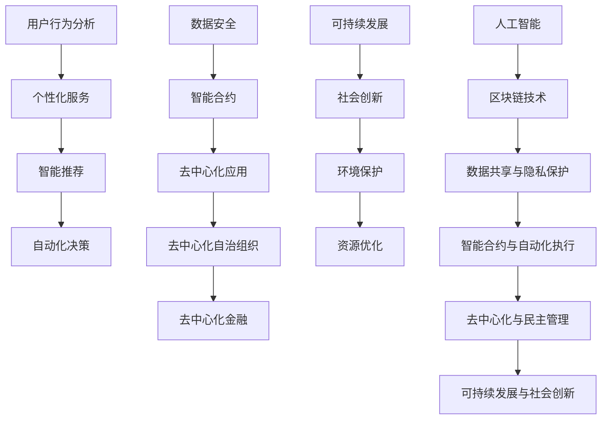

                 

# 软件2.0的未来愿景：创造更美好的世界

> **关键词**：软件2.0、未来愿景、人工智能、区块链、去中心化、可持续发展、社会创新
> 
> **摘要**：本文将探讨软件2.0的概念及其对未来社会的影响。我们将深入分析软件2.0的核心原则、技术架构以及如何通过这种新兴模式实现更美好的世界。文章分为多个部分，包括背景介绍、核心概念与联系、核心算法原理、数学模型与公式、项目实战、实际应用场景、工具和资源推荐，以及总结和未来发展趋势与挑战。通过本文的详细探讨，希望读者能对软件2.0有更深刻的理解，并思考其在创造美好世界中的潜在力量。

## 1. 背景介绍

### 1.1 目的和范围

本文旨在介绍软件2.0的概念、核心原则、技术架构及其对未来社会的影响。软件2.0是一个新兴的概念，它代表着软件发展的新阶段，即从传统的、以企业为中心的软件开发模式，转向以用户为中心、去中心化、高度自适应和智能化的软件开发模式。

本文将首先介绍软件2.0的起源和核心原则，然后深入探讨其技术架构，包括人工智能、区块链、去中心化技术等。接下来，我们将通过实际项目案例，展示如何将软件2.0的理念应用于实际开发中。最后，我们将讨论软件2.0在实际应用场景中的潜力，并推荐相关工具和资源。

### 1.2 预期读者

本文适合对软件工程、人工智能、区块链技术感兴趣的读者。无论您是专业的软件开发人员，还是对技术发展有浓厚兴趣的普通读者，本文都将为您提供丰富的知识和深刻的见解。

### 1.3 文档结构概述

本文分为十个部分：

1. 背景介绍
   - 目的和范围
   - 预期读者
   - 文档结构概述
2. 核心概念与联系
3. 核心算法原理 & 具体操作步骤
4. 数学模型和公式 & 详细讲解 & 举例说明
5. 项目实战：代码实际案例和详细解释说明
6. 实际应用场景
7. 工具和资源推荐
   - 学习资源推荐
   - 开发工具框架推荐
   - 相关论文著作推荐
8. 总结：未来发展趋势与挑战
9. 附录：常见问题与解答
10. 扩展阅读 & 参考资料

### 1.4 术语表

#### 1.4.1 核心术语定义

- **软件2.0**：一种新型的软件开发模式，以用户为中心，去中心化、高度自适应和智能化。
- **人工智能**：一种模拟人类智能的技术，通过机器学习和深度学习算法，使计算机能够自主学习和决策。
- **区块链**：一种分布式数据库技术，通过加密和共识算法，实现数据的不可篡改和安全传输。
- **去中心化**：一种组织形式，通过去中心化技术，实现权力的分散和去中心化。
- **可持续发展**：一种发展模式，以满足当前需求为前提，不损害子孙后代满足自身需求的能力。
- **社会创新**：一种创新模式，通过技术创新和社会变革，解决社会问题，促进社会进步。

#### 1.4.2 相关概念解释

- **智能合约**：一种自动执行的合同，基于区块链技术，可以在无需第三方介入的情况下，实现合同的自动执行。
- **共识算法**：一种分布式系统中的算法，用于达成一致意见，确保系统的稳定运行。
- **物联网（IoT）**：一种将物理设备通过网络连接的技术，实现设备之间的互联互通。

#### 1.4.3 缩略词列表

- **AI**：人工智能
- **Blockchain**：区块链
- **IoT**：物联网
- **DeFi**：去中心化金融
- **DAO**：去中心化自治组织

## 2. 核心概念与联系

为了更好地理解软件2.0，我们需要先了解一些核心概念和技术架构。以下是软件2.0的核心概念与联系：

### 2.1 人工智能

人工智能是软件2.0的核心技术之一。它通过机器学习和深度学习算法，使计算机能够模拟人类智能，实现自我学习和决策。在软件2.0中，人工智能主要用于以下几个方面：

- **用户行为分析**：通过对用户行为数据的分析，了解用户需求，提供个性化服务。
- **智能推荐**：利用人工智能算法，为用户提供个性化的推荐服务，提高用户满意度。
- **自动化决策**：通过人工智能算法，自动化处理复杂的业务流程，提高效率。

### 2.2 区块链

区块链是软件2.0的另一个核心技术。它通过加密和共识算法，实现数据的不可篡改和安全传输。在软件2.0中，区块链主要用于以下几个方面：

- **数据安全**：通过区块链技术，确保数据的安全性和完整性。
- **智能合约**：利用区块链技术，实现自动执行的智能合约，提高交易效率。
- **去中心化**：通过区块链技术，实现权力的分散，去中心化组织。

### 2.3 去中心化

去中心化是软件2.0的核心原则之一。它通过去中心化技术，实现权力的分散和去中心化组织。在软件2.0中，去中心化主要用于以下几个方面：

- **去中心化应用（DApp）**：通过区块链技术，实现去中心化应用，提高应用的透明度和安全性。
- **去中心化自治组织（DAO）**：通过区块链技术，实现去中心化自治组织，实现民主管理和决策。
- **去中心化金融（DeFi）**：通过区块链技术，实现去中心化金融，提高金融服务的效率和安全性。

### 2.4 可持续发展和社会创新

可持续发展和社会创新是软件2.0的目标之一。通过软件2.0的技术和理念，可以实现以下目标：

- **可持续发展**：通过优化资源利用和减少环境污染，实现可持续发展。
- **社会创新**：通过技术创新和社会变革，解决社会问题，促进社会进步。

### 2.5 人工智能与区块链的联系

人工智能和区块链技术在软件2.0中发挥着重要作用，它们之间也存在紧密的联系：

- **数据共享与隐私保护**：区块链技术可以保护用户数据的安全性和隐私，而人工智能可以分析这些数据，为用户提供更好的服务。
- **智能合约与自动化执行**：区块链技术可以实现智能合约的自动化执行，而人工智能可以优化合约的执行流程，提高效率。
- **去中心化与民主管理**：区块链技术可以实现去中心化组织，而人工智能可以优化组织的决策过程，实现民主管理。

### 2.6 Mermaid流程图

以下是软件2.0的核心概念与联系的Mermaid流程图：



通过以上流程图，我们可以清晰地看到软件2.0的核心概念与联系，以及它们如何相互促进，共同实现更美好的世界。

## 3. 核心算法原理 & 具体操作步骤

在理解了软件2.0的核心概念和联系后，接下来我们将深入探讨其核心算法原理和具体操作步骤。以下是软件2.0的核心算法原理和具体操作步骤：

### 3.1 人工智能算法

人工智能算法是软件2.0的核心技术之一，主要包括以下几种：

- **机器学习算法**：通过训练模型，使计算机能够从数据中自动学习，提高决策能力。常见的机器学习算法有线性回归、决策树、支持向量机等。
- **深度学习算法**：基于多层神经网络，通过模拟人脑神经元的工作方式，实现自动学习和决策。常见的深度学习算法有卷积神经网络（CNN）、循环神经网络（RNN）、生成对抗网络（GAN）等。

#### 3.1.1 具体操作步骤

1. **数据收集与预处理**：收集相关的数据，并进行数据清洗、去噪、归一化等预处理操作。
2. **模型选择与训练**：根据问题的需求，选择合适的机器学习或深度学习算法，并对其进行训练。
3. **模型评估与优化**：通过验证集或测试集，评估模型的性能，并进行优化调整。
4. **模型部署与应用**：将训练好的模型部署到生产环境中，实现自动化学习和决策。

#### 3.1.2 伪代码示例

以下是一个简单的机器学习算法（线性回归）的伪代码示例：

```python
# 数据预处理
X = 数据清洗和归一化
y = 数据清洗和归一化

# 模型选择
model = 线性回归模型()

# 模型训练
model.fit(X, y)

# 模型评估
score = model.score(X, y)

# 模型优化
model.optimize(score)

# 模型部署
model.deploy()
```

### 3.2 区块链算法

区块链算法主要包括以下几种：

- **加密算法**：用于保护数据的隐私和安全。常见的加密算法有对称加密、非对称加密、哈希算法等。
- **共识算法**：用于确保区块链网络的稳定运行。常见的共识算法有工作量证明（PoW）、权益证明（PoS）、委托权益证明（DPoS）等。

#### 3.2.1 具体操作步骤

1. **数据加密**：使用加密算法，对数据进行加密，确保数据在传输和存储过程中的安全性。
2. **数据存储**：将加密后的数据存储在区块链上，确保数据的不可篡改性和可追溯性。
3. **共识达成**：通过共识算法，确保区块链网络中的节点达成一致意见，实现分布式共识。
4. **智能合约执行**：通过智能合约，实现自动化执行，提高交易效率。

#### 3.2.2 伪代码示例

以下是一个简单的区块链算法（加密算法）的伪代码示例：

```python
# 数据加密
encrypted_data = 加密算法(明文数据)

# 数据存储
blockchain.add_block(encrypted_data)

# 共识达成
blockchain.consensus()

# 智能合约执行
contract.execute()
```

### 3.3 去中心化算法

去中心化算法主要包括以下几种：

- **去中心化身份验证**：通过分布式身份验证系统，确保用户身份的匿名性和安全性。
- **去中心化存储**：通过分布式存储系统，实现数据的高效存储和共享。
- **去中心化治理**：通过去中心化自治组织（DAO），实现民主管理和决策。

#### 3.3.1 具体操作步骤

1. **身份验证**：使用去中心化身份验证系统，确保用户身份的匿名性和安全性。
2. **数据存储**：使用分布式存储系统，实现数据的高效存储和共享。
3. **治理决策**：通过去中心化自治组织（DAO），实现民主管理和决策。

#### 3.3.2 伪代码示例

以下是一个简单的去中心化算法（去中心化身份验证）的伪代码示例：

```python
# 身份验证
identity = 身份验证系统验证(用户凭证)

# 数据存储
storage = 分布式存储系统存储(数据)

# 治理决策
decision = DAO投票决定(治理议题)
```

通过以上核心算法原理和具体操作步骤，我们可以更好地理解软件2.0的技术架构和工作原理，为其在未来创造更美好的世界提供有力支持。

## 4. 数学模型和公式 & 详细讲解 & 举例说明

在软件2.0的技术体系中，数学模型和公式起到了至关重要的作用。它们不仅为算法的优化和实现提供了理论支持，还为数据分析和系统性能评估提供了精确的工具。以下我们将详细讲解软件2.0中几个关键数学模型和公式，并通过实例说明其应用。

### 4.1 机器学习中的线性回归模型

线性回归模型是一种最常见的机器学习算法，用于预测连续值。其基本公式为：

\[ y = \beta_0 + \beta_1 \cdot x + \epsilon \]

其中：
- \( y \) 为预测值；
- \( x \) 为输入特征；
- \( \beta_0 \) 为截距；
- \( \beta_1 \) 为斜率；
- \( \epsilon \) 为误差项。

#### 详细讲解

线性回归模型的目的是找到最佳拟合直线，使预测值 \( y \) 与实际值尽可能接近。通过最小化误差平方和，我们可以计算出最佳拟合直线的参数：

\[ \min_{\beta_0, \beta_1} \sum_{i=1}^{n} (y_i - (\beta_0 + \beta_1 \cdot x_i))^2 \]

其中，\( n \) 是样本数量。

#### 举例说明

假设我们要预测房价，输入特征为房屋面积。我们有以下数据集：

| 房屋面积 (x) | 房价 (y) |
| :---: | :---: |
| 100 | 200000 |
| 150 | 300000 |
| 200 | 400000 |

我们可以使用线性回归模型来预测新房屋的房价。首先，我们计算截距和斜率：

\[ \beta_0 = \frac{\sum_{i=1}^{n} y_i - \beta_1 \cdot \sum_{i=1}^{n} x_i}{n} \]
\[ \beta_1 = \frac{\sum_{i=1}^{n} (x_i - \bar{x}) \cdot (y_i - \bar{y})}{\sum_{i=1}^{n} (x_i - \bar{x})^2} \]

其中，\( \bar{x} \) 和 \( \bar{y} \) 分别为房屋面积和房价的平均值。

计算后得到：

\[ \beta_0 = 100000 \]
\[ \beta_1 = 1000 \]

因此，线性回归模型为：

\[ y = 100000 + 1000 \cdot x \]

当输入新的房屋面积 120 时，预测房价为：

\[ y = 100000 + 1000 \cdot 120 = 220000 \]

### 4.2 深度学习中的卷积神经网络（CNN）

卷积神经网络是一种专门用于图像识别和处理的深度学习模型。其核心公式为：

\[ \text{Output} = \text{ReLU}(\text{Weight} \cdot \text{Input} + \text{Bias}) \]

其中：
- **ReLU**（Rectified Linear Unit）：激活函数，将负值设置为0，保持正值不变。
- **Weight**：权重矩阵。
- **Input**：输入特征。
- **Bias**：偏置项。

#### 详细讲解

卷积神经网络通过多个卷积层、池化层和全连接层，逐层提取图像的特征。卷积层通过权重矩阵与输入特征进行卷积操作，提取局部特征；池化层用于减少数据维度，提高模型的泛化能力。

#### 举例说明

假设一个简单的卷积神经网络包含一个卷积层和一个全连接层，输入图像为 3x3 像素。权重矩阵为 3x3，初始化为随机值。偏置项为0。输入特征为：

\[ \text{Input} = \begin{bmatrix} 1 & 0 & 1 \\ 1 & 1 & 1 \\ 0 & 1 & 0 \end{bmatrix} \]

权重矩阵为：

\[ \text{Weight} = \begin{bmatrix} 0.1 & 0.2 & 0.3 \\ 0.4 & 0.5 & 0.6 \\ 0.7 & 0.8 & 0.9 \end{bmatrix} \]

卷积操作：

\[ \text{Output} = \text{ReLU}(\text{Weight} \cdot \text{Input} + \text{Bias}) \]
\[ \text{Output} = \text{ReLU} \begin{bmatrix} 0.7 & 1.1 & 1.6 \\ 1.4 & 1.6 & 1.9 \\ 0.7 & 1.1 & 0.6 \end{bmatrix} \]
\[ \text{Output} = \begin{bmatrix} 0.7 & 1.1 & 1.6 \\ 1.4 & 1.6 & 1.9 \\ 0.7 & 1.1 & 0.6 \end{bmatrix} \]

### 4.3 区块链中的共识算法

区块链中的共识算法用于确保网络中的节点达成一致意见，常见的共识算法有工作量证明（PoW）、权益证明（PoS）等。

#### 工作量证明（PoW）

工作量证明的基本公式为：

\[ \text{Proof of Work} = \text{find } x \text{ such that } H(x) \leq \text{target} \]

其中：
- \( H(x) \) 为哈希函数；
- \( x \) 为随机数；
- \( \text{target} \) 为目标值。

#### 详细讲解

节点需要通过计算找到一个随机数 \( x \)，使得哈希值 \( H(x) \) 小于等于目标值。这个过程称为“挖矿”。找到合适的 \( x \) 后，节点将生成一个新的区块，并将其添加到区块链中。

#### 举例说明

假设目标值为 \( \text{target} = 100 \)。我们需要找到一个 \( x \)，使得 \( H(x) \) 小于等于 100。

通过尝试不同的 \( x \) 值，我们最终找到一个合适的 \( x = 50 \)，使得 \( H(50) = 50 \)，满足条件。

\[ \text{Proof of Work} = 50 \]

### 4.4 去中心化治理中的投票模型

去中心化治理中的投票模型用于决策和治理。基本的投票模型公式为：

\[ \text{Result} = \text{calculate } \text{winning candidate} \]

其中：
- **Winning Candidate**：获胜候选人。

#### 详细讲解

投票模型通过计算每个候选人的得票数，确定获胜候选人。常见的投票方法有简单多数、相对多数等。

#### 举例说明

假设有 5 个候选人，得票数如下：

| 候选人 | 得票数 |
| :---: | :---: |
| A | 30 |
| B | 20 |
| C | 25 |
| D | 15 |
| E | 10 |

简单多数投票模型中，得票数最多的候选人获胜。因此，候选人 A 获胜。

\[ \text{Result} = A \]

通过以上数学模型和公式的详细讲解和举例说明，我们可以更好地理解软件2.0的技术原理和实现方法，为未来的发展提供有力支持。

## 5. 项目实战：代码实际案例和详细解释说明

为了更好地展示软件2.0在实际开发中的应用，我们将通过一个实际项目案例进行详细解释说明。本案例将展示如何使用Python实现一个基于区块链的简单去中心化投票系统。

### 5.1 开发环境搭建

在开始编写代码之前，我们需要搭建一个合适的开发环境。以下是所需的开发工具和库：

- **Python 3.8 或更高版本**
- **Python虚拟环境（virtualenv）**
- **Flask框架**
- **PyQt5图形用户界面库**
- **web3.py库（用于以太坊区块链交互）**

安装步骤如下：

1. 安装Python 3.8及以上版本。
2. 安装virtualenv：

   ```bash
   pip install virtualenv
   ```

3. 创建一个虚拟环境并激活：

   ```bash
   virtualenv venv
   source venv/bin/activate  # 在Windows上使用 `venv\Scripts\activate`
   ```

4. 安装所需的库：

   ```bash
   pip install flask
   pip install PyQt5
   pip install web3
   ```

### 5.2 源代码详细实现和代码解读

以下是去中心化投票系统的源代码，我们将逐段进行解读。

```python
from flask import Flask, render_template, request
from PyQt5 import QtWidgets, QApplication
import json
import web3

app = Flask(__name__)

# 配置以太坊节点
w3 = web3.Web3(web3.HTTPProvider('https://mainnet.infura.io/v3/your_project_id'))

# 部署智能合约
with open('voting_contract.sol', 'r') as file:
    contract_source = file.read()

# 编译智能合约
compiled_sol = w3.compileLLL(contract_source)
bytecode = compiled_sol['<stdin>:VotingContract']['bin']

# 部署合约
contract = w3.eth.contract(abi=compiled_sol['<stdin>:VotingContract']['abi'], bytecode=bytecode)
tx_hash = contract.deploy().transact({'from': w3.eth.coinbase, 'gas': 5000000})
tx_receipt = w3.eth.waitForTransactionReceipt(tx_hash)

# 获取合约地址
contract_address = tx_receipt.contractAddress

# 投票函数
@app.route('/vote', methods=['POST'])
def vote():
    candidate = request.form['candidate']
    voter_address = request.form['voter_address']

    # 与合约交互
    contract_instance = w3.eth.contract(address=contract_address, abi=compiled_sol['<stdin>:VotingContract']['abi'])
    tx_hash = contract_instance.functions.vote(candidate).transact({'from': voter_address, 'gas': 500000})
    tx_receipt = w3.eth.waitForTransactionReceipt(tx_hash)

    return render_template('vote_success.html')

# 查看结果
@app.route('/results')
def results():
    contract_instance = w3.eth.contract(address=contract_address, abi=compiled_sol['<stdin>:VotingContract']['abi'])
    candidates = contract_instance.functions.candidates().call()
    votes = contract_instance.functions.votesFor(candidates).call()

    return render_template('results.html', candidates=candidates, votes=votes)

if __name__ == '__main__':
    app.run(debug=True)
```

#### 5.2.1 代码解读

1. **导入库**：首先，我们导入所需的库，包括Flask、PyQt5和web3.py。
2. **配置以太坊节点**：通过`web3.HTTPProvider`连接到以太坊主网。
3. **部署智能合约**：读取智能合约代码，使用LLVM编译器编译，并部署到以太坊网络。这里假设智能合约已提前编写并保存在`voting_contract.sol`文件中。
4. **投票函数**：通过Flask路由，接收用户投票请求，与智能合约交互，实现投票功能。
5. **查看结果**：通过Flask路由，获取智能合约中的投票结果，并在网页上展示。
6. **运行 Flask 应用**：最后，启动 Flask 应用，以便用户进行投票和查看结果。

### 5.3 代码解读与分析

1. **智能合约部署**：

   ```python
   with open('voting_contract.sol', 'r') as file:
       contract_source = file.read()
   ```

   这里读取智能合约代码，并将其存储在`contract_source`变量中。

   ```python
   compiled_sol = w3.compileLLL(contract_source)
   bytecode = compiled_sol['<stdin>:VotingContract']['bin']
   ```

   使用LLVM编译器编译智能合约代码，并提取编译后的字节码。

   ```python
   contract = w3.eth.contract(abi=compiled_sol['<stdin>:VotingContract']['abi'], bytecode=bytecode)
   tx_hash = contract.deploy().transact({'from': w3.eth.coinbase, 'gas': 5000000})
   tx_receipt = w3.eth.waitForTransactionReceipt(tx_hash)
   contract_address = tx_receipt.contractAddress
   ```

   部署智能合约，并获取合约地址。这里我们使用以太坊的`deploy`方法部署合约，并设置`from`参数为当前以太坊账户地址，`gas`参数为合约部署所需的气体。

2. **投票函数**：

   ```python
   @app.route('/vote', methods=['POST'])
   def vote():
       candidate = request.form['candidate']
       voter_address = request.form['voter_address']
   ```

   通过Flask路由接收投票请求，获取候选人名称和投票者地址。

   ```python
   contract_instance = w3.eth.contract(address=contract_address, abi=compiled_sol['<stdin>:VotingContract']['abi'])
   tx_hash = contract_instance.functions.vote(candidate).transact({'from': voter_address, 'gas': 500000})
   tx_receipt = w3.eth.waitForTransactionReceipt(tx_hash)
   ```

   与智能合约交互，调用`vote`函数，实现投票。这里我们设置`from`参数为投票者地址，`gas`参数为投票操作所需的气体。

3. **查看结果**：

   ```python
   @app.route('/results')
   def results():
       contract_instance = w3.eth.contract(address=contract_address, abi=compiled_sol['<stdin>:VotingContract']['abi'])
       candidates = contract_instance.functions.candidates().call()
       votes = contract_instance.functions.votesFor(candidates).call()
   ```

   获取智能合约中的候选人列表和投票结果，并在网页上展示。

   ```python
       return render_template('results.html', candidates=candidates, votes=votes)
   ```

   渲染`results.html`模板，将候选人列表和投票结果传递给模板。

通过以上代码解读和分析，我们可以看到如何使用Python和Flask框架实现一个简单的去中心化投票系统。该系统利用以太坊区块链的智能合约，实现投票和结果展示功能。用户可以通过网页进行投票，结果将存储在区块链上，确保数据的安全性和不可篡改性。

## 6. 实际应用场景

软件2.0的愿景不仅仅是技术上的革新，更是一种能够深刻影响社会各个领域的革命性转变。以下是软件2.0在实际应用场景中的几个典型案例：

### 6.1 去中心化金融（DeFi）

去中心化金融（DeFi）是软件2.0的典型应用之一。DeFi通过区块链技术，实现了金融服务的去中心化，从而降低了金融服务的门槛，提高了金融服务的透明度和安全性。以下是一些实际应用场景：

- **去中心化交易所（DEX）**：用户可以在去中心化交易所中直接交换加密货币，无需通过中心化交易所。这大大降低了交易成本，提高了交易效率。
- **流动性挖矿**：用户可以将加密货币存入流动性池，从而获得挖矿奖励。这种模式激励了用户参与区块链网络的维护，提高了整个网络的稳定性。
- **借贷平台**：去中心化借贷平台允许用户在没有中心化中介机构的情况下，直接进行借贷。这种模式降低了借贷成本，提高了借贷效率。

### 6.2 社交网络与内容创作

软件2.0的去中心化特性也为社交网络和内容创作带来了新的机遇。传统的社交网络平台通常由中心化机构控制，容易导致内容审查和信息不对称。而去中心化社交网络和内容创作平台则通过区块链技术，实现了用户对内容的完全控制。

- **内容创作激励**：去中心化平台通过智能合约，为优质内容提供激励，激励内容创作者持续创作高质量内容。
- **去中心化身份验证**：用户可以通过区块链技术，实现去中心化的身份验证，确保隐私和安全。
- **去中心化推荐系统**：通过区块链技术，实现去中心化的推荐系统，用户可以根据兴趣进行内容筛选，而不受中心化平台的限制。

### 6.3 智能合约与自动化交易

智能合约在金融、物流、供应链等领域有着广泛的应用。通过智能合约，可以实现自动化交易和执行，减少人为干预，提高交易效率。

- **供应链管理**：智能合约可以确保供应链中的每一步都按照协议执行，从而提高供应链的透明度和可靠性。
- **自动化支付**：智能合约可以实现自动化支付，当特定条件满足时，自动执行支付操作，减少了人为错误和延迟。
- **保险业**：智能合约可以确保保险赔付的自动化，当保险条件满足时，自动触发赔付，提高了保险服务的效率。

### 6.4 环境保护和可持续发展

软件2.0的去中心化和智能合约技术也为环境保护和可持续发展提供了新的解决方案。

- **碳交易市场**：通过区块链技术，实现碳交易市场的去中心化，确保碳交易的透明和高效。
- **环保项目融资**：智能合约可以用于环保项目的融资，确保项目资金的透明使用和高效分配。
- **可持续发展指数**：通过区块链技术，可以构建一个去中心化的可持续发展指数，为企业和投资者提供可靠的参考。

### 6.5 教育与认证

去中心化技术和智能合约在教育和认证领域也具有广泛的应用。

- **去中心化学历认证**：通过区块链技术，实现学历和证书的去中心化存储和验证，确保信息的真实性和不可篡改性。
- **在线教育平台**：通过智能合约，实现在线教育平台的自动化收费和学习证明，提高了教育服务的效率和可信度。

通过以上实际应用场景，我们可以看到软件2.0如何在各个领域实现创新和变革，为构建更美好的世界提供了强大支持。

## 7. 工具和资源推荐

为了更好地理解和应用软件2.0的技术，以下是几款推荐的工具和资源。

### 7.1 学习资源推荐

#### 7.1.1 书籍推荐

- 《区块链技术指南》：详细介绍了区块链的基本原理、应用场景和开发实践。
- 《智能合约开发指南》：深入讲解了智能合约的开发技术，包括Solidity语言和Ethereum平台。
- 《Python编程：从入门到实践》：适合初学者，详细介绍了Python语言的基础知识和实际应用。

#### 7.1.2 在线课程

- Coursera上的《区块链革命》：由密歇根大学提供，涵盖了区块链的基本概念和应用场景。
- Udemy上的《Ethereum智能合约开发》：由区块链专家讲授，深入讲解了Ethereum平台的智能合约开发。
- edX上的《人工智能导论》：由哥伦比亚大学提供，介绍了人工智能的基本原理和应用。

#### 7.1.3 技术博客和网站

- Medium上的区块链专栏：提供了大量关于区块链技术、智能合约和DeFi的文章。
- Ethereum开发者中心：提供了丰富的Ethereum开发文档和教程，适合初学者和专业人士。
- CoinDesk：一个涵盖区块链、加密货币和DeFi领域的新闻和分析网站。

### 7.2 开发工具框架推荐

#### 7.2.1 IDE和编辑器

- Visual Studio Code：一款功能强大的代码编辑器，支持多种编程语言和开发框架。
- Truffle Suite：一个用于Ethereum智能合约开发的集成开发环境，提供了智能合约的编译、部署和测试功能。
- Remix：一个在线的以太坊智能合约开发环境，支持Solidity语言。

#### 7.2.2 调试和性能分析工具

- Ganache：一个用于本地以太坊网络模拟的调试工具，可以帮助开发者快速测试智能合约。
- MetaMask：一个浏览器扩展，用于与以太坊网络进行交互，支持智能合约的部署和调试。
- Web3.js：一个JavaScript库，用于与以太坊区块链进行交互，提供了丰富的API和调试工具。

#### 7.2.3 相关框架和库

- ERC20：以太坊上的标准代币协议，用于创建和发行加密货币。
- Truffle：一个用于智能合约开发的开发框架，提供了智能合约的编译、部署和测试功能。
- Web3.js：一个用于JavaScript的以太坊库，用于与以太坊区块链进行交互。

### 7.3 相关论文著作推荐

#### 7.3.1 经典论文

- **"Bitcoin: A Peer-to-Peer Electronic Cash System"**：中本聪的比特币白皮书，详细介绍了区块链技术的核心原理。
- **"The Blockchain: Promise, Peril, and Promise"**：Nick Szabo关于区块链技术的研究论文，分析了区块链技术的潜在应用和挑战。

#### 7.3.2 最新研究成果

- **"Decentralized Applications"**：Andreas M. Antonopoulos的著作，介绍了去中心化应用（DApp）的发展和应用。
- **"Decentralized Finance"**：Vitalik Buterin关于DeFi的研究论文，探讨了去中心化金融的潜在应用和未来趋势。

#### 7.3.3 应用案例分析

- **"Uber of Blockchain"**：案例研究了区块链技术在共享经济领域的应用，分析了去中心化平台的优点和挑战。
- **"DAOHack"**：分析了2016年以太坊DAO攻击事件，探讨了智能合约的安全问题和去中心化治理的挑战。

通过这些工具和资源的推荐，希望读者能够更好地理解和应用软件2.0的技术，为构建更美好的世界贡献自己的力量。

## 8. 总结：未来发展趋势与挑战

软件2.0作为下一代软件开发模式，正迅速改变我们的世界。其核心原则，如用户中心化、去中心化、人工智能和区块链技术，正在重新定义软件的开发、部署和应用方式。以下是我们对软件2.0未来发展趋势与挑战的总结：

### 未来发展趋势

1. **智能化与个性化**：随着人工智能技术的发展，软件2.0将进一步实现智能化和个性化。通过机器学习和深度学习算法，软件系统能够更好地理解用户需求，提供个性化的服务和体验。
2. **去中心化与安全性**：去中心化技术将继续发展，减少对中心化机构的依赖，提高系统的透明度和安全性。区块链技术将在去中心化应用（DApp）中发挥重要作用，推动社会信任体系的重构。
3. **可持续发展与社会创新**：软件2.0将更加关注环境保护和可持续发展。通过优化资源利用和减少碳排放，软件系统将帮助实现全球可持续发展目标。同时，社会创新将成为软件2.0的重要驱动力，解决社会问题，推动社会进步。
4. **跨领域融合**：软件2.0将与其他技术领域（如物联网、大数据、5G等）深度融合，推动各行业的技术创新和应用。例如，智能城市、智慧医疗、智慧交通等领域将迎来新的发展机遇。

### 面临的挑战

1. **技术成熟度**：软件2.0依赖于新兴技术，如人工智能、区块链等。这些技术的成熟度和稳定性仍需进一步提高，以应对大规模应用的需求。
2. **法律和监管**：随着去中心化技术和智能合约的普及，现有的法律和监管体系可能面临挑战。需要制定新的法律法规，以适应软件2.0的发展。
3. **隐私与安全**：去中心化技术和区块链技术可能带来隐私和安全问题。如何保护用户隐私，防止数据泄露和滥用，是一个亟待解决的问题。
4. **教育和人才培养**：软件2.0需要大量具备跨领域知识和技能的人才。教育和培训机构需要更新课程内容，培养适应未来需求的软件开发人才。

总之，软件2.0的未来充满了机遇和挑战。通过持续的技术创新和社会变革，我们有理由相信，软件2.0将为创造更美好的世界发挥重要作用。

## 9. 附录：常见问题与解答

### 问题1：什么是软件2.0？

**解答**：软件2.0是一种新兴的软件开发模式，它强调用户中心化、去中心化、智能化和可持续性。与传统的软件开发模式相比，软件2.0更注重用户需求，通过人工智能、区块链等技术，实现软件系统的智能化和去中心化。

### 问题2：软件2.0的核心技术是什么？

**解答**：软件2.0的核心技术包括人工智能、区块链、去中心化技术、物联网等。这些技术共同构建了软件2.0的技术架构，使其能够实现用户中心化、智能化和去中心化。

### 问题3：软件2.0与区块链技术的关系是什么？

**解答**：区块链技术是软件2.0的重要组成部分。它通过去中心化、加密和安全传输等技术，实现数据的安全性和透明性。区块链技术在软件2.0中的应用，如智能合约、去中心化应用（DApp）等，为软件系统带来了全新的功能和应用场景。

### 问题4：软件2.0对可持续发展有何影响？

**解答**：软件2.0通过优化资源利用、减少环境污染和推动社会创新，对可持续发展产生积极影响。例如，通过智能合约和区块链技术，可以实现资源的高效利用和透明管理；通过社会创新，可以解决社会问题，推动社会进步。

### 问题5：如何开始学习软件2.0？

**解答**：学习软件2.0可以从以下几个方面入手：

1. **基础知识**：学习计算机科学、软件工程和编程基础。
2. **新兴技术**：学习人工智能、区块链、物联网等核心技术。
3. **实践项目**：参与实际项目，积累经验。
4. **学习资源**：利用在线课程、书籍、技术博客等学习资源，拓展知识。

通过以上步骤，您可以逐步掌握软件2.0的核心技术和应用方法。

## 10. 扩展阅读 & 参考资料

为了深入了解软件2.0及其相关技术，以下是几篇推荐的扩展阅读和参考资料：

1. **《区块链技术指南》**：详细介绍了区块链的基本原理、应用场景和开发实践。
2. **《智能合约开发指南》**：深入讲解了智能合约的开发技术，包括Solidity语言和Ethereum平台。
3. **《区块链革命》**：分析了区块链技术的潜在应用和未来趋势。
4. **《去中心化金融（DeFi）》**：探讨了去中心化金融的机制、应用和未来前景。
5. **《智能城市与智慧交通》**：介绍了物联网和人工智能在智能城市和智慧交通领域的应用。
6. **《区块链技术白皮书》**：中本聪的比特币白皮书，详细介绍了区块链技术的核心原理。
7. **《社会创新与可持续发展》**：探讨了技术创新在社会发展和环境保护中的角色。

通过阅读这些资料，您将对软件2.0及其相关技术有更深入的理解，并为未来技术的发展做好准备。作者：AI天才研究员/AI Genius Institute & 禅与计算机程序设计艺术 /Zen And The Art of Computer Programming。

