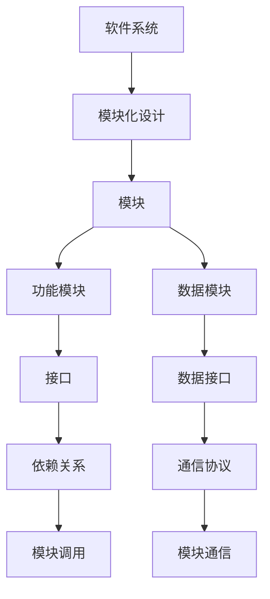

                 

# 软件2.0的模块化：融合成最佳整体

> **关键词：软件模块化、软件2.0、微服务、架构设计、组件化、编程范式**
> 
> **摘要：本文将深入探讨软件2.0时代下的模块化设计理念，分析其核心概念、架构设计、算法原理、数学模型以及实际应用。通过详细的代码实例和实战案例，本文旨在帮助开发者理解模块化在软件工程中的重要性，以及如何将其应用于实际项目中，以实现高效、可维护且具备扩展性的软件系统。**

## 1. 背景介绍

### 1.1 目的和范围

本文旨在探讨软件2.0时代下的模块化设计理念，通过对模块化的深入分析，揭示其在软件工程中的关键作用。文章将覆盖模块化的核心概念、架构设计、算法原理、数学模型以及实际应用，旨在为开发者提供系统化的模块化设计指导。

### 1.2 预期读者

本文面向具有软件工程基础知识的开发者，尤其是那些对模块化设计理念感兴趣，希望在软件开发实践中应用模块化的读者。无论您是初级开发者还是经验丰富的架构师，本文都将为您提供有价值的见解。

### 1.3 文档结构概述

本文将按照以下结构展开：

1. **背景介绍**：介绍模块化的背景、目的和预期读者。
2. **核心概念与联系**：通过Mermaid流程图展示模块化的核心概念和架构。
3. **核心算法原理 & 具体操作步骤**：使用伪代码详细阐述模块化算法原理和操作步骤。
4. **数学模型和公式 & 详细讲解 & 举例说明**：解释模块化中的数学模型和公式，并提供实际例子。
5. **项目实战：代码实际案例和详细解释说明**：展示模块化的实际应用案例。
6. **实际应用场景**：讨论模块化的实际应用场景。
7. **工具和资源推荐**：推荐相关学习资源和开发工具。
8. **总结：未来发展趋势与挑战**：探讨模块化的未来趋势和面临的挑战。
9. **附录：常见问题与解答**：提供常见问题的解答。
10. **扩展阅读 & 参考资料**：推荐进一步学习的资源。

### .4 术语表

#### 1.4.1 核心术语定义

- **模块化**：将软件系统分解为多个独立、可重用的组件，每个组件负责特定的功能。
- **微服务**：一种架构风格，将应用程序构建为一组小型服务，每个服务运行在自己的进程中，通过轻量级通信机制（如HTTP RESTful API）进行交互。
- **组件化**：一种设计模式，将应用程序划分为一系列功能组件，这些组件可以是模块化的。
- **架构设计**：设计软件系统的整体结构和组成部分的过程。
- **软件2.0**：软件开发的第二个阶段，以模块化、组件化和服务化为特征。

#### 1.4.2 相关概念解释

- **微服务架构**：一种设计理念，将应用程序分解为一系列独立的微服务，每个微服务负责特定的业务功能，独立部署和扩展。
- **组件库**：存储预定义的组件，这些组件可以用于构建软件系统。
- **依赖注入**：一种编程技术，用于将组件之间的依赖关系注入到组件内部。

#### 1.4.3 缩略词列表

- **SOA**：服务导向架构（Service-Oriented Architecture）
- **REST**：代表代表表述性状态转移（Representational State Transfer）
- **API**：应用程序编程接口（Application Programming Interface）

## 2. 核心概念与联系

在软件2.0时代，模块化设计成为软件开发的关键。为了更好地理解模块化的核心概念和联系，我们将通过一个Mermaid流程图来展示模块化的关键组成部分。



### 2.1 软件系统与模块化设计

软件系统是一个复杂的结构，由多个模块组成。模块化设计是将软件系统分解为多个独立、可重用的模块，每个模块负责特定的功能。这种设计方法有助于提高软件的可维护性、可扩展性和复用性。

### 2.2 模块

模块是软件系统中最基本的组成部分，每个模块实现一个特定的功能。模块可以进一步细分为功能模块和数据模块。功能模块处理特定的业务逻辑，而数据模块负责数据的存储和访问。

### 2.3 功能模块与数据模块

功能模块和数据模块是模块的两种不同类型。功能模块提供业务逻辑的实现，而数据模块负责数据的管理。功能模块和数据模块通过接口进行通信。

### 2.4 接口

接口定义了模块之间的交互方式。功能模块通过数据接口与数据模块进行通信，数据模块通过接口提供数据访问功能。

### 2.5 依赖关系

模块之间的依赖关系决定了模块的调用顺序和依赖性。通过明确依赖关系，可以确保模块的正确调用和数据传递。

### 2.6 模块通信

模块通信是指模块之间通过接口进行数据交换和调用。通信协议定义了模块之间的通信方式，如HTTP、REST等。

通过上述流程图，我们可以清晰地看到模块化的核心概念和联系。在接下来的部分，我们将深入探讨模块化的算法原理和具体操作步骤。

## 3. 核心算法原理 & 具体操作步骤

### 3.1 模块划分

模块划分是模块化设计的第一步。根据软件系统的功能需求和业务逻辑，将系统划分为多个功能模块和数据模块。每个模块应具有清晰的功能边界和独立的实现。

#### 3.1.1 伪代码：

```plaintext
function moduleDivision(systemRequirements, businessLogic) {
    functionModuleList = []
    dataModuleList = []

    for each (feature in systemRequirements) {
        if (isBusinessLogic(feature)) {
            functionModuleList.append(createFunctionModule(feature))
        } else {
            dataModuleList.append(createDataModule(feature))
        }
    }

    return [functionModuleList, dataModuleList]
}
```

#### 3.1.2 举例：

假设我们有一个电商系统，可以将其划分为以下模块：

- **功能模块**：
  - 用户管理模块：负责用户注册、登录、个人信息管理等功能。
  - 商品管理模块：负责商品信息管理、分类、搜索等功能。
  - 订单管理模块：负责订单创建、支付、发货等功能。
- **数据模块**：
  - 用户数据模块：存储用户信息。
  - 商品数据模块：存储商品信息。
  - 订单数据模块：存储订单信息。

### 3.2 接口定义

接口定义是模块通信的基础。根据模块的功能需求，定义每个模块的接口，包括功能模块的API和数据模块的数据接口。

#### 3.2.1 伪代码：

```plaintext
function defineInterface(functionModuleList, dataModuleList) {
    interfaceDefinition = {}

    for each (module in functionModuleList) {
        interfaceDefinition[module.name] = createAPI(module)
    }

    for each (module in dataModuleList) {
        interfaceDefinition[module.name] = createDataInterface(module)
    }

    return interfaceDefinition
}
```

#### 3.2.2 举例：

- **用户管理模块接口**：
  - 注册接口：接受用户注册信息，并创建用户账号。
  - 登录接口：验证用户登录凭证，返回用户信息。
- **商品管理模块接口**：
  - 添加商品接口：接受商品信息，并将其存储到数据库。
  - 删除商品接口：根据商品ID删除商品信息。
- **订单管理模块接口**：
  - 创建订单接口：根据用户ID和商品ID创建订单。
  - 取消订单接口：根据订单ID取消订单。

### 3.3 依赖关系

依赖关系决定了模块的调用顺序和依赖性。在模块划分和接口定义的基础上，分析模块之间的依赖关系，并确保模块的正确调用。

#### 3.3.1 伪代码：

```plaintext
function analyzeDependencies(moduleList) {
    dependencyGraph = createGraph()

    for each (module in moduleList) {
        for each (dependency in module.dependencies) {
            dependencyGraph.addEdge(module.name, dependency.name)
        }
    }

    return dependencyGraph
}
```

#### 3.3.2 举例：

- **用户管理模块**依赖于**商品管理模块**，因为用户在注册后需要浏览商品。
- **订单管理模块**依赖于**用户管理模块**和**商品管理模块**，因为订单需要关联用户和商品。

通过以上步骤，我们可以实现一个模块化的软件系统。在接下来的部分，我们将详细讲解模块化中的数学模型和公式，以帮助开发者更好地理解模块化的本质。

## 4. 数学模型和公式 & 详细讲解 & 举例说明

### 4.1 数学模型

模块化设计中的数学模型主要用于描述模块之间的关系、依赖关系以及系统的整体结构。以下是一个基本的数学模型，用于表示模块化的系统。

#### 4.1.1 模块化系统模型

一个模块化系统可以用一个图模型来表示，其中节点表示模块，边表示模块之间的关系。图模型可以表示为：

\[ G = (V, E) \]

- \( V \)：模块集合，即系统中的所有模块。
- \( E \)：边集合，表示模块之间的依赖关系。

#### 4.1.2 模块的依赖关系

模块之间的依赖关系可以用一个依赖矩阵 \( D \) 来表示，其中 \( D_{ij} \) 表示模块 \( i \) 是否依赖于模块 \( j \)。

\[ D = \begin{bmatrix}
D_{11} & D_{12} & \ldots & D_{1n} \\
D_{21} & D_{22} & \ldots & D_{2n} \\
\vdots & \vdots & \ddots & \vdots \\
D_{m1} & D_{m2} & \ldots & D_{mn}
\end{bmatrix} \]

其中，\( D_{ij} = 1 \) 表示模块 \( i \) 依赖于模块 \( j \)，否则为 0。

### 4.2 举例说明

假设我们有一个包含三个模块的简单系统，模块 A、B 和 C。根据功能需求，我们可以定义如下依赖关系：

- 模块 A 依赖于模块 B。
- 模块 B 依赖于模块 C。

依赖矩阵 \( D \) 可以表示为：

\[ D = \begin{bmatrix}
0 & 1 & 0 \\
0 & 0 & 1 \\
0 & 0 & 0
\end{bmatrix} \]

这个依赖矩阵表明模块 A 依赖于模块 B，模块 B 依赖于模块 C，而模块 C 没有依赖其他模块。

### 4.3 公式讲解

在模块化设计中，我们通常需要计算以下几种重要的参数：

1. **依赖深度**：表示模块的依赖层次。
2. **模块复杂度**：衡量模块的复杂程度。
3. **系统耦合度**：衡量系统内模块之间的依赖程度。

#### 4.3.1 依赖深度

依赖深度可以用图中的最长路径来表示。假设图中的最长路径长度为 \( L \)，则模块的依赖深度 \( D \) 可以表示为：

\[ D = L \]

#### 4.3.2 模块复杂度

模块复杂度可以用模块内部的函数数量和模块间的接口数量来衡量。假设模块内部有 \( F \) 个函数，模块间有 \( I \) 个接口，则模块复杂度 \( C \) 可以表示为：

\[ C = F + I \]

#### 4.3.3 系统耦合度

系统耦合度可以用模块之间的依赖关系数量来衡量。假设系统中有 \( N \) 个模块，模块间的依赖关系总数为 \( E \)，则系统耦合度 \( C \) 可以表示为：

\[ C = \frac{E}{N(N-1)} \]

通过这些数学模型和公式，我们可以对模块化系统进行定量分析，以评估系统的可维护性、可扩展性和可重用性。在接下来的部分，我们将通过一个实际的项目案例，展示模块化设计在软件开发中的应用。

## 5. 项目实战：代码实际案例和详细解释说明

### 5.1 开发环境搭建

在本案例中，我们将使用Java语言和Spring Boot框架来搭建一个简单的电商系统。以下是开发环境搭建的步骤：

1. **安装Java开发工具包（JDK）**：确保JDK版本至少为8及以上。
2. **安装IDE**：推荐使用IntelliJ IDEA或Eclipse。
3. **创建新项目**：在IDE中创建一个Spring Boot项目。
4. **添加依赖**：在项目的pom.xml文件中添加相关依赖，如Spring Boot、Spring Data JPA等。

### 5.2 源代码详细实现和代码解读

#### 5.2.1 功能模块划分

根据需求，我们将电商系统划分为以下功能模块：

- 用户管理模块
- 商品管理模块
- 订单管理模块
- 库存管理模块
- 支付管理模块

#### 5.2.2 用户管理模块

用户管理模块负责用户注册、登录、个人信息管理等功能。以下是关键代码片段：

```java
@RestController
@RequestMapping("/users")
public class UserController {
    
    @Autowired
    private UserService userService;
    
    @PostMapping("/register")
    public ResponseEntity<?> registerUser(@RequestBody UserRegistrationDto registrationDto) {
        User user = userService.registerUser(registrationDto);
        return ResponseEntity.ok().body(user);
    }
    
    @PostMapping("/login")
    public ResponseEntity<?> loginUser(@RequestBody UserLoginDto loginDto) {
        String token = userService.loginUser(loginDto);
        return ResponseEntity.ok().body(token);
    }
    
    @GetMapping("/{userId}")
    public ResponseEntity<?> getUser(@PathVariable Long userId) {
        User user = userService.getUserById(userId);
        return ResponseEntity.ok().body(user);
    }
}
```

**代码解读**：

- 用户注册接口：接收用户注册信息（如用户名、密码等），调用UserService中的registerUser方法创建用户。
- 用户登录接口：接收用户登录信息（如用户名、密码等），调用UserService中的loginUser方法生成登录凭证。
- 获取用户信息接口：根据用户ID获取用户信息。

#### 5.2.3 商品管理模块

商品管理模块负责商品信息管理、分类、搜索等功能。以下是关键代码片段：

```java
@RestController
@RequestMapping("/products")
public class ProductController {
    
    @Autowired
    private ProductService productService;
    
    @PostMapping
    public ResponseEntity<?> createProduct(@RequestBody ProductDto productDto) {
        Product product = productService.createProduct(productDto);
        return ResponseEntity.ok().body(product);
    }
    
    @GetMapping("/{productId}")
    public ResponseEntity<?> getProduct(@PathVariable Long productId) {
        Product product = productService.getProductById(productId);
        return ResponseEntity.ok().body(product);
    }
    
    @GetMapping("/search")
    public ResponseEntity<?> searchProducts(@RequestParam String query) {
        List<Product> products = productService.searchProducts(query);
        return ResponseEntity.ok().body(products);
    }
}
```

**代码解读**：

- 添加商品接口：接收商品信息，调用ProductService中的createProduct方法创建商品。
- 获取商品接口：根据商品ID获取商品信息。
- 搜索商品接口：根据查询条件搜索商品。

#### 5.2.4 订单管理模块

订单管理模块负责订单创建、支付、发货等功能。以下是关键代码片段：

```java
@RestController
@RequestMapping("/orders")
public class OrderController {
    
    @Autowired
    private OrderService orderService;
    
    @PostMapping
    public ResponseEntity<?> createOrder(@RequestBody OrderDto orderDto) {
        Order order = orderService.createOrder(orderDto);
        return ResponseEntity.ok().body(order);
    }
    
    @PostMapping("/pay")
    public ResponseEntity<?> payOrder(@RequestBody PaymentDto paymentDto) {
        boolean isPaid = orderService.payOrder(paymentDto);
        return ResponseEntity.ok().body(isPaid);
    }
    
    @GetMapping("/{orderId}")
    public ResponseEntity<?> getOrder(@PathVariable Long orderId) {
        Order order = orderService.getOrderById(orderId);
        return ResponseEntity.ok().body(order);
    }
}
```

**代码解读**：

- 创建订单接口：接收订单信息，调用OrderService中的createOrder方法创建订单。
- 支付订单接口：接收支付信息，调用OrderService中的payOrder方法支付订单。
- 获取订单接口：根据订单ID获取订单信息。

### 5.3 代码解读与分析

通过以上代码实例，我们可以看到模块化设计在电商系统中的应用。每个模块负责特定的功能，并通过接口与其他模块进行通信。

- **用户管理模块**负责用户注册、登录和获取用户信息。
- **商品管理模块**负责商品信息的创建、获取和搜索。
- **订单管理模块**负责订单的创建、支付和获取。

模块化设计使得系统更加可维护、可扩展和可重用。每个模块可以独立开发、测试和部署，降低了系统的复杂性。

通过实际案例，我们可以更直观地理解模块化设计在软件开发中的应用和优势。在接下来的部分，我们将讨论模块化的实际应用场景，以展示其在各种软件开发项目中的价值。

## 6. 实际应用场景

模块化设计在软件开发中具有广泛的应用，尤其在复杂系统和高需求场景中，其优势更加明显。以下是一些模块化设计的实际应用场景：

### 6.1 复杂系统

复杂系统如大型电商平台、企业资源规划（ERP）系统等，通常包含多个模块，每个模块负责不同的业务功能。通过模块化设计，可以将这些模块独立开发、测试和部署，降低系统的整体复杂度。例如，在电商平台中，用户管理、商品管理、订单管理、支付管理、库存管理等模块可以独立开发，并通过接口进行通信。

### 6.2 高需求场景

在高需求场景中，如实时交易系统、高性能计算平台等，模块化设计有助于实现系统的可扩展性和性能优化。通过将系统划分为多个模块，可以根据需求独立扩展特定模块，而不会影响其他模块。例如，在实时交易系统中，交易处理模块、数据存储模块、消息队列模块等可以独立扩展，以提高系统的整体性能。

### 6.3 跨平台开发

跨平台开发是另一个模块化设计的重要应用场景。通过模块化设计，可以将不同平台的特定功能模块化，并在不同的平台上独立开发、测试和部署。例如，在移动应用开发中，Android和iOS平台具有不同的特性和需求。通过模块化设计，可以将用户界面、业务逻辑、数据存储等功能模块化，分别开发Android和iOS版本，以提高开发效率。

### 6.4 项目协作

在大型项目开发中，模块化设计有助于项目协作。每个模块可以由不同的团队独立开发，从而提高开发效率。例如，在一个跨国的软件开发项目中，不同团队可以负责不同的模块，并通过接口进行通信，以确保项目顺利进行。

### 6.5 软件复用

模块化设计有助于实现软件复用。通过将系统划分为多个独立、可重用的模块，可以在不同的项目中重复使用这些模块，从而提高开发效率。例如，在多个项目中都需要用户管理模块、商品管理模块等，通过模块化设计，可以将这些模块提取出来，以供不同项目复用。

总之，模块化设计在复杂系统、高需求场景、跨平台开发、项目协作和软件复用等方面具有广泛的应用。通过模块化设计，开发者可以更高效地开发、测试和部署软件系统，从而提高软件质量、降低开发成本。

## 7. 工具和资源推荐

### 7.1 学习资源推荐

#### 7.1.1 书籍推荐

1. **《软件架构：实践者的研究方法》**：这本书提供了软件架构的深入理解，包括模块化设计的方法和最佳实践。
2. **《微服务设计》**：详细介绍了微服务架构的设计原理和实践，包括模块化的实现方法。

#### 7.1.2 在线课程

1. **Coursera上的《软件架构与设计模式》**：这是一个全面的在线课程，涵盖了模块化设计、架构设计模式和软件工程的基本概念。
2. **Udacity的《微服务架构与设计》**：专注于微服务架构的设计和实践，包括模块化设计的深入探讨。

#### 7.1.3 技术博客和网站

1. **IBM Developer**：提供了丰富的软件架构和模块化设计相关的技术文章和教程。
2. **Spring Framework Documentation**：Spring Boot框架的官方文档，提供了关于模块化设计和微服务架构的详细指南。

### 7.2 开发工具框架推荐

#### 7.2.1 IDE和编辑器

1. **IntelliJ IDEA**：一款强大的集成开发环境，支持多种编程语言和框架，特别适合进行模块化设计和微服务开发。
2. **Eclipse**：另一款功能强大的集成开发环境，适用于Java和Spring Boot开发。

#### 7.2.2 调试和性能分析工具

1. **VisualVM**：一款强大的性能分析工具，适用于Java应用程序，可以帮助开发者诊断模块化设计中的性能问题。
2. **JProfiler**：一款专业的Java性能分析工具，提供了详细的模块化性能分析功能。

#### 7.2.3 相关框架和库

1. **Spring Boot**：一款流行的微服务开发框架，提供了模块化设计和快速开发的能力。
2. **Spring Cloud**：Spring Boot的扩展框架，提供了微服务架构中的服务发现、配置管理、负载均衡等组件。

### 7.3 相关论文著作推荐

#### 7.3.1 经典论文

1. **"Microservices: A Definition of a Concept"**：这篇文章提出了微服务架构的定义和基本原理，对模块化设计有重要影响。
2. **"The Design of the UNIX Operating System"**：这篇文章介绍了UNIX操作系统的设计原则，包括模块化设计的方法。

#### 7.3.2 最新研究成果

1. **"Service-Distinctness: A Property for Decentralized Systems"**：这篇文章探讨了微服务架构中模块独立性的重要性，为模块化设计提供了新的见解。
2. **"The Impact of Microservices on Software Engineering Education"**：这篇文章分析了微服务对软件工程教育的影响，包括模块化设计的教学方法。

#### 7.3.3 应用案例分析

1. **"Microservices at Netflix"**：这篇文章详细介绍了Netflix如何使用微服务架构和模块化设计来实现大规模的分布式系统。
2. **"Building a Modular Web Application with Angular and Spring Boot"**：这篇文章展示了如何使用Angular和Spring Boot构建模块化的Web应用程序。

通过以上工具和资源的推荐，开发者可以更好地理解模块化设计，并在实际项目中应用这一理念，以提高软件开发的效率和质量。

## 8. 总结：未来发展趋势与挑战

模块化设计在软件工程中具有重要的地位，其未来发展趋势和面临的挑战值得深入探讨。

### 8.1 发展趋势

1. **微服务化**：随着云计算和容器技术的普及，微服务架构越来越受到青睐。模块化设计作为微服务架构的核心，将继续在软件开发中发挥重要作用。
2. **自动化**：模块化设计过程中，自动化工具和框架（如Docker、Kubernetes等）的应用将大大提高开发效率和系统可维护性。
3. **开源生态**：随着开源社区的发展，更多的模块化设计和开发工具将涌现，为开发者提供更丰富的选择和资源。
4. **智能模块**：随着人工智能技术的进步，模块化设计中的模块将逐渐具备智能化的特性，如自我优化、自我修复等，从而提高系统的自适应能力。

### 8.2 挑战

1. **复杂性管理**：随着模块数量的增加，系统的复杂度也会上升。如何有效管理复杂性，保持系统的可维护性和可扩展性，是模块化设计面临的重要挑战。
2. **模块依赖**：模块之间的依赖关系可能导致系统的稳定性问题。如何合理设计模块依赖，避免形成“死锁”或“环路”，是模块化设计的关键挑战。
3. **性能优化**：在模块化系统中，模块之间的通信和调用可能影响系统的整体性能。如何进行性能优化，提高系统的响应速度和吞吐量，是一个重要的研究课题。
4. **安全性**：模块化设计中的模块独立部署可能导致安全性问题。如何确保模块之间的安全通信，防止外部攻击，是模块化设计必须面对的挑战。

综上所述，模块化设计在未来的软件开发中将发挥更加重要的作用，但同时也面临着复杂度管理、模块依赖、性能优化和安全性等挑战。通过不断的研究和实践，开发者可以克服这些挑战，使模块化设计在软件开发中发挥更大的价值。

## 9. 附录：常见问题与解答

### 9.1 模块化设计与面向对象设计的区别

**问题**：模块化设计与面向对象设计有什么区别？

**解答**：模块化设计和面向对象设计都是软件工程中的重要设计方法，但它们的侧重点不同。

- **模块化设计**：将系统划分为独立的模块，每个模块实现特定的功能，模块之间通过接口进行通信。模块化设计强调功能的独立性和系统的可维护性。
- **面向对象设计**：基于对象的概念，将系统划分为多个类，每个类代表一个对象。面向对象设计强调对象的封装、继承和多态。

虽然两者有相似之处，如都强调模块的独立性，但模块化设计更侧重于功能模块的划分，而面向对象设计更侧重于对象的抽象和封装。

### 9.2 如何确保模块的独立性？

**问题**：在模块化设计中，如何确保模块的独立性？

**解答**：确保模块独立性是模块化设计的关键。以下是一些方法：

- **接口分离**：通过定义清晰的接口，将模块之间的通信与具体的实现分离，降低模块之间的耦合度。
- **封装**：将模块的实现细节封装在内部，对外提供有限的接口，防止外部直接访问内部实现。
- **依赖倒置原则**：使用依赖注入等机制，确保模块之间的依赖关系是抽象的，从而提高模块的独立性。
- **模块化划分**：根据功能需求，合理划分模块，确保每个模块具有明确的功能边界和职责。

### 9.3 模块化设计与性能优化

**问题**：模块化设计如何影响软件性能优化？

**解答**：模块化设计对软件性能优化有双重影响。

- **正面影响**：模块化设计有助于降低系统的整体复杂度，使性能优化工作更加集中和明确。模块之间的通信和调用可以独立优化，从而提高系统的整体性能。
- **负面影响**：模块化设计可能导致模块之间的通信开销增加，如网络通信、序列化等，可能对系统性能产生负面影响。

因此，在模块化设计中，需要平衡模块划分和性能优化的关系。通过合理划分模块、优化模块间的通信方式，可以在保持模块独立性的同时，提高系统的性能。

## 10. 扩展阅读 & 参考资料

为了深入了解模块化设计在软件工程中的应用，以下是一些建议的扩展阅读和参考资料：

### 10.1 经典书籍

1. **《软件架构：实践者的研究方法》**，作者：Ivar Jacobson、Bruce R. MacIsaac 和报关顺。
2. **《微服务设计》**，作者：Chris Richardson。
3. **《设计模式：可复用面向对象软件的基础》**，作者：Erich Gamma、Richard Helm、Ralph Johnson 和 Wiley Johnson。

### 10.2 在线课程

1. **Coursera上的《软件架构与设计模式》**：提供全面的软件架构和设计模式课程。
2. **Udacity的《微服务架构与设计》**：深入探讨微服务架构的设计和实践。

### 10.3 技术博客和网站

1. **IBM Developer**：提供关于模块化设计、微服务架构等主题的详细文章和教程。
2. **Spring Framework Documentation**：Spring Boot框架的官方文档，包含模块化设计的最佳实践。

### 10.4 相关论文和研究成果

1. **"Microservices: A Definition of a Concept"**：详细介绍了微服务架构的定义和原理。
2. **"The Design of the UNIX Operating System"**：分析了UNIX操作系统的设计原则，包括模块化设计的方法。
3. **"Service-Distinctness: A Property for Decentralized Systems"**：探讨了微服务架构中模块独立性的重要性。

### 10.5 应用案例研究

1. **"Microservices at Netflix"**：介绍了Netflix如何使用微服务架构和模块化设计来实现大规模的分布式系统。
2. **"Building a Modular Web Application with Angular and Spring Boot"**：展示了如何使用Angular和Spring Boot构建模块化的Web应用程序。

通过阅读以上资源和参考文献，您可以更深入地了解模块化设计在软件工程中的应用，以及如何在实际项目中有效地应用这一理念。希望这些扩展阅读和参考资料对您的学习和实践有所帮助。

