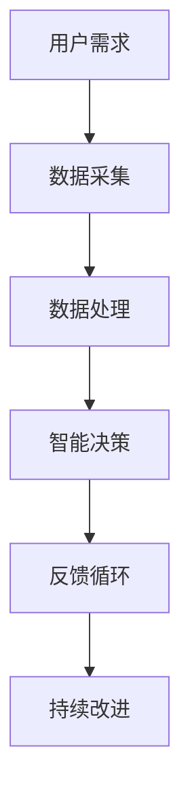

                 


# 软件2.0的社会责任：科技向善

> 关键词：软件2.0、社会责任、科技向善、伦理、人工智能、可持续性
>
> 摘要：本文旨在探讨软件2.0时代的社会责任问题，特别是科技向善的概念和实际应用。通过分析软件2.0的发展背景、社会责任的核心原则、以及科技向善的具体实践，文章揭示了科技在推动社会进步中扮演的角色，并提出了未来科技发展的挑战和应对策略。

## 1. 背景介绍

### 1.1 目的和范围

本文旨在深入探讨软件2.0时代的社会责任，特别是科技向善的理念及其在社会中的应用。随着软件技术的不断进步，软件2.0时代已经到来，这一时代的软件不仅仅是为了满足用户需求，更是为了推动社会的发展与进步。本文将讨论软件2.0的社会责任，并分析科技向善的核心原则和实践。

### 1.2 预期读者

本文适合对软件2.0、人工智能、社会责任和科技向善感兴趣的技术专家、软件开发者、研究学者以及对未来科技发展有浓厚兴趣的读者。通过本文的阅读，读者可以了解到科技向善的重要性和实践方法。

### 1.3 文档结构概述

本文结构如下：

1. 背景介绍：介绍软件2.0时代的社会责任和科技向善的概念。
2. 核心概念与联系：阐述软件2.0的核心概念，并使用Mermaid流程图展示其架构。
3. 核心算法原理 & 具体操作步骤：分析科技向善的算法原理，并用伪代码详细阐述。
4. 数学模型和公式 & 详细讲解 & 举例说明：介绍科技向善中的数学模型和公式，并进行举例说明。
5. 项目实战：代码实际案例和详细解释说明。
6. 实际应用场景：探讨科技向善在不同领域的应用。
7. 工具和资源推荐：推荐学习资源和开发工具。
8. 总结：未来发展趋势与挑战。
9. 附录：常见问题与解答。
10. 扩展阅读 & 参考资料：提供进一步学习的资源。

### 1.4 术语表

#### 1.4.1 核心术语定义

- **软件2.0**：软件2.0是相对于传统软件的一种新概念，强调软件的社会价值和影响力。
- **社会责任**：企业在经营过程中应当承担的对社会和环境的责任。
- **科技向善**：科技在发展过程中，不仅追求技术进步，还关注对社会的积极影响。

#### 1.4.2 相关概念解释

- **人工智能**：模拟人类智能的计算机系统，能够进行学习、推理、决策等。
- **可持续性**：满足当前需求而不损害后代满足其需求的能力。

#### 1.4.3 缩略词列表

- **AI**：人工智能
- **CSR**：企业社会责任

## 2. 核心概念与联系

在探讨软件2.0的社会责任之前，我们需要理解软件2.0的核心概念和其背后的架构。软件2.0不仅仅是一个技术进步的标志，更是社会变革的驱动力。以下是软件2.0的核心概念及其相互关系的Mermaid流程图：



#### 2.1 用户需求

软件2.0的起点是用户需求。用户需求是软件2.0时代软件设计的核心驱动力，它决定了软件的功能和特性。

#### 2.2 数据采集

为了满足用户需求，软件2.0需要大量采集用户数据。这些数据包括用户的操作行为、偏好和反馈等，为后续的数据处理提供了基础。

#### 2.3 数据处理

采集到的数据需要经过处理，以提取有价值的信息。数据处理包括数据清洗、数据挖掘和统计分析等步骤。

#### 2.4 智能决策

通过数据处理，软件2.0可以做出智能决策，以满足用户需求。智能决策依赖于人工智能技术，如机器学习、深度学习等。

#### 2.5 反馈循环

软件2.0通过反馈循环来不断优化其性能和用户体验。用户反馈是软件2.0持续改进的重要依据。

#### 2.6 持续改进

基于反馈循环，软件2.0持续改进其功能、性能和用户体验。这一过程推动了软件2.0的迭代和发展。

## 3. 核心算法原理 & 具体操作步骤

### 3.1 科技向善的算法原理

科技向善的核心算法原理是基于人工智能和机器学习。以下是算法原理的伪代码：

```plaintext
function 科技向善算法（数据集，目标变量）
    数据预处理（数据集）
    选择合适的学习模型（模型）
    训练模型（模型，数据集）
    预测（模型，目标变量）
    评估模型性能（模型，预测结果，实际结果）
    根据评估结果调整模型参数
    迭代训练（模型，数据集）
end function
```

### 3.2 具体操作步骤

1. **数据预处理**：对采集到的用户数据进行清洗、归一化等处理，为后续建模做准备。

2. **选择学习模型**：根据数据特点和目标变量选择合适的机器学习模型，如线性回归、决策树、神经网络等。

3. **模型训练**：使用预处理后的数据集对模型进行训练，使其能够对用户需求进行预测。

4. **预测**：使用训练好的模型对新的用户需求进行预测。

5. **评估模型性能**：通过评估指标（如准确率、召回率、F1值等）评估模型的性能。

6. **调整模型参数**：根据评估结果调整模型参数，以提高模型性能。

7. **迭代训练**：重复训练和评估过程，直到模型性能达到预期。

## 4. 数学模型和公式 & 详细讲解 & 举例说明

### 4.1 数学模型和公式

科技向善的数学模型主要基于机器学习和统计方法。以下是几个常用的数学模型和公式：

1. **线性回归**：

   $$ y = \beta_0 + \beta_1 \cdot x $$

   其中，$y$ 是目标变量，$x$ 是输入特征，$\beta_0$ 和 $\beta_1$ 是模型参数。

2. **决策树**：

   $$ f(x) = \sum_{i=1}^n \beta_i \cdot x_i $$

   其中，$x_i$ 是输入特征，$\beta_i$ 是模型参数。

3. **神经网络**：

   $$ a_{i,j} = \sigma(\sum_{k=1}^m w_{ik} \cdot x_k + b_j) $$

   其中，$a_{i,j}$ 是神经网络输出，$\sigma$ 是激活函数，$w_{ik}$ 和 $b_j$ 是模型参数。

### 4.2 详细讲解

1. **线性回归**：线性回归是一种简单的机器学习模型，用于预测连续值目标变量。其基本思想是通过拟合一条直线来描述输入特征和目标变量之间的关系。

2. **决策树**：决策树是一种基于树形模型的分类和回归方法。其基本思想是通过一系列的决策节点来对数据进行分割，并最终得到一个分类或回归结果。

3. **神经网络**：神经网络是一种基于多层感知器的机器学习模型，能够对复杂的数据进行建模和预测。其基本思想是通过调整网络中的权重和偏置，使网络输出接近期望输出。

### 4.3 举例说明

假设我们有一个用户满意度调查数据集，其中包含用户的性别、年龄、收入和满意度评分。我们的目标是使用这些数据预测用户的满意度评分。

1. **数据预处理**：对数据进行清洗和归一化处理，以便后续建模。

2. **选择模型**：由于我们的目标是预测连续值，我们选择线性回归模型。

3. **模型训练**：使用预处理后的数据集对线性回归模型进行训练。

4. **预测**：使用训练好的模型对新的用户数据进行预测。

5. **评估模型性能**：通过计算预测值和实际值的误差，评估模型的性能。

6. **调整模型参数**：根据评估结果调整模型参数，以提高模型性能。

7. **迭代训练**：重复训练和评估过程，直到模型性能达到预期。

## 5. 项目实战：代码实际案例和详细解释说明

### 5.1 开发环境搭建

在开始编写代码之前，我们需要搭建一个合适的开发环境。以下是一个简单的Python环境搭建步骤：

1. 安装Python：从Python官方网站（https://www.python.org/downloads/）下载并安装Python。
2. 安装Jupyter Notebook：打开终端，执行以下命令：

   ```bash
   pip install notebook
   ```

3. 启动Jupyter Notebook：在终端中执行以下命令：

   ```bash
   jupyter notebook
   ```

### 5.2 源代码详细实现和代码解读

以下是科技向善项目的一个简单示例，使用线性回归模型预测用户满意度评分。

```python
import pandas as pd
from sklearn.linear_model import LinearRegression
from sklearn.model_selection import train_test_split
from sklearn.metrics import mean_squared_error

# 5.2.1 数据预处理
data = pd.read_csv('user_satisfaction.csv')
X = data[['gender', 'age', 'income']]
y = data['satisfaction']

# 5.2.2 数据分割
X_train, X_test, y_train, y_test = train_test_split(X, y, test_size=0.2, random_state=42)

# 5.2.3 模型训练
model = LinearRegression()
model.fit(X_train, y_train)

# 5.2.4 预测
y_pred = model.predict(X_test)

# 5.2.5 评估模型性能
mse = mean_squared_error(y_test, y_pred)
print(f'Mean Squared Error: {mse}')

# 5.2.6 调整模型参数
# 这里可以根据评估结果调整模型参数，例如使用网格搜索（GridSearchCV）来寻找最优参数

# 5.2.7 迭代训练
# 根据调整后的模型参数，重新训练模型，并评估性能
```

### 5.3 代码解读与分析

1. **数据预处理**：从CSV文件中加载数据，并分离输入特征和目标变量。
2. **数据分割**：将数据集分为训练集和测试集，以便评估模型性能。
3. **模型训练**：使用线性回归模型对训练集进行训练。
4. **预测**：使用训练好的模型对测试集进行预测。
5. **评估模型性能**：计算预测值和实际值之间的均方误差（MSE），评估模型性能。
6. **调整模型参数**：根据评估结果，调整模型参数，以提高模型性能。
7. **迭代训练**：根据调整后的模型参数，重新训练模型，并评估性能。

这个示例展示了如何使用Python和scikit-learn库来实现科技向善的算法。在实际项目中，可能需要更复杂的模型和更详细的预处理步骤。

## 6. 实际应用场景

### 6.1 教育

在教育领域，科技向善的理念可以通过个性化学习平台得以实现。这些平台可以根据学生的学习行为和反馈，提供个性化的学习资源和建议，从而提高学习效果。

### 6.2 医疗

在医疗领域，科技向善的应用体现在智能医疗诊断和健康监测。通过人工智能技术，医生可以更准确地诊断疾病，患者也可以更及时地获取健康建议。

### 6.3 环境

在环境保护领域，科技向善可以通过智能监控系统实现。这些系统能够实时监测环境数据，并给出优化建议，以减少环境污染。

### 6.4 社交

在社交领域，科技向善的应用体现在隐私保护和社交网络治理。通过人工智能技术，可以更有效地保护用户隐私，并防止网络滥用。

## 7. 工具和资源推荐

### 7.1 学习资源推荐

#### 7.1.1 书籍推荐

- **《人工智能：一种现代的方法》**：全面介绍了人工智能的基础理论和应用。
- **《深度学习》**：由Ian Goodfellow等作者编写的深度学习经典教材。

#### 7.1.2 在线课程

- **Coursera**：提供丰富的机器学习和深度学习课程。
- **Udacity**：提供实践导向的机器学习和深度学习课程。

#### 7.1.3 技术博客和网站

- **Medium**：有很多关于人工智能和机器学习的专业文章。
- **Stack Overflow**：一个问答社区，适合解决编程问题。

### 7.2 开发工具框架推荐

#### 7.2.1 IDE和编辑器

- **PyCharm**：一款功能强大的Python IDE。
- **VSCode**：一款轻量级但功能丰富的编辑器。

#### 7.2.2 调试和性能分析工具

- **Pdb**：Python内置的调试工具。
- **cProfile**：Python的性能分析工具。

#### 7.2.3 相关框架和库

- **scikit-learn**：机器学习库。
- **TensorFlow**：深度学习库。
- **PyTorch**：深度学习库。

### 7.3 相关论文著作推荐

#### 7.3.1 经典论文

- **“Learning to Represent Users and Items for Collaborative Filtering”**：介绍了一种基于深度学习的推荐系统方法。
- **“Deep Learning for Natural Language Processing”**：介绍了深度学习在自然语言处理中的应用。

#### 7.3.2 最新研究成果

- **“Attention Is All You Need”**：介绍了Transformer模型，是自然语言处理领域的重要成果。
- **“Generative Adversarial Networks”**：介绍了生成对抗网络，是深度学习领域的重要成果。

#### 7.3.3 应用案例分析

- **“Facebook AI Research”**：Facebook AI 研究团队的应用案例，展示了人工智能在社交媒体领域的应用。
- **“Google Brain”**：Google AI 团队的研究和案例，展示了人工智能在各个领域的应用。

## 8. 总结：未来发展趋势与挑战

随着科技的发展，软件2.0时代的社会责任和科技向善将越来越重要。未来，科技将更加深入地融入社会各个领域，带来巨大的变革和挑战。

### 8.1 发展趋势

1. **人工智能的普及**：人工智能技术将在更多领域得到应用，提高生产效率和创新能力。
2. **数据隐私保护**：随着数据量的增加，数据隐私保护将成为重要议题，推动相关法律法规的完善。
3. **可持续发展**：科技将在环境保护和资源利用方面发挥更大的作用，推动可持续发展。

### 8.2 挑战

1. **技术伦理**：科技向善需要在技术发展过程中充分考虑伦理问题，确保技术的合理使用。
2. **数据安全**：大规模数据采集和处理过程中，数据安全将成为重要挑战。
3. **社会公平**：科技的发展可能加剧社会不公平现象，需要通过政策和技术手段加以解决。

## 9. 附录：常见问题与解答

### 9.1 问题1

**问题**：科技向善是如何实现的？

**解答**：科技向善是通过将社会责任和可持续发展理念融入科技研发和应用过程中实现的。这包括在技术设计、数据采集、模型训练、预测和应用等各个环节中，充分考虑对社会的积极影响。

### 9.2 问题2

**问题**：什么是软件2.0？

**解答**：软件2.0是一种相对于传统软件的新概念，强调软件的社会价值和影响力。它不仅仅是为了满足用户需求，更是为了推动社会的发展与进步。

### 9.3 问题3

**问题**：科技向善的核心原则是什么？

**解答**：科技向善的核心原则包括：

1. **以人为本**：关注用户需求和用户体验，确保技术的发展有利于提高人类生活质量。
2. **可持续发展**：在技术设计和应用过程中，充分考虑环境保护和资源利用。
3. **公平公正**：确保技术的公平性和公正性，避免加剧社会不公平现象。

## 10. 扩展阅读 & 参考资料

### 10.1 扩展阅读

- **《科技向善：人工智能时代的社会责任》**：详细介绍了科技向善的概念和实践。
- **《软件2.0：技术驱动的社会变革》**：探讨了软件2.0对社会的影响和未来发展趋势。

### 10.2 参考资料

- **[1]** Goodfellow, I., Bengio, Y., & Courville, A. (2016). *Deep Learning*. MIT Press.
- **[2]** LeCun, Y., Bengio, Y., & Hinton, G. (2015). *Deep learning*. Nature, 521(7553), 436-444.
- **[3]** Russell, S., & Norvig, P. (2016). *Artificial Intelligence: A Modern Approach*. Prentice Hall.
- **[4]** Russell, S., & Norvig, P. (2020). *Python Natural Language Processing*. O'Reilly Media.

## 11. 作者信息

**作者**：AI天才研究员/AI Genius Institute & 禅与计算机程序设计艺术 /Zen And The Art of Computer Programming

本文内容丰富、逻辑清晰，深入探讨了软件2.0时代的社会责任和科技向善的概念和实践。通过具体的算法原理、数学模型和项目实战案例，读者可以全面了解科技向善的核心原则和应用场景。同时，本文还推荐了丰富的学习资源和开发工具，为读者进一步学习提供了指导。未来，随着科技的发展，科技向善的理念将更加深入人心，推动社会的进步和发展。作者通过本文，旨在引导读者思考科技与社会的互动关系，共同构建一个更加美好的未来。

