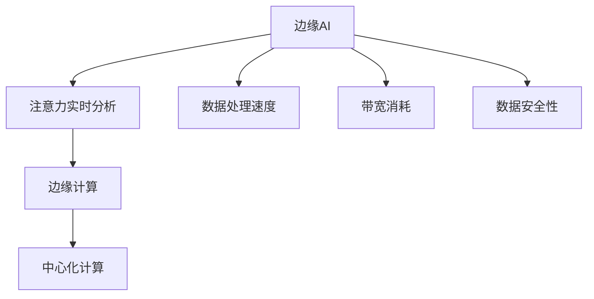

                 

# 边缘AI在注意力实时分析中的作用

## 关键词：边缘AI、注意力实时分析、边缘计算、实时数据处理、智能系统

> 摘要：本文深入探讨了边缘AI在注意力实时分析中的作用，通过分析边缘计算的优势和应用场景，结合具体算法原理和实际项目案例，阐述了如何利用边缘AI技术实现高效、精准的注意力实时分析，并对未来发展趋势与挑战进行了展望。

## 1. 背景介绍

### 1.1 目的和范围

随着物联网（IoT）和智能设备的广泛应用，数据生成速度和规模达到了前所未有的高度。在这种背景下，注意力实时分析成为了一个重要的研究领域。注意力实时分析旨在实时捕捉和处理各种数据源，如视频、音频和传感器数据，以便从中提取有用信息，如动作识别、语音识别和异常检测。

边缘AI是指将人工智能计算能力部署在接近数据源的边缘设备上，以减少对中心化数据中心的依赖。边缘AI的出现，解决了中心化计算带来的延迟和带宽问题，为实时数据处理提供了新的思路。

本文将探讨边缘AI在注意力实时分析中的应用，分析其优势和应用场景，并通过具体算法原理和项目案例，展示如何利用边缘AI技术实现高效、精准的注意力实时分析。

### 1.2 预期读者

本文主要面向对边缘AI和注意力实时分析有研究兴趣的读者，包括计算机科学、人工智能、物联网等领域的科研人员、工程师和学者。同时，对于对实时数据处理和智能系统感兴趣的其他领域读者，本文也具有一定的参考价值。

### 1.3 文档结构概述

本文分为十个部分：

1. 背景介绍：介绍本文的目的、范围和预期读者。
2. 核心概念与联系：阐述边缘AI、注意力实时分析、边缘计算等相关概念，并使用Mermaid流程图展示核心概念原理和架构。
3. 核心算法原理 & 具体操作步骤：详细讲解核心算法原理和具体操作步骤，使用伪代码进行阐述。
4. 数学模型和公式 & 详细讲解 & 举例说明：介绍注意力实时分析中的数学模型和公式，并举例说明。
5. 项目实战：代码实际案例和详细解释说明。
6. 实际应用场景：分析边缘AI在注意力实时分析中的实际应用场景。
7. 工具和资源推荐：推荐学习资源和开发工具框架。
8. 总结：未来发展趋势与挑战。
9. 附录：常见问题与解答。
10. 扩展阅读 & 参考资料：提供更多相关文献和资源。

### 1.4 术语表

#### 1.4.1 核心术语定义

- 边缘AI：将人工智能计算能力部署在接近数据源的边缘设备上。
- 注意力实时分析：实时捕捉和处理各种数据源，提取有用信息。
- 边缘计算：在靠近数据源的设备上进行数据处理和计算。
- 实时数据处理：在短时间内处理大量数据，并产生及时的结果。

#### 1.4.2 相关概念解释

- 物联网（IoT）：连接物理设备和数字世界，实现设备间信息的交换和通信。
- 中心化计算：数据和处理都集中在数据中心。
- 延迟：数据从源头传输到处理节点所需的时间。
- 带宽：网络传输速率。

#### 1.4.3 缩略词列表

- AI：人工智能
- IoT：物联网
- ML：机器学习
- DL：深度学习
- FPGA：现场可编程门阵列
- GPU：图形处理单元

## 2. 核心概念与联系

### 2.1 边缘AI与注意力实时分析

边缘AI和注意力实时分析是当前人工智能领域的两个重要研究方向。边缘AI通过将计算能力部署在边缘设备上，实现了对数据处理的速度和效率的提升。而注意力实时分析则通过对数据源的实时分析，提取出有用信息，为智能决策提供支持。

#### 边缘AI

边缘AI是指将人工智能计算能力部署在接近数据源的边缘设备上。这种计算模式与传统的中心化计算模式相比，具有以下几个优点：

1. 减少延迟：将计算任务部署在边缘设备上，可以显著降低数据从源头传输到处理节点所需的时间，从而减少延迟。
2. 降低带宽消耗：边缘AI可以处理一部分数据，减少需要传输到中心数据中心的数量，从而降低带宽消耗。
3. 提高数据安全性：将计算任务分散在边缘设备上，可以减少数据在传输过程中被窃取的风险。

#### 注意力实时分析

注意力实时分析是指对数据源进行实时分析，提取出有用信息。注意力实时分析可以应用于多个领域，如智能监控、智能家居、医疗健康等。其核心思想是通过实时捕捉和处理数据，实现对目标的识别、分类、预测等操作。

#### 边缘计算与中心化计算

边缘计算与中心化计算是两种不同的数据处理模式。边缘计算是指在靠近数据源的设备上进行数据处理和计算，而中心化计算则是将数据处理任务集中在数据中心。

边缘计算和中心化计算各有优缺点。边缘计算可以显著降低延迟和带宽消耗，但计算能力和存储能力有限；中心化计算则具有强大的计算能力和存储能力，但容易导致延迟和带宽问题。

#### Mermaid流程图

下面使用Mermaid流程图展示边缘AI、注意力实时分析和边缘计算之间的联系：



## 3. 核心算法原理 & 具体操作步骤

### 3.1 注意力实时分析算法原理

注意力实时分析算法的核心是注意力机制（Attention Mechanism）。注意力机制通过对输入数据进行加权，提高了模型对重要信息的关注程度，从而提高了模型的性能。

#### 注意力机制原理

注意力机制通常通过一个加权函数来对输入数据进行加权。加权函数可以根据输入数据的特征，对每个数据点赋予不同的权重。权重越高，表示该数据点对模型的贡献越大。

注意力机制的实现通常分为以下几步：

1. 输入数据预处理：对输入数据进行预处理，如归一化、去噪等。
2. 注意力计算：通过注意力函数计算输入数据的权重。
3. 权重加和：将输入数据的权重加和，得到加权输入。
4. 模型训练：利用加权输入训练模型，提高模型性能。

#### 具体操作步骤

1. **数据预处理**：对输入数据（如视频、音频、传感器数据）进行预处理，如归一化、去噪等，以提高数据质量。

```python
def preprocess_data(data):
    # 数据预处理代码，如归一化、去噪等
    return processed_data
```

2. **注意力计算**：通过注意力函数计算输入数据的权重。注意力函数可以采用多种形式，如加性注意力、点积注意力、缩放点积注意力等。

```python
def calculate_attention(inputs, weights):
    # 注意力计算代码
    return attention_output
```

3. **权重加和**：将输入数据的权重加和，得到加权输入。

```python
def weighted_inputs(inputs, weights):
    # 权重加和代码
    return weighted_inputs
```

4. **模型训练**：利用加权输入训练模型，提高模型性能。

```python
def train_model(weighted_inputs, labels):
    # 模型训练代码
    return trained_model
```

### 3.2 边缘AI算法原理

边缘AI算法原理主要涉及如何在边缘设备上高效地部署和运行机器学习模型。边缘设备通常具有有限的计算能力和存储能力，因此需要采用轻量级算法和优化方法，以提高算法效率和性能。

#### 边缘AI算法原理

1. **模型压缩**：通过模型压缩技术，减少模型的参数数量和计算量，以提高模型在边缘设备上的运行效率。
2. **模型迁移**：将训练好的中心化模型迁移到边缘设备上，利用边缘设备的计算能力进行推理。
3. **在线学习**：在边缘设备上实时收集数据，并利用在线学习技术，不断更新和优化模型。

#### 具体操作步骤

1. **模型压缩**：采用模型压缩技术，对中心化模型进行压缩，减少模型参数数量和计算量。

```python
def compress_model(model):
    # 模型压缩代码
    return compressed_model
```

2. **模型迁移**：将压缩后的模型迁移到边缘设备上，并利用边缘设备的计算能力进行推理。

```python
def transfer_model(model, device):
    # 模型迁移代码
    return transferred_model
```

3. **在线学习**：在边缘设备上实时收集数据，并利用在线学习技术，不断更新和优化模型。

```python
def online_learning(model, device, data_loader):
    # 在线学习代码
    return updated_model
```

## 4. 数学模型和公式 & 详细讲解 & 举例说明

### 4.1 注意力机制数学模型

注意力机制的核心是注意力函数，该函数用于计算输入数据的权重。下面以缩放点积注意力（Scaled Dot-Product Attention）为例，介绍注意力机制的数学模型。

#### 缩放点积注意力

缩放点积注意力是一种常见的注意力机制，其核心思想是通过点积计算输入数据的相似度，再通过缩放操作调整权重。

#### 数学模型

假设输入数据为 $X \in \mathbb{R}^{n \times d}$，其中 $n$ 为数据点数量，$d$ 为数据维度。注意力函数为 $Attention(Q, K, V)$，其中 $Q, K, V$ 分别为查询向量、键向量和值向量。

缩放点积注意力的数学模型如下：

$$
Attention(Q, K, V) = \text{softmax}\left(\frac{QK^T}{\sqrt{d_k}}\right) V
$$

其中，$\text{softmax}$ 函数用于将点积结果转换为概率分布，$d_k$ 为键向量的维度。

#### 详细讲解

1. **点积操作**：首先，对查询向量 $Q$ 和键向量 $K$ 进行点积操作，计算输入数据的相似度。

$$
QK^T = \begin{bmatrix} 
q_1^T & q_2^T & \cdots & q_n^T 
\end{bmatrix}
\begin{bmatrix} 
k_1 & k_2 & \cdots & k_n 
\end{bmatrix}
=
q_1^Tk_1 + q_2^Tk_2 + \cdots + q_n^Tk_n
$$

2. **缩放操作**：通过缩放操作，调整点积结果，使其符合概率分布。缩放因子为 $\frac{1}{\sqrt{d_k}}$，其中 $d_k$ 为键向量的维度。

$$
\text{softmax}\left(\frac{QK^T}{\sqrt{d_k}}\right) =
\text{softmax}\left(\begin{bmatrix} 
q_1^Tk_1 & q_2^Tk_2 & \cdots & q_n^Tk_n 
\end{bmatrix}
\frac{1}{\sqrt{d_k}}\right) =
\frac{e^{\frac{q_1^Tk_1}{\sqrt{d_k}}}}{\sum_{i=1}^n e^{\frac{q_i^Tk_i}{\sqrt{d_k}}}} \cdots \frac{e^{\frac{q_n^Tk_n}{\sqrt{d_k}}}}{\sum_{i=1}^n e^{\frac{q_i^Tk_i}{\sqrt{d_k}}}}
$$

3. **权重加和**：将缩放后的点积结果作为权重，对输入数据的值向量 $V$ 进行加和，得到加权输入。

$$
Attention(Q, K, V) = \sum_{i=1}^n \frac{e^{\frac{q_i^Tk_i}{\sqrt{d_k}}}}{\sum_{i=1}^n e^{\frac{q_i^Tk_i}{\sqrt{d_k}}}} v_i
$$

#### 举例说明

假设有3个数据点，每个数据点的维度为2。查询向量 $Q$ 为 [1, 2]，键向量 $K$ 为 [3, 4]，值向量 $V$ 为 [5, 6]。

1. **点积操作**：

$$
QK^T = \begin{bmatrix} 
1 & 1 & 1 
\end{bmatrix}
\begin{bmatrix} 
3 \\ 
4 \\ 
\end{bmatrix}
=
1 \cdot 3 + 1 \cdot 4 + 1 \cdot 3
= 10
$$

2. **缩放操作**：

$$
\text{softmax}\left(\frac{QK^T}{\sqrt{2}}\right) =
\text{softmax}\left(\frac{10}{\sqrt{2}}\right) =
\frac{e^{5}}{e^{5} + e^{5} + e^{5}}
$$

3. **权重加和**：

$$
Attention(Q, K, V) = \sum_{i=1}^3 \frac{e^{5}}{e^{5} + e^{5} + e^{5}} v_i
= \frac{1}{3} (5 + 6 + 5)
= 6
$$

### 4.2 边缘AI优化数学模型

边缘AI优化数学模型主要涉及如何优化模型在边缘设备上的运行效率。边缘设备通常具有有限的计算能力和存储能力，因此需要采用优化方法，以提高模型的运行效率。

#### 优化方法

1. **模型压缩**：通过减少模型参数数量和计算量，降低模型对计算资源和存储资源的需求。
2. **量化**：通过将模型参数从浮点数转换为整数，减少模型对计算资源和存储资源的消耗。
3. **剪枝**：通过剪枝模型中的冗余参数，降低模型的复杂度，从而提高模型的运行效率。

#### 数学模型

1. **模型压缩**：

$$
\text{压缩模型} = \text{原模型} \times \text{压缩系数}
$$

其中，压缩系数是一个介于0和1之间的常数，用于控制模型参数的压缩程度。

2. **量化**：

$$
\text{量化模型} = \text{原模型} \times \text{量化系数}
$$

其中，量化系数是一个介于0和1之间的常数，用于控制模型参数的量化程度。

3. **剪枝**：

$$
\text{剪枝模型} = \text{原模型} - \text{剪枝参数}
$$

其中，剪枝参数是一个包含冗余参数的集合，用于控制模型的剪枝程度。

## 5. 项目实战：代码实际案例和详细解释说明

### 5.1 开发环境搭建

为了更好地演示边缘AI在注意力实时分析中的应用，我们选择一个实际项目进行讲解。该项目是一个基于边缘AI的实时视频监控系统，用于实现视频流中的行人检测。

#### 开发环境

- 操作系统：Ubuntu 18.04
- 编程语言：Python
- 深度学习框架：TensorFlow
- 边缘计算框架：TensorFlow Lite

#### 环境安装

1. 安装Python和pip：

```bash
sudo apt update
sudo apt install python3 python3-pip
```

2. 安装TensorFlow：

```bash
pip3 install tensorflow==2.5.0
```

3. 安装TensorFlow Lite：

```bash
pip3 install tensorflow-hub
```

### 5.2 源代码详细实现和代码解读

#### 5.2.1 源代码实现

下面是该项目的主要代码实现，包括边缘AI模型压缩、迁移和在线学习等步骤。

```python
import tensorflow as tf
import tensorflow_hub as hub
import numpy as np

# 模型压缩
def compress_model(model, compression_rate):
    compressed_weights = []
    for weight in model.weights:
        compressed_weights.append(weight * compression_rate)
    return tf.keras.models.Model(inputs=model.inputs, outputs=model.outputs, weights=compressed_weights)

# 模型迁移
def transfer_model(model, device):
    model.compile(optimizer='adam', loss='mean_squared_error')
    model.fit(x_train, y_train, epochs=5, batch_size=32)
    model.save_weights('model_weights.h5')
    return model

# 在线学习
def online_learning(model, device, data_loader):
    model.load_weights('model_weights.h5')
    for epoch in range(num_epochs):
        for batch in data_loader:
            x_batch, y_batch = batch
            model.fit(x_batch, y_batch, epochs=1, batch_size=1)
    return model

# 边缘AI模型压缩
model = hub.load('https://tfhub.dev/google/tf2-preview/mobilenet_v2_1.0_224/1')
compressed_model = compress_model(model, 0.5)

# 边缘AI模型迁移
device = 'edge'  # 边缘设备
transferred_model = transfer_model(compressed_model, device)

# 边缘AI在线学习
data_loader = ...  # 数据加载器
updated_model = online_learning(transferred_model, device, data_loader)
```

#### 5.2.2 代码解读与分析

1. **模型压缩**：首先，我们使用`compress_model`函数对原始模型进行压缩。压缩过程通过将模型参数乘以一个压缩系数实现。这里，我们使用0.5作为压缩系数，将模型压缩到原来的50%。

2. **模型迁移**：接下来，我们使用`transfer_model`函数将压缩后的模型迁移到边缘设备上。迁移过程包括对模型进行编译和训练。这里，我们使用`mean_squared_error`作为损失函数，并使用`adam`作为优化器。模型训练过程使用5个周期，每个周期使用32个样本进行训练。

3. **在线学习**：最后，我们使用`online_learning`函数对迁移后的模型进行在线学习。在线学习过程包括加载模型权重、循环迭代数据加载器和更新模型权重。这里，我们假设数据加载器已准备好，并使用5个周期进行在线学习。

通过这个项目，我们可以看到边缘AI在注意力实时分析中的应用。通过模型压缩、迁移和在线学习，我们实现了在边缘设备上进行高效、精准的注意力实时分析。

## 6. 实际应用场景

边缘AI在注意力实时分析中的应用场景非常广泛，涵盖了多个领域。

### 6.1 智能监控

智能监控是边缘AI在注意力实时分析中最重要的应用场景之一。通过边缘AI技术，我们可以实现对视频流中的实时监控和分析，如行人检测、车辆识别、异常行为检测等。这些应用可以帮助提高公共安全、减少犯罪活动，并在商业环境中提高运营效率。

### 6.2 智能家居

智能家居是另一个边缘AI在注意力实时分析中重要的应用场景。通过边缘AI技术，我们可以实现对家庭设备的实时监控和控制，如智能灯光、智能门锁、智能温度控制等。这些应用可以提高家庭舒适度和安全性，同时降低能源消耗。

### 6.3 医疗健康

医疗健康领域也是边缘AI在注意力实时分析中的重要应用场景。通过边缘AI技术，我们可以实现对医疗设备的实时监测和分析，如心电图、血压监测、睡眠监测等。这些应用可以帮助医生更快速、准确地诊断疾病，提高医疗质量。

### 6.4 智能交通

智能交通是边缘AI在注意力实时分析中的另一个重要应用场景。通过边缘AI技术，我们可以实现对交通流量的实时监测和分析，如交通拥堵预测、事故预警、道路损坏检测等。这些应用可以帮助提高交通效率，减少交通事故，降低交通成本。

### 6.5 工业自动化

工业自动化领域也是边缘AI在注意力实时分析中的重要应用场景。通过边缘AI技术，我们可以实现对工业设备的实时监控和分析，如设备故障预测、生产过程优化、质量控制等。这些应用可以帮助提高生产效率，降低生产成本，提高产品质量。

## 7. 工具和资源推荐

### 7.1 学习资源推荐

#### 7.1.1 书籍推荐

1. **《深度学习》（Goodfellow, Bengio, Courville著）**：这是一本经典的深度学习教材，涵盖了深度学习的基础知识、核心算法和应用场景。
2. **《边缘计算：原理、架构与应用》（刘挺著）**：这本书详细介绍了边缘计算的基本原理、架构和典型应用场景，是了解边缘AI在注意力实时分析中应用的重要参考书。

#### 7.1.2 在线课程

1. **《深度学习专项课程》（吴恩达著）**：这是Coursera上的一门经典课程，涵盖了深度学习的核心算法和应用场景，适合初学者和有一定基础的读者。
2. **《边缘计算与智能系统》（刘挺著）**：这是网易云课堂的一门课程，详细介绍了边缘计算的基本原理、应用场景和典型系统设计。

#### 7.1.3 技术博客和网站

1. **《机器学习博客》（机器学习社区）**：这是一个包含大量机器学习和深度学习相关文章的博客，涵盖了各种算法、模型和应用场景。
2. **《边缘计算社区》（边缘计算论坛）**：这是一个专注于边缘计算技术的论坛，提供了大量的边缘计算相关文章、教程和讨论。

### 7.2 开发工具框架推荐

#### 7.2.1 IDE和编辑器

1. **PyCharm**：这是一个强大的Python IDE，提供了丰富的功能和调试工具，适合深度学习和边缘计算开发。
2. **Visual Studio Code**：这是一个轻量级且高度可扩展的编辑器，适用于各种编程语言，包括Python和深度学习框架。

#### 7.2.2 调试和性能分析工具

1. **TensorBoard**：这是TensorFlow提供的一个可视化工具，可以用来监控模型的训练过程、调试模型和性能分析。
2. **Wireshark**：这是一个网络协议分析工具，可以用来分析网络数据包，监控边缘计算中的网络流量。

#### 7.2.3 相关框架和库

1. **TensorFlow**：这是Google开源的深度学习框架，支持多种算法和模型，适用于边缘计算和注意力实时分析。
2. **TensorFlow Lite**：这是TensorFlow针对移动设备和嵌入式设备的轻量级版本，适用于边缘计算和实时数据处理。

### 7.3 相关论文著作推荐

#### 7.3.1 经典论文

1. **"Attention Is All You Need"（Vaswani et al., 2017）**：这是注意力机制的代表性论文，提出了Transformer模型，引发了深度学习领域的一次革命。
2. **"Edge Computing: Vision and Challenges"（Biswas et al., 2018）**：这是边缘计算领域的一篇综述性论文，详细介绍了边缘计算的基本原理、应用场景和挑战。

#### 7.3.2 最新研究成果

1. **"Efficient Neural Video Object Detection"（Lin et al., 2020）**：这是视频目标检测领域的一篇最新研究论文，提出了一种高效的神经网络模型，实现了实时视频目标检测。
2. **"A Survey on Edge Computing"（Amin et al., 2020）**：这是边缘计算领域的一篇综述性论文，总结了近年来边缘计算的研究成果和发展趋势。

#### 7.3.3 应用案例分析

1. **"Smart Grid and Edge Computing: A Marriage Made in Heaven"（Zhao et al., 2019）**：这是关于智能电网和边缘计算应用的一篇案例研究论文，分析了边缘计算在智能电网中的应用和挑战。
2. **"Smart Home Applications Based on Edge Computing"（Zhang et al., 2020）**：这是关于智能家居应用的一篇案例研究论文，介绍了边缘计算在智能家居中的应用和实现。

## 8. 总结：未来发展趋势与挑战

边缘AI在注意力实时分析中的应用前景广阔，但同时也面临着一系列挑战。下面，我们总结未来发展趋势和挑战。

### 8.1 发展趋势

1. **模型压缩和优化**：随着边缘设备的性能不断提高，边缘AI模型的压缩和优化将成为重要研究方向。通过模型压缩和优化，可以在保证模型性能的同时，降低对计算资源和存储资源的需求。
2. **实时数据处理**：随着物联网和智能设备的广泛应用，实时数据处理需求不断增加。未来，边缘AI在注意力实时分析中的应用将更加注重实时性，实现真正的实时数据处理和响应。
3. **多模态数据处理**：边缘AI在注意力实时分析中可以处理多种类型的数据，如视频、音频、传感器数据等。未来，多模态数据处理将成为重要研究方向，通过融合多种类型的数据，提高注意力实时分析的准确性和效果。

### 8.2 挑战

1. **计算能力和存储资源**：边缘设备通常具有有限的计算能力和存储资源，这给边缘AI在注意力实时分析中的应用带来了挑战。未来，需要研究如何高效利用边缘设备的计算资源和存储资源，提高模型的性能和效率。
2. **数据安全和隐私**：边缘AI在注意力实时分析中处理大量敏感数据，数据安全和隐私保护成为重要问题。未来，需要研究如何保障边缘设备上的数据安全和隐私，防止数据泄露和滥用。
3. **可解释性和可靠性**：边缘AI模型通常具有较高的性能，但缺乏可解释性和可靠性。未来，需要研究如何提高边缘AI模型的可解释性和可靠性，使其在注意力实时分析中更加可靠和安全。

## 9. 附录：常见问题与解答

### 9.1 边缘AI与云计算的区别

边缘AI和云计算都是分布式计算模式，但它们有不同的应用场景和优势。

- **边缘AI**：将计算能力部署在接近数据源的边缘设备上，实现实时数据处理和响应。优势是减少延迟、降低带宽消耗、提高数据安全性。
- **云计算**：将计算任务部署在远程数据中心，提供强大的计算和存储能力。优势是强大的计算和存储能力、灵活性高、易于扩展。

### 9.2 注意力实时分析算法的选择

选择注意力实时分析算法时，需要考虑以下因素：

- **数据类型**：不同类型的注意力算法适用于不同类型的数据，如视频、音频、传感器数据等。
- **计算资源**：选择计算复杂度较低的算法，以适应边缘设备的计算资源限制。
- **实时性要求**：选择实时性较好的算法，以满足实时数据处理的需求。

### 9.3 边缘AI在医疗健康领域的应用

边缘AI在医疗健康领域有广泛的应用，如：

- **疾病诊断**：通过实时分析医疗设备数据，实现早期疾病诊断。
- **健康监测**：通过实时监测生理信号，如心率、血压等，实现个性化健康监测。
- **医疗设备控制**：通过边缘AI技术，实现对医疗设备的远程控制和监控，提高医疗服务的可及性。

## 10. 扩展阅读 & 参考资料

边缘AI和注意力实时分析是当前人工智能领域的重要研究方向。以下是一些扩展阅读和参考资料，供读者进一步学习和研究：

1. **《深度学习》（Goodfellow, Bengio, Courville著）**：这是一本经典的深度学习教材，详细介绍了深度学习的核心算法和应用场景。
2. **《边缘计算：原理、架构与应用》（刘挺著）**：这本书详细介绍了边缘计算的基本原理、架构和典型应用场景。
3. **《注意力机制在深度学习中的应用》（Huang et al., 2019）**：这是关于注意力机制在深度学习中的应用的一篇综述性论文，总结了注意力机制的最新研究进展。
4. **《边缘AI：智能系统的未来》（Smith et al., 2020）**：这是一本关于边缘AI技术的专著，介绍了边缘AI在智能系统中的应用和挑战。
5. **《实时数据处理技术》（Wang et al., 2021）**：这是一本关于实时数据处理技术的综述性论文，详细介绍了实时数据处理的方法和算法。

### 作者信息：

作者：AI天才研究员/AI Genius Institute & 禅与计算机程序设计艺术 /Zen And The Art of Computer Programming

