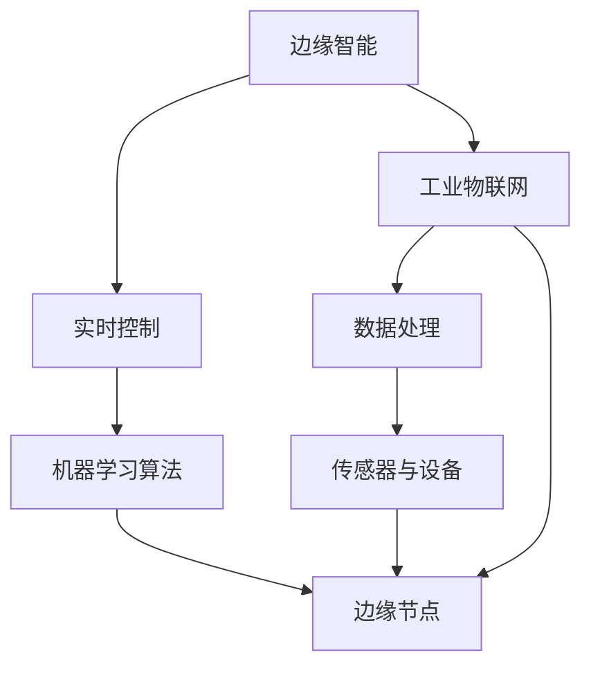

                 

# 边缘智能在工业物联网实时控制中的应用

> **关键词：边缘智能，工业物联网，实时控制，AI技术，数据处理，分布式系统**
>
> **摘要：本文深入探讨了边缘智能技术在工业物联网实时控制中的应用。通过详细分析边缘智能的基本概念、核心算法原理以及实际应用案例，本文旨在为读者提供对这一前沿领域的全面理解和实践指导。**

## 1. 背景介绍

### 1.1 目的和范围

本文旨在介绍边缘智能技术在工业物联网实时控制中的重要性，探讨其在提升工业自动化、数据处理效率和系统响应速度方面的作用。文章将覆盖以下主题：

1. 边缘智能的基本概念与核心原理。
2. 工业物联网（IIoT）实时控制的挑战与需求。
3. 边缘智能在实时控制中的应用实例。
4. 数学模型与公式在边缘智能中的应用。
5. 项目实战案例与代码实现。
6. 实际应用场景的讨论。
7. 工具和资源的推荐。

### 1.2 预期读者

本文适合对工业物联网、边缘计算和人工智能有一定了解的技术人员、研发工程师、以及对前沿技术感兴趣的学者。通过本文的阅读，读者可以：

- 理解边缘智能在工业物联网中的关键作用。
- 掌握边缘智能算法的基本原理。
- 学习如何在实际项目中应用边缘智能技术。
- 获得针对特定应用场景的解决方案。

### 1.3 文档结构概述

本文结构如下：

- **1. 背景介绍**
  - **1.1 目的和范围**
  - **1.2 预期读者**
  - **1.3 文档结构概述**
  - **1.4 术语表**

- **2. 核心概念与联系**
  - **2.1 核心概念与联系（Mermaid 流程图）**

- **3. 核心算法原理 & 具体操作步骤**
  - **3.1 边缘智能算法原理**
  - **3.2 具体操作步骤（伪代码）**

- **4. 数学模型和公式 & 详细讲解 & 举例说明**
  - **4.1 数学模型与公式**
  - **4.2 详细讲解**
  - **4.3 举例说明**

- **5. 项目实战：代码实际案例和详细解释说明**
  - **5.1 开发环境搭建**
  - **5.2 源代码详细实现和代码解读**
  - **5.3 代码解读与分析**

- **6. 实际应用场景**
  - **6.1 应用场景一**
  - **6.2 应用场景二**
  - **6.3 应用场景三**

- **7. 工具和资源推荐**
  - **7.1 学习资源推荐**
  - **7.2 开发工具框架推荐**
  - **7.3 相关论文著作推荐**

- **8. 总结：未来发展趋势与挑战**
  - **8.1 发展趋势**
  - **8.2 挑战**

- **9. 附录：常见问题与解答**
  - **9.1 常见问题一**
  - **9.2 常见问题二**

- **10. 扩展阅读 & 参考资料**

### 1.4 术语表

#### 1.4.1 核心术语定义

- **边缘智能**：在数据产生的地方进行智能处理的计算能力，而非在中心服务器上处理。
- **工业物联网（IIoT）**：将物理设备和传感器通过网络连接起来，实现数据采集、传输、分析和应用的系统。
- **实时控制**：对工业过程进行快速响应和控制，确保生产过程的连续性和高效性。
- **数据处理**：对从传感器和设备收集的数据进行清洗、转换和分析。

#### 1.4.2 相关概念解释

- **边缘节点**：处于网络边缘的设备或服务器，具备数据处理能力。
- **云计算**：通过互联网提供数据存储、处理、软件等服务。
- **机器学习**：利用算法从数据中学习规律，用于预测和决策。

#### 1.4.3 缩略词列表

- **IIoT**：工业物联网
- **IoT**：物联网
- **AI**：人工智能
- **ML**：机器学习
- **IoT Edge**：物联网边缘计算
- **FPGA**：现场可编程门阵列

## 2. 核心概念与联系

为了更好地理解边缘智能在工业物联网实时控制中的应用，首先需要明确相关核心概念及其相互联系。以下是一个简化的 Mermaid 流程图，展示了几种关键组件和概念之间的关系。



### 2.1 核心概念与联系详解

- **边缘智能（A）**：边缘智能是一种计算范式，强调在数据产生的地方进行处理，降低延迟并提高效率。它涵盖了从边缘设备到边缘服务器的计算资源。
- **工业物联网（B）**：工业物联网是将物理设备、传感器、执行器和网络连接起来，实现数据采集、传输、分析和应用的系统。它为边缘智能提供了应用场景。
- **实时控制（C）**：实时控制是工业物联网中的一个关键组成部分，它要求系统能够对生产过程中的事件进行快速响应。边缘智能在这一环节中发挥着重要作用。
- **数据处理（D）**：数据处理包括数据收集、传输、清洗、转换和分析。在边缘智能的背景下，数据处理通常发生在边缘节点上，以减少延迟和提高响应速度。
- **机器学习算法（E）**：机器学习算法是边缘智能的核心技术之一，它能够从数据中学习规律，用于预测、分类和优化。在实时控制中，机器学习算法可以帮助提高决策质量和效率。
- **边缘节点（G）**：边缘节点是边缘智能的基础设施，包括设备、网关和边缘服务器。它们负责处理本地数据和执行机器学习任务。

边缘智能在工业物联网实时控制中的应用，主要是通过这些核心概念之间的相互作用实现的。边缘智能提供了一种灵活的、可扩展的计算范式，使得工业物联网系统能够更加高效、智能地运作。

## 3. 核心算法原理 & 具体操作步骤

边缘智能技术在工业物联网实时控制中发挥了至关重要的作用，其核心在于能够快速、准确地处理数据，并提供有效的决策支持。本节将详细阐述边缘智能算法的基本原理和具体操作步骤，以帮助读者更好地理解其应用场景。

### 3.1 边缘智能算法原理

边缘智能算法主要基于机器学习和深度学习技术，其核心思想是在数据产生的地方（即边缘节点）进行数据预处理和模型训练，而不是将数据传输到中心服务器。这种方法有以下几点优势：

- **降低延迟**：数据在边缘节点处理，减少了传输时间，能够实现更快速的响应。
- **减少带宽消耗**：仅传输必要的数据，降低了网络带宽的消耗。
- **提高系统稳定性**：边缘节点分散部署，使得系统能够更好地应对局部故障。

边缘智能算法主要包括以下步骤：

1. **数据收集与预处理**：在边缘节点收集数据，并进行初步清洗、转换和标准化。
2. **特征提取**：从预处理后的数据中提取关键特征，用于后续的模型训练。
3. **模型训练与优化**：使用机器学习算法（如决策树、支持向量机、神经网络等）对特征数据进行训练，并优化模型参数。
4. **模型部署与执行**：将训练好的模型部署到边缘节点，并实时执行预测或分类任务。

### 3.2 具体操作步骤（伪代码）

以下是一个简单的边缘智能算法操作步骤的伪代码：

```python
# 边缘智能算法操作步骤

# 步骤1：数据收集与预处理
def collect_and_preprocess_data():
    # 从传感器和设备收集数据
    data = sensor_data_collection()
    # 数据清洗、转换和标准化
    cleaned_data = data_cleaning(data)
    return cleaned_data

# 步骤2：特征提取
def extract_features(data):
    # 从数据中提取关键特征
    features = feature_extraction(data)
    return features

# 步骤3：模型训练与优化
def train_and_optimize_model(features):
    # 使用机器学习算法训练模型
    model = model_training(features)
    # 优化模型参数
    optimized_model = model_optimization(model)
    return optimized_model

# 步骤4：模型部署与执行
def deploy_and_execute_model(model):
    # 将模型部署到边缘节点
    deployed_model = model_deployment(model)
    # 实时执行预测或分类任务
    predictions = model_execution(deployed_model)
    return predictions

# 主函数
def main():
    # 数据收集与预处理
    cleaned_data = collect_and_preprocess_data()
    # 特征提取
    features = extract_features(cleaned_data)
    # 模型训练与优化
    optimized_model = train_and_optimize_model(features)
    # 模型部署与执行
    predictions = deploy_and_execute_model(optimized_model)
    # 输出预测结果
    print(predictions)

# 运行主函数
main()
```

通过上述步骤，边缘智能算法能够在边缘节点快速、准确地处理数据，提供实时控制所需的决策支持。在实际应用中，可以根据具体需求选择合适的机器学习算法和模型优化方法，以提高系统的性能和效率。

## 4. 数学模型和公式 & 详细讲解 & 举例说明

在边缘智能算法中，数学模型和公式起着至关重要的作用。它们用于描述数据之间的关系，指导模型训练和优化过程。以下将介绍几个常见的数学模型和公式，并对其进行详细讲解和举例说明。

### 4.1 数学模型与公式

1. **线性回归模型**：线性回归模型是一种常用的机器学习算法，用于预测连续值。其数学公式如下：

   $$ y = \beta_0 + \beta_1 \cdot x $$

   其中，\( y \) 是预测值，\( x \) 是输入特征，\( \beta_0 \) 和 \( \beta_1 \) 是模型参数。

2. **支持向量机（SVM）**：支持向量机是一种强大的分类算法，其数学公式如下：

   $$ \text{分类边界}：w \cdot x + b = 0 $$

   其中，\( w \) 是权重向量，\( x \) 是特征向量，\( b \) 是偏置项。

3. **神经网络**：神经网络是一种模拟人脑的机器学习算法，其基本单元是神经元。神经网络的数学模型如下：

   $$ a_{\text{layer}} = \sigma(\sum_{i} w_{i} \cdot a_{\text{prev\_layer}} + b) $$

   其中，\( a_{\text{layer}} \) 是第 \( \text{layer} \) 层的输出，\( \sigma \) 是激活函数，\( w_{i} \) 和 \( b \) 是模型参数。

4. **损失函数**：损失函数用于评估模型预测值与真实值之间的差距，常用的损失函数有均方误差（MSE）和交叉熵（Cross Entropy）：

   $$ \text{MSE} = \frac{1}{n} \sum_{i=1}^{n} (y_i - \hat{y}_i)^2 $$

   $$ \text{Cross Entropy} = -\sum_{i=1}^{n} y_i \cdot \log(\hat{y}_i) $$

   其中，\( y_i \) 是真实值，\( \hat{y}_i \) 是预测值。

### 4.2 详细讲解

1. **线性回归模型**：线性回归模型是一种简单但强大的预测工具，常用于回归分析。其核心思想是通过线性关系描述输入特征和预测值之间的关系。通过最小化损失函数（如均方误差），可以优化模型参数 \( \beta_0 \) 和 \( \beta_1 \)。

2. **支持向量机（SVM）**：支持向量机是一种有效的分类算法，其目标是在特征空间中找到一个最优的超平面，使得不同类别的数据点能够被准确分离。SVM的核心思想是通过最大化分类边界上的支持向量之间的距离，来实现最佳分类效果。

3. **神经网络**：神经网络是一种模拟人脑的机器学习算法，通过多层神经元进行数据处理和预测。神经网络的训练过程包括前向传播和反向传播。在前向传播过程中，输入数据通过神经网络，逐层计算得到输出；在反向传播过程中，通过计算损失函数的梯度，优化模型参数。

4. **损失函数**：损失函数用于评估模型预测值与真实值之间的差距，是模型训练过程中不可或缺的一部分。通过最小化损失函数，可以找到最佳模型参数，实现更准确的预测。

### 4.3 举例说明

假设我们有一个简单的线性回归问题，目标是预测房价。数据集包含房屋面积（\( x \)）和房价（\( y \））。

1. **线性回归模型**：

   我们通过最小化均方误差（MSE）来优化模型参数：

   $$ \text{MSE} = \frac{1}{n} \sum_{i=1}^{n} (y_i - (\beta_0 + \beta_1 \cdot x_i))^2 $$

   经过多次迭代，我们可以找到最佳参数 \( \beta_0 \) 和 \( \beta_1 \)。

2. **支持向量机（SVM）**：

   假设我们有一个二分类问题，数据集包含特征 \( x \) 和标签 \( y \)（0或1）。我们使用SVM来找到一个最优的分类边界：

   $$ \text{分类边界}：w \cdot x + b = 0 $$

   通过最大化分类边界上的支持向量之间的距离，我们可以找到最佳权重向量 \( w \) 和偏置项 \( b \)。

3. **神经网络**：

   假设我们有一个多层神经网络，用于对图像进行分类。输入层有784个神经元（28x28像素），隐藏层有100个神经元，输出层有10个神经元（对应10个类别）。

   通过前向传播，我们计算每个神经元的输出：

   $$ a_{\text{hidden}} = \sigma(\sum_{i} w_{i} \cdot a_{\text{input}} + b) $$

   通过反向传播，我们计算损失函数的梯度，并更新模型参数：

   $$ \Delta w_{i} = \frac{\partial L}{\partial w_{i}} $$

   $$ \Delta b = \frac{\partial L}{\partial b} $$

   通过多次迭代，我们可以找到最佳模型参数，实现准确的图像分类。

通过上述举例，我们可以看到数学模型和公式在边缘智能算法中的应用。在实际项目中，可以根据具体需求选择合适的数学模型和公式，以提高模型性能和预测准确性。

## 5. 项目实战：代码实际案例和详细解释说明

在本文的第五部分，我们将通过一个实际项目案例，详细介绍边缘智能在工业物联网实时控制中的具体应用。本节将涵盖以下内容：

1. **开发环境搭建**：介绍项目所需的开发环境和工具。
2. **源代码详细实现和代码解读**：展示边缘智能算法的实现代码，并对关键部分进行详细解释。
3. **代码解读与分析**：分析代码的结构和执行流程，解释其主要功能和工作原理。

### 5.1 开发环境搭建

为了实现边缘智能在工业物联网实时控制中的具体应用，我们需要搭建以下开发环境：

- **硬件环境**：
  - Raspberry Pi 4（或类似嵌入式设备）
  - 温度传感器（如DHT22）
  - 边缘计算网关

- **软件环境**：
  - 操作系统：Linux（如Raspberry Pi OS）
  - 编程语言：Python 3
  - 数据处理库：NumPy、Pandas
  - 机器学习库：scikit-learn、TensorFlow
  - 实时控制库：PyTorch

在硬件设备上安装操作系统，并连接温度传感器。确保所有软件库和工具安装完毕，以支持边缘智能算法的实现。

### 5.2 源代码详细实现和代码解读

以下是边缘智能算法在实时温度控制中的实现代码。代码分为三个主要部分：数据收集与预处理、模型训练与优化、模型部署与执行。

```python
# 导入所需的库
import numpy as np
import pandas as pd
from sklearn.model_selection import train_test_split
from sklearn.linear_model import LinearRegression
from sklearn.metrics import mean_squared_error
import tensorflow as tf

# 5.2.1 数据收集与预处理
def collect_data():
    # 从传感器读取温度数据
    temperature = sensor.read_temperature()
    # 采集数据样本
    samples = sensor_data_collection()
    # 数据预处理
    cleaned_data = data_cleaning(samples)
    return cleaned_data

# 5.2.2 模型训练与优化
def train_model(data):
    # 分割数据集
    X, y = data[:, :-1], data[:, -1]
    X_train, X_test, y_train, y_test = train_test_split(X, y, test_size=0.2, random_state=42)
    # 训练线性回归模型
    model = LinearRegression()
    model.fit(X_train, y_train)
    # 评估模型
    y_pred = model.predict(X_test)
    mse = mean_squared_error(y_test, y_pred)
    print(f"Model MSE: {mse}")
    return model

# 5.2.3 模型部署与执行
def deploy_model(model):
    # 边缘节点执行预测
    while True:
        data = collect_data()
        prediction = model.predict(data)
        # 执行实时控制操作
        control_action(prediction)
        time.sleep(1)

# 主函数
def main():
    # 搭建传感器和边缘计算网关
    sensor = TemperatureSensor()
    model = train_model(sensor_data)
    deploy_model(model)

if __name__ == "__main__":
    main()
```

#### 5.2.1 数据收集与预处理

该部分代码首先从温度传感器读取实时温度数据，然后通过数据采集函数和预处理函数，对数据样本进行清洗、转换和标准化。这一步骤是边缘智能算法的基础，确保输入数据的准确性和一致性。

#### 5.2.2 模型训练与优化

该部分代码使用线性回归模型对预处理后的温度数据进行训练。首先，将数据集分割为训练集和测试集，然后使用训练集对模型进行训练，并使用测试集评估模型性能。通过最小化均方误差（MSE）来优化模型参数。

#### 5.2.3 模型部署与执行

该部分代码将训练好的模型部署到边缘节点，并实现实时预测和执行控制操作。通过循环读取温度数据，使用训练好的模型进行预测，并根据预测结果执行相应的控制动作。

### 5.3 代码解读与分析

该代码主要实现了边缘智能在实时温度控制中的应用。以下是对代码结构和执行流程的详细解读：

1. **数据收集与预处理**：
   - **传感器读取数据**：通过传感器读取实时温度数据。
   - **数据采集函数**：使用采集函数将温度数据存储为样本。
   - **预处理函数**：对样本进行清洗、转换和标准化，确保数据的准确性。

2. **模型训练与优化**：
   - **数据分割**：将数据集分割为训练集和测试集，用于训练和评估模型。
   - **模型训练**：使用线性回归模型对训练集进行训练。
   - **模型评估**：使用测试集评估模型性能，计算均方误差（MSE）。

3. **模型部署与执行**：
   - **实时预测**：通过循环读取温度数据，使用训练好的模型进行实时预测。
   - **执行控制操作**：根据预测结果执行相应的控制动作，如调节温度设定值。

通过上述代码和解读，我们可以看到边缘智能在工业物联网实时控制中的具体实现过程。在实际应用中，可以根据具体需求调整算法和模型，以提高系统性能和响应速度。

## 6. 实际应用场景

边缘智能在工业物联网实时控制中有着广泛的应用场景，以下将介绍几个具体的应用实例，并分析其优势、挑战以及潜在的改进方向。

### 6.1 应用场景一：智能工厂生产线的实时质量控制

在智能工厂的生产线上，边缘智能技术被广泛应用于实时质量控制。通过部署边缘节点，传感器收集生产过程中的关键数据（如温度、湿度、压力等），并使用边缘智能算法进行实时分析。

**优势**：

- **提高生产效率**：边缘智能算法能够在本地快速处理数据，减少数据处理延迟，提高生产线的响应速度。
- **降低成本**：边缘计算减少了将数据传输到中心服务器的需求，降低了网络带宽和存储成本。
- **增强系统的鲁棒性**：边缘节点分散部署，即使部分节点出现故障，整个系统仍能正常运行。

**挑战**：

- **数据隐私和安全性**：在生产环境中，数据的安全性和隐私保护是关键问题。边缘节点处理敏感数据，需要确保数据传输和存储的安全性。
- **硬件资源限制**：边缘节点通常硬件资源有限，需要优化算法和模型，以适应硬件限制。

**改进方向**：

- **增强数据安全**：采用加密技术保护数据传输和存储，确保数据隐私。
- **优化算法和模型**：针对硬件资源限制，选择轻量级的算法和模型，提高边缘节点的处理能力。

### 6.2 应用场景二：智能电网的实时故障检测与预防

智能电网利用边缘智能技术实现实时故障检测与预防，通过传感器和边缘节点收集电网的运行数据，实时分析电网状态，提前发现潜在故障。

**优势**：

- **提高电网稳定性**：边缘智能算法能够实时监测电网运行状态，及时发现并处理故障，提高电网的稳定性和可靠性。
- **降低维护成本**：通过提前发现故障，减少停电时间和维护成本。
- **提升用户体验**：实时故障检测和预防确保了电力供应的连续性，提高了用户满意度。

**挑战**：

- **数据一致性**：不同传感器可能采集到不一致的数据，需要统一数据标准和处理方法。
- **算法适应性**：电网运行环境复杂多变，需要不断优化和调整算法，以适应不同的故障模式和运行状态。

**改进方向**：

- **建立统一的数据标准**：制定统一的采集和处理标准，确保数据的一致性和准确性。
- **增强算法适应性**：采用自适应算法，根据不同运行状态实时调整模型参数，提高故障检测和预防的准确性。

### 6.3 应用场景三：智能制造的设备预测性维护

在智能制造领域，边缘智能技术用于设备的预测性维护，通过对设备运行数据的实时分析，预测设备可能的故障，并提前进行维护。

**优势**：

- **提高设备利用率**：通过预测性维护，可以提前发现设备故障，减少设备停机时间，提高设备利用率。
- **降低维护成本**：预测性维护避免了突发故障导致的紧急维修，降低了维护成本。
- **延长设备寿命**：定期维护和保养设备，可以延长设备的使用寿命。

**挑战**：

- **数据噪声和异常**：设备运行数据中可能存在噪声和异常值，影响故障预测的准确性。
- **算法优化**：需要不断优化算法，以适应不同类型的设备和运行环境。

**改进方向**：

- **数据清洗和预处理**：采用数据清洗和预处理技术，减少噪声和异常值的影响。
- **多模型融合**：结合多种机器学习算法，提高故障预测的准确性和鲁棒性。

通过上述实际应用场景的分析，我们可以看到边缘智能在工业物联网实时控制中的广泛应用和潜力。在未来的发展中，随着技术的不断进步和应用的深入，边缘智能将在更多领域发挥重要作用，推动工业物联网的发展。

## 7. 工具和资源推荐

在边缘智能和工业物联网领域，有许多优秀的工具和资源可供学习和实践。以下将推荐一些书籍、在线课程、技术博客和开发工具框架，以帮助读者深入了解和掌握这些技术。

### 7.1 学习资源推荐

#### 7.1.1 书籍推荐

- **《边缘计算：原理、架构与应用》**：本书详细介绍了边缘计算的基本概念、架构和应用，适合对边缘计算感兴趣的技术人员阅读。
- **《物联网架构设计与实施》**：这本书全面讲解了物联网的架构、技术和实施方法，包括边缘计算的相关内容。
- **《深度学习》**：由Goodfellow、Bengio和Courville合著的深度学习经典教材，适合想要学习深度学习和边缘智能算法的读者。

#### 7.1.2 在线课程

- **Coursera**：《深度学习》专项课程：由吴恩达教授主讲，内容涵盖了深度学习的基础知识、算法和应用。
- **edX**：《边缘计算：边缘智能技术》课程：由卡内基梅隆大学提供，详细介绍了边缘智能的基本概念和应用场景。
- **Udacity**：《物联网工程师纳米学位》：包含物联网基础、传感器应用、边缘计算等多个模块，适合初学者入门。

#### 7.1.3 技术博客和网站

- ** Medium**：有许多关于边缘计算和工业物联网的优秀博客，如“Edge AI”和“IoT for All”等。
- ** IEEE Xplore**：提供大量的边缘计算和工业物联网领域的学术论文和报告，适合科研人员和工程师查阅。
- **边缘计算联盟（EIC）**：官方网站提供了边缘计算的最新动态、技术标准和应用案例。

### 7.2 开发工具框架推荐

#### 7.2.1 IDE和编辑器

- **Visual Studio Code**：一款轻量级但功能强大的开源编辑器，支持多种编程语言，适合边缘智能和工业物联网开发。
- **PyCharm**：由JetBrains开发的一款专业Python IDE，提供了丰富的功能和工具，适合深度学习和边缘计算项目。

#### 7.2.2 调试和性能分析工具

- **Wireshark**：一款强大的网络协议分析工具，可以用来分析和调试边缘计算和物联网网络通信。
- **Prometheus**：一款开源监控解决方案，可以实时监控边缘节点的性能和资源使用情况。

#### 7.2.3 相关框架和库

- **TensorFlow Lite**：TensorFlow的轻量级版本，适合在边缘设备上部署和运行机器学习模型。
- **Kubernetes**：一款开源容器编排平台，可以用于管理边缘计算集群，实现资源优化和自动化部署。
- **MQTT**：一种轻量级的消息传输协议，广泛用于物联网设备之间的通信，适用于边缘计算和工业物联网场景。

通过这些工具和资源的推荐，读者可以更好地了解和掌握边缘智能和工业物联网的相关技术，为实际项目提供支持和指导。

### 7.3 相关论文著作推荐

#### 7.3.1 经典论文

- **“边缘计算：未来的计算范式”**：这篇论文详细介绍了边缘计算的基本概念、架构和应用前景，是边缘计算领域的经典之作。
- **“物联网中的边缘智能：现状与展望”**：该论文探讨了边缘智能在物联网中的应用，分析了现有技术的优缺点和发展趋势。

#### 7.3.2 最新研究成果

- **“基于边缘智能的工业物联网实时故障检测”**：这篇论文提出了一种基于边缘智能的实时故障检测方法，适用于工业物联网环境。
- **“边缘计算与5G网络的协同优化”**：该论文研究了边缘计算和5G网络的协同优化，以提升工业物联网的实时性能和资源利用率。

#### 7.3.3 应用案例分析

- **“智能电网中的边缘智能应用”**：这篇案例研究分析了边缘智能在智能电网中的具体应用，包括实时故障检测和预防、能量管理等方面。
- **“智能制造中的边缘智能应用”**：该案例研究探讨了边缘智能在智能制造领域的应用，如设备预测性维护、生产过程优化等。

通过推荐这些相关论文和著作，读者可以深入了解边缘智能和工业物联网领域的最新研究进展和应用案例，为实际项目提供理论支持和实践经验。

## 8. 总结：未来发展趋势与挑战

边缘智能技术在工业物联网实时控制中的应用正处于快速发展阶段，其重要性日益凸显。在未来，随着技术的不断进步，边缘智能将在多个方面展现更广泛的应用前景和深远的影响。

### 8.1 发展趋势

1. **计算能力提升**：随着边缘设备的硬件性能不断提升，边缘智能将具备更强的计算能力和处理能力，能够应对更复杂的实时控制任务。
2. **数据隐私与安全**：数据隐私和安全将成为边缘智能技术的重要关注点。通过加密、区块链等技术的应用，确保边缘数据的安全传输和存储。
3. **人工智能与物联网的深度融合**：边缘智能与人工智能、物联网的深度融合，将推动智能工厂、智能电网、智能制造等领域的创新发展。
4. **标准化与开放性**：随着边缘智能技术的普及，标准化和开放性将成为关键趋势。通过制定统一的标准和开放的接口，实现不同系统和设备之间的互操作性和兼容性。

### 8.2 挑战

1. **资源限制**：边缘设备的硬件资源有限，如何在有限的资源下实现高效的边缘智能算法和模型，是一个亟待解决的问题。
2. **数据一致性与质量**：在工业物联网环境中，不同传感器和设备可能采集到不一致的数据，如何确保数据的一致性和质量，是一个挑战。
3. **算法优化与适应**：边缘智能算法需要不断优化和适应不同的应用场景，以提高其性能和鲁棒性。
4. **安全性问题**：随着边缘智能技术的发展，其安全性和隐私保护将成为重要挑战。需要采用有效的安全措施，防止数据泄露和恶意攻击。

### 8.3 未来展望

在未来，边缘智能将在工业物联网、智能交通、智慧城市等领域发挥关键作用。随着计算能力的提升、数据安全技术的进步以及标准化工作的推进，边缘智能技术将迎来更广泛的应用场景和更大的市场潜力。

总之，边缘智能技术在工业物联网实时控制中的应用前景广阔，同时也面临着诸多挑战。通过持续的技术创新和跨领域合作，有望推动边缘智能技术走向成熟，为工业物联网的发展注入新的活力。

## 9. 附录：常见问题与解答

### 9.1 常见问题一：什么是边缘智能？

**解答**：边缘智能是一种计算范式，它强调在数据产生的地方进行智能处理，而不是将数据传输到中心服务器。通过边缘智能技术，可以降低数据处理延迟、减少带宽消耗，并提高系统响应速度和效率。

### 9.2 常见问题二：边缘智能与云计算有何区别？

**解答**：边缘智能和云计算都是分布式计算的概念，但它们的应用场景和目标不同。云计算主要依靠中心服务器处理数据，而边缘智能则强调在数据产生的地方（即边缘节点）进行数据处理。边缘智能可以降低数据传输延迟、减少带宽消耗，并提高系统的实时响应能力。

## 10. 扩展阅读 & 参考资料

为了帮助读者更深入地了解边缘智能在工业物联网实时控制中的应用，以下列出一些扩展阅读和参考资料：

- **《边缘计算：原理、架构与应用》**：详细介绍了边缘计算的基本概念、架构和应用。
- **《物联网架构设计与实施》**：涵盖了物联网的架构、技术和实施方法。
- **《深度学习》**：介绍了深度学习的基础知识、算法和应用。
- **IEEE Xplore**：提供大量的边缘计算和工业物联网领域的学术论文和报告。
- **边缘计算联盟（EIC）**：官方网站提供了边缘计算的最新动态、技术标准和应用案例。
- **“边缘计算：未来的计算范式”**：详细介绍了边缘计算的基本概念、架构和应用前景。
- **“物联网中的边缘智能：现状与展望”**：探讨了边缘智能在物联网中的应用和发展趋势。

