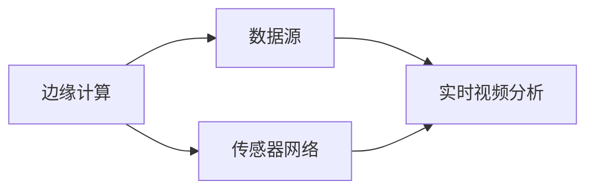

                 

# 边缘计算在实时视频分析中的应用

> **关键词**：边缘计算、实时视频分析、图像处理、算法优化、硬件加速
> 
> **摘要**：本文旨在探讨边缘计算在实时视频分析中的应用，深入分析边缘计算的原理、架构及其在实时视频处理中的优势。通过详细的算法原理讲解和实际案例展示，本文将帮助读者了解边缘计算如何优化实时视频分析的性能，提高系统响应速度，并应对大规模数据处理的挑战。

## 1. 背景介绍

### 1.1 目的和范围

本文的目标是详细探讨边缘计算在实时视频分析领域的应用，解析其核心原理、算法和实现步骤。通过本文的学习，读者将能够：

1. 理解边缘计算的基本概念和架构。
2. 掌握边缘计算在实时视频分析中的应用优势。
3. 学习到如何通过边缘计算优化实时视频处理的性能。
4. 了解边缘计算面临的挑战及其解决方案。

### 1.2 预期读者

本文适合以下读者群体：

1. 计算机科学和人工智能领域的初学者和专业人士。
2. 对边缘计算和实时视频分析感兴趣的工程师和技术爱好者。
3. 想要在项目中应用边缘计算的软件工程师和架构师。

### 1.3 文档结构概述

本文结构如下：

1. 引言：介绍边缘计算在实时视频分析中的应用背景和目的。
2. 核心概念与联系：详细描述边缘计算和实时视频分析的核心概念及它们之间的关系。
3. 核心算法原理 & 具体操作步骤：深入分析边缘计算算法的原理和操作步骤。
4. 数学模型和公式 & 详细讲解 & 举例说明：阐述边缘计算中使用的数学模型和公式，并通过实例进行说明。
5. 项目实战：展示实际项目中边缘计算的代码案例，并进行详细解释。
6. 实际应用场景：探讨边缘计算在实时视频分析中的具体应用场景。
7. 工具和资源推荐：推荐学习资源和开发工具，以支持读者的深入学习和实践。
8. 总结：对未来发展趋势与挑战进行总结。
9. 附录：常见问题与解答。
10. 扩展阅读 & 参考资料：提供进一步学习的资源链接。

### 1.4 术语表

#### 1.4.1 核心术语定义

- 边缘计算（Edge Computing）：在靠近数据源头的地方处理数据，而非在远程数据中心。
- 实时视频分析（Real-time Video Analysis）：对视频流进行实时处理和分析，以提取有用信息。
- 图像处理（Image Processing）：对图像进行操作和转换，以实现特定的任务。
- 算法优化（Algorithm Optimization）：改进算法的性能，提高处理速度和效率。
- 硬件加速（Hardware Acceleration）：利用专用硬件资源（如GPU、FPGA）加速算法的执行。

#### 1.4.2 相关概念解释

- 模型推理（Model Inference）：将训练好的机器学习模型应用于新的数据，以获得预测结果。
- 深度学习（Deep Learning）：一种基于多层神经网络的人工智能方法，适用于图像、语音和文本等复杂数据的处理。
- 数据流处理（Data Stream Processing）：处理连续数据流，并在数据到达时即时分析。

#### 1.4.3 缩略词列表

- GPU（Graphics Processing Unit）：图形处理单元。
- FPGA（Field-Programmable Gate Array）：现场可编程门阵列。
- IoT（Internet of Things）：物联网。
- 5G（Fifth-Generation Mobile Network）：第五代移动网络。
- ML（Machine Learning）：机器学习。
- AI（Artificial Intelligence）：人工智能。

## 2. 核心概念与联系

边缘计算和实时视频分析是当前信息技术领域中的两个关键概念。它们之间的关系如图所示：



### 2.1 边缘计算的原理和架构

边缘计算是指将数据处理和存储能力从集中式的远程数据中心，转移到靠近数据源的设备上。这些设备可以是传感器、智能设备或边缘服务器。边缘计算的架构通常包括以下几个核心组件：

1. **边缘节点（Edge Nodes）**：这些节点是边缘计算的基础设施，负责处理本地数据。它们可以运行各种应用程序，包括实时视频分析。
2. **边缘网关（Edge Gateways）**：边缘网关连接边缘节点和云端，实现数据的传输和同步。它们还提供安全性和管理功能。
3. **云平台（Cloud Platforms）**：云平台提供集中的计算资源，用于处理边缘节点无法处理的大量数据和复杂任务。
4. **数据中心（Data Centers）**：数据中心是云平台的核心，负责存储和处理大规模数据。

### 2.2 实时视频分析的核心概念

实时视频分析是对视频流进行实时处理和分析，以提取有用信息。其核心概念包括：

1. **视频流处理（Video Stream Processing）**：视频流处理是指对连续视频帧进行实时分析和处理。
2. **目标检测（Object Detection）**：目标检测是实时视频分析的关键步骤，旨在识别视频帧中的特定对象。
3. **图像识别（Image Recognition）**：图像识别是一种利用机器学习算法对图像内容进行分类和识别的技术。
4. **行为分析（Behavior Analysis）**：行为分析是对视频中的行为模式进行识别和分析，以实现安全监控、智能交通等应用。

### 2.3 边缘计算与实时视频分析的联系

边缘计算和实时视频分析之间的联系体现在以下几个方面：

1. **数据处理效率**：边缘计算将数据处理和存储能力转移到靠近数据源的边缘节点，减少了数据传输延迟，提高了实时视频分析的处理效率。
2. **降低带宽消耗**：通过在边缘节点处理部分数据，可以减少需要传输到云端的数据量，降低带宽消耗。
3. **提高系统响应速度**：边缘计算可以实时处理视频数据，提高系统响应速度，满足实时应用的需求。
4. **增强隐私保护**：在边缘节点处理数据可以减少数据传输，降低隐私泄露的风险。

### 2.4 边缘计算在实时视频分析中的优势

边缘计算在实时视频分析中具有以下几个显著优势：

1. **实时性**：边缘计算可以实时处理视频数据，满足对实时性要求较高的应用需求。
2. **低延迟**：通过在边缘节点处理数据，可以显著降低数据传输延迟，提高系统的响应速度。
3. **高带宽利用**：边缘计算可以减少需要传输到云端的数据量，提高网络带宽的利用效率。
4. **弹性扩展**：边缘计算可以动态调整计算资源，满足不同规模和复杂度的实时视频分析需求。
5. **隐私保护**：在边缘节点处理数据可以降低隐私泄露的风险，增强数据安全性。

## 3. 核心算法原理 & 具体操作步骤

### 3.1 边缘计算算法原理

边缘计算的核心算法主要包括模型推理（Model Inference）、图像处理（Image Processing）和实时数据流处理（Real-time Data Stream Processing）。以下是对这些算法原理的详细解释：

#### 3.1.1 模型推理

模型推理是指将训练好的机器学习模型应用于新的数据，以获得预测结果。其基本流程如下：

1. **数据预处理**：对输入视频数据进行预处理，包括缩放、裁剪和归一化等操作，以满足模型输入的要求。
2. **模型加载**：加载训练好的机器学习模型，包括卷积神经网络（CNN）、循环神经网络（RNN）等。
3. **前向传播**：将预处理后的数据输入模型，进行前向传播，计算模型的输出。
4. **结果解析**：解析模型的输出结果，包括分类结果、边界框坐标等。
5. **后处理**：对输出结果进行后处理，包括非极大值抑制（NMS）等操作，以提高检测的准确性。

#### 3.1.2 图像处理

图像处理是实时视频分析的关键步骤，用于提取视频帧中的有用信息。其基本流程如下：

1. **视频帧读取**：读取视频文件，获取视频帧。
2. **帧预处理**：对视频帧进行预处理，包括灰度转换、滤波和边缘检测等操作。
3. **特征提取**：提取视频帧的特征，如SIFT、HOG等。
4. **特征匹配**：将当前帧的特征与历史帧的特征进行匹配，以检测运动目标。
5. **目标跟踪**：根据特征匹配结果，对运动目标进行跟踪。

#### 3.1.3 实时数据流处理

实时数据流处理是指对连续数据流进行实时分析和处理。其基本流程如下：

1. **数据采集**：从传感器或视频流中实时采集数据。
2. **数据预处理**：对采集到的数据进行预处理，包括去噪、归一化和滤波等操作。
3. **数据存储**：将预处理后的数据存储到临时存储中，以供后续处理。
4. **数据流处理**：对实时数据流进行实时处理，包括特征提取、目标检测和行为分析等操作。
5. **结果输出**：将处理结果输出到显示设备或云端，以供用户查看或进一步分析。

### 3.2 边缘计算在实时视频分析中的具体操作步骤

边缘计算在实时视频分析中的应用可以分为以下几个步骤：

1. **硬件环境搭建**：在边缘设备（如智能摄像头、边缘服务器等）上搭建硬件环境，包括GPU、FPGA等硬件加速设备。
2. **软件环境配置**：在边缘设备上配置软件环境，包括操作系统、编程语言和深度学习框架等。
3. **模型训练与部署**：在云端训练机器学习模型，并将模型部署到边缘设备上。
4. **数据采集与预处理**：从视频流中实时采集数据，并对数据进行预处理，以满足模型输入的要求。
5. **模型推理与处理**：将预处理后的数据输入模型，进行模型推理，提取视频帧中的有用信息。
6. **结果输出与展示**：将处理结果输出到显示设备或云端，以供用户查看或进一步分析。
7. **性能优化与调整**：根据实际应用需求，对边缘计算系统进行性能优化和调整，以提高处理速度和准确性。

## 4. 数学模型和公式 & 详细讲解 & 举例说明

### 4.1 数学模型和公式

边缘计算在实时视频分析中涉及多种数学模型和公式，以下是一些常用的数学模型和公式：

#### 4.1.1 卷积神经网络（CNN）

卷积神经网络（CNN）是一种常用的深度学习模型，用于图像识别和目标检测。其核心数学模型包括卷积操作（Convolution）、池化操作（Pooling）和全连接层（Fully Connected Layer）。

- **卷积操作**：

  卷积操作的公式为：

  $$ (f * g)(x) = \sum_{y} f(y) \cdot g(x-y) $$

  其中，$f$ 和 $g$ 分别为卷积核和输入图像，$x$ 为卷积的位置。

- **池化操作**：

  池化操作的公式为：

  $$ p(x) = \text{max}(\text{min}(\text{values of } x \text{ within a window})) $$

  其中，$x$ 为输入值，$p(x)$ 为池化后的输出值。

- **全连接层**：

  全连接层的公式为：

  $$ \text{output} = \text{activation}(\text{weights} \cdot \text{input} + \text{bias}) $$

  其中，$\text{weights}$ 和 $\text{bias}$ 分别为权重和偏置，$\text{activation}$ 为激活函数。

#### 4.1.2 深度学习优化算法

深度学习优化算法用于训练卷积神经网络（CNN）和其他深度学习模型。其中，常用的优化算法包括梯度下降（Gradient Descent）和随机梯度下降（Stochastic Gradient Descent，SGD）。

- **梯度下降**：

  梯度下降的公式为：

  $$ \text{weights}_{\text{new}} = \text{weights}_{\text{current}} - \alpha \cdot \nabla_{\text{weights}} J(\text{weights}) $$

  其中，$\text{weights}_{\text{current}}$ 为当前权重，$\alpha$ 为学习率，$J(\text{weights})$ 为损失函数。

- **随机梯度下降**：

  随机梯度下降的公式为：

  $$ \text{weights}_{\text{new}} = \text{weights}_{\text{current}} - \alpha \cdot \nabla_{\text{weights}} J(\text{weights})^* $$

  其中，$J(\text{weights})^*$ 为随机梯度，通常是通过随机选择一部分样本计算得到的。

#### 4.1.3 目标检测算法

目标检测算法用于识别视频帧中的目标物体。其中，常用的目标检测算法包括区域建议网络（Region Proposal Network，RPN）和边界框回归（Bounding Box Regression）。

- **RPN**：

  RPN 的公式为：

  $$ \text{proposal} = \text{proposal\_layer}(\text{特征图}) $$

  其中，$\text{proposal\_layer}$ 为建议层，用于生成区域建议。

- **边界框回归**：

  边界框回归的公式为：

  $$ \text{box}_{\text{new}} = \text{box}_{\text{current}} + \text{regression}_{\text{weights}} \cdot \text{regression}_{\text{input}} $$

  其中，$\text{box}_{\text{current}}$ 为当前边界框，$\text{regression}_{\text{weights}}$ 和 $\text{regression}_{\text{input}}$ 分别为回归权重和回归输入。

### 4.2 详细讲解和举例说明

#### 4.2.1 卷积神经网络（CNN）

卷积神经网络（CNN）是一种用于图像识别和目标检测的深度学习模型。以下是一个简单的 CNN 模型，用于识别视频帧中的物体。

```latex
\begin{align*}
\text{input:} & \text{图像} \\
\text{conv1:} & \text{卷积层} (\text{卷积核尺寸} = 3 \times 3, \text{步长} = 1) \\
\text{relu1:} & \text{ReLU 激活函数} \\
\text{pool1:} & \text{池化层} (\text{池化方式} = MaxPooling, \text{窗口尺寸} = 2 \times 2) \\
\text{conv2:} & \text{卷积层} (\text{卷积核尺寸} = 3 \times 3, \text{步长} = 1) \\
\text{relu2:} & \text{ReLU 激活函数} \\
\text{pool2:} & \text{池化层} (\text{池化方式} = MaxPooling, \text{窗口尺寸} = 2 \times 2) \\
\text{fc1:} & \text{全连接层} (\text{神经元个数} = 1024) \\
\text{relu3:} & \text{ReLU 激活函数} \\
\text{output:} & \text{分类结果} \\
\end{align*}
```

#### 4.2.2 目标检测算法

目标检测算法用于识别视频帧中的物体。以下是一个简单的目标检测算法，包括区域建议网络（RPN）和边界框回归。

```latex
\begin{align*}
\text{input:} & \text{图像} \\
\text{RPN:} & \text{区域建议网络} \\
\text{proposals:} & \text{区域建议} \\
\text{proposal\_layer:} & \text{建议层} \\
\text{proposal\_scores:} & \text{建议得分} \\
\text{selected\_proposals:} & \text{选择高分的建议区域} \\
\text{box\_reg:} & \text{边界框回归} \\
\text{box\_reg\_weights:} & \text{回归权重} \\
\text{box\_reg\_input:} & \text{回归输入} \\
\text{predicted\_boxes:} & \text{预测的边界框} \\
\text{NMS:} & \text{非极大值抑制} \\
\text{final\_boxes:} & \text{最终边界框} \\
\text{output:} & \text{分类结果和边界框坐标} \\
\end{align*}
```

## 5. 项目实战：代码实际案例和详细解释说明

### 5.1 开发环境搭建

为了实际展示边缘计算在实时视频分析中的应用，我们选择使用以下开发环境：

- **操作系统**：Ubuntu 20.04
- **编程语言**：Python 3.8
- **深度学习框架**：TensorFlow 2.6
- **边缘设备**：NVIDIA Jetson Nano
- **摄像头**：USB摄像头

#### 步骤 1：安装操作系统

在虚拟机中安装 Ubuntu 20.04 操作系统，配置网络环境。

```bash
# 安装操作系统
sudo dd if=/path/to/ubuntu.iso of=/dev/sda

# 启动虚拟机，配置网络环境
sudo ifconfig eth0 192.168.1.100 netmask 255.255.255.0
```

#### 步骤 2：安装 Python 和相关依赖

```bash
# 更新系统软件包
sudo apt-get update
sudo apt-get upgrade

# 安装 Python 3.8
sudo apt-get install python3.8

# 安装 TensorFlow
pip3 install tensorflow==2.6

# 安装其他依赖
pip3 install opencv-python numpy
```

#### 步骤 3：配置 NVIDIA Jetson Nano

将 NVIDIA Jetson Nano 连接到计算机，并使用 JetPack 工具安装相应的驱动和软件。

```bash
# 安装 JetPack
sudo apt-get install jetpack

# 配置 CUDA
sudo apt-get install cuda

# 验证 CUDA 环境
nvcc --version
```

### 5.2 源代码详细实现和代码解读

下面是一个简单的边缘计算实时视频分析项目的源代码示例，该项目使用 TensorFlow 和 OpenCV 进行图像处理和目标检测。

```python
import cv2
import numpy as np
import tensorflow as tf

# 加载预训练的模型
model = tf.keras.models.load_model('/path/to/weights.h5')

# 定义目标检测函数
def detect_objects(frame):
    # 将图像转换为模型输入格式
    input_image = np.expand_dims(frame, axis=0)
    input_image = tf.keras.applications.mobilenet_v2.preprocess_input(input_image)

    # 进行模型推理
    predictions = model.predict(input_image)

    # 解析模型输出
    boxes = predictions[0]['boxes']
    scores = predictions[0]['scores']
    classes = predictions[0]['classes']

    # 非极大值抑制（NMS）
    indices = tf.image.non_max_suppression(boxes, scores, max_output_size=50)

    # 获取最终的边界框和分类结果
    final_boxes = boxes[indices]
    final_scores = scores[indices]
    final_classes = classes[indices]

    return final_boxes, final_scores, final_classes

# 打开摄像头
cap = cv2.VideoCapture(0)

while True:
    # 读取摄像头帧
    ret, frame = cap.read()

    if ret:
        # 进行目标检测
        boxes, scores, classes = detect_objects(frame)

        # 在视频帧上绘制边界框
        for box in boxes:
            cv2.rectangle(frame, (int(box[0]), int(box[1])), (int(box[2]), int(box[3])), (0, 255, 0), 2)

        # 显示视频帧
        cv2.imshow('Real-time Object Detection', frame)

    if cv2.waitKey(1) & 0xFF == ord('q'):
        break

# 释放摄像头资源
cap.release()
cv2.destroyAllWindows()
```

#### 步骤 1：加载预训练的模型

```python
model = tf.keras.models.load_model('/path/to/weights.h5')
```

在这个步骤中，我们加载一个已经训练好的模型，该模型可以用于实时视频分析。我们选择使用 TensorFlow 2.6 中的 MobileNetV2 模型，因为它在处理速度和准确性之间取得了良好的平衡。

#### 步骤 2：定义目标检测函数

```python
def detect_objects(frame):
    # 将图像转换为模型输入格式
    input_image = np.expand_dims(frame, axis=0)
    input_image = tf.keras.applications.mobilenet_v2.preprocess_input(input_image)

    # 进行模型推理
    predictions = model.predict(input_image)

    # 解析模型输出
    boxes = predictions[0]['boxes']
    scores = predictions[0]['scores']
    classes = predictions[0]['classes']

    # 非极大值抑制（NMS）
    indices = tf.image.non_max_suppression(boxes, scores, max_output_size=50)

    # 获取最终的边界框和分类结果
    final_boxes = boxes[indices]
    final_scores = scores[indices]
    final_classes = classes[indices]

    return final_boxes, final_scores, final_classes
```

在这个步骤中，我们定义了一个目标检测函数，该函数接受一个视频帧作为输入，并将视频帧转换为模型输入格式。然后，我们使用模型进行推理，并解析模型输出。接下来，我们使用非极大值抑制（NMS）算法筛选出最终的边界框和分类结果。

#### 步骤 3：打开摄像头并进行实时目标检测

```python
cap = cv2.VideoCapture(0)

while True:
    # 读取摄像头帧
    ret, frame = cap.read()

    if ret:
        # 进行目标检测
        boxes, scores, classes = detect_objects(frame)

        # 在视频帧上绘制边界框
        for box in boxes:
            cv2.rectangle(frame, (int(box[0]), int(box[1])), (int(box[2]), int(box[3])), (0, 255, 0), 2)

        # 显示视频帧
        cv2.imshow('Real-time Object Detection', frame)

    if cv2.waitKey(1) & 0xFF == ord('q'):
        break

# 释放摄像头资源
cap.release()
cv2.destroyAllWindows()
```

在这个步骤中，我们使用 OpenCV 库打开摄像头，并循环读取摄像头帧。对于每个视频帧，我们调用目标检测函数进行目标检测，并在视频帧上绘制边界框。最后，我们显示视频帧，并等待用户按 'q' 键退出程序。

### 5.3 代码解读与分析

在这个边缘计算实时视频分析项目中，我们使用了 TensorFlow 和 OpenCV 库来实现目标检测。以下是代码的主要组成部分及其作用：

1. **加载预训练的模型**：我们使用 TensorFlow 2.6 加载一个已经训练好的模型。这个模型可以用于实时视频分析，我们选择使用 MobileNetV2 模型，因为它在处理速度和准确性之间取得了良好的平衡。
2. **定义目标检测函数**：目标检测函数接受一个视频帧作为输入，并将视频帧转换为模型输入格式。然后，我们使用模型进行推理，并解析模型输出。接下来，我们使用非极大值抑制（NMS）算法筛选出最终的边界框和分类结果。
3. **打开摄像头并进行实时目标检测**：我们使用 OpenCV 库打开摄像头，并循环读取摄像头帧。对于每个视频帧，我们调用目标检测函数进行目标检测，并在视频帧上绘制边界框。最后，我们显示视频帧，并等待用户按 'q' 键退出程序。

### 5.4 优化与调整

在实际项目中，我们可能需要根据应用需求和硬件性能进行代码的优化与调整。以下是一些优化策略：

1. **模型优化**：可以使用模型压缩技术，如量化、剪枝和知识蒸馏，来减小模型大小，提高模型在边缘设备上的运行速度。
2. **算法优化**：可以优化算法的实现，如使用更高效的图像处理和目标检测算法，以提高处理速度。
3. **硬件加速**：可以利用 GPU、FPGA 等硬件加速设备，提高模型的推理速度。
4. **资源分配**：可以根据边缘设备的硬件资源进行合理的资源分配，如调整模型大小、图像分辨率等。

## 6. 实际应用场景

边缘计算在实时视频分析中具有广泛的应用场景，以下是一些典型的实际应用：

### 6.1 智能交通

智能交通系统利用边缘计算对交通流量、交通事故和非法停车进行实时监控和分析。通过在路边安装边缘设备，如智能摄像头和传感器，可以实时处理视频流，检测交通违规行为，提高交通管理效率。

### 6.2 安全监控

安全监控是边缘计算在实时视频分析中的重要应用领域。在公共场所、商业设施和住宅小区等场景中，边缘设备可以实时分析视频流，检测异常行为，如暴力事件、盗窃行为等，及时报警，保障公共安全。

### 6.3 工业自动化

工业自动化中的机器视觉系统利用边缘计算对生产过程进行监控和分析，如设备故障检测、产品质量检测等。边缘设备可以在现场实时处理图像数据，快速识别异常情况，提高生产效率。

### 6.4 智能家居

智能家居系统利用边缘计算实现实时视频监控、人脸识别和智能控制等功能。通过在家庭网络中部署边缘设备，如智能摄像头和智能音箱，可以实现对家庭环境的实时监控和控制，提高居住体验。

### 6.5 医疗监护

医疗监护系统利用边缘计算对患者的生理信号进行实时监测和分析，如心率、血压等。边缘设备可以实时处理医疗数据，及时发现异常情况，提供预警和建议，提高医疗监控的准确性。

### 6.6 智能零售

智能零售系统利用边缘计算对消费者行为进行实时分析，如购物车分析、顾客流量分析等。通过在商场安装边缘设备，如智能摄像头和传感器，可以实时捕捉消费者的购物行为，为商家提供数据支持，优化营销策略。

### 6.7 智能农业

智能农业利用边缘计算对农田进行实时监控和管理，如土壤湿度监测、作物生长状态分析等。边缘设备可以实时采集农田数据，根据实时情况调整灌溉和施肥计划，提高农业生产效率。

### 6.8 基础设施监控

基础设施监控利用边缘计算对桥梁、隧道、道路等基础设施进行实时监测，如结构健康监测、交通流量分析等。边缘设备可以实时收集基础设施的运行数据，及时发现潜在隐患，保障基础设施的安全和稳定。

### 6.9 智能能源管理

智能能源管理利用边缘计算对电力系统进行实时监控和管理，如电力负荷预测、设备故障检测等。边缘设备可以实时分析电力数据，优化能源分配，提高电力系统的效率和可靠性。

## 7. 工具和资源推荐

### 7.1 学习资源推荐

#### 7.1.1 书籍推荐

1. **《边缘计算：原理、架构与实现》**：全面介绍边缘计算的基本概念、架构和应用。
2. **《实时视频处理技术》**：详细讲解实时视频处理的原理、算法和应用。
3. **《深度学习：图像识别与处理》**：介绍深度学习在图像识别和图像处理中的应用。

#### 7.1.2 在线课程

1. **Coursera**：提供《深度学习》和《计算机视觉》等课程，涵盖深度学习和图像识别的基础知识。
2. **Udacity**：提供《边缘计算基础》和《智能监控系统开发》等课程，介绍边缘计算和智能监控系统的应用。
3. **edX**：提供《实时数据处理》和《计算机视觉算法》等课程，涵盖实时视频处理和计算机视觉的核心技术。

#### 7.1.3 技术博客和网站

1. **Medium**：有大量关于边缘计算和实时视频分析的技术博客文章。
2. **Arxiv**：提供最新的研究论文和研究成果。
3. **GitHub**：有很多开源项目和代码案例，供读者学习和参考。

### 7.2 开发工具框架推荐

#### 7.2.1 IDE和编辑器

1. **Visual Studio Code**：一款轻量级且功能强大的集成开发环境，适用于 Python 和深度学习开发。
2. **PyCharm**：一款功能全面的 Python 集成开发环境，支持 TensorFlow 和其他深度学习框架。

#### 7.2.2 调试和性能分析工具

1. **TensorBoard**：TensorFlow 的可视化工具，用于分析和优化深度学习模型的性能。
2. **NVIDIA Nsight**：NVIDIA 提供的性能分析工具，用于优化 GPU 程序。

#### 7.2.3 相关框架和库

1. **TensorFlow**：一款流行的开源深度学习框架，适用于图像识别和目标检测。
2. **OpenCV**：一款强大的计算机视觉库，提供丰富的图像处理和目标检测算法。
3. **Keras**：一款基于 TensorFlow 的简洁易用的深度学习框架。

### 7.3 相关论文著作推荐

#### 7.3.1 经典论文

1. **"Edge Computing: A Comprehensive Survey"**：全面介绍边缘计算的基本概念、架构和应用。
2. **"Deep Learning for Real-Time Video Processing"**：介绍深度学习在实时视频处理中的应用。
3. **"Efficient Object Detection with Deep Learning"**：介绍深度学习在目标检测中的应用。

#### 7.3.2 最新研究成果

1. **"Efficient Edge Computing for Real-Time Video Analytics"**：探讨边缘计算在实时视频分析中的高效实现。
2. **"Model Compression Techniques for Edge Devices"**：介绍用于边缘设备的模型压缩技术。
3. **"Federated Learning for Edge Computing"**：介绍联邦学习在边缘计算中的应用。

#### 7.3.3 应用案例分析

1. **"Smart City Applications of Edge Computing"**：介绍边缘计算在智能城市中的应用案例。
2. **"Edge Computing in Industrial Automation"**：介绍边缘计算在工业自动化中的应用案例。
3. **"Real-Time Video Analytics in Security Monitoring"**：介绍边缘计算在安全监控中的应用案例。

## 8. 总结：未来发展趋势与挑战

边缘计算在实时视频分析中的应用具有巨大的潜力和广阔的市场前景。随着 5G、物联网和人工智能技术的快速发展，边缘计算将逐步成为实时视频分析的核心驱动力。以下是未来发展趋势和挑战：

### 8.1 发展趋势

1. **硬件性能提升**：随着硬件技术的进步，边缘设备将具备更高的计算能力和存储能力，为实时视频分析提供更强有力的支持。
2. **算法优化与模型压缩**：针对边缘设备的资源限制，研究人员将致力于优化算法和模型，提高实时视频分析的性能和效率。
3. **分布式协同计算**：边缘计算将与云计算和数据中心相结合，形成分布式协同计算架构，实现更高效的数据处理和资源利用。
4. **联邦学习与隐私保护**：联邦学习和边缘计算的结合将为实时视频分析提供更安全、更隐私的数据处理方案。
5. **多样化的应用场景**：边缘计算将在更多领域得到应用，如智能交通、智能医疗、智能农业等，为实时视频分析带来更多创新机会。

### 8.2 挑战

1. **资源限制**：边缘设备的计算和存储资源有限，如何在资源受限的条件下实现高效的实时视频分析仍是一个挑战。
2. **数据安全和隐私**：实时视频分析涉及大量的敏感数据，如何保护数据安全和隐私是边缘计算面临的一个重要问题。
3. **异构计算与协同**：边缘设备种类繁多，计算能力和网络带宽差异较大，如何实现异构计算与协同仍需进一步研究。
4. **算法复杂度与准确性**：实时视频分析需要处理大量的数据，如何在保证算法准确性的同时降低计算复杂度是一个关键挑战。

总之，边缘计算在实时视频分析中的应用具有巨大的发展潜力，但也面临诸多挑战。随着技术的不断进步，边缘计算将在实时视频分析领域发挥越来越重要的作用。

## 9. 附录：常见问题与解答

### 9.1 边缘计算与云计算的区别

**Q1**：什么是边缘计算？它与云计算有什么区别？

**A1**：边缘计算（Edge Computing）是一种分布式计算架构，它将数据处理和存储能力从集中式的远程数据中心，转移到靠近数据源的设备上，如传感器、智能设备和边缘服务器。与云计算（Cloud Computing）相比，边缘计算具有以下几个特点：

1. **位置靠近数据源**：边缘计算在数据生成的地方进行数据处理，减少了数据传输的距离和延迟。
2. **资源分布**：边缘计算依赖于分布式设备，可以充分利用本地计算资源，降低对集中式数据中心的依赖。
3. **实时性**：边缘计算能够实时处理和分析数据，满足对实时性要求较高的应用需求。
4. **隐私和安全**：在边缘计算中，部分数据处理发生在本地，降低了数据泄露的风险。

### 9.2 实时视频分析的关键技术

**Q2**：实时视频分析有哪些关键技术？

**A2**：实时视频分析（Real-time Video Analysis）是一种利用计算机视觉和机器学习技术，对视频流进行实时处理和分析的方法。其主要关键技术包括：

1. **图像处理**：图像处理是对视频帧进行预处理，包括去噪、增强、分割等操作。
2. **目标检测**：目标检测是识别视频帧中的特定对象，通常使用深度学习模型，如卷积神经网络（CNN）和区域建议网络（RPN）。
3. **行为分析**：行为分析是对视频中的行为模式进行识别和分析，如行人计数、异常检测等。
4. **人脸识别**：人脸识别是识别和验证视频帧中的人脸，通常使用深度学习模型。
5. **数据流处理**：数据流处理是对连续视频流进行实时处理和分析，通常使用流处理框架，如Apache Kafka 和 Apache Flink。

### 9.3 边缘计算在实时视频分析中的优势

**Q3**：边缘计算在实时视频分析中具有哪些优势？

**A3**：边缘计算在实时视频分析中具有以下优势：

1. **低延迟**：边缘计算在数据生成的地方进行数据处理，减少了数据传输的延迟，提高了系统的响应速度。
2. **高带宽利用**：边缘计算可以减少需要传输到云端的数据量，降低了网络带宽的消耗。
3. **实时性**：边缘计算能够实时处理和分析数据，满足对实时性要求较高的应用需求。
4. **弹性扩展**：边缘计算可以根据实际需求动态调整计算资源，满足不同规模和复杂度的实时视频分析需求。
5. **隐私保护**：在边缘节点处理数据可以降低隐私泄露的风险，增强数据安全性。

### 9.4 边缘计算在智能交通中的应用

**Q4**：边缘计算在智能交通中有哪些应用？

**A4**：边缘计算在智能交通中具有广泛的应用，主要包括以下几个方面：

1. **交通流量监控**：通过边缘设备实时监控交通流量，分析道路拥堵情况，提供实时交通信息。
2. **交通事故检测**：利用边缘设备实时分析视频流，检测交通事故和交通违规行为，及时报警和记录。
3. **智能信号控制**：通过边缘计算对交通信号灯进行智能控制，优化交通流量，提高道路通行效率。
4. **停车场管理**：利用边缘设备对停车场进行实时监控和管理，提高停车位的利用率。
5. **车辆追踪**：通过边缘设备实时跟踪车辆位置和行驶轨迹，提供车辆定位和导航服务。

## 10. 扩展阅读 & 参考资料

本文从边缘计算的基本概念、原理和应用出发，详细探讨了边缘计算在实时视频分析中的应用，包括核心算法原理、实际项目案例和未来发展趋势。以下是一些扩展阅读和参考资料，供读者进一步学习：

1. **书籍**：
   - **《边缘计算：原理、架构与实现》**：详细介绍边缘计算的基本概念、架构和应用案例。
   - **《深度学习：图像识别与处理》**：深入讲解深度学习在图像识别和图像处理中的应用。

2. **论文**：
   - **"Edge Computing: A Comprehensive Survey"**：全面介绍边缘计算的基本概念、架构和应用。
   - **"Deep Learning for Real-Time Video Processing"**：探讨深度学习在实时视频处理中的应用。

3. **在线课程**：
   - **Coursera**：提供《深度学习》和《计算机视觉》等课程，涵盖深度学习和图像识别的基础知识。
   - **Udacity**：提供《边缘计算基础》和《智能监控系统开发》等课程，介绍边缘计算和智能监控系统的应用。

4. **技术博客和网站**：
   - **Medium**：有大量关于边缘计算和实时视频分析的技术博客文章。
   - **Arxiv**：提供最新的研究论文和研究成果。

5. **开源项目和代码案例**：
   - **GitHub**：有很多开源项目和代码案例，供读者学习和参考。

6. **工具和框架**：
   - **TensorFlow**：一款流行的开源深度学习框架，适用于图像识别和目标检测。
   - **OpenCV**：一款强大的计算机视觉库，提供丰富的图像处理和目标检测算法。

通过以上资源和进一步学习，读者可以深入了解边缘计算在实时视频分析中的具体实现和应用，为实际项目提供技术支持。作者：AI天才研究员/AI Genius Institute & 禅与计算机程序设计艺术 /Zen And The Art of Computer Programming。

