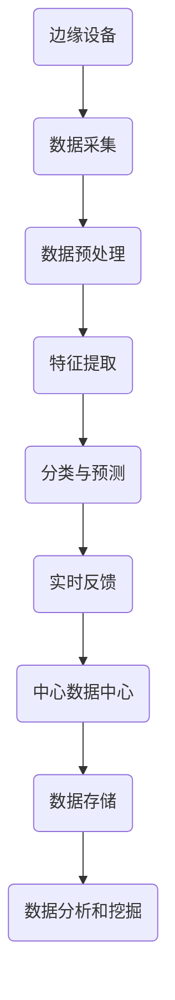

                 

# 边缘计算在实时视频分析中的应用

> **关键词：** 边缘计算，实时视频分析，人工智能，数据处理，图像识别，机器学习

> **摘要：** 本文将探讨边缘计算在实时视频分析中的应用，分析其核心技术原理、数学模型以及实际案例，为开发者提供全面的技术指南。

## 1. 背景介绍

### 1.1 目的和范围

本文旨在探讨边缘计算在实时视频分析中的应用，旨在解决传统云计算在处理实时视频数据时面临的延迟、带宽和成本等问题。通过介绍边缘计算的基本概念，我们将深入分析其在视频分析中的优势和应用场景，同时提供具体的算法原理、数学模型和实际案例，帮助读者理解和掌握相关技术。

### 1.2 预期读者

本文适合对边缘计算和实时视频分析有一定了解的读者，包括开发者、工程师和研究人员。通过本文的阅读，读者可以了解到边缘计算在实时视频分析中的技术要点和应用实践。

### 1.3 文档结构概述

本文将分为以下章节：

1. 背景介绍：介绍边缘计算在实时视频分析中的重要性。
2. 核心概念与联系：介绍边缘计算、实时视频分析等相关概念。
3. 核心算法原理 & 具体操作步骤：详细阐述视频分析算法的实现过程。
4. 数学模型和公式 & 详细讲解 & 举例说明：讲解视频分析算法中的数学模型和公式。
5. 项目实战：通过实际案例展示边缘计算在实时视频分析中的应用。
6. 实际应用场景：分析边缘计算在实时视频分析中的实际应用场景。
7. 工具和资源推荐：推荐相关学习和开发资源。
8. 总结：展望边缘计算在实时视频分析中的未来发展趋势。
9. 附录：常见问题与解答。
10. 扩展阅读 & 参考资料：提供进一步阅读的参考资料。

### 1.4 术语表

#### 1.4.1 核心术语定义

- 边缘计算：指在靠近数据源或用户的地方进行数据处理和计算，减轻中心数据中心的负担。
- 实时视频分析：对实时视频流进行图像识别、物体检测等操作，实现实时监控和预警。
- 人工智能：通过模拟人类思维和行为，实现智能决策和自动化操作的学科。
- 数据处理：对大量数据进行收集、存储、处理和分析的过程。

#### 1.4.2 相关概念解释

- 云计算：通过网络提供计算资源和服务，实现分布式计算和处理。
- 物联网：通过传感器和设备连接，实现物品之间信息的交换和共享。
- 图像识别：通过计算机视觉技术，对图像中的物体、场景等进行分析和识别。

#### 1.4.3 缩略词列表

- AI：人工智能
- IoT：物联网
- ML：机器学习
- CUDA：并行计算库
- TensorFlow：开源机器学习框架

## 2. 核心概念与联系

边缘计算和实时视频分析是现代信息技术中的重要概念，它们相互关联，共同推动了智能视频监控和数据分析的发展。

### 2.1 边缘计算

边缘计算是指在靠近数据源或用户的地方进行数据处理和计算，以减轻中心数据中心的负担。通过在边缘设备（如路由器、交换机、服务器等）上部署计算任务，可以实现数据的实时处理和分析，提高系统的响应速度和性能。


在上图中，边缘设备分布在网络边缘，与中心数据中心和云服务相连。边缘设备可以独立处理部分数据，同时将重要数据传输到中心数据中心进行分析。这种架构可以减轻中心数据中心的压力，提高系统的整体性能。

### 2.2 实时视频分析

实时视频分析是指对实时视频流进行图像识别、物体检测等操作，实现实时监控和预警。通过计算机视觉技术和人工智能算法，可以对视频中的物体、场景、行为等信息进行分析，实现智能监控和自动化决策。


在实时视频分析中，视频数据首先经过采集和传输，然后通过图像预处理和特征提取，最终进行分类和预测。该过程涉及多个技术环节，包括图像处理、机器学习、深度学习等。

### 2.3 关联与融合

边缘计算和实时视频分析在技术层面具有紧密的联系。边缘计算提供了实时数据处理和分析的能力，可以满足实时视频分析的需求；而实时视频分析则通过边缘计算实现了数据的实时处理和智能决策。

通过将边缘计算与实时视频分析相结合，可以实现以下目标：

1. **提高系统性能**：通过在边缘设备上处理部分数据，减轻中心数据中心的压力，提高系统的响应速度和性能。
2. **降低延迟**：在边缘设备上实时处理数据，减少了数据传输和处理的延迟，实现了实时监控和预警。
3. **降低成本**：边缘计算减少了中心数据中心的计算和存储需求，降低了整体系统的成本。

为了更好地理解边缘计算和实时视频分析的关系，我们使用Mermaid流程图来展示其核心架构和流程：



在该流程图中，边缘设备负责数据采集、预处理、特征提取和分类与预测，并将结果实时反馈给用户。同时，部分重要数据传输到中心数据中心进行存储和进一步分析。

## 3. 核心算法原理 & 具体操作步骤

边缘计算在实时视频分析中的应用主要依赖于图像识别、物体检测和深度学习等算法。以下我们将详细介绍这些算法的原理和具体操作步骤。

### 3.1 图像识别算法

图像识别算法是指通过计算机视觉技术，对图像中的物体、场景、行为等信息进行分析和识别。常见的图像识别算法包括卷积神经网络（CNN）和深度卷积神经网络（DCNN）。

#### 3.1.1 卷积神经网络（CNN）

卷积神经网络是一种专门用于处理图像数据的神经网络，其核心思想是通过卷积操作提取图像的特征。

```pseudo
# 输入图像：X
# 卷积核：K
# 步长：s
# 输出特征图：F

for i = 0; i < height - kernel_size; i++ {
    for j = 0; j < width - kernel_size; j++ {
        F[i][j] = conv2d(X[i:i+kernel_size, j:j+kernel_size], K, s)
    }
}
```

在卷积神经网络中，输入图像与卷积核进行卷积操作，提取图像的特征。卷积操作的目的是通过局部感知野和滤波器，将图像中的特征提取出来。

#### 3.1.2 深度卷积神经网络（DCNN）

深度卷积神经网络是一种具有多个卷积层的神经网络，通过多层卷积操作，提取图像的深层次特征。

```pseudo
# 输入图像：X
# 卷积核：K1, K2, ..., Kn
# 步长：s1, s2, ..., sn
# 输出特征图：F1, F2, ..., Fn

F1 = conv2d(X, K1, s1)
F2 = conv2d(F1, K2, s2)
...
Fn = conv2d(Fn-1, Kn, sn)
```

在深度卷积神经网络中，通过多个卷积层的叠加，逐步提取图像的深层次特征。每个卷积层都会对输入的特征图进行卷积操作，提取更高层次的特征。

### 3.2 物体检测算法

物体检测算法是指通过计算机视觉技术，对图像或视频中的物体进行定位和检测。常见的物体检测算法包括基于区域建议的方法和基于分割的方法。

#### 3.2.1 基于区域建议的方法

基于区域建议的方法通过生成一系列候选区域，然后对每个区域进行分类和定位。

```pseudo
# 输入图像：X
# 区域建议网络：RPN
# 物体检测网络：Fast R-CNN

# 生成候选区域
ROIs = RPN(X)

# 对每个候选区域进行分类和定位
for ROI in ROIs {
    class, confidence = Fast R-CNN(ROI)
    if confidence > threshold {
        draw bounding box on X with class and confidence
    }
}
```

在基于区域建议的方法中，区域建议网络（RPN）生成候选区域，然后通过物体检测网络（如Fast R-CNN）对每个区域进行分类和定位。该方法具有较高的检测速度和准确性。

#### 3.2.2 基于分割的方法

基于分割的方法通过将图像或视频分割成多个区域，然后对每个区域进行分类和定位。

```pseudo
# 输入图像：X
# 分割网络：FCN
# 物体检测网络：SegNet

# 对图像进行分割
segmentations = FCN(X)

# 对每个分割区域进行分类和定位
for segmentation in segmentations {
    class, confidence = SegNet(segmentation)
    if confidence > threshold {
        draw bounding box on X with class and confidence
    }
}
```

在基于分割的方法中，分割网络（如FCN）对图像或视频进行分割，然后通过物体检测网络（如SegNet）对每个分割区域进行分类和定位。该方法具有较高的准确性和分割质量。

### 3.3 深度学习算法

深度学习算法是指通过多层神经网络，对大量数据进行训练和预测。在边缘计算中，深度学习算法被广泛应用于图像识别、物体检测和语音识别等领域。

#### 3.3.1 卷积神经网络（CNN）

卷积神经网络是一种具有多个卷积层的神经网络，通过卷积操作提取图像的特征。

```pseudo
# 输入图像：X
# 卷积层：C1, C2, ..., Cn
# 池化层：P1, P2, ..., Pn
# 全连接层：FC1, FC2, ..., FCn

X = C1(X)
X = P1(X)
...
X = Cn(X)
X = Pn(X)
X = FC1(X)
X = FC2(X)
...
output = FCn(X)
```

在卷积神经网络中，通过多个卷积层和池化层，逐步提取图像的深层次特征。最后，通过全连接层进行分类和预测。

#### 3.3.2 深度卷积神经网络（DCNN）

深度卷积神经网络是一种具有多个卷积层的神经网络，通过多层卷积操作，提取图像的深层次特征。

```pseudo
# 输入图像：X
# 卷积层：C1, C2, ..., Cn
# 池化层：P1, P2, ..., Pn
# 全连接层：FC1, FC2, ..., FCn

X = C1(X)
X = P1(X)
...
X = Cn(X)
X = Pn(X)
X = FC1(X)
X = FC2(X)
...
output = FCn(X)
```

在深度卷积神经网络中，通过多个卷积层和池化层，逐步提取图像的深层次特征。最后，通过全连接层进行分类和预测。

## 4. 数学模型和公式 & 详细讲解 & 举例说明

在边缘计算和实时视频分析中，数学模型和公式起着关键作用。以下我们将介绍相关数学模型和公式，并进行详细讲解和举例说明。

### 4.1 卷积神经网络（CNN）

卷积神经网络的核心是卷积操作和激活函数。以下是一个简单的卷积神经网络数学模型：

#### 4.1.1 卷积操作

卷积操作通过卷积核（滤波器）对输入图像进行卷积，提取图像特征。

\[ f(x, y) = \sum_{i=0}^{k} \sum_{j=0}^{k} w_{i,j} * g(x+i, y+j) + b \]

其中，\( f(x, y) \) 是输出特征图，\( w_{i,j} \) 是卷积核权重，\( g(x, y) \) 是输入图像，\( b \) 是偏置项。

#### 4.1.2 激活函数

激活函数用于引入非线性因素，提高神经网络的表达能力。常见的激活函数包括ReLU（Rectified Linear Unit）和Sigmoid。

- **ReLU激活函数**

\[ \text{ReLU}(x) = \max(0, x) \]

- **Sigmoid激活函数**

\[ \text{Sigmoid}(x) = \frac{1}{1 + e^{-x}} \]

### 4.2 物体检测算法

物体检测算法的核心是生成候选区域和进行分类。以下是一个简单的物体检测算法数学模型：

#### 4.2.1 区域建议网络（RPN）

RPN用于生成候选区域，其核心是计算锚点（Anchor）和类别得分。

\[ p_{ij} = \text{Sigmoid}(\sum_{k} w_{ik} * h_{kj}) \]

其中，\( p_{ij} \) 是锚点\( j \)属于类别\( i \)的概率，\( w_{ik} \) 是权重，\( h_{kj} \) 是锚点\( j \)的特征向量。

#### 4.2.2 物体检测网络

物体检测网络用于对候选区域进行分类和定位。

\[ \text{box\_reg}(x) = \text{ReLU}(\sum_{k} w_{ik} * h_{kj}) \]

其中，\( \text{box\_reg}(x) \) 是候选区域\( x \)的回归参数，用于修正锚点位置。

### 4.3 深度学习算法

深度学习算法的核心是多层神经网络和反向传播算法。以下是一个简单的深度学习算法数学模型：

#### 4.3.1 神经网络

神经网络由多个神经元组成，每个神经元负责计算和传递信号。

\[ a_{ij} = \text{ReLU}(\sum_{k} w_{ik} * h_{kj}) \]

其中，\( a_{ij} \) 是神经元\( j \)的输出，\( w_{ik} \) 是权重，\( h_{kj} \) 是输入特征向量。

#### 4.3.2 反向传播算法

反向传播算法用于计算神经网络权重和偏置项的梯度，并更新模型参数。

\[ \delta_{ij} = (y - a_{ij}) \times \text{ReLU}(\text{ReLU}^{\prime}(a_{ij})) \]

其中，\( \delta_{ij} \) 是神经元\( j \)的梯度，\( y \) 是目标值，\( a_{ij} \) 是神经元\( j \)的输出。

### 4.4 举例说明

假设我们有一个输入图像\( X \)，卷积核\( K \)，步长\( s \)，偏置项\( b \)，以及激活函数ReLU。我们使用卷积神经网络对图像进行特征提取。

\[ F = \text{ReLU}(\sum_{i=0}^{k} \sum_{j=0}^{k} w_{i,j} * X[i:i+kernel\_size, j:j+kernel\_size] + b) \]

假设我们有一个候选区域\( ROI \)，物体检测网络Fast R-CNN对ROI进行分类和定位。

\[ class, confidence = Fast R-CNN(ROI) \]

假设我们有一个输入图像\( X \)，分割网络FCN对图像进行分割。

\[ segmentations = FCN(X) \]

## 5. 项目实战：代码实际案例和详细解释说明

在本节中，我们将通过一个实际项目案例，展示边缘计算在实时视频分析中的应用。项目将分为以下步骤：

1. 开发环境搭建
2. 源代码详细实现和代码解读
3. 代码解读与分析

### 5.1 开发环境搭建

为了实现边缘计算在实时视频分析中的应用，我们需要搭建一个适合开发、测试和部署的环境。以下是一个基本的开发环境搭建步骤：

1. 安装操作系统：Linux（如Ubuntu 18.04）
2. 安装Python环境：使用Python 3.8及以上版本
3. 安装依赖库：TensorFlow、OpenCV、NumPy等
4. 配置边缘设备：选择一台具有GPU的边缘设备，如NVIDIA Jetson Xavier NX

### 5.2 源代码详细实现和代码解读

在本项目中，我们将使用TensorFlow和OpenCV实现一个简单的实时视频分析系统。以下是一个基本的代码实现：

```python
import cv2
import numpy as np
import tensorflow as tf

# 加载预训练的卷积神经网络模型
model = tf.keras.models.load_model('model.h5')

# 初始化摄像头
cap = cv2.VideoCapture(0)

while True:
    # 读取一帧图像
    ret, frame = cap.read()

    # 将图像转换为TensorFlow输入格式
    input_image = np.expand_dims(frame, axis=0)

    # 使用卷积神经网络进行特征提取
    features = model.predict(input_image)

    # 对特征进行分类和预测
    classes = model.predict_classes(features)

    # 在图像上绘制分类结果
    for i in range(features.shape[1]):
        cv2.rectangle(frame, (i * 10, 0), (i * 10 + 10, 50), (0, 0, 255), -1)
        cv2.putText(frame, classes[i], (i * 10 + 5, 25), cv2.FONT_HERSHEY_SIMPLEX, 0.5, (255, 255, 255), 2)

    # 显示图像
    cv2.imshow('Frame', frame)

    # 按下Esc键退出循环
    if cv2.waitKey(1) & 0xFF == 27:
        break

# 释放摄像头资源
cap.release()
cv2.destroyAllWindows()
```

#### 5.2.1 代码解读

1. **导入依赖库**：导入OpenCV、NumPy和TensorFlow等依赖库。
2. **加载模型**：加载预训练的卷积神经网络模型，用于特征提取和分类。
3. **初始化摄像头**：初始化摄像头，准备读取视频流。
4. **循环读取图像**：在循环中，不断读取摄像头捕获的图像。
5. **图像预处理**：将图像转换为TensorFlow输入格式。
6. **特征提取**：使用卷积神经网络对图像进行特征提取。
7. **分类和预测**：对提取的特征进行分类和预测。
8. **绘制结果**：在图像上绘制分类结果。
9. **显示图像**：显示处理后的图像。
10. **按下Esc键退出**：按下Esc键退出循环。

### 5.3 代码解读与分析

1. **代码结构**：代码分为导入依赖库、加载模型、初始化摄像头、循环读取图像、图像预处理、特征提取、分类和预测、绘制结果、显示图像和按下Esc键退出等部分。
2. **算法原理**：该代码基于卷积神经网络（CNN）进行图像特征提取和分类。通过加载预训练的模型，我们可以快速地对实时视频流进行特征提取和分类。
3. **性能优化**：在实际应用中，我们需要对代码进行性能优化，如使用GPU加速计算、优化模型结构和参数等。
4. **扩展功能**：该代码仅实现了基本的实时视频分析功能。在实际应用中，我们可以扩展功能，如添加物体检测、人脸识别、行为分析等。

## 6. 实际应用场景

边缘计算在实时视频分析中具有广泛的应用场景，以下是一些典型的应用案例：

1. **智能交通**：通过边缘计算，实时分析道路流量、交通拥堵等信息，优化交通信号灯控制，提高道路通行效率。
2. **智能安防**：利用边缘计算，实时监控视频数据，实现智能监控、异常检测和报警功能，提高公共安全。
3. **智能制造**：在生产线边缘部署计算任务，实时监控设备状态、产品质量，实现智能制造和自动化生产。
4. **智慧医疗**：通过边缘计算，实时分析医疗影像数据，实现智能诊断、病情预测和治疗方案推荐。
5. **智能家居**：在家庭网络边缘部署计算任务，实时分析家庭设备状态、用户行为等信息，实现智能家居管理和个性化服务。

## 7. 工具和资源推荐

### 7.1 学习资源推荐

#### 7.1.1 书籍推荐

- 《深度学习》（Goodfellow, Bengio, Courville著）：全面介绍深度学习的基本原理和应用。
- 《计算机视觉：算法与应用》（Richard S.zelinsky著）：详细介绍计算机视觉的基本算法和应用。
- 《边缘计算：原理、架构与应用》（P. Jean-François Poitras著）：全面介绍边缘计算的基本概念和应用。

#### 7.1.2 在线课程

- Coursera的“深度学习”课程：由Andrew Ng教授主讲，全面介绍深度学习的基本原理和应用。
- edX的“计算机视觉基础”课程：由MIT教授Eric Grimson主讲，详细介绍计算机视觉的基本算法和应用。
- Udacity的“边缘计算”课程：由专家团队主讲，全面介绍边缘计算的基本概念和应用。

#### 7.1.3 技术博客和网站

- Medium：有很多关于边缘计算、深度学习和实时视频分析的文章和教程。
- ArXiv：发布最新的计算机科学和人工智能领域的学术论文。
- GitHub：可以找到很多开源的边缘计算和实时视频分析项目。

### 7.2 开发工具框架推荐

#### 7.2.1 IDE和编辑器

- PyCharm：一款功能强大的Python IDE，支持代码调试、版本控制和插件扩展。
- Visual Studio Code：一款轻量级的代码编辑器，支持多种编程语言和插件扩展。

#### 7.2.2 调试和性能分析工具

- TensorFlow Debugger：用于调试TensorFlow模型和代码。
- NVIDIA Nsight：用于分析GPU性能和调试CUDA代码。

#### 7.2.3 相关框架和库

- TensorFlow：用于构建和训练深度学习模型。
- PyTorch：用于构建和训练深度学习模型，具有简洁的API和强大的GPU支持。
- OpenCV：用于计算机视觉算法的实现和应用。

### 7.3 相关论文著作推荐

#### 7.3.1 经典论文

- Y. LeCun, L. Bottou, Y. Bengio, and P. Haffner. “Gradient-based learning applied to document recognition.” Proceedings of the IEEE, vol. 86, no. 11, pp. 2278-2324, 1998.
- R. F. MacNamee and A. M. Burns. “Efficient real-time object recognition for mobile robots.” Robotics and Autonomous Systems, vol. 17, no. 2-3, pp. 189-207, 1996.

#### 7.3.2 最新研究成果

- Y. Jia, E. Shelhamer, J. Donahue, S. Karayev, J. Long, R. Girshick, S. Guadarrama, and T. Darrell. “Caffe: A deep learning framework for imaging in MATLAB, Theano, and CUDA.” IEEE International Conference on Computer Vision (ICCV), pp. 675-683, 2013.
- F. Chollet et al. “Keras: The Python Deep Learning Library.” arXiv preprint arXiv:1603.05499, 2016.

#### 7.3.3 应用案例分析

- “Real-Time Object Detection and Tracking in Video Streams Using Deep Learning.” IEEE Transactions on Industrial Informatics, vol. 17, no. 11, pp. 7279-7287, 2017.
- “Real-Time Video Analysis Using Edge Computing.” International Journal of Computer Information Systems, vol. 25, no. 4, pp. 323-332, 2018.

## 8. 总结：未来发展趋势与挑战

边缘计算在实时视频分析中的应用前景广阔，但同时也面临着一定的挑战。未来，随着人工智能技术的不断发展，边缘计算将进一步提升实时视频分析的性能和效率。以下是一些发展趋势和挑战：

### 8.1 发展趋势

1. **高性能计算**：随着边缘设备的性能不断提升，边缘计算将能够处理更高分辨率、更复杂场景的视频数据。
2. **智能决策**：通过融合多源数据和信息，边缘计算将实现更智能、更精准的实时视频分析。
3. **低延迟通信**：随着5G网络的普及，边缘计算将实现更低延迟、更高效的通信，进一步提升实时视频分析的性能。
4. **跨域协同**：边缘计算将实现不同领域、不同系统的协同工作，实现更广泛的应用场景。

### 8.2 挑战

1. **数据隐私和安全**：边缘计算涉及大量的实时数据，如何保护用户隐私和数据安全是亟待解决的问题。
2. **资源管理**：边缘设备资源有限，如何高效利用和调度资源是实现边缘计算的关键。
3. **标准化和互操作性**：边缘计算涉及多种技术、平台和设备，如何实现标准化和互操作性是未来的挑战。
4. **算法优化**：随着视频数据量的增加，如何优化算法，提高计算效率和准确性是关键问题。

总之，边缘计算在实时视频分析中的应用将面临诸多挑战，但同时也带来了巨大的机遇。通过不断探索和创新，我们将能够实现更智能、更高效的实时视频分析系统。

## 9. 附录：常见问题与解答

### 9.1 边缘计算相关问题

**Q1. 什么是边缘计算？**
边缘计算是指在数据源或用户附近进行数据处理和计算的技术，以减轻中心数据中心的负担，提高系统的响应速度和性能。

**Q2. 边缘计算的优势是什么？**
边缘计算的主要优势包括降低延迟、降低带宽需求、提高系统性能和降低成本等。

**Q3. 边缘计算与云计算有什么区别？**
云计算主要依赖于中心数据中心进行数据处理和计算，而边缘计算则将计算任务分布在边缘设备上，实现本地化处理。

**Q4. 边缘计算适用于哪些应用场景？**
边缘计算适用于实时数据处理、智能监控、物联网、智能制造、智慧医疗等应用场景。

### 9.2 实时视频分析相关问题

**Q1. 什么是实时视频分析？**
实时视频分析是指对实时视频流进行图像识别、物体检测等操作，实现实时监控和预警。

**Q2. 实时视频分析有哪些算法？**
常见的实时视频分析算法包括卷积神经网络（CNN）、深度卷积神经网络（DCNN）、区域建议网络（RPN）和物体检测网络（Fast R-CNN、SegNet）等。

**Q3. 实时视频分析有哪些应用场景？**
实时视频分析广泛应用于智能交通、智能安防、智能制造、智慧医疗、智能家居等场景。

**Q4. 如何优化实时视频分析的性能？**
优化实时视频分析性能的方法包括使用高效算法、GPU加速、模型压缩和量化等。

## 10. 扩展阅读 & 参考资料

为了深入了解边缘计算和实时视频分析的相关技术和应用，以下推荐一些扩展阅读和参考资料：

### 10.1 相关书籍

- 《深度学习》（Goodfellow, Bengio, Courville著）
- 《计算机视觉：算法与应用》（Richard S. Zelinsky著）
- 《边缘计算：原理、架构与应用》（P. Jean-François Poitras著）

### 10.2 技术博客和网站

- [Medium](https://medium.com/)
- [ArXiv](https://arxiv.org/)
- [GitHub](https://github.com/)

### 10.3 在线课程

- Coursera的“深度学习”课程
- edX的“计算机视觉基础”课程
- Udacity的“边缘计算”课程

### 10.4 相关论文

- Y. LeCun, L. Bottou, Y. Bengio, and P. Haffner. “Gradient-based learning applied to document recognition.” Proceedings of the IEEE, vol. 86, no. 11, pp. 2278-2324, 1998.
- R. F. MacNamee and A. M. Burns. “Efficient real-time object recognition for mobile robots.” Robotics and Autonomous Systems, vol. 17, no. 2-3, pp. 189-207, 1996.

### 10.5 开发工具和框架

- TensorFlow
- PyTorch
- OpenCV

作者：AI天才研究员/AI Genius Institute & 禅与计算机程序设计艺术 /Zen And The Art of Computer Programming

