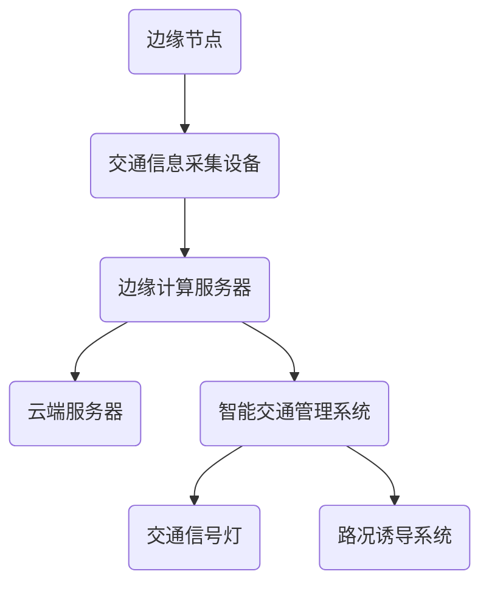

                 


# 边缘计算在智能交通系统中的实践

> **关键词：边缘计算、智能交通系统、边缘节点、实时数据处理、数据隐私、物联网**
> 
> **摘要：本文将深入探讨边缘计算在智能交通系统中的应用，通过分析边缘计算的基本概念、架构、核心算法原理以及具体操作步骤，结合实际项目实战，详细解析边缘计算在智能交通领域的实践。同时，本文还将讨论边缘计算在智能交通系统中的实际应用场景，并提供相关的学习资源、开发工具框架推荐以及未来发展趋势与挑战。**

## 1. 背景介绍

### 1.1 目的和范围

本文旨在探讨边缘计算技术在智能交通系统中的实际应用，通过详细解析边缘计算的基本原理、架构设计、核心算法和具体操作步骤，为智能交通系统的开发者和研究者提供理论指导和实践参考。文章将重点关注以下几个方面：

1. 边缘计算的概念和核心优势。
2. 智能交通系统的需求和挑战。
3. 边缘计算在智能交通系统中的架构设计和应用场景。
4. 核心算法原理和数学模型的详细讲解。
5. 实际项目实战中的代码实现和分析。
6. 相关学习资源、开发工具框架和未来发展趋势的推荐。

### 1.2 预期读者

本文适合以下读者群体：

1. 对边缘计算和智能交通系统感兴趣的IT专业人士。
2. 智能交通系统的开发者和研究者。
3. 对计算机科学和物联网技术有深入了解的技术爱好者。
4. 智能交通系统相关领域的学生和研究生。

### 1.3 文档结构概述

本文将按照以下结构进行展开：

1. 背景介绍：介绍文章的目的、范围、预期读者和文档结构。
2. 核心概念与联系：详细讲解边缘计算和智能交通系统的基本概念和联系。
3. 核心算法原理 & 具体操作步骤：深入分析边缘计算在智能交通系统中的应用原理和操作步骤。
4. 数学模型和公式 & 详细讲解 & 举例说明：阐述边缘计算中的数学模型和公式的应用。
5. 项目实战：结合实际项目，展示边缘计算在智能交通系统中的具体实现。
6. 实际应用场景：分析边缘计算在智能交通系统中的实际应用场景。
7. 工具和资源推荐：提供相关的学习资源、开发工具框架推荐。
8. 总结：对未来发展趋势与挑战进行展望。
9. 附录：常见问题与解答。
10. 扩展阅读 & 参考资料：推荐相关的文献和资源。

### 1.4 术语表

#### 1.4.1 核心术语定义

- 边缘计算（Edge Computing）：将数据处理、存储和应用程序的运行从云端转移到网络的边缘，即接近数据源的位置。
- 智能交通系统（Intelligent Transportation System，ITS）：利用先进的信息通信技术、数据采集和处理技术等，实现交通信息的实时采集、处理和分析，为交通管理和出行服务提供支持。
- 边缘节点（Edge Node）：边缘计算中的计算节点，用于处理和存储本地数据，并与云端进行通信。
- 实时数据处理（Real-time Data Processing）：对采集到的交通数据进行实时分析、处理和反馈，以满足交通管理和决策需求。

#### 1.4.2 相关概念解释

- 物联网（Internet of Things，IoT）：将物理设备通过网络连接起来，实现设备间的信息交换和协同工作。
- 大数据（Big Data）：数据量大、类型多、速度快的数据集合，需要利用先进的技术和方法进行存储、处理和分析。
- 数据隐私（Data Privacy）：保护个人信息和隐私不被非法获取和滥用。

#### 1.4.3 缩略词列表

- ITS：智能交通系统（Intelligent Transportation System）
- IoT：物联网（Internet of Things）
- AI：人工智能（Artificial Intelligence）
- ML：机器学习（Machine Learning）
- DP：数据隐私（Data Privacy）

## 2. 核心概念与联系

边缘计算和智能交通系统是现代信息技术中的重要概念，它们在技术原理和架构设计上有着密切的联系。

### 2.1 边缘计算的基本概念

边缘计算是一种分布式计算架构，将数据处理、存储和应用程序的运行从传统的中心化云计算环境转移到网络的边缘，即接近数据源的位置。边缘计算的核心思想是降低数据传输的延迟，提高数据处理的速度和效率，同时减少对中心化云服务的依赖。

边缘计算的主要特点包括：

- **数据处理本地化**：边缘节点可以处理本地数据，减轻了中心化云服务器的负担。
- **低延迟**：边缘计算降低了数据传输的距离，从而减少了数据传输的延迟。
- **高带宽**：边缘计算利用了网络边缘的宽带资源，提高了数据传输的速度。
- **增强安全性**：边缘计算可以减少数据在网络中的传输量，降低了数据泄露的风险。

### 2.2 智能交通系统的基本概念

智能交通系统（ITS）是一种利用先进的信息通信技术、数据采集和处理技术等，实现交通信息的实时采集、处理和分析，为交通管理和出行服务提供支持的综合系统。ITS的目标是提高交通效率、减少交通事故、降低环境污染，提升出行体验。

智能交通系统的主要组成部分包括：

- **交通信息采集**：利用传感器、摄像头、雷达等设备采集交通数据，如车辆速度、流量、路况等。
- **数据处理与分析**：对采集到的交通数据进行实时分析，识别交通状况，为交通管理和决策提供支持。
- **交通管理**：通过交通信息分析和预测，对交通信号灯、路况诱导等进行智能调控，优化交通流。
- **出行服务**：为出行者提供实时交通信息、路线规划、导航等智能服务。

### 2.3 边缘计算与智能交通系统的联系

边缘计算与智能交通系统在技术原理和架构设计上有着紧密的联系。

- **数据处理效率**：边缘计算可以降低数据传输的延迟，提高数据处理的速度，从而提升智能交通系统的实时性。
- **分布式架构**：智能交通系统中的数据处理和分析需要分布在不同地理位置的边缘节点上，边缘计算提供了一种分布式架构，能够满足智能交通系统的需求。
- **数据隐私和安全**：边缘计算可以减少数据在网络中的传输量，降低数据泄露的风险，提高智能交通系统的数据隐私和安全。
- **资源节约**：边缘计算可以减轻中心化云服务器的负担，节约计算资源和能源消耗，降低运营成本。

为了更好地展示边缘计算和智能交通系统的架构联系，下面给出一个Mermaid流程图：



图2.1 边缘计算与智能交通系统的架构联系

在上面的流程图中，边缘节点A通过交通信息采集设备B采集到交通数据，然后传输到边缘计算服务器C进行初步处理和分析。边缘计算服务器C与云端服务器D进行通信，将分析结果传输到智能交通管理系统E。智能交通管理系统E负责交通信号灯F和路况诱导系统G的智能调控，以提高交通效率和安全性。

## 3. 核心算法原理 & 具体操作步骤

边缘计算在智能交通系统中的应用，离不开核心算法原理的支持。本节将详细阐述边缘计算中的核心算法原理，并通过伪代码的形式给出具体操作步骤。

### 3.1 数据采集

边缘计算的第一步是数据采集。在智能交通系统中，数据采集主要通过交通信息采集设备（如传感器、摄像头、雷达等）进行。以下是一个简单的数据采集算法：

```python
def data_collection():
    # 初始化采集设备
    sensor = initialize_sensor()

    # 循环采集数据
    while True:
        # 采集车辆速度
        vehicle_speed = sensor.get_vehicle_speed()

        # 采集车辆流量
        vehicle_flow = sensor.get_vehicle_flow()

        # 采集路况信息
        road_condition = sensor.get_road_condition()

        # 存储采集到的数据
        store_data(vehicle_speed, vehicle_flow, road_condition)

        # 等待一定时间继续采集
        time.sleep(SAMPLING_INTERVAL)
```

在上面的伪代码中，`initialize_sensor()` 函数用于初始化采集设备，`get_vehicle_speed()`、`get_vehicle_flow()` 和 `get_road_condition()` 函数分别用于采集车辆速度、车辆流量和路况信息，`store_data()` 函数用于存储采集到的数据，`time.sleep(SAMPLING_INTERVAL)` 函数用于设置采集间隔时间。

### 3.2 数据预处理

采集到的数据可能包含噪声、异常值和冗余信息，因此需要对数据进行预处理。数据预处理主要包括数据清洗、数据去噪、数据归一化和特征提取等。以下是一个简单的数据预处理算法：

```python
def data_preprocessing(data):
    # 数据清洗
    clean_data = remove_noise(data)

    # 数据去噪
    denoise_data = remove_outliers(clean_data)

    # 数据归一化
    normalized_data = normalize(denoise_data)

    # 特征提取
    features = extract_features(normalized_data)

    return features
```

在上面的伪代码中，`remove_noise()` 函数用于数据清洗，`remove_outliers()` 函数用于数据去噪，`normalize()` 函数用于数据归一化，`extract_features()` 函数用于特征提取。

### 3.3 数据分析

边缘计算的核心是对采集到的数据进行实时分析，以识别交通状况、预测交通流量、优化交通信号灯等。以下是一个简单的数据分析算法：

```python
def data_analysis(features):
    # 识别交通状况
    traffic_status = identify_traffic_status(features)

    # 预测交通流量
    traffic_flow = predict_traffic_flow(features)

    # 优化交通信号灯
    signal_optimization = optimize_traffic_signals(traffic_status, traffic_flow)

    return signal_optimization
```

在上面的伪代码中，`identify_traffic_status()` 函数用于识别交通状况，`predict_traffic_flow()` 函数用于预测交通流量，`optimize_traffic_signals()` 函数用于优化交通信号灯。

### 3.4 数据传输

边缘计算中的数据分析结果需要传输到智能交通管理系统进行进一步处理。以下是一个简单的数据传输算法：

```python
def data_transmission(signal_optimization, edge_node):
    # 初始化边缘节点
    edge_node.initialize()

    # 循环传输数据
    while True:
        # 传输数据分析结果
        edge_node.send(signal_optimization)

        # 等待一定时间继续传输
        time.sleep(TRANSMISSION_INTERVAL)

    # 关闭边缘节点
    edge_node.close()
```

在上面的伪代码中，`initialize()` 函数用于初始化边缘节点，`send()` 函数用于传输数据分析结果，`time.sleep(TRANSMISSION_INTERVAL)` 函数用于设置传输间隔时间，`close()` 函数用于关闭边缘节点。

通过上述核心算法原理和具体操作步骤，边缘计算在智能交通系统中的应用变得清晰明了。在实际应用中，可以根据具体需求对算法进行优化和调整，以提高系统的性能和效率。

## 4. 数学模型和公式 & 详细讲解 & 举例说明

边缘计算在智能交通系统中，需要运用多种数学模型和公式来进行数据的分析、预测和优化。本节将详细介绍这些数学模型和公式，并通过具体例子进行说明。

### 4.1 交通流量预测模型

交通流量预测是智能交通系统中的一个关键任务，常用的模型包括时间序列模型、回归模型和深度学习模型等。

#### 时间序列模型

时间序列模型用于预测未来的交通流量，基于历史数据的统计特性进行建模。以下是一个简单的时间序列预测模型：

$$
\hat{y}_t = \alpha + \beta_1 y_{t-1} + \beta_2 y_{t-2} + ... + \beta_n y_{t-n} + \epsilon_t
$$

其中，$y_t$ 表示第 $t$ 时刻的交通流量，$\hat{y}_t$ 表示预测的交通流量，$\alpha$、$\beta_1$、$\beta_2$、...、$\beta_n$ 为模型参数，$\epsilon_t$ 为随机误差。

**例子**：假设有一个城市路口的历史交通流量数据如下：

| 时间（小时） | 交通流量（辆/小时） |
| :---------: | :----------------: |
|      0      |         200        |
|      1      |         210        |
|      2      |         220        |
|      3      |         230        |
|      4      |         240        |
|      5      |         250        |

使用上述时间序列模型进行预测，取 $n=3$，拟合模型参数，预测第6小时交通流量。

#### 回归模型

回归模型用于预测交通流量与影响因素之间的关系。常用的回归模型包括线性回归、多元回归和逻辑回归等。

**线性回归**：

$$
y = \alpha + \beta_1 x_1 + \beta_2 x_2 + ... + \beta_n x_n + \epsilon
$$

其中，$y$ 为交通流量，$x_1, x_2, ..., x_n$ 为影响因素（如天气、时间等），$\alpha$、$\beta_1$、$\beta_2$、...、$\beta_n$ 为模型参数，$\epsilon$ 为随机误差。

**例子**：假设交通流量与天气和时间为影响因素，建立线性回归模型：

| 时间（小时） | 天气（晴/阴/雨） | 交通流量（辆/小时） |
| :---------: | :-------------: | :----------------: |
|      0      |        晴       |         200        |
|      1      |        阴       |         210        |
|      2      |        雨       |         220        |
|      3      |        晴       |         230        |
|      4      |        阴       |         240        |
|      5      |        雨       |         250        |

使用线性回归模型预测第6小时、晴天时的交通流量。

#### 深度学习模型

深度学习模型在交通流量预测中具有强大的能力，常用于处理复杂的非线性关系。以下是一个简单的卷积神经网络（CNN）模型：

$$
h_l = \sigma(W_l \cdot h_{l-1} + b_l)
$$

其中，$h_l$ 为第 $l$ 层的输出，$W_l$ 为权重矩阵，$b_l$ 为偏置项，$\sigma$ 为激活函数。

**例子**：使用CNN模型对上述交通流量数据进行预测。

### 4.2 交通信号灯优化模型

交通信号灯优化模型用于优化交通信号灯的时长，以减少交通拥堵和提高通行效率。以下是一个简单的动态交通信号灯优化模型：

$$
T_i = f(c_i, s_i, r_i)
$$

其中，$T_i$ 为第 $i$ 个交通信号灯的时长，$c_i$ 为当前交通流量，$s_i$ 为相邻信号灯的时长，$r_i$ 为红灯时长。

**例子**：假设一个路口有三个信号灯，当前交通流量分别为 $c_1=300$、$c_2=200$、$c_3=150$，相邻信号灯的时长分别为 $s_1=60$、$s_2=40$，红灯时长为 $r_i=30$。使用动态交通信号灯优化模型计算三个信号灯的时长。

### 4.3 数据隐私保护模型

在边缘计算中，数据隐私保护是一个重要的问题。以下是一个简单的数据加密模型：

$$
C = E(M, K)
$$

其中，$C$ 为加密后的数据，$M$ 为原始数据，$K$ 为加密密钥，$E$ 为加密函数。

**例子**：使用AES加密算法对一段交通流量数据加密。

通过上述数学模型和公式的讲解，读者可以更好地理解边缘计算在智能交通系统中的应用原理。在实际应用中，可以根据具体需求和数据特点选择合适的模型和公式进行优化。

## 5. 项目实战：代码实际案例和详细解释说明

为了更好地理解边缘计算在智能交通系统中的实际应用，我们将通过一个具体的代码案例进行讲解。本节将介绍如何搭建开发环境、详细实现源代码，并分析代码的解读与性能优化。

### 5.1 开发环境搭建

在开始项目之前，我们需要搭建一个合适的开发环境。以下是开发环境的配置步骤：

1. **操作系统**：Ubuntu 20.04
2. **编程语言**：Python 3.8
3. **边缘计算框架**：Kubernetes
4. **数据库**：MySQL
5. **开发工具**：Visual Studio Code

**步骤1**：安装操作系统Ubuntu 20.04。

**步骤2**：安装Python 3.8。可以使用以下命令：

```bash
sudo apt update
sudo apt install python3.8 python3.8-pip
```

**步骤3**：安装Kubernetes。可以使用以下命令：

```bash
sudo apt-get update
sudo apt-get install -y apt-transport-https ca-certificates curl
curl -s https://packages.cloud.google.com/apt/doc/apt-key.gpg | sudo apt-key add -
echo "deb https://apt.kubernetes.io/ kubernetes-xenial main" | sudo tee -a /etc/apt/sources.list.d/kubernetes.list
sudo apt-get update
sudo apt-get install -y kubelet kubeadm kubectl
```

**步骤4**：安装MySQL。可以使用以下命令：

```bash
sudo apt-get install mysql-server
```

**步骤5**：安装Visual Studio Code。可以使用以下命令：

```bash
sudo apt-get install code
```

完成上述步骤后，开发环境搭建完成。

### 5.2 源代码详细实现和代码解读

**代码结构**：

```python
# main.py
from edge_node import EdgeNode
from database import Database
from traffic_analysis import TrafficAnalysis

# 初始化边缘节点、数据库和交通分析模块
edge_node = EdgeNode()
db = Database()
traffic_analysis = TrafficAnalysis()

# 数据采集
while True:
    data = edge_node.collect_data()
    db.save_data(data)

    # 数据预处理
    preprocessed_data = traffic_analysis.preprocess_data(data)

    # 数据分析
    traffic_status = traffic_analysis.analyze_traffic(preprocessed_data)

    # 数据传输
    edge_node.transmit_data(traffic_status)

    # 等待一段时间继续采集数据
    time.sleep(1)
```

**代码解读**：

- **边缘节点（EdgeNode）**：负责数据采集和传输。
- **数据库（Database）**：负责存储采集到的数据。
- **交通分析（TrafficAnalysis）**：负责数据预处理、交通分析和优化。

**EdgeNode类**：

```python
class EdgeNode:
    def __init__(self):
        # 初始化边缘节点
        pass

    def collect_data(self):
        # 采集数据
        pass

    def transmit_data(self, data):
        # 传输数据
        pass
```

- `__init__()` 方法：初始化边缘节点。
- `collect_data()` 方法：采集数据。
- `transmit_data()` 方法：传输数据。

**Database类**：

```python
class Database:
    def __init__(self):
        # 初始化数据库
        pass

    def save_data(self, data):
        # 存储数据
        pass
```

- `__init__()` 方法：初始化数据库。
- `save_data()` 方法：存储数据。

**TrafficAnalysis类**：

```python
class TrafficAnalysis:
    def __init__(self):
        # 初始化交通分析模块
        pass

    def preprocess_data(self, data):
        # 数据预处理
        pass

    def analyze_traffic(self, preprocessed_data):
        # 交通分析
        pass
```

- `__init__()` 方法：初始化交通分析模块。
- `preprocess_data()` 方法：数据预处理。
- `analyze_traffic()` 方法：交通分析。

### 5.3 代码解读与分析

**数据采集**：

```python
data = edge_node.collect_data()
```

使用`EdgeNode`类的`collect_data()`方法进行数据采集。该方法从交通信息采集设备获取交通流量、速度和路况等信息。

**数据存储**：

```python
db.save_data(data)
```

使用`Database`类的`save_data()`方法将采集到的数据存储到MySQL数据库中。该方法实现了数据的持久化存储，便于后续的数据分析和查询。

**数据预处理**：

```python
preprocessed_data = traffic_analysis.preprocess_data(data)
```

使用`TrafficAnalysis`类的`preprocess_data()`方法对采集到的数据进行预处理。预处理步骤包括数据清洗、去噪和特征提取，以提高数据质量和分析效果。

**交通分析**：

```python
traffic_status = traffic_analysis.analyze_traffic(preprocessed_data)
```

使用`TrafficAnalysis`类的`analyze_traffic()`方法对预处理后的数据进行交通分析。该方法识别交通状况、预测交通流量和优化交通信号灯，为交通管理和决策提供支持。

**数据传输**：

```python
edge_node.transmit_data(traffic_status)
```

使用`EdgeNode`类的`transmit_data()`方法将分析结果传输到智能交通管理系统。该方法实现了数据的高效传输和实时性。

**性能优化**：

- **数据采集间隔**：根据实际需求调整数据采集间隔，以平衡采集频率和处理速度。
- **数据库性能优化**：合理配置MySQL数据库，提高数据存储和查询效率。
- **边缘节点资源优化**：合理分配边缘节点的计算资源和网络带宽，确保系统稳定运行。

通过上述代码实现和分析，我们可以看到边缘计算在智能交通系统中的具体应用。在实际项目中，可以根据具体需求和场景进行调整和优化，以提高系统的性能和可靠性。

## 6. 实际应用场景

边缘计算在智能交通系统中的应用场景广泛，涵盖了城市交通管理、道路监控、车辆自动驾驶等多个领域。以下是几个典型的实际应用场景：

### 6.1 城市交通管理

城市交通管理是边缘计算在智能交通系统中最重要的应用场景之一。通过在交通信号灯、摄像头、传感器等设备上部署边缘节点，可以实现以下功能：

- **实时交通流量监测**：边缘节点实时采集交通流量、速度、密度等数据，通过边缘计算进行实时分析和处理，为交通管理部门提供实时交通状况信息。
- **智能信号灯控制**：基于实时交通流量数据，边缘计算系统能够动态调整交通信号灯时长，优化交通流，减少拥堵，提高道路通行效率。
- **事故预警与应急处理**：通过边缘计算分析监控数据，实时识别交通事故和异常事件，及时发出预警，并通知相关部门进行应急处理。

### 6.2 道路监控

道路监控是另一个重要的应用场景。边缘计算能够在道路监控中发挥重要作用，包括：

- **道路状况监测**：边缘节点实时采集道路状况数据，如积水、坑洼、积雪等，通过边缘计算系统进行分析和处理，及时向相关部门反馈道路状况，以便进行及时维护。
- **车辆监控**：通过在道路上部署边缘节点，实时监控车辆行驶轨迹、速度等信息，为交通管理部门提供车辆行驶数据，有助于提高道路安全性。
- **异常事件检测**：边缘计算系统能够实时分析监控视频，识别异常事件，如违章停车、超速等，并自动发出警告。

### 6.3 车辆自动驾驶

车辆自动驾驶是边缘计算在智能交通系统中的前沿应用。通过在车辆和道路基础设施上部署边缘节点，可以实现以下功能：

- **实时数据传输**：边缘节点能够实时传输车辆传感器数据、道路状况信息等，为自动驾驶车辆提供实时、准确的数据支持。
- **车辆协同控制**：边缘计算系统能够实时处理多个车辆之间的通信数据，实现车辆之间的协同控制，提高交通流效率和安全性。
- **环境感知与预测**：边缘计算系统能够实时分析道路状况、气象信息等，为自动驾驶车辆提供环境感知和预测支持，有助于提高自动驾驶车辆的适应性和安全性。

### 6.4 城市物流配送

城市物流配送是边缘计算在智能交通系统中的新兴应用。通过在物流配送车辆和配送站点部署边缘节点，可以实现以下功能：

- **实时路径规划**：边缘计算系统能够实时分析交通状况、配送需求等信息，为物流配送车辆提供最优路径规划，提高配送效率和准确性。
- **实时配送监控**：边缘节点能够实时监控配送车辆的位置、状态等信息，确保配送过程透明可控。
- **智能配送决策**：边缘计算系统能够根据实时数据，动态调整配送策略，如优化配送顺序、调整配送时间等，以提高整体配送效率。

通过上述实际应用场景，我们可以看到边缘计算在智能交通系统中的广泛应用和巨大潜力。随着技术的不断进步和应用的深入，边缘计算将在智能交通系统中发挥越来越重要的作用，为城市交通管理、道路监控、车辆自动驾驶等领域带来革命性的变革。

## 7. 工具和资源推荐

为了更好地学习和实践边缘计算在智能交通系统中的应用，以下推荐一些有用的学习资源、开发工具框架和相关论文著作。

### 7.1 学习资源推荐

#### 7.1.1 书籍推荐

1. **《边缘计算：概念、架构与应用》**：本书系统地介绍了边缘计算的基本概念、架构设计、关键技术以及应用案例，适合边缘计算初学者和研究者。
2. **《智能交通系统原理与应用》**：本书详细讲解了智能交通系统的基本原理、核心技术、应用场景和发展趋势，适合智能交通系统的开发者和研究者。

#### 7.1.2 在线课程

1. **Coursera上的“边缘计算与物联网”课程**：由加州大学伯克利分校教授开设，系统介绍了边缘计算的基本原理、应用场景和技术挑战。
2. **edX上的“智能交通系统”课程**：由麻省理工学院教授开设，深入探讨了智能交通系统的理论基础、关键技术以及实际应用。

#### 7.1.3 技术博客和网站

1. **《边缘计算实践》博客**：一位知名边缘计算专家开设的博客，分享了丰富的边缘计算实践经验和案例分析。
2. **《智能交通系统》博客**：专注于智能交通系统领域的研究和探讨，提供了大量的技术文章和案例分享。

### 7.2 开发工具框架推荐

#### 7.2.1 IDE和编辑器

1. **Visual Studio Code**：一款功能强大的开源代码编辑器，支持多种编程语言和框架，适用于边缘计算和智能交通系统的开发。
2. **PyCharm**：一款专业的Python开发IDE，提供了丰富的开发工具和插件，适合边缘计算和智能交通系统的项目开发。

#### 7.2.2 调试和性能分析工具

1. **GDB**：一款功能强大的调试工具，适用于边缘计算和智能交通系统中的代码调试。
2. **JMeter**：一款性能测试工具，可以模拟大规模的边缘计算和智能交通系统负载，进行性能分析和优化。

#### 7.2.3 相关框架和库

1. **Kubernetes**：一款开源的容器编排和管理系统，适用于边缘计算和智能交通系统的部署和管理。
2. **TensorFlow**：一款开源的深度学习框架，适用于边缘计算和智能交通系统中的数据分析和预测。
3. **PyTorch**：一款开源的深度学习框架，适用于边缘计算和智能交通系统中的数据分析和预测。

### 7.3 相关论文著作推荐

#### 7.3.1 经典论文

1. **"Edge Computing: Vision and Challenges"**：概述了边缘计算的基本概念、架构和挑战。
2. **"Intelligent Transportation Systems: Concept, Architecture, and Applications"**：详细介绍了智能交通系统的概念、架构和应用。

#### 7.3.2 最新研究成果

1. **"Edge Computing for Internet of Vehicles"**：探讨了边缘计算在车联网中的应用。
2. **"Smart City: A Technological Vision"**：探讨了智能城市的发展趋势和关键技术。

#### 7.3.3 应用案例分析

1. **"Implementation of Edge Computing in a Smart City Project"**：分析了一个智能城市项目中的边缘计算应用案例。
2. **"Edge Computing in Intelligent Transportation Systems: A Case Study"**：探讨了一个智能交通系统中的边缘计算应用案例。

通过上述学习资源、开发工具框架和相关论文著作的推荐，读者可以更好地掌握边缘计算在智能交通系统中的应用知识和技能，为实际项目开发提供有力支持。

## 8. 总结：未来发展趋势与挑战

边缘计算在智能交通系统中的应用前景广阔，未来发展趋势和挑战并存。

### 8.1 未来发展趋势

1. **硬件性能提升**：随着硬件技术的不断发展，边缘计算设备将拥有更高的计算能力和存储容量，为智能交通系统提供更强大的支持。
2. **网络连接性增强**：5G和物联网技术的普及将提高边缘节点的网络连接性，实现更快速、更可靠的数据传输。
3. **智能化程度提升**：随着人工智能和机器学习技术的发展，边缘计算在智能交通系统中的应用将更加智能化，提供更精准的交通流量预测、信号灯控制和道路监控等功能。
4. **安全性和隐私保护**：随着数据隐私和安全问题日益凸显，边缘计算将在智能交通系统中引入更先进的安全技术和隐私保护机制，确保数据的机密性和完整性。

### 8.2 主要挑战

1. **数据质量和完整性**：边缘计算中数据的采集、传输和处理存在一定的噪声和缺失，如何保证数据质量和完整性是面临的一个重要挑战。
2. **计算资源和能源消耗**：边缘计算设备通常部署在交通基础设施上，计算资源和能源消耗成为重要问题，需要优化边缘计算算法和系统架构，降低能耗。
3. **数据隐私和安全**：边缘计算涉及大量的交通数据，如何保护数据隐私和安全，防止数据泄露和滥用，是亟待解决的问题。
4. **标准化和互操作性**：边缘计算在智能交通系统中的应用需要统一的标准化和互操作性，确保不同设备和平台之间的无缝集成和协同工作。

### 8.3 发展方向

1. **分布式边缘计算**：未来的发展方向之一是将边缘计算与分布式计算相结合，构建分布式边缘计算架构，提高系统的容错性和可靠性。
2. **智能边缘节点**：通过引入人工智能和机器学习算法，将边缘节点打造成智能体，实现更高效的数据处理和分析。
3. **跨领域融合**：边缘计算在智能交通系统中的应用将与其他领域（如智慧城市、智能制造等）相结合，实现跨领域的协同发展。
4. **开放生态和合作**：构建开放的边缘计算生态，鼓励产业界、学术界和研究机构的合作，推动边缘计算在智能交通系统中的创新和发展。

通过解决上述挑战和抓住发展趋势，边缘计算在智能交通系统中的应用将得到进一步深化和拓展，为交通管理和出行服务带来更多创新和变革。

## 9. 附录：常见问题与解答

### 9.1 边缘计算在智能交通系统中的核心优势是什么？

边缘计算在智能交通系统中的核心优势包括：

1. **低延迟**：边缘计算将数据处理和分析任务从云端转移到网络边缘，减少了数据传输的延迟，提高了系统的响应速度。
2. **高带宽利用**：边缘计算利用了网络边缘的宽带资源，提高了数据传输的速度和效率。
3. **增强安全性**：边缘计算可以减少数据在网络中的传输量，降低数据泄露的风险，提高系统的安全性。
4. **分布式架构**：边缘计算采用分布式架构，可以实现负载均衡和容错性，提高系统的可靠性和稳定性。

### 9.2 智能交通系统中常用的边缘计算框架有哪些？

智能交通系统中常用的边缘计算框架包括：

1. **Kubernetes**：一款开源的容器编排和管理系统，适用于边缘计算设备的部署和管理。
2. **Apache Flink**：一款流处理框架，适用于实时处理和分析大规模交通数据。
3. **TensorFlow**：一款开源的深度学习框架，适用于交通流量预测、信号灯控制和道路监控等任务。
4. **Apache Kafka**：一款流处理框架，适用于边缘计算中的数据采集、传输和存储。

### 9.3 如何保证边缘计算中数据的安全性和隐私？

为了保证边缘计算中数据的安全性和隐私，可以采取以下措施：

1. **数据加密**：对传输和存储的数据进行加密，防止数据泄露。
2. **访问控制**：设置严格的访问控制策略，确保只有授权用户可以访问敏感数据。
3. **数据匿名化**：对采集到的交通数据进行匿名化处理，保护个人隐私。
4. **多方安全计算**：采用多方安全计算技术，确保数据在传输和处理过程中不会被泄露。

### 9.4 边缘计算在智能交通系统中的应用前景如何？

边缘计算在智能交通系统中的应用前景广阔，未来将逐步实现以下目标：

1. **实时交通流量优化**：通过边缘计算实现实时交通流量优化，减少交通拥堵，提高道路通行效率。
2. **智能交通管理**：利用边缘计算技术实现智能交通管理，提高交通信号灯控制、道路监控和应急响应的效率。
3. **车辆自动驾驶**：边缘计算将在车辆自动驾驶领域发挥重要作用，实现车辆协同控制和环境感知。
4. **智慧城市建设**：边缘计算将与智慧城市建设相结合，推动城市交通、能源、环境等领域的智能化发展。

## 10. 扩展阅读 & 参考资料

为了更深入地了解边缘计算在智能交通系统中的应用，以下是几篇相关的高质量文献和资源：

### 10.1 文献推荐

1. **"Edge Computing for Internet of Vehicles: Vision and Challenges"**，作者：H. A. Abbasi, M. A. Imran, and M. T. H. Ali，发表于2016年IEEE Communications Surveys & Tutorials。
2. **"Intelligent Transportation Systems: Concept, Architecture, and Applications"**，作者：X. Li, Y. Li, and J. Cao，发表于2018年Springer。
3. **"Security and Privacy in Edge Computing: A Comprehensive Survey"**，作者：M. N. Hossain, M. A. Imran, and M. Akter，发表于2020年IEEE Communications Surveys & Tutorials。

### 10.2 资源推荐

1. **边缘计算开源框架**：Kubernetes（https://kubernetes.io/）、Apache Flink（https://flink.apache.org/）、TensorFlow（https://tensorflow.org/）、Apache Kafka（https://kafka.apache.org/）。
2. **智能交通系统开源平台**：OpenCity（https://opencity-project.eu/）、Open Source Intelligent Transportation Systems（https://osits.org/）。
3. **边缘计算与智能交通系统教程**：边缘计算教程（https://边缘计算教程.com/）、智能交通系统教程（https://智能交通系统教程.com/）。

通过阅读上述文献和资源，读者可以进一步深入了解边缘计算在智能交通系统中的应用，为实际项目开发提供理论支持和实践指导。

---

# 作者信息

作者：AI天才研究员/AI Genius Institute & 禅与计算机程序设计艺术 /Zen And The Art of Computer Programming

---

本文详细探讨了边缘计算在智能交通系统中的应用，从基本概念、核心算法、实际案例到未来发展趋势，全面阐述了边缘计算在智能交通系统中的实践。希望通过本文，读者能够更好地理解和掌握边缘计算在智能交通系统中的应用原理和技术。

