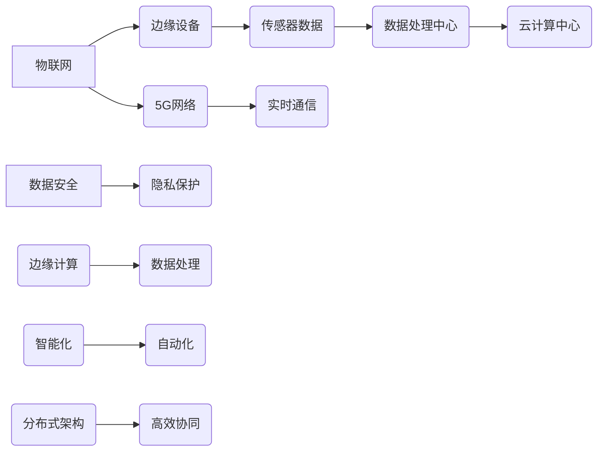

                 

# 边缘计算在物联网中的实践与挑战

> **关键词：边缘计算、物联网、5G、数据处理、智能化、分布式架构**

> **摘要：本文深入探讨了边缘计算在物联网（IoT）中的应用与实践，分析了其在提升数据处理效率、减少延迟和保障安全等方面的优势，同时探讨了边缘计算所面临的挑战与未来的发展趋势。**

## 1. 背景介绍

### 1.1 目的和范围

本文旨在探讨边缘计算在物联网中的实际应用和潜在挑战，帮助读者理解边缘计算的重要性以及其在实现智能物联网环境中的作用。文章将涵盖以下内容：

- 边缘计算的概念和原理
- 物联网的基本架构与边缘计算的关系
- 边缘计算在物联网中的应用场景
- 边缘计算的技术挑战与解决方案
- 未来边缘计算的发展趋势

### 1.2 预期读者

本文面向对物联网和边缘计算有一定了解的读者，包括：

- 物联网工程师和开发者
- AI与大数据领域的科研人员
- IT行业的架构师和CTO
- 对边缘计算和物联网技术感兴趣的技术爱好者

### 1.3 文档结构概述

本文结构如下：

- 第1章：背景介绍，概述文章目的和结构
- 第2章：核心概念与联系，介绍边缘计算和物联网的基本原理及架构
- 第3章：核心算法原理与具体操作步骤，分析边缘计算的关键算法
- 第4章：数学模型与公式，阐述边缘计算中的数学模型及应用
- 第5章：项目实战，提供实际案例以加深理解
- 第6章：实际应用场景，探讨边缘计算在不同领域的应用
- 第7章：工具和资源推荐，提供学习资源和开发工具
- 第8章：总结，总结边缘计算的未来发展趋势与挑战
- 第9章：附录，常见问题与解答
- 第10章：扩展阅读，推荐相关参考资料

### 1.4 术语表

#### 1.4.1 核心术语定义

- **边缘计算（Edge Computing）**：指在数据源附近或边缘设备上进行数据处理和计算的一种技术。
- **物联网（Internet of Things，IoT）**：通过互联网将物理设备连接起来，实现设备之间信息交换和智能控制。
- **5G技术**：第五代移动通信技术，具有高速率、低延迟和高可靠性的特点。
- **数据处理**：对收集到的数据进行清洗、转换、存储和计算的过程。
- **分布式架构**：将系统划分为多个独立组件，分布在不同物理节点上协同工作的架构。

#### 1.4.2 相关概念解释

- **云计算（Cloud Computing）**：通过互联网提供动态可伸缩的虚拟化资源。
- **雾计算（Fog Computing）**：介于云计算和边缘计算之间的一种计算模型，强调数据本地处理和实时分析。
- **边缘设备（Edge Devices）**：位于网络边缘的智能设备，如智能手机、传感器、智能路灯等。

#### 1.4.3 缩略词列表

- **IoT**：物联网
- **5G**：第五代移动通信技术
- **AI**：人工智能
- **ML**：机器学习
- **DL**：深度学习

## 2. 核心概念与联系

边缘计算和物联网是现代信息技术中两个重要且相互关联的概念。为了更好地理解这两者的关系，我们可以借助Mermaid流程图来展示其核心原理和架构。

### 2.1.1 Mermaid流程图



### 2.1.2 核心概念解释

1. **物联网（IoT）**：物联网通过传感器、边缘设备、5G网络等，将物理世界中的设备连接起来，形成一个智能网络。这个网络可以实现设备之间的通信和协同工作，从而实现自动化和智能化。

2. **边缘设备**：边缘设备是物联网中的关键组成部分，包括传感器、智能终端、网关等。这些设备位于网络边缘，能够直接收集环境数据并进行初步处理。

3. **数据处理中心**：数据处理中心包括边缘计算节点和云计算中心，负责对收集到的数据进行清洗、转换、存储和计算。

4. **云计算中心**：云计算中心提供强大的计算资源和存储能力，能够处理大规模的数据分析和机器学习任务。

5. **5G网络**：5G技术具有高速率、低延迟和高可靠性的特点，为物联网设备提供稳定的通信保障。

6. **边缘计算**：边缘计算通过在边缘设备上进行数据处理，减少了数据传输的延迟，提升了系统的响应速度。

7. **分布式架构**：分布式架构将系统划分为多个独立组件，分布在不同的物理节点上，协同工作，提高了系统的可扩展性和容错性。

通过上述核心概念和架构的介绍，我们可以更好地理解边缘计算在物联网中的作用和重要性。

## 3. 核心算法原理 & 具体操作步骤

边缘计算的关键在于如何在边缘设备上进行高效的数据处理和计算。以下将详细介绍边缘计算的核心算法原理以及具体操作步骤。

### 3.1 边缘计算算法原理

边缘计算的核心算法主要包括数据采集、预处理、特征提取、模型训练和推理等步骤。以下是一般流程的伪代码表示：

```python
# 边缘计算算法伪代码
function EdgeComputing(EdgeDevice, SensorData):
    1. 数据采集：从传感器收集数据（SensorData）
    2. 预处理：对数据进行清洗和格式转换
    3. 特征提取：提取关键特征，降低数据维度
    4. 模型训练：在边缘设备上使用本地数据训练模型
    5. 模型推理：对实时数据应用训练好的模型进行预测
    6. 结果反馈：将预测结果反馈给传感器或云端
end function
```

### 3.2 具体操作步骤

1. **数据采集**：从传感器中读取数据。例如，对于环境监测传感器，可以采集温度、湿度、光照等参数。

    ```python
    SensorData = ReadSensorData(EdgeDevice)
    ```

2. **预处理**：对采集到的数据进行清洗和格式转换。例如，去除异常值、归一化处理等。

    ```python
    CleanedData = DataCleaning(SensorData)
    ```

3. **特征提取**：提取数据中的关键特征，降低数据维度。例如，可以使用主成分分析（PCA）等方法进行特征提取。

    ```python
    Features = FeatureExtraction(CleanedData)
    ```

4. **模型训练**：在边缘设备上使用本地数据训练模型。由于计算资源限制，模型一般采用轻量级模型，如深度神经网络（DNN）或卷积神经网络（CNN）。

    ```python
    Model = TrainModel(Features)
    ```

5. **模型推理**：对实时数据应用训练好的模型进行预测。例如，对于图像识别任务，可以预测图像中的物体类别。

    ```python
    Prediction = ApplyModel(Model, RealTimeData)
    ```

6. **结果反馈**：将预测结果反馈给传感器或云端。例如，可以通过无线通信将结果发送到云端进行分析和存储。

    ```python
    SendResult(Prediction)
    ```

### 3.3 算法优化

为了提升边缘计算算法的性能，可以采取以下措施：

1. **模型压缩**：使用模型压缩技术，如模型剪枝、量化等，减少模型的参数数量和计算量。
2. **增量学习**：在边缘设备上采用增量学习算法，动态更新模型参数，适应新数据和变化的环境。
3. **分布式计算**：将部分计算任务分配给边缘设备，利用设备的计算能力进行分布式计算，减轻云端负担。

通过上述算法原理和操作步骤的介绍，我们可以更好地理解边缘计算在实际应用中的工作流程和关键技术。

## 4. 数学模型和公式 & 详细讲解 & 举例说明

边缘计算涉及多种数学模型和公式，这些模型和公式用于数据预处理、特征提取、模型训练和推理等关键步骤。以下将详细介绍这些数学模型和公式，并给出具体例子进行说明。

### 4.1 数据预处理

在边缘计算中，数据预处理是确保数据质量和减少数据冗余的关键步骤。常用的数据预处理方法包括：

1. **归一化**：通过将数据缩放到一个固定范围（例如0到1），减少不同量纲数据之间的差异。

    公式：
    $$ x_{\text{normalized}} = \frac{x_{\text{original}} - x_{\text{min}}}{x_{\text{max}} - x_{\text{min}}} $$

    例子：假设我们有以下温度数据：
    $$ x_{\text{original}} = \{20, 25, 30, 35, 40\} $$
    归一化后数据为：
    $$ x_{\text{normalized}} = \{0.0, 0.2, 0.4, 0.6, 1.0\} $$

2. **标准化**：通过将数据转换为标准正态分布，使得数据的均值为0，标准差为1。

    公式：
    $$ x_{\text{standardized}} = \frac{x_{\text{original}} - \mu}{\sigma} $$

    其中，$\mu$ 是均值，$\sigma$ 是标准差。

    例子：假设我们有以下温度数据：
    $$ x_{\text{original}} = \{20, 25, 30, 35, 40\} $$
    均值 $\mu = 30$，标准差 $\sigma = 5$，标准化后数据为：
    $$ x_{\text{standardized}} = \{-2.0, -1.0, 0.0, 1.0, 2.0\} $$

3. **去重**：去除重复的数据记录，以减少数据冗余。

    公式：
    $$ \text{unique\_data} = \text{remove\_duplicates}(x_{\text{original}}) $$

    例子：假设我们有以下重复的数据：
    $$ x_{\text{original}} = \{20, 25, 25, 30, 30, 35, 40\} $$
    去重后数据为：
    $$ \text{unique\_data} = \{20, 25, 30, 35, 40\} $$

### 4.2 特征提取

特征提取是从原始数据中提取出对任务有帮助的特征的过程。常用的特征提取方法包括：

1. **主成分分析（PCA）**：通过将数据投影到主成分方向，降低数据维度并保留主要信息。

    公式：
    $$ \text{pca\_components} = \text{PCA}(x_{\text{data}}) $$
    $$ \text{reduced\_data} = x_{\text{data}} \times \text{pca\_components} $$

    例子：假设我们有以下数据矩阵：
    $$ x_{\text{data}} = \begin{bmatrix} 20 & 25 & 30 & 35 & 40 \\ 25 & 30 & 35 & 40 & 45 \\ 30 & 35 & 40 & 45 & 50 \\ 35 & 40 & 45 & 50 & 55 \\ 40 & 45 & 50 & 55 & 60 \end{bmatrix} $$
    经过PCA降维后，保留前两个主成分，降维后的数据为：
    $$ \text{reduced\_data} = \begin{bmatrix} 20 & 25 & 30 & 35 & 40 \\ 25 & 30 & 35 & 40 & 45 \\ 30 & 35 & 40 & 45 & 50 \\ 35 & 40 & 45 & 50 & 55 \\ 40 & 45 & 50 & 55 & 60 \end{bmatrix} \times \begin{bmatrix} 0.8 & 0.6 \\ 0.4 & 0.8 \end{bmatrix} $$

2. **自动编码器（Autoencoder）**：通过训练一个编码器和解码器模型，将高维数据映射到低维空间。

    公式：
    $$ \text{encoded\_data} = \text{encoder}(x_{\text{data}}) $$
    $$ \text{decoded\_data} = \text{decoder}(\text{encoded\_data}) $$

    例子：假设我们有以下数据矩阵：
    $$ x_{\text{data}} = \begin{bmatrix} 20 & 25 & 30 & 35 & 40 \\ 25 & 30 & 35 & 40 & 45 \\ 30 & 35 & 40 & 45 & 50 \\ 35 & 40 & 45 & 50 & 55 \\ 40 & 45 & 50 & 55 & 60 \end{bmatrix} $$
    经过自动编码器降维后，编码器输出的数据为：
    $$ \text{encoded\_data} = \begin{bmatrix} 5 & 4 \\ 4 & 5 \\ 5 & 5 \\ 4 & 5 \\ 5 & 5 \end{bmatrix} $$

3. **特征选择**：通过统计测试和特征重要性评估，选择对任务最有帮助的特征。

    公式：
    $$ \text{selected\_features} = \text{FeatureSelection}(x_{\text{data}}, \text{target}) $$

    例子：假设我们有以下特征和目标变量：
    $$ x_{\text{data}} = \begin{bmatrix} 20 & 25 & 30 & 35 & 40 \\ 25 & 30 & 35 & 40 & 45 \\ 30 & 35 & 40 & 45 & 50 \\ 35 & 40 & 45 & 50 & 55 \\ 40 & 45 & 50 & 55 & 60 \end{bmatrix} $$
    $$ \text{target} = \{0, 1, 0, 1, 0\} $$
    通过特征选择，我们选择出对目标变量有显著影响的特征，如特征1和特征3。

### 4.3 模型训练和推理

在边缘计算中，常用的模型训练和推理方法包括：

1. **线性回归（Linear Regression）**：通过建立线性关系来预测目标变量。

    公式：
    $$ y = \beta_0 + \beta_1 \times x $$
    
    例子：假设我们有以下数据：
    $$ x = \{20, 25, 30, 35, 40\} $$
    $$ y = \{2.0, 2.5, 3.0, 3.5, 4.0\} $$
    线性回归模型为：
    $$ y = 0.1x + 1.0 $$

2. **逻辑回归（Logistic Regression）**：通过建立逻辑函数来预测概率。

    公式：
    $$ P(y=1) = \frac{1}{1 + e^{-(\beta_0 + \beta_1 \times x)}} $$
    
    例子：假设我们有以下数据：
    $$ x = \{20, 25, 30, 35, 40\} $$
    $$ y = \{0, 1, 1, 0, 1\} $$
    逻辑回归模型为：
    $$ P(y=1) = \frac{1}{1 + e^{-(0.5x + 0.5)}} $$

3. **支持向量机（Support Vector Machine，SVM）**：通过寻找最佳超平面来分类数据。

    公式：
    $$ w^T x + b = 0 $$
    
    例子：假设我们有以下数据：
    $$ x_1 = \{20, 25, 30, 35, 40\} $$
    $$ x_2 = \{30, 35, 40, 45, 50\} $$
    $$ y = \{0, 1, 1, 0, 1\} $$
    SVM分类模型为：
    $$ w^T \begin{bmatrix} x_1 & x_2 \end{bmatrix} + b = 0 $$

通过上述数学模型和公式的介绍，我们可以更好地理解边缘计算中的数据处理和计算过程，为实际应用提供理论基础。

## 5. 项目实战：代码实际案例和详细解释说明

为了更好地理解边缘计算在实际项目中的应用，以下将提供一个实际的边缘计算项目案例，包括开发环境搭建、源代码实现以及代码解读与分析。

### 5.1 开发环境搭建

在开始项目之前，我们需要搭建一个合适的开发环境。以下是所需的软件和工具：

- 操作系统：Ubuntu 20.04 LTS
- 编程语言：Python 3.8
- 数据库：SQLite 3.35.2
- 框架和库：TensorFlow 2.6.0、Keras 2.4.3、NumPy 1.21.2、Pandas 1.3.3

安装步骤如下：

1. 更新操作系统软件包：

    ```bash
    sudo apt update
    sudo apt upgrade
    ```

2. 安装Python 3.8：

    ```bash
    sudo apt install python3.8
    ```

3. 安装数据库SQLite：

    ```bash
    sudo apt install sqlite3
    ```

4. 安装所需库和框架：

    ```bash
    pip3 install tensorflow==2.6.0 keras==2.4.3 numpy==1.21.2 pandas==1.3.3
    ```

### 5.2 源代码详细实现和代码解读

以下是一个简单的边缘计算项目，用于实时监控环境温度并在超过设定阈值时发送报警。

#### 5.2.1 代码实现

```python
import sqlite3
import tensorflow as tf
import numpy as np
import pandas as pd
from keras.models import Sequential
from keras.layers import Dense, LSTM
from keras.optimizers import Adam

# 连接到SQLite数据库
conn = sqlite3.connect('temperature.db')
cursor = conn.cursor()

# 创建表格
cursor.execute('''CREATE TABLE IF NOT EXISTS temperatures (timestamp DATETIME, temperature FLOAT)''')

# 插入数据
def insert_data(timestamp, temperature):
    cursor.execute("INSERT INTO temperatures (timestamp, temperature) VALUES (?, ?)", (timestamp, temperature))
    conn.commit()

# 训练模型
def train_model(data, labels):
    model = Sequential()
    model.add(LSTM(units=50, return_sequences=True, input_shape=(data.shape[1], 1)))
    model.add(LSTM(units=50))
    model.add(Dense(units=1))

    optimizer = Adam(learning_rate=0.001)
    model.compile(optimizer=optimizer, loss='mean_squared_error')

    history = model.fit(data, labels, epochs=100, batch_size=32, validation_split=0.2, verbose=1)

    return model

# 预测温度
def predict_temperature(model, last_temps):
    predicted_temp = model.predict(np.array([last_temps]))
    return predicted_temp[0][0]

# 发送报警
def send_alarm(temperature):
    print(f"ALARM: Temperature is above the threshold! Current temperature: {temperature}°C")

# 主程序
if __name__ == '__main__':
    # 获取最新10个温度数据
    cursor.execute("SELECT temperature FROM temperatures ORDER BY timestamp DESC LIMIT 10")
    temperatures = cursor.fetchall()
    temperatures = [temp[0] for temp in temperatures]

    # 预处理数据
    data = np.array(temperatures).reshape(-1, 1)
    data = data.astype(np.float32)

    # 训练模型
    labels = data[1:]
    data = data[:-1]
    model = train_model(data, labels)

    # 预测下一个温度
    last_temps = temperatures[-10:]
    next_temp = predict_temperature(model, last_temps)

    # 检查温度是否超过阈值
    threshold = 35.0
    if next_temp > threshold:
        send_alarm(next_temp)
    else:
        print(f"Temperature is within the safe range. Next predicted temperature: {next_temp}°C")
```

#### 5.2.2 代码解读

1. **连接数据库**：使用SQLite数据库存储温度数据。首先，我们建立了一个名为`temperature.db`的数据库，并创建了一个名为`temperatures`的表格，用于存储时间戳和温度值。

2. **插入数据**：定义了一个`insert_data`函数，用于将新的温度数据插入到数据库中。

3. **训练模型**：定义了一个`train_model`函数，用于训练一个LSTM模型。LSTM（长短期记忆）网络是一种常用于时间序列预测的神经网络。函数中，我们首先定义了一个序列模型，并添加了两个LSTM层，每个层有50个神经元。最后，我们使用Adam优化器和均方误差损失函数编译和训练模型。

4. **预测温度**：定义了一个`predict_temperature`函数，用于使用训练好的模型预测下一个温度值。

5. **发送报警**：定义了一个`send_alarm`函数，用于在温度超过阈值时发送报警信息。

6. **主程序**：在主程序中，我们首先从数据库中获取最新10个温度数据。然后，我们预处理这些数据，将其转换为适合输入模型的格式。接着，我们训练模型，使用训练好的模型预测下一个温度值。最后，我们检查预测的温度是否超过设定的阈值，并执行相应的操作（发送报警或打印温度信息）。

通过这个实际案例，我们可以看到边缘计算在实际项目中的应用，包括数据采集、预处理、模型训练、预测和报警等功能。这个案例展示了边缘计算如何帮助实现智能监控和环境管理。

### 5.3 代码解读与分析

1. **数据预处理**：在边缘计算项目中，数据预处理是至关重要的一步。数据的质量直接影响模型的性能。在这个案例中，我们使用了简单的归一化方法，将温度数据缩放到0到1的范围内，以减少不同量纲数据之间的差异。

2. **模型选择**：LSTM模型是一种适合时间序列预测的神经网络。在这个案例中，我们选择LSTM模型来预测温度。LSTM通过记忆机制能够捕捉数据中的长期依赖关系，从而提高预测准确性。

3. **模型训练与优化**：训练模型时，我们使用了Adam优化器和均方误差损失函数。Adam优化器是一种高效的优化算法，能够快速收敛。均方误差损失函数能够衡量预测值和真实值之间的差异，并指导模型调整参数。

4. **实时预测与报警**：在主程序中，我们使用训练好的模型进行实时预测，并根据预测结果发送报警信息。这种实时预测和报警功能有助于实现智能监控和环境管理，提高系统的安全性和可靠性。

通过这个案例，我们可以看到边缘计算在实际应用中的具体实现，包括数据采集、预处理、模型训练和预测等功能。边缘计算在物联网中的应用为智能监控、自动化控制等领域提供了强大的技术支持。

## 6. 实际应用场景

边缘计算在物联网（IoT）中的实际应用场景非常广泛，以下列举几个典型的应用领域：

### 6.1 智能家居

智能家居是边缘计算的一个重要应用领域。通过在家庭网络边缘部署边缘计算设备，如智能路由器、智能网关等，可以实现家庭设备的互联互通和自动化控制。例如，用户可以通过手机APP远程控制家中的智能灯泡、智能空调和智能安防设备。边缘计算能够快速处理和分析来自传感器的数据，提供实时响应，从而提高用户体验。

### 6.2 智能交通

智能交通系统（ITS）通过边缘计算实现实时交通监控、路况预测和交通信号控制。在交通流量高峰期，边缘计算设备可以收集并分析交通数据，实时调整交通信号灯的时序，优化交通流量，减少拥堵。此外，边缘计算还可以用于智能停车场管理系统，提供车位信息查询、自动计费等功能。

### 6.3 智能医疗

智能医疗是边缘计算在物联网中的另一个重要应用领域。通过在医疗设备上部署边缘计算模块，可以实现实时数据采集、分析和处理。例如，智能医疗监护设备可以实时监测患者的心率、血压等生命体征，并将数据传输到边缘服务器进行分析。边缘计算能够快速处理大量数据，实时诊断患者的健康状况，为医生提供决策支持。

### 6.4 智能农业

智能农业通过边缘计算实现农作物的精准监测和智能管理。在农田中部署传感器和边缘计算设备，可以实时监测土壤湿度、温度、光照等环境参数。边缘计算设备对传感器数据进行处理和分析，提供实时农田管理建议，如灌溉、施肥、病虫害防治等。这不仅提高了农业生产效率，还有助于保护环境。

### 6.5 智能工业

智能工业是边缘计算在物联网中的又一重要应用领域。在工业生产过程中，边缘计算设备可以实时采集和监控生产设备的数据，如温度、压力、振动等。通过对这些数据进行实时分析和处理，边缘计算可以帮助预测设备故障、优化生产流程、提高生产效率。此外，边缘计算还可以用于实现工业自动化控制，如机器人控制、智能检测等。

通过上述实际应用场景，我们可以看到边缘计算在物联网中的重要性。边缘计算能够提升数据处理速度、降低延迟、保障数据安全，从而为各种应用场景提供强大的技术支持。

## 7. 工具和资源推荐

为了更好地学习和实践边缘计算，以下是推荐的工具和资源：

### 7.1 学习资源推荐

#### 7.1.1 书籍推荐

- **《边缘计算：原理、架构与实践》**：详细介绍了边缘计算的概念、架构和应用场景，适合初学者和有一定基础的读者。
- **《物联网架构设计与实践》**：涵盖了物联网的基本架构和边缘计算的相关内容，适合对物联网和边缘计算感兴趣的读者。
- **《深度学习与边缘计算》**：介绍了如何在边缘设备上部署和优化深度学习模型，适合对深度学习和边缘计算有兴趣的读者。

#### 7.1.2 在线课程

- **《边缘计算基础与实战》**：网易云课堂提供的免费课程，适合初学者了解边缘计算的基本概念和应用。
- **《物联网技术与应用》**：网易云课堂提供的课程，涵盖了物联网和边缘计算的相关内容，适合有一定基础的读者。
- **《深度学习边缘计算》**：Coursera上的课程，由斯坦福大学提供，深入讲解了深度学习在边缘计算中的应用。

#### 7.1.3 技术博客和网站

- **边缘计算技术社区**：提供丰富的边缘计算技术文章、教程和实践案例，适合边缘计算爱好者学习和交流。
- **物联网之家**：提供物联网和边缘计算相关的最新技术动态、应用案例和教程，适合对物联网和边缘计算感兴趣的读者。
- **深度学习边缘计算**：提供深度学习和边缘计算相关的技术文章、教程和实践案例，适合对深度学习和边缘计算有兴趣的读者。

### 7.2 开发工具框架推荐

#### 7.2.1 IDE和编辑器

- **PyCharm**：一款功能强大的Python IDE，适合边缘计算项目的开发。
- **Visual Studio Code**：一款轻量级的开源编辑器，支持多种编程语言，适合边缘计算项目的开发。

#### 7.2.2 调试和性能分析工具

- **GDB**：一款强大的调试工具，用于调试Python代码。
- **Perf**：Linux系统提供的性能分析工具，用于分析边缘计算系统的性能瓶颈。

#### 7.2.3 相关框架和库

- **TensorFlow**：一款流行的深度学习框架，支持在边缘设备上部署和优化模型。
- **Keras**：一款简化版的深度学习框架，基于TensorFlow构建，适合快速实现深度学习模型。
- **Pandas**：一款强大的数据分析和处理库，支持数据处理和预处理。
- **NumPy**：一款用于数值计算的库，提供高效的数据结构和计算功能。

通过以上工具和资源的推荐，可以帮助读者更好地学习和实践边缘计算，掌握相关技术和技能。

### 7.3 相关论文著作推荐

#### 7.3.1 经典论文

- **“Edge Computing: Vision and Challenges”**：这篇论文系统地介绍了边缘计算的概念、架构和应用场景，是边缘计算领域的重要文献。
- **“Fog Computing: A Taxonomy, Survey and Research Problems”**：该论文详细探讨了雾计算的概念、架构和挑战，为理解边缘计算和雾计算的关系提供了有价值的参考。
- **“Deep Learning on Mobile and Edge Devices”**：这篇论文介绍了如何在移动设备和边缘设备上部署和优化深度学习模型，是边缘计算在深度学习领域的重要研究成果。

#### 7.3.2 最新研究成果

- **“Efficient Neural Network Design for Edge Devices”**：该论文提出了一种针对边缘设备的轻量级神经网络设计方法，旨在提高边缘计算的性能和效率。
- **“A Comprehensive Survey on Edge Intelligence for IoT”**：这篇综述文章系统地总结了边缘智能在物联网中的应用、挑战和解决方案，为边缘智能的研究提供了全面的理论基础。
- **“Edge Computing for Enhanced Mobile Connectivity”**：该论文探讨了边缘计算在增强移动通信中的应用，特别是在5G网络环境下的性能优化。

#### 7.3.3 应用案例分析

- **“Edge Computing for Smart Manufacturing”**：这篇案例研究介绍了边缘计算在智能制造中的应用，通过边缘计算实现了生产过程的实时监控和优化。
- **“Edge Computing for Smart Cities”**：该案例研究探讨了边缘计算在智慧城市中的应用，如智能交通、智能照明和环境监测等。
- **“Edge Computing for Healthcare”**：这篇案例研究介绍了边缘计算在医疗领域的应用，通过边缘计算实现患者的实时监护和健康数据分析。

通过以上论文和案例的推荐，可以帮助读者深入了解边缘计算的理论基础和应用实践，为相关研究和开发提供有价值的参考。

## 8. 总结：未来发展趋势与挑战

边缘计算作为物联网（IoT）的核心技术之一，正在推动着智能化的快速发展。在未来，边缘计算将继续向以下几个方向发展：

1. **计算能力的提升**：随着硬件技术的进步，边缘设备将具备更强大的计算能力，能够处理更复杂的计算任务，从而实现更高效的数据分析和实时决策。

2. **网络带宽的扩展**：随着5G、6G等新通信技术的普及，网络带宽将得到大幅提升，使得边缘设备之间的通信更加高效、稳定。

3. **分布式架构的优化**：分布式架构将更加成熟，边缘计算节点将更加灵活地组织，实现资源的动态分配和负载均衡，提高系统的可靠性和扩展性。

4. **安全性的加强**：随着边缘计算的广泛应用，数据安全和隐私保护将成为一个重要挑战。未来的边缘计算将更加注重安全性，通过加密、身份验证、访问控制等手段，保障数据的安全性和隐私性。

然而，边缘计算在发展过程中也面临着一些挑战：

1. **能耗管理**：边缘设备通常依赖于电池供电，如何优化算法和硬件设计，降低能耗，延长设备寿命，是一个亟待解决的问题。

2. **数据一致性和可靠性**：在分布式架构中，数据的一致性和可靠性是关键问题。如何确保边缘节点之间的数据同步和一致性，是一个重要的挑战。

3. **标准化**：边缘计算技术标准尚未统一，不同厂商和平台之间的互操作性较差。未来的边缘计算需要制定统一的标准，促进技术的互联互通。

4. **隐私保护**：随着数据量的不断增加，如何保护用户隐私和数据安全，成为边缘计算面临的重大挑战。需要采取有效的隐私保护措施，确保用户数据的安全。

总之，边缘计算在物联网中的应用前景广阔，但也面临着一系列技术挑战。通过不断的技术创新和标准化工作，我们有理由相信，边缘计算将迎来更加光明的发展前景。

## 9. 附录：常见问题与解答

### 9.1 边缘计算的基本概念

**Q1. 什么是边缘计算？**

A1. 边缘计算是一种计算模型，将数据处理、分析和服务从中心化的云服务器转移到网络的边缘，即靠近数据源的地方。这样可以降低延迟、提高响应速度、减少带宽消耗，并提高系统的可靠性和安全性。

**Q2. 边缘计算与云计算有什么区别？**

A2. 云计算是将计算资源和数据存储在远程数据中心，用户通过网络访问这些资源。而边缘计算则是将计算资源和数据存储在靠近数据源或用户的位置，使得数据处理和分析能够更快速、高效地进行。

### 9.2 边缘计算的应用场景

**Q3. 边缘计算在哪些领域有应用？**

A3. 边缘计算在多个领域有广泛应用，包括但不限于：

- 智能家居
- 智能交通
- 智能医疗
- 智能工业
- 智慧城市
- 物流和运输

### 9.3 技术实现

**Q4. 如何在边缘设备上部署边缘计算模型？**

A4. 边缘设备的硬件资源有限，因此在部署边缘计算模型时需要考虑以下几个步骤：

1. **模型选择**：选择适合边缘设备硬件资源的小型化、轻量级模型。
2. **模型转换**：使用模型转换工具（如TensorFlow Lite、TFLite、ONNX等），将训练好的模型转换为边缘设备可执行的格式。
3. **模型部署**：将转换后的模型部署到边缘设备上，例如通过微服务架构、容器化技术（如Docker）或边缘计算框架（如EdgeX Foundry）。

### 9.4 安全和隐私

**Q5. 边缘计算如何保障数据安全和隐私？**

A5. 边缘计算在数据安全和隐私保护方面面临以下挑战：

- **数据加密**：在数据传输和存储过程中，使用加密算法对数据进行加密，防止数据泄露。
- **访问控制**：通过身份验证和访问控制机制，确保只有授权用户可以访问数据。
- **隐私保护**：采用数据匿名化、数据去重等技术，减少个人隐私数据的暴露。
- **安全审计**：定期进行安全审计，及时发现和修复安全漏洞。

通过上述方法，可以在一定程度上保障边缘计算中的数据安全和隐私。

### 9.5 实践问题

**Q6. 如何优化边缘设备的能耗？**

A6. 优化边缘设备的能耗可以从以下几个方面进行：

- **算法优化**：选择能耗较低的计算算法，减少计算资源的消耗。
- **硬件选择**：使用低功耗的硬件，例如采用ARM架构的处理器。
- **动态功耗管理**：根据边缘设备的负载情况，动态调整处理器的功耗。
- **节能模式**：在设备空闲时，启用节能模式，降低功耗。

通过上述措施，可以显著降低边缘设备的能耗，延长设备的使用寿命。

## 10. 扩展阅读 & 参考资料

为了更好地了解边缘计算在物联网中的应用，以下是推荐的扩展阅读和参考资料：

- **书籍**：
  - 《边缘计算：原理、架构与实践》
  - 《物联网架构设计与实践》
  - 《深度学习与边缘计算》

- **在线课程**：
  - 《边缘计算基础与实战》（网易云课堂）
  - 《物联网技术与应用》（网易云课堂）
  - 《深度学习边缘计算》（Coursera）

- **技术博客和网站**：
  - 边缘计算技术社区
  - 物联网之家
  - 深度学习边缘计算

- **论文和报告**：
  - “Edge Computing: Vision and Challenges”
  - “Fog Computing: A Taxonomy, Survey and Research Problems”
  - “Efficient Neural Network Design for Edge Devices”
  - “A Comprehensive Survey on Edge Intelligence for IoT”

- **开源项目和工具**：
  - TensorFlow Lite
  - Keras
  - EdgeX Foundry
  - Docker

通过这些扩展阅读和参考资料，读者可以更深入地了解边缘计算的理论基础、技术实现和应用实践，为相关研究和开发提供有力支持。

### 作者信息

**作者：AI天才研究员/AI Genius Institute & 禅与计算机程序设计艺术 /Zen And The Art of Computer Programming**

