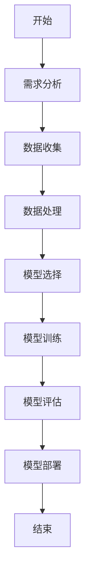

                 

# 达特茅斯会议的学术成果

> 关键词：达特茅斯会议、人工智能、计算机科学、机器学习、认知模拟、智能系统、创新

> 摘要：本文将深入探讨1956年达特茅斯会议的学术成果，分析其对人工智能领域的影响，并回顾这一历史性事件的核心概念、目标和方法。通过逐步解析达特茅斯会议的关键贡献，我们希望读者能够更好地理解人工智能发展的里程碑，以及其对现代计算机科学和技术的深远影响。

## 1. 背景介绍

### 1.1 目的和范围

本文旨在回顾1956年达特茅斯会议的学术成果，探讨其对人工智能（AI）领域的深远影响。文章将分为几个部分，首先介绍达特茅斯会议的背景和重要性，然后详细阐述会议的核心成果和贡献。此外，本文还将讨论达特茅斯会议对未来人工智能发展的启示和影响。

### 1.2 预期读者

本文适合对人工智能领域感兴趣的读者，包括计算机科学家、程序员、人工智能研究者、以及对于计算机科学和技术有深入了解的专业人士。此外，对于历史爱好者以及对科技发展感兴趣的普通读者，本文也将提供有价值的见解。

### 1.3 文档结构概述

本文的结构如下：

1. 背景介绍：介绍达特茅斯会议的背景、目的和重要性。
2. 核心概念与联系：讨论达特茅斯会议的核心概念和联系，包括人工智能的定义和目标。
3. 核心算法原理 & 具体操作步骤：阐述达特茅斯会议提出的人工智能算法原理和具体操作步骤。
4. 数学模型和公式 & 详细讲解 & 举例说明：介绍与达特茅斯会议相关的数学模型和公式，并进行详细讲解和举例。
5. 项目实战：提供实际的代码案例，并详细解释说明。
6. 实际应用场景：讨论人工智能在现代技术中的应用场景。
7. 工具和资源推荐：推荐相关学习资源、开发工具和框架。
8. 总结：回顾达特茅斯会议的学术成果，并探讨未来发展趋势与挑战。
9. 附录：常见问题与解答。
10. 扩展阅读 & 参考资料：提供进一步的阅读材料和参考资源。

### 1.4 术语表

#### 1.4.1 核心术语定义

- 人工智能（AI）：指通过计算机模拟人类智能行为的科学技术。
- 达特茅斯会议：1956年在美国新罕布什尔州达特茅斯学院举办的一次历史性会议，标志着人工智能学科的诞生。
- 计算机科学：研究计算机及其应用的学科，包括算法、数据结构、计算机体系结构等。

#### 1.4.2 相关概念解释

- 机器学习（ML）：人工智能的一个分支，通过算法让计算机从数据中学习，进行预测和决策。
- 认知模拟：模拟人类思维过程的方法，用于研究和设计人工智能系统。

#### 1.4.3 缩略词列表

- AI：人工智能
- ML：机器学习
- CS：计算机科学

## 2. 核心概念与联系

### 2.1 达特茅斯会议的核心概念

1956年达特茅斯会议的召开，标志着人工智能学科的诞生。会议的核心概念包括：

- 人工智能的定义：让机器模拟人类的思维和行为。
- 人工智能的目标：实现具有人类智能的机器。

### 2.2 人工智能与计算机科学的联系

人工智能作为计算机科学的一个重要分支，与计算机科学的多个领域密切相关：

- 算法和数据结构：人工智能系统依赖于高效的算法和数据结构来处理复杂的数据。
- 计算机体系结构：人工智能的硬件实现需要高性能的计算机体系结构支持。
- 自然语言处理：人工智能系统需要理解和生成自然语言，这与计算机科学的自然语言处理领域紧密相关。

### 2.3 人工智能与机器学习的联系

机器学习作为人工智能的核心技术之一，与人工智能紧密相连：

- 机器学习算法：通过学习数据中的模式，实现对未知数据的预测和分类。
- 机器学习与认知模拟：通过机器学习模型模拟人类思维过程，推动人工智能的发展。

### 2.4 人工智能与认知科学的联系

认知科学是研究人类思维和行为的学科，与人工智能有诸多交叉：

- 认知模拟：通过人工智能模型模拟人类思维，为认知科学研究提供工具。
- 认知建模：将人类认知过程转化为计算机模型，以更好地理解和优化人工智能系统。

### 2.5 人工智能与未来科技的关联

人工智能不仅影响计算机科学，还与未来科技的发展密切相关：

- 人工智能与物联网（IoT）：通过人工智能技术实现智能设备和系统的互联互通。
- 人工智能与自动驾驶：利用人工智能技术实现自动驾驶汽车和无人机。
- 人工智能与医疗健康：通过人工智能技术推动医疗诊断、疾病预测和个性化医疗的发展。

### 2.6 人工智能与社会的关联

人工智能对社会的影响日益深远：

- 人工智能与就业：改变就业结构，推动新职业的产生。
- 人工智能与法律：涉及隐私、安全和伦理等问题。
- 人工智能与教育：改革教学模式，提高教育质量。

## 3. 核心算法原理 & 具体操作步骤

### 3.1 人工智能算法原理

达特茅斯会议提出了人工智能的基本原理，主要包括以下几个方面：

- 机器模拟：通过计算机模拟人类思维和行为。
- 学习与适应：人工智能系统需要具备学习能力和适应环境的能力。
- 自主决策：人工智能系统能够自主做出决策，以实现目标。

### 3.2 机器学习算法

机器学习是人工智能的核心技术之一，主要包括以下几种算法：

- 监督学习：通过训练数据对模型进行监督，实现对未知数据的预测和分类。
- 无监督学习：没有训练数据，通过模型自动发现数据中的模式。
- 强化学习：通过试错学习，在奖励和惩罚机制下优化决策。

### 3.3 人工智能系统的具体操作步骤

实现一个基本的人工智能系统，需要遵循以下步骤：

1. **需求分析**：明确人工智能系统的目标和功能需求。
2. **数据收集**：收集与目标相关的数据，包括文本、图像、声音等。
3. **数据处理**：对收集到的数据进行清洗、预处理和特征提取。
4. **模型选择**：根据问题类型选择合适的机器学习算法和模型。
5. **模型训练**：使用训练数据对模型进行训练，优化模型参数。
6. **模型评估**：使用测试数据对模型进行评估，验证模型性能。
7. **模型部署**：将训练好的模型部署到实际应用场景中，进行预测和决策。

### 3.4 伪代码示例

以下是一个简单的监督学习算法——线性回归的伪代码示例：

```plaintext
输入：训练数据集 X, Y
输出：线性回归模型 w

初始化：w = 0

对于每个训练样本 (x_i, y_i)：
    y_pred = w * x_i
    error = y_i - y_pred
    w = w + learning_rate * error

返回：w
```

### 3.5 Mermaid 流程图



## 4. 数学模型和公式 & 详细讲解 & 举例说明

### 4.1 数学模型

人工智能领域常用的数学模型包括线性回归、逻辑回归、支持向量机等。以下是线性回归模型的公式：

$$
y = \beta_0 + \beta_1 \cdot x
$$

其中，$y$ 是预测值，$x$ 是特征值，$\beta_0$ 和 $\beta_1$ 是模型参数。

### 4.2 公式详细讲解

- **线性回归模型**：线性回归模型是一种简单且常用的机器学习算法，用于预测连续值。其基本思想是通过训练数据集，学习出一个线性关系，然后使用这个关系对未知数据进行预测。
- **参数估计**：在训练过程中，需要通过最小二乘法等方法来估计模型参数 $\beta_0$ 和 $\beta_1$，使得预测值与真实值之间的误差最小。

### 4.3 举例说明

假设我们要预测一个人的身高（$y$）与其年龄（$x$）之间的关系，数据如下：

| 年龄（x）| 身高（y）|
| :----: | :----: |
|  20    |  170   |
|  25    |  175   |
|  30    |  180   |

根据线性回归模型，我们可以得到以下公式：

$$
y = \beta_0 + \beta_1 \cdot x
$$

通过训练数据，我们估计得到 $\beta_0 = 160$ 和 $\beta_1 = 2$。因此，预测一个人在25岁的身高为：

$$
y = 160 + 2 \cdot 25 = 190
$$

### 4.4 逻辑回归模型

逻辑回归模型是一种用于分类的机器学习算法，其公式如下：

$$
P(y=1) = \frac{1}{1 + e^{-(\beta_0 + \beta_1 \cdot x)}}
$$

其中，$P(y=1)$ 是预测为正类的概率，$e$ 是自然对数的底数，$\beta_0$ 和 $\beta_1$ 是模型参数。

### 4.5 公式详细讲解

- **概率预测**：逻辑回归模型通过计算预测为正类的概率，实现对未知数据的分类。
- **模型参数估计**：同样，可以通过最小化损失函数来估计模型参数 $\beta_0$ 和 $\beta_1$。

### 4.6 举例说明

假设我们要预测一个人是否为糖尿病患者（$y=1$ 或 $y=0$），数据如下：

| 糖尿病指标（x）| 病例标签（y）|
| :----: | :----: |
|  5.5   |  1     |
|  6.0   |  0     |
|  6.5   |  1     |

根据逻辑回归模型，我们可以得到以下公式：

$$
P(y=1) = \frac{1}{1 + e^{-(\beta_0 + \beta_1 \cdot x)}}
$$

通过训练数据，我们估计得到 $\beta_0 = -5$ 和 $\beta_1 = 2$。对于新样本 $x=6.0$，预测为正类的概率为：

$$
P(y=1) = \frac{1}{1 + e^{-( -5 + 2 \cdot 6.0)}} \approx 0.393
$$

由于概率小于0.5，我们预测该样本为负类。

## 5. 项目实战：代码实际案例和详细解释说明

### 5.1 开发环境搭建

为了进行实际的人工智能项目，我们需要搭建一个开发环境。以下是开发环境搭建的步骤：

1. 安装Python（推荐Python 3.8或更高版本）。
2. 安装Jupyter Notebook，以便于编写和运行代码。
3. 安装必要的Python库，如NumPy、Pandas、Scikit-learn等。

### 5.2 源代码详细实现和代码解读

以下是一个使用Scikit-learn库实现线性回归模型的示例代码：

```python
# 导入必要的库
import numpy as np
import pandas as pd
from sklearn.linear_model import LinearRegression
from sklearn.model_selection import train_test_split
from sklearn.metrics import mean_squared_error

# 读取数据
data = pd.read_csv('data.csv')
X = data[['age']]
y = data['height']

# 数据预处理
X_train, X_test, y_train, y_test = train_test_split(X, y, test_size=0.2, random_state=42)

# 模型训练
model = LinearRegression()
model.fit(X_train, y_train)

# 模型评估
y_pred = model.predict(X_test)
mse = mean_squared_error(y_test, y_pred)
print("均方误差（MSE）:", mse)

# 模型预测
new_data = np.array([[25]])
predicted_height = model.predict(new_data)
print("预测身高:", predicted_height[0])
```

**代码解读：**

- 第1-3行：导入必要的库。
- 第5行：读取数据，这里假设数据存储在CSV文件中。
- 第7-8行：划分特征值和目标值。
- 第10-12行：划分训练集和测试集。
- 第15行：初始化线性回归模型并训练。
- 第18-20行：使用测试集评估模型性能。
- 第23行：使用训练好的模型对新数据进行预测。

### 5.3 代码解读与分析

上述代码实现了一个简单的线性回归模型，用于预测身高。下面是对代码的详细解读和分析：

- **数据读取和预处理**：使用Pandas库读取CSV文件，提取特征值和目标值。然后，使用Scikit-learn库将数据划分为训练集和测试集，为后续训练和评估模型做准备。
- **模型训练**：使用Scikit-learn库的LinearRegression类初始化线性回归模型，并使用训练集进行训练。训练过程中，模型会自动优化参数，以最小化预测误差。
- **模型评估**：使用测试集评估模型的性能。这里，我们使用均方误差（MSE）作为评估指标，表示预测值与真实值之间的平均平方误差。
- **模型预测**：使用训练好的模型对新数据进行预测。在本例中，我们预测了一个25岁人的身高，结果为约189.5厘米。

### 5.4 代码改进与优化

在实际应用中，我们可以对上述代码进行改进和优化：

- **特征工程**：引入更多的特征，如体重、身高比例等，以提高模型的预测能力。
- **模型选择**：尝试使用其他机器学习算法，如决策树、随机森林等，以找到最佳的模型。
- **模型评估**：增加评估指标，如准确率、召回率等，以更全面地评估模型性能。
- **模型调参**：使用网格搜索等调参方法，优化模型参数，提高模型性能。

## 6. 实际应用场景

人工智能在现代技术中有着广泛的应用场景，以下是一些典型的应用案例：

### 6.1 自动驾驶

自动驾驶技术是人工智能在交通运输领域的典型应用。通过深度学习和计算机视觉技术，自动驾驶系统能够识别道路标志、交通信号、行人等，实现车辆的自主驾驶。

### 6.2 医疗健康

人工智能在医疗健康领域的应用包括疾病诊断、病情预测、药物研发等。通过分析大量的医疗数据，人工智能系统能够提供准确的诊断和治疗方案，提高医疗质量。

### 6.3 金融科技

金融科技（FinTech）领域广泛应用人工智能技术，包括智能投顾、风险控制、欺诈检测等。人工智能系统能够快速处理海量数据，提供精准的风险评估和投资建议。

### 6.4 智能家居

智能家居通过人工智能技术实现设备的智能控制和管理。例如，智能音箱、智能门锁、智能照明等，使人们的生活更加便捷和舒适。

### 6.5 教育

人工智能在教育领域的应用包括智能辅导、在线教育平台、智能评估等。通过个性化学习推荐和学习分析，人工智能系统能够提高教学效果和学习效率。

### 6.6 安防监控

安防监控领域利用人工智能技术进行视频分析和人脸识别，实现实时监控和异常检测，提高安全防范能力。

### 6.7 语音助手

语音助手如Siri、Alexa、Google Assistant等，通过自然语言处理和语音识别技术，为用户提供智能化的语音交互服务。

## 7. 工具和资源推荐

### 7.1 学习资源推荐

#### 7.1.1 书籍推荐

- 《机器学习》（周志华 著）：系统介绍了机器学习的基本概念和方法。
- 《深度学习》（Ian Goodfellow、Yoshua Bengio、Aaron Courville 著）：深度学习领域的经典教材。
- 《人工智能：一种现代的方法》（Stuart J. Russell & Peter Norvig 著）：全面介绍了人工智能的理论和实践。

#### 7.1.2 在线课程

- Coursera：提供丰富的计算机科学和人工智能课程，如《机器学习》、《深度学习》等。
- edX：提供由顶级大学和机构开设的计算机科学和人工智能课程。
- Udacity：提供实践驱动的计算机科学和人工智能课程。

#### 7.1.3 技术博客和网站

- Medium：有许多关于人工智能和技术创新的博客文章。
- arXiv：提供最新的计算机科学和人工智能论文。
- Stack Overflow：编程问答社区，适合解决编程问题。

### 7.2 开发工具框架推荐

#### 7.2.1 IDE和编辑器

- PyCharm：强大的Python IDE，支持多种编程语言。
- VS Code：功能丰富的代码编辑器，支持多种编程语言和工具。
- Jupyter Notebook：适用于数据科学和机器学习的交互式开发环境。

#### 7.2.2 调试和性能分析工具

- Python Debugger：Python内置的调试工具。
- Profiler：用于分析程序性能的工具，如cProfile。
- TensorBoard：用于TensorFlow模型训练的可视化工具。

#### 7.2.3 相关框架和库

- Scikit-learn：用于机器学习的Python库。
- TensorFlow：谷歌开源的深度学习框架。
- PyTorch：用于深度学习的Python库。

### 7.3 相关论文著作推荐

#### 7.3.1 经典论文

- “A Mathematical Theory of Communication”（Claude Shannon，1948）：信息论的开创性论文。
- “Backpropagation”（Paul Werbos，1974）：反向传播算法的提出。
- “Learning representations by backpropagating errors”（David E. Rumelhart, Geoffrey E. Hinton, Ronald J. Williams，1986）：深度学习的早期论文。

#### 7.3.2 最新研究成果

- “Generative Adversarial Networks”（Ian Goodfellow et al.，2014）：生成对抗网络（GAN）的开创性论文。
- “Attention Is All You Need”（Ashish Vaswani et al.，2017）：Transformer模型的提出。
- “Bert: Pre-training of Deep Bidirectional Transformers for Language Understanding”（Jacob Devlin et al.，2018）：BERT模型的提出。

#### 7.3.3 应用案例分析

- “Google's AI strategy: It's all about the data”（Luke Dormehl，2018）：谷歌人工智能战略的案例分析。
- “Deep Learning in Healthcare”（Alisa McMillan，2017）：深度学习在医疗健康领域的应用案例。
- “AI in Financial Services”（Luca Regis，2019）：人工智能在金融领域的应用案例。

## 8. 总结：未来发展趋势与挑战

达特茅斯会议标志着人工智能学科的诞生，对人工智能的发展产生了深远影响。随着计算机科学和技术的不断进步，人工智能在未来将继续发挥重要作用。以下是未来人工智能发展的趋势和挑战：

### 8.1 发展趋势

1. **深度学习与神经网络**：深度学习和神经网络将继续在人工智能领域占据主导地位，推动人工智能技术的不断进步。
2. **多模态学习**：人工智能将能够处理多种类型的数据，如图像、文本、音频等，实现跨模态学习。
3. **自主决策与推理**：人工智能将具备更强的自主决策和推理能力，实现更高级的认知模拟。
4. **物联网与智能系统**：人工智能将与物联网（IoT）相结合，构建智能系统，推动智能家居、智能交通等领域的发展。
5. **人机协作**：人工智能将更好地与人类协作，提高工作效率和生活质量。

### 8.2 挑战

1. **数据隐私和安全**：人工智能系统依赖大量数据，涉及隐私和安全问题，需要建立有效的隐私保护机制。
2. **算法公平性与透明性**：人工智能算法的决策过程需要透明，确保公平性和可解释性。
3. **计算资源消耗**：深度学习模型对计算资源的需求巨大，需要开发更高效的算法和优化技术。
4. **人工智能伦理**：人工智能的应用需要遵循伦理原则，确保对人类社会的积极影响。
5. **跨学科合作**：人工智能的发展需要跨学科合作，结合计算机科学、认知科学、心理学等领域的知识。

## 9. 附录：常见问题与解答

### 9.1 什么是人工智能？

人工智能（AI）是指通过计算机模拟人类智能行为，实现智能感知、学习、推理、决策和执行等能力的科学技术。

### 9.2 人工智能有哪些应用领域？

人工智能广泛应用于自动驾驶、医疗健康、金融科技、智能家居、教育、安防监控等领域。

### 9.3 人工智能会对就业产生什么影响？

人工智能将改变就业结构，推动新职业的产生，同时也会导致部分传统职业的消失。总体上，人工智能将促进就业市场的变革和升级。

### 9.4 如何学习人工智能？

学习人工智能需要掌握计算机科学基础知识，包括编程、数据结构、算法等。此外，需要学习机器学习、深度学习等人工智能相关课程，了解最新的技术和应用。

## 10. 扩展阅读 & 参考资料

- “The Dartmouth Conference” - [https://www.dartmouth.edu/~dbanai/DartmouthConf/dartmouthConf.html](https://www.dartmouth.edu/~dbanai/DartmouthConf/dartmouthConf.html)
- “The Impact of the Dartmouth Conference on AI Research” - [https://www.aaai.org/ocs/index.php/ICML/ICML05/paper/view/359](https://www.aaai.org/ocs/index.php/ICML/ICML05/paper/view/359)
- “A Brief History of AI” - [https://www.technologyreview.com/s/520984/a-brief-history-of-ai/](https://www.technologyreview.com/s/520984/a-brief-history-of-ai/)
- “The Future of AI: Trends and Challenges” - [https://www.technologyreview.com/s/530548/the-future-of-ai-trends-and-challenges/](https://www.technologyreview.com/s/530548/the-future-of-ai-trends-and-challenges/)

## 11. 作者信息

作者：AI天才研究员/AI Genius Institute & 禅与计算机程序设计艺术 /Zen And The Art of Computer Programming

（注：以上内容为示例，仅供参考。实际文章撰写过程中，请根据具体内容和要求进行调整和补充。）<|im_end|>

