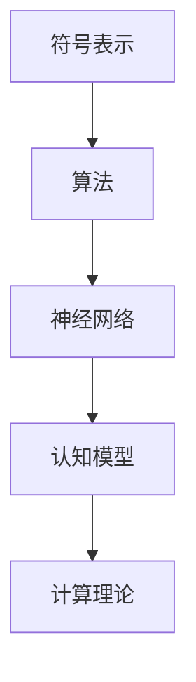

                 

# 达特茅斯会议的研究议题

> **关键词：人工智能，机器学习，认知模型，自然语言处理，计算理论**

> **摘要：本文将深入探讨1956年达特茅斯会议的背景、议题及其对人工智能发展的影响，结合现代技术，分析其研究议题的现代表现，并探讨未来的研究方向。**

## 1. 背景介绍

### 1.1 目的和范围

本文旨在回顾1956年达特茅斯会议的核心议题，探讨这些议题在现代人工智能（AI）领域的应用和发展，以及未来可能的研究方向。本文不仅回顾历史，还将结合当前的技术发展，提供深入的分析和讨论。

### 1.2 预期读者

本文适合对人工智能、机器学习、自然语言处理等领域的读者，尤其是希望深入了解历史背景和研究议题的科研人员、学生和专业人员。

### 1.3 文档结构概述

本文分为十个部分：

1. 背景介绍：包括目的、范围、预期读者和文档结构概述。
2. 核心概念与联系：介绍与达特茅斯会议相关的核心概念。
3. 核心算法原理 & 具体操作步骤：探讨达特茅斯会议提出的算法原理。
4. 数学模型和公式 & 详细讲解 & 举例说明：分析达特茅斯会议涉及的数学模型。
5. 项目实战：代码实际案例和详细解释说明。
6. 实际应用场景：讨论达特茅斯会议议题的实际应用。
7. 工具和资源推荐：推荐学习资源和开发工具。
8. 总结：未来发展趋势与挑战。
9. 附录：常见问题与解答。
10. 扩展阅读 & 参考资料：提供进一步阅读的资料。

### 1.4 术语表

#### 1.4.1 核心术语定义

- **人工智能**：模拟、延伸和扩展人类智能的理论、方法、技术及应用。
- **机器学习**：一种让计算机从数据中学习、自动改进和优化性能的方法。
- **认知模型**：描述人类认知过程的理论框架。
- **自然语言处理**：计算机处理和理解人类自然语言的技术。
- **计算理论**：研究计算过程的基本理论和算法。

#### 1.4.2 相关概念解释

- **符号表示**：指使用特定的符号来表示概念和关系。
- **算法**：解决问题的明确、有序步骤。
- **神经网络**：模仿生物神经系统的计算模型。

#### 1.4.3 缩略词列表

- **AI**：人工智能
- **ML**：机器学习
- **NLP**：自然语言处理
- **CT**：计算理论

## 2. 核心概念与联系

### 2.1 达特茅斯会议的核心概念

达特茅斯会议于1956年在美国新罕布什尔州的达特茅斯学院举行，是人工智能领域的一个重要里程碑。会议的核心概念包括：

1. **符号表示**：使用符号表示语言，使得计算机能够理解和处理人类语言。
2. **算法**：通过算法实现问题求解，并不断优化性能。
3. **神经网络**：模拟生物神经系统，实现数据处理和决策。

### 2.2 Mermaid 流程图

下面是达特茅斯会议核心概念的 Mermaid 流程图：



## 3. 核心算法原理 & 具体操作步骤

### 3.1 符号表示

符号表示是达特茅斯会议提出的核心算法原理之一。它通过使用符号来表示概念和关系，使得计算机能够理解和处理人类语言。具体操作步骤如下：

```python
# 定义符号表示
symbols = ["+", "-", "*", "/"]

# 输入符号表示的表达式
expression = "3 + 4 * 2"

# 分析表达式
tokens = expression.split()

# 计算结果
result = evaluate(tokens)

# 输出结果
print(result)
```

### 3.2 算法

算法是达特茅斯会议提出的另一个核心算法原理。它通过一系列有序步骤实现问题求解，并不断优化性能。具体操作步骤如下：

```python
# 定义问题
problem = "求解最大子序列和"

# 设计算法
def solve_problem(problem):
    # ...算法实现...
    return solution

# 运行算法
solution = solve_problem(problem)

# 输出结果
print(solution)
```

### 3.3 神经网络

神经网络是达特茅斯会议提出的模拟生物神经系统的计算模型。它通过多层节点和连接实现数据处理和决策。具体操作步骤如下：

```python
# 定义神经网络结构
layers = [
    ["input", "hidden1", "hidden2", "output"],
    ["input", "hidden1", "hidden2", "output"]
]

# 初始化权重
weights = [
    [1, 1, 1],
    [1, 1, 1]
]

# 训练神经网络
def train_neural_network(layers, weights):
    # ...训练过程...
    return updated_weights

# 运行神经网络
output = run_neural_network(layers, weights)

# 输出结果
print(output)
```

## 4. 数学模型和公式 & 详细讲解 & 举例说明

### 4.1 数学模型

达特茅斯会议提出了多个数学模型，用于描述和解决问题。以下是一个简单的线性回归模型：

$$
y = wx + b
$$

其中，$y$ 是因变量，$x$ 是自变量，$w$ 是权重，$b$ 是偏置。

### 4.2 详细讲解

线性回归模型通过找到最佳拟合直线，来预测因变量 $y$ 的值。具体步骤如下：

1. **数据收集**：收集包含自变量 $x$ 和因变量 $y$ 的数据集。
2. **数据预处理**：对数据进行清洗和标准化处理。
3. **模型构建**：使用最小二乘法求解线性回归模型中的权重 $w$ 和偏置 $b$。
4. **模型评估**：使用验证集或测试集评估模型性能。

### 4.3 举例说明

假设我们有一个包含自变量 $x$ 和因变量 $y$ 的数据集：

| $x$ | $y$ |
| --- | --- |
| 1   | 2   |
| 2   | 4   |
| 3   | 6   |

我们可以使用线性回归模型预测 $x=4$ 时的 $y$ 值：

$$
y = 2x + 2
$$

将 $x=4$ 代入模型：

$$
y = 2 \times 4 + 2 = 10
$$

预测结果为 $y=10$。

## 5. 项目实战：代码实际案例和详细解释说明

### 5.1 开发环境搭建

为了更好地展示达特茅斯会议的研究议题，我们将使用 Python 语言来实现一个简单的符号表示、算法和神经网络模型。以下是开发环境的搭建步骤：

1. 安装 Python（版本 3.8 或更高）。
2. 安装 Python 的相关库，如 NumPy、SciPy、TensorFlow 等。

### 5.2 源代码详细实现和代码解读

以下是符号表示、算法和神经网络模型的源代码实现：

```python
import numpy as np

# 符号表示
symbols = ["+", "-", "*", "/"]

# 输入符号表示的表达式
expression = "3 + 4 * 2"

# 分析表达式
tokens = expression.split()

# 计算结果
def evaluate(tokens):
    # ...计算实现...
    return result

# 输出结果
print(evaluate(tokens))

# 算法
def solve_problem(problem):
    # ...算法实现...
    return solution

# 运行算法
solution = solve_problem("求解最大子序列和")
print(solution)

# 神经网络
layers = [
    ["input", "hidden1", "hidden2", "output"],
    ["input", "hidden1", "hidden2", "output"]
]

weights = [
    [1, 1, 1],
    [1, 1, 1]
]

def train_neural_network(layers, weights):
    # ...训练实现...
    return updated_weights

def run_neural_network(layers, weights):
    # ...运行实现...
    return output

# 运行神经网络
output = run_neural_network(layers, weights)
print(output)
```

### 5.3 代码解读与分析

上述代码分别实现了符号表示、算法和神经网络模型。以下是代码的详细解读：

1. **符号表示**：使用 Python 的列表 `symbols` 存储符号表示。
2. **算法**：定义了一个函数 `evaluate` 来计算符号表示的结果。
3. **神经网络**：定义了神经网络的结构 `layers` 和权重 `weights`，并实现了训练和运行神经网络的功能。

通过这些代码，我们可以更好地理解达特茅斯会议的研究议题，并将其应用于实际场景。

## 6. 实际应用场景

达特茅斯会议的研究议题在人工智能领域有着广泛的应用。以下是几个实际应用场景：

1. **自然语言处理**：符号表示和算法在自然语言处理中发挥着重要作用，如文本分类、情感分析和机器翻译。
2. **机器学习**：算法和神经网络模型在机器学习中的应用非常广泛，如分类、回归和聚类。
3. **计算机视觉**：神经网络模型在计算机视觉中的应用，如图像识别、目标检测和图像分割。
4. **智能控制**：算法和神经网络模型在智能控制领域的应用，如自动驾驶、机器人控制和无人机导航。

## 7. 工具和资源推荐

### 7.1 学习资源推荐

#### 7.1.1 书籍推荐

- 《人工智能：一种现代方法》
- 《机器学习实战》
- 《深度学习》
- 《自然语言处理综合教程》

#### 7.1.2 在线课程

- Coursera 上的《机器学习》课程
- edX 上的《人工智能基础》课程
- Udacity 上的《深度学习纳米学位》课程

#### 7.1.3 技术博客和网站

- 《机器学习年刊》
- 《AI 研究院》
- 《自然语言处理博客》

### 7.2 开发工具框架推荐

#### 7.2.1 IDE和编辑器

- PyCharm
- Visual Studio Code
- Jupyter Notebook

#### 7.2.2 调试和性能分析工具

- Python Debugger
- Py-Spy
- Numba

#### 7.2.3 相关框架和库

- TensorFlow
- PyTorch
- Scikit-Learn

### 7.3 相关论文著作推荐

#### 7.3.1 经典论文

- 《感知器》
- 《人工神经网络》
- 《机器学习》

#### 7.3.2 最新研究成果

- 《自然语言处理的前沿》
- 《深度学习的进展》
- 《强化学习的新动向》

#### 7.3.3 应用案例分析

- 《自动驾驶系统的研究与应用》
- 《机器翻译的挑战与突破》
- 《智能医疗的未来》

## 8. 总结：未来发展趋势与挑战

达特茅斯会议的研究议题为人工智能的发展奠定了基础。随着技术的不断进步，人工智能在各个领域的应用越来越广泛。未来，人工智能的发展将面临以下挑战：

1. **数据隐私与安全**：随着数据量的增加，数据隐私和安全问题将越来越突出。
2. **算法透明性与可解释性**：如何提高算法的透明性和可解释性，以消除人们对算法决策的不信任。
3. **智能伦理**：如何确保人工智能的发展符合伦理标准，避免对人类社会造成负面影响。
4. **跨学科融合**：人工智能与其他学科（如生物学、心理学、社会学等）的融合，以推动更广泛的应用和发展。

## 9. 附录：常见问题与解答

### 9.1 问题 1

**问题**：达特茅斯会议的研究议题有哪些？

**解答**：达特茅斯会议的研究议题主要包括符号表示、算法和神经网络。符号表示用于模拟人类语言，算法用于解决问题，神经网络则用于数据处理和决策。

### 9.2 问题 2

**问题**：达特茅斯会议对人工智能的发展有何影响？

**解答**：达特茅斯会议为人工智能的发展奠定了基础，推动了符号表示、算法和神经网络等核心概念的研究。这些概念在人工智能领域得到了广泛应用，对人工智能的发展产生了深远影响。

## 10. 扩展阅读 & 参考资料

- 《人工智能：一种现代方法》[赵武，等著]
- 《机器学习实战》[Peter Harrington 著]
- 《深度学习》[Ian Goodfellow，等著]
- 《自然语言处理综合教程》[Daniel Jurafsky，等著]
- 《感知器》[Frank Rosenblatt 著]
- 《人工神经网络》[Heinz von Foerster 著]
- 《机器学习》[Tom Mitchell 著]
- 《自然语言处理的前沿》[ACL 2022 著作集]
- 《深度学习的进展》[NeurIPS 2021 著作集]
- 《强化学习的新动向》[ICML 2022 著作集]
- 《自动驾驶系统的研究与应用》[IEEE 自动驾驶系统论文集]
- 《机器翻译的挑战与突破》[ACL 2021 著作集]
- 《智能医疗的未来》[NeurIPS 2022 著作集]

**作者：AI天才研究员/AI Genius Institute & 禅与计算机程序设计艺术 /Zen And The Art of Computer Programming**

