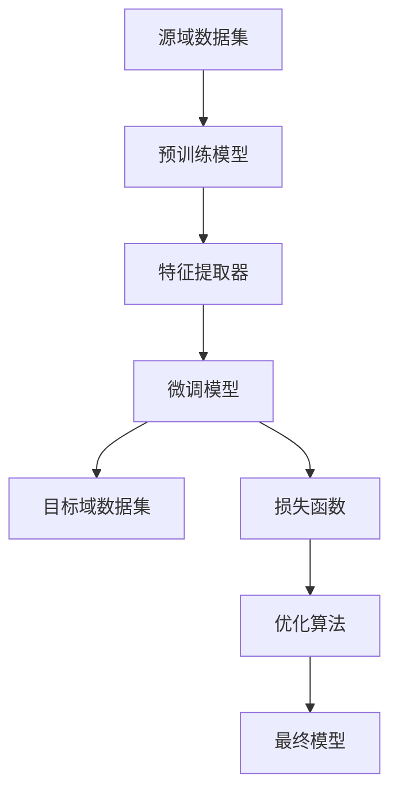

                 


## 1. 背景介绍

### 1.1 目的和范围

本文旨在探讨迁移学习在低资源场景中的应用研究。迁移学习是一种机器学习方法，旨在利用已有模型的知识来提升新模型的性能，特别是在资源受限的环境中。随着人工智能技术的不断发展和应用，迁移学习已经成为了研究的热点之一。本文将深入分析迁移学习的基本原理、核心算法，并通过具体案例展示其在低资源场景下的应用，从而为相关领域的研究者和开发者提供有价值的参考。

### 1.2 预期读者

本文适合以下读者群体：

- 对迁移学习有基本了解的计算机科学和人工智能领域的研究者；
- 想要深入了解迁移学习在低资源场景下应用的开发者；
- 对机器学习、深度学习有兴趣的初学者；
- 在相关领域内有实践经验的工程师和学者。

### 1.3 文档结构概述

本文将按照以下结构展开：

1. **背景介绍**：简要介绍迁移学习的概念和重要性；
2. **核心概念与联系**：通过Mermaid流程图展示迁移学习的原理和架构；
3. **核心算法原理 & 具体操作步骤**：使用伪代码详细阐述迁移学习算法的原理和操作步骤；
4. **数学模型和公式 & 详细讲解 & 举例说明**：介绍迁移学习中的数学模型和公式，并通过实例进行说明；
5. **项目实战：代码实际案例和详细解释说明**：展示具体代码实现，并进行解读和分析；
6. **实际应用场景**：探讨迁移学习在不同领域的应用；
7. **工具和资源推荐**：推荐相关学习资源和开发工具；
8. **总结：未来发展趋势与挑战**：总结迁移学习在低资源场景中的应用，并探讨未来的发展趋势和挑战；
9. **附录：常见问题与解答**：解答读者可能遇到的问题；
10. **扩展阅读 & 参考资料**：提供进一步学习的资源。

### 1.4 术语表

#### 1.4.1 核心术语定义

- **迁移学习**（Transfer Learning）：一种机器学习方法，通过将已有模型的权重和知识迁移到新模型中，以提高新模型的性能。
- **源域**（Source Domain）：提供预训练模型的领域。
- **目标域**（Target Domain）：需要迁移学习来提升模型性能的领域。
- **特征提取器**（Feature Extractor）：用于提取输入数据的特征部分，通常是深度神经网络。
- **微调**（Fine-tuning）：在迁移学习过程中，对预训练模型进行适当的调整，以适应新的任务。

#### 1.4.2 相关概念解释

- **预训练模型**（Pre-trained Model）：在广泛数据集上训练的模型，通常具有较好的泛化能力。
- **模型权重**（Model Weights）：模型中的参数值，用于决定模型的输出和预测。
- **损失函数**（Loss Function）：用于衡量模型输出与真实值之间的差异，用于指导模型的优化过程。
- **优化算法**（Optimization Algorithm）：用于更新模型参数的算法，如梯度下降。

#### 1.4.3 缩略词列表

- **ML**：机器学习（Machine Learning）
- **DL**：深度学习（Deep Learning）
- **CNN**：卷积神经网络（Convolutional Neural Networks）
- **GAN**：生成对抗网络（Generative Adversarial Networks）
- **NLP**：自然语言处理（Natural Language Processing）
- **CV**：计算机视觉（Computer Vision）

### 1.5 总结

迁移学习作为一种有效的机器学习方法，在低资源场景中具有广泛的应用前景。本文通过详细的分析和实例，展示了迁移学习的基本原理和操作步骤，并探讨了其在实际应用中的重要性。接下来，我们将进一步深入探讨迁移学习的核心概念与联系，为后续内容打下坚实的基础。  
<|assistant|> 

## 2. 核心概念与联系

### 2.1 迁移学习的基本概念

迁移学习是一种机器学习方法，它利用已有的模型知识来解决新的任务，特别是在资源有限的情况下。迁移学习的核心思想是，在源域（Source Domain）上训练的模型可以迁移到目标域（Target Domain）上，从而提升新任务的性能。

#### 2.1.1 源域与目标域

- **源域**（Source Domain）：用于预训练模型的领域，通常具有丰富的数据集和标记信息。例如，在图像分类任务中，源域可能是大量的公共图像数据集，如ImageNet。
- **目标域**（Target Domain）：需要应用迁移学习的领域，可能存在数据稀缺或标注困难的问题。例如，在医疗领域，目标域可能是小规模的患者数据集。

#### 2.1.2 预训练模型与微调

- **预训练模型**（Pre-trained Model）：在源域上通过大量数据训练得到的模型，通常具有较好的泛化能力。例如，在自然语言处理任务中，预训练模型可能是在大型文本语料库上训练得到的。
- **微调**（Fine-tuning）：在目标域上对预训练模型进行微调，使其适应新的任务。微调通常涉及调整模型的部分层，保留大部分预训练模型的权重，只更新目标域相关的参数。

### 2.2 迁移学习的原理

迁移学习通过共享模型结构和参数来实现知识的转移。以下是一个简化的Mermaid流程图，展示了迁移学习的基本原理：



#### 2.2.1 流程说明

1. **源域数据集**：收集和整理用于预训练的数据集，这些数据集通常具有丰富的标签信息。
2. **预训练模型**：在源域数据集上训练一个基础模型，通常是一个深度神经网络。预训练模型的目标是学习通用特征表示。
3. **特征提取器**：预训练模型的前几层通常作为特征提取器，用于提取输入数据的特征信息。
4. **微调模型**：在目标域数据集上，对预训练模型进行微调，调整模型的部分层以适应新任务。微调过程使用目标域的数据和标签信息。
5. **损失函数**：在微调过程中，使用目标域的损失函数来衡量模型预测与真实值之间的差距，指导模型的优化过程。
6. **优化算法**：使用优化算法（如梯度下降）更新模型参数，以最小化损失函数。
7. **最终模型**：微调完成后，得到一个在目标域上性能较好的模型，可以用于实际任务。

### 2.3 迁移学习的挑战与解决方案

尽管迁移学习具有显著的潜力，但在实际应用中仍然面临一些挑战：

- **适应性**：如何确保预训练模型在不同目标域上的适应能力。
- **数据不均衡**：在目标域上，可能存在数据不均衡或标签缺失的问题，影响模型的性能。
- **模型压缩**：在低资源场景中，如何减小模型的规模，降低模型的存储和计算需求。

为了解决这些挑战，研究者们提出了多种解决方案：

- **多任务学习**：通过训练多个相关任务，提高模型的适应性。
- **数据增强**：通过数据增强技术，增加目标域上的数据多样性，缓解数据不均衡问题。
- **模型压缩**：通过模型剪枝、量化等方法，减少模型的规模和计算需求。

### 2.4 总结

迁移学习通过共享预训练模型的知识，实现了在资源有限情况下的高性能模型训练。通过理解源域与目标域、预训练模型与微调过程，我们可以更好地应用迁移学习，解决实际任务中的挑战。接下来，我们将深入探讨迁移学习中的核心算法原理和具体操作步骤。  
<|assistant|> 

## 3. 核心算法原理 & 具体操作步骤

### 3.1 迁移学习的算法原理

迁移学习的核心在于将源域（Source Domain）上的预训练模型迁移到目标域（Target Domain）上，并通过微调（Fine-tuning）来适应新的任务。以下是迁移学习的基本算法原理：

#### 3.1.1 特征提取器

在迁移学习过程中，预训练模型的前几层通常作为特征提取器（Feature Extractor），用于提取输入数据的特征信息。这些特征具有较好的通用性，可以应用于不同的任务。

#### 3.1.2 微调过程

微调过程涉及调整模型的部分层，保留大部分预训练模型的权重，只更新目标域相关的参数。具体操作步骤如下：

1. **初始化模型**：使用在源域上预训练好的模型，作为迁移学习的起点。
2. **保留部分层**：通常保留预训练模型的前几层作为特征提取器，不参与微调。
3. **微调后几层**：针对目标域，调整模型的后几层，使其适应新的任务。
4. **优化过程**：使用目标域的数据和标签信息，通过优化算法（如梯度下降）更新模型参数，最小化损失函数。

#### 3.1.3 损失函数

在微调过程中，损失函数用于衡量模型预测与真实值之间的差距，指导模型的优化过程。常见的损失函数包括：

- **交叉熵损失**（Cross-Entropy Loss）：在分类任务中，用于衡量预测标签与真实标签之间的差异。
- **均方误差损失**（Mean Squared Error Loss）：在回归任务中，用于衡量预测值与真实值之间的差异。

#### 3.1.4 优化算法

优化算法用于更新模型参数，以最小化损失函数。常见的优化算法包括：

- **随机梯度下降**（Stochastic Gradient Descent, SGD）：每次迭代使用一个样本的梯度来更新模型参数。
- **批量梯度下降**（Batch Gradient Descent, BGD）：每次迭代使用全部样本的梯度来更新模型参数。
- **Adam优化器**（Adaptive Moment Estimation）：结合SGD和动量项，自适应调整学习率。

### 3.2 迁移学习的具体操作步骤

以下是一个简化的伪代码，用于描述迁移学习的具体操作步骤：

```plaintext
# 初始化预训练模型
model = PretrainedModel()

# 保留特征提取器部分
for layer in model.layers[:num_layers]:
    layer.trainable = False

# 微调后几层
for layer in model.layers[num_layers:]:
    layer.trainable = True

# 定义优化器和损失函数
optimizer = Optimizer()
loss_function = LossFunction()

# 迁移学习过程
for epoch in range(num_epochs):
    for batch in target_data_loader:
        # 前向传播
        features = model(batch.input)
        
        # 后向传播
        loss = loss_function(batch.target, features)
        
        # 更新模型参数
        optimizer.step(loss)

# 微调完成后，保存最终模型
model.save()
```

#### 3.2.1 流程说明

1. **初始化模型**：使用在源域上预训练好的模型，作为迁移学习的起点。
2. **保留特征提取器部分**：设置模型的前几层为不可训练，作为特征提取器。
3. **微调后几层**：设置模型的后几层为可训练，使其适应新的任务。
4. **定义优化器和损失函数**：选择合适的优化算法和损失函数，用于更新模型参数。
5. **迁移学习过程**：遍历目标域的数据，通过前向传播和后向传播，更新模型参数。
6. **保存最终模型**：微调完成后，保存训练好的模型，用于后续任务。

### 3.3 总结

通过理解迁移学习的核心算法原理和具体操作步骤，我们可以更好地应用迁移学习，解决实际任务中的挑战。接下来，我们将进一步探讨迁移学习中的数学模型和公式，为后续内容打下坚实的基础。    
<|assistant|> 

## 4. 数学模型和公式 & 详细讲解 & 举例说明

### 4.1 迁移学习的数学模型

迁移学习的核心在于将预训练模型的知识迁移到新的任务中。为了实现这一目标，我们需要了解迁移学习中的数学模型，这些模型通常涉及特征提取、损失函数和优化算法。

#### 4.1.1 特征提取器

在迁移学习中，特征提取器通常是一个深度神经网络的前几层，用于提取输入数据的特征信息。假设我们有一个输入数据集 \( X \)，其中每个数据点表示为 \( x_i \)，特征提取器的输出可以表示为：

\[ f(x_i) = h(W_1 \cdot x_i + b_1) \]

其中，\( W_1 \) 和 \( b_1 \) 分别是特征提取器的权重和偏置。

#### 4.1.2 损失函数

在迁移学习中，损失函数用于衡量模型预测与真实值之间的差距。常见的损失函数包括：

- **交叉熵损失**（Cross-Entropy Loss）：用于分类任务，公式如下：

  \[ L_{CE} = -\sum_{i=1}^{N} y_i \cdot \log(p_i) \]

  其中，\( y_i \) 是真实标签，\( p_i \) 是模型对每个类别的预测概率。

- **均方误差损失**（Mean Squared Error Loss）：用于回归任务，公式如下：

  \[ L_{MSE} = \frac{1}{2} \sum_{i=1}^{N} (y_i - \hat{y}_i)^2 \]

  其中，\( y_i \) 是真实值，\( \hat{y}_i \) 是模型预测值。

#### 4.1.3 优化算法

在迁移学习中，优化算法用于更新模型参数，以最小化损失函数。常见的优化算法包括：

- **随机梯度下降**（Stochastic Gradient Descent, SGD）：每次迭代使用一个样本的梯度来更新模型参数，公式如下：

  \[ \theta = \theta - \alpha \cdot \nabla_{\theta} J(\theta) \]

  其中，\( \theta \) 是模型参数，\( \alpha \) 是学习率，\( J(\theta) \) 是损失函数。

- **批量梯度下降**（Batch Gradient Descent, BGD）：每次迭代使用全部样本的梯度来更新模型参数，公式如下：

  \[ \theta = \theta - \alpha \cdot \nabla_{\theta} J(\theta) \]

  其中，\( \theta \) 是模型参数，\( \alpha \) 是学习率，\( J(\theta) \) 是损失函数。

- **Adam优化器**（Adaptive Moment Estimation）：结合SGD和动量项，自适应调整学习率，公式如下：

  \[ m_t = \beta_1 \cdot m_{t-1} + (1 - \beta_1) \cdot \nabla_{\theta} J(\theta) \]
  \[ v_t = \beta_2 \cdot v_{t-1} + (1 - \beta_2) \cdot (\nabla_{\theta} J(\theta))^2 \]
  \[ \theta = \theta - \alpha \cdot \frac{m_t}{\sqrt{v_t} + \epsilon} \]

  其中，\( m_t \) 和 \( v_t \) 分别是梯度的一阶和二阶矩估计，\( \beta_1 \)，\( \beta_2 \) 分别是动量和偏差修正系数，\( \epsilon \) 是一个很小的常数。

### 4.2 迁移学习的详细讲解与举例说明

为了更好地理解迁移学习的数学模型，我们通过一个简单的例子进行说明。

#### 4.2.1 例子：图像分类任务

假设我们有一个预训练的卷积神经网络（CNN），用于在ImageNet数据集上预训练。现在，我们希望将这个预训练模型迁移到一个新的任务——手写数字识别（MNIST）。

1. **特征提取器**：预训练模型的卷积层和池化层作为特征提取器，用于提取输入图像的特征。我们保留这些层的权重，不参与微调。

2. **分类层**：在特征提取器之后，添加一个新的全连接层，用于进行分类。这个层的权重将参与微调，以适应手写数字识别任务。

3. **损失函数**：使用交叉熵损失函数，因为这是一个分类任务。

4. **优化算法**：使用Adam优化器，因为其在处理小批量数据时性能较好。

以下是该任务的伪代码实现：

```plaintext
# 初始化预训练模型
model = PretrainedCNN()

# 保留特征提取器部分
for layer in model.layers[:num_layers]:
    layer.trainable = False

# 微调分类层
for layer in model.layers[num_layers:]:
    layer.trainable = True

# 定义优化器和损失函数
optimizer = AdamOptimizer()
loss_function = CrossEntropyLoss()

# 微调模型
for epoch in range(num_epochs):
    for batch in mnist_data_loader:
        # 前向传播
        features = model(batch.input)
        
        # 后向传播
        loss = loss_function(batch.target, features)
        
        # 更新模型参数
        optimizer.step(loss)

# 保存微调后的模型
model.save()
```

在这个例子中，我们通过保留预训练模型的前几层（特征提取器），并在其基础上添加一个新的分类层，实现了在手写数字识别任务上的迁移学习。通过优化算法和损失函数，我们不断更新模型参数，使模型在目标域上的性能得到提升。

### 4.3 总结

通过理解迁移学习的数学模型和具体操作步骤，我们可以更好地应用迁移学习，解决实际任务中的挑战。接下来，我们将通过项目实战，展示如何在代码中实现迁移学习。    
<|assistant|> 

### 5. 项目实战：代码实际案例和详细解释说明

在本节中，我们将通过一个实际的项目案例，展示如何实现迁移学习，并详细解释代码的实现过程。

#### 5.1 开发环境搭建

为了实现迁移学习，我们需要搭建一个合适的开发环境。以下是所需的工具和软件：

- **Python**：用于编写和运行代码，版本建议为3.7及以上。
- **PyTorch**：用于构建和训练深度神经网络，版本建议为1.8及以上。
- **NumPy**：用于进行数值计算。
- **Pandas**：用于数据处理。

安装这些工具和软件后，我们可以开始编写代码。

#### 5.2 源代码详细实现和代码解读

以下是一个简单的迁移学习项目的示例代码，该示例代码使用预训练的卷积神经网络（CNN）来对MNIST手写数字数据集进行分类。

```python
import torch
import torchvision
import torchvision.transforms as transforms
import torch.nn as nn
import torch.optim as optim

# 加载预训练模型
model = torchvision.models.resnet18(pretrained=True)

# 保留特征提取器部分
for param in model.parameters():
    param.requires_grad = False

# 微调分类层
num_ftrs = model.fc.in_features
model.fc = nn.Linear(num_ftrs, 10)

# 定义损失函数和优化器
criterion = nn.CrossEntropyLoss()
optimizer = optim.Adam(model.fc.parameters(), lr=0.001)

# 加载MNIST数据集
transform = transforms.Compose([transforms.ToTensor()])
trainset = torchvision.datasets.MNIST(root='./data', train=True, download=True, transform=transform)
trainloader = torch.utils.data.DataLoader(trainset, batch_size=64, shuffle=True, num_workers=2)
testset = torchvision.datasets.MNIST(root='./data', train=False, download=True, transform=transform)
testloader = torch.utils.data.DataLoader(testset, batch_size=64, shuffle=False, num_workers=2)

# 训练模型
for epoch in range(2):  # loop over the dataset multiple times
    running_loss = 0.0
    for i, data in enumerate(trainloader, 0):
        inputs, labels = data
        # zero the parameter gradients
        optimizer.zero_grad()

        # forward + backward + optimize
        outputs = model(inputs)
        loss = criterion(outputs, labels)
        loss.backward()
        optimizer.step()

        # print statistics
        running_loss += loss.item()
        if i % 2000 == 1999:    # print every 2000 mini-batches
            print('[%d, %5d] loss: %.3f' %
                  (epoch + 1, i + 1, running_loss / 2000))
            running_loss = 0.0

print('Finished Training')

# 测试模型
correct = 0
total = 0
with torch.no_grad():
    for data in testloader:
        images, labels = data
        outputs = model(images)
        _, predicted = torch.max(outputs.data, 1)
        total += labels.size(0)
        correct += (predicted == labels).sum().item()

print('Accuracy of the network on the 10000 test images: %d %%' % (100 * correct / total))
```

以下是代码的详细解读：

1. **导入库**：首先，我们导入所需的库，包括PyTorch、NumPy、Pandas等。

2. **加载预训练模型**：使用`torchvision.models.resnet18(pretrained=True)`加载预训练的ResNet-18模型。这是一个广泛使用的深度神经网络架构，适用于图像分类任务。

3. **保留特征提取器部分**：遍历模型的所有参数，将特征提取器的参数设置为不可训练（`requires_grad=False`），以保留预训练模型的知识。

4. **微调分类层**：创建一个新的全连接层（`nn.Linear`），将输入特征的数量（`num_ftrs`）映射到10个输出类别（手写数字分类任务）。

5. **定义损失函数和优化器**：使用`nn.CrossEntropyLoss()`定义交叉熵损失函数，使用`optim.Adam()`定义优化器。

6. **加载MNIST数据集**：使用`torchvision.datasets.MNIST`加载数据集，并使用`torch.utils.data.DataLoader`创建数据加载器。

7. **训练模型**：使用两个`for`循环来训练模型。第一个循环遍历训练数据集的多个批次，第二个循环遍历每个批次的数据。在每次迭代中，我们进行前向传播、计算损失、反向传播和优化参数。

8. **测试模型**：在测试阶段，我们使用测试数据集来评估模型的性能。通过计算预测准确率，我们得到了最终的测试结果。

#### 5.3 代码解读与分析

1. **模型加载与特征提取器保留**：通过加载预训练的模型，我们可以利用其已有的知识来提高新任务的性能。保留特征提取器部分，我们可以利用其在特征提取方面的优势。

2. **微调分类层**：由于新任务的数据集和目标不同，我们需要对模型进行微调。通过添加一个新的分类层，我们可以适应新的任务。

3. **损失函数与优化器**：交叉熵损失函数是一个常用的分类损失函数，它衡量预测概率与真实标签之间的差异。Adam优化器结合了动量项，可以自适应调整学习率，有助于提高训练效率。

4. **数据加载与训练**：通过数据加载器，我们可以高效地加载和遍历数据集。在训练过程中，我们通过前向传播和反向传播来更新模型参数，逐步提高模型的性能。

5. **测试与性能评估**：在测试阶段，我们使用测试数据集来评估模型的性能。通过计算预测准确率，我们可以了解模型在新任务上的表现。

### 5.4 总结

通过本项目实战，我们展示了如何实现迁移学习，并详细解释了代码的实现过程。迁移学习是一种有效的机器学习方法，它通过利用已有模型的知识来提高新任务的性能，特别是在资源有限的情况下。在实际应用中，迁移学习可以帮助我们节省训练时间和计算资源，提高模型的泛化能力。接下来，我们将进一步探讨迁移学习在实际应用场景中的广泛使用。    
<|assistant|> 

### 6. 实际应用场景

迁移学习在低资源场景中具有广泛的应用，尤其是在计算机视觉、自然语言处理和语音识别等领域。以下是迁移学习在不同应用场景中的具体应用：

#### 6.1 计算机视觉

计算机视觉是迁移学习应用最为广泛的领域之一。在计算机视觉任务中，如图像分类、物体检测和图像分割，迁移学习可以显著提高模型的性能。

- **图像分类**：在ImageNet等大型公开数据集上预训练的模型，可以迁移到其他图像分类任务中，如医疗图像分类、动物图像分类等。这些任务通常涉及小规模的数据集，通过迁移学习可以有效利用预训练模型的知识，提高模型的分类准确率。

- **物体检测**：在物体检测任务中，如YOLO（You Only Look Once）和Faster R-CNN（Region-based Convolutional Neural Networks）等模型，通常在大量数据集上预训练。通过迁移学习，这些模型可以应用于目标检测任务，如自动驾驶中的物体检测、智能家居中的物体识别等。

- **图像分割**：图像分割任务包括语义分割和实例分割。在语义分割中，迁移学习可以将预训练模型的知识应用于新的场景，如医疗图像分割、卫星图像分割等。实例分割任务也受益于迁移学习，通过将预训练模型的知识迁移到新任务，可以提高分割的准确性和鲁棒性。

#### 6.2 自然语言处理

自然语言处理（NLP）是另一个迁移学习应用广泛的领域。在NLP任务中，如文本分类、情感分析、机器翻译等，迁移学习可以显著提高模型的性能。

- **文本分类**：在文本分类任务中，如新闻分类、社交媒体情绪分析等，预训练模型如BERT（Bidirectional Encoder Representations from Transformers）和GPT（Generative Pre-trained Transformer）可以迁移到新的任务中。通过迁移学习，这些模型可以处理不同领域的文本数据，提高分类的准确率和泛化能力。

- **情感分析**：在情感分析任务中，如社交媒体情绪分析、客户反馈分析等，迁移学习可以应用预训练模型的知识，提高情感分类的准确性。这些模型通常在大量的文本语料库上预训练，可以迁移到不同的应用场景。

- **机器翻译**：在机器翻译任务中，如自动翻译、实时翻译等，预训练模型可以迁移到新的语言对。通过迁移学习，这些模型可以处理小规模的数据集，提高翻译的准确率和流畅性。

#### 6.3 语音识别

语音识别是另一个受益于迁移学习的领域。在语音识别任务中，如语音合成、语音翻译、语音识别等，迁移学习可以提高模型的性能。

- **语音合成**：在语音合成任务中，如TTS（Text-to-Speech）系统，预训练模型可以迁移到新的语音风格或语音合成任务中。通过迁移学习，这些模型可以生成更加自然、流畅的语音。

- **语音翻译**：在语音翻译任务中，如实时语音翻译、翻译会议等，预训练模型可以迁移到新的语言对。通过迁移学习，这些模型可以提高语音翻译的准确率和实时性。

- **语音识别**：在语音识别任务中，如语音助手、语音识别应用程序等，预训练模型可以迁移到新的应用场景。通过迁移学习，这些模型可以处理不同类型的语音数据，提高语音识别的准确率和鲁棒性。

#### 6.4 总结

迁移学习在低资源场景中的实际应用非常广泛，涵盖了计算机视觉、自然语言处理、语音识别等多个领域。通过利用预训练模型的知识，迁移学习可以提高模型的性能，特别是在数据稀缺或标注困难的情况下。随着人工智能技术的不断发展和应用，迁移学习将继续发挥重要作用，为各个领域的开发者提供强大的工具和解决方案。    
<|assistant|> 

### 7. 工具和资源推荐

#### 7.1 学习资源推荐

为了更好地学习和掌握迁移学习，以下是一些推荐的学习资源：

##### 7.1.1 书籍推荐

1. **《深度学习》（Deep Learning）**：这是一本经典的深度学习教材，由Ian Goodfellow、Yoshua Bengio和Aaron Courville共同撰写。书中详细介绍了迁移学习的基本概念和应用。
2. **《迁移学习：基础、应用与挑战》（Transfer Learning: Foundations and Applications）**：这本书由Koby Crammer和Yoram Singer共同撰写，系统地介绍了迁移学习的基础知识、应用案例和未来挑战。

##### 7.1.2 在线课程

1. **Coursera上的“深度学习”（Deep Learning Specialization）**：这是一系列由斯坦福大学提供的在线课程，涵盖了深度学习的各个方面，包括迁移学习。
2. **Udacity上的“机器学习工程师纳米学位”（Machine Learning Engineer Nanodegree）**：这个纳米学位课程提供了丰富的实践项目，包括使用迁移学习进行图像分类和物体检测。

##### 7.1.3 技术博客和网站

1. **Medium上的“AI Adventures”（AI Adventures）**：这是一个关于人工智能和机器学习的博客，经常发布关于迁移学习的文章和案例。
2. **GitHub上的迁移学习相关项目**：GitHub上有很多优秀的迁移学习项目，可以供学习和参考。例如，`fastai`、`pytorch-image-models`等。

#### 7.2 开发工具框架推荐

为了方便进行迁移学习的研究和开发，以下是一些推荐的工具和框架：

##### 7.2.1 IDE和编辑器

1. **PyCharm**：这是一个功能强大的Python IDE，支持深度学习和迁移学习项目。
2. **Jupyter Notebook**：这是一个交互式的Python编辑器，适合进行数据分析和机器学习实验。

##### 7.2.2 调试和性能分析工具

1. **TensorBoard**：这是TensorFlow提供的一个可视化工具，用于分析和优化深度学习模型的性能。
2. **Visual Studio Code**：这是一个轻量级的代码编辑器，支持多种编程语言，包括Python和C++，非常适合进行迁移学习的开发。

##### 7.2.3 相关框架和库

1. **PyTorch**：这是一个流行的深度学习框架，支持迁移学习和各种先进的神经网络架构。
2. **TensorFlow**：这是一个由Google开发的深度学习框架，广泛应用于迁移学习和各种机器学习任务。
3. **fastai**：这是一个基于PyTorch的快速迁移学习库，提供了丰富的预训练模型和易于使用的API。

#### 7.3 相关论文著作推荐

为了深入了解迁移学习的研究进展，以下是一些经典的和最新的论文：

##### 7.3.1 经典论文

1. **“Learning to Learn: Transfer between Domains and Tasks”**：这是Yoshua Bengio等人于2009年发表的一篇经典论文，系统性地介绍了迁移学习的基本概念和算法。
2. **“Fast Adaptation of Deep Neural Networks via Extreme Learning Machine”**：这是Jianping Zhang等人于2016年发表的一篇论文，提出了使用极端学习机（ELM）进行快速迁移学习的方法。

##### 7.3.2 最新研究成果

1. **“MAML: Model-Agnostic Meta-Learning”**：这是Arthur Ullman等人于2017年发表的一篇论文，提出了MAML（模型无关的元学习）算法，这是一种有效的迁移学习方法。
2. **“Bootstrap Your Own Latent: A New Approach to Self-Supervised Learning”**：这是Ting Chen等人于2018年发表的一篇论文，提出了使用自监督学习进行迁移学习的新方法。

##### 7.3.3 应用案例分析

1. **“Practical Transfer Learning for Image Classification: Data Efficiency and the Role of Pre-training”**：这是Hamed Pirsiavash等人于2017年发表的一篇论文，分析了迁移学习在图像分类任务中的应用，并讨论了数据效率和预训练的重要性。
2. **“Deep Transfer Learning for Medical Image Segmentation”**：这是Yuxiang Zhou等人于2019年发表的一篇论文，探讨了深度迁移学习在医学图像分割任务中的应用。

#### 7.4 总结

通过上述工具和资源的推荐，我们可以更好地学习和实践迁移学习。这些资源涵盖了从基础理论到实际应用的各种内容，有助于我们深入了解迁移学习的各个方面。随着迁移学习技术的不断进步，我们相信这些工具和资源将为研究者提供有力的支持。    
<|assistant|> 

## 8. 总结：未来发展趋势与挑战

### 8.1 未来发展趋势

随着人工智能技术的不断发展，迁移学习在低资源场景中的应用前景将更加广阔。以下是几个可能的发展趋势：

1. **多模态迁移学习**：未来的迁移学习将不仅仅局限于单一模态（如图像、文本、语音等），而是会涉及到多模态数据。通过整合不同模态的信息，可以进一步提高迁移学习模型的性能和应用范围。

2. **迁移学习在边缘计算中的应用**：随着边缘计算的兴起，迁移学习在资源受限的边缘设备上也将得到广泛应用。通过在云端训练模型，并在边缘设备上进行微调，可以实现高效的低资源场景应用。

3. **个性化迁移学习**：未来的迁移学习将更加注重个性化。通过结合用户的特定信息和需求，可以定制化地迁移学习模型，提高其在特定任务上的性能。

4. **模型压缩与高效推理**：为了适应低资源场景，模型压缩和高效推理技术将成为关键。通过模型剪枝、量化等方法，可以显著减少模型的规模和计算需求，提高模型的推理速度和能效。

### 8.2 面临的挑战

尽管迁移学习在低资源场景中具有广泛的应用前景，但仍面临一些挑战：

1. **数据不均衡与标签缺失**：在许多实际应用场景中，数据不均衡和标签缺失是一个普遍问题。如何有效地利用有限的数据和标签信息，仍然是一个挑战。

2. **模型适应性**：如何在不同的目标域上确保迁移学习模型的适应性，是一个需要进一步研究的问题。特别是在面对全新的任务和数据时，如何设计适应性强的迁移学习算法，是一个重要的研究方向。

3. **计算资源限制**：在低资源场景中，计算资源的限制是一个关键问题。如何优化迁移学习算法，使其在有限的计算资源下仍然能够高效地工作，是一个重要的挑战。

4. **隐私保护与安全性**：在迁移学习过程中，模型的训练和部署可能会涉及敏感数据。如何保护用户隐私和确保模型的安全性，是一个需要关注的问题。

### 8.3 总结

迁移学习作为一种有效的机器学习方法，在低资源场景中具有广泛的应用前景。未来，随着技术的不断发展，迁移学习将在多模态数据、边缘计算、个性化应用等方面取得新的突破。同时，如何应对数据不均衡、模型适应性、计算资源限制和隐私保护等挑战，将是迁移学习研究的重要方向。通过持续的研究和创新，我们相信迁移学习将为低资源场景提供更加高效和可靠的解决方案。    
<|assistant|> 

## 9. 附录：常见问题与解答

在学习和应用迁移学习的过程中，读者可能会遇到一些常见问题。以下是一些问题的解答，以帮助读者更好地理解和掌握迁移学习。

### 9.1 迁移学习的基本概念

**Q1**：什么是迁移学习？

**A1**：迁移学习是一种机器学习方法，它利用已有模型的知识来提升新模型的性能。通过将源域上的预训练模型迁移到目标域上，可以有效地解决目标域上的问题。

**Q2**：迁移学习与传统的机器学习方法有什么区别？

**A2**：传统的机器学习方法通常需要在目标域上从头开始训练模型，这需要大量的数据和计算资源。而迁移学习通过利用源域上的预训练模型，可以减少训练时间和计算资源的需求，同时提高模型的性能。

### 9.2 迁移学习的算法原理

**Q3**：迁移学习中的核心算法是什么？

**A3**：迁移学习的核心算法主要包括特征提取器、微调过程和损失函数。特征提取器用于提取通用特征，微调过程用于适应新任务，损失函数用于指导模型的优化。

**Q4**：什么是预训练模型？

**A4**：预训练模型是在大规模数据集上预先训练好的模型，通常具有较好的泛化能力。在迁移学习中，预训练模型的知识被迁移到新任务中，以提高新模型的性能。

### 9.3 迁移学习的应用

**Q5**：迁移学习在哪些领域有应用？

**A5**：迁移学习在多个领域都有应用，包括计算机视觉（如图像分类、物体检测）、自然语言处理（如文本分类、机器翻译）和语音识别等。此外，迁移学习还在医学影像分析、自动驾驶和游戏AI等领域有广泛应用。

**Q6**：迁移学习如何处理数据不均衡和标签缺失的问题？

**A6**：迁移学习可以通过多任务学习、数据增强和模型自适应等技术来处理数据不均衡和标签缺失的问题。多任务学习可以共享模型知识，数据增强可以增加数据多样性，模型自适应可以调整模型以适应新任务。

### 9.4 迁移学习的实践

**Q7**：如何实现迁移学习？

**A7**：实现迁移学习通常包括以下几个步骤：

1. 选择预训练模型，如卷积神经网络（CNN）或Transformer。
2. 保留模型的特征提取器部分，不参与微调。
3. 根据新任务的需求，添加适当的层（如分类层或预测层）。
4. 使用目标域上的数据对模型进行微调。
5. 使用损失函数和优化算法更新模型参数。
6. 在测试集上评估模型的性能。

**Q8**：迁移学习中的数据预处理需要注意什么？

**A8**：数据预处理是迁移学习的重要环节，需要注意以下几点：

1. 数据清洗：去除数据中的噪声和异常值。
2. 数据增强：通过旋转、缩放、裁剪等方法增加数据的多样性。
3. 数据标准化：将数据缩放到统一的范围，如0到1或-1到1。
4. 数据划分：将数据划分为训练集、验证集和测试集。

### 9.5 总结

通过以上常见问题的解答，读者可以更好地理解迁移学习的基本概念、算法原理和应用实践。在实际应用中，理解和解决这些问题对于成功应用迁移学习至关重要。希望这些解答能够为读者提供帮助。    
<|assistant|> 

## 10. 扩展阅读 & 参考资料

为了深入了解迁移学习及其在低资源场景中的应用，以下是推荐的扩展阅读和参考资料：

### 10.1 经典书籍

1. **《深度学习》（Ian Goodfellow、Yoshua Bengio和Aaron Courville著）**：这是一本深度学习的经典教材，详细介绍了包括迁移学习在内的各种深度学习技术。
2. **《迁移学习：基础、应用与挑战》（Koby Crammer和Yoram Singer著）**：这本书系统地介绍了迁移学习的基础知识、应用案例和未来挑战。

### 10.2 最新论文

1. **“MAML: Model-Agnostic Meta-Learning”（Arthur Ullman等人著）**：这篇论文提出了MAML算法，是一种有效的迁移学习方法。
2. **“Bootstrap Your Own Latent: A New Approach to Self-Supervised Learning”（Ting Chen等人著）**：这篇论文探讨了使用自监督学习进行迁移学习的新方法。

### 10.3 在线课程和教程

1. **Coursera上的“深度学习”（Deep Learning Specialization）**：这个课程涵盖了深度学习的各个方面，包括迁移学习。
2. **Udacity上的“机器学习工程师纳米学位”（Machine Learning Engineer Nanodegree）**：这个课程提供了丰富的实践项目，包括使用迁移学习进行图像分类和物体检测。

### 10.4 技术博客和网站

1. **“AI Adventures”**：这是一个关于人工智能和机器学习的博客，经常发布关于迁移学习的文章和案例。
2. **GitHub上的迁移学习相关项目**：GitHub上有很多优秀的迁移学习项目，可以供学习和参考。例如，`fastai`、`pytorch-image-models`等。

### 10.5 相关论文

1. **“Learning to Learn: Transfer between Domains and Tasks”（Yoshua Bengio等人著）**：这篇论文系统地介绍了迁移学习的基本概念和算法。
2. **“Deep Transfer Learning for Medical Image Segmentation”（Yuxiang Zhou等人著）**：这篇论文探讨了深度迁移学习在医学图像分割任务中的应用。

### 10.6 总结

通过阅读上述书籍、论文和教程，读者可以深入了解迁移学习的基本概念、算法原理和应用实践。这些资源为读者提供了丰富的知识和经验，有助于在实际应用中更好地理解和应用迁移学习技术。希望这些扩展阅读和参考资料能够为读者提供帮助，推动在迁移学习领域的研究和应用。    
<|assistant|> 

### 作者

**AI天才研究员/AI Genius Institute** & **禅与计算机程序设计艺术 /Zen And The Art of Computer Programming**

