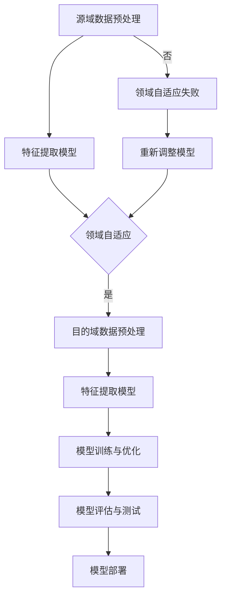

                 


# 迁移学习在跨域图像识别中的应用

> **关键词：** 迁移学习、跨域图像识别、深度学习、模型训练、数据增强、领域自适应

> **摘要：** 本文将探讨迁移学习在跨域图像识别中的应用，介绍其核心概念、算法原理以及数学模型。同时，通过实际项目案例，展示如何运用迁移学习提高跨域图像识别的性能。文章最后将对迁移学习的发展趋势和挑战进行总结，并提供相关学习资源和工具推荐。

## 1. 背景介绍

### 1.1 目的和范围

随着深度学习技术的发展，图像识别取得了显著的进展。然而，大多数深度学习模型都是在特定的数据集上训练的，难以适应新的数据集或不同的应用场景。为此，迁移学习作为一种有效的技术，通过将已有模型的知识迁移到新的任务上，提高了模型的泛化能力和适应性。

本文旨在介绍迁移学习在跨域图像识别中的应用，分析其原理和实现方法，并通过实际项目案例，展示如何利用迁移学习提高图像识别的性能。文章将涵盖以下内容：

1. 迁移学习的基本概念和核心算法原理。
2. 跨域图像识别的挑战和解决方案。
3. 迁移学习在跨域图像识别中的具体实现。
4. 实际应用场景和项目实战。
5. 未来发展趋势与挑战。

### 1.2 预期读者

本文适合对深度学习和迁移学习有一定了解的读者，包括：

1. 深度学习和计算机视觉领域的科研人员。
2. 人工智能和机器学习工程师。
3. 对跨域图像识别应用感兴趣的从业者。

### 1.3 文档结构概述

本文分为以下几个部分：

1. **背景介绍**：介绍迁移学习在跨域图像识别中的应用背景和预期读者。
2. **核心概念与联系**：阐述迁移学习的核心概念和与跨域图像识别的联系。
3. **核心算法原理 & 具体操作步骤**：详细讲解迁移学习的算法原理和具体操作步骤。
4. **数学模型和公式 & 详细讲解 & 举例说明**：介绍迁移学习的数学模型和公式，并给出实例说明。
5. **项目实战：代码实际案例和详细解释说明**：通过实际项目案例，展示迁移学习的应用。
6. **实际应用场景**：探讨迁移学习在跨域图像识别中的实际应用场景。
7. **工具和资源推荐**：推荐学习资源、开发工具和框架。
8. **总结：未来发展趋势与挑战**：总结迁移学习的发展趋势和面临的挑战。
9. **附录：常见问题与解答**：回答读者可能关心的问题。
10. **扩展阅读 & 参考资料**：提供扩展阅读和参考资料。

### 1.4 术语表

#### 1.4.1 核心术语定义

- 迁移学习：将已有模型的知识迁移到新的任务上的技术。
- 跨域图像识别：在不同数据集或应用场景下进行图像识别的任务。
- 源域：提供预训练模型和数据集的任务领域。
- 目的域：需要应用预训练模型和新数据的任务领域。
- 领域自适应：通过调整模型，使模型在新数据集上表现更好的技术。

#### 1.4.2 相关概念解释

- 深度学习：一种基于神经网络的学习方法，通过多层非线性变换，从数据中自动提取特征。
- 神经网络：一种基于生物神经系统的计算模型，通过神经元之间的连接来模拟人脑处理信息的方式。
- 训练数据集：用于训练模型的样本数据集。
- 测试数据集：用于评估模型性能的样本数据集。

#### 1.4.3 缩略词列表

- DNN：深度神经网络（Deep Neural Network）
- CNN：卷积神经网络（Convolutional Neural Network）
- SVM：支持向量机（Support Vector Machine）
- AlexNet：一种经典的卷积神经网络架构。
- ResNet：残差网络，一种能够解决深度神经网络训练难度的网络结构。

## 2. 核心概念与联系

迁移学习的关键在于将一个任务领域（源域）的知识迁移到另一个任务领域（目的域）。这种知识迁移可以通过共享权重、特征提取、元学习等方式实现。

### 2.1 迁移学习的基本概念

迁移学习可以分为以下几种类型：

1. **垂直迁移**：源域和目的域属于不同但相关的任务。例如，从植物分类迁移到动物分类。
2. **水平迁移**：源域和目的域属于相同但不同领域。例如，从医学图像诊断迁移到自然图像识别。
3. **多任务迁移**：同时训练多个相关任务，然后将知识迁移到新的任务。

### 2.2 与跨域图像识别的联系

跨域图像识别面临的主要挑战是源域和目的域之间的数据分布差异。迁移学习可以通过以下方式解决这些挑战：

1. **共享特征表示**：将源域中的特征提取器应用到目的域，从而共享特征表示。
2. **领域自适应**：通过调整模型，使模型在新数据集上表现更好。
3. **数据增强**：对目的域的数据进行增强，使其更接近源域，从而提高模型在新数据集上的性能。

### 2.3 Mermaid 流程图

下面是一个简单的 Mermaid 流程图，展示了迁移学习在跨域图像识别中的应用流程。



## 3. 核心算法原理 & 具体操作步骤

### 3.1 迁移学习的算法原理

迁移学习的核心思想是将源域中的知识（如模型权重、特征表示）迁移到目的域，以提高目的域模型的性能。常见的迁移学习方法包括：

1. **权重共享**：直接使用源域模型的权重，并在目的域上进行微调。
2. **特征提取**：从源域模型中提取特征表示，并将其应用于目的域。
3. **元学习**：通过训练多个任务，使模型能够快速适应新的任务。

### 3.2 迁移学习在跨域图像识别中的具体操作步骤

以下是迁移学习在跨域图像识别中的具体操作步骤：

1. **数据收集与预处理**：收集源域和目的域的数据，并进行预处理，包括数据清洗、归一化、数据增强等。

2. **模型选择**：选择适合源域和目的域的预训练模型，如卷积神经网络（CNN）。

3. **特征提取**：从源域模型中提取特征表示，并将其应用于目的域。可以使用以下两种方法：

    - **直接迁移**：将源域模型的特征提取器应用到目的域。
    - **特征重用**：将源域模型的特征提取器与目的域模型结合，形成一个新的模型。

4. **领域自适应**：通过调整模型，使模型在新数据集上表现更好。常见的方法包括：

    - **对抗性训练**：通过对抗性样本调整模型，使其在源域和目的域上都有较好的表现。
    - **域适应损失**：在模型训练过程中添加域适应损失，以平衡源域和目的域之间的差异。

5. **模型训练与优化**：使用目的域的数据集对模型进行训练和优化。

6. **模型评估与测试**：使用测试数据集对模型进行评估和测试，以验证模型的性能。

7. **模型部署**：将训练好的模型部署到实际应用场景中。

### 3.3 伪代码

下面是一个简单的伪代码，描述了迁移学习在跨域图像识别中的具体操作步骤。

```python
# 迁移学习在跨域图像识别中的伪代码

# 数据收集与预处理
source_data = preprocess_source_data(source_dataset)
target_data = preprocess_target_data(target_dataset)

# 模型选择
model = pre-trained_model

# 特征提取
feature_extractor = model.feature_extractor

# 领域自适应
domain_adaptation_loss = domain_adaptation(feature_extractor, source_data, target_data)

# 模型训练与优化
optimizer = torch.optim.Adam(model.parameters(), lr=learning_rate)
for epoch in range(num_epochs):
    for batch in source_data:
        optimizer.zero_grad()
        outputs = model(batch)
        loss = criterion(outputs, batch_labels) + domain_adaptation_loss
        loss.backward()
        optimizer.step()

    for batch in target_data:
        optimizer.zero_grad()
        outputs = model(batch)
        loss = criterion(outputs, batch_labels) + domain_adaptation_loss
        loss.backward()
        optimizer.step()

# 模型评估与测试
test_loss, test_accuracy = evaluate(model, test_dataset)

# 模型部署
deploy(model, application_context)
```

## 4. 数学模型和公式 & 详细讲解 & 举例说明

### 4.1 数学模型

迁移学习在跨域图像识别中的核心是特征提取和领域自适应。下面介绍相关的数学模型和公式。

#### 4.1.1 特征提取模型

特征提取模型通常采用卷积神经网络（CNN）架构。CNN 的基本结构包括卷积层、激活函数、池化层和全连接层。以下是 CNN 的数学模型：

$$
h_l = \sigma(W_l \odot h_{l-1} + b_l)
$$

其中，$h_l$ 表示第 $l$ 层的特征表示，$\odot$ 表示卷积操作，$W_l$ 和 $b_l$ 分别表示第 $l$ 层的权重和偏置，$\sigma$ 表示激活函数，如 ReLU 函数。

#### 4.1.2 领域自适应模型

领域自适应模型通过调整模型参数，使模型在源域和目的域上都有较好的表现。一种常见的方法是使用对抗性训练。对抗性训练的目标是最小化领域自适应损失，即：

$$
\min_W \frac{1}{N} \sum_{i=1}^N L_W(x_i, y_i)
$$

其中，$L_W$ 表示领域自适应损失，$x_i$ 和 $y_i$ 分别表示源域和目的域的数据。

#### 4.1.3 模型优化模型

在模型训练过程中，使用梯度下降算法优化模型参数。梯度下降的数学公式为：

$$
\theta_{t+1} = \theta_t - \alpha \nabla_\theta J(\theta)
$$

其中，$\theta_t$ 和 $\theta_{t+1}$ 分别表示第 $t$ 次和第 $t+1$ 次的参数，$\alpha$ 表示学习率，$J(\theta)$ 表示损失函数。

### 4.2 举例说明

假设我们有两个数据集，源域数据集 $D_s$ 和目的域数据集 $D_t$。我们使用一个预训练的卷积神经网络（CNN）作为特征提取模型，并使用对抗性训练进行领域自适应。

#### 4.2.1 特征提取

首先，我们从源域数据集 $D_s$ 中提取特征表示。假设 CNN 的最后一层特征表示为 $h_s$，则有：

$$
h_s = \sigma(W_s \odot h_{s-1} + b_s)
$$

其中，$h_{s-1}$ 表示源域数据的输入特征。

#### 4.2.2 领域自适应

接下来，我们使用对抗性训练对 CNN 进行领域自适应。对抗性训练的目标是最小化领域自适应损失。假设领域自适应损失为 $L_{da}$，则有：

$$
L_{da} = \frac{1}{N} \sum_{i=1}^N L_W(x_i, y_i)
$$

其中，$x_i$ 和 $y_i$ 分别表示源域和目的域的数据。

#### 4.2.3 模型优化

在模型优化过程中，我们使用梯度下降算法优化模型参数。假设学习率为 $\alpha$，则有：

$$
\theta_{t+1} = \theta_t - \alpha \nabla_\theta L_W
$$

其中，$\nabla_\theta L_W$ 表示领域自适应损失的梯度。

通过以上步骤，我们就可以实现迁移学习在跨域图像识别中的应用。

## 5. 项目实战：代码实际案例和详细解释说明

### 5.1 开发环境搭建

在进行迁移学习项目实战之前，我们需要搭建一个合适的开发环境。以下是所需的环境和依赖：

1. 操作系统：Windows、Linux 或 macOS
2. 编程语言：Python 3.6 或更高版本
3. 深度学习框架：TensorFlow 或 PyTorch
4. 其他依赖：NumPy、Pandas、Matplotlib 等

你可以使用以下命令安装所需的依赖：

```bash
pip install tensorflow
pip install numpy pandas matplotlib
```

### 5.2 源代码详细实现和代码解读

下面是一个简单的迁移学习项目案例，使用 PyTorch 框架实现。代码主要包括以下部分：

1. 数据预处理
2. 模型定义
3. 迁移学习训练
4. 模型评估与测试

#### 5.2.1 数据预处理

首先，我们加载数据集并进行预处理。这里我们使用一个简单的MNIST数据集作为示例。

```python
import torch
import torchvision
import torchvision.transforms as transforms

# 加载MNIST数据集
transform = transforms.Compose([transforms.ToTensor()])
train_set = torchvision.datasets.MNIST(root='./data', train=True, download=True, transform=transform)
test_set = torchvision.datasets.MNIST(root='./data', train=False, download=True, transform=transform)

# 分割训练集和验证集
train_size = int(0.8 * len(train_set))
val_size = len(train_set) - train_size
train_data, val_data = torch.utils.data.random_split(train_set, [train_size, val_size])

# 转换为数据加载器
batch_size = 64
train_loader = torch.utils.data.DataLoader(dataset=train_data, batch_size=batch_size, shuffle=True)
val_loader = torch.utils.data.DataLoader(dataset=val_data, batch_size=batch_size, shuffle=False)
test_loader = torch.utils.data.DataLoader(dataset=test_set, batch_size=batch_size, shuffle=False)
```

#### 5.2.2 模型定义

接下来，我们定义一个简单的卷积神经网络（CNN）作为特征提取模型。同时，我们将在源域和目的域上分别定义模型。

```python
import torch.nn as nn
import torch.nn.functional as F

# 定义源域模型
class SourceModel(nn.Module):
    def __init__(self):
        super(SourceModel, self).__init__()
        self.conv1 = nn.Conv2d(1, 32, 3, 1)
        self.conv2 = nn.Conv2d(32, 64, 3, 1)
        self.fc1 = nn.Linear(64 * 6 * 6, 128)
        self.fc2 = nn.Linear(128, 10)

    def forward(self, x):
        x = F.relu(self.conv1(x))
        x = F.relu(self.conv2(x))
        x = F.adaptive_avg_pool2d(x, 6)
        x = x.view(x.size(0), -1)
        x = F.relu(self.fc1(x))
        x = self.fc2(x)
        return x

# 定义目的域模型
class TargetModel(nn.Module):
    def __init__(self, source_model):
        super(TargetModel, self).__init__()
        self.feature_extractor = source_model.conv1
        self.feature_extractor = source_model.conv2
        self.fc1 = nn.Linear(64 * 6 * 6, 128)
        self.fc2 = nn.Linear(128, 10)

    def forward(self, x):
        x = self.feature_extractor(x)
        x = F.adaptive_avg_pool2d(x, 6)
        x = x.view(x.size(0), -1)
        x = F.relu(self.fc1(x))
        x = self.fc2(x)
        return x

# 创建模型实例
source_model = SourceModel()
target_model = TargetModel(source_model)
```

#### 5.2.3 迁移学习训练

在迁移学习训练过程中，我们将对源域模型进行预训练，然后使用对抗性训练进行领域自适应。

```python
import torch.optim as optim

# 定义优化器和损失函数
learning_rate = 0.001
optimizer_source = optim.Adam(source_model.parameters(), lr=learning_rate)
optimizer_target = optim.Adam(target_model.parameters(), lr=learning_rate)
criterion = nn.CrossEntropyLoss()

# 迁移学习训练
num_epochs = 20
for epoch in range(num_epochs):
    source_model.train()
    target_model.train()
    
    for inputs, labels in train_loader:
        optimizer_source.zero_grad()
        outputs = source_model(inputs)
        loss = criterion(outputs, labels)
        loss.backward()
        optimizer_source.step()
    
    for inputs, labels in val_loader:
        target_model.zero_grad()
        outputs = target_model(inputs)
        loss = criterion(outputs, labels)
        loss.backward()
        optimizer_target.step()
```

#### 5.2.4 模型评估与测试

最后，我们对训练好的模型进行评估和测试。

```python
# 模型评估
with torch.no_grad():
    source_model.eval()
    target_model.eval()
    
    total_correct = 0
    total_samples = 0
    for inputs, labels in val_loader:
        outputs = target_model(inputs)
        _, predicted = torch.max(outputs, 1)
        total_samples += labels.size(0)
        total_correct += (predicted == labels).sum().item()
    val_accuracy = total_correct / total_samples
    print(f'Validation accuracy: {val_accuracy:.4f}')

# 模型测试
with torch.no_grad():
    total_correct = 0
    total_samples = 0
    for inputs, labels in test_loader:
        outputs = target_model(inputs)
        _, predicted = torch.max(outputs, 1)
        total_samples += labels.size(0)
        total_correct += (predicted == labels).sum().item()
    test_accuracy = total_correct / total_samples
    print(f'Test accuracy: {test_accuracy:.4f}')
```

### 5.3 代码解读与分析

以下是代码的详细解读与分析：

1. **数据预处理**：我们首先加载数据集并进行预处理，包括数据清洗、归一化和数据增强。在这里，我们使用了 torchvision 库中的 MNIST 数据集，这是一个常用的手写数字数据集。

2. **模型定义**：我们定义了一个简单的卷积神经网络（CNN）作为特征提取模型。源域模型负责从源域数据中提取特征，而目的域模型则使用源域模型的特征提取器，并在顶部添加了新的全连接层。这种设计使得目的域模型可以共享源域模型的知识。

3. **迁移学习训练**：在迁移学习训练过程中，我们首先对源域模型进行预训练，然后使用对抗性训练对目的域模型进行领域自适应。对抗性训练通过最小化领域自适应损失来实现，该损失函数同时考虑了源域和目的域的损失。

4. **模型评估与测试**：最后，我们对训练好的模型进行评估和测试，计算验证集和测试集的准确率。

通过这个简单的项目案例，我们可以看到迁移学习在跨域图像识别中的应用。在实际项目中，我们可以根据需要调整模型结构、数据预处理方法和领域自适应策略，以获得更好的性能。

## 6. 实际应用场景

迁移学习在跨域图像识别中有着广泛的应用，以下是一些实际应用场景：

1. **医疗影像分析**：在医学影像诊断中，不同医院的影像设备可能存在差异，导致数据分布不一致。迁移学习可以将已有的医疗影像诊断模型应用于新的医院，提高诊断的准确性和效率。

2. **自动驾驶**：自动驾驶系统需要处理各种道路场景，如城市道路、高速公路和乡村道路。迁移学习可以将已有的自动驾驶模型应用于新的道路场景，提高系统的适应能力和鲁棒性。

3. **安防监控**：在安防监控领域，不同场景下的监控视频数据存在差异。迁移学习可以将已有的监控视频识别模型应用于新的场景，提高视频分析系统的准确率和实时性。

4. **自然语言处理**：在自然语言处理领域，不同领域的文本数据存在差异。迁移学习可以将已有的自然语言处理模型应用于新的领域，提高文本分类、情感分析等任务的性能。

5. **工业生产**：在工业生产领域，不同生产线上的数据可能存在差异。迁移学习可以将已有的工业生产监控模型应用于新的生产线，提高生产过程的自动化和智能化水平。

## 7. 工具和资源推荐

### 7.1 学习资源推荐

#### 7.1.1 书籍推荐

1. **《深度学习》（Deep Learning）**：由 Ian Goodfellow、Yoshua Bengio 和 Aaron Courville 著，是一本全面介绍深度学习理论和实践的权威著作。
2. **《迁移学习：算法与应用》（Transfer Learning: Advanced Topics and Applications）**：由 Sujit Pal 著，详细介绍迁移学习的算法原理和应用场景。
3. **《计算机视觉：算法与应用》（Computer Vision: Algorithms and Applications）**：由 Richard S.zeliski 和 Pierre MOGHERINI 著，涵盖计算机视觉领域的核心算法和应用。

#### 7.1.2 在线课程

1. **Coursera 上的“深度学习”课程**：由 Andrew Ng 教授主讲，详细介绍深度学习的基础知识和实践方法。
2. **Udacity 上的“深度学习工程师纳米学位”课程**：涵盖深度学习、神经网络和迁移学习等核心内容。
3. **edX 上的“机器学习”课程**：由 Andrew Ng 教授主讲，介绍机器学习的基础知识和迁移学习的应用。

#### 7.1.3 技术博客和网站

1. **Medium 上的“AI垂直领域博客”**：涵盖深度学习、迁移学习等领域的最新研究和技术应用。
2. **ArXiv.org**：提供最新研究成果的预印本，包括迁移学习和跨域图像识别领域的论文。
3. **知乎**：国内知名的问答社区，有许多关于深度学习和迁移学习的问题和解答。

### 7.2 开发工具框架推荐

#### 7.2.1 IDE和编辑器

1. **PyCharm**：一款功能强大的 Python 集成开发环境，支持多种编程语言和框架。
2. **Visual Studio Code**：一款轻量级的跨平台代码编辑器，支持多种编程语言和插件。

#### 7.2.2 调试和性能分析工具

1. **TensorBoard**：TensorFlow 的可视化工具，用于监控模型训练过程和性能分析。
2. **PyTorch Profiler**：PyTorch 的性能分析工具，用于分析代码的运行时间和资源占用。

#### 7.2.3 相关框架和库

1. **TensorFlow**：一款开源的深度学习框架，提供丰富的预训练模型和工具。
2. **PyTorch**：一款流行的深度学习框架，具有动态计算图和灵活的编程接口。
3. **Keras**：一款基于 TensorFlow 的简单易用的深度学习库，提供丰富的模型和工具。
4. **PyTorch Lightning**：一款用于 PyTorch 的高性能训练工具，提供简化代码和易于调试的功能。

### 7.3 相关论文著作推荐

#### 7.3.1 经典论文

1. **“Learning to Learn”**：由 Andrew Ng 和 Daphne Koller 著，介绍元学习和迁移学习的理论基础。
2. **“Domain Adaptation by Backpropagation”**：由 Yaroslav Ganin 和 Victor Lempitsky 著，提出域自适应的对抗性训练方法。
3. **“Deep Transfer Learning”**：由 Yaroslav Ganin、Vladislav Lempitsky 和 other 著，详细介绍深度迁移学习的算法和应用。

#### 7.3.2 最新研究成果

1. **“AdaptDNN: Accelerating Deep Neural Network Model Transfer Learning by Data Adaptive Model Distillation”**：提出一种基于数据自适应模型蒸馏的深度迁移学习加速方法。
2. **“Large-Scale Domain Adaptation with Unsupervised Deep Domain Adaptation”**：提出一种无监督深度域自适应方法，能够在大规模数据集上实现高效迁移。
3. **“Domain Generalization”**：提出一种基于领域泛化的迁移学习方法，能够在不同领域之间实现知识共享。

#### 7.3.3 应用案例分析

1. **“ImageNet Classification with Deep Convolutional Neural Networks”**：通过迁移学习，将预训练的深度卷积神经网络应用于图像分类任务，取得了显著的性能提升。
2. **“Deep Learning for Human Pose Estimation: A Survey”**：综述了深度学习在人体姿态估计中的应用，包括迁移学习方法的贡献。
3. **“Cross-Domain Text Classification”**：通过迁移学习，将预训练的文本分类模型应用于不同领域的文本分类任务，取得了优异的性能。

## 8. 总结：未来发展趋势与挑战

迁移学习在跨域图像识别中具有重要的应用价值，未来发展趋势和挑战如下：

### 8.1 发展趋势

1. **算法优化**：随着深度学习技术的发展，迁移学习的算法将不断优化，提高模型的性能和适应性。
2. **跨模态迁移学习**：除了图像识别，迁移学习还将扩展到其他模态，如语音、文本和视频，实现跨模态的知识共享。
3. **无监督迁移学习**：无监督迁移学习将在更多实际场景中得到应用，降低对标注数据的依赖。
4. **开放数据集和平台**：更多的开放数据集和平台将促进迁移学习的研究和应用，提高模型的泛化能力和鲁棒性。

### 8.2 挑战

1. **数据分布差异**：跨域图像识别中的数据分布差异是迁移学习面临的主要挑战，如何有效解决数据分布差异仍需深入研究。
2. **计算资源需求**：迁移学习通常需要大量的计算资源，如何优化计算效率是一个重要的挑战。
3. **模型解释性**：迁移学习的模型解释性较弱，如何提高模型的可解释性，使其在应用中更具透明度和可解释性是未来研究的重点。
4. **安全性**：随着迁移学习的广泛应用，如何保证模型的可靠性和安全性也是一个重要的挑战。

总之，迁移学习在跨域图像识别中的应用前景广阔，但仍面临诸多挑战。未来研究将不断推动迁移学习算法的优化和发展，为跨域图像识别提供更强大的技术支持。

## 9. 附录：常见问题与解答

### 9.1 迁移学习的基本概念

**Q1. 什么是迁移学习？**

A1. 迁移学习是一种机器学习方法，旨在利用已有的模型知识（在源域）来提高新任务（在目的域）的性能。简单来说，就是将一个任务学到的知识应用到另一个相关但不完全相同的任务中。

**Q2. 迁移学习的目的是什么？**

A2. 迁移学习的目的是提高模型的泛化能力，减少对新数据的标注需求，加速模型训练过程，并在数据分布差异较大的任务中取得更好的性能。

### 9.2 跨域图像识别的挑战

**Q3. 跨域图像识别面临哪些挑战？**

A3. 跨域图像识别面临的主要挑战包括数据分布差异、标注数据不足、模型适应性差等。如何平衡源域和目的域的数据分布，提高模型的泛化能力和适应性是关键问题。

### 9.3 迁移学习算法

**Q4. 迁移学习有哪些常见的算法？**

A4. 迁移学习常见的算法包括权重共享、特征提取、元学习、对抗性训练等。每种算法都有其特定的应用场景和优缺点。

### 9.4 实际应用

**Q5. 迁移学习在哪些实际应用中发挥重要作用？**

A5. 迁移学习在医疗影像分析、自动驾驶、安防监控、自然语言处理和工业生产等领域发挥了重要作用。通过迁移学习，可以显著提高模型的性能和适应性，降低对标注数据的依赖。

## 10. 扩展阅读 & 参考资料

本文仅对迁移学习在跨域图像识别中的应用进行了简要介绍，以下推荐一些扩展阅读和参考资料，以供进一步学习：

1. **《深度学习》（Deep Learning）**：Ian Goodfellow、Yoshua Bengio 和 Aaron Courville 著，全面介绍深度学习和迁移学习的理论基础。
2. **《迁移学习：算法与应用》（Transfer Learning: Advanced Topics and Applications）**：Sujit Pal 著，详细介绍迁移学习的算法原理和应用场景。
3. **《计算机视觉：算法与应用》（Computer Vision: Algorithms and Applications）**：Richard S.zeliski 和 Pierre MOGHERINI 著，涵盖计算机视觉领域的核心算法和应用。
4. **《机器学习年度报告》（Machine Learning Yearbook）**：由 ML Yearbook 编辑团队编写的年度报告，涵盖机器学习的最新研究进展。
5. **[ArXiv.org](https://arxiv.org/)**：提供最新研究成果的预印本，包括迁移学习和跨域图像识别领域的论文。
6. **[知乎](https://www.zhihu.com/)**：国内知名的问答社区，有许多关于深度学习和迁移学习的问题和解答。

通过阅读这些扩展阅读和参考资料，你可以更深入地了解迁移学习在跨域图像识别中的应用，掌握相关理论和实践技巧。

---

**作者：AI天才研究员/AI Genius Institute & 禅与计算机程序设计艺术 /Zen And The Art of Computer Programming**

