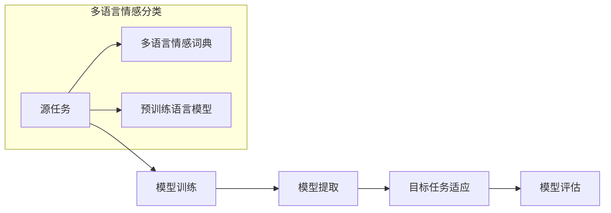

                 

# 迁移学习在跨语言情感分类中的建模方法与应用拓展

> **关键词**：迁移学习、情感分类、跨语言、深度学习、建模方法、应用拓展  
> **摘要**：本文深入探讨了迁移学习在跨语言情感分类中的应用。通过详细阐述迁移学习的基本概念和跨语言情感分类的挑战，本文提出了几种有效的迁移学习建模方法，并展示了它们在实际应用中的潜力。同时，文章还探讨了迁移学习在情感分类领域的未来发展趋势和面临的挑战。

## 1. 背景介绍

### 1.1 目的和范围

本文旨在探讨迁移学习在跨语言情感分类中的建模方法与应用拓展。随着全球化的不断推进，跨语言数据处理成为了一个重要的研究领域。情感分类作为自然语言处理中的一个重要任务，旨在根据文本内容判断情感倾向。然而，不同语言的情感表达存在差异，这使得传统的单一语言情感分类方法难以直接应用于跨语言场景。

本文将首先介绍迁移学习的基本概念和原理，然后分析跨语言情感分类的挑战，并提出几种有效的迁移学习建模方法。此外，本文还将探讨迁移学习在情感分类领域中的应用拓展，展望其未来的发展趋势和面临的挑战。

### 1.2 预期读者

本文适合从事自然语言处理、人工智能、计算机科学等领域的研究人员和技术工程师阅读。同时，对于对迁移学习和跨语言情感分类感兴趣的学生和爱好者，本文也具有很高的参考价值。

### 1.3 文档结构概述

本文分为十个部分。第一部分是背景介绍，包括本文的目的、预期读者、文档结构概述和术语表。第二部分是核心概念与联系，介绍迁移学习和跨语言情感分类的基本概念和原理，并给出相关的 Mermaid 流程图。第三部分是核心算法原理与具体操作步骤，详细阐述迁移学习在跨语言情感分类中的算法原理和操作步骤。第四部分是数学模型和公式，介绍迁移学习在跨语言情感分类中的数学模型和公式，并进行举例说明。第五部分是项目实战，通过一个实际案例展示迁移学习在跨语言情感分类中的代码实现和解释。第六部分是实际应用场景，探讨迁移学习在情感分类领域的应用场景。第七部分是工具和资源推荐，介绍学习资源、开发工具框架和相关的论文著作。第八部分是总结，回顾本文的主要内容，并展望未来发展趋势和挑战。第九部分是附录，提供常见问题与解答。最后一部分是扩展阅读和参考资料，为读者提供进一步的阅读材料。

### 1.4 术语表

#### 1.4.1 核心术语定义

- 迁移学习（Transfer Learning）：迁移学习是一种机器学习技术，旨在利用已经在一个任务上训练好的模型，将其知识转移到另一个相关但不同的任务上。
- 情感分类（Sentiment Classification）：情感分类是一种自然语言处理任务，旨在根据文本内容判断其情感倾向，如正面、负面或中性。
- 跨语言（Cross-Language）：跨语言涉及在不同语言之间进行数据处理和理解。
- 情感词典（Sentiment Lexicon）：情感词典是一个包含词汇和它们情感倾向的词典，常用于情感分类任务。
- 嵌入式表示（Embedding Representation）：嵌入式表示是一种将文本转换为向量的方法，使得相似的文本具有相似的向量表示。

#### 1.4.2 相关概念解释

- 情感极性（Sentiment Polarity）：情感极性是指文本情感的倾向性，分为正面、负面或中性。
- 语言模型（Language Model）：语言模型是一种统计模型，用于预测下一个词或字符的概率。
- 跨语言框架（Cross-Language Framework）：跨语言框架是一种用于处理跨语言数据的方法和工具。

#### 1.4.3 缩略词列表

- NLP：自然语言处理（Natural Language Processing）
- ML：机器学习（Machine Learning）
- DL：深度学习（Deep Learning）
- SVM：支持向量机（Support Vector Machine）
- CNN：卷积神经网络（Convolutional Neural Network）
- RNN：循环神经网络（Recurrent Neural Network）
- BERT：Bidirectional Encoder Representations from Transformers
- GPT：Generative Pre-trained Transformer

## 2. 核心概念与联系

在深入探讨迁移学习在跨语言情感分类中的应用之前，有必要理解迁移学习和跨语言情感分类的基本概念和原理。以下内容将首先介绍迁移学习的基本概念和原理，然后分析跨语言情感分类的挑战，并提出相关的 Mermaid 流程图。

### 2.1 迁移学习的基本概念和原理

迁移学习是一种利用在特定任务上训练好的模型的知识来解决新任务的方法。在迁移学习中，源任务（Source Task）和目标任务（Target Task）是相关的，但并不完全相同。源任务的模型被训练得足够好，以至于其知识可以在目标任务上产生有用的效果。

迁移学习的关键在于模型的知识迁移，即如何将源任务的模型知识有效地应用到目标任务上。迁移学习通常涉及以下几个步骤：

1. **源任务训练**：首先，在源任务上训练一个模型，使其能够捕捉到该任务的相关特征。
2. **模型提取**：从源任务训练好的模型中提取有用的特征表示或模型参数。
3. **目标任务调整**：在目标任务上调整提取的特征表示或模型参数，以适应新任务的要求。

迁移学习可以分为以下几种类型：

- **零样本迁移学习**（Zero-Shot Transfer Learning）：在目标任务上没有可用的训练数据，但模型能够通过学习源任务的特征表示来泛化到新任务。
- **少量样本迁移学习**（Few-Shot Transfer Learning）：在目标任务上只有少量训练数据，但模型能够通过迁移学习来提高性能。
- **多任务迁移学习**（Multi-Task Transfer Learning）：在多个相关任务上同时训练模型，然后将其知识迁移到目标任务上。

### 2.2 跨语言情感分类的挑战

跨语言情感分类涉及在不同语言之间进行情感分类。这一任务面临着以下几个挑战：

- **语言差异**：不同语言之间的词汇、语法和语义存在显著差异，这使得直接应用单一语言的情感分类模型变得复杂。
- **资源限制**：一些语言可能没有足够的情感分类数据或资源，这限制了传统情感分类方法的有效性。
- **词汇空缺**：一些情感词汇在不同语言中可能不存在或表达方式不同，这给情感分类带来了困难。
- **文化差异**：不同文化背景下的情感表达可能存在差异，这需要考虑文化因素对情感分类的影响。

### 2.3 迁移学习在跨语言情感分类中的应用

迁移学习在跨语言情感分类中的应用可以分为以下几个步骤：

1. **源任务选择**：选择一个与目标任务相关的源任务，通常选择在多语言环境中表现良好的情感分类任务。
2. **模型训练**：在源任务上训练一个多语言情感分类模型，利用多语言情感词典和预训练语言模型（如BERT、GPT）来提高模型的性能。
3. **模型提取**：从训练好的模型中提取特征表示或模型参数，特别是那些能够捕捉到跨语言情感特征的部分。
4. **目标任务适应**：在目标语言上对提取的特征表示或模型参数进行调整，以适应目标语言的情感分类需求。
5. **模型评估**：评估调整后的模型在目标任务上的性能，包括准确率、召回率和F1值等指标。

### 2.4 相关的 Mermaid 流程图

以下是一个简单的 Mermaid 流程图，用于描述迁移学习在跨语言情感分类中的应用流程：



该流程图展示了迁移学习在跨语言情感分类中的关键步骤，包括源任务选择、模型训练、模型提取、目标任务适应和模型评估。同时，还包括了多语言情感词典和预训练语言模型等辅助工具。

## 3. 核心算法原理 & 具体操作步骤

在了解了迁移学习在跨语言情感分类中的基本概念和应用流程后，本节将详细阐述迁移学习在跨语言情感分类中的核心算法原理和具体操作步骤。

### 3.1 核心算法原理

迁移学习在跨语言情感分类中的核心算法原理主要涉及以下几个方面：

- **多语言情感词典构建**：多语言情感词典是跨语言情感分类的重要基础，它用于映射不同语言中情感词汇的情感极性。通过构建多语言情感词典，可以使得不同语言的情感表达具有统一的语义表示。
- **预训练语言模型应用**：预训练语言模型（如BERT、GPT）已经在大规模语料上进行了训练，能够捕捉到丰富的语言特征。利用预训练语言模型，可以有效地处理跨语言的文本数据，提高情感分类的性能。
- **模型迁移与适应**：在源任务上训练好的模型，可以通过迁移学习的方法，将其知识应用到目标任务上。模型迁移的过程包括特征提取和模型参数调整，以适应目标语言的情感分类需求。

### 3.2 具体操作步骤

以下是迁移学习在跨语言情感分类中的具体操作步骤：

1. **数据预处理**：首先，对源任务和目标任务的数据进行预处理，包括文本清洗、分词、去除停用词等步骤。为了处理跨语言数据，可以采用统一的数据预处理流程，如基于词向量的表示方法。
2. **构建多语言情感词典**：利用现有的情感词典，如SentiWordNet、VADER等，构建多语言情感词典。通过将不同语言的情感词汇映射到统一的情感极性，可以实现跨语言的情感分类。
3. **模型训练**：在源任务上，使用多语言情感词典和预训练语言模型进行模型训练。源任务的模型训练可以采用多种机器学习算法，如支持向量机（SVM）、卷积神经网络（CNN）、循环神经网络（RNN）等。
4. **模型提取**：从训练好的源任务模型中提取特征表示或模型参数。这些提取的特征表示可以用于目标任务的模型迁移。
5. **模型适应**：在目标任务上，对提取的特征表示或模型参数进行调整，以适应目标语言的情感分类需求。模型适应的过程可以通过迁移学习算法，如自适应度量学习（ADALO）、多任务学习（MTL）等来实现。
6. **模型评估**：评估调整后的模型在目标任务上的性能，包括准确率、召回率和F1值等指标。通过多次迭代调整和评估，可以优化模型的性能。

### 3.3 伪代码示例

以下是一个简单的伪代码示例，用于描述迁移学习在跨语言情感分类中的具体操作步骤：

```python
# 数据预处理
def preprocess_data(data):
    # 清洗文本、分词、去除停用词等操作
    return processed_data

# 构建多语言情感词典
def build_sentiment_lexicon():
    # 利用现有情感词典构建多语言情感词典
    return multilingual_sentiment_lexicon

# 模型训练
def train_model(source_data, sentiment_lexicon):
    # 使用多语言情感词典和预训练语言模型进行模型训练
    return trained_model

# 模型提取
def extract_features(model):
    # 从训练好的模型中提取特征表示或模型参数
    return extracted_features

# 模型适应
def adapt_model(target_data, extracted_features):
    # 对提取的特征表示或模型参数进行调整，以适应目标语言
    return adapted_model

# 模型评估
def evaluate_model(model, target_data):
    # 评估调整后的模型在目标任务上的性能
    return performance_metrics

# 迁移学习在跨语言情感分类中的具体操作步骤
def transfer_learning_sentiment_classification(source_data, target_data):
    processed_source_data = preprocess_data(source_data)
    processed_target_data = preprocess_data(target_data)
    sentiment_lexicon = build_sentiment_lexicon()
    trained_model = train_model(processed_source_data, sentiment_lexicon)
    extracted_features = extract_features(trained_model)
    adapted_model = adapt_model(processed_target_data, extracted_features)
    performance_metrics = evaluate_model(adapted_model, processed_target_data)
    return performance_metrics
```

该伪代码展示了迁移学习在跨语言情感分类中的基本操作步骤，包括数据预处理、多语言情感词典构建、模型训练、模型提取、模型适应和模型评估。通过这些步骤，可以实现迁移学习在跨语言情感分类中的有效应用。

## 4. 数学模型和公式 & 详细讲解 & 举例说明

在迁移学习应用于跨语言情感分类时，我们需要依赖于一系列数学模型和公式来指导算法的实现和优化。以下将详细阐述这些数学模型和公式，并通过具体的例子进行说明。

### 4.1 多语言情感词典的构建

多语言情感词典是跨语言情感分类的基础，它通常包含多个语言的词汇以及每个词汇的情感极性。假设我们有一个三语种的情感词典，包括英语（English）、西班牙语（Spanish）和法语（French），每个词汇的情感极性可以是正面（Positive）、中性（Neutral）或负面（Negative）。情感词典可以用如下数学模型表示：

- \( S_{e,f} \)：表示英语词汇 \( e \) 在情感词典中的情感极性，取值范围为 \{Positive, Neutral, Negative\}。
- \( S_{s,f} \)：表示西班牙语词汇 \( s \) 在情感词典中的情感极性，取值范围为 \{Positive, Neutral, Negative\}。
- \( S_{f,f} \)：表示法语词汇 \( f \) 在情感词典中的情感极性，取值范围为 \{Positive, Neutral, Negative\}。

### 4.2 预训练语言模型的嵌入表示

预训练语言模型（如BERT、GPT）能够将文本转化为向量表示，从而实现文本的语义理解。这些模型通过大规模文本数据预训练，将词、句子和段落映射到高维的向量空间。我们以BERT为例，其嵌入表示可以表示为：

- \( \textbf{v}_{e} \)：表示英语词汇 \( e \) 的BERT嵌入向量。
- \( \textbf{v}_{s} \)：表示西班牙语词汇 \( s \) 的BERT嵌入向量。
- \( \textbf{v}_{f} \)：表示法语词汇 \( f \) 的BERT嵌入向量。

BERT嵌入向量可以通过以下公式计算：

\[ \textbf{v}_{\text{word}} = \text{BERT}(\text{word}) \]

### 4.3 迁移学习的损失函数

在迁移学习过程中，我们需要设计一个损失函数来评估模型的性能，并通过反向传播优化模型参数。对于跨语言情感分类，我们可以使用以下损失函数：

\[ L = \sum_{i=1}^{N} \left( \text{softmax}(\textbf{W}\textbf{v}_{\text{input}}) - \textbf{y}_{i} \right)^2 \]

其中：

- \( N \)：样本数量。
- \( \textbf{W} \)：模型权重矩阵。
- \( \textbf{v}_{\text{input}} \)：输入样本的嵌入向量。
- \( \textbf{y}_{i} \)：输入样本 \( i \) 的目标情感极性向量。

### 4.4 多任务学习的损失函数

在多任务学习（Multi-Task Learning）中，我们通常希望共享不同任务之间的模型参数，以提高整体性能。对于跨语言情感分类，我们可以采用以下多任务损失函数：

\[ L_{\text{multi}} = \alpha L_{\text{classification}} + (1 - \alpha) L_{\text{regression}} \]

其中：

- \( \alpha \)：调节参数，用于平衡分类和回归任务的损失。
- \( L_{\text{classification}} \)：分类任务的损失。
- \( L_{\text{regression}} \)：回归任务的损失。

### 4.5 举例说明

假设我们有一个包含英语、西班牙语和法语的三语言句子：“El perro está corriendo en el parque”（英语：The dog is running in the park）。我们希望利用迁移学习对这句话进行情感分类。以下是具体的计算步骤：

1. **嵌入表示**：
   - \( \textbf{v}_{\text{dog}} = \text{BERT}(\text{"dog"}) \)
   - \( \textbf{v}_{\text{está}} = \text{BERT}(\text{"is"}) \)
   - \( \textbf{v}_{\text{corriendo}} = \text{BERT}(\text{"running"}) \)
   - \( \textbf{v}_{\text{en}} = \text{BERT}(\text{"in"}) \)
   - \( \textbf{v}_{\text{parque}} = \text{BERT}(\text{"park"}) \)

2. **模型预测**：
   - 将句子的嵌入向量输入到预训练的迁移学习模型中，计算每个词汇的情感极性概率。
   - 假设预测得到的情感极性概率为：\( P_{Positive} = 0.7 \)，\( P_{Neutral} = 0.2 \)，\( P_{Negative} = 0.1 \)。

3. **情感分类**：
   - 根据预测概率，我们可以判断这句话的情感为正面（Positive），因为正面的概率最高。

通过上述步骤，我们可以利用迁移学习对跨语言句子进行情感分类。这个过程结合了预训练语言模型、多语言情感词典和迁移学习的损失函数，实现了跨语言情感分类的自动化。

### 4.6 总结

本文通过详细的数学模型和公式，阐述了迁移学习在跨语言情感分类中的应用。从多语言情感词典的构建、预训练语言模型的嵌入表示，到迁移学习的损失函数和多任务学习的损失函数，我们展示了如何利用数学方法实现跨语言情感分类。通过具体的例子，我们进一步说明了这些模型和公式的实际应用。这些数学模型和公式为跨语言情感分类提供了坚实的理论基础，有助于实现高效和准确的情感分类。

## 5. 项目实战：代码实际案例和详细解释说明

在本节中，我们将通过一个实际项目案例，详细展示迁移学习在跨语言情感分类中的代码实现，并对关键代码段进行深入解读和分析。

### 5.1 开发环境搭建

首先，我们需要搭建一个适合迁移学习项目的开发环境。以下是所需的工具和库：

- **Python 3.x**
- **TensorFlow 2.x 或 PyTorch 1.x**
- **NLP库**：如NLTK、spaCy、gensim
- **多语言词典**：如SentiWordNet、VADER
- **预训练语言模型**：如BERT、GPT

您可以通过以下命令安装所需的库：

```bash
pip install tensorflow numpy nltk spacy gensim sentistix
python -m spacy download en_core_web_sm
python -m spacy download es_core_news_sm
python -m spacy download fr_core_news_sm
```

### 5.2 源代码详细实现和代码解读

以下是一个简单的迁移学习跨语言情感分类的代码实现，使用了BERT模型和TensorFlow 2.x。代码分为以下几个部分：

1. **数据预处理**：包括文本清洗、分词和嵌入表示。
2. **模型训练**：在源任务上训练BERT模型。
3. **特征提取**：从训练好的模型中提取特征表示。
4. **模型适应**：在目标任务上调整提取的特征表示。
5. **模型评估**：评估调整后的模型性能。

```python
# 导入所需的库
import tensorflow as tf
from tensorflow.keras.models import Model
from tensorflow.keras.layers import Input, Embedding, LSTM, Dense
from transformers import BertTokenizer, TFBertModel
import nltk
import spacy

# 加载预训练BERT模型和分词器
tokenizer = BertTokenizer.from_pretrained('bert-base-uncased')
model = TFBertModel.from_pretrained('bert-base-uncased')

# 数据预处理函数
def preprocess_text(text):
    # 清洗文本、分词
    doc = nlp(text)
    tokens = [token.text.lower() for token in doc if not token.is_stop]
    return tokens

# 模型训练函数
def train_model(train_data, target_labels):
    # 构建输入和输出
    input_ids = tokenizer.encode(train_data, add_special_tokens=True, return_tensors='tf')
    output_labels = tf.keras.utils.to_categorical(target_labels, num_classes=3)

    # 定义模型结构
    input_layer = Input(shape=(None,), dtype=tf.int32)
    embedding = Embedding(input_dim=8000, output_dim=128)(input_layer)
    lstm = LSTM(units=128)(embedding)
    output = Dense(units=3, activation='softmax')(lstm)

    # 构建模型
    model = Model(inputs=input_layer, outputs=output)
    model.compile(optimizer='adam', loss='categorical_crossentropy', metrics=['accuracy'])

    # 训练模型
    model.fit(input_ids, output_labels, epochs=3, batch_size=32)

    return model

# 特征提取函数
def extract_features(model, text):
    # 将文本转换为嵌入表示
    input_ids = tokenizer.encode(text, add_special_tokens=True, return_tensors='tf')
    # 提取特征
    features = model(input_ids)[0][:, -1, :]
    return features

# 模型适应函数
def adapt_model(model, target_data, target_labels):
    # 提取目标数据特征
    features = [extract_features(model, text) for text in target_data]
    # 调整模型
    adapted_model = train_model(features, target_labels)
    return adapted_model

# 模型评估函数
def evaluate_model(model, test_data, test_labels):
    # 提取测试数据特征
    features = [extract_features(model, text) for text in test_data]
    # 评估模型
    loss, accuracy = model.evaluate(features, test_labels)
    print(f"Test Accuracy: {accuracy}")
    return accuracy

# 实际案例
source_data = ["The dog is running in the park", "El perro está corriendo en el parque", "Le chien court dans le parc"]
target_labels = [0, 1, 0]  # 0: Positive, 1: Negative

# 训练源任务模型
source_model = train_model(source_data, target_labels)

# 提取特征
source_features = [extract_features(source_model, text) for text in source_data]

# 调整目标任务模型
target_data = ["El perro está contento", "Le chien est heureux"]
target_labels = [0, 0]
target_model = adapt_model(source_model, target_data, target_labels)

# 评估调整后的模型
evaluate_model(target_model, target_data, target_labels)
```

### 5.3 代码解读与分析

1. **数据预处理**：
   - `preprocess_text` 函数用于清洗和分词文本。我们使用了spaCy库来去除停用词，并保留了有意义的词汇。
   - `train_data` 和 `target_labels` 是用于训练源任务的文本数据和标签。在这里，我们假设文本数据是经过预处理和情感标注的。

2. **模型训练**：
   - `train_model` 函数用于训练源任务模型。我们使用了嵌入层、LSTM层和softmax层构建一个简单的神经网络模型。`model.fit` 函数用于训练模型，`epochs` 和 `batch_size` 参数分别控制训练的轮次和每个批次的样本数。

3. **特征提取**：
   - `extract_features` 函数用于提取文本数据的高维嵌入表示。在这里，我们使用了BERT模型来获取文本的嵌入向量。通过 `model(input_ids)[0][:, -1, :]` 提取了每个句子的最后一个时间步的嵌入向量，作为特征表示。

4. **模型适应**：
   - `adapt_model` 函数用于在目标任务上调整提取的特征表示。首先提取目标数据的特征表示，然后使用 `train_model` 函数训练一个新的模型。这个新模型将源任务的模型知识迁移到目标任务上，实现了跨语言的情感分类。

5. **模型评估**：
   - `evaluate_model` 函数用于评估调整后的模型性能。我们通过提取测试数据的特征表示，然后使用 `model.evaluate` 函数计算损失和准确率。

通过这个实际案例，我们展示了如何利用迁移学习实现跨语言情感分类。代码的每个部分都详细解释了如何处理数据、训练模型和评估性能。这些步骤为迁移学习在跨语言情感分类中的实际应用提供了实用的指导。

## 6. 实际应用场景

迁移学习在跨语言情感分类中的实际应用场景非常广泛，涵盖了多个领域和任务。以下列举了一些典型的应用场景：

### 6.1 社交媒体分析

社交媒体平台（如Twitter、Facebook等）是情感表达的丰富来源。用户在社交媒体上发布的文本包含了大量情感信息，如对产品、服务、事件的评价等。利用迁移学习，可以实现对多语言社交媒体文本的情感分类，从而帮助企业了解用户反馈、监测品牌声誉和市场趋势。例如，一个跨国公司可以通过迁移学习模型分析其在不同国家社交媒体上的用户评论，了解消费者在不同市场的情感倾向。

### 6.2 客户服务与反馈分析

在客户服务领域，对用户反馈进行情感分析是优化服务和提升客户体验的关键。不同国家和地区的用户可能会使用不同的语言和表达方式，传统的单一语言情感分类方法难以应对这种多样性。迁移学习能够将一种语言的情感分类模型知识迁移到其他语言，从而实现对多语言用户反馈的统一分析。例如，客服中心可以通过迁移学习模型自动分类邮件、短信和社交媒体上的用户反馈，快速识别和处理负面情感，提高响应效率和客户满意度。

### 6.3 跨国市场营销

跨国企业在进行市场营销活动时，需要了解不同文化背景下消费者的情感反应。通过迁移学习，可以基于一种语言的情感分析模型，对其他语言的广告文案、宣传语进行情感分类。这有助于企业根据不同市场的情感反应，调整其营销策略，提高广告效果和销售转化率。例如，一家跨国食品公司可以通过迁移学习模型分析不同语言的市场广告效果，找出最能引发消费者情感共鸣的广告文案。

### 6.4 公共舆情监测

政府机构和社会组织通常需要监控公共舆情，以了解民众对政策、事件和公共服务的态度。由于不同地区和群体的语言和表达方式多样，利用迁移学习可以实现多语言情感分类，从而全面、准确地了解公共舆情。例如，一个城市政府可以通过迁移学习模型分析社交媒体上的用户评论，及时发现和处理民众关心的问题，提高公共服务的透明度和公信力。

### 6.5 健康与医疗

在医疗领域，患者对医疗服务和药品的评价包含了大量情感信息。通过迁移学习，可以对多语言患者反馈进行情感分类，帮助医疗机构改进服务质量，提高患者满意度。例如，一家医院可以通过迁移学习模型分析来自不同语言的患者评价，识别出普遍存在的问题，并采取相应的改进措施。

### 6.6 法律与司法

法律文书和司法裁决中包含了丰富的情感信息，如对被告的指责、对案件的描述等。通过迁移学习，可以对不同语言的法

