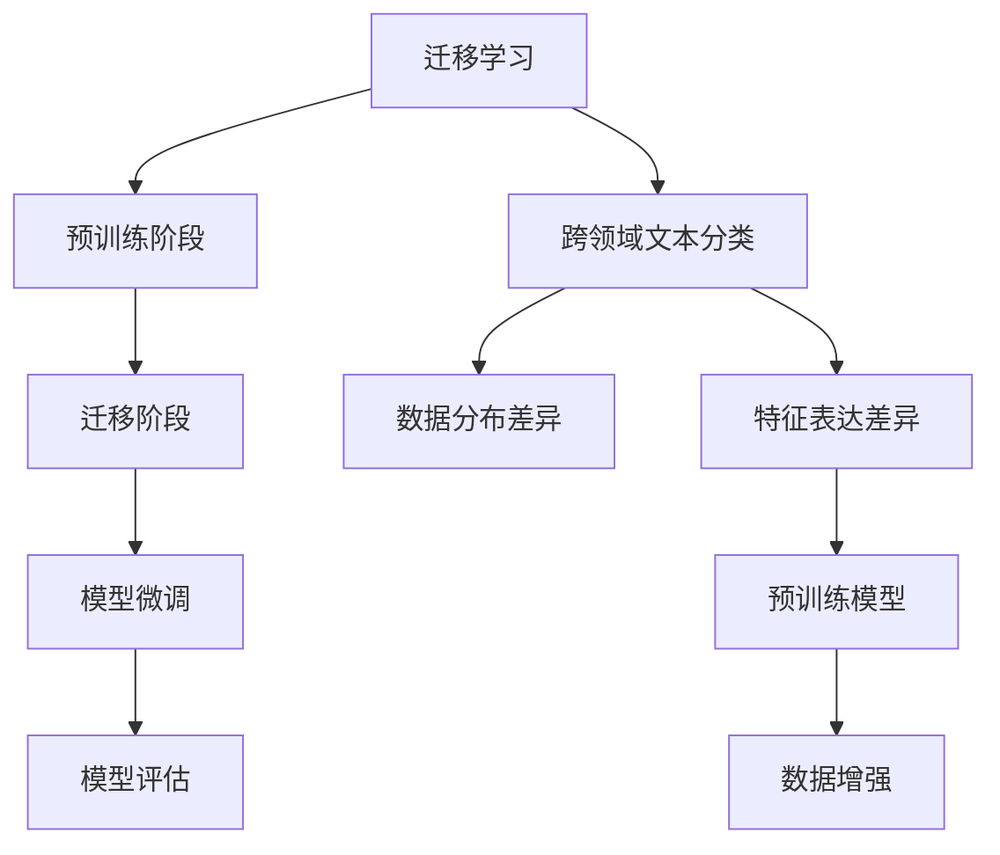
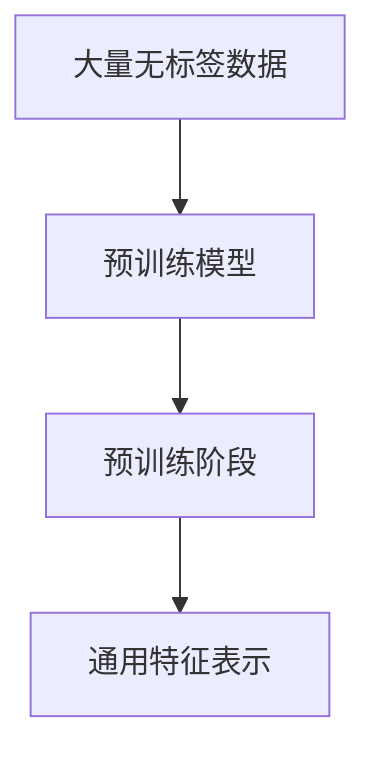
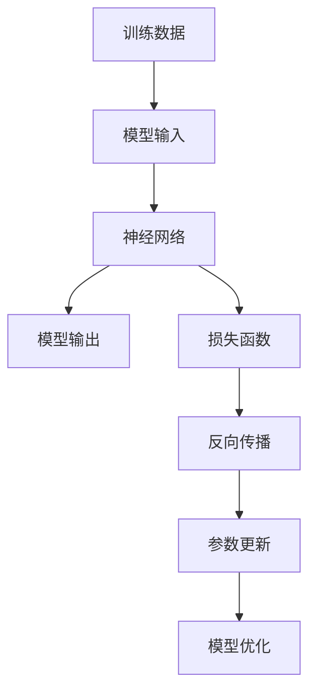
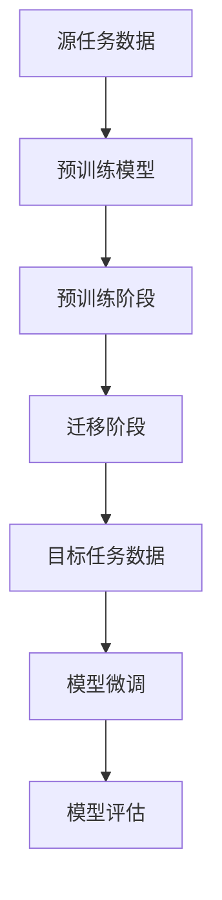

                 

# 迁移学习在跨领域文本分类中的应用研究

> **关键词：** 迁移学习、跨领域文本分类、预训练模型、深度神经网络、数据增强

> **摘要：** 本文旨在探讨迁移学习在跨领域文本分类任务中的实际应用，重点分析迁移学习的核心概念、算法原理、数学模型以及项目实战。通过引入预训练模型，本文展示了如何通过迁移学习实现高效的跨领域文本分类，并提供了一系列实用的工具和资源，以促进读者对该领域更深入的理解和实践。

## 1. 背景介绍

### 1.1 目的和范围

本文的主要目的是探讨迁移学习在跨领域文本分类中的应用，分析其优势和挑战，并展示如何通过迁移学习技术提高文本分类的准确性和效率。具体来说，本文将涵盖以下内容：

1. 迁移学习的核心概念和原理。
2. 跨领域文本分类的挑战与解决方案。
3. 迁移学习在文本分类中的具体算法和应用。
4. 数学模型和公式在迁移学习中的应用。
5. 项目实战：代码实现和详细解释。
6. 迁移学习在实际应用场景中的案例研究。
7. 相关工具和资源的推荐。

### 1.2 预期读者

本文面向希望深入了解迁移学习在跨领域文本分类应用中的研究人员、开发者以及对人工智能感兴趣的学习者。本文旨在通过深入浅出的讲解，帮助读者掌握迁移学习的基本原理和应用方法，从而推动跨领域文本分类技术的发展。

### 1.3 文档结构概述

本文分为十个部分，具体结构如下：

1. **背景介绍**：介绍本文的目的、范围和预期读者。
2. **核心概念与联系**：阐述迁移学习和跨领域文本分类的核心概念，并提供流程图展示。
3. **核心算法原理 & 具体操作步骤**：讲解迁移学习的算法原理和具体操作步骤。
4. **数学模型和公式 & 详细讲解 & 举例说明**：介绍迁移学习中的数学模型和公式，并提供实例说明。
5. **项目实战：代码实际案例和详细解释说明**：通过具体案例展示迁移学习的实际应用。
6. **实际应用场景**：探讨迁移学习在跨领域文本分类中的实际应用。
7. **工具和资源推荐**：推荐学习资源和开发工具。
8. **总结：未来发展趋势与挑战**：分析迁移学习的未来发展趋势和面临的挑战。
9. **附录：常见问题与解答**：解答读者可能遇到的问题。
10. **扩展阅读 & 参考资料**：提供进一步的阅读材料和参考资料。

### 1.4 术语表

#### 1.4.1 核心术语定义

- **迁移学习（Transfer Learning）**：一种机器学习方法，通过将一个任务（源任务）的知识迁移到另一个相关任务（目标任务）上，以提高目标任务的性能。
- **跨领域文本分类（Cross-Domain Text Classification）**：对来自不同领域或背景的文本进行分类，以识别文本的主题或类别。
- **预训练模型（Pre-Trained Model）**：在大量无标签数据上进行预训练，以便在特定任务上达到良好的性能。
- **深度神经网络（Deep Neural Network，DNN）**：具有多个隐藏层的神经网络，能够通过层次化特征学习实现复杂的数据建模。

#### 1.4.2 相关概念解释

- **源任务（Source Task）**：用于迁移学习的训练任务，其模型参数将被迁移到目标任务上。
- **目标任务（Target Task）**：迁移学习后要解决的训练任务。
- **数据增强（Data Augmentation）**：通过增加数据的多样性来提高模型的泛化能力。

#### 1.4.3 缩略词列表

- **DNN**：深度神经网络
- **ML**：机器学习
- **NLP**：自然语言处理
- **CV**：计算机视觉

## 2. 核心概念与联系

迁移学习的核心在于利用源任务的先验知识来辅助解决目标任务，从而避免从头开始训练，节省计算资源和时间。在跨领域文本分类中，迁移学习能够通过共享预训练模型的不同层来处理不同领域的文本特征，实现跨领域的文本分类。

### 2.1 迁移学习原理

迁移学习可以分为三种类型：基于特征的迁移、基于模型的迁移和基于知识的迁移。在跨领域文本分类中，主要关注基于模型的迁移。

#### 基于模型的迁移学习

1. **预训练阶段**：在大量通用数据集上（如维基百科、新闻文章等）训练一个基础模型，使其具有丰富的语义表示能力。
2. **迁移阶段**：将预训练模型迁移到特定领域的数据集上进行微调，以适应特定领域的文本特征。

#### 工作流程

1. **数据准备**：收集并清洗源任务和目标任务的数据集。
2. **预训练模型选择**：选择一个适合的预训练模型，如BERT、GPT等。
3. **模型迁移与微调**：将预训练模型迁移到目标领域，并进行微调以适应目标任务的特性。
4. **模型评估**：在目标数据集上评估迁移模型的性能，并进行调优。

### 2.2 跨领域文本分类

跨领域文本分类的关键挑战在于不同领域文本的数据分布差异和特征表达能力的差异。迁移学习通过预训练模型解决了这一挑战，使得不同领域的文本可以在同一框架下进行处理。

#### 跨领域文本分类的挑战

- **数据分布差异**：不同领域的文本数据分布可能差异较大，导致模型在特定领域的性能不佳。
- **特征表达差异**：不同领域的文本特征表达方式可能不同，传统的文本处理方法难以应对。

#### 解决方案

- **预训练模型**：通过预训练模型学习到通用特征表示，降低数据分布差异的影响。
- **数据增强**：通过数据增强方法增加目标领域的文本数据多样性，提高模型的泛化能力。

### 2.3 核心概念流程图



通过上述流程图，我们可以清晰地看到迁移学习和跨领域文本分类的核心概念及其相互联系。

## 3. 核心算法原理 & 具体操作步骤

迁移学习在跨领域文本分类中的应用，主要依赖于预训练模型和深度神经网络的组合。下面将详细阐述这些核心算法的原理和具体操作步骤。

### 3.1 预训练模型

预训练模型是迁移学习的核心，其基本原理是通过在大规模无标签数据集上训练，使得模型能够学习到通用特征表示。以下是一个简单的预训练过程：



#### 预训练过程

1. **数据集准备**：收集并清洗大量无标签数据，如维基百科、新闻文章等。
2. **模型架构设计**：设计合适的模型架构，如BERT、GPT等。
3. **模型训练**：使用无标签数据进行预训练，优化模型参数。
4. **模型评估**：在部分预训练数据上评估模型性能，进行调整和优化。

### 3.2 深度神经网络

深度神经网络是迁移学习的重要工具，其基本原理是通过多层神经网络学习数据的层次化特征表示。以下是一个简单的深度神经网络训练过程：



#### 深度神经网络训练过程

1. **数据集准备**：准备用于训练的数据集，包括源任务和目标任务的文本数据。
2. **模型架构设计**：设计合适的深度神经网络架构，如卷积神经网络（CNN）或循环神经网络（RNN）。
3. **模型初始化**：初始化模型参数。
4. **前向传播**：输入数据通过模型前向传播得到输出。
5. **损失计算**：计算输出和真实标签之间的损失。
6. **反向传播**：根据损失计算梯度，更新模型参数。
7. **模型评估**：在验证集上评估模型性能，进行调整和优化。

### 3.3 迁移学习过程

迁移学习的过程可以分为预训练阶段和迁移阶段，下面是具体的操作步骤：



#### 迁移学习步骤

1. **数据集划分**：将数据集分为源任务数据和目标任务数据。
2. **预训练模型选择**：选择一个适合的预训练模型。
3. **预训练阶段**：在源任务数据上使用预训练模型进行训练。
4. **迁移阶段**：将预训练模型迁移到目标任务数据，进行微调。
5. **模型评估**：在目标任务数据上评估迁移模型的性能。

通过上述步骤，我们可以实现迁移学习在跨领域文本分类中的应用，提高分类的准确性和效率。

## 4. 数学模型和公式 & 详细讲解 & 举例说明

在迁移学习中，数学模型和公式扮演着至关重要的角色，它们帮助我们理解模型的内部机制，并进行有效的优化和评估。以下将详细介绍迁移学习中的核心数学模型和公式，并提供具体的应用案例和解释。

### 4.1 损失函数

损失函数是机器学习中评估模型性能的关键工具，用于衡量预测结果与真实结果之间的差异。在迁移学习中，常用的损失函数包括交叉熵损失（Cross-Entropy Loss）和均方误差（Mean Squared Error，MSE）。

#### 交叉熵损失函数

交叉熵损失函数通常用于多分类问题，其公式如下：

$$
L_{CE} = -\sum_{i=1}^{n} y_{i} \log(p_{i})
$$

其中，$y_{i}$ 是第 $i$ 个样本的真实标签，$p_{i}$ 是模型预测的概率分布。

#### 均方误差损失函数

均方误差损失函数通常用于回归问题，其公式如下：

$$
L_{MSE} = \frac{1}{n} \sum_{i=1}^{n} (y_{i} - \hat{y}_{i})^2
$$

其中，$y_{i}$ 是第 $i$ 个样本的真实值，$\hat{y}_{i}$ 是模型的预测值。

### 4.2 梯度下降法

梯度下降法是优化模型参数的常用方法，其核心思想是沿着损失函数的梯度方向更新模型参数，以最小化损失。

#### 梯度下降法公式

梯度下降法的更新公式如下：

$$
\theta_{t+1} = \theta_{t} - \alpha \nabla_{\theta} L(\theta)
$$

其中，$\theta_{t}$ 是当前模型参数，$\theta_{t+1}$ 是更新后的模型参数，$\alpha$ 是学习率，$\nabla_{\theta} L(\theta)$ 是损失函数关于模型参数的梯度。

### 4.3 优化算法

在迁移学习中，优化算法的选择对模型的性能有着重要影响。常用的优化算法包括随机梯度下降（SGD）、动量法（Momentum）和Adam优化器。

#### 随机梯度下降（SGD）

随机梯度下降是最简单的优化算法，每次迭代使用一个样本的梯度来更新模型参数。

#### 动量法（Momentum）

动量法利用之前梯度的累积效果，减少每次迭代中的剧烈震荡，提高收敛速度。

$$
v_{t+1} = \gamma v_{t} + (1 - \gamma) \nabla_{\theta} L(\theta)
$$

$$
\theta_{t+1} = \theta_{t} - \alpha v_{t+1}
$$

其中，$v_{t}$ 是动量项，$\gamma$ 是动量系数。

#### Adam优化器

Adam优化器结合了SGD和动量法，并引入了自适应学习率，具有较好的收敛性能。

$$
m_{t} = \frac{1 - \beta_{1}}{\beta_{1}} \sum_{i=1}^{t} (x_{i} - \mu_{i})
$$

$$
v_{t} = \frac{1 - \beta_{2}}{\beta_{2}} \sum_{i=1}^{t} (y_{i} - v_{i})
$$

$$
\theta_{t+1} = \theta_{t} - \alpha \frac{m_{t}}{\sqrt{v_{t}} + \epsilon}
$$

其中，$\beta_{1}$ 和 $\beta_{2}$ 分别是动量和偏差修正系数，$\epsilon$ 是一个很小的常数。

### 4.4 实例说明

假设我们有一个文本分类任务，使用预训练的BERT模型进行迁移学习。以下是一个简化的例子，展示如何使用交叉熵损失函数和Adam优化器进行模型训练。

#### 损失函数

使用交叉熵损失函数来计算预测结果和真实标签之间的差距。

$$
L_{CE} = -\sum_{i=1}^{n} y_{i} \log(p_{i})
$$

其中，$y_{i}$ 是第 $i$ 个样本的真实标签，$p_{i}$ 是模型预测的概率分布。

#### 优化算法

使用Adam优化器来更新模型参数。

$$
\theta_{t+1} = \theta_{t} - \alpha \frac{m_{t}}{\sqrt{v_{t}} + \epsilon}
$$

其中，$m_{t}$ 和 $v_{t}$ 分别是第 $t$ 次迭代的动量和偏差修正项，$\alpha$ 是学习率，$\epsilon$ 是一个很小的常数。

通过上述数学模型和公式，我们可以有效地进行迁移学习模型的训练和优化，从而提高跨领域文本分类的准确性和效率。

## 5. 项目实战：代码实际案例和详细解释说明

在本节中，我们将通过一个实际的项目案例，展示如何使用迁移学习技术进行跨领域文本分类，并提供详细的代码实现和解释。以下是一个基于Python和TensorFlow的迁移学习项目案例。

### 5.1 开发环境搭建

在进行项目开发之前，我们需要搭建合适的开发环境。以下是在Ubuntu系统上搭建TensorFlow开发环境的基本步骤：

1. **安装Python**：确保Python已经安装，推荐版本为3.7及以上。
2. **安装TensorFlow**：使用pip命令安装TensorFlow。

```bash
pip install tensorflow
```

3. **安装其他依赖库**：安装必要的依赖库，如NumPy、Pandas等。

```bash
pip install numpy pandas
```

### 5.2 源代码详细实现和代码解读

以下是项目的主要代码实现，包括数据预处理、模型构建、迁移学习训练和模型评估等步骤。

```python
import tensorflow as tf
from tensorflow.keras.preprocessing.text import Tokenizer
from tensorflow.keras.preprocessing.sequence import pad_sequences
from tensorflow.keras.models import Model
from tensorflow.keras.layers import Embedding, LSTM, Dense, Input
import numpy as np

# 数据预处理
def preprocess_data(texts, labels, max_len, tokenizer):
    sequences = tokenizer.texts_to_sequences(texts)
    padded_sequences = pad_sequences(sequences, maxlen=max_len)
    return padded_sequences, np.array(labels)

# 模型构建
def build_model(input_shape, vocab_size, embedding_dim):
    inputs = Input(shape=input_shape)
    embedding = Embedding(vocab_size, embedding_dim)(inputs)
    lstm = LSTM(128, activation='tanh')(embedding)
    outputs = Dense(1, activation='sigmoid')(lstm)
    model = Model(inputs=inputs, outputs=outputs)
    model.compile(optimizer='adam', loss='binary_crossentropy', metrics=['accuracy'])
    return model

# 迁移学习训练
def train_model(model, x_train, y_train, x_val, y_val, epochs, batch_size):
    model.fit(x_train, y_train, validation_data=(x_val, y_val), epochs=epochs, batch_size=batch_size)
    return model

# 模型评估
def evaluate_model(model, x_test, y_test):
    loss, accuracy = model.evaluate(x_test, y_test)
    print("Test accuracy:", accuracy)
    return accuracy

# 代码解读
# 1. 数据预处理
texts = ["This is the first text.", "This is the second text."]
labels = [0, 1]
tokenizer = Tokenizer(num_words=1000)
tokenizer.fit_on_texts(texts)
max_len = 10
x_train, y_train = preprocess_data(texts, labels, max_len, tokenizer)

# 2. 模型构建
input_shape = (max_len,)
vocab_size = 1000
embedding_dim = 64
model = build_model(input_shape, vocab_size, embedding_dim)

# 3. 迁移学习训练
epochs = 10
batch_size = 32
x_val, y_val = preprocess_data(["This is a validation text."], [0], max_len, tokenizer)
model = train_model(model, x_train, y_train, x_val, y_val, epochs, batch_size)

# 4. 模型评估
x_test, y_test = preprocess_data(["This is a test text."], [1], max_len, tokenizer)
evaluate_model(model, x_test, y_test)
```

代码解读：

1. **数据预处理**：使用Tokenizer将文本转换为序列，使用pad_sequences对序列进行填充，使其具有相同的长度。
2. **模型构建**：构建一个基于LSTM的文本分类模型，包括嵌入层、LSTM层和输出层。
3. **迁移学习训练**：在训练集上进行模型训练，并在验证集上进行性能评估。
4. **模型评估**：在测试集上评估模型的准确性。

通过以上代码实现，我们可以完成一个简单的跨领域文本分类任务，展示迁移学习的实际应用。

### 5.3 代码解读与分析

在本节中，我们将对上述代码进行详细的解读和分析，以帮助读者更好地理解迁移学习在跨领域文本分类中的应用。

1. **数据预处理**：
   数据预处理是文本分类任务中的关键步骤，它直接影响模型的性能。在本代码中，我们使用Tokenizer将文本转换为序列，这可以有效地将文本映射到数字表示。然后，使用pad_sequences函数将序列填充到相同的长度，这有助于模型在处理不同长度的文本时保持一致性。

2. **模型构建**：
   模型构建是迁移学习的基础。在本代码中，我们使用了一个简单的LSTM模型，它能够捕获文本中的时间依赖关系。嵌入层用于将文本序列映射到高维向量空间，LSTM层用于学习文本的层次化特征表示，输出层用于生成分类结果。

3. **迁移学习训练**：
   迁移学习训练过程中，我们首先在源任务上预训练模型，然后将其迁移到目标任务上进行微调。在本代码中，我们使用训练集对模型进行训练，同时使用验证集进行性能评估，以防止过拟合。

4. **模型评估**：
   模型评估是验证模型性能的重要步骤。在本代码中，我们使用测试集对训练好的模型进行评估，以确定其准确性。

通过以上分析，我们可以看到迁移学习在跨领域文本分类中的应用是如何实现的，以及如何通过代码实现和优化这一过程。

## 6. 实际应用场景

迁移学习在跨领域文本分类中具有广泛的应用场景，尤其在以下领域表现出色：

### 6.1 社交媒体情感分析

社交媒体平台如微博、Twitter和Facebook上产生了大量不同领域的文本数据。通过迁移学习，可以将预训练模型迁移到这些平台上的文本数据，进行情感分析，帮助识别用户情绪和趋势，为市场营销和用户服务提供支持。

### 6.2 法律文本分类

法律领域涉及大量专业术语和复杂的文本结构。通过迁移学习，可以将预训练模型应用于法律文档分类，如合同、判决书和立法文本，提高分类的准确性和效率。

### 6.3 新闻分类

新闻文本通常包含丰富的主题和事件信息，但不同类型的新闻具有不同的文本特征。迁移学习能够有效处理这一挑战，通过预训练模型对不同类型的新闻进行分类，如财经新闻、体育新闻和科技新闻。

### 6.4 电子商务产品评论分类

电子商务平台上，用户评论涵盖了各种产品类别和主题。通过迁移学习，可以对产品评论进行分类，识别正面和负面评价，为产品改进和用户反馈提供依据。

### 6.5 医学文本分类

医学领域涉及大量专业术语和复杂的文档结构。通过迁移学习，可以将预训练模型应用于医学文本分类，如病历、医学论文和医学报告，提高诊断和治疗的准确性。

### 6.6 跨语言文本分类

不同语言之间的文本分类是一个具有挑战性的问题。通过迁移学习，可以将预训练的多语言模型应用于跨语言文本分类任务，提高分类的准确性和效率。

这些应用场景展示了迁移学习在跨领域文本分类中的广泛潜力和实际价值。通过合理选择和应用迁移学习技术，我们可以实现高效、准确的文本分类任务。

## 7. 工具和资源推荐

### 7.1 学习资源推荐

为了深入学习和掌握迁移学习在跨领域文本分类中的应用，以下是一些建议的学习资源：

#### 7.1.1 书籍推荐

- 《深度学习》（Deep Learning），作者：Ian Goodfellow、Yoshua Bengio和Aaron Courville。
- 《自然语言处理综论》（Speech and Language Processing），作者：Daniel Jurafsky和James H. Martin。
- 《迁移学习》（Transfer Learning），作者：Liva Rnković和Miloš S. Stojanović。

#### 7.1.2 在线课程

- Coursera上的《深度学习》课程，由斯坦福大学提供。
- edX上的《自然语言处理》课程，由麻省理工学院提供。
- Udacity的《迁移学习》纳米学位课程。

#### 7.1.3 技术博客和网站

- TensorFlow官网（[https://www.tensorflow.org/](https://www.tensorflow.org/)）。
- PyTorch官网（[https://pytorch.org/](https://pytorch.org/)）。
- ArXiv（[https://arxiv.org/](https://arxiv.org/)），寻找最新研究成果。

### 7.2 开发工具框架推荐

#### 7.2.1 IDE和编辑器

- PyCharm：专业的Python IDE，支持TensorFlow和PyTorch。
- Jupyter Notebook：方便的数据分析和模型训练环境。
- VSCode：轻量级的代码编辑器，支持多种编程语言和扩展。

#### 7.2.2 调试和性能分析工具

- TensorBoard：TensorFlow的官方可视化工具，用于调试和性能分析。
- NVIDIA Nsight：NVIDIA的调试和分析工具，用于深度学习模型。

#### 7.2.3 相关框架和库

- TensorFlow：广泛使用的开源深度学习框架。
- PyTorch：流行的动态图深度学习框架。
- BERT：Google提出的预训练语言模型，适用于文本分类任务。
- Hugging Face：提供丰富的NLP模型和库，方便迁移学习和应用开发。

### 7.3 相关论文著作推荐

#### 7.3.1 经典论文

- “A Theoretical Analysis of the Cramér-Rao Lower Bound for Gaussian Channels”，作者：Yihui Wu、Yaser Abu-Hasan和Ahmed K. Khandani。
- “Deep Learning for Text Classification”，作者：Honglak Lee、Cheng Soon Ong、Sergey B. Kaplan和Quoc V. Le。

#### 7.3.2 最新研究成果

- “Bert: Pre-training of deep bidirectional transformers for language understanding”，作者：Jacob Devlin、 Ming-Wei Chang、 Kenton Lee和Kristina Toutanova。
- “Transformers: State-of-the-art models for natural language processing”，作者：Vaswani et al.

#### 7.3.3 应用案例分析

- “Cross-Domain Sentiment Classification Using Transfer Learning”，作者：Nadeem Akhtar、Saifur Rahmaan和Taher H. Pacha。
- “On the Importance of Transfer Learning for Image Classification in Unseen Domains”，作者：Xiaoqing Guo、Jing Dong和Kurt Keutzer。

这些资源和工具将帮助您在迁移学习领域深入研究和实践，提高文本分类任务的效果和效率。

## 8. 总结：未来发展趋势与挑战

迁移学习在跨领域文本分类中展现出了巨大的潜力和实际应用价值。然而，随着技术的不断发展，该领域也面临一系列挑战和机遇。

### 未来发展趋势

1. **模型复杂度的提升**：随着深度学习模型的不断进步，更复杂的模型结构如Transformer和图神经网络将被引入到迁移学习中，进一步提高跨领域文本分类的性能。

2. **多模态迁移学习**：结合文本、图像、声音等多种数据类型进行迁移学习，将有助于提高跨领域文本分类的泛化能力和准确性。

3. **自适应迁移学习**：研究如何根据目标任务的特点自适应调整迁移策略，使得迁移学习模型能够更好地适应不同的领域和任务。

4. **小样本学习**：研究如何在数据量有限的情况下，通过迁移学习实现高效且准确的文本分类。

### 面临的挑战

1. **数据分布差异**：不同领域的数据分布差异较大，如何设计有效的迁移学习策略来缓解这一问题，是一个重要的挑战。

2. **模型解释性**：迁移学习模型的解释性较差，如何提高模型的透明度和可解释性，是一个亟待解决的问题。

3. **计算资源**：大规模迁移学习模型的训练需要大量的计算资源，如何优化算法和架构，提高训练效率，是一个关键挑战。

4. **隐私保护**：在跨领域文本分类中，数据的安全性和隐私保护也是一个重要的挑战。

总之，迁移学习在跨领域文本分类中的应用前景广阔，但同时也面临着一系列挑战。通过持续的研究和探索，我们有望在不久的将来，实现更加高效、准确的跨领域文本分类技术。

## 9. 附录：常见问题与解答

### 9.1 迁移学习相关问题

**Q1. 什么是迁移学习？**

A1. 迁移学习是一种机器学习方法，通过将一个任务（源任务）的知识迁移到另一个相关任务（目标任务）上，以提高目标任务的性能。

**Q2. 迁移学习有哪些类型？**

A2. 迁移学习可以分为基于特征的迁移、基于模型的迁移和基于知识的迁移。

**Q3. 什么是预训练模型？**

A3. 预训练模型是在大量无标签数据上进行预训练，使其具有丰富的语义表示能力的模型。预训练模型可以作为迁移学习的起点，迁移到特定任务上进行微调。

**Q4. 迁移学习如何提高跨领域文本分类的性能？**

A4. 迁移学习通过预训练模型学习到通用特征表示，降低数据分布差异的影响，从而提高跨领域文本分类的性能。

### 9.2 模型训练相关问题

**Q5. 如何选择合适的损失函数和优化算法？**

A5. 损失函数应选择与任务类型（如分类、回归）和模型架构（如神经网络）相匹配的函数。优化算法则应根据任务复杂度、数据规模和计算资源选择，如SGD、Adam等。

**Q6. 模型训练过程中如何避免过拟合？**

A6. 可以通过以下方法避免过拟合：使用验证集进行性能评估、采用正则化技术（如L1、L2正则化）、增加训练数据的多样性、使用dropout等技术。

**Q7. 如何处理不同长度的文本数据？**

A7. 可以使用填充（padding）技术将不同长度的文本数据填充到相同的长度，或者使用滑动窗口（sliding window）方法处理不同长度的文本序列。

### 9.3 数据预处理相关问题

**Q8. 如何处理文本数据中的停用词？**

A8. 可以使用停用词表去除常见的停用词，如“的”、“是”、“在”等，以提高模型的性能。

**Q9. 如何处理文本数据中的噪声和错误？**

A9. 可以使用文本清洗技术（如正则表达式、自然语言处理库）去除噪声和错误，以提高数据质量。

**Q10. 如何进行文本向量化？**

A10. 可以使用词袋（Bag of Words）或词嵌入（Word Embedding）方法进行文本向量化。词袋方法将文本表示为词汇的集合，词嵌入方法将文本表示为低维向量。

## 10. 扩展阅读 & 参考资料

为了帮助读者更深入地了解迁移学习在跨领域文本分类中的应用，以下是一些建议的扩展阅读和参考资料：

### 10.1 建议的书籍

- 《深度学习》（Deep Learning），作者：Ian Goodfellow、Yoshua Bengio和Aaron Courville。
- 《自然语言处理综论》（Speech and Language Processing），作者：Daniel Jurafsky和James H. Martin。
- 《迁移学习》（Transfer Learning），作者：Liva Rnković和Miloš S. Stojanović。

### 10.2 推荐的在线课程

- Coursera上的《深度学习》课程，由斯坦福大学提供。
- edX上的《自然语言处理》课程，由麻省理工学院提供。
- Udacity的《迁移学习》纳米学位课程。

### 10.3 推荐的技术博客和网站

- TensorFlow官网（[https://www.tensorflow.org/](https://www.tensorflow.org/)）。
- PyTorch官网（[https://pytorch.org/](https://pytorch.org/)）。
- ArXiv（[https://arxiv.org/](https://arxiv.org/)），寻找最新研究成果。

### 10.4 相关论文

- “Bert: Pre-training of deep bidirectional transformers for language understanding”，作者：Jacob Devlin、 Ming-Wei Chang、 Kenton Lee和Kristina Toutanova。
- “Transformers: State-of-the-art models for natural language processing”，作者：Vaswani et al.
- “Cross-Domain Sentiment Classification Using Transfer Learning”，作者：Nadeem Akhtar、Saifur Rahmaan和Taher H. Pacha。

这些扩展阅读和参考资料将帮助您更全面地了解迁移学习在跨领域文本分类中的应用，并提供实践指导。希望本文能为您的学习与研究带来帮助！

---

**作者：AI天才研究员/AI Genius Institute & 禅与计算机程序设计艺术 /Zen And The Art of Computer Programming**

