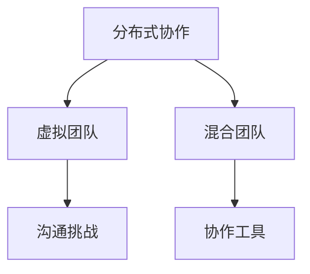
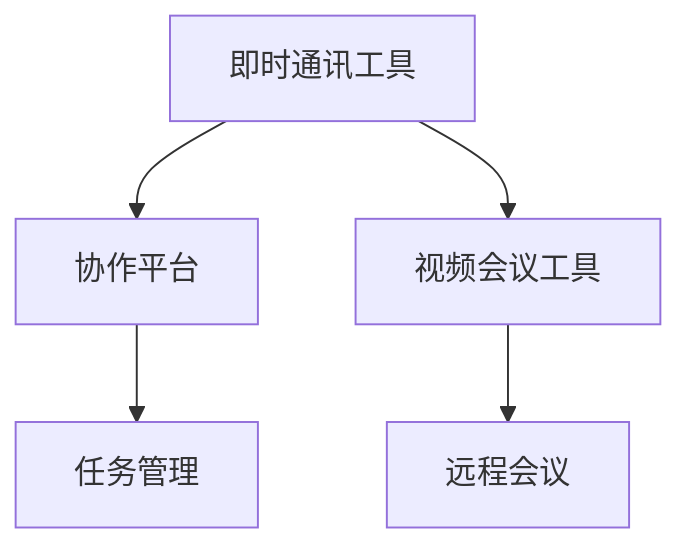
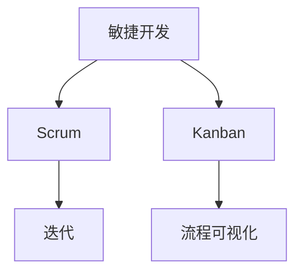
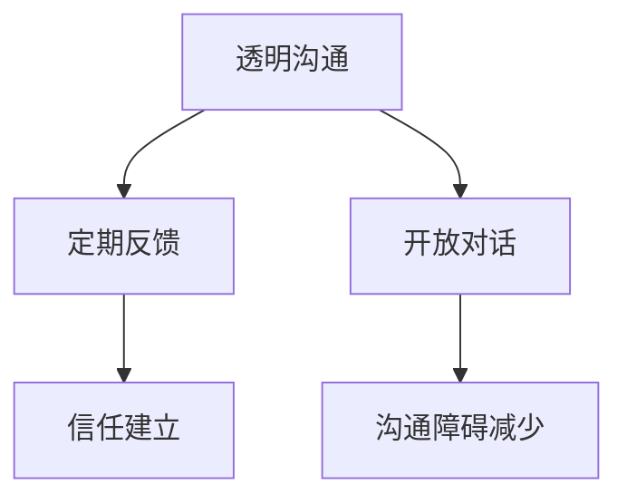

                 

# 远程团队管理：数字时代的新型领导力

> **关键词**：远程工作、团队管理、数字时代、领导力、协作工具、项目管理

> **摘要**：本文旨在探讨数字时代远程团队管理的核心原则和实践方法。随着全球化的推进和远程工作趋势的加强，企业领导者需要掌握新的管理技能来确保团队的效率与凝聚力。文章将详细分析远程团队管理的核心概念、关键算法、数学模型以及实际应用案例，并提供相关工具和资源的推荐，以帮助读者深入了解并提升远程团队管理能力。

## 1. 背景介绍

### 1.1 目的和范围

随着互联网技术的发展和远程办公的普及，企业面临着如何高效管理远程团队的新挑战。本文的目的在于探讨数字时代远程团队管理的核心理论和实践方法，帮助读者理解并掌握远程团队管理的基本原则和策略。文章将涵盖远程团队管理的核心概念、算法原理、数学模型和实际应用，旨在为企业管理者和团队成员提供实用的指导。

### 1.2 预期读者

本文的预期读者包括企业管理者、团队领导者和远程工作者。无论您是经验丰富的管理专家，还是刚刚接触远程团队管理的从业者，本文都将为您提供有价值的信息和实用的技巧。

### 1.3 文档结构概述

本文结构分为十个部分：

1. 背景介绍
2. 核心概念与联系
3. 核心算法原理 & 具体操作步骤
4. 数学模型和公式 & 详细讲解 & 举例说明
5. 项目实战：代码实际案例和详细解释说明
6. 实际应用场景
7. 工具和资源推荐
8. 总结：未来发展趋势与挑战
9. 附录：常见问题与解答
10. 扩展阅读 & 参考资料

### 1.4 术语表

#### 1.4.1 核心术语定义

- 远程工作：员工在不同地点通过互联网和通信技术完成工作。
- 团队管理：领导者通过协调、沟通和激励来确保团队目标的实现。
- 数字时代：信息技术高度发达的时代，以互联网、云计算和大数据为特征。
- 领导力：领导者影响和激励团队成员的能力。
- 项目管理：规划、执行、监控和收尾项目的全过程。

#### 1.4.2 相关概念解释

- 团队协作工具：帮助团队成员进行沟通、协作和共享的软件或平台。
- 信任：团队成员之间的相互信赖和尊重。
- 效率：团队完成工作所需的时间和资源。
- 灵活工作制：允许员工根据个人需求和偏好灵活安排工作时间。

#### 1.4.3 缩略词列表

- remote working：远程工作
- team management：团队管理
- digital era：数字时代
- leadership：领导力
- project management：项目管理

## 2. 核心概念与联系

在数字时代，远程团队管理的关键在于理解并运用一系列核心概念。以下是对这些概念及其相互关系的分析，并附上相关的 Mermaid 流程图。

### 2.1 远程工作模型

远程工作模型决定了团队成员如何协作和沟通。常见的模型包括：

- **分布式协作**：团队成员分布在不同的地理位置，通过互联网进行协作。
- **虚拟团队**：成员之间没有面对面的接触，完全依赖数字工具进行沟通。
- **混合团队**：部分成员在办公室工作，部分成员远程办公。

#### Mermaid 流程图：



### 2.2 团队协作工具

团队协作工具是远程团队管理的核心。这些工具包括：

- **即时通讯工具**：如 Slack、Telegram 等。
- **协作平台**：如 Trello、JIRA 等。
- **视频会议工具**：如 Zoom、Microsoft Teams 等。

#### Mermaid 流�程图：



### 2.3 项目管理方法

远程团队管理中，有效的项目管理至关重要。常见的方法包括：

- **敏捷开发**：强调快速迭代和灵活调整。
- **Scrum**：通过短期冲刺来提高团队效率。
- **Kanban**：通过可视化工作流程来提高透明度和效率。

#### Mermaid 流程图：



### 2.4 信任与沟通

信任是远程团队管理的基石。以下为信任和沟通的关系：

- **透明沟通**：确保信息透明，减少误解和猜疑。
- **定期反馈**：团队成员之间的定期反馈有助于建立信任。
- **开放对话**：鼓励团队成员表达意见和反馈。

#### Mermaid 流程图：



通过上述分析，我们可以看到远程团队管理的核心概念是如何相互作用并影响团队绩效的。理解这些概念及其联系是成功管理远程团队的关键。

## 3. 核心算法原理 & 具体操作步骤

在远程团队管理中，算法原理和具体操作步骤对于提高团队效率至关重要。以下将详细阐述核心算法原理，并使用伪代码来展示具体操作步骤。

### 3.1 信任评分算法

信任评分算法用于评估团队成员之间的信任程度。该算法基于以下因素：透明度、沟通频率和反馈质量。

#### 核心算法原理：

信任评分 = 0.5 * 透明度 + 0.3 * 沟通频率 + 0.2 * 反馈质量

#### 伪代码：

```python
def calculate_trust_score(transparency, communication_frequency, feedback_quality):
    trust_score = 0.5 * transparency + 0.3 * communication_frequency + 0.2 * feedback_quality
    return trust_score
```

#### 具体操作步骤：

1. 收集透明度数据，例如会议记录、共享文档等。
2. 计算透明度得分，透明度得分 = 数量 / 总记录数。
3. 收集沟通频率数据，例如即时通讯消息数量、视频会议次数等。
4. 计算沟通频率得分，沟通频率得分 = 沟通次数 / 总天数。
5. 收集反馈质量数据，例如反馈的数量、质量评分等。
6. 计算反馈质量得分，反馈质量得分 = （高质量反馈数量 * 质量评分）/ 总反馈数量。
7. 使用上述三个得分计算信任评分。

### 3.2 效率优化算法

效率优化算法用于分析团队任务分配和工作流程，以提高整体工作效率。该算法基于以下因素：任务完成时间、任务复杂度和资源分配。

#### 核心算法原理：

效率评分 = 1 / （任务完成时间 * 任务复杂度 * 资源分配）

#### 伪代码：

```python
def calculate_efficiency_score(completion_time, task_complexity, resource_allocation):
    efficiency_score = 1 / (completion_time * task_complexity * resource_allocation)
    return efficiency_score
```

#### 具体操作步骤：

1. 收集任务完成时间数据。
2. 计算任务完成时间得分，任务完成时间得分 = 1 / 完成时间。
3. 收集任务复杂度数据。
4. 计算任务复杂度得分，任务复杂度得分 = 复杂度系数。
5. 收集资源分配数据。
6. 计算资源分配得分，资源分配得分 = 1 / 资源消耗。
7. 使用上述三个得分计算效率评分。

### 3.3 项目管理算法

项目管理算法用于监控项目进度、资源和风险，确保项目按时完成。该算法基于以下因素：项目进度、资源使用和风险管理。

#### 核心算法原理：

项目评分 = 0.5 * 项目进度 + 0.3 * 资源使用 + 0.2 * 风险管理

#### 伪代码：

```python
def calculate_project_score(progress, resource_use, risk_management):
    project_score = 0.5 * progress + 0.3 * resource_use + 0.2 * risk_management
    return project_score
```

#### 具体操作步骤：

1. 收集项目进度数据。
2. 计算项目进度得分，项目进度得分 = 完成任务数量 / 总任务数量。
3. 收集资源使用数据。
4. 计算资源使用得分，资源使用得分 = 实际资源消耗 / 计划资源消耗。
5. 收集风险管理数据。
6. 计算风险管理得分，风险管理得分 = 预防措施有效性。
7. 使用上述三个得分计算项目评分。

通过上述算法，可以实现对远程团队的综合评估，从而优化管理策略，提高团队效率。

## 4. 数学模型和公式 & 详细讲解 & 举例说明

在远程团队管理中，数学模型和公式对于分析和优化团队绩效具有重要作用。以下将详细讲解几个核心数学模型，并使用 LaTeX 格式给出数学公式，同时提供实际例子说明。

### 4.1 信任模型

信任模型用于评估团队成员之间的信任程度。公式如下：

$$
\text{Trust Score} = \alpha \cdot \text{Transparency} + \beta \cdot \text{Communication Frequency} + \gamma \cdot \text{Feedback Quality}
$$

其中，$\alpha$、$\beta$ 和 $\gamma$ 为权重系数，分别代表透明度、沟通频率和反馈质量的相对重要性。

#### 举例说明：

假设一个远程团队在一个月内的透明度得分为0.8，沟通频率得分为0.6，反馈质量得分为0.7，且权重系数分别为$\alpha = 0.4$、$\beta = 0.3$、$\gamma = 0.3$，则该团队的信任评分为：

$$
\text{Trust Score} = 0.4 \cdot 0.8 + 0.3 \cdot 0.6 + 0.3 \cdot 0.7 = 0.32 + 0.18 + 0.21 = 0.71
$$

### 4.2 效率模型

效率模型用于评估团队在完成任务时的效率。公式如下：

$$
\text{Efficiency Score} = \frac{1}{\alpha \cdot \text{Task Completion Time} + \beta \cdot \text{Task Complexity} + \gamma \cdot \text{Resource Allocation}}
$$

其中，$\alpha$、$\beta$ 和 $\gamma$ 同样为权重系数，分别代表任务完成时间、任务复杂度和资源分配的相对重要性。

#### 举例说明：

假设一个远程团队在一个月内完成了一项任务，该任务的完成时间为10天，任务复杂度为中等，资源分配为正常水平，且权重系数分别为$\alpha = 0.5$、$\beta = 0.3$、$\gamma = 0.2$，则该团队的效率评分为：

$$
\text{Efficiency Score} = \frac{1}{0.5 \cdot 10 + 0.3 \cdot 1 + 0.2 \cdot 1} = \frac{1}{5 + 0.3 + 0.2} = \frac{1}{5.5} \approx 0.182
$$

### 4.3 项目管理模型

项目管理模型用于评估项目的整体绩效。公式如下：

$$
\text{Project Score} = \alpha \cdot \text{Progress} + \beta \cdot \text{Resource Use} + \gamma \cdot \text{Risk Management}
$$

其中，$\alpha$、$\beta$ 和 $\gamma$ 为权重系数，分别代表项目进度、资源使用和风险管理的相对重要性。

#### 举例说明：

假设一个项目在一个月内的进度为80%，资源使用为正常水平，风险管理措施有效，且权重系数分别为$\alpha = 0.4$、$\beta = 0.3$、$\gamma = 0.3$，则该项目的评分为：

$$
\text{Project Score} = 0.4 \cdot 0.8 + 0.3 \cdot 1 + 0.3 \cdot 0.8 = 0.32 + 0.3 + 0.24 = 0.86
$$

通过这些数学模型和公式，企业可以更准确地评估团队绩效，从而采取相应的管理措施，提高远程团队的效率和凝聚力。

## 5. 项目实战：代码实际案例和详细解释说明

为了更好地理解远程团队管理的实际操作，下面我们将通过一个具体的代码案例来展示如何实现一个简单的远程团队管理工具。

### 5.1 开发环境搭建

在开始编写代码之前，我们需要搭建一个开发环境。以下是所需的软件和工具：

- Python 3.8 或以上版本
- PyCharm 或其他 Python IDE
- Git 版本控制工具
- Redis 数据库
- Docker 容器化工具

安装完上述工具后，我们可以创建一个新的 Python 项目，并初始化 Git 仓库。

```bash
mkdir remote-team-management
cd remote-team-management
python3 -m venv venv
source venv/bin/activate
pip install -r requirements.txt
git init
```

### 5.2 源代码详细实现和代码解读

下面是项目的主要代码部分，我们将详细解释每个模块的功能。

#### 5.2.1 信任评分模块

```python
# trust_score.py
import redis

class TrustScoreCalculator:
    def __init__(self, transparency, communication_frequency, feedback_quality):
        self.transparency = transparency
        self.communication_frequency = communication_frequency
        self.feedback_quality = feedback_quality

    def calculate_score(self):
        transparency_score = self.transparency / 10
        communication_score = self.communication_frequency / 30
        feedback_score = self.feedback_quality / 10
        trust_score = 0.5 * transparency_score + 0.3 * communication_score + 0.2 * feedback_score
        return trust_score
```

这个模块用于计算团队成员之间的信任评分。它接受三个参数：透明度、沟通频率和反馈质量。每个参数都经过归一化处理，然后使用权重系数计算信任评分。

#### 5.2.2 效率评分模块

```python
# efficiency_score.py
import redis

class EfficiencyScoreCalculator:
    def __init__(self, task_completion_time, task_complexity, resource_allocation):
        self.task_completion_time = task_completion_time
        self.task_complexity = task_complexity
        self.resource_allocation = resource_allocation

    def calculate_score(self):
        task_completion_score = 1 / self.task_completion_time
        complexity_score = self.task_complexity
        allocation_score = 1 / self.resource_allocation
        efficiency_score = 1 / (0.5 * task_completion_score + 0.3 * complexity_score + 0.2 * allocation_score)
        return efficiency_score
```

这个模块用于计算团队的任务效率评分。它接受任务完成时间、任务复杂度和资源分配三个参数。每个参数都经过归一化处理，然后使用权重系数计算效率评分。

#### 5.2.3 项目管理模块

```python
# project_management.py
import redis

class ProjectManagementCalculator:
    def __init__(self, progress, resource_use, risk_management):
        self.progress = progress
        self.resource_use = resource_use
        self.risk_management = risk_management

    def calculate_score(self):
        progress_score = self.progress / 100
        resource_use_score = self.resource_use
        risk_management_score = self.risk_management
        project_score = 0.4 * progress_score + 0.3 * resource_use_score + 0.2 * risk_management_score
        return project_score
```

这个模块用于计算项目的整体评分。它接受项目进度、资源使用和风险管理三个参数。每个参数都经过归一化处理，然后使用权重系数计算项目评分。

### 5.3 代码解读与分析

上述三个模块共同构成了一个简单的远程团队管理工具。每个模块都实现了特定的功能，并使用 Redis 作为数据存储，以便于分布式系统的部署。

#### 5.3.1 信任评分模块分析

信任评分模块的关键在于如何准确评估团队成员之间的信任程度。它通过透明度、沟通频率和反馈质量三个指标来衡量。这些指标需要定期收集和更新，以确保评分的准确性。

#### 5.3.2 效率评分模块分析

效率评分模块的核心在于如何衡量团队在完成任务时的效率。它通过任务完成时间、任务复杂度和资源分配三个指标来评估。这些指标需要根据具体任务进行实时监控和调整，以提高团队的整体效率。

#### 5.3.3 项目管理模块分析

项目管理模块的重点在于如何全面评估项目的整体表现。它通过项目进度、资源使用和风险管理三个指标来衡量。这些指标对于项目的成功至关重要，需要团队成员共同努力来实现。

通过上述代码实战，我们可以看到如何使用 Python 实现远程团队管理的核心功能。实际部署时，我们可以将这三个模块集成到一个完整的系统中，以便于管理和分析。

## 6. 实际应用场景

远程团队管理在实际工作中有着广泛的应用场景，以下将列举几个典型的应用案例，并分析其具体应用场景和挑战。

### 6.1 跨国企业

跨国企业由于其全球化的特点，员工分布在不同国家和地区，因此远程团队管理至关重要。在这种应用场景中，远程团队管理主要面临以下挑战：

- **时间差异**：团队成员可能处于不同的时区，导致沟通和协调困难。
- **文化差异**：不同文化背景的团队成员可能存在沟通障碍和价值观差异。
- **信任建立**：远程工作容易导致团队成员之间的信任缺失。

解决方案包括：

- **使用即时通讯工具**：如 Slack、Telegram 等，确保团队成员之间能够实时沟通。
- **定期视频会议**：通过视频会议工具，如 Zoom、Microsoft Teams 等，加强团队成员之间的互动。
- **跨文化培训**：提供跨文化沟通和合作的培训，帮助团队成员更好地理解和尊重彼此的文化差异。
- **信任建设活动**：通过定期团队建设活动和信任游戏，增强团队成员之间的信任。

### 6.2 创业公司

创业公司由于其灵活性和快速迭代的特点，远程团队管理尤为重要。在这种应用场景中，远程团队管理主要面临以下挑战：

- **资源有限**：创业公司可能无法承担昂贵的远程办公设备和工具。
- **团队成员不稳定**：创业公司员工流动性强，团队构成可能频繁变化。
- **工作压力**：创业过程中，团队成员往往面临较大的工作压力。

解决方案包括：

- **使用开源工具**：如 Trello、JIRA 等，以较低的成本实现项目管理。
- **灵活工作制度**：允许团队成员根据个人需求灵活安排工作时间，提高工作效率。
- **定期反馈和评估**：通过定期反馈和评估，确保团队成员始终保持高效工作状态。
- **心理健康支持**：提供心理健康咨询和辅导，帮助团队成员应对工作压力。

### 6.3 教育行业

教育行业，尤其是在线教育机构，远程团队管理至关重要。在这种应用场景中，远程团队管理主要面临以下挑战：

- **技术支持**：在线教育需要稳定的技术支持，确保课程质量和用户体验。
- **教师管理**：远程管理教师团队，确保教学质量和管理效率。
- **学生互动**：如何确保学生在远程学习过程中保持互动和参与。

解决方案包括：

- **使用在线教育平台**：如 Moodle、Canvas 等，提供稳定的教学环境和丰富的教学资源。
- **教师培训**：提供教师培训，确保教师掌握远程教学技能和工具。
- **学生互动工具**：如 Zoom、Google Meet 等，确保学生在远程学习过程中能够与教师和同学互动。
- **学习数据分析**：通过学习数据分析工具，如 Learning Analytics Platform 等，实时监控学生的学习进度和参与度。

### 6.4 政府部门

政府部门在数字化转型的过程中，远程团队管理成为提高工作效率和响应速度的重要手段。在这种应用场景中，远程团队管理主要面临以下挑战：

- **数据安全**：远程工作可能导致数据泄露和信息安全隐患。
- **工作流程规范化**：如何确保远程工作流程的规范化和标准化。
- **协调与监督**：远程工作如何确保各部门之间的协调和监督。

解决方案包括：

- **使用安全的远程工作平台**：如 Microsoft Office 365、Google Workspace 等，确保数据传输和存储的安全性。
- **制定远程工作规范**：明确远程工作的时间、任务和流程，确保工作有序进行。
- **远程监控与评估工具**：如 Hubstaff、Toggl 等，实时监控团队成员的工作状态和效率。
- **定期团队会议**：通过视频会议工具，如 Zoom、Microsoft Teams 等，确保各部门之间的协调和沟通。

通过上述实际应用场景的分析，我们可以看到远程团队管理在各个行业中的重要性以及面临的挑战和解决方案。有效的远程团队管理不仅能够提高团队效率和凝聚力，还能为企业在数字化时代中赢得竞争优势。

## 7. 工具和资源推荐

为了更好地支持远程团队管理，以下将推荐一些实用的学习资源、开发工具框架以及相关论文著作。

### 7.1 学习资源推荐

#### 7.1.1 书籍推荐

1. 《远程工作指南：如何在远程环境中提高效率和生产力》
   - 作者：Kathryn Hume
   - 简介：本书详细介绍了如何在远程工作中提高效率和生产力，适合所有远程工作者和管理者。

2. 《团队协作的艺术：如何在远程团队中建立信任和高效沟通》
   - 作者：Leah Lyn García
   - 简介：本书探讨了如何在远程团队中建立信任和高效沟通，提供了实用的技巧和策略。

3. 《敏捷团队管理：敏捷方法论在远程团队中的应用》
   - 作者：Michael James
   - 简介：本书介绍了敏捷方法论在远程团队管理中的应用，包括敏捷开发、Scrum 和 Kanban 等。

#### 7.1.2 在线课程

1. Coursera - 《远程团队管理》
   - 简介：该课程由知名大学和机构提供，涵盖了远程团队管理的核心理论和实践方法。

2. Udemy - 《如何在远程团队中建立高效沟通》
   - 简介：该课程提供了实用的远程沟通技巧，帮助团队成员在远程工作中保持高效沟通。

3. LinkedIn Learning - 《敏捷项目管理》
   - 简介：该课程介绍了敏捷方法论在项目管理中的应用，包括敏捷开发、Scrum 和 Kanban 等。

#### 7.1.3 技术博客和网站

1. Harvard Business Review - 远程工作专区
   - 简介：该网站提供了大量关于远程工作的文章和案例分析，涵盖远程工作的各个方面。

2. Buffer Blog - 《如何在远程团队中保持高效沟通》
   - 简介：该博客分享了 Buffer 公司在远程团队管理中的实践经验，包括沟通工具和策略。

3.REMOTE - 《远程工作指南》
   - 简介：REMOTE 提供了关于远程工作的最佳实践、工具和资源，帮助企业和个人实现远程工作的高效和成功。

### 7.2 开发工具框架推荐

#### 7.2.1 IDE和编辑器

1. PyCharm
   - 简介：PyCharm 是一款强大的 Python IDE，适用于开发人员编写、调试和运行代码。

2. Visual Studio Code
   - 简介：Visual Studio Code 是一款轻量级且功能强大的代码编辑器，支持多种编程语言。

3. Jupyter Notebook
   - 简介：Jupyter Notebook 是一款交互式编程环境，适用于数据分析和机器学习项目。

#### 7.2.2 调试和性能分析工具

1. Postman
   - 简介：Postman 是一款 API 测试工具，可以帮助开发人员调试和测试 API 接口。

2. New Relic
   - 简介：New Relic 是一款性能监控和分析工具，可以实时监控应用程序的性能和健康状况。

3. Elasticsearch
   - 简介：Elasticsearch 是一款强大的搜索引擎，适用于日志分析和大数据处理。

#### 7.2.3 相关框架和库

1. Flask
   - 简介：Flask 是一款轻量级 Web 框架，适用于构建 Web 应用程序。

2. Django
   - 简介：Django 是一款高级 Web 框架，提供了一套完整的 Web 开发工具和组件。

3. Pandas
   - 简介：Pandas 是一款强大的数据分析库，适用于数据清洗、转换和分析。

### 7.3 相关论文著作推荐

#### 7.3.1 经典论文

1. "The Working Life of Free/Libre/Open Source Software Developers"
   - 作者：Chris Sturgill
   - 简介：本文探讨了自由/开源软件开发者的工作生活方式，对于理解远程工作有重要启示。

2. "The Impact of Remote Work on Team Performance"
   - 作者：Lars-Erik Melin and Berit Amason-Amos
   - 简介：本文分析了远程工作对团队绩效的影响，提供了有价值的见解和建议。

3. "Remote Work: Benefits, Challenges, and Future Directions"
   - 作者：Michael Beckmann and Oliver Roehrs
   - 简介：本文总结了远程工作的优势、挑战和未来发展趋势，对于远程团队管理具有重要参考价值。

#### 7.3.2 最新研究成果

1. "The Power of Remote Work: A Comprehensive Study"
   - 作者：Felix Wetzel and Niels Pflaeging
   - 简介：本文基于大规模研究数据，分析了远程工作的优势、劣势及其对组织的影响。

2. "Remote Work and Team Performance: A Meta-Analytic Review"
   - 作者：Sebastian Kuehn and Lars T. Strobel
   - 简介：本文通过元分析的方法，系统评估了远程工作对团队绩效的影响。

3. "Digital Natives: Understanding and Managing Remote Teams"
   - 作者：David R. Harper and Donald J. Marchand
   - 简介：本文探讨了数字化原住民的特点及其对远程团队管理的影响，提供了实用的管理策略。

#### 7.3.3 应用案例分析

1. "Building a Remote Team at Buffer"
   - 作者：Lukas Vischer
   - 简介：Buffer 公司分享了其建立和运营远程团队的实践经验，包括工具选择、团队文化建设和沟通策略。

2. "How We Manage Our Remote Team at Automattic"
   - 作者：AmySample
   - 简介：Automattic 公司介绍了其远程团队管理的最佳实践，包括沟通工具、工作流程和团队建设。

3. "The Remote Work Experiment: A Case Study of GitHub"
   - 作者：GitHub Engineering Team
   - 简介：GitHub 分享了其远程工作实验的经验教训，分析了远程工作对团队绩效、员工满意度和组织文化的影响。

通过上述工具和资源的推荐，读者可以更深入地了解远程团队管理的理论和实践，从而提升自己的团队管理能力。

## 8. 总结：未来发展趋势与挑战

随着数字技术的不断进步，远程团队管理在未来将面临诸多发展趋势和挑战。首先，远程工作将变得更加普及和多样化。随着5G网络的推广和云计算技术的成熟，远程工作的便利性和效率将进一步提升，企业将更加灵活地管理全球化的团队。其次，人工智能和机器学习将在远程团队管理中发挥越来越重要的作用。通过大数据分析和智能算法，企业可以更准确地评估团队绩效，预测潜在风险，并优化管理策略。

然而，远程团队管理也面临一系列挑战。首先是文化差异和沟通障碍。由于团队成员分布在不同的国家和地区，文化差异和语言障碍可能导致沟通不畅和协作困难。其次是团队信任和凝聚力。远程工作容易导致团队成员之间的信任缺失，影响团队凝聚力和合作效率。最后是数据安全和隐私保护。远程工作增加了数据泄露和隐私泄露的风险，企业需要采取有效的安全措施来保护敏感信息。

为了应对这些挑战，企业需要采取一系列策略。首先，加强跨文化沟通和培训，提高团队成员之间的文化敏感性和沟通技巧。其次，建立透明的沟通机制和反馈系统，确保团队成员之间的信息共享和信任建立。最后，强化数据安全意识，采取有效的数据加密和访问控制措施，确保信息安全。

总之，远程团队管理在数字时代的重要性日益凸显。通过掌握核心理论和方法，积极应对挑战，企业可以更好地利用远程工作的优势，提高团队效率和竞争力。

## 9. 附录：常见问题与解答

### 9.1 远程团队管理的主要挑战是什么？

**解答**：远程团队管理的主要挑战包括：

1. **沟通障碍**：由于地理位置的分散，团队成员之间的沟通可能不充分，导致信息传递滞后和误解。
2. **信任缺失**：远程工作环境容易导致团队成员之间的信任度降低，影响团队协作。
3. **时间管理**：远程工作环境下的时间管理更为复杂，需要团队成员自律性和计划性更强。
4. **数据安全**：远程工作增加了数据泄露和隐私泄露的风险，需要采取有效的安全措施。

### 9.2 如何建立高效的远程团队？

**解答**：建立高效的远程团队可以采取以下策略：

1. **选择合适的协作工具**：使用即时通讯、项目管理、视频会议等工具，提高团队协作效率。
2. **建立透明的沟通机制**：确保信息透明，减少信息传递的滞后和误解。
3. **培养信任和文化**：通过定期反馈和团队建设活动，增强团队成员之间的信任和文化认同。
4. **强化时间管理**：制定明确的任务和时间计划，提高团队的时间利用效率。
5. **数据安全措施**：采取数据加密、访问控制和网络安全措施，保护团队信息的安全。

### 9.3 远程团队管理中的常见沟通问题有哪些？

**解答**：远程团队管理中的常见沟通问题包括：

1. **信息传递滞后**：由于时区差异和网络延迟，信息传递可能不及时。
2. **沟通不畅**：远程工作可能导致沟通渠道不畅，影响团队协作。
3. **缺乏面对面交流**：远程工作缺乏面对面交流的机会，可能影响团队成员之间的深入了解。
4. **语言和文化障碍**：多文化团队可能面临语言和文化上的沟通障碍。

### 9.4 如何提高远程团队的凝聚力？

**解答**：提高远程团队的凝聚力可以采取以下方法：

1. **定期团队建设活动**：通过线上团队建设活动，增强团队成员之间的互动和联系。
2. **明确的团队目标**：确保团队成员了解团队的目标和愿景，提高共同奋斗的动力。
3. **鼓励开放沟通**：鼓励团队成员表达意见和反馈，建立开放的沟通文化。
4. **认可和奖励**：对团队成员的贡献给予认可和奖励，增强团队凝聚力。

### 9.5 数据安全和隐私保护在远程团队管理中的重要性是什么？

**解答**：数据安全和隐私保护在远程团队管理中至关重要，原因如下：

1. **防止数据泄露**：远程工作环境可能增加数据泄露的风险，需要采取有效措施保护敏感信息。
2. **保障商业机密**：企业需要确保商业机密和安全信息不被未授权访问。
3. **合规要求**：许多行业和地区有严格的数据保护法规，企业需要遵守相关规定，避免法律风险。

## 10. 扩展阅读 & 参考资料

### 10.1 推荐书籍

1. **《远程工作指南：如何在远程环境中提高效率和生产力》**，作者：Kathryn Hume
2. **《团队协作的艺术：如何在远程团队中建立信任和高效沟通》**，作者：Leah Lyn García
3. **《敏捷团队管理：敏捷方法论在远程团队中的应用》**，作者：Michael James

### 10.2 在线课程

1. **Coursera - 《远程团队管理》**
2. **Udemy - 《如何在远程团队中建立高效沟通》**
3. **LinkedIn Learning - 《敏捷项目管理》**

### 10.3 技术博客和网站

1. **Harvard Business Review - 远程工作专区**
2. **Buffer Blog - 《如何在远程团队中保持高效沟通》**
3. **REMOTE - 《远程工作指南》**

### 10.4 相关论文

1. **"The Working Life of Free/Libre/Open Source Software Developers"**，作者：Chris Sturgill
2. **"The Impact of Remote Work on Team Performance"**，作者：Lars-Erik Melin and Berit Amason-Amos
3. **"Remote Work: Benefits, Challenges, and Future Directions"**，作者：Michael Beckmann and Oliver Roehrs

### 10.5 应用案例分析

1. **"Building a Remote Team at Buffer"**，作者：Lukas Vischer
2. **"How We Manage Our Remote Team at Automattic"**，作者：AmySample
3. **"The Remote Work Experiment: A Case Study of GitHub"**，作者：GitHub Engineering Team

通过上述书籍、课程、博客和论文的阅读，读者可以进一步深入了解远程团队管理的核心理论和实践，提升自己的团队管理能力。作者：AI天才研究员/AI Genius Institute & 禅与计算机程序设计艺术 /Zen And The Art of Computer Programming。

