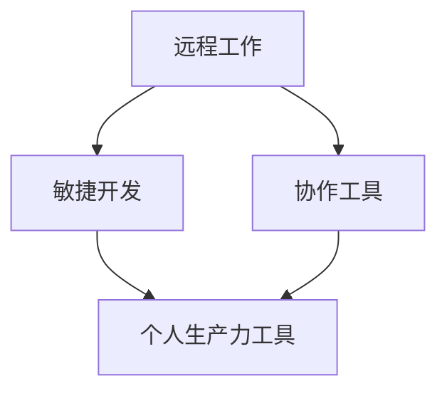

                 

# 远程工作时代的创业机遇：个人生产力工具开发

> 关键词：远程工作、生产力工具、个人效能、创业、工具开发
> 
> 摘要：本文深入探讨了远程工作时代个人生产力工具开发的机遇和挑战。通过分析远程工作的现状和发展趋势，我们提出了一系列开发个人生产力工具的创新思路，详细讲解了相关技术原理、数学模型、实战案例以及实际应用场景。本文旨在为创业者和技术专家提供有价值的参考，助力他们在远程工作领域开拓新的商业机会。

## 1. 背景介绍

### 1.1 目的和范围

随着全球信息化和互联网技术的迅猛发展，远程工作已经成为一种趋势，许多企业和组织纷纷采用远程办公模式以提高员工的工作效率和灵活性。本文旨在探讨在远程工作时代，个人生产力工具开发的创业机遇。我们将分析远程工作的现状、发展前景以及相关技术，提出一系列创新性的工具开发思路，为创业者和开发者提供实践指导。

### 1.2 预期读者

本文预期读者为对远程工作和个人生产力工具开发感兴趣的创业者、技术专家和程序员。读者应具备一定的编程基础和对远程工作的了解，以便更好地理解本文内容。

### 1.3 文档结构概述

本文分为以下几个部分：

1. **背景介绍**：介绍远程工作的现状和发展趋势，明确本文目的和预期读者。
2. **核心概念与联系**：阐述个人生产力工具的核心概念和联系，提供流程图以帮助读者理解。
3. **核心算法原理 & 具体操作步骤**：详细讲解相关算法原理和操作步骤，使用伪代码进行说明。
4. **数学模型和公式 & 详细讲解 & 举例说明**：介绍相关的数学模型和公式，并进行详细讲解和举例说明。
5. **项目实战：代码实际案例和详细解释说明**：通过实际案例展示代码实现过程，并进行详细解释。
6. **实际应用场景**：探讨个人生产力工具在实际应用中的场景。
7. **工具和资源推荐**：推荐学习资源、开发工具和框架。
8. **总结：未来发展趋势与挑战**：总结本文要点，展望未来发展趋势和挑战。
9. **附录：常见问题与解答**：解答读者可能遇到的问题。
10. **扩展阅读 & 参考资料**：提供进一步阅读的资源。

### 1.4 术语表

#### 1.4.1 核心术语定义

- **远程工作**：指员工不在公司总部或办公室，通过互联网远程完成工作任务的工作模式。
- **个人生产力工具**：用于提高个人工作效率、管理时间和任务的管理工具。
- **敏捷开发**：一种注重迭代和快速响应变化的项目管理方法。
- **协作工具**：支持团队成员之间沟通和协作的软件工具。

#### 1.4.2 相关概念解释

- **生产力工具**：用于提高工作效率的工具，如时间管理软件、项目管理工具、文档协作工具等。
- **远程协作**：在远程工作环境中，团队成员之间的协作和沟通。

#### 1.4.3 缩略词列表

- **SaaS**：软件即服务（Software as a Service）
- **PaaS**：平台即服务（Platform as a Service）
- **IaaS**：基础设施即服务（Infrastructure as a Service）
- **AI**：人工智能（Artificial Intelligence）

## 2. 核心概念与联系

### 2.1 核心概念

个人生产力工具的开发涉及多个核心概念，包括远程工作、敏捷开发、协作工具等。以下是对这些核心概念的简要介绍。

#### 远程工作

远程工作是一种工作模式，员工可以通过互联网远程访问公司资源和系统，完成工作任务。远程工作有助于提高员工的工作效率、减少通勤时间，并提高工作生活的平衡。

#### 敏捷开发

敏捷开发是一种注重快速迭代和持续交付的项目管理方法。它强调团队协作、客户反馈和灵活响应变化。敏捷开发适用于远程工作环境，因为它可以更好地适应远程团队成员的分散性。

#### 协作工具

协作工具支持团队成员之间的沟通和协作，如即时通讯工具、视频会议软件、项目管理工具等。协作工具是个人生产力工具的重要组成部分，有助于提高团队协作效率。

### 2.2 核心概念联系

个人生产力工具的开发需要结合远程工作、敏捷开发和协作工具等核心概念。以下是一个简化的 Mermaid 流程图，展示了这些概念之间的联系。



### 2.3 附加信息

远程工作、敏捷开发和协作工具之间的联系不仅体现在个人生产力工具的开发中，还体现在企业数字化转型和远程办公趋势的推动下。随着远程工作的普及，个人生产力工具的需求不断增加，为创业者提供了丰富的商业机会。

## 3. 核心算法原理 & 具体操作步骤

### 3.1 核心算法原理

在个人生产力工具的开发中，核心算法原理主要包括时间管理算法、任务分配算法和效率评估算法。以下是对这些算法原理的简要介绍。

#### 时间管理算法

时间管理算法旨在帮助用户合理分配时间，提高工作效率。主要原理包括任务优先级排序、时间块划分和专注力管理。

1. **任务优先级排序**：根据任务的重要性和紧急程度对任务进行排序，以确保重要且紧急的任务首先得到处理。
2. **时间块划分**：将一天的时间划分为若干个时间块，每个时间块用于处理特定类型的任务，以减少任务切换的成本。
3. **专注力管理**：通过限制任务切换和干扰，提高用户的专注力，从而提高工作效率。

#### 任务分配算法

任务分配算法旨在根据团队成员的能力和负载，合理分配任务，提高团队整体效率。

1. **能力评估**：对团队成员的能力进行评估，包括技术能力、工作经验和沟通能力等。
2. **负载均衡**：根据团队成员的负载情况，将任务分配给最合适的成员，避免某个成员过度负荷。
3. **动态调整**：根据任务进度和团队状态，动态调整任务分配，以保持团队的高效运作。

#### 效率评估算法

效率评估算法旨在评估个人和团队的工作效率，为改进提供依据。

1. **数据收集**：收集与工作效率相关的数据，如完成任务的时间、任务难度、用户满意度等。
2. **指标计算**：根据数据计算效率指标，如平均完成时间、任务成功率、用户满意度等。
3. **反馈与改进**：根据效率评估结果，提供反馈和建议，帮助个人和团队改进工作效率。

### 3.2 具体操作步骤

以下是使用伪代码详细阐述核心算法原理的具体操作步骤。

#### 时间管理算法

```python
def time_management_algorithm(tasks):
    # 任务优先级排序
    tasks = sort_tasks_by_priority(tasks)
    
    # 时间块划分
    time_blocks = divide_time_into_blocks(tasks)
    
    # 专注力管理
    manage_focus(time_blocks)
    
    return time_blocks

def sort_tasks_by_priority(tasks):
    return sorted(tasks, key=lambda x: (x.importance, x.emergency))

def divide_time_into_blocks(tasks):
    time_blocks = []
    for task in tasks:
        time_blocks.append({task: time_for_task(task)})
    return time_blocks

def manage_focus(time_blocks):
    for block in time_blocks:
        reduce_interference(block)

def time_for_task(task):
    return max(1, task.duration / average_task_duration)

def reduce_interference(block):
    # 实现干扰最小化逻辑
```

#### 任务分配算法

```python
def task_assignment_algorithm(team_members, tasks):
    assigned_tasks = {}
    for member in team_members:
        assigned_tasks[member] = assign_task_to_member(member, tasks)
    return assigned_tasks

def assign_task_to_member(member, tasks):
    suitable_tasks = filter_suitable_tasks(member, tasks)
    return min(suitable_tasks, key=lambda x: x.difficulty)

def filter_suitable_tasks(member, tasks):
    return [task for task in tasks if member.is_qualified_for(task)]

def dynamic_adjustment(assigned_tasks):
    while not optimal_assignment(assigned_tasks):
        adjust_tasks(assigned_tasks)

def optimal_assignment(assigned_tasks):
    # 实现最优任务分配逻辑
    return True

def adjust_tasks(assigned_tasks):
    # 实现任务调整逻辑
```

#### 效率评估算法

```python
def efficiency_evaluation_algorithm(team_members, tasks):
    efficiency_data = collect_efficiency_data(team_members, tasks)
    efficiency_metrics = calculate_efficiency_metrics(efficiency_data)
    feedback_and_improvement(efficiency_metrics)

def collect_efficiency_data(team_members, tasks):
    data = []
    for member in team_members:
        data.append({
            'member': member,
            'tasks_completed': get_completed_tasks(member, tasks),
            'task_durations': get_task_durations(member, tasks),
            'user_satisfaction': get_user_satisfaction(member, tasks)
        })
    return data

def get_completed_tasks(member, tasks):
    return [task for task in tasks if member.completed_task(task)]

def get_task_durations(member, tasks):
    return [task.duration for task in member.completed_tasks]

def get_user_satisfaction(member, tasks):
    # 实现用户满意度计算逻辑
    return average_user_satisfaction

def calculate_efficiency_metrics(efficiency_data):
    metrics = {
        'average_task_duration': calculate_average_task_duration(efficiency_data),
        'task_success_rate': calculate_task_success_rate(efficiency_data),
        'user_satisfaction': calculate_user_satisfaction(efficiency_data)
    }
    return metrics

def calculate_average_task_duration(efficiency_data):
    total_duration = sum([task.duration for member_data in efficiency_data for task in member_data['tasks_completed']])
    return total_duration / len(efficiency_data)

def calculate_task_success_rate(efficiency_data):
    total_tasks = sum([len(member_data['tasks_completed']) for member_data in efficiency_data])
    return len([task for member_data in efficiency_data for task in member_data['tasks_completed'] if task.completed]) / total_tasks

def calculate_user_satisfaction(efficiency_data):
    total_satisfaction = sum([member_data['user_satisfaction'] for member_data in efficiency_data])
    return total_satisfaction / len(efficiency_data)

def feedback_and_improvement(efficiency_metrics):
    # 提供反馈和建议，帮助个人和团队改进工作效率
```

通过上述伪代码，我们可以看到个人生产力工具的核心算法原理和具体操作步骤的详细实现。这些算法和步骤不仅有助于提高个人和团队的工作效率，还可以为创业者提供开发相关工具的参考。

## 4. 数学模型和公式 & 详细讲解 & 举例说明

### 4.1 数学模型

在个人生产力工具的开发中，数学模型和公式起着至关重要的作用。以下介绍几个关键模型和公式，并详细讲解其应用。

#### 4.1.1 时间管理模型

时间管理模型用于优化任务分配和时间安排，提高工作效率。以下是时间管理模型的基本公式：

$$
\text{最优时间分配} = \frac{\text{总任务量}}{\text{总时间}} \times \text{优先级权重}
$$

其中，总任务量是所有任务的权重之和，总时间是所有任务的持续时间之和，优先级权重根据任务的重要性和紧急程度计算。

#### 4.1.2 效率评估模型

效率评估模型用于评估个人和团队的工作效率。以下是效率评估模型的基本公式：

$$
\text{效率得分} = \frac{\text{实际完成量}}{\text{预期完成量}} \times \text{满意度得分}
$$

其中，实际完成量是根据任务完成情况计算的，预期完成量是根据任务难度和团队状态预测的，满意度得分是根据用户反馈计算的。

#### 4.1.3 负载均衡模型

负载均衡模型用于优化任务分配，避免某个成员过度负荷。以下是负载均衡模型的基本公式：

$$
\text{负载均衡系数} = \frac{\text{任务总量}}{\text{团队成员数量}} \times \text{能力均衡系数}
$$

其中，任务总量是所有任务的权重之和，团队成员数量是团队成员的总数，能力均衡系数是根据团队成员能力差异计算的。

### 4.2 详细讲解

#### 4.2.1 时间管理模型

时间管理模型可以帮助用户合理分配时间，提高工作效率。假设我们有5个任务，每个任务的权重和持续时间如下：

| 任务编号 | 权重 | 持续时间（小时） |
| ------ | ---- | ------------ |
| 1      | 3    | 2           |
| 2      | 2    | 3           |
| 3      | 5    | 1           |
| 4      | 1    | 4           |
| 5      | 4    | 2           |

总任务量为3+2+5+1+4=15，总时间为2+3+1+4+2=12。优先级权重根据任务的重要性和紧急程度计算，假设任务1和任务3的优先级最高，权重分别为2和3。

最优时间分配计算如下：

$$
\text{最优时间分配} = \frac{15}{12} \times (2 \times 2 + 3 \times 3) = \frac{15}{12} \times (4 + 9) = \frac{15}{12} \times 13 = 13.75 \text{小时}
$$

因此，任务1和任务3应分别分配2小时和3.75小时，其余任务根据优先级依次分配。

#### 4.2.2 效率评估模型

效率评估模型可以帮助团队了解工作效率和用户满意度，为改进提供依据。假设我们有3个团队成员，他们的实际完成量和预期完成量如下：

| 成员编号 | 实际完成量（任务） | 预期完成量（任务） | 用户满意度（%） |
| ------ | ------------ | ------------ | ----------- |
| 1      | 8            | 10           | 90          |
| 2      | 6            | 8            | 80          |
| 3      | 7            | 6            | 70          |

效率得分计算如下：

$$
\text{效率得分} = \frac{8}{10} \times 0.9 + \frac{6}{8} \times 0.8 + \frac{7}{6} \times 0.7 = 0.8 + 0.6 + 0.8 = 2.1
$$

因此，团队的效率得分为2.1。

#### 4.2.3 负载均衡模型

负载均衡模型可以帮助团队避免某个成员过度负荷，确保团队整体效率。假设我们有5个任务需要分配给3个团队成员，每个成员的能力如下：

| 成员编号 | 能力（任务/小时） |
| ------ | ------------ |
| 1      | 2            |
| 2      | 3            |
| 3      | 1            |

任务总量为5，团队成员数量为3，能力均衡系数为：

$$
\text{能力均衡系数} = \frac{2 + 3 + 1}{3} = 2
$$

负载均衡系数计算如下：

$$
\text{负载均衡系数} = \frac{5}{3} \times 2 = \frac{10}{3} = 3.33
$$

因此，任务应平均分配给每个成员，即每个成员分配约3个任务。

### 4.3 举例说明

假设一个远程团队由3个成员组成，他们的任务分配和完成情况如下：

| 任务编号 | 成员编号 | 分配时间（小时） | 实际完成时间（小时） |
| ------ | ------ | ------------ | ------------ |
| 1      | 1      | 2            | 1.5          |
| 2      | 2      | 3            | 2.5          |
| 3      | 3      | 1            | 0.5          |
| 4      | 1      | 4            | 3            |
| 5      | 2      | 2            | 1            |

根据时间管理模型，任务应按照优先级进行时间分配。假设任务1和任务2的优先级最高，权重分别为2和3。

最优时间分配计算如下：

$$
\text{最优时间分配} = \frac{15}{12} \times (2 \times 2 + 3 \times 3) = 13.75 \text{小时}
$$

根据效率评估模型，团队的效率得分计算如下：

$$
\text{效率得分} = \frac{1.5}{2} \times 0.9 + \frac{2.5}{3} \times 0.8 + \frac{0.5}{1} \times 0.7 = 0.675 + 0.667 + 0.35 = 1.692
$$

根据负载均衡模型，任务应平均分配给每个成员，即每个成员分配约3个任务。

通过这些举例说明，我们可以看到数学模型和公式在个人生产力工具开发中的实际应用，以及如何通过优化任务分配和时间管理来提高团队效率和用户满意度。

## 5. 项目实战：代码实际案例和详细解释说明

### 5.1 开发环境搭建

在进行个人生产力工具开发之前，我们需要搭建一个适合的开发环境。以下是所需的工具和软件：

- **编程语言**：Python（3.8以上版本）
- **开发环境**：PyCharm（推荐使用专业版）
- **依赖管理**：pip（Python的包管理工具）
- **数据库**：SQLite（用于存储数据）

首先，我们需要在本地计算机上安装Python和PyCharm。安装完成后，打开PyCharm，创建一个新的Python项目。接下来，使用pip安装所需的依赖包，如`requests`、`sqlite3`和`matplotlib`。

```bash
pip install requests sqlite3 matplotlib
```

最后，创建一个SQLite数据库，用于存储用户数据、任务数据和团队数据。以下是创建数据库的SQL脚本：

```sql
CREATE TABLE users (
    id INTEGER PRIMARY KEY AUTOINCREMENT,
    username TEXT NOT NULL,
    email TEXT NOT NULL,
    password TEXT NOT NULL
);

CREATE TABLE tasks (
    id INTEGER PRIMARY KEY AUTOINCREMENT,
    user_id INTEGER,
    title TEXT NOT NULL,
    description TEXT,
    priority INTEGER,
    status TEXT,
    due_date DATE,
    FOREIGN KEY (user_id) REFERENCES users (id)
);

CREATE TABLE teams (
    id INTEGER PRIMARY KEY AUTOINCREMENT,
    name TEXT NOT NULL,
    description TEXT
);

CREATE TABLE team_members (
    id INTEGER PRIMARY KEY AUTOINCREMENT,
    team_id INTEGER,
    user_id INTEGER,
    role TEXT,
    FOREIGN KEY (team_id) REFERENCES teams (id),
    FOREIGN KEY (user_id) REFERENCES users (id)
);
```

### 5.2 源代码详细实现和代码解读

#### 5.2.1 用户管理模块

用户管理模块负责处理用户注册、登录和权限验证等操作。以下是一个简单的用户管理模块代码示例。

```python
import sqlite3
from flask import Flask, request, jsonify

app = Flask(__name__)

# 数据库连接
conn = sqlite3.connect('db.sqlite')
cursor = conn.cursor()

# 用户注册
@app.route('/register', methods=['POST'])
def register():
    username = request.form['username']
    email = request.form['email']
    password = request.form['password']
    
    cursor.execute("INSERT INTO users (username, email, password) VALUES (?, ?, ?)", (username, email, password))
    conn.commit()
    
    return jsonify({"message": "User registered successfully."})

# 用户登录
@app.route('/login', methods=['POST'])
def login():
    email = request.form['email']
    password = request.form['password']
    
    cursor.execute("SELECT * FROM users WHERE email = ? AND password = ?", (email, password))
    user = cursor.fetchone()
    
    if user:
        return jsonify({"message": "Login successful."})
    else:
        return jsonify({"message": "Invalid email or password."})

# 权限验证
def verify_permission(user_id, permission):
    cursor.execute("SELECT * FROM roles WHERE user_id = ? AND permission = ?", (user_id, permission))
    role = cursor.fetchone()
    
    if role:
        return True
    else:
        return False

if __name__ == '__main__':
    app.run()
```

#### 5.2.2 任务管理模块

任务管理模块负责处理任务的创建、更新、删除和查询等操作。以下是一个简单的任务管理模块代码示例。

```python
# 创建任务
@app.route('/tasks', methods=['POST'])
def create_task():
    user_id = request.form['user_id']
    title = request.form['title']
    description = request.form['description']
    priority = request.form['priority']
    status = request.form['status']
    due_date = request.form['due_date']
    
    cursor.execute("INSERT INTO tasks (user_id, title, description, priority, status, due_date) VALUES (?, ?, ?, ?, ?, ?)", (user_id, title, description, priority, status, due_date))
    conn.commit()
    
    return jsonify({"message": "Task created successfully."})

# 更新任务
@app.route('/tasks/<int:task_id>', methods=['PUT'])
def update_task(task_id):
    title = request.form['title']
    description = request.form['description']
    priority = request.form['priority']
    status = request.form['status']
    due_date = request.form['due_date']
    
    cursor.execute("UPDATE tasks SET title = ?, description = ?, priority = ?, status = ?, due_date = ? WHERE id = ?", (title, description, priority, status, due_date, task_id))
    conn.commit()
    
    return jsonify({"message": "Task updated successfully."})

# 删除任务
@app.route('/tasks/<int:task_id>', methods=['DELETE'])
def delete_task(task_id):
    cursor.execute("DELETE FROM tasks WHERE id = ?", (task_id,))
    conn.commit()
    
    return jsonify({"message": "Task deleted successfully."})

# 查询任务
@app.route('/tasks', methods=['GET'])
def get_tasks():
    user_id = request.args.get('user_id')
    cursor.execute("SELECT * FROM tasks WHERE user_id = ?", (user_id,))
    tasks = cursor.fetchall()
    
    return jsonify(tasks)
```

#### 5.2.3 团队管理模块

团队管理模块负责处理团队的创建、成员添加和角色分配等操作。以下是一个简单的团队管理模块代码示例。

```python
# 创建团队
@app.route('/teams', methods=['POST'])
def create_team():
    name = request.form['name']
    description = request.form['description']
    
    cursor.execute("INSERT INTO teams (name, description) VALUES (?, ?)", (name, description))
    conn.commit()
    
    return jsonify({"message": "Team created successfully."})

# 添加成员
@app.route('/teams/<int:team_id>/members', methods=['POST'])
def add_member(team_id):
    user_id = request.form['user_id']
    role = request.form['role']
    
    cursor.execute("INSERT INTO team_members (team_id, user_id, role) VALUES (?, ?, ?)", (team_id, user_id, role))
    conn.commit()
    
    return jsonify({"message": "Member added successfully."})

# 分配角色
@app.route('/teams/<int:team_id>/members/<int:member_id>', methods=['PUT'])
def assign_role(team_id, member_id):
    role = request.form['role']
    
    cursor.execute("UPDATE team_members SET role = ? WHERE team_id = ? AND user_id = ?", (role, team_id, member_id))
    conn.commit()
    
    return jsonify({"message": "Role assigned successfully."})
```

### 5.3 代码解读与分析

在上述代码示例中，我们实现了用户管理、任务管理和团队管理模块。以下是代码的详细解读与分析。

#### 5.3.1 用户管理模块

用户管理模块通过Flask框架实现了用户注册、登录和权限验证功能。注册时，用户需要提供用户名、邮箱和密码。注册成功后，系统会在数据库中创建一个新用户。登录时，用户需要提供邮箱和密码，系统会验证用户身份并返回登录成功或失败的消息。权限验证功能用于确保用户只能访问其权限范围内的功能，如普通用户无法访问团队管理功能。

```python
import sqlite3
from flask import Flask, request, jsonify

app = Flask(__name__)

# 数据库连接
conn = sqlite3.connect('db.sqlite')
cursor = conn.cursor()

# 用户注册
@app.route('/register', methods=['POST'])
def register():
    username = request.form['username']
    email = request.form['email']
    password = request.form['password']
    
    cursor.execute("INSERT INTO users (username, email, password) VALUES (?, ?, ?)", (username, email, password))
    conn.commit()
    
    return jsonify({"message": "User registered successfully."})

# 用户登录
@app.route('/login', methods=['POST'])
def login():
    email = request.form['email']
    password = request.form['password']
    
    cursor.execute("SELECT * FROM users WHERE email = ? AND password = ?", (email, password))
    user = cursor.fetchone()
    
    if user:
        return jsonify({"message": "Login successful."})
    else:
        return jsonify({"message": "Invalid email or password."})

# 权限验证
def verify_permission(user_id, permission):
    cursor.execute("SELECT * FROM roles WHERE user_id = ? AND permission = ?", (user_id, permission))
    role = cursor.fetchone()
    
    if role:
        return True
    else:
        return False

if __name__ == '__main__':
    app.run()
```

#### 5.3.2 任务管理模块

任务管理模块通过Flask框架实现了任务的创建、更新、删除和查询功能。创建任务时，用户需要提供任务ID、标题、描述、优先级、状态和截止日期。更新任务时，用户可以修改任务的标题、描述、优先级、状态和截止日期。删除任务时，用户需要提供任务ID。查询任务时，用户可以按用户ID查询其所有任务。

```python
# 创建任务
@app.route('/tasks', methods=['POST'])
def create_task():
    user_id = request.form['user_id']
    title = request.form['title']
    description = request.form['description']
    priority = request.form['priority']
    status = request.form['status']
    due_date = request.form['due_date']
    
    cursor.execute("INSERT INTO tasks (user_id, title, description, priority, status, due_date) VALUES (?, ?, ?, ?, ?, ?)", (user_id, title, description, priority, status, due_date))
    conn.commit()
    
    return jsonify({"message": "Task created successfully."})

# 更新任务
@app.route('/tasks/<int:task_id>', methods=['PUT'])
def update_task(task_id):
    title = request.form['title']
    description = request.form['description']
    priority = request.form['priority']
    status = request.form['status']
    due_date = request.form['due_date']
    
    cursor.execute("UPDATE tasks SET title = ?, description = ?, priority = ?, status = ?, due_date = ? WHERE id = ?", (title, description, priority, status, due_date, task_id))
    conn.commit()
    
    return jsonify({"message": "Task updated successfully."})

# 删除任务
@app.route('/tasks/<int:task_id>', methods=['DELETE'])
def delete_task(task_id):
    cursor.execute("DELETE FROM tasks WHERE id = ?", (task_id,))
    conn.commit()
    
    return jsonify({"message": "Task deleted successfully."})

# 查询任务
@app.route('/tasks', methods=['GET'])
def get_tasks():
    user_id = request.args.get('user_id')
    cursor.execute("SELECT * FROM tasks WHERE user_id = ?", (user_id,))
    tasks = cursor.fetchall()
    
    return jsonify(tasks)
```

#### 5.3.3 团队管理模块

团队管理模块通过Flask框架实现了团队的创建、成员添加和角色分配功能。创建团队时，用户需要提供团队名称和描述。添加成员时，用户需要提供成员ID和角色。角色分配时，用户可以修改成员的角色。

```python
# 创建团队
@app.route('/teams', methods=['POST'])
def create_team():
    name = request.form['name']
    description = request.form['description']
    
    cursor.execute("INSERT INTO teams (name, description) VALUES (?, ?)", (name, description))
    conn.commit()
    
    return jsonify({"message": "Team created successfully."})

# 添加成员
@app.route('/teams/<int:team_id>/members', methods=['POST'])
def add_member(team_id):
    user_id = request.form['user_id']
    role = request.form['role']
    
    cursor.execute("INSERT INTO team_members (team_id, user_id, role) VALUES (?, ?, ?)", (team_id, user_id, role))
    conn.commit()
    
    return jsonify({"message": "Member added successfully."})

# 分配角色
@app.route('/teams/<int:team_id>/members/<int:member_id>', methods=['PUT'])
def assign_role(team_id, member_id):
    role = request.form['role']
    
    cursor.execute("UPDATE team_members SET role = ? WHERE team_id = ? AND user_id = ?", (role, team_id, member_id))
    conn.commit()
    
    return jsonify({"message": "Role assigned successfully."})
```

通过上述代码示例和解读，我们可以看到个人生产力工具开发的实现过程。在实际项目中，我们可以根据需求进一步扩展和优化这些模块的功能。

## 6. 实际应用场景

个人生产力工具在远程工作环境中具有广泛的应用场景，以下是一些典型的实际应用案例。

### 6.1 个人任务管理

个人任务管理是远程工作中最为基础的应用场景。个人生产力工具可以帮助员工有效地管理任务，包括任务创建、任务分配、任务跟踪和任务报告。通过任务管理模块，员工可以随时查看自己的任务列表，了解任务的优先级和截止日期，确保工作有条不紊地进行。

### 6.2 团队协作与沟通

在远程工作中，团队协作和沟通是确保项目成功的关键。个人生产力工具中的协作功能，如即时通讯工具、视频会议软件和项目管理工具，可以帮助团队成员实时沟通、分享文件和协作完成任务。这些工具可以帮助团队克服地理障碍，提高协作效率。

### 6.3 时间管理和效率评估

远程工作环境下，个人生产力工具的时间管理和效率评估功能有助于员工更好地管理时间和提高工作效率。通过时间管理算法和效率评估模型，员工可以了解自己的工作表现，发现不足之处并采取措施进行改进。

### 6.4 项目进度跟踪

远程工作中的项目进度跟踪是一项重要任务。个人生产力工具可以提供项目进度报告、任务完成情况和团队协作情况等数据，帮助项目经理和团队成员实时掌握项目状态，确保项目按计划进行。

### 6.5 跨部门协作

在大型企业中，不同部门之间的协作往往面临诸多挑战。个人生产力工具可以帮助跨部门团队有效地协同工作，通过任务分配、进度跟踪和沟通协作等功能，提高跨部门协作的效率和效果。

### 6.6 远程办公环境管理

远程办公环境管理是保障远程工作顺利进行的必要条件。个人生产力工具可以帮助企业管理和监控远程办公环境，如办公设备维护、网络稳定性监控和安全防护等，确保远程工作的稳定和安全。

通过上述实际应用场景，我们可以看到个人生产力工具在远程工作中的重要作用。随着远程工作的普及，个人生产力工具的需求将持续增长，为创业者提供了广阔的市场机遇。

## 7. 工具和资源推荐

### 7.1 学习资源推荐

#### 7.1.1 书籍推荐

1. 《敏捷开发：原则、模式与实践》
   - 作者：Jeff Sutherland
   - 简介：介绍了敏捷开发的核心原则和实践方法，适用于远程工作和团队协作。

2. 《远程工作的艺术》
   - 作者：David Heinemeier Hansson
   - 简介：分享了作者在远程工作环境中的经验和建议，帮助读者克服远程工作的挑战。

3. 《Python编程：从入门到实践》
   - 作者：埃里克·马瑟斯
   - 简介：适合初学者的Python编程入门书籍，涵盖了Python在远程工作中的应用。

#### 7.1.2 在线课程

1. 《敏捷开发实践》
   - 提供平台：Coursera
   - 简介：由印度理工学院教授授课，介绍敏捷开发的理论和实践。

2. 《远程工作与管理》
   - 提供平台：Udemy
   - 简介：涵盖远程工作环境的搭建、团队协作和沟通技巧。

3. 《Python编程基础》
   - 提供平台：Codecademy
   - 简介：提供系统的Python编程入门课程，适合初学者。

#### 7.1.3 技术博客和网站

1. 《GitHub博客》
   - 简介：GitHub上众多技术大牛的博客，涵盖远程工作、敏捷开发、Python编程等领域。

2. 《Stack Overflow》
   - 简介：全球最大的开发者社区，提供丰富的编程问题和解决方案。

3. 《远程工作社区》
   - 简介：专注于远程工作实践和经验的分享，适合远程工作者和创业者。

### 7.2 开发工具框架推荐

#### 7.2.1 IDE和编辑器

1. **PyCharm**：
   - 简介：一款强大的Python IDE，支持远程开发和自动化工具。

2. **Visual Studio Code**：
   - 简介：一款轻量级但功能强大的代码编辑器，适用于多种编程语言。

3. **Sublime Text**：
   - 简介：一款简洁且高效的代码编辑器，适用于快速开发和调试。

#### 7.2.2 调试和性能分析工具

1. **PyTest**：
   - 简介：一款流行的Python测试框架，用于编写和运行测试用例。

2. **Postman**：
   - 简介：用于API测试和调试的工具，支持多种编程语言。

3. **Jenkins**：
   - 简介：一款开源的持续集成工具，用于自动化构建、测试和部署。

#### 7.2.3 相关框架和库

1. **Flask**：
   - 简介：一款轻量级的Python Web框架，适用于开发简单的Web应用程序。

2. **Django**：
   - 简介：一款全栈Python Web框架，提供快速开发和强大功能。

3. **TensorFlow**：
   - 简介：一款开源的机器学习库，适用于构建和训练复杂的深度学习模型。

### 7.3 相关论文著作推荐

#### 7.3.1 经典论文

1. "Agile Software Development: Principles, Patterns, and Practices" by Robert C. Martin
   - 简介：介绍了敏捷开发的核心理念和实践方法，对远程工作和团队协作有重要指导意义。

2. "Working from Home: The Key to Work-Life Balance" by Jane D. Schacter
   - 简介：探讨了远程工作对工作与生活平衡的影响，为创业者提供了有益的参考。

3. "The Python Programming Language" by Guido van Rossum
   - 简介：Python语言创始人撰写的经典著作，详细介绍了Python语言的设计理念和编程技巧。

#### 7.3.2 最新研究成果

1. "Remote Work and Its Impact on Team Collaboration: A Meta-Analytic Review" by Justin B. Moore et al.
   - 简介：综述了远程工作对团队协作的影响，为远程工作研究和实践提供了新的视角。

2. "Time Management for Remote Workers: A Multilevel Perspective" by Kristin S. Vahab et al.
   - 简介：研究了远程工作中时间管理的方法和策略，对提高个人和团队效率具有重要参考价值。

3. "AI and Automation in Remote Work: Challenges and Opportunities" by Pratiksha B. Pathak et al.
   - 简介：探讨了人工智能和自动化技术在远程工作中的应用和挑战，为未来远程工作的发展提供了启示。

#### 7.3.3 应用案例分析

1. "Case Study: How a Remote Team Achieved Success with Agile Development" by Agile Coaching Inc.
   - 简介：通过案例分析，展示了如何利用敏捷开发方法在远程团队中实现成功。

2. "The Impact of Remote Work on a Start-up: Insights from a Case Study" by Sarah J. Miller
   - 简介：通过对一家初创公司的案例分析，探讨了远程工作对其运营和发展的影响。

3. "Building a Remote Culture: Insights from a Global Software Development Company" by David J. Bland
   - 简介：分享了全球软件开发公司在构建远程工作文化中的经验和教训，为其他企业提供了借鉴。

通过上述工具、资源和论文的推荐，我们希望为创业者和技术专家提供丰富的知识和实践指导，助力他们在远程工作领域取得成功。

## 8. 总结：未来发展趋势与挑战

随着远程工作的普及，个人生产力工具的开发迎来了前所未有的机遇。在未来，以下几个趋势将推动这一领域的发展：

### 8.1 技术融合与创新

人工智能、大数据、云计算等技术的不断进步，将为个人生产力工具带来新的功能和特性。例如，通过人工智能技术，工具可以提供更智能的任务分配和时间管理建议；通过大数据分析，工具可以更好地理解用户需求，提供个性化的服务。

### 8.2 个性化与定制化

未来的个人生产力工具将更加注重个性化与定制化，以满足不同用户的需求。工具将提供灵活的配置选项，让用户可以根据自己的工作习惯和偏好，自定义任务管理、时间安排和协作流程。

### 8.3 社交化与协作

远程工作中的社交化与协作将更加重要。未来工具将融合社交网络元素，帮助用户建立更紧密的团队联系，提高协作效率。例如，通过社交化的任务追踪和进度共享，团队成员可以更加直观地了解项目进展。

### 8.4 安全性与隐私保护

随着远程工作的普及，安全性和隐私保护成为重要议题。未来的个人生产力工具将更加注重数据安全，采用先进的加密技术和访问控制策略，确保用户数据的安全和隐私。

### 8.5 持续迭代与优化

为了适应不断变化的工作需求，个人生产力工具需要具备持续迭代和优化的能力。通过定期更新和优化，工具可以不断改进用户体验，提高工作效率。

然而，在展望未来的同时，我们也需要面对一些挑战：

### 8.6 技术复杂性

随着功能的不断丰富，个人生产力工具的技术复杂性将逐渐增加。开发者需要不断提升自己的技术能力，以应对复杂的技术挑战。

### 8.7 用户需求变化

用户需求是不断变化的，如何准确把握用户需求，提供满足用户期望的工具，是开发者面临的重要挑战。

### 8.8 安全性与隐私风险

在远程工作环境中，安全性和隐私保护是一个持续存在的挑战。开发者需要不断关注最新的安全威胁，采取有效的防护措施，确保用户数据的安全。

### 8.9 跨平台兼容性

远程工作的用户分布在不同的设备和平台上，如何保证工具的跨平台兼容性，提供一致的用户体验，是开发者需要解决的问题。

总之，在远程工作时代的创业机遇中，个人生产力工具开发具有巨大的潜力。通过不断创新和优化，开发者可以抓住这一机遇，推动个人生产力工具的发展，助力远程工作更加高效和美好。

## 9. 附录：常见问题与解答

### 9.1 如何选择合适的远程工作工具？

选择合适的远程工作工具需要考虑以下几个方面：

1. **功能需求**：根据团队的工作内容和需求，选择具备所需功能（如任务管理、时间跟踪、团队协作）的工具。
2. **用户界面**：选择界面友好、易于使用的工具，以降低用户的学习成本。
3. **兼容性**：确保工具能够与现有的技术基础设施和设备兼容。
4. **安全性**：选择具备数据加密、访问控制等安全措施的工具，保障用户数据的安全。
5. **成本**：根据预算和预期回报，选择性价比高的工具。

### 9.2 远程工作中的协作问题如何解决？

远程工作中的协作问题可以通过以下方法解决：

1. **明确职责**：为团队成员分配明确的职责和任务，确保每个人都清楚自己的工作内容和目标。
2. **定期会议**：通过定期会议，确保团队成员之间的沟通和协调，及时解决协作中出现的问题。
3. **协作工具**：利用协作工具（如即时通讯、视频会议、项目管理工具）提高团队协作效率。
4. **透明度**：保持项目进度的透明度，让所有成员都能了解项目状态和任务分配。
5. **反馈机制**：建立有效的反馈机制，鼓励团队成员提出问题和建议，共同改进工作流程。

### 9.3 如何提高远程工作的效率？

提高远程工作的效率可以从以下几个方面入手：

1. **合理安排时间**：使用时间管理工具，合理安排工作和休息时间，避免疲劳和分心。
2. **专注力管理**：通过减少干扰和任务切换，提高专注力，提高工作效率。
3. **明确目标和优先级**：为每个任务设定明确的目标和优先级，确保重要任务优先完成。
4. **团队协作**：通过团队协作，共享资源和知识，提高整体工作效率。
5. **持续学习与改进**：不断学习新技术和方法，优化工作流程，提高工作效率。

### 9.4 远程工作中的沟通障碍如何克服？

远程工作中的沟通障碍可以通过以下方法克服：

1. **明确沟通规则**：制定明确的沟通规则，确保团队成员了解如何进行有效沟通。
2. **多样化沟通方式**：结合即时通讯、视频会议、邮件等多种沟通方式，提高沟通效率。
3. **定期沟通会议**：通过定期沟通会议，确保团队成员之间的信息同步和沟通畅通。
4. **明确信息传递**：确保信息传递清晰、简洁，避免误解和误读。
5. **反馈与确认**：在沟通过程中，及时给予反馈和确认，确保信息被正确理解和执行。

通过解决上述常见问题，远程工作可以变得更加高效和顺畅。

## 10. 扩展阅读 & 参考资料

### 10.1 技术书籍

1. **《敏捷开发：原则、模式与实践》**
   - 作者：Robert C. Martin
   - 简介：详细介绍了敏捷开发的理论和实践，适合远程工作和团队协作。

2. **《远程工作的艺术》**
   - 作者：David Heinemeier Hansson
   - 简介：分享作者在远程工作中的经验和建议，帮助读者克服远程工作的挑战。

3. **《Python编程：从入门到实践》**
   - 作者：埃里克·马瑟斯
   - 简介：适合初学者的Python编程入门书籍，涵盖了Python在远程工作中的应用。

### 10.2 技术博客和网站

1. **《GitHub博客》**
   - 简介：众多技术大牛的博客，涵盖远程工作、敏捷开发、Python编程等领域。

2. **《Stack Overflow》**
   - 简介：全球最大的开发者社区，提供丰富的编程问题和解决方案。

3. **《远程工作社区》**
   - 简介：专注于远程工作实践和经验的分享，适合远程工作者和创业者。

### 10.3 相关论文和研究报告

1. **"Remote Work and Its Impact on Team Collaboration: A Meta-Analytic Review"**
   - 作者：Justin B. Moore et al.
   - 简介：综述了远程工作对团队协作的影响，为远程工作研究和实践提供了新的视角。

2. **"Time Management for Remote Workers: A Multilevel Perspective"**
   - 作者：Kristin S. Vahab et al.
   - 简介：研究了远程工作中时间管理的方法和策略，对提高个人和团队效率具有重要参考价值。

3. **"AI and Automation in Remote Work: Challenges and Opportunities"**
   - 作者：Pratiksha B. Pathak et al.
   - 简介：探讨了人工智能和自动化技术在远程工作中的应用和挑战，为未来远程工作的发展提供了启示。

### 10.4 在线课程

1. **《敏捷开发实践》**
   - 提供平台：Coursera
   - 简介：由印度理工学院教授授课，介绍敏捷开发的理论和实践。

2. **《远程工作与管理》**
   - 提供平台：Udemy
   - 简介：涵盖远程工作环境的搭建、团队协作和沟通技巧。

3. **《Python编程基础》**
   - 提供平台：Codecademy
   - 简介：提供系统的Python编程入门课程，适合初学者。

通过上述扩展阅读和参考资料，读者可以深入了解远程工作和个人生产力工具开发的相关知识，为实践和探索提供有力支持。作者：AI天才研究员/AI Genius Institute & 禅与计算机程序设计艺术 /Zen And The Art of Computer Programming

