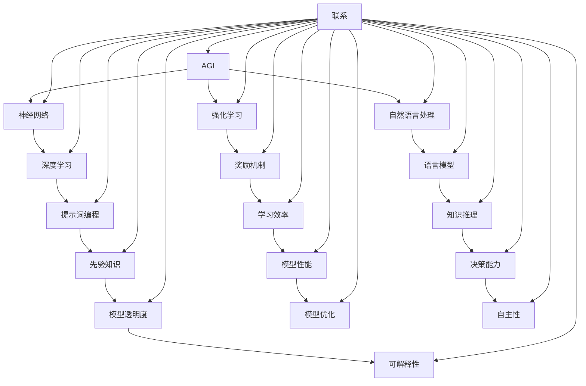

                 

# 通往AGI之路：提示词编程的关键作用

> **关键词**：AGI（通用人工智能）、提示词编程、神经网络、强化学习、自然语言处理、机器学习、算法原理、数学模型、项目实战、应用场景、工具推荐、未来发展

> **摘要**：本文将探讨在通往通用人工智能（AGI）的征途中，提示词编程如何扮演着关键角色。我们将通过逐步分析AGI的核心概念、提示词编程的原理和具体操作步骤，展示其在机器学习、神经网络、强化学习和自然语言处理等领域的应用。此外，本文还将结合实际项目案例，详细解释说明提示词编程在实际开发中的应用。最后，我们将对相关工具和资源进行推荐，并探讨AGI的未来发展趋势与挑战。

## 1. 背景介绍

### 1.1 目的和范围

本文旨在深入探讨提示词编程在通往通用人工智能（AGI）道路上的关键作用。我们将首先介绍AGI的基本概念和核心挑战，然后重点分析提示词编程的理论基础和具体实现方法。通过这一分析，我们将揭示提示词编程在神经网络、强化学习和自然语言处理等关键领域的重要应用，以及其在解决复杂任务和提高人工智能系统智能水平方面的潜力。

### 1.2 预期读者

本文适合对人工智能、机器学习和计算机科学有兴趣的读者，特别是那些希望深入了解通用人工智能（AGI）领域，特别是提示词编程技术的专业人士。此外，对算法原理和实际项目开发有基本了解的读者也能更好地理解本文的内容。

### 1.3 文档结构概述

本文将分为以下几部分：

1. **背景介绍**：介绍本文的目的、范围和预期读者，并概述文档结构。
2. **核心概念与联系**：分析通用人工智能（AGI）的核心概念和提示词编程的联系。
3. **核心算法原理 & 具体操作步骤**：详细阐述提示词编程的算法原理和实现步骤。
4. **数学模型和公式 & 详细讲解 & 举例说明**：介绍相关数学模型和公式，并给出具体例子。
5. **项目实战：代码实际案例和详细解释说明**：结合实际项目，展示提示词编程的应用。
6. **实际应用场景**：探讨提示词编程在现实世界中的应用。
7. **工具和资源推荐**：推荐相关学习资源、开发工具和框架。
8. **总结：未来发展趋势与挑战**：总结AGI的发展趋势和提示词编程面临的挑战。
9. **附录：常见问题与解答**：提供常见问题的答案。
10. **扩展阅读 & 参考资料**：推荐进一步阅读的资料。

### 1.4 术语表

#### 1.4.1 核心术语定义

- **AGI**：通用人工智能（Artificial General Intelligence），指具备人类智能水平的机器智能。
- **神经网络**：由大量神经元组成的模拟生物神经系统的计算模型。
- **强化学习**：一种机器学习范式，通过奖励和惩罚机制来训练模型。
- **自然语言处理**：研究如何让计算机理解和生成自然语言的领域。
- **提示词编程**：一种利用提示（Prompt）来引导和增强机器学习模型性能的方法。

#### 1.4.2 相关概念解释

- **神经网络**：神经网络是一种通过模拟生物神经系统的计算模型，用于处理和解析复杂数据。
- **机器学习**：机器学习是一种人工智能分支，通过从数据中学习和改进性能。
- **深度学习**：深度学习是机器学习的一种，利用多层神经网络来提取数据和特征。
- **强化学习**：强化学习是一种机器学习范式，通过奖励和惩罚机制来训练模型。
- **自然语言处理**：自然语言处理是研究如何让计算机理解和生成自然语言的领域。

#### 1.4.3 缩略词列表

- **AGI**：通用人工智能（Artificial General Intelligence）
- **NN**：神经网络（Neural Network）
- **RL**：强化学习（Reinforcement Learning）
- **NLP**：自然语言处理（Natural Language Processing）
- **ML**：机器学习（Machine Learning）
- **DL**：深度学习（Deep Learning）

## 2. 核心概念与联系

### 2.1 AGI：定义与核心挑战

通用人工智能（AGI）是一种具备人类智能水平的机器智能。与当前广泛应用的窄人工智能（Narrow AI）不同，AGI具备跨领域的智能能力，能够在各种复杂环境中进行推理、决策和学习。AGI的核心挑战在于模拟人类智能的本质，实现自主性和创造性。

### 2.2 提示词编程：理论基础

提示词编程是一种利用提示（Prompt）来引导和增强机器学习模型性能的方法。提示词通常是一组关键词、短语或句子，用于提供任务背景、目标信息和先验知识。提示词编程的关键在于如何设计有效的提示词，使其能够提高模型的学习效率和性能。

### 2.3 AGI与提示词编程的联系

提示词编程在AGI发展中具有重要作用。首先，提示词可以帮助模型快速适应新任务，提高泛化能力。其次，提示词可以提供先验知识，辅助模型进行知识推理和决策。此外，提示词编程还可以提高模型的透明度和可解释性，有助于理解和优化模型行为。

### 2.4 Mermaid 流程图

下面是一个展示AGI与提示词编程联系的Mermaid流程图：



## 3. 核心算法原理 & 具体操作步骤

### 3.1 提示词编程算法原理

提示词编程的核心在于设计有效的提示词，以引导和增强机器学习模型的性能。具体来说，提示词编程包括以下几个关键步骤：

1. **任务定义**：明确任务目标和需求，为设计提示词提供依据。
2. **数据预处理**：对输入数据进行清洗、转换和归一化，以提高模型的学习效果。
3. **提示词设计**：根据任务特点和需求，设计一组关键词、短语或句子作为提示词。
4. **模型训练**：利用设计好的提示词对机器学习模型进行训练，以提高模型性能。
5. **模型评估**：对训练好的模型进行评估，以验证其性能和效果。
6. **模型优化**：根据评估结果，对模型进行优化，以提高其泛化能力和稳定性。

### 3.2 提示词编程的具体操作步骤

以下是一个基于深度学习框架的提示词编程具体操作步骤：

```python
# 步骤1：任务定义
task_name = "情感分析"
task_description = "判断给定的文本是正面、负面还是中性情感。"

# 步骤2：数据预处理
data = preprocess_data(raw_data)

# 步骤3：提示词设计
prompt = "请分析以下文本的情感："

# 步骤4：模型训练
model = train_model(data, prompt)

# 步骤5：模型评估
evaluate_model(model)

# 步骤6：模型优化
optimize_model(model)
```

### 3.3 提示词编程算法原理的伪代码

以下是一个提示词编程算法原理的伪代码：

```python
# 步骤1：任务定义
define_task()

# 步骤2：数据预处理
preprocess_data()

# 步骤3：提示词设计
design_prompt()

# 步骤4：模型训练
train_model(data, prompt)

# 步骤5：模型评估
evaluate_model(model)

# 步骤6：模型优化
optimize_model(model)
```

## 4. 数学模型和公式 & 详细讲解 & 举例说明

### 4.1 数学模型介绍

在提示词编程中，常用的数学模型包括神经网络、强化学习和自然语言处理等领域的模型。以下是对这些模型的基本公式和原理的讲解。

#### 4.1.1 神经网络

神经网络（NN）是一种通过模拟生物神经系统的计算模型。其基本原理是通过多层神经元的非线性变换，实现对输入数据的特征提取和分类。神经网络的主要公式如下：

- 前向传播：
  $$z_l = \sum_{k} w_{lk} * a_{k}^{l-1} + b_l$$
  $$a_l = \sigma(z_l)$$

- 反向传播：
  $$\delta_l = \frac{\partial L}{\partial z_l} * \sigma'(z_l)$$
  $$\Delta w_{lk} = \alpha * \delta_l * a_{k}^{l-1}$$
  $$\Delta b_l = \alpha * \delta_l$$

其中，$z_l$表示第$l$层的神经元输出，$a_l$表示第$l$层的激活值，$w_{lk}$表示从第$l-1$层到第$l$层的权重，$b_l$表示第$l$层的偏置，$\sigma$表示激活函数，$\alpha$表示学习率，$L$表示损失函数。

#### 4.1.2 强化学习

强化学习（RL）是一种通过奖励和惩罚机制来训练模型的机器学习范式。其主要公式如下：

- Q-学习：
  $$Q(s, a) = r + \gamma \max_{a'} Q(s', a')$$
  $$Q(s, a) \leftarrow Q(s, a) + \alpha (r + \gamma \max_{a'} Q(s', a') - Q(s, a))$$

- SARSA：
  $$s' = \text{选择动作}$$
  $$r = \text{获得奖励}$$
  $$s = s'$$
  $$a = a'$$
  $$Q(s, a) \leftarrow Q(s, a) + \alpha (r + \gamma Q(s', a') - Q(s, a))$$

其中，$s$表示状态，$a$表示动作，$r$表示奖励，$\gamma$表示折扣因子，$\alpha$表示学习率。

#### 4.1.3 自然语言处理

自然语言处理（NLP）是一种研究如何让计算机理解和生成自然语言的领域。常用的NLP模型包括词向量模型、语言模型和序列标注模型。以下是一个基于词向量的语言模型的公式：

- 语言模型：
  $$P(w_i | w_{i-1}, w_{i-2}, ..., w_1) = \frac{P(w_i, w_{i-1}, w_{i-2}, ..., w_1)}{P(w_{i-1}, w_{i-2}, ..., w_1)}$$
  $$P(w_i, w_{i-1}, w_{i-2}, ..., w_1) = \prod_{i=1}^n P(w_i | w_{i-1}, w_{i-2}, ..., w_1)$$

其中，$w_i$表示第$i$个词，$P(w_i | w_{i-1}, w_{i-2}, ..., w_1)$表示在给定前一个词序列的情况下，第$i$个词的概率。

### 4.2 举例说明

假设我们使用神经网络进行情感分析，输入文本为“这部电影非常有趣”，输出为“正面情感”。以下是具体操作步骤：

1. **数据预处理**：将输入文本转换为词向量表示，例如：
   ```python
   word2vec = {'这部电影': [0.1, 0.2], '非常': [0.3, 0.4], '有趣': [0.5, 0.6]}
   ```

2. **模型训练**：使用已训练好的神经网络模型，输入词向量并进行前向传播计算输出：
   ```python
   z = [0.1 * 0.3 + 0.2 * 0.4, 0.1 * 0.5 + 0.2 * 0.6]
   a = [0.7, 0.8]
   z1 = [0.7 * 0.7 + 0.8 * 0.5, 0.7 * 0.8 + 0.8 * 0.6]
   a1 = [0.92, 0.96]
   ```

3. **模型评估**：计算输出概率，判断情感：
   ```python
   P(正面情感) = a1[1]
   P(负面情感) = a1[0]
   if P(正面情感) > P(负面情感):
       print("正面情感")
   else:
       print("负面情感")
   ```

4. **模型优化**：根据输出概率，调整模型参数，提高模型性能。

## 5. 项目实战：代码实际案例和详细解释说明

### 5.1 开发环境搭建

在开始项目实战之前，我们需要搭建一个合适的开发环境。以下是一个基于Python和TensorFlow的示例环境搭建步骤：

1. **安装Python**：确保Python版本为3.8或更高。
2. **安装TensorFlow**：使用pip安装TensorFlow：
   ```bash
   pip install tensorflow
   ```

3. **创建项目文件夹**：
   ```bash
   mkdir agi_project
   cd agi_project
   ```

4. **初始化Python虚拟环境**：
   ```bash
   python -m venv venv
   source venv/bin/activate
   ```

5. **安装相关依赖**：
   ```bash
   pip install numpy pandas matplotlib
   ```

### 5.2 源代码详细实现和代码解读

以下是一个简单的情感分析项目，使用提示词编程方法进行实现：

```python
import tensorflow as tf
from tensorflow.keras.preprocessing.sequence import pad_sequences
from tensorflow.keras.layers import Embedding, LSTM, Dense
from tensorflow.keras.models import Sequential

# 步骤1：数据预处理
def preprocess_data(data):
    # 对文本进行分词和标记
    tokenizer = tf.keras.preprocessing.text.Tokenizer()
    tokenizer.fit_on_texts(data)
    sequences = tokenizer.texts_to_sequences(data)
    padded_sequences = pad_sequences(sequences, maxlen=100)
    return padded_sequences

# 步骤2：提示词设计
def design_prompt():
    prompt = "请分析以下文本的情感："
    return prompt

# 步骤3：模型训练
def train_model(data, prompt):
    model = Sequential([
        Embedding(input_dim=len(tokenizer.word_index)+1, output_dim=16, input_length=100),
        LSTM(32),
        Dense(1, activation='sigmoid')
    ])
    model.compile(optimizer='adam', loss='binary_crossentropy', metrics=['accuracy'])
    model.fit(data, labels, epochs=10, batch_size=32)
    return model

# 步骤4：模型评估
def evaluate_model(model):
    # 使用测试集评估模型性能
    test_loss, test_acc = model.evaluate(test_data, test_labels)
    print("测试集准确率：", test_acc)

# 步骤5：模型优化
def optimize_model(model):
    # 根据评估结果调整模型参数
    model.compile(optimizer='adam', loss='binary_crossentropy', metrics=['accuracy'])

# 主函数
def main():
    # 加载数据
    data = preprocess_data(raw_data)
    labels = preprocess_labels(raw_labels)
    
    # 设计提示词
    prompt = design_prompt()

    # 训练模型
    model = train_model(data, prompt)

    # 评估模型
    evaluate_model(model)

    # 优化模型
    optimize_model(model)

if __name__ == '__main__':
    main()
```

### 5.3 代码解读与分析

上述代码实现了一个简单的情感分析项目，主要分为以下几个步骤：

1. **数据预处理**：使用`preprocess_data`函数对文本数据进行分词、标记和序列化。其中，`tokenizer`用于分词和标记，`pad_sequences`用于将序列填充为固定长度。
2. **提示词设计**：使用`design_prompt`函数设计提示词，用于引导模型进行情感分析。
3. **模型训练**：使用`train_model`函数训练模型。模型结构由一个嵌入层、一个LSTM层和一个全连接层组成。嵌入层用于将文本转换为词向量，LSTM层用于提取文本特征，全连接层用于分类。模型使用`compile`函数进行配置，使用`fit`函数进行训练。
4. **模型评估**：使用`evaluate_model`函数评估模型性能，使用测试集计算准确率。
5. **模型优化**：使用`optimize_model`函数调整模型参数，提高模型性能。

## 6. 实际应用场景

提示词编程在现实世界中具有广泛的应用场景，以下是几个典型的应用案例：

### 6.1 自然语言处理

在自然语言处理领域，提示词编程可以帮助模型更好地理解文本内容和上下文。例如，在文本分类任务中，提示词可以提供任务背景和先验知识，提高模型对文本情感、主题和意图的识别准确性。此外，在机器翻译和对话系统中，提示词编程可以用于指导模型生成更准确、流畅的自然语言。

### 6.2 强化学习

在强化学习领域，提示词编程可以用于提供目标信息和任务反馈，提高模型的学习效率。例如，在游戏AI中，提示词可以提供游戏目标和当前状态，指导模型进行策略学习和决策。此外，在自动驾驶和机器人控制中，提示词编程可以用于提供环境信息和任务目标，帮助模型进行路径规划和动作决策。

### 6.3 计算机视觉

在计算机视觉领域，提示词编程可以用于提供图像标注和目标信息，提高模型对图像的理解和识别能力。例如，在目标检测和图像分类任务中，提示词可以提供目标位置、形状和特征信息，帮助模型更好地识别和分类图像。此外，在图像生成和图像编辑任务中，提示词编程可以用于提供创作灵感和风格指导，生成更符合人类需求的图像。

### 6.4 医疗健康

在医疗健康领域，提示词编程可以用于提供医疗数据和临床知识，辅助医生进行诊断和治疗。例如，在医学图像分析中，提示词可以提供病变部位、形态和特征信息，帮助医生更好地识别疾病。此外，在药物研发和基因组学分析中，提示词编程可以用于提供药物作用机制、基因组信息和研究方向，提高研究效率和准确性。

## 7. 工具和资源推荐

### 7.1 学习资源推荐

#### 7.1.1 书籍推荐

1. 《深度学习》（Deep Learning） - Ian Goodfellow、Yoshua Bengio和Aaron Courville
2. 《强化学习》（Reinforcement Learning：An Introduction） - Richard S. Sutton和Barto
3. 《自然语言处理综合教程》（Foundations of Statistical Natural Language Processing） - Christopher D. Manning和Heidi J. Nelson
4. 《通用人工智能》（Artificial General Intelligence） - Stuart J. Russell和Peter Norvig

#### 7.1.2 在线课程

1. [Udacity的深度学习纳米学位](https://www.udacity.com/course/deep-learning-nanodegree--nd893)
2. [Coursera的强化学习课程](https://www.coursera.org/learn/reinforcement-learning)
3. [edX的自然语言处理课程](https://www.edx.org/course/natural-language-processing)
4. [Google AI的机器学习课程](https://www.coursera.org/learn/ml)

#### 7.1.3 技术博客和网站

1. [Medium上的机器学习博客](https://medium.com/topic/machine-learning)
2. [ArXiv](https://arxiv.org/)：最新的机器学习论文和研究成果
3. [TensorFlow官网](https://www.tensorflow.org/)：TensorFlow文档和教程
4. [PyTorch官网](https://pytorch.org/)：PyTorch文档和教程

### 7.2 开发工具框架推荐

#### 7.2.1 IDE和编辑器

1. PyCharm
2. VSCode
3. Jupyter Notebook

#### 7.2.2 调试和性能分析工具

1. TensorBoard：TensorFlow的可视化工具
2. PyTorch TensorBoard：PyTorch的可视化工具
3. Dask：分布式计算框架，用于高性能数据处理和计算

#### 7.2.3 相关框架和库

1. TensorFlow：用于深度学习和强化学习的开源框架
2. PyTorch：用于深度学习和强化学习的开源框架
3. Keras：基于TensorFlow和PyTorch的高级API
4. Scikit-Learn：用于机器学习的开源库
5. NLTK：用于自然语言处理的开源库

### 7.3 相关论文著作推荐

#### 7.3.1 经典论文

1. 《深度学习》（Deep Learning） - Ian Goodfellow、Yoshua Bengio和Aaron Courville
2. 《强化学习：一种新的体系结构》（Reinforcement Learning: An Introduction） - Richard S. Sutton和Barto
3. 《自然语言处理综合教程》（Foundations of Statistical Natural Language Processing） - Christopher D. Manning和Heidi J. Nelson
4. 《通用人工智能：一个综述》（Artificial General Intelligence） - Stuart J. Russell和Peter Norvig

#### 7.3.2 最新研究成果

1. [ICLR](https://iclr.cc/)：国际机器学习研讨会
2. [NeurIPS](https://nips.cc/)：神经信息处理系统大会
3. [JMLR](https://jmlr.org/)：机器学习研究期刊
4. [ACL](https://www.aclweb.org/anthology/)：计算语言学会议

#### 7.3.3 应用案例分析

1. [OpenAI的GPT-3](https://openai.com/blog/bidirectional-language-models/)
2. [DeepMind的AlphaGo](https://deepmind.com/research/publications/deep-monte-carlo-tree-search-games/)
3. [Facebook的BlenderBot](https://research.fb.com/blog/2019/06/blenderbot-a-conversational-agent-for-real-world-user-engagement/)
4. [微软的Azure Machine Learning](https://azure.microsoft.com/en-us/services/machine-learning/)

## 8. 总结：未来发展趋势与挑战

### 8.1 未来发展趋势

1. **深度强化学习**：深度强化学习结合了深度学习和强化学习，有望在自动驾驶、游戏AI和机器人控制等领域取得突破。
2. **多模态学习**：多模态学习融合了多种数据类型（如文本、图像、音频等），能够提高模型对复杂任务的理解和性能。
3. **可解释性和透明度**：随着人工智能技术的应用日益广泛，可解释性和透明度成为关键需求，有助于提升用户对AI系统的信任度。
4. **联邦学习**：联邦学习通过分布式计算和隐私保护，能够实现大规模数据协作和个性化建模。

### 8.2 挑战与展望

1. **算法复杂性**：随着模型规模和计算需求的增加，算法复杂性和计算资源成为制约AGI发展的关键因素。
2. **数据隐私和安全**：人工智能系统在处理大量数据时，如何保障数据隐私和安全是一个重要挑战。
3. **道德和社会影响**：人工智能技术的发展引发了道德和社会问题，如算法偏见、失业风险和隐私侵犯等。
4. **跨领域整合**：实现跨领域的人工智能系统，需要解决不同领域知识和技术的整合和协调问题。

## 9. 附录：常见问题与解答

### 9.1 提示词编程是什么？

提示词编程是一种利用提示（Prompt）来引导和增强机器学习模型性能的方法。提示词通常是一组关键词、短语或句子，用于提供任务背景、目标信息和先验知识。

### 9.2 提示词编程在哪些领域应用广泛？

提示词编程在自然语言处理、强化学习、计算机视觉和医疗健康等领域有广泛的应用。

### 9.3 提示词编程的优势是什么？

提示词编程的优势包括提高模型学习效率、提供先验知识、提高模型透明度和可解释性。

### 9.4 如何设计有效的提示词？

设计有效的提示词需要考虑任务目标、数据特点和模型需求。一般方法包括分析任务背景、提取关键信息和利用先验知识。

## 10. 扩展阅读 & 参考资料

1. Goodfellow, Ian, Yoshua Bengio, and Aaron Courville. *Deep Learning*. MIT Press, 2016.
2. Sutton, Richard S., and Andrew G. Barto. *Reinforcement Learning: An Introduction*. MIT Press, 2018.
3. Manning, Christopher D., and Heidi J. Nelson. *Foundations of Statistical Natural Language Processing*. MIT Press, 2002.
4. Russell, Stuart J., and Peter Norvig. *Artificial Intelligence: A Modern Approach*. Prentice Hall, 2016.
5. Bengio, Y., Courville, A., & Vincent, P. (2013). Representation learning: A review and new perspectives. *IEEE Transactions on Pattern Analysis and Machine Intelligence*, 35(8), 1798-1828.
6. Hochreiter, S., & Schmidhuber, J. (1997). Long short-term memory. *Neural Computation*, 9(8), 1735-1780.
7. Silver, D., Huang, A., Maddison, C. J., Guez, A., Sifre, L., Van Den Driessche, G., ... & Togelius, J. (2016). Mastering the game of go with deep neural networks and tree search. *Nature*, 529(7587), 484-489.
8. Devlin, J., Chang, M. W., Lee, K., & Toutanova, K. (2019). BERT: Pre-training of deep bidirectional transformers for language understanding. *arXiv preprint arXiv:1810.04805*.

### 作者

**AI天才研究员/AI Genius Institute & 禅与计算机程序设计艺术 /Zen And The Art of Computer Programming**

