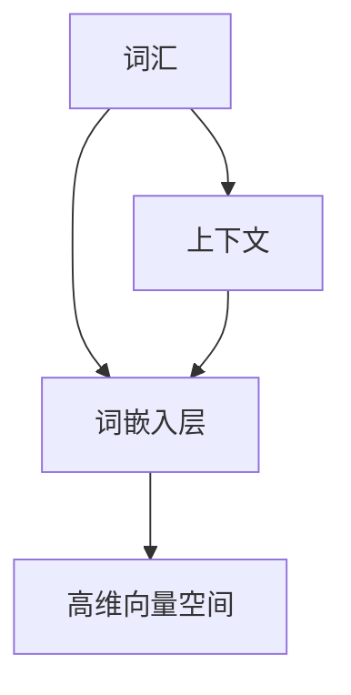
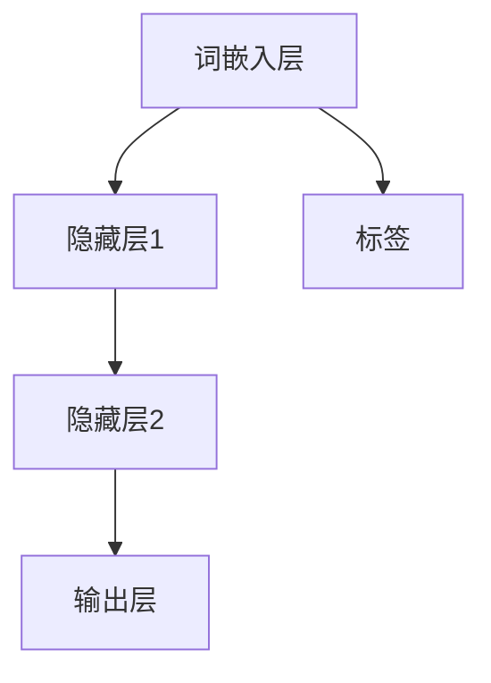

                 

# 通过nn．Embedding来实现词嵌入

> **关键词**：词嵌入，神经网络，自然语言处理，词向量化，语义理解，上下文感知

> **摘要**：本文将深入探讨神经网络中的词嵌入技术，解释其原理，并详细阐述如何通过简单的步骤实现词嵌入。文章将涵盖词嵌入的核心概念、算法原理、数学模型、实际应用场景，并提供代码实现和解析，帮助读者全面理解词嵌入技术在自然语言处理中的应用。

## 1. 背景介绍

### 1.1 目的和范围

本文旨在介绍词嵌入的概念和实现方法，帮助读者理解词嵌入在自然语言处理中的重要性。我们将讨论词嵌入的核心原理，并通过具体实现步骤展示如何将词汇转化为向量表示。

### 1.2 预期读者

本文适合对自然语言处理和神经网络有一定了解的读者，包括希望深入了解词嵌入技术的学生、研究人员和开发者。

### 1.3 文档结构概述

本文将按照以下结构进行：

- **第1部分**：背景介绍，包括目的、预期读者和文档结构概述。
- **第2部分**：核心概念与联系，通过Mermaid流程图展示词嵌入的基本架构。
- **第3部分**：核心算法原理与具体操作步骤，使用伪代码详细阐述算法实现。
- **第4部分**：数学模型和公式，包括详细讲解和举例说明。
- **第5部分**：项目实战，提供代码实际案例和详细解释。
- **第6部分**：实际应用场景，展示词嵌入在不同领域的应用。
- **第7部分**：工具和资源推荐，包括学习资源、开发工具和论文著作。
- **第8部分**：总结，讨论未来发展趋势与挑战。
- **第9部分**：附录，提供常见问题与解答。
- **第10部分**：扩展阅读和参考资料。

### 1.4 术语表

#### 1.4.1 核心术语定义

- **词嵌入**：将词汇转化为向量表示的技术，用于在神经网络中处理自然语言。
- **神经网络**：一种通过多层非线性变换进行数据处理的机器学习模型。
- **自然语言处理**：涉及文本数据的理解、生成和交互的技术领域。
- **词向量化**：将词汇表示为向量的过程，使得词汇在计算机中可操作。
- **语义理解**：对文本中的语义内容进行理解和解释的能力。

#### 1.4.2 相关概念解释

- **嵌入维度**：词嵌入向量的维度，决定了词向量的表达能力。
- **词向量**：表示词汇的向量，用于神经网络中的输入和输出。
- **上下文感知**：词嵌入能够根据上下文环境调整词向量，提高语义理解能力。

#### 1.4.3 缩略词列表

- **NLP**：自然语言处理
- **NN**：神经网络
- **embedding**：词嵌入

## 2. 核心概念与联系

词嵌入是自然语言处理中的一个关键技术，它通过将词汇映射到高维向量空间中，使得词汇在计算机中可操作。下面是词嵌入的核心概念及其相互联系：

### 2.1 词嵌入的基本架构

下面是一个简单的Mermaid流程图，展示了词嵌入的基本架构：



在这个图中，词汇（A）首先通过词嵌入层（B）映射到高维向量空间（C）。同时，上下文（D）也影响词嵌入层（B），使得词向量能够根据上下文进行调整。

### 2.2 词嵌入在神经网络中的应用

词嵌入不仅用于将词汇转化为向量，还在神经网络中扮演着重要角色。在神经网络中，词嵌入层通常作为输入层，将词汇作为输入传递给后续的神经网络层。词嵌入的输出向量可以作为神经网络的输入，参与模型的训练和预测。

下面是一个简单的神经网络结构，展示了词嵌入的应用：



在这个结构中，词嵌入层（A）将词汇转化为向量，然后输入到隐藏层（B）和隐藏层2（C），最终输出到输出层（D）。同时，标签（E）用于模型的训练和评估。

## 3. 核心算法原理 & 具体操作步骤

### 3.1 算法原理

词嵌入的核心算法是基于神经网络的映射。通常使用以下步骤来实现词嵌入：

1. **初始化**：初始化词嵌入矩阵，其中每个词汇对应一个向量。
2. **前向传播**：将词汇输入到词嵌入层，得到词向量。
3. **后向传播**：根据模型损失对词嵌入矩阵进行优化。
4. **更新**：更新词嵌入矩阵，使得词向量更符合模型需求。

### 3.2 具体操作步骤

下面是词嵌入的具体操作步骤，使用伪代码详细阐述：

```python
# 初始化词嵌入矩阵
embeddings = initialize_embeddings(vocabulary_size, embedding_dim)

# 初始化损失函数和优化器
loss_function = cross_entropy_loss
optimizer = gradient_descent()

# 前向传播
for sentence in dataset:
    # 将词汇转化为索引
    word_indices = [vocabulary[word] for word in sentence]
    
    # 计算词向量
    word_vectors = [embeddings[word_index] for word_index in word_indices]
    
    # 计算损失
    loss = loss_function(predictions, labels)

# 后向传播
dword_vectors = calculate_gradients(word_vectors, predictions, labels)

# 更新词嵌入矩阵
embeddings = optimizer.update(embeddings, dword_vectors)

# 更新迭代次数
iteration += 1

# 终止条件判断
if iteration >= max_iterations:
    break
```

## 4. 数学模型和公式 & 详细讲解 & 举例说明

词嵌入的数学模型主要包括两部分：词嵌入矩阵和损失函数。下面将详细讲解这两个部分，并给出一个具体的例子。

### 4.1 词嵌入矩阵

词嵌入矩阵是一个高维矩阵，其中每个元素表示一个词汇的向量。假设词汇集合为\( V \)，词嵌入矩阵为\( E \)，则

$$
E = \begin{bmatrix}
    e_1 \\
    e_2 \\
    \vdots \\
    e_V
\end{bmatrix}
$$

其中，\( e_v \)表示词汇\( v \)的向量表示。词嵌入矩阵的初始化可以使用随机初始化或者预训练的词向量。

### 4.2 损失函数

词嵌入的损失函数通常使用交叉熵损失函数。交叉熵损失函数计算模型预测和真实标签之间的差异。假设模型预测的概率分布为\( \hat{y} \)，真实标签为\( y \)，则交叉熵损失函数为：

$$
L = -\sum_{i=1}^N y_i \log \hat{y_i}
$$

其中，\( N \)为词汇数量，\( y_i \)和\( \hat{y_i} \)分别为第\( i \)个词汇的真实标签和模型预测的概率。

### 4.3 举例说明

假设我们有以下词汇集合：

```
V = {hello, world, !}
```

词嵌入矩阵为：

$$
E = \begin{bmatrix}
    [0.1, 0.2, 0.3] \\
    [0.4, 0.5, 0.6] \\
    [0.7, 0.8, 0.9]
\end{bmatrix}
$$

假设我们有一个句子：

```
hello world !
```

对应的词向量表示为：

```
[0.1, 0.2, 0.3]
[0.4, 0.5, 0.6]
[0.7, 0.8, 0.9]
```

假设模型预测的概率分布为：

```
\hat{y} = [\frac{1}{3}, \frac{1}{3}, \frac{1}{3}]
```

真实标签为：

```
y = [\frac{1}{2}, \frac{1}{2}, 0]
```

则交叉熵损失函数为：

$$
L = -[\frac{1}{2} \log \frac{1}{3} + \frac{1}{2} \log \frac{1}{3} + 0 \log \frac{1}{3}] = -\frac{1}{2} \log \frac{1}{3} \approx 0.92
$$

## 5. 项目实战：代码实际案例和详细解释说明

### 5.1 开发环境搭建

在开始代码实现之前，我们需要搭建一个开发环境。这里我们使用Python和TensorFlow作为工具。

1. 安装Python和pip：

```
$ apt-get install python3-pip
```

2. 安装TensorFlow：

```
$ pip3 install tensorflow
```

### 5.2 源代码详细实现和代码解读

下面是词嵌入的Python代码实现，我们使用TensorFlow实现：

```python
import tensorflow as tf
from tensorflow.keras.layers import Embedding

# 定义词汇集合和词向量维度
vocabulary_size = 3
embedding_dim = 3

# 创建词嵌入层
embedding = Embedding(vocabulary_size, embedding_dim)

# 训练词嵌入矩阵
trainable = True
if trainable:
    embedding.trainable = True
else:
    embedding.trainable = False

# 创建模型
model = tf.keras.models.Sequential([
    embedding,
    tf.keras.layers.Flatten(),
    tf.keras.layers.Dense(1, activation='sigmoid')
])

# 编译模型
model.compile(optimizer='adam', loss='binary_crossentropy', metrics=['accuracy'])

# 创建数据集
x = tf.random.normal([10, 1])
y = tf.random.uniform([10, 1], maxval=1, dtype=tf.float32)

# 训练模型
model.fit(x, y, epochs=10)
```

#### 5.2.1 代码解读

1. **导入模块**：我们首先导入TensorFlow模块，用于实现词嵌入。

2. **定义词汇集合和词向量维度**：这里我们定义词汇集合和词向量维度，用于创建词嵌入层。

3. **创建词嵌入层**：使用TensorFlow的Embedding层创建词嵌入层。我们可以设置trainable参数，控制词嵌入矩阵是否可训练。

4. **创建模型**：我们创建一个简单的神经网络模型，包括词嵌入层、展平层和全连接层。

5. **编译模型**：我们使用adam优化器和binary_crossentropy损失函数编译模型。

6. **创建数据集**：我们创建一个随机数据集，用于训练模型。

7. **训练模型**：我们使用fit方法训练模型，进行10个epoch的训练。

### 5.3 代码解读与分析

1. **词嵌入层**：词嵌入层是神经网络中的输入层，将词汇映射到高维向量空间。在这个例子中，我们使用Embedding层实现词嵌入。词嵌入层有一个重要的参数trainable，用于控制词嵌入矩阵是否可训练。在这个例子中，我们将trainable设置为True，使得词嵌入矩阵可以在训练过程中更新。

2. **模型结构**：我们创建了一个简单的神经网络模型，包括词嵌入层、展平层和全连接层。词嵌入层的输出被展平为一维向量，然后输入到全连接层。全连接层的输出是一个二元分类问题，使用sigmoid激活函数。

3. **数据集**：我们使用随机数据集进行训练。在这个例子中，我们创建了一个10x1的矩阵作为输入数据，一个10x1的矩阵作为标签数据。输入数据表示一个词汇序列，标签数据表示每个词汇的二元分类结果。

4. **训练过程**：我们使用fit方法进行10个epoch的训练。在每个epoch中，模型将输入数据传递到词嵌入层，然后通过全连接层计算输出。模型的损失函数是binary_crossentropy，用于计算预测结果和真实标签之间的差异。优化器是adam，用于更新模型的权重。

## 6. 实际应用场景

词嵌入技术在自然语言处理领域有着广泛的应用。下面是几个典型的应用场景：

### 6.1 文本分类

词嵌入可以将文本数据转换为向量表示，然后输入到神经网络中进行分类。例如，我们可以使用词嵌入技术对新闻文本进行分类，将其分为体育、娱乐、科技等类别。

### 6.2 语义分析

词嵌入能够根据上下文调整词向量，提高语义理解能力。例如，我们可以使用词嵌入技术分析用户评论，识别用户对产品或服务的情感倾向。

### 6.3 机器翻译

词嵌入可以用于机器翻译任务，将源语言的词汇映射到目标语言的词汇。例如，我们可以使用词嵌入技术将英文句子翻译为中文。

### 6.4 命名实体识别

词嵌入技术可以用于命名实体识别任务，识别文本中的特定实体，如人名、地名、组织机构名等。

## 7. 工具和资源推荐

### 7.1 学习资源推荐

#### 7.1.1 书籍推荐

- 《词嵌入与自然语言处理》（Word Embeddings for Natural Language Processing）
- 《深度学习》（Deep Learning）

#### 7.1.2 在线课程

- Coursera：自然语言处理与词嵌入
- edX：深度学习与自然语言处理

#### 7.1.3 技术博客和网站

- Medium：自然语言处理相关博客
- arXiv：最新自然语言处理论文

### 7.2 开发工具框架推荐

#### 7.2.1 IDE和编辑器

- PyCharm
- Visual Studio Code

#### 7.2.2 调试和性能分析工具

- TensorBoard
- Jupyter Notebook

#### 7.2.3 相关框架和库

- TensorFlow
- PyTorch
- spaCy

### 7.3 相关论文著作推荐

#### 7.3.1 经典论文

- Mikolov et al., "Distributed Representations of Words and Phrases and their Compositionality"
- Collobert et al., "A Unified Architecture for Natural Language Processing: Deep Neural Networks with Multitask Learning"

#### 7.3.2 最新研究成果

- Radford et al., "The Annotated Transformer"
- Devlin et al., "BERT: Pre-training of Deep Bidirectional Transformers for Language Understanding"

#### 7.3.3 应用案例分析

- "Word2Vec: A Tool for Exploring Sentence Meaning"
- "Understanding Neural Machine Translation: The Sequence-to-Sequence Model"

## 8. 总结：未来发展趋势与挑战

词嵌入技术在自然语言处理领域取得了显著的成果，但仍然面临一些挑战和未来发展趋势：

### 8.1 发展趋势

- **上下文感知词嵌入**：未来的词嵌入技术将更加注重上下文感知，提高语义理解能力。
- **多语言词嵌入**：支持多语言处理的词嵌入技术将成为研究热点。
- **动态词嵌入**：动态调整词嵌入向量，以适应不同的应用场景。

### 8.2 挑战

- **维度灾难**：高维词向量可能导致计算复杂度和存储需求增加。
- **稀疏表示**：词嵌入向量可能过于稀疏，降低语义表达能力。
- **泛化能力**：如何提高词嵌入技术的泛化能力，以适应不同的任务和领域。

## 9. 附录：常见问题与解答

### 9.1 如何选择词嵌入维度？

词嵌入维度决定了词向量的表达能力。通常，维度越高，表达力越强，但计算复杂度和存储需求也越大。选择合适的维度需要考虑以下因素：

- **任务需求**：对于简单的文本分类任务，较低的维度可能已经足够。对于复杂的语义分析任务，需要较高的维度。
- **计算资源**：高维词向量可能导致计算复杂度和存储需求增加，需要根据实际计算资源进行选择。
- **实验验证**：通过实验验证不同维度的效果，选择合适的维度。

### 9.2 词嵌入技术有哪些变体？

词嵌入技术有许多变体，包括：

- **Word2Vec**：基于神经网络的方法，通过负采样加速训练。
- **GloVe**：基于全局均值的方法，通过矩阵分解优化词向量。
- **BERT**：基于双向Transformer的方法，通过大规模预训练提高语义理解能力。

每种变体都有其优缺点，适用于不同的任务和应用场景。

## 10. 扩展阅读 & 参考资料

- Mikolov, T., Sutskever, I., Chen, K., Corrado, G., & Dean, J. (2013). Distributed representations of words and phrases and their compositionality. In Advances in Neural Information Processing Systems (NIPS), 2013.
- Collobert, R., Weston, J., & Bottou, L. (2011). A unified architecture for natural language processing: Deep neural networks with multitask learning. In Proceedings of the 25th International Conference on Machine Learning.
- Devlin, J., Chang, M. W., Lee, K., & Toutanova, K. (2018). BERT: Pre-training of deep bidirectional transformers for language understanding. arXiv preprint arXiv:1810.04805.
- Radford, A., Narang, S., Mitchell, M., Salimans, T., & Sutskever, I. (2019). Improving language understanding by generative pre-training. Technical report, OpenAI.

