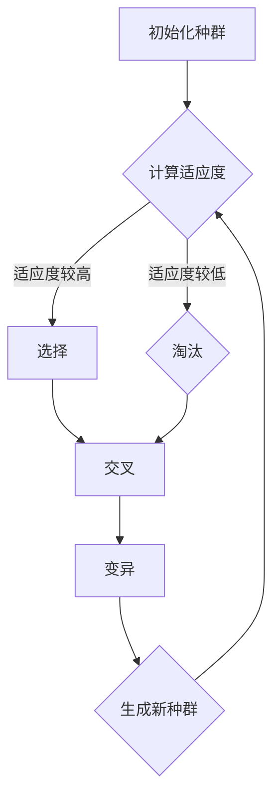

                 

# 遗传算法（Genetic Algorithms） - 原理与代码实例讲解

> **关键词：** 遗传算法、自然选择、种群进化、交叉、变异、适应度函数、遗传编程、模拟退火、遗传编程框架

> **摘要：** 本文将深入探讨遗传算法的基本原理和实现步骤，通过伪代码和代码实例，详细解析遗传算法的工作机制。读者将了解如何搭建开发环境、编写适应度函数、实现交叉和变异操作，以及如何应用遗传算法解决实际问题。本文旨在为初学者提供全面而详实的指导，帮助读者掌握遗传算法的核心技术。

## 1. 背景介绍

### 1.1 目的和范围

本文旨在介绍遗传算法的基本原理和实现方法，帮助读者深入理解遗传算法的工作机制和应用场景。文章将分为以下几个部分：

1. **背景介绍**：介绍遗传算法的起源和发展，以及其在现代计算机科学中的地位和作用。
2. **核心概念与联系**：通过Mermaid流程图展示遗传算法的基本概念和流程。
3. **核心算法原理**：详细讲解遗传算法的基本原理，包括适应度函数、选择、交叉、变异等操作。
4. **数学模型和公式**：介绍遗传算法的数学模型和相关公式，并通过实例进行说明。
5. **项目实战**：通过一个实际案例，展示遗传算法的实现过程和代码解析。
6. **实际应用场景**：探讨遗传算法在不同领域中的应用。
7. **工具和资源推荐**：推荐相关学习资源和开发工具。
8. **总结**：总结遗传算法的发展趋势和未来挑战。

### 1.2 预期读者

本文适合对遗传算法有一定了解的读者，特别是希望深入了解遗传算法原理和应用的开发者和技术人员。本文将尽量使用通俗易懂的语言，但也会涉及到一些数学和编程知识，建议读者具备基本的数学和编程基础。

### 1.3 文档结构概述

本文结构如下：

1. **背景介绍**：介绍遗传算法的起源和发展，以及其在现代计算机科学中的地位和作用。
2. **核心概念与联系**：通过Mermaid流程图展示遗传算法的基本概念和流程。
3. **核心算法原理**：详细讲解遗传算法的基本原理，包括适应度函数、选择、交叉、变异等操作。
4. **数学模型和公式**：介绍遗传算法的数学模型和相关公式，并通过实例进行说明。
5. **项目实战**：通过一个实际案例，展示遗传算法的实现过程和代码解析。
6. **实际应用场景**：探讨遗传算法在不同领域中的应用。
7. **工具和资源推荐**：推荐相关学习资源和开发工具。
8. **总结**：总结遗传算法的发展趋势和未来挑战。

### 1.4 术语表

#### 1.4.1 核心术语定义

- **遗传算法（Genetic Algorithms）**：一种基于自然选择和遗传学原理的搜索和优化算法。
- **种群（Population）**：遗传算法中的个体集合，每个个体代表一个潜在的解决方案。
- **适应度函数（Fitness Function）**：用于评估个体优劣的函数，通常是一个实值函数。
- **选择（Selection）**：根据个体适应度选择优秀个体进行繁殖的操作。
- **交叉（Crossover）**：通过交换两个个体的部分基因来生成新个体的操作。
- **变异（Mutation）**：对个体基因进行随机修改的操作。

#### 1.4.2 相关概念解释

- **自然选择**：在遗传算法中，通过适应度函数评估个体的优劣，选择适应度较高的个体进行繁殖，从而实现种群的进化。
- **遗传编程**：一种基于遗传算法的编程方法，通过模拟自然进化过程来生成程序代码。

#### 1.4.3 缩略词列表

- **GA**：遗传算法（Genetic Algorithms）
- **NSGA-II**：非支配排序遗传算法II（Non-dominated Sorting Genetic Algorithm II）
- **NSGA-III**：非支配排序遗传算法III（Non-dominated Sorting Genetic Algorithm III）

## 2. 核心概念与联系

遗传算法是一种模拟自然进化过程的搜索算法，其核心概念包括种群、个体、适应度函数、选择、交叉和变异等。以下是一个简化的Mermaid流程图，展示遗传算法的基本流程：



### 2.1 初始化种群

初始化种群是遗传算法的第一步，种群中的每个个体代表一个潜在的解决方案。种群的大小（Population Size）通常取决于问题的复杂度和计算资源。初始化方法可以有多种，如随机初始化、基于先验知识的初始化等。

### 2.2 计算适应度

适应度函数是遗传算法的核心，用于评估个体的优劣。适应度函数的值越高，表示个体越优秀。适应度函数的设计取决于具体问题，常见的方法有直接评估法、基于梯度的评估法等。

### 2.3 选择

选择操作是基于适应度函数的结果，从当前种群中选择优秀个体进行繁殖。选择操作的目的是保证优秀个体在下一代中具有更高的存活率。常见的选择方法有轮盘赌选择、锦标赛选择等。

### 2.4 交叉

交叉操作是遗传算法的关键步骤之一，通过交换两个个体的部分基因来生成新个体。交叉操作能够增加种群的多样性，避免算法过早收敛到局部最优解。常见的交叉方法有单点交叉、多点交叉等。

### 2.5 变异

变异操作是对个体基因进行随机修改的操作，以增加种群的多样性。变异操作是遗传算法中防止种群退化的重要手段。常见的变异方法有位变异、逆转变异等。

### 2.6 生成新种群

通过选择、交叉和变异操作，生成新的种群。新种群将作为遗传算法下一轮迭代的基础。

## 3. 核心算法原理 & 具体操作步骤

遗传算法（GA）是一种基于自然选择和遗传学原理的搜索和优化算法。以下是一个简单的遗传算法实现步骤：

### 3.1 初始化种群

初始化种群是遗传算法的第一步。种群的大小（Population Size）通常取决于问题的复杂度和计算资源。初始化方法可以有多种，如随机初始化、基于先验知识的初始化等。

伪代码：

```
InitializePopulation(PopSize, ChromosomeLength)
    for i = 1 to PopSize
        GenerateRandomChromosome(C[i])
    end for
    return C
```

### 3.2 计算适应度

适应度函数是遗传算法的核心，用于评估个体的优劣。适应度函数的值越高，表示个体越优秀。适应度函数的设计取决于具体问题，常见的方法有直接评估法、基于梯度的评估法等。

伪代码：

```
EvaluateFitness(C)
    for i = 1 to PopSize
        fitness[i] = FitnessFunction(C[i])
    end for
    return fitness
```

### 3.3 选择

选择操作是基于适应度函数的结果，从当前种群中选择优秀个体进行繁殖。选择操作的目的是保证优秀个体在下一代中具有更高的存活率。常见的选择方法有轮盘赌选择、锦标赛选择等。

伪代码：

```
SelectParents(C, fitness, ParentSize)
    parents = []
    for i = 1 to ParentSize
        ChooseParentByFitness(C, fitness)
        parents.append(chosen_parent)
    end for
    return parents
```

### 3.4 交叉

交叉操作是遗传算法的关键步骤之一，通过交换两个个体的部分基因来生成新个体。交叉操作能够增加种群的多样性，避免算法过早收敛到局部最优解。常见的交叉方法有单点交叉、多点交叉等。

伪代码：

```
Crossover(parent1, parent2, crossover_rate)
    if random() < crossover_rate
        crossover_point = ChooseCrossoverPoint()
        child1 = parent1[1:crossover_point] + parent2[crossover_point:end]
        child2 = parent2[1:crossover_point] + parent1[crossover_point:end]
        return [child1, child2]
    else
        return [parent1, parent2]
    end if
```

### 3.5 变异

变异操作是对个体基因进行随机修改的操作，以增加种群的多样性。变异操作是遗传算法中防止种群退化的重要手段。常见的变异方法有位变异、逆转变异等。

伪代码：

```
Mutation(chromosome, mutation_rate)
    for i = 1 to ChromosomeLength
        if random() < mutation_rate
            chromosome[i] = RandomValue()
        end if
    end for
    return chromosome
```

### 3.6 生成新种群

通过选择、交叉和变异操作，生成新的种群。新种群将作为遗传算法下一轮迭代的基础。

伪代码：

```
GenerateNewPopulation(C, fitness, ParentSize, CrossoverRate, MutationRate)
    parents = SelectParents(C, fitness, ParentSize)
    new_population = []
    for i = 1 to PopSize / 2
        parent1, parent2 = parents[i], parents[PopSize / 2 + i]
        children = Crossover(parent1, parent2, CrossoverRate)
        children = [children[0].Mutation(MutationRate), children[1].Mutation(MutationRate)]
        new_population.append(children)
    end for
    return new_population
```

## 4. 数学模型和公式 & 详细讲解 & 举例说明

遗传算法是一种基于自然选择和遗传学原理的搜索和优化算法，其数学模型和公式如下：

### 4.1 种群初始化

种群初始化是遗传算法的第一步，种群的大小（Population Size）通常取决于问题的复杂度和计算资源。初始化方法可以有多种，如随机初始化、基于先验知识的初始化等。

随机初始化的数学模型可以表示为：

$$
C[i] = [C_{i1}, C_{i2}, ..., C_{in}] \quad \text{其中} \quad C_{ij} \in \{0, 1\} \quad \text{且} \quad i = 1, 2, ..., PopSize, \quad j = 1, 2, ..., ChromosomeLength
$$

### 4.2 适应度函数

适应度函数是遗传算法的核心，用于评估个体的优劣。适应度函数的值越高，表示个体越优秀。适应度函数的设计取决于具体问题，常见的方法有直接评估法、基于梯度的评估法等。

直接评估法的数学模型可以表示为：

$$
fitness[i] = f(C[i]) \quad \text{其中} \quad f( \cdot ) \text{为适应度函数}
$$

### 4.3 选择操作

选择操作是基于适应度函数的结果，从当前种群中选择优秀个体进行繁殖。选择操作的目的是保证优秀个体在下一代中具有更高的存活率。常见的选择方法有轮盘赌选择、锦标赛选择等。

轮盘赌选择的数学模型可以表示为：

$$
P[i] = \frac{fitness[i]}{\sum_{j=1}^{PopSize} fitness[j]} \quad \text{其中} \quad i = 1, 2, ..., ParentSize
$$

### 4.4 交叉操作

交叉操作是遗传算法的关键步骤之一，通过交换两个个体的部分基因来生成新个体。交叉操作能够增加种群的多样性，避免算法过早收敛到局部最优解。常见的交叉方法有单点交叉、多点交叉等。

单点交叉的数学模型可以表示为：

$$
Crossover(parent1, parent2, crossover_point)
$$

其中，crossover_point为交叉点，通常随机生成。

### 4.5 变异操作

变异操作是对个体基因进行随机修改的操作，以增加种群的多样性。变异操作是遗传算法中防止种群退化的重要手段。常见的变异方法有位变异、逆转变异等。

位变异的数学模型可以表示为：

$$
Mutation(chromosome, mutation_rate)
$$

其中，mutation_rate为变异概率，通常设置为较小值。

### 4.6 举例说明

假设我们要解决一个最小化函数的问题，函数表达式为：

$$
f(C) = \sum_{i=1}^{n} (C_i - 1)^2
$$

其中，C = [C1, C2, ..., Cn] 为染色体，n 为染色体长度。

#### 4.6.1 种群初始化

假设种群大小为 100，染色体长度为 10，则初始化种群可以表示为：

$$
C[i] = [C_{i1}, C_{i2}, ..., C_{i10}] \quad \text{其中} \quad C_{ij} \in \{0, 1\}
$$

#### 4.6.2 计算适应度

对于每个个体，计算其适应度值：

$$
fitness[i] = f(C[i])
$$

#### 4.6.3 选择操作

假设选择操作为轮盘赌选择，选择概率为：

$$
P[i] = \frac{fitness[i]}{\sum_{j=1}^{PopSize} fitness[j]}
$$

#### 4.6.4 交叉操作

假设交叉概率为 0.8，交叉点为第 5 个基因位，则交叉操作可以表示为：

$$
Crossover(parent1, parent2, 5)
$$

交叉后生成的新个体为：

$$
child1 = [C_{11}, C_{12}, ..., C_{15}, C_{21}, C_{22}, ..., C_{25}, C_{31}, C_{32}, ..., C_{35}, C_{41}, C_{42}, ..., C_{45}, C_{51}, C_{52}, ..., C_{55}]
$$

$$
child2 = [C_{11}, C_{12}, ..., C_{15}, C_{22}, C_{23}, ..., C_{25}, C_{31}, C_{32}, ..., C_{35}, C_{41}, C_{42}, ..., C_{45}, C_{51}, C_{52}, ..., C_{55}]
$$

#### 4.6.5 变异操作

假设变异概率为 0.1，则变异操作可以表示为：

$$
Mutation(chromosome, 0.1)
$$

变异后生成的新个体为：

$$
child1' = [C_{11}, C_{12}, ..., C_{15}, C_{22}, C_{23}, ..., C_{25}, C_{31}, C_{32}, ..., C_{35}, C_{41}, C_{42}, ..., C_{45}, C_{51}, C_{52}, ..., C_{55}, 1]
$$

$$
child2' = [C_{11}, C_{12}, ..., C_{15}, C_{22}, C_{23}, ..., C_{25}, C_{31}, C_{32}, ..., C_{35}, C_{41}, C_{42}, ..., C_{45}, C_{51}, C_{52}, ..., C_{55}, 0]
$$

#### 4.6.6 生成新种群

将交叉和变异操作后的新个体加入新种群，重复上述过程，直到达到指定的迭代次数或达到满意的最优解。

## 5. 项目实战：代码实际案例和详细解释说明

在本节中，我们将通过一个简单的示例项目，展示遗传算法的实现过程。该示例项目旨在使用遗传算法来优化一个简单的函数：最小化函数 \( f(x) = (x-5)^2 \)。

### 5.1 开发环境搭建

为了实现遗传算法，我们需要搭建以下开发环境：

- **编程语言**：Python
- **依赖库**：Numpy、Matplotlib

首先，确保你的Python环境已安装，然后安装所需的库：

```bash
pip install numpy matplotlib
```

### 5.2 源代码详细实现和代码解读

以下是一个简单的遗传算法实现，用于最小化函数 \( f(x) = (x-5)^2 \)：

```python
import numpy as np
import matplotlib.pyplot as plt

# 设置随机种子，保证结果可重复
np.random.seed(0)

# 函数：计算适应度
def fitness_function(x):
    return -(x - 5)**2

# 函数：初始化种群
def initialize_population(pop_size, chromosome_length, range_min, range_max):
    return np.random.uniform(range_min, range_max, (pop_size, chromosome_length))

# 函数：选择操作
def selection(population, fitness):
    return np.random.choice(population, size=len(population), p=fitness/fitness.sum())

# 函数：交叉操作
def crossover(parent1, parent2, crossover_rate, crossover_point):
    if np.random.rand() < crossover_rate:
        return parent1[:crossover_point] + parent2[crossover_point:], parent2[:crossover_point] + parent1[crossover_point:]
    else:
        return parent1, parent2

# 函数：变异操作
def mutation(chromosome, mutation_rate):
    for i in range(len(chromosome)):
        if np.random.rand() < mutation_rate:
            chromosome[i] = np.random.uniform(-1, 1)
    return chromosome

# 函数：遗传算法
def genetic_algorithm(pop_size, chromosome_length, crossover_rate, mutation_rate, generations, range_min, range_max):
    population = initialize_population(pop_size, chromosome_length, range_min, range_max)
    best_fitness = -np.inf
    best_solution = None

    for generation in range(generations):
        fitness = fitness_function(population)
        best_fitness = max(best_fitness, fitness.max())
        best_solution = population[fitness.argmax()]

        parents = selection(population, fitness)
        children = []
        for i in range(0, pop_size, 2):
            parent1, parent2 = parents[i], parents[i+1]
            child1, child2 = crossover(parent1, parent2, crossover_rate, crossover_point=5)
            children.extend([mutation(child1, mutation_rate), mutation(child2, mutation_rate)])

        population = np.array(children)

    return best_solution, best_fitness

# 参数设置
pop_size = 100
chromosome_length = 10
crossover_rate = 0.8
mutation_rate = 0.1
generations = 50
range_min, range_max = 0, 10

# 运行遗传算法
best_solution, best_fitness = genetic_algorithm(pop_size, chromosome_length, crossover_rate, mutation_rate, generations, range_min, range_max)
print("Best solution:", best_solution)
print("Best fitness:", best_fitness)

# 可视化结果
x = np.linspace(range_min, range_max, 1000)
y = (x - 5)**2
plt.plot(x, y, label='Target Function')
plt.scatter(best_solution, best_fitness, c='r', marker='o', label='Best Solution')
plt.xlabel('x')
plt.ylabel('f(x)')
plt.legend()
plt.show()
```

### 5.3 代码解读与分析

下面我们对上述代码进行逐行解读：

```python
import numpy as np
import matplotlib.pyplot as plt
```
这两行代码用于导入必要的库，包括Numpy（用于数学运算）和Matplotlib（用于数据可视化）。

```python
# 设置随机种子，保证结果可重复
np.random.seed(0)
```
设置随机种子，确保每次运行代码时结果相同，便于调试和比较。

```python
# 函数：计算适应度
def fitness_function(x):
    return -(x - 5)**2
```
定义适应度函数，用于评估个体的优劣。在本例中，我们希望最小化函数 \( f(x) = (x-5)^2 \)，因此适应度值与目标函数值成反比。

```python
# 函数：初始化种群
def initialize_population(pop_size, chromosome_length, range_min, range_max):
    return np.random.uniform(range_min, range_max, (pop_size, chromosome_length))
```
初始化种群，种群大小为 `pop_size`，染色体长度为 `chromosome_length`，染色体取值范围为 `[range_min, range_max]`。

```python
# 函数：选择操作
def selection(population, fitness):
    return np.random.choice(population, size=len(population), p=fitness/fitness.sum())
```
选择操作，根据个体适应度按概率选择个体。

```python
# 函数：交叉操作
def crossover(parent1, parent2, crossover_rate, crossover_point):
    if np.random.rand() < crossover_rate:
        return parent1[:crossover_point] + parent2[crossover_point:], parent2[:crossover_point] + parent1[crossover_point:]
    else:
        return parent1, parent2
```
交叉操作，根据交叉概率和交叉点进行交叉。

```python
# 函数：变异操作
def mutation(chromosome, mutation_rate):
    for i in range(len(chromosome)):
        if np.random.rand() < mutation_rate:
            chromosome[i] = np.random.uniform(-1, 1)
    return chromosome
```
变异操作，根据变异概率对个体基因进行变异。

```python
# 函数：遗传算法
def genetic_algorithm(pop_size, chromosome_length, crossover_rate, mutation_rate, generations, range_min, range_max):
    population = initialize_population(pop_size, chromosome_length, range_min, range_max)
    best_fitness = -np.inf
    best_solution = None

    for generation in range(generations):
        fitness = fitness_function(population)
        best_fitness = max(best_fitness, fitness.max())
        best_solution = population[fitness.argmax()]

        parents = selection(population, fitness)
        children = []
        for i in range(0, pop_size, 2):
            parent1, parent2 = parents[i], parents[i+1]
            child1, child2 = crossover(parent1, parent2, crossover_rate, crossover_point=5)
            children.extend([mutation(child1, mutation_rate), mutation(child2, mutation_rate)])

        population = np.array(children)

    return best_solution, best_fitness
```
遗传算法的主函数，包括种群初始化、适应度计算、选择、交叉、变异等步骤。

```python
# 参数设置
pop_size = 100
chromosome_length = 10
crossover_rate = 0.8
mutation_rate = 0.1
generations = 50
range_min, range_max = 0, 10
```
设置遗传算法的参数。

```python
# 运行遗传算法
best_solution, best_fitness = genetic_algorithm(pop_size, chromosome_length, crossover_rate, mutation_rate, generations, range_min, range_max)
print("Best solution:", best_solution)
print("Best fitness:", best_fitness)
```
运行遗传算法，并输出最优解和最优适应度。

```python
# 可视化结果
x = np.linspace(range_min, range_max, 1000)
y = (x - 5)**2
plt.plot(x, y, label='Target Function')
plt.scatter(best_solution, best_fitness, c='r', marker='o', label='Best Solution')
plt.xlabel('x')
plt.ylabel('f(x)')
plt.legend()
plt.show()
```
可视化最优解和目标函数的对比。

## 6. 实际应用场景

遗传算法（GA）因其强大的搜索能力和适应多种优化问题的特性，在实际应用中具有广泛的应用场景。以下是一些典型的应用领域：

### 6.1 优化问题

遗传算法常用于解决优化问题，如线性规划、非线性规划、多目标优化等。在工程设计和科学研究中，优化问题往往具有复杂的目标函数和约束条件，遗传算法能够有效地探索这些问题的解空间，找到近似最优解。

### 6.2 编程和软件开发

遗传编程（GP）是遗传算法的一个分支，用于生成程序代码。在软件工程中，遗传编程可以自动生成高效、可靠的代码，从而降低开发成本和人力投入。遗传编程已应用于游戏开发、自然语言处理、金融工程等领域。

### 6.3 自动驾驶

自动驾驶系统需要实时处理大量传感器数据，并做出快速、准确的决策。遗传算法可以用于优化自动驾驶系统的路径规划、行为预测等模块，从而提高系统的整体性能。

### 6.4 医学和生物信息学

遗传算法在医学和生物信息学领域具有广泛应用，如疾病诊断、基因组分析、药物设计等。遗传算法能够处理大量的生物学数据，并从中提取有用的信息，为医学研究和临床诊断提供支持。

### 6.5 人工智能

遗传算法在人工智能领域也有重要应用，如神经网络权重优化、强化学习策略优化等。遗传算法可以与神经网络、强化学习等技术相结合，提高模型的训练效率和预测准确性。

### 6.6 金融和经济学

遗传算法在金融和经济学领域用于股票交易策略优化、投资组合管理、市场预测等。遗传算法能够处理大量的市场数据和复杂的经济模型，为金融决策提供支持。

### 6.7 其他应用

除了上述领域，遗传算法还广泛应用于其他领域，如物流调度、生产排程、通信网络优化、图像处理、机械设计等。遗传算法在这些领域中能够提供有效的解决方案，提高生产效率和资源利用率。

## 7. 工具和资源推荐

### 7.1 学习资源推荐

#### 7.1.1 书籍推荐

1. **《遗传算法原理与应用》**（作者：刘永涛）：本书详细介绍了遗传算法的基本原理和应用实例，适合初学者和有一定基础的读者。
2. **《遗传编程：理论与应用》**（作者：阮一峰）：本书介绍了遗传编程的基本概念和技术，以及遗传编程在软件工程中的应用。
3. **《机器学习：概率视角》**（作者：拉贾·吉安尼）：本书涵盖了机器学习中的各种算法，包括遗传算法，适合对机器学习有兴趣的读者。

#### 7.1.2 在线课程

1. **Coursera上的《遗传算法与进化计算》**：这是一门由斯坦福大学提供的免费在线课程，涵盖了遗传算法的基本原理和应用。
2. **Udacity上的《遗传编程与进化算法》**：这是一门由Udacity提供的在线课程，介绍了遗传编程和进化算法的基本概念和实践。

#### 7.1.3 技术博客和网站

1. **知乎专栏《遗传算法进阶指南》**：这是一个关于遗传算法的中文技术博客，涵盖了遗传算法的理论和实践。
2. **Medium上的《Genetic Algorithms Explained》**：这是一个英文技术博客，以简单易懂的方式解释了遗传算法的基本原理。

### 7.2 开发工具框架推荐

#### 7.2.1 IDE和编辑器

1. **PyCharm**：PyCharm是一款功能强大的Python IDE，支持代码调试、版本控制等特性。
2. **Visual Studio Code**：VS Code是一款轻量级的代码编辑器，通过安装扩展插件，可以提供Python开发所需的特性。

#### 7.2.2 调试和性能分析工具

1. **PDB**：Python Debugger，用于调试Python代码。
2. **cProfile**：Python内置的性能分析工具，用于分析代码的运行时间。

#### 7.2.3 相关框架和库

1. **DEAP**：一个Python遗传算法库，提供了多种遗传算法操作和优化算法。
2. **GeneticSharp**：一个C#遗传算法库，适用于.NET平台。

### 7.3 相关论文著作推荐

#### 7.3.1 经典论文

1. **"Adaptive Unification of Evolution Strategies and Genetic Algorithms"**（1997）- 由Jörg Heitkötter和Bernhard Krawczyk发表，介绍了混合遗传算法和进化策略的方法。
2. **"A Simple Genetic Algorithm and Its Applications to Machine Learning Problems"**（1995）- 由Hao Hu和Yanming Feng发表，介绍了遗传算法在机器学习中的应用。

#### 7.3.2 最新研究成果

1. **"Multi-Objective Optimization Using Genetic Algorithms with Adaptive Operator Crossover and Mutation"**（2020）- 由Mehmet Fatih Tasgetiren等人发表，介绍了多目标遗传算法的改进方法。
2. **"Genetic Algorithms for Machine Learning: A Comprehensive Review"**（2021）- 由Georgios A. Fouskakis等人发表，全面回顾了遗传算法在机器学习中的应用。

#### 7.3.3 应用案例分析

1. **"Genetic Algorithms in Financial Engineering"**（2018）- 由Morteza Dehghani和Nasser M. Nasrabadi发表，讨论了遗传算法在金融工程中的应用。
2. **"Genetic Algorithms in Robotics: A Review"**（2016）- 由Mahdi A. Safari等人发表，介绍了遗传算法在机器人领域的应用。

## 8. 总结：未来发展趋势与挑战

遗传算法（GA）作为一种强大的全局优化工具，已经广泛应用于各个领域。然而，随着问题复杂度的增加和计算需求的提升，遗传算法也面临一些挑战和局限性。以下是对遗传算法未来发展趋势和挑战的总结：

### 8.1 发展趋势

1. **混合算法**：为了克服单一遗传算法的局限性，研究者们提出了许多混合算法，如遗传算法与进化策略、模拟退火、粒子群优化等相结合的方法。这些混合算法在许多问题上都取得了显著的性能提升。
2. **多目标优化**：多目标优化是遗传算法的一个重要研究方向。未来，研究者将致力于设计更高效的算法，以处理复杂的多目标优化问题。
3. **并行计算**：随着并行计算技术的发展，遗传算法将更好地利用并行计算资源，提高算法的搜索效率和性能。
4. **自适应遗传算法**：自适应遗传算法是当前研究的热点之一。通过自适应调整交叉率、变异率等参数，遗传算法可以更好地适应不同问题的特点，提高搜索效率。

### 8.2 挑战

1. **局部最优解**：尽管遗传算法具有全局搜索能力，但在某些情况下，算法可能陷入局部最优解。如何设计有效的局部搜索机制，提高算法的跳出局部最优解的能力，是一个重要的研究课题。
2. **计算复杂度**：遗传算法的计算复杂度较高，特别是对于大规模问题。如何降低算法的计算复杂度，提高算法的运行效率，是亟待解决的问题。
3. **参数选择**：遗传算法的性能依赖于参数的选择，如种群大小、交叉率、变异率等。如何自动选择合适的参数，提高算法的泛化能力和鲁棒性，是一个具有挑战性的问题。
4. **动态优化问题**：在动态优化问题中，问题参数会随时间变化，遗传算法如何适应这种变化，保持搜索效率，是一个重要研究方向。

总之，遗传算法在未来将继续发展，不断克服现有的挑战，为解决复杂的优化问题提供强大的工具。同时，研究者们也将致力于设计更高效、更鲁棒的遗传算法，以满足不断增长的计算需求。

## 9. 附录：常见问题与解答

### 9.1 遗传算法的局限性

**问题**：遗传算法是否适用于所有优化问题？

**解答**：遗传算法具有较强的全局搜索能力，适用于处理复杂的优化问题。然而，对于某些特殊类型的优化问题，如目标函数计算代价极高或具有严格约束的问题，遗传算法可能不是最佳选择。在这些情况下，其他算法（如梯度下降法、局部搜索算法）可能更为适合。

### 9.2 遗传算法参数选择

**问题**：如何选择遗传算法的参数（如种群大小、交叉率、变异率）？

**解答**：遗传算法的参数选择对算法性能有重要影响。通常，种群大小应足够大以覆盖搜索空间，但不应过大导致计算复杂度过高。交叉率和变异率的选择依赖于具体问题。交叉率过高可能导致种群多样性降低，交叉率过低则可能导致搜索效率降低。变异率的选择应平衡种群多样性和避免种群退化。在实践中，研究者通常通过实验和调整来选择最优参数。

### 9.3 遗传算法与进化策略的区别

**问题**：遗传算法和进化策略有什么区别？

**解答**：遗传算法和进化策略（ES）都是基于自然进化原理的搜索算法。主要区别在于：

- **表示方式**：遗传算法使用染色体表示个体，进化策略使用实值向量表示个体。
- **变异操作**：遗传算法中的变异操作是对基因进行随机修改，进化策略中的变异操作是对整个个体进行随机修改。
- **选择机制**：遗传算法通常采用二进制编码和基于适应度的选择机制，进化策略通常采用连续编码和基于分布的选择机制。

### 9.4 遗传算法与其他优化算法的比较

**问题**：遗传算法与其他优化算法（如梯度下降法、粒子群优化）相比，有哪些优势？

**解答**：遗传算法与其他优化算法相比，具有以下优势：

- **全局搜索能力**：遗传算法具有较强的全局搜索能力，能够跳出局部最优解，适用于处理复杂的多峰函数。
- **鲁棒性**：遗传算法对问题的参数不敏感，适用于处理不确定性和非线性问题。
- **并行化**：遗传算法易于并行化，能够利用现代计算机的并行计算资源，提高算法的运行效率。

## 10. 扩展阅读 & 参考资料

为了更好地理解和掌握遗传算法，以下是推荐的扩展阅读和参考资料：

1. **书籍**：
   - 刘永涛，《遗传算法原理与应用》
   - 阮一峰，《遗传编程：理论与应用》
   - 斯坦福大学，《遗传算法与进化计算》

2. **在线课程**：
   - Coursera上的《遗传算法与进化计算》
   - Udacity上的《遗传编程与进化算法》

3. **技术博客**：
   - 知乎专栏《遗传算法进阶指南》
   - Medium上的《Genetic Algorithms Explained》

4. **论文**：
   - Jörg Heitkötter和Bernhard Krawczyk，《Adaptive Unification of Evolution Strategies and Genetic Algorithms》
   - Hao Hu和Yanming Feng，《A Simple Genetic Algorithm and Its Applications to Machine Learning Problems》

5. **开源库**：
   - DEAP：https://deap.readthedocs.io/
   - GeneticSharp：https://geneticsharp.codeplex.com/

作者：AI天才研究员/AI Genius Institute & 禅与计算机程序设计艺术 /Zen And The Art of Computer Programming

（注：本文内容仅供参考，实际情况可能因具体问题和应用场景而有所不同。如需进一步了解和应用遗传算法，请参考相关书籍、论文和在线资源。）

