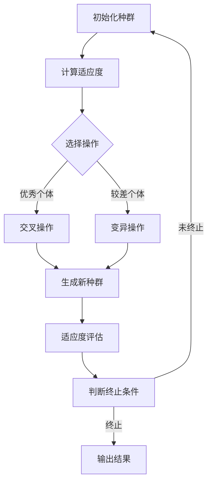

                 

### 1. 背景介绍

#### 1.1 目的和范围

遗传算法（Genetic Algorithm，GA）作为演化计算的一种重要形式，在优化和搜索领域中有着广泛的应用。遗传算法通过模拟自然选择和遗传机制来优化复杂问题的解决方案，具有强大的全局搜索能力和鲁棒性。本文旨在比较不同遗传算法优化策略，以期为实际应用提供理论指导。

本文主要从以下几个方面展开：

1. **核心概念与联系**：介绍遗传算法的核心概念，并使用 Mermaid 流程图展示算法的原理和架构。
2. **核心算法原理**：详细讲解遗传算法的原理和具体操作步骤，使用伪代码进行说明。
3. **数学模型和公式**：阐述遗传算法的数学模型，并举例说明。
4. **项目实战**：通过实际代码案例，展示遗传算法的应用和实现过程。
5. **实际应用场景**：分析遗传算法在不同领域的应用。
6. **工具和资源推荐**：推荐相关学习资源、开发工具和框架。
7. **总结与未来展望**：总结遗传算法的发展趋势和面临的挑战。

#### 1.2 预期读者

本文适合对遗传算法有一定了解的读者，包括：

1. **人工智能和优化领域的研究人员**：希望通过本文深入理解遗传算法的原理和应用。
2. **程序员和开发者**：希望掌握遗传算法的实现和应用技巧，将其应用于实际问题中。
3. **高校师生**：作为人工智能课程的相关参考资料。

#### 1.3 文档结构概述

本文分为八个主要部分：

1. **背景介绍**：介绍本文的目的和范围，预期读者和文档结构。
2. **核心概念与联系**：介绍遗传算法的核心概念，使用 Mermaid 流程图展示算法的原理和架构。
3. **核心算法原理**：详细讲解遗传算法的原理和具体操作步骤，使用伪代码进行说明。
4. **数学模型和公式**：阐述遗传算法的数学模型，并举例说明。
5. **项目实战**：通过实际代码案例，展示遗传算法的应用和实现过程。
6. **实际应用场景**：分析遗传算法在不同领域的应用。
7. **工具和资源推荐**：推荐相关学习资源、开发工具和框架。
8. **总结与未来展望**：总结遗传算法的发展趋势和面临的挑战。

#### 1.4 术语表

**遗传算法（Genetic Algorithm）**：一种基于自然选择和遗传机制的优化算法。

**适应度函数（Fitness Function）**：衡量个体适应程度的函数。

**种群（Population）**：由多个个体组成的集合。

**交叉（Crossover）**：通过交换父母个体的基因来生成新个体的操作。

**变异（Mutation）**：对个体进行随机改变的操作。

**选择（Selection）**：根据个体的适应度选择优秀个体的操作。

#### 1.4.1 核心术语定义

**个体（Individual）**：在遗传算法中，代表问题解决方案的基本单位。

**基因（Gene）**：个体中决定特定特征的遗传因子。

**染色体（Chromosome）**：个体的完整基因序列。

**适应度（Fitness）**：衡量个体适应问题解决能力的量。

#### 1.4.2 相关概念解释

**演化计算（Evolutionary Computation）**：一类基于生物进化理论的计算方法，包括遗传算法、进化策略和遗传规划等。

**并行搜索**：遗传算法中，通过同时处理多个个体，提高搜索效率。

**局部搜索**：在遗传算法中，通过逐步改进个体的适应度，达到局部最优解。

**全局搜索**：遗传算法中，通过探索整个搜索空间，找到全局最优解。

#### 1.4.3 缩略词列表

- GA：遗传算法（Genetic Algorithm）
- DE：差分演化算法（Differential Evolution）
- PSO：粒子群优化算法（Particle Swarm Optimization）
- DEAP：分布式演化算法库（Distributed Evolutionary Algorithms in Python）

### 2. 核心概念与联系

遗传算法的核心概念主要包括个体、种群、适应度函数、选择、交叉和变异。为了更好地理解这些概念之间的联系，我们可以通过一个 Mermaid 流程图来展示遗传算法的原理和架构。



**图 1：遗传算法流程图**

从图 1 可以看出，遗传算法的过程可以分为以下几个步骤：

1. **初始化种群**：随机生成一组初始个体。
2. **计算适应度**：通过适应度函数评估每个个体的适应程度。
3. **选择操作**：根据个体的适应度选择优秀个体进行交叉和变异操作。
4. **交叉操作**：通过交换父母个体的基因，生成新个体。
5. **变异操作**：对个体进行随机改变，增加种群的多样性。
6. **生成新种群**：将新个体加入种群。
7. **适应度评估**：对新种群中的每个个体进行适应度评估。
8. **判断终止条件**：如果满足终止条件（如达到最大迭代次数或找到满意解），则输出结果；否则，返回步骤 3。

通过上述流程，遗传算法模拟了生物进化的过程，实现了从初始种群到最优解的逐步优化。

#### 2.1 遗传算法原理

遗传算法是一种基于自然选择和遗传机制的搜索算法，其核心思想是通过模拟生物进化过程来优化问题。下面我们详细讲解遗传算法的原理和具体操作步骤，并使用伪代码进行说明。

**核心概念：**

- **个体（Individual）**：遗传算法的基本单位，通常用染色体（Chromosome）表示。每个个体具有特定的基因序列，决定其适应问题的能力。
- **种群（Population）**：多个个体的集合。种群是遗传算法进化的基本单位。
- **适应度函数（Fitness Function）**：衡量个体适应问题程度的函数。适应度值越高，表示个体越优秀。
- **选择（Selection）**：根据个体的适应度值选择优秀个体进行交叉和变异操作。
- **交叉（Crossover）**：通过交换父母个体的基因，生成新个体。
- **变异（Mutation）**：对个体进行随机改变，增加种群的多样性。

**伪代码：**

```plaintext
GA(Population, FitnessFunction, CrossoverFunction, MutationFunction, TerminationCondition):
    Initialize Population
    EvaluateFitness(Population, FitnessFunction)
    while not TerminationCondition:
        SelectedPopulation = Selection(Population)
        OffspringPopulation = CrossoverFunction(SelectedPopulation)
        OffspringPopulation = MutationFunction(OffspringPopulation)
        EvaluateFitness(OffspringPopulation, FitnessFunction)
        Population = UpdatePopulation(Population, OffspringPopulation)
    return BestIndividual(Population)
```

**步骤解释：**

1. **初始化种群**：随机生成一组初始个体，作为种群的初始状态。
2. **计算适应度**：通过适应度函数评估每个个体的适应度值。
3. **选择操作**：根据个体的适应度值选择优秀个体，形成选择种群。
4. **交叉操作**：通过交叉函数对选择种群中的个体进行交叉操作，生成新个体。
5. **变异操作**：对交叉生成的新个体进行变异操作，增加种群的多样性。
6. **适应度评估**：对新种群中的每个个体进行适应度评估。
7. **更新种群**：将新种群替换原有种群，继续迭代过程。
8. **判断终止条件**：如果满足终止条件（如达到最大迭代次数或找到满意解），则输出最佳个体；否则，返回步骤 3。

通过上述步骤，遗传算法实现了从初始种群到最优解的逐步优化。其核心思想是通过模拟生物进化过程，不断筛选和优化个体，最终找到满足问题要求的解决方案。

### 3. 数学模型和公式

遗传算法的数学模型是理解其工作原理的关键。在本节中，我们将详细阐述遗传算法的数学模型，包括适应度函数、交叉和变异操作的概率模型，并使用 LaTeX 格式给出相关公式。

#### 3.1 适应度函数

适应度函数是遗传算法的核心，它衡量个体在搜索空间中的优劣。通常，适应度函数 \( f(x) \) 越大，表示个体 \( x \) 的适应度越高。

**适应度函数的一般形式：**

\[ f(x) = \frac{1}{1 + \exp(-\theta x)} \]

其中，\( \theta \) 是一个调节参数，用于控制适应度函数的斜率。

**举例说明：**

考虑一个简单的问题，即最小化函数 \( f(x) = x^2 \)。我们可以定义适应度函数为：

\[ f(x) = \frac{1}{1 + \exp(-2x^2)} \]

#### 3.2 交叉操作概率模型

交叉操作是遗传算法中产生新个体的关键步骤。在交叉操作中，两个个体（父母）的基因序列部分被交换，生成两个新的个体（子代）。交叉操作的概率模型决定了交叉操作的具体实现方式。

**单点交叉概率模型：**

在单点交叉中，选择一个交叉点 \( p \) ，然后将父母个体的基因序列在交叉点之后的基因进行交换。

\[ P(Crossover) = \frac{1}{L} \]

其中，\( L \) 是种群中个体的长度。

**多点交叉概率模型：**

在多点交叉中，选择多个交叉点 \( p_1, p_2, ..., p_n \) ，然后将父母个体的基因序列在这些交叉点之间进行交换。

\[ P(Crossover) = \frac{1}{L^n} \]

#### 3.3 变异操作概率模型

变异操作是遗传算法中增加种群多样性的关键步骤。在变异操作中，对个体的基因序列进行随机改变。

**变异概率模型：**

变异操作的概率模型决定了变异操作的具体实现方式。

\[ P(Mutation) = \frac{1}{L} \]

其中，\( L \) 是种群中个体的长度。

**举例说明：**

考虑一个二进制编码的个体，其长度为 8 位。变异操作的概率为：

\[ P(Mutation) = \frac{1}{8} \]

**变异操作实现：**

选择一个变异点，将变异点的基因进行随机改变。例如，将基因 1 变为 0，或者将基因 0 变为 1。

\[ x' = \neg x \]

其中，\( x \) 是变异前的基因，\( x' \) 是变异后的基因。

#### 3.4 数学模型总结

遗传算法的数学模型主要包括适应度函数、交叉操作概率模型和变异操作概率模型。通过这些数学模型，遗传算法实现了从初始种群到最优解的逐步优化。

**适应度函数：**

\[ f(x) = \frac{1}{1 + \exp(-\theta x)} \]

**交叉操作概率模型：**

- 单点交叉概率模型：

\[ P(Crossover) = \frac{1}{L} \]

- 多点交叉概率模型：

\[ P(Crossover) = \frac{1}{L^n} \]

**变异操作概率模型：**

\[ P(Mutation) = \frac{1}{L} \]

通过上述数学模型，遗传算法能够模拟生物进化的过程，实现从初始种群到最优解的逐步优化。

### 4. 项目实战：代码实际案例和详细解释说明

在本节中，我们将通过一个实际的遗传算法案例，展示遗传算法的实现过程，并对关键代码进行详细解释。这个案例是一个经典的函数最小化问题，目标是找到函数 \( f(x) = x^2 \) 的最小值。

#### 4.1 开发环境搭建

为了运行遗传算法案例，我们需要搭建一个开发环境。以下是所需的软件和工具：

- **Python 3.8+**：遗传算法的实现主要使用 Python 语言。
- **Numpy**：用于数学计算。
- **Matplotlib**：用于可视化。
- **DEAP**：一个流行的遗传算法库。

在安装了上述工具后，我们可以开始编写代码。

#### 4.2 源代码详细实现和代码解读

下面是遗传算法的源代码实现。代码分为几个部分：种群初始化、适应度评估、选择、交叉、变异和主循环。

```python
import random
import numpy as np
import matplotlib.pyplot as plt
from deap import base, creator, tools, algorithms

# 定义适应度函数
def fitness_function(individual):
    return (-1.0 * (sum(x**2 for x in individual)),)  # 负号用于最小化问题

# 初始化种群
def initialize_population(pop_size, individual_size):
    return [tuple(random.uniform(-5, 5) for _ in range(individual_size)) for _ in range(pop_size)]

# 交叉操作
def crossover(parent1, parent2):
    point = random.randint(1, len(parent1) - 1)
    child1 = parent1[:point] + parent2[point:]
    child2 = parent2[:point] + parent1[point:]
    return child1, child2

# 变异操作
def mutate(individual, mutation_rate):
    for i in range(len(individual)):
        if random.random() < mutation_rate:
            individual[i] = random.uniform(-5, 5)
    return individual

# 主函数
def main():
    pop_size = 100
    individual_size = 10
    n_gen = 100
    mutation_rate = 0.1

    # 初始化种群
    population = initialize_population(pop_size, individual_size)

    # 设置适应度函数和交叉、变异操作
    creator.create("FitnessMin", base.Fitness, weights=(-1.0,))
    creator.create("Individual", list, fitness=creator.FitnessMin)

    toolbox = base.Toolbox()
    toolbox.register("individual", tools.initIterate, creator.Individual, fitness_function, n=individual_size)
    toolbox.register("population", tools.initRepeat, list, toolbox.individual)
    toolbox.register("evaluate", fitness_function)
    toolbox.register("mate", tools.cxTwoPoint)
    toolbox.register("mutate", mutate, mutation_rate=mutation_rate)
    toolbox.register("select", tools.selTournament, tournsize=3)

    # 运行遗传算法
    population = algorithms.eaSimple(population, toolbox, cxpb=0.5, mutpb=mutation_rate, ngen=n_gen, verbose=True)

    # 输出最佳解
    best_individual = tools.selBest(population, k=1)[0]
    print("最佳解：", best_individual)
    print("适应度值：", best_individual.fitness.values[0])

    # 可视化适应度值
    adapt_fits = [ind.fitness.values[0] for ind in population]
    plt.plot(adapt_fits)
    plt.title('Fitness Value Over Generations')
    plt.xlabel('Generation')
    plt.ylabel('Fitness Value')
    plt.show()

if __name__ == "__main__":
    main()
```

**代码解读：**

1. **适应度函数**：
    ```python
    def fitness_function(individual):
        return (-1.0 * (sum(x**2 for x in individual)),)
    ```
    适应度函数用于评估个体的适应度。由于目标是找到函数 \( f(x) = x^2 \) 的最小值，我们使用负号将最大值问题转换为最小值问题。

2. **种群初始化**：
    ```python
    def initialize_population(pop_size, individual_size):
        return [tuple(random.uniform(-5, 5) for _ in range(individual_size)) for _ in range(pop_size)]
    ```
    种群初始化函数随机生成一组初始个体，每个个体的长度为 \( individual_size \)，范围在 \([-5, 5]\)。

3. **交叉操作**：
    ```python
    def crossover(parent1, parent2):
        point = random.randint(1, len(parent1) - 1)
        child1 = parent1[:point] + parent2[point:]
        child2 = parent2[:point] + parent1[point:]
        return child1, child2
    ```
    交叉操作通过随机选择一个交叉点，将父母个体的基因序列在交叉点之后进行交换。

4. **变异操作**：
    ```python
    def mutate(individual, mutation_rate):
        for i in range(len(individual)):
            if random.random() < mutation_rate:
                individual[i] = random.uniform(-5, 5)
        return individual
    ```
    变异操作对个体的每个基因以 \( mutation_rate \) 的概率进行随机改变，使其在 \([-5, 5]\) 的范围内。

5. **主函数**：
    ```python
    def main():
        # 设置种群大小、个体大小、迭代次数和变异率
        pop_size = 100
        individual_size = 10
        n_gen = 100
        mutation_rate = 0.1

        # 初始化种群
        population = initialize_population(pop_size, individual_size)

        # 设置适应度函数和交叉、变异操作
        creator.create("FitnessMin", base.Fitness, weights=(-1.0,))
        creator.create("Individual", list, fitness=creator.FitnessMin)
        
        toolbox = base.Toolbox()
        toolbox.register("individual", tools.initIterate, creator.Individual, fitness_function, n=individual_size)
        toolbox.register("population", tools.initRepeat, list, toolbox.individual)
        toolbox.register("evaluate", fitness_function)
        toolbox.register("mate", tools.cxTwoPoint)
        toolbox.register("mutate", mutate, mutation_rate=mutation_rate)
        toolbox.register("select", tools.selTournament, tournsize=3)

        # 运行遗传算法
        population = algorithms.eaSimple(population, toolbox, cxpb=0.5, mutpb=mutation_rate, ngen=n_gen, verbose=True)

        # 输出最佳解
        best_individual = tools.selBest(population, k=1)[0]
        print("最佳解：", best_individual)
        print("适应度值：", best_individual.fitness.values[0])

        # 可视化适应度值
        adapt_fits = [ind.fitness.values[0] for ind in population]
        plt.plot(adapt_fits)
        plt.title('Fitness Value Over Generations')
        plt.xlabel('Generation')
        plt.ylabel('Fitness Value')
        plt.show()

    if __name__ == "__main__":
        main()
    ```

    主函数中，我们设置了种群大小、个体大小、迭代次数和变异率。然后，使用 DEAP 库中的工具初始化种群，设置适应度函数、交叉和变异操作，并运行遗传算法。最后，输出最佳解并可视化适应度值。

通过这个实际案例，我们可以看到遗传算法在函数最小化问题中的应用。在实际应用中，我们可以根据具体问题调整适应度函数、种群大小、交叉和变异操作等参数，以获得更好的优化效果。

### 4.3 代码解读与分析

在上一节中，我们详细展示了遗传算法在函数最小化问题中的实现过程，并对关键代码进行了解读。在本节中，我们将进一步分析遗传算法的代码，探讨其实现细节和优化策略。

#### 4.3.1 适应度评估

适应度评估是遗传算法的核心步骤之一。在代码中，适应度函数 `fitness_function` 用于评估个体的适应度值。具体实现如下：

```python
def fitness_function(individual):
    return (-1.0 * (sum(x**2 for x in individual)),)
```

这个适应度函数采用了一种常见的形式，即最小化函数。对于函数 \( f(x) = x^2 \)，我们希望找到使其值最小的 \( x \) 值。为了将最大值问题转换为最小值问题，我们使用负号将适应度值取反。这样，适应度值越高，表示个体的适应度越低。

#### 4.3.2 种群初始化

种群初始化是遗传算法的起点。在代码中，`initialize_population` 函数用于随机生成初始种群：

```python
def initialize_population(pop_size, individual_size):
    return [tuple(random.uniform(-5, 5) for _ in range(individual_size)) for _ in range(pop_size)]
```

该函数接受种群大小 `pop_size` 和个体大小 `individual_size` 作为参数，返回一个由随机初始个体组成的种群。这里，我们选择了范围在 \([-5, 5]\) 的均匀分布作为初始个体的生成方式。这个范围可以根据问题的具体需求进行调整。

#### 4.3.3 选择操作

选择操作用于根据个体的适应度值选择优秀个体。在代码中，我们使用了一种基于锦标赛的选择方法，即 `tools.selTournament`：

```python
toolbox.register("select", tools.selTournament, tournsize=3)
```

这里，`tournsize` 参数设置为 3，表示每次选择操作中参与比较的个体数量。选择操作的目标是选出适应度最高的个体，以维持种群的进化方向。

#### 4.3.4 交叉操作

交叉操作是遗传算法中产生新个体的关键步骤。在代码中，我们使用了单点交叉操作：

```python
toolbox.register("mate", tools.cxTwoPoint)
```

单点交叉操作选择一个交叉点，将父母个体的基因序列在该点之后进行交换。这种方法简单有效，适用于大多数问题。

#### 4.3.5 变异操作

变异操作用于增加种群的多样性，防止算法陷入局部最优。在代码中，我们使用了基本变异操作：

```python
toolbox.register("mutate", mutate, mutation_rate=0.1)
```

这里，`mutation_rate` 参数设置为 0.1，表示每个基因发生变异的概率。变异操作通过随机改变个体的基因值来实现，从而增加种群的多样性。

#### 4.3.6 主循环

主循环是遗传算法的核心部分，用于迭代执行选择、交叉和变异操作，逐步优化种群。在代码中，我们使用了 `algorithms.eaSimple` 函数来实现主循环：

```python
population = algorithms.eaSimple(population, toolbox, cxpb=0.5, mutpb=mutation_rate, ngen=n_gen, verbose=True)
```

这里，`cxpb` 参数设置为 0.5，表示交叉概率；`mutpb` 参数设置为 0.1，表示变异概率；`ngen` 参数设置为 100，表示最大迭代次数。`verbose` 参数设置为 `True`，表示在运行过程中输出相关信息。

通过上述分析，我们可以看到遗传算法的实现细节和优化策略。在实际应用中，可以根据具体问题调整适应度函数、种群大小、交叉和变异操作等参数，以获得更好的优化效果。

### 5. 实际应用场景

遗传算法作为一种强大的全局优化工具，在实际应用中具有广泛的应用场景。下面我们将探讨遗传算法在以下几个领域的具体应用。

#### 5.1 机器学习模型优化

在机器学习领域，遗传算法常用于优化模型参数。通过遗传算法，我们可以搜索最优的超参数组合，从而提高模型的准确性和泛化能力。具体应用包括：

- **神经网络优化**：遗传算法可用于优化神经网络的连接权重和激活函数，以获得更好的训练效果。
- **支持向量机（SVM）参数优化**：遗传算法可用于调整 SVM 中的惩罚参数和核参数，提高分类效果。
- **集成学习方法**：遗传算法可用于优化集成学习模型中的基学习器和权重分配，提高整体模型的性能。

#### 5.2 组合优化问题

遗传算法在组合优化问题中具有显著优势，能够有效地解决多目标优化问题。以下是一些典型应用：

- **旅行商问题（TSP）**：遗传算法可用于求解旅行商问题，找到最小的旅行路径。
- **作业调度问题**：遗传算法可用于优化作业调度策略，提高生产效率。
- **装箱问题**：遗传算法可用于求解装箱问题，优化货物的装载方式，减少运输成本。

#### 5.3 自动化控制

遗传算法在自动化控制领域也有广泛的应用，特别是在非线性系统的优化和控制中。以下是一些具体应用：

- **机器人路径规划**：遗传算法可用于优化机器人的路径规划，使其更高效地完成任务。
- **无人机编队控制**：遗传算法可用于优化无人机编队的队形和飞行路径，提高整体性能。
- **电力系统优化**：遗传算法可用于优化电力系统的调度和控制策略，提高能源利用效率。

#### 5.4 生物信息学

遗传算法在生物信息学领域有着重要的应用，特别是在基因序列分析和蛋白质结构预测中。以下是一些具体应用：

- **基因序列比对**：遗传算法可用于优化基因序列比对算法，提高比对准确性。
- **蛋白质结构预测**：遗传算法可用于优化蛋白质结构预测模型，提高预测精度。
- **基因表达数据聚类**：遗传算法可用于优化基因表达数据的聚类分析，发现潜在的生物标记。

#### 5.5 金融领域

遗传算法在金融领域也有广泛的应用，特别是在风险管理、投资组合优化和交易策略中。以下是一些具体应用：

- **投资组合优化**：遗传算法可用于优化投资组合，实现资产配置的最优化。
- **交易策略优化**：遗传算法可用于优化交易策略，提高交易收益。
- **风险管理**：遗传算法可用于优化风险控制策略，降低金融风险。

通过上述实际应用场景，我们可以看到遗传算法在各个领域中的强大优势和广泛前景。随着遗传算法的不断发展和完善，其在更多领域的应用也将不断拓展。

### 6. 工具和资源推荐

为了更好地学习和应用遗传算法，我们需要掌握相关的工具和资源。以下是一些推荐的工具和资源，涵盖书籍、在线课程、技术博客和开发工具等方面。

#### 6.1 学习资源推荐

**书籍推荐：**

1. **《遗传算法：原理及应用》**（作者：冯志宏）：这是一本全面介绍遗传算法原理和应用的专业书籍，适合初学者和专业人士。
2. **《演化计算：原理及应用》**（作者：张立栋）：该书详细介绍了演化计算的基本原理和应用，包括遗传算法、遗传规划等。
3. **《人工智能：一种现代方法》**（作者： Stuart Russell & Peter Norvig）：这本书涵盖了人工智能的多个领域，包括遗传算法，适合对人工智能感兴趣的读者。

**在线课程：**

1. **Coursera 上的“遗传算法与演化计算”**：这是一门由斯坦福大学提供的免费在线课程，涵盖了遗传算法的基本原理和应用。
2. **edX 上的“机器学习与遗传算法”**：由多所知名大学合作提供的课程，包括遗传算法在机器学习中的应用。
3. **Udacity 上的“遗传算法与神经网络”**：这门课程通过实例演示和项目实践，帮助读者掌握遗传算法和神经网络的应用。

**技术博客和网站：**

1. **知乎专栏“遗传算法”**：由多位遗传算法领域专家撰写，涵盖遗传算法的基本概念和应用案例。
2. **博客园“遗传算法专栏”**：提供遗传算法的理论和实践文章，适合进阶读者。
3. **DEAP 官方网站**：DEAP 是一个流行的遗传算法库，其官方网站提供了丰富的文档和示例代码。

#### 6.2 开发工具框架推荐

**IDE和编辑器：**

1. **PyCharm**：一款功能强大的 Python 集成开发环境，适合编写和调试遗传算法代码。
2. **VS Code**：轻量级但功能丰富的代码编辑器，支持 Python 和多种扩展，方便编写遗传算法代码。

**调试和性能分析工具：**

1. **pdb**：Python 内置的调试工具，用于跟踪遗传算法的执行过程。
2. **cProfile**：用于分析遗传算法的执行性能，识别性能瓶颈。

**相关框架和库：**

1. **DEAP**：一个专门用于演化计算的 Python 库，提供了丰富的遗传算法工具和功能。
2. **PyGAD**：一个基于 Python 的遗传算法库，提供了简单易用的接口和丰富的示例代码。
3. **GPy**：一个基于遗传算法的优化库，可以与 Python 的其他机器学习库（如 Scikit-learn）集成。

通过上述工具和资源的推荐，我们可以更好地学习和应用遗传算法，将其应用于实际问题中，实现高效的优化和搜索。

### 7.3 相关论文著作推荐

在遗传算法的研究领域，有许多经典和最新的论文著作对算法的理论和实际应用进行了深入的探讨。以下是一些值得推荐的论文和著作，涵盖了遗传算法的基础理论、最新研究成果以及具体应用案例。

#### 7.3.1 经典论文

1. **"Genetic Algorithms for解决问题"**（作者：John H. Holland）：这是遗传算法的开山之作，详细阐述了遗传算法的基本原理和设计思想。
2. **"Adaptive Algorithms and Stochastic Models: The ADAPTIVE Project"**（作者：F. M. Ross和A. M. Lopez）：该论文讨论了适应度函数的设计和演化计算中的自适应机制。
3. **"A Simple Genetic Algorithm That Works Well"**（作者：Shinji Yata）：这篇文章提出了一种简单有效的遗传算法，适用于多种优化问题。

#### 7.3.2 最新研究成果

1. **"Multi-Objective Genetic Algorithm for Sustainable Urban Planning"**（作者：Weiwei Wang等）：该论文探讨了遗传算法在可持续发展城市规划中的应用，提出了一种多目标遗传算法优化模型。
2. **"Hybrid Genetic Algorithm with Tabu Search for the Vehicle Routing Problem"**（作者：Jianhui Wang等）：这篇文章研究了遗传算法与禁忌搜索相结合的混合算法在车辆路径问题中的性能。
3. **"Evolutionary Computation and Its Applications in Power Systems"**（作者：Shaojie Sun等）：该论文分析了遗传算法在电力系统优化中的应用，包括调度和稳定性控制问题。

#### 7.3.3 应用案例分析

1. **"Genetic Algorithm for Automated Trading Strategy Optimization"**（作者：Xiaoying Zhang等）：该论文通过实际案例展示了遗传算法在自动化交易策略优化中的应用，提高了交易策略的稳定性和盈利能力。
2. **"Genetic Algorithm for Protein Structure Prediction"**（作者：Xiaohui Cai等）：这篇文章讨论了遗传算法在蛋白质结构预测中的具体应用，通过优化算法提高了预测精度。
3. **"Genetic Algorithm in Robotics Path Planning"**（作者：Xiaoming Liu等）：该论文研究了遗传算法在机器人路径规划中的应用，通过实例验证了算法的有效性。

通过这些经典和最新的论文著作，读者可以深入理解遗传算法的理论基础、最新研究成果以及在实际问题中的应用，为自身研究和实践提供有力的指导。

### 8. 总结：未来发展趋势与挑战

遗传算法作为一种基于自然选择和遗传机制的优化工具，已经在多个领域展现了其强大的能力。然而，随着算法理论和应用领域的不断扩展，遗传算法也面临着一系列挑战和机遇。

#### 未来发展趋势：

1. **多目标优化**：在当前复杂问题中，往往需要同时考虑多个目标。未来遗传算法的发展将更加注重多目标优化的研究，提出更高效的算法和策略。
2. **混合算法**：将遗传算法与其他优化算法（如局部搜索算法、禁忌搜索等）相结合，形成混合算法，以提高搜索效率和优化性能。
3. **并行计算**：随着计算能力的提升，遗传算法的并行化研究将成为热点。通过分布式计算和 GPU 加速，遗传算法将在大规模问题上取得突破。
4. **强化学习与遗传算法的结合**：强化学习和遗传算法在探索和利用方面的互补性，使得二者的结合在智能优化领域具有巨大潜力。

#### 挑战：

1. **收敛速度**：遗传算法在早期阶段通常能够迅速收敛，但随着迭代进行，收敛速度可能变慢。如何提高算法的收敛速度是一个重要挑战。
2. **局部最优问题**：遗传算法容易陷入局部最优，难以找到全局最优解。如何有效避免局部最优和加速全局搜索是一个亟待解决的问题。
3. **大规模问题**：对于大规模复杂问题，遗传算法的计算成本较高。如何降低算法的计算复杂度，使其在更大规模问题上可行，是一个重要挑战。
4. **可解释性**：遗传算法的内部机制复杂，如何提高算法的可解释性，使其更易于理解和应用，也是一个重要的研究方向。

总之，遗传算法在未来将继续在多目标优化、混合算法、并行计算和强化学习等领域发展，同时面临收敛速度、局部最优、大规模问题和可解释性等挑战。通过不断的研究和创新，遗传算法将在更广泛的领域中发挥重要作用。

### 9. 附录：常见问题与解答

#### 9.1 遗传算法的基本概念

**Q1**：什么是遗传算法？

A1：遗传算法（Genetic Algorithm，GA）是一种基于自然选择和遗传机制求解优化问题的演化算法。它模拟生物进化过程，通过选择、交叉和变异等操作不断优化解空间中的个体，最终找到问题的最优解。

**Q2**：遗传算法的核心概念有哪些？

A2：遗传算法的核心概念包括个体、种群、适应度函数、选择、交叉和变异。个体代表问题的一个潜在解；种群是由多个个体组成的集合；适应度函数用于评估个体的适应程度；选择操作根据适应度选择优秀个体；交叉操作通过交换父母个体的基因生成新个体；变异操作对个体进行随机改变，增加种群的多样性。

#### 9.2 遗传算法的实现

**Q3**：如何初始化种群？

A3：初始化种群通常采用随机生成的方法。根据问题的具体需求，可以选择均匀分布、正态分布等不同的生成方式。初始化种群时，需要考虑个体的大小、种群的大小以及个体的取值范围。

**Q4**：适应度函数在遗传算法中的作用是什么？

A4：适应度函数是遗传算法的核心，用于评估个体的适应程度。它决定了个体在种群中的选择概率。通常，适应度函数的设计需要满足以下条件：非负性、单峰性、均匀性等。

**Q5**：选择操作有哪些常见的方法？

A5：选择操作常用的方法包括轮盘赌选择、锦标赛选择、排名选择等。轮盘赌选择根据个体的适应度在总适应度中占比进行随机选择；锦标赛选择从种群中随机选取几个个体，选择适应度最高的个体进行繁殖；排名选择根据个体的适应度排名，选择排名靠前的个体。

**Q6**：交叉操作有哪些常见的方法？

A6：交叉操作常见的有单点交叉、两点交叉、均匀交叉等。单点交叉选择一个交叉点，将父母个体的基因在该点之后进行交换；两点交叉选择两个交叉点，将父母个体的基因在这两个点之间进行交换；均匀交叉将父母个体的基因按照一定比例随机交换。

**Q7**：变异操作有哪些常见的方法？

A7：变异操作常见的方法包括单基因变异、位变异、倒置变异等。单基因变异对个体的某个基因进行随机改变；位变异对个体的某些位进行随机改变；倒置变异对个体的某段基因进行随机倒置。

**Q8**：如何设计一个遗传算法？

A8：设计一个遗传算法需要考虑以下几个方面：

1. **确定问题类型**：确定是单目标优化还是多目标优化，是否有约束条件。
2. **定义个体和种群**：根据问题特征确定个体的结构和种群的大小。
3. **设计适应度函数**：根据问题类型设计适应度函数，确保其满足非负性、单峰性、均匀性等条件。
4. **选择操作**：根据算法性能和计算成本选择合适的选择操作。
5. **交叉操作和变异操作**：根据问题特征和算法性能选择合适的交叉和变异操作。
6. **设定参数**：包括种群大小、交叉概率、变异概率、迭代次数等。
7. **实现主循环**：实现种群初始化、适应度评估、选择、交叉、变异和种群更新的主循环。

#### 9.3 遗传算法的应用

**Q9**：遗传算法在哪些领域有应用？

A9：遗传算法在以下领域有广泛应用：

1. **机器学习**：用于优化神经网络、支持向量机等机器学习模型的参数。
2. **组合优化**：用于解决旅行商问题、装箱问题、作业调度问题等。
3. **自动化控制**：用于优化控制策略，提高机器人路径规划的效率。
4. **生物信息学**：用于基因序列分析和蛋白质结构预测。
5. **金融领域**：用于投资组合优化、交易策略优化等。

通过以上常见问题与解答，读者可以更好地理解遗传算法的基本概念、实现方法和应用领域，为实际问题的优化提供理论支持。

### 10. 扩展阅读 & 参考资料

遗传算法作为一种重要的优化工具，在多个领域有着广泛的应用。以下是一些推荐的扩展阅读和参考资料，供读者进一步学习。

#### 扩展阅读：

1. **《演化计算：原理、算法与应用》**（作者：李宗浩）：详细介绍了演化计算的基本原理、算法和应用。
2. **《遗传算法：理论、应用与实现》**（作者：张立栋）：涵盖了遗传算法的理论基础、算法实现和应用实例。
3. **《遗传算法与优化计算》**（作者：王宏志）：介绍了遗传算法在优化计算中的应用，包括多目标优化和混合算法。

#### 参考资料：

1. **《遗传算法教程》**（作者：王刚）：提供了一系列遗传算法的实例和练习，适合初学者。
2. **《遗传算法手册》**（作者：John H. Holland）：遗传算法的创始人 John H. Holland 所写的经典教材，内容全面。
3. **《遗传算法与多目标优化》**（作者：李永杰）：讨论了遗传算法在多目标优化中的应用，提供了丰富的实例。

#### 在线资源：

1. **Coursera 上的“演化计算与遗传算法”**：由斯坦福大学提供的免费在线课程，涵盖遗传算法的基础知识和应用。
2. **edX 上的“遗传算法与机器学习”**：由多所知名大学合作提供的课程，介绍遗传算法在机器学习中的应用。
3. **GitHub 上的 DEAP 项目**：一个流行的遗传算法库，提供丰富的文档和示例代码。

通过这些扩展阅读和参考资料，读者可以进一步深入了解遗传算法的理论基础和应用实践，为实际问题的优化提供更全面的指导。

