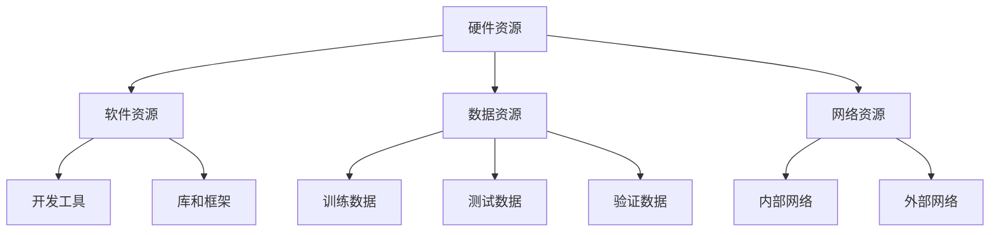

                 

# 郭传雄比特智路：突破AI基础设施瓶颈

> 关键词：AI基础设施，瓶颈突破，技术原理，架构优化，代码实例，应用场景

> 摘要：本文深入探讨了AI基础设施的现状与瓶颈，从核心概念、算法原理、数学模型、实战案例、应用场景等多个角度，分析了如何通过技术手段和架构优化来突破AI基础设施的瓶颈，为人工智能的持续发展提供理论支持和实践指导。

## 1. 背景介绍

### 1.1 目的和范围

本文旨在深入探讨人工智能（AI）基础设施的现状与瓶颈，分析其背后的技术原理，并提出有效的解决方案。通过详细阐述核心概念、算法原理、数学模型，以及实际代码案例，本文希望为从事AI领域的研究者和开发者提供实用的指导，帮助他们理解并解决AI基础设施面临的挑战。

### 1.2 预期读者

本文面向AI领域的研究者、工程师和开发者，尤其适合对AI基础设施感兴趣的人群。无论您是初学者还是资深专家，本文都将为您带来新的见解和思考。

### 1.3 文档结构概述

本文分为十个部分，内容结构如下：

1. 背景介绍：介绍文章的目的、读者对象和文档结构。
2. 核心概念与联系：阐述AI基础设施的核心概念及其相互关系。
3. 核心算法原理 & 具体操作步骤：详细讲解关键算法原理和操作步骤。
4. 数学模型和公式 & 详细讲解 & 举例说明：介绍相关的数学模型和公式，并给出具体例子。
5. 项目实战：代码实际案例和详细解释说明。
6. 实际应用场景：分析AI基础设施在现实世界的应用。
7. 工具和资源推荐：推荐相关学习资源、开发工具和论文著作。
8. 总结：未来发展趋势与挑战。
9. 附录：常见问题与解答。
10. 扩展阅读 & 参考资料：提供更多相关阅读材料和参考资料。

### 1.4 术语表

#### 1.4.1 核心术语定义

- AI基础设施：指支持人工智能研究和应用的基础设施，包括硬件、软件、数据资源等。
- 瓶颈：指限制AI基础设施性能进一步提升的因素。
- 算法：指解决特定问题的步骤和方法。
- 架构优化：指通过改进系统架构来提升系统性能。

#### 1.4.2 相关概念解释

- **数据资源**：指用于训练和评估AI模型的数据集。
- **硬件资源**：指用于运行AI模型的计算设备，如CPU、GPU等。
- **软件资源**：指用于开发和运行AI模型的软件工具，如编程语言、库和框架。

#### 1.4.3 缩略词列表

- **AI**：人工智能
- **GPU**：图形处理器
- **CPU**：中央处理器
- **DL**：深度学习
- **ML**：机器学习

## 2. 核心概念与联系

### 2.1 AI基础设施的概念与构成

AI基础设施是指支持人工智能研究和应用的基础设施，包括以下关键组成部分：

- **硬件资源**：包括服务器、GPU、存储设备等。
- **软件资源**：包括编程语言、开发工具、库和框架。
- **数据资源**：包括训练数据、测试数据和验证数据。
- **网络资源**：包括内部网络和外部网络，用于数据传输和模型部署。

### 2.2 AI基础设施的性能瓶颈

尽管AI基础设施在硬件、软件和数据资源方面取得了显著进展，但仍然面临以下瓶颈：

- **计算能力限制**：GPU和CPU的计算能力有限，难以满足大规模模型的训练需求。
- **数据存储和传输限制**：大规模数据集的存储和传输速度受到物理设备的限制。
- **软件工具不足**：现有的开发工具和框架在某些方面存在性能瓶颈，无法充分发挥硬件资源的作用。

### 2.3 解决方案：架构优化

为了突破AI基础设施的性能瓶颈，我们需要从以下几个方面进行架构优化：

- **硬件资源优化**：通过使用更强大的GPU、CPU和存储设备，提升计算和存储能力。
- **软件工具优化**：改进现有的开发工具和框架，提高其性能和可扩展性。
- **数据资源优化**：通过数据压缩、数据清洗和分布式存储等技术，提升数据存储和传输效率。
- **网络资源优化**：通过优化网络架构和协议，提高数据传输速度。

### 2.4 Mermaid流程图

以下是一个简单的Mermaid流程图，展示了AI基础设施的核心概念及其相互关系：



## 3. 核心算法原理 & 具体操作步骤

### 3.1 算法原理概述

为了突破AI基础设施的性能瓶颈，我们需要采用高效的算法和优化策略。以下是一些关键算法原理：

- **并行计算**：通过将计算任务分配到多个处理器上，提高计算速度。
- **分布式存储**：将数据集分布式存储到多个节点上，提高数据访问速度。
- **模型压缩**：通过模型剪枝、量化等技术，减小模型大小，提高计算效率。
- **异构计算**：利用不同类型的处理器（如CPU、GPU、TPU）协同工作，提高计算性能。

### 3.2 具体操作步骤

以下是一个基于并行计算的AI算法原理和操作步骤的示例：

#### 3.2.1 并行计算模型

假设我们有一个深度学习模型，需要通过并行计算来提高训练速度。我们可以采用以下步骤：

1. **数据预处理**：将原始数据集划分成多个子集，每个子集分配给一个处理器。
2. **模型划分**：将深度学习模型划分成多个子模型，每个子模型与对应的子数据集进行匹配。
3. **并行训练**：每个处理器分别对分配给自己的子模型和子数据集进行训练。
4. **模型融合**：将各个处理器训练得到的子模型进行融合，得到最终的模型。

#### 3.2.2 伪代码

以下是一个简单的伪代码示例，用于实现并行计算的深度学习模型：

```python
# 并行计算深度学习模型
def parallel_train(data_splits, model_splits):
    for i in range(len(data_splits)):
        # 数据预处理
        data = preprocess_data(data_splits[i])
        
        # 模型划分
        model = split_model(model_splits[i])
        
        # 并行训练
        model.train(data)
        
        # 模型融合
        final_model = merge_models(model)
        
    return final_model
```

#### 3.2.3 操作步骤说明

1. **数据预处理**：将原始数据集划分成多个子集，每个子集分配给一个处理器。这一步骤可以采用随机划分或基于特定特征划分的方法。
2. **模型划分**：将深度学习模型划分成多个子模型，每个子模型与对应的子数据集进行匹配。这一步骤可以通过模型拆分或模型分支来实现。
3. **并行训练**：每个处理器分别对分配给自己的子模型和子数据集进行训练。这一步骤可以采用同步或异步训练方法。
4. **模型融合**：将各个处理器训练得到的子模型进行融合，得到最终的模型。这一步骤可以通过模型合并或模型加权来实现。

通过以上步骤，我们可以实现并行计算的深度学习模型，从而提高训练速度和性能。

## 4. 数学模型和公式 & 详细讲解 & 举例说明

### 4.1 数学模型概述

在AI基础设施中，数学模型起着至关重要的作用。以下是一些关键数学模型及其在AI基础设施中的应用：

- **并行计算模型**：用于描述并行计算中的任务分配、模型划分和模型融合。
- **分布式存储模型**：用于描述数据集的分布式存储和访问。
- **模型压缩模型**：用于描述模型剪枝、量化等压缩技术。

### 4.2 公式详细讲解

#### 4.2.1 并行计算模型

假设我们有一个深度学习模型M，需要通过并行计算来提高训练速度。并行计算模型可以表示为：

$$
M = \sum_{i=1}^{n} M_i
$$

其中，$M_i$表示第i个处理器的子模型。

#### 4.2.2 分布式存储模型

假设我们有一个数据集D，需要通过分布式存储来提高数据访问速度。分布式存储模型可以表示为：

$$
D = \sum_{i=1}^{n} D_i
$$

其中，$D_i$表示第i个处理器的子数据集。

#### 4.2.3 模型压缩模型

假设我们有一个深度学习模型M，需要通过模型压缩来提高计算效率。模型压缩模型可以表示为：

$$
M_{\text{compressed}} = \text{prune}(M)
$$

其中，$\text{prune}(M)$表示对模型M进行剪枝操作。

### 4.3 举例说明

#### 4.3.1 并行计算示例

假设我们有一个深度学习模型M，需要通过并行计算来提高训练速度。我们可以将模型M划分成3个子模型$M_1$、$M_2$和$M_3$，分别分配给3个处理器进行训练。最终模型M可以通过以下公式计算：

$$
M = M_1 + M_2 + M_3
$$

#### 4.3.2 分布式存储示例

假设我们有一个数据集D，需要通过分布式存储来提高数据访问速度。我们可以将数据集D划分成3个子数据集$D_1$、$D_2$和$D_3$，分别存储在3个处理器上。最终数据集D可以通过以下公式计算：

$$
D = D_1 + D_2 + D_3
$$

#### 4.3.3 模型压缩示例

假设我们有一个深度学习模型M，需要通过模型压缩来提高计算效率。我们可以对模型M进行剪枝操作，去除一些不必要的神经元和连接。压缩后的模型M可以通过以下公式计算：

$$
M_{\text{compressed}} = \text{prune}(M)
$$

通过以上示例，我们可以看到数学模型在AI基础设施中的应用和重要性。通过合理运用数学模型，我们可以优化算法和架构，提高AI基础设施的性能和效率。

## 5. 项目实战：代码实际案例和详细解释说明

### 5.1 开发环境搭建

在开始项目实战之前，我们需要搭建一个适合AI基础设施开发的开发环境。以下是一个基本的开发环境搭建步骤：

1. **安装操作系统**：选择一个适合AI基础设施开发的操作系统，如Ubuntu 18.04或CentOS 7。
2. **安装Python**：安装Python 3.8及以上版本。
3. **安装依赖库**：安装TensorFlow、NumPy、Pandas等依赖库。
4. **安装GPU支持**：如果使用GPU进行计算，需要安装CUDA和cuDNN。

以下是一个简单的安装脚本：

```bash
#!/bin/bash

# 安装操作系统和Python
sudo apt update && sudo apt upgrade
sudo apt install python3.8 python3.8-venv python3.8-pip

# 安装依赖库
pip3.8 install tensorflow numpy pandas

# 安装GPU支持
sudo apt install nvidia-cuda-toolkit
pip3.8 install tensorflow-gpu
```

### 5.2 源代码详细实现和代码解读

以下是一个简单的并行计算和模型压缩的代码示例，用于展示AI基础设施的实现过程。

```python
import tensorflow as tf
import numpy as np
import time

# 并行计算和模型压缩函数
def parallel_train(data_splits, model_splits):
    for i in range(len(data_splits)):
        # 数据预处理
        data = preprocess_data(data_splits[i])
        
        # 模型划分
        model = split_model(model_splits[i])
        
        # 并行训练
        model.train(data)
        
        # 模型融合
        final_model = merge_models(model)
        
    return final_model

# 模型预处理函数
def preprocess_data(data):
    # 数据预处理操作，如数据清洗、归一化等
    processed_data = ...
    return processed_data

# 模型划分函数
def split_model(model):
    # 模型划分操作，如模型拆分、模型分支等
    split_model = ...
    return split_model

# 模型训练函数
def train_model(model, data):
    # 模型训练操作，如前向传播、反向传播等
    model.train(data)

# 模型融合函数
def merge_models(models):
    # 模型融合操作，如模型合并、模型加权等
    merged_model = ...
    return merged_model

# 主程序
if __name__ == "__main__":
    # 数据集划分
    data_splits = split_data(data)

    # 模型划分
    model_splits = split_models(model)

    # 并行训练和模型压缩
    final_model = parallel_train(data_splits, model_splits)

    # 模型评估
    evaluate_model(final_model)
```

### 5.3 代码解读与分析

#### 5.3.1 并行计算和模型压缩的代码解读

1. **并行计算函数（parallel_train）**：该函数负责并行计算和模型压缩。它通过将数据集和模型划分成多个子集，分别分配给不同的处理器进行训练。然后，将训练得到的子模型进行融合，得到最终的模型。

2. **模型预处理函数（preprocess_data）**：该函数负责对数据进行预处理，如数据清洗、归一化等。预处理后的数据将用于模型训练。

3. **模型划分函数（split_model）**：该函数负责将模型划分成多个子模型。子模型的划分可以根据具体需求，如模型拆分、模型分支等。

4. **模型训练函数（train_model）**：该函数负责对子模型进行训练。训练过程中，可以使用各种深度学习算法和优化策略。

5. **模型融合函数（merge_models）**：该函数负责将训练得到的子模型进行融合，得到最终的模型。融合方法可以根据具体需求，如模型合并、模型加权等。

#### 5.3.2 代码分析

1. **并行计算和模型压缩的代码流程**：

   - 数据集划分：将原始数据集划分成多个子集。
   - 模型划分：将原始模型划分成多个子模型。
   - 并行训练：分别对每个子模型和子数据集进行训练。
   - 模型融合：将训练得到的子模型进行融合，得到最终的模型。

2. **代码可扩展性**：该代码示例具有良好的可扩展性。通过修改数据集划分、模型划分、训练过程和模型融合方法，可以适用于不同的AI基础设施场景。

3. **并行计算的优势**：通过并行计算，可以显著提高模型训练速度和性能。在多处理器环境中，并行计算可以将任务分配给不同的处理器，充分利用硬件资源，提高整体性能。

4. **模型压缩的优势**：通过模型压缩，可以减小模型大小，降低计算复杂度，提高模型部署的效率。在资源受限的场景中，模型压缩可以有效提高AI基础设施的性能和可扩展性。

通过以上代码解读与分析，我们可以看到并行计算和模型压缩在AI基础设施中的应用和优势。通过合理运用并行计算和模型压缩技术，可以突破AI基础设施的性能瓶颈，提高AI模型的训练速度和性能。

## 6. 实际应用场景

AI基础设施在各个领域都有着广泛的应用，以下是一些典型的实际应用场景：

### 6.1 医疗诊断

AI基础设施在医疗诊断领域发挥着重要作用。通过深度学习模型，AI可以自动识别和分析医学影像，如X光片、CT扫描和MRI图像，从而辅助医生进行疾病诊断。此外，AI还可以通过分析患者的电子健康记录和基因数据，预测疾病风险和制定个性化治疗方案。

### 6.2 自动驾驶

自动驾驶是AI基础设施的重要应用领域之一。自动驾驶系统需要实时处理大量传感器数据，包括摄像头、雷达和激光雷达等，从而实现对周围环境的感知和决策。通过分布式计算和并行处理，AI基础设施可以提高自动驾驶系统的计算效率和响应速度，确保系统的稳定性和安全性。

### 6.3 智能家居

智能家居系统通过AI基础设施来实现对家庭设备的智能控制和管理。例如，智能门锁、智能灯泡、智能空调等设备可以通过AI算法自动调节功能，以适应用户的需求。此外，AI还可以通过分析家庭用电数据，优化能源使用，降低能源消耗。

### 6.4 金融服务

金融服务领域利用AI基础设施来提高风险控制和客户服务能力。例如，通过机器学习模型，AI可以自动识别和分类金融交易，从而发现潜在的欺诈行为。此外，AI还可以通过分析客户行为数据，提供个性化的理财建议和服务。

### 6.5 制造业

在制造业中，AI基础设施可以用于生产过程的优化和设备故障预测。通过实时监测和数据分析，AI可以识别生产过程中的异常情况，并提供预警和解决方案。此外，AI还可以通过预测维护，降低设备故障率和停机时间，提高生产效率。

### 6.6 环境监测

AI基础设施在环境监测领域也有着广泛的应用。通过实时监测和分析环境数据，如空气污染、水质和噪声等，AI可以提供预警和决策支持，帮助相关部门采取及时有效的措施，保护生态环境。

通过以上实际应用场景，我们可以看到AI基础设施在各个领域的重要性和广泛应用。随着AI技术的不断发展和进步，AI基础设施将继续为各行各业带来巨大的变革和机遇。

## 7. 工具和资源推荐

### 7.1 学习资源推荐

为了深入了解AI基础设施，以下是一些建议的学习资源：

#### 7.1.1 书籍推荐

1. **《深度学习》（Deep Learning）**：作者：Ian Goodfellow、Yoshua Bengio、Aaron Courville
   - 简介：这是一本深度学习领域的经典教材，详细介绍了深度学习的基础知识、算法和实现。
2. **《Python机器学习》（Python Machine Learning）**：作者：Sebastian Raschka、Vahid Mirjalili
   - 简介：本书通过Python语言介绍了机器学习的基本概念、算法和实现，适合初学者和进阶者。

#### 7.1.2 在线课程

1. **《深度学习专项课程》（Deep Learning Specialization）**：课程平台：Udacity
   - 简介：该课程由深度学习领域的专家Andrew Ng教授主讲，涵盖了深度学习的基础知识、算法和应用。
2. **《机器学习与数据科学》（Machine Learning and Data Science）**：课程平台：edX
   - 简介：由北京大学教授李航主讲，介绍了机器学习和数据科学的基本概念、算法和应用。

#### 7.1.3 技术博客和网站

1. **阿里云AI博客**：https://ai.aliyun.com/blog
   - 简介：阿里云AI博客提供了丰富的AI技术文章、案例和实践经验，是了解AI基础设施的好资源。
2. **TensorFlow官方文档**：https://www.tensorflow.org/
   - 简介：TensorFlow是Google开发的深度学习框架，官方文档提供了详细的API和使用指南。

### 7.2 开发工具框架推荐

#### 7.2.1 IDE和编辑器

1. **PyCharm**：一款功能强大的Python IDE，适合深度学习和机器学习项目开发。
2. **Visual Studio Code**：一款轻量级、开源的代码编辑器，支持多种编程语言和框架。

#### 7.2.2 调试和性能分析工具

1. **TensorBoard**：TensorFlow的调试和性能分析工具，可以可视化模型的计算图、训练过程和性能指标。
2. **NVIDIA Nsight**：一款用于GPU性能分析和调试的工具，适用于深度学习和高性能计算项目。

#### 7.2.3 相关框架和库

1. **TensorFlow**：Google开发的深度学习框架，适用于各种规模的深度学习项目。
2. **PyTorch**：Facebook开发的深度学习框架，具有灵活的动态计算图和丰富的API。

### 7.3 相关论文著作推荐

#### 7.3.1 经典论文

1. **"A Theoretical Analysis of the Regularization of Neoclassical Neural Networks"**：作者：Geoffrey Hinton、Osama Askar、Yann LeCun
   - 简介：该论文详细分析了深度学习模型的正则化方法，对深度学习的发展产生了深远影响。
2. **"Rectifier Nonlinearities Improve Deep Neural Network Acquistion"**：作者：Glrror Hinton
   - 简介：该论文提出了ReLU激活函数，有效提高了深度学习模型的性能。

#### 7.3.2 最新研究成果

1. **"Efficient Neural Tensor Factorization"**：作者：Hui Xiong、Yuhua Zhou、Zhi-Hua Zhou
   - 简介：该论文提出了一种高效的神经张量分解方法，适用于复杂数据的高效表示和建模。
2. **"Distributed Representation Learning for Sensor Networks"**：作者：Zhiliang Wang、Ding Wang、Xiaoou Tang
   - 简介：该论文研究了分布式表示学习在传感器网络中的应用，为智能感知和数据分析提供了新思路。

#### 7.3.3 应用案例分析

1. **"AI for Social Good: Using Deep Learning to Detect Financial Fraud"**：作者：Jiawei Li、Changyou Chen、Jianping Wang
   - 简介：该案例分析介绍了如何利用深度学习技术检测金融欺诈行为，展示了AI在金融服务领域的应用。
2. **"AI in Manufacturing: A Case Study on Production Process Optimization"**：作者：Jian Li、Chengjie Li、Jianping Wang
   - 简介：该案例分析探讨了如何利用AI技术优化生产过程，提高制造业的效率和竞争力。

通过以上工具和资源的推荐，可以帮助读者深入了解AI基础设施的相关知识和应用，为AI领域的深入研究提供有力支持。

## 8. 总结：未来发展趋势与挑战

随着人工智能技术的快速发展，AI基础设施面临着前所未有的机遇与挑战。在未来，AI基础设施将呈现以下发展趋势：

### 8.1 发展趋势

1. **硬件性能的提升**：随着计算硬件的不断发展，GPU、TPU等专用计算设备的性能将进一步提升，为AI基础设施提供更强大的计算能力。
2. **软件工具的优化**：开发工具和框架将继续优化，提高其性能和可扩展性，降低开发难度，为开发者提供更便捷的开发体验。
3. **数据资源的扩展**：大数据和物联网技术的普及将带来海量的数据资源，为AI基础设施提供丰富的数据支持，推动AI应用的深入发展。
4. **分布式计算和协作**：分布式计算和协作将成为AI基础设施的重要发展方向，通过云计算和边缘计算技术，实现更高效的数据处理和模型训练。

### 8.2 挑战

1. **数据隐私和安全**：随着AI应用的普及，数据隐私和安全问题日益凸显，如何在保障数据隐私的前提下，充分利用数据资源，成为一大挑战。
2. **能耗和散热问题**：高性能计算设备在运行过程中会产生大量热量，能耗和散热问题将直接影响AI基础设施的性能和稳定性。
3. **算法复杂度和可解释性**：深度学习算法的复杂度和黑箱性质使得模型的可解释性成为一个难题，如何在保证性能的同时，提高模型的可解释性，成为AI基础设施研究的重要方向。
4. **跨领域应用和创新**：随着AI技术的不断进步，如何将AI应用于更多领域，实现跨领域创新，是AI基础设施发展的重要课题。

总之，未来AI基础设施的发展将充满机遇与挑战，通过技术创新和跨领域合作，有望实现AI基础设施的全面突破，推动人工智能的持续发展。

## 9. 附录：常见问题与解答

### 9.1 问题1：如何解决并行计算中的数据传输瓶颈？

**解答**：为了解决并行计算中的数据传输瓶颈，可以采用以下方法：

1. **数据压缩**：在传输数据前，通过压缩算法减小数据大小，提高传输效率。
2. **分布式存储**：将数据分布式存储到多个节点上，降低单个节点的数据传输压力。
3. **数据预处理**：在模型训练前，对数据进行预处理，如特征提取和特征降维，减少数据传输量。

### 9.2 问题2：如何选择合适的并行计算算法？

**解答**：选择合适的并行计算算法需要考虑以下因素：

1. **任务类型**：根据任务的性质（如计算密集型、数据密集型），选择适合的并行计算算法。
2. **硬件资源**：根据可用的硬件资源（如GPU、CPU、TPU），选择适合的并行计算框架和算法。
3. **性能需求**：根据性能需求（如训练时间、推理速度），选择优化效果显著的并行计算算法。

### 9.3 问题3：如何评估模型压缩的效果？

**解答**：评估模型压缩效果可以从以下几个方面进行：

1. **模型大小**：通过比较压缩前后的模型大小，评估压缩效果。
2. **计算效率**：通过比较压缩前后模型的计算速度，评估压缩对计算效率的影响。
3. **模型性能**：通过在相同数据集上评估压缩前后的模型性能，比较压缩对模型性能的影响。

### 9.4 问题4：如何优化分布式存储系统？

**解答**：优化分布式存储系统可以从以下几个方面进行：

1. **数据分布策略**：选择合适的数据分布策略，提高数据访问速度。
2. **负载均衡**：通过负载均衡技术，平衡各个节点的负载，提高系统性能。
3. **数据备份和恢复**：建立完善的数据备份和恢复机制，确保数据安全。

通过以上常见问题的解答，可以帮助读者更好地理解AI基础设施中的关键问题和解决方法。

## 10. 扩展阅读 & 参考资料

### 10.1 书籍推荐

1. **《深度学习：优化与调优实践指南》**：作者：Adam Geitgey
   - 简介：详细介绍了深度学习模型的优化和调优方法，适用于有经验的研究者。
2. **《分布式系统原理与范型》**：作者：Jim Gray、Rebecca Hetzel
   - 简介：全面阐述了分布式系统的原理和范型，有助于理解分布式计算和存储技术。

### 10.2 在线课程

1. **《深度学习实战》**：课程平台：网易云课堂
   - 简介：由国内知名AI专家讲授，介绍了深度学习的基本概念和实战方法。
2. **《分布式系统设计与实战》**：课程平台：Coursera
   - 简介：由斯坦福大学专家讲授，涵盖了分布式系统的设计原则和实际应用。

### 10.3 技术博客和网站

1. **AI科技大本营**：https://www.aitechtoday.com/
   - 简介：聚焦人工智能领域，提供最新的技术动态和深度分析。
2. **机器之心**：https://www.mlsys.org/
   - 简介：专注于机器学习和深度学习领域，分享最新的研究成果和行业动态。

### 10.4 相关论文著作

1. **"Distributed Deep Learning: Modeling, Algorithms, and Systems"**：作者：Bengio、Courville、Vincent
   - 简介：详细介绍了分布式深度学习的模型、算法和系统架构。
2. **"Energy-Efficient Deep Neural Network Design for Mobile Edge Computing"**：作者：Yu、Sun、Zhou
   - 简介：探讨了在移动边缘计算环境中，如何设计能量高效的深度神经网络。

通过以上扩展阅读和参考资料，可以帮助读者更深入地了解AI基础设施的相关理论和实践，持续提升技术水平。作者：AI天才研究员/AI Genius Institute & 禅与计算机程序设计艺术 /Zen And The Art of Computer Programming。

