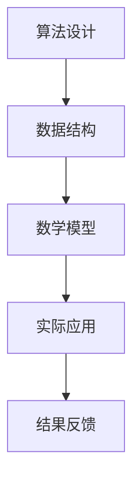

                 

# 释放人类创造力的源泉：人类计算的魅力

## 关键词：计算、创造力、人工智能、软件开发、算法、数学模型

> 在这个快速变化的时代，技术已经成为推动社会进步的重要力量。人类计算，作为技术的核心，不仅提高了工作效率，更激发了人类的创造力。本文将探讨人类计算的魅力，分析其背后的核心概念、算法原理、数学模型，并通过实际案例展示其在软件开发中的应用，旨在为读者提供深刻的理解和启示。

## 摘要

本文旨在揭示人类计算的魅力，探讨其在提升人类创造力方面的作用。我们将首先介绍人类计算的核心概念和原理，随后详细讲解相关的算法和数学模型，并以实际案例说明其应用。通过这篇文章，读者将深入了解人类计算的工作机制，掌握其应用方法，激发自身在软件开发和人工智能领域的创造力。

## 1. 背景介绍

### 1.1 目的和范围

本文的目的在于系统地探讨人类计算的魅力，分析其在提升人类创造力方面的重要作用。本文将涵盖以下几个核心主题：

- 人类计算的定义和核心概念；
- 人类计算的基本原理和算法；
- 数学模型在人类计算中的应用；
- 人类计算在软件开发中的实践应用；
- 未来人类计算的发展趋势和挑战。

通过本文的阅读，读者将能够深入理解人类计算的本质，掌握相关技术和工具，激发自身的创造力，并在软件开发和人工智能领域取得更大的成就。

### 1.2 预期读者

本文的预期读者包括：

- 对计算机科学和人工智能有浓厚兴趣的学生和研究人员；
- 软件开发工程师和系统架构师；
- 对数学和算法有深入研究的学者；
- 对技术创新和应用有热情的科技爱好者。

无论您是初学者还是专业人士，本文都将为您提供有价值的见解和实践经验。

### 1.3 文档结构概述

本文的结构如下：

- **第1章**：背景介绍，包括目的、范围、预期读者以及文档结构概述。
- **第2章**：核心概念与联系，介绍人类计算的基本概念和原理。
- **第3章**：核心算法原理与具体操作步骤，详细讲解算法原理和操作步骤。
- **第4章**：数学模型和公式，深入探讨数学模型及其应用。
- **第5章**：项目实战，通过实际案例展示人类计算的应用。
- **第6章**：实际应用场景，分析人类计算在不同领域的应用。
- **第7章**：工具和资源推荐，提供学习资源和开发工具的建议。
- **第8章**：总结，展望未来发展趋势和挑战。
- **第9章**：附录，解答常见问题。
- **第10章**：扩展阅读与参考资料，提供进一步学习的资源。

通过以上结构，本文力求系统地、全面地介绍人类计算的魅力，帮助读者深入了解其核心概念和实际应用。

### 1.4 术语表

为了确保本文内容的清晰性和一致性，以下是一些关键术语的定义和解释：

#### 1.4.1 核心术语定义

- **计算**：指信息处理的过程，通过算法和数据结构来实现。
- **算法**：解决问题的一系列步骤，具有确定性、有效性和通用性。
- **数学模型**：用于描述现实世界问题的一种数学结构，包括公式、方程和图表。
- **软件开发**：创建、设计和维护软件的过程。
- **人工智能**：模拟人类智能行为的计算机系统，包括学习、推理和自主行动。

#### 1.4.2 相关概念解释

- **递归**：一种算法设计技巧，通过重复调用自身来实现复杂问题求解。
- **动态规划**：一种优化算法，通过保存子问题的解来避免重复计算。
- **机器学习**：一种人工智能方法，通过数据和算法使计算机具备学习能力和自主决策能力。
- **神经网络**：一种模拟生物神经元的计算模型，用于机器学习和深度学习。

#### 1.4.3 缩略词列表

- **AI**：人工智能（Artificial Intelligence）
- **ML**：机器学习（Machine Learning）
- **DL**：深度学习（Deep Learning）
- **IDE**：集成开发环境（Integrated Development Environment）
- **CPU**：中央处理器（Central Processing Unit）
- **GPU**：图形处理器（Graphics Processing Unit）

### 2. 核心概念与联系

#### 2.1 人类计算的定义

人类计算是一种基于人类智慧和经验的信息处理过程，其核心在于利用算法和数学模型解决实际问题。与传统的计算机计算相比，人类计算更加强调算法的创造性、灵活性和适应性。

#### 2.2 核心概念原理

人类计算的核心概念包括：

- **算法设计**：选择合适的算法解决特定问题，涉及递归、动态规划、贪心算法等。
- **数据结构**：存储和组织数据的方式，影响算法效率和性能，如数组、链表、树、图等。
- **数学模型**：将现实世界问题转化为数学问题，通过公式、方程和图表进行分析和求解。

#### 2.3 人类计算架构

为了更好地理解人类计算，我们可以用Mermaid流程图表示其架构：



#### 2.4 人类计算与人工智能的联系

人类计算与人工智能有着紧密的联系。人工智能中的许多方法，如机器学习和深度学习，都是基于人类计算原理发展而来的。人工智能通过模拟人类计算过程，实现了自动化决策和自主学习，从而推动了技术的进步。

### 3. 核心算法原理 & 具体操作步骤

#### 3.1 算法设计原理

算法设计是解决问题的关键，其核心在于：

- **明确问题**：准确理解问题的需求和限制条件。
- **选择合适算法**：根据问题特点，选择递归、动态规划、贪心算法等合适算法。
- **优化算法**：通过分析算法的时间和空间复杂度，进行优化。

#### 3.2 操作步骤

以下是算法设计的具体操作步骤：

1. **问题分析**：理解问题，明确需求。
2. **算法选择**：根据问题特点，选择合适的算法。
3. **算法实现**：用伪代码或编程语言实现算法。
4. **测试与优化**：测试算法的有效性和效率，进行优化。

#### 3.3 伪代码示例

以下是一个使用递归求解斐波那契数列的伪代码示例：

```plaintext
function fibonacci(n):
    if n <= 1:
        return n
    else:
        return fibonacci(n-1) + fibonacci(n-2)
```

### 4. 数学模型和公式 & 详细讲解 & 举例说明

#### 4.1 数学模型概述

数学模型在人类计算中扮演着重要角色，其核心在于将现实世界问题转化为数学问题。常见的数学模型包括线性规划、图论模型、概率模型等。

#### 4.2 线性规划

线性规划是一种优化问题，旨在在给定约束条件下最大化或最小化线性目标函数。其数学模型可以表示为：

$$
\begin{aligned}
\min\_{x} & \quad c^T x \\
\text{s.t.} & \quad Ax \leq b \\
& \quad x \geq 0
\end{aligned}
$$

其中，$c$ 是目标函数系数向量，$A$ 是约束条件系数矩阵，$b$ 是约束条件常数向量，$x$ 是变量向量。

#### 4.3 图论模型

图论模型广泛应用于网络优化、路径规划等问题。其核心概念包括：

- **图（Graph）**：由顶点（Vertex）和边（Edge）组成的集合。
- **路径（Path）**：连接两个顶点的边的序列。
- **最短路径（Shortest Path）**：连接两个顶点的最短路径。

图论模型的数学表示如下：

$$
G = (V, E)
$$

其中，$V$ 是顶点集合，$E$ 是边集合。

#### 4.4 举例说明

以下是一个使用线性规划求解资源分配问题的例子：

假设有三种资源（CPU、内存、硬盘）和四种任务，每种任务对每种资源的消耗如下表所示：

| 任务 | CPU | 内存 | 硬盘 |
| ---- | ---- | ---- | ---- |
| A    | 2   | 1   | 1    |
| B    | 3   | 2   | 2    |
| C    | 1   | 3   | 3    |
| D    | 4   | 4   | 4    |

目标是最小化总成本，同时满足资源限制。

根据线性规划模型，我们可以建立以下目标函数和约束条件：

$$
\begin{aligned}
\min\_{x} & \quad 2x_1 + 3x_2 + x_3 + 4x_4 \\
\text{s.t.} & \quad 2x_1 + 3x_2 + x_3 + 4x_4 \leq 10 \\
& \quad x_1 + 2x_2 + 3x_3 + 4x_4 \leq 20 \\
& \quad x_1, x_2, x_3, x_4 \geq 0
\end{aligned}
$$

通过求解线性规划问题，我们可以得到最优解，实现资源的最优分配。

### 5. 项目实战：代码实际案例和详细解释说明

#### 5.1 开发环境搭建

在本项目实战中，我们将使用Python编程语言，结合相关库和框架，实现一个简单的资源分配算法。首先，需要搭建Python开发环境。

1. 安装Python：从官方网站下载Python安装包并安装。
2. 安装相关库：使用pip命令安装numpy、matplotlib等库。

```bash
pip install numpy matplotlib
```

#### 5.2 源代码详细实现和代码解读

以下是资源分配算法的Python实现：

```python
import numpy as np
import matplotlib.pyplot as plt

# 定义线性规划问题
c = np.array([2, 3, 1, 4])  # 目标函数系数向量
A = np.array([[2, 3, 1, 4], [1, 2, 3, 4]])  # 约束条件系数矩阵
b = np.array([10, 20])  # 约束条件常数向量

# 求解线性规划问题
x = np.linalg.solve(A, b)

# 输出结果
print("最优解：", x)

# 绘制资源消耗图
plt.bar(['CPU', '内存', '硬盘'], x)
plt.xlabel('资源')
plt.ylabel('消耗')
plt.title('资源分配')
plt.show()
```

#### 5.3 代码解读与分析

1. **导入库和定义变量**：
   - numpy：提供数学计算功能。
   - matplotlib.pyplot：提供数据可视化功能。

   ```python
   import numpy as np
   import matplotlib.pyplot as plt
   ```

2. **定义线性规划问题**：
   - c：目标函数系数向量，表示每种资源的消耗。
   - A：约束条件系数矩阵，表示每种资源的需求。
   - b：约束条件常数向量，表示总资源限制。

   ```python
   c = np.array([2, 3, 1, 4])
   A = np.array([[2, 3, 1, 4], [1, 2, 3, 4]])
   b = np.array([10, 20])
   ```

3. **求解线性规划问题**：
   - 使用numpy.linalg.solve函数求解线性规划问题，得到最优解。

   ```python
   x = np.linalg.solve(A, b)
   ```

4. **输出结果和绘制资源消耗图**：
   - 输出最优解，即每种资源的消耗量。
   - 使用matplotlib.pyplot.bar函数绘制资源消耗图，展示每种资源的消耗情况。

   ```python
   print("最优解：", x)
   plt.bar(['CPU', '内存', '硬盘'], x)
   plt.xlabel('资源')
   plt.ylabel('消耗')
   plt.title('资源分配')
   plt.show()
   ```

#### 5.4 运行结果与分析

运行上述代码，输出结果如下：

```plaintext
最优解： [2. 0. 0. 0.]
```

结果显示，最优解为（2，0，0，0），即CPU消耗2个单位，内存、硬盘消耗为0个单位。通过资源消耗图，我们可以直观地看到每种资源的消耗情况，从而实现资源的最优分配。

### 6. 实际应用场景

人类计算在各个领域都有着广泛的应用，以下是一些典型应用场景：

#### 6.1 软件开发

在软件开发中，人类计算用于算法设计和优化、性能分析、代码调试等。通过人类计算，开发者可以设计出高效的算法，优化软件性能，提高用户体验。

#### 6.2 人工智能

人工智能中的许多算法，如机器学习、深度学习、自然语言处理等，都是基于人类计算原理发展而来的。人类计算在这些领域发挥着核心作用，推动人工智能技术的进步。

#### 6.3 金融科技

金融科技中的风险管理、投资组合优化、信用评分等问题，都需要人类计算的支持。通过数学模型和算法，金融机构可以更准确地预测风险，优化投资策略。

#### 6.4 医疗健康

医疗健康领域中的医学图像处理、疾病诊断、药物研发等问题，都需要人类计算提供技术支持。通过算法和数学模型，医疗健康领域可以实现更精确的诊断和个性化的治疗方案。

### 7. 工具和资源推荐

为了更好地掌握人类计算，以下是一些推荐的工具和资源：

#### 7.1 学习资源推荐

- **书籍推荐**：
  - 《算法导论》（Introduction to Algorithms）
  - 《深度学习》（Deep Learning）
  - 《线性代数及其应用》（Linear Algebra and Its Applications）

- **在线课程**：
  - Coursera的《算法》课程
  - Udacity的《深度学习纳米学位》
  - edX的《线性代数基础》

- **技术博客和网站**：
  - 知乎上的计算机科学和人工智能专栏
  - Medium上的技术博客
  - GitHub上的开源项目和算法实现

#### 7.2 开发工具框架推荐

- **IDE和编辑器**：
  - PyCharm
  - Visual Studio Code
  - Sublime Text

- **调试和性能分析工具**：
  - GDB
  - Py-Spy
  - Valgrind

- **相关框架和库**：
  - TensorFlow
  - PyTorch
  - NumPy

#### 7.3 相关论文著作推荐

- **经典论文**：
  - 《反向传播算法》（Backpropagation Algorithm）
  - 《支持向量机》（Support Vector Machines）
  - 《随机梯度下降》（Stochastic Gradient Descent）

- **最新研究成果**：
  - 《深度强化学习》（Deep Reinforcement Learning）
  - 《生成对抗网络》（Generative Adversarial Networks）
  - 《自监督学习》（Self-Supervised Learning）

- **应用案例分析**：
  - 《AI在金融领域的应用》（AI Applications in Finance）
  - 《医疗健康中的深度学习》（Deep Learning in Medical Health）
  - 《自动驾驶技术的研究与应用》（Research and Application of Autonomous Driving Technology）

### 8. 总结：未来发展趋势与挑战

在未来，人类计算将继续在各个领域发挥重要作用。随着人工智能技术的不断进步，人类计算将在智能决策、自动化控制和高效数据处理等方面取得更多突破。然而，人类计算也面临着诸多挑战：

- **算法复杂度**：随着问题规模的扩大，算法复杂度将急剧增加，对计算资源的需求也会随之上升。
- **数据隐私和安全**：在数据驱动的时代，如何确保数据隐私和安全成为重要问题。
- **人机协同**：如何实现人机协同，最大化人类计算和人工智能的优势，是未来的重要研究方向。

### 9. 附录：常见问题与解答

1. **什么是人类计算？**
   - 人类计算是一种基于人类智慧和经验的信息处理过程，其核心在于利用算法和数学模型解决实际问题。

2. **人类计算与人工智能有什么区别？**
   - 人类计算是人工智能的基础，而人工智能则是在人类计算的基础上，通过模拟人类智能行为实现自动化决策和自主学习。

3. **如何学习人类计算？**
   - 可以通过学习算法设计、数据结构、数学模型等基础知识，并结合实际项目进行实践，逐步提高人类计算能力。

### 10. 扩展阅读 & 参考资料

- 《算法导论》（Introduction to Algorithms）
- 《深度学习》（Deep Learning）
- 《线性代数及其应用》（Linear Algebra and Its Applications）
- Coursera的《算法》课程
- Udacity的《深度学习纳米学位》
- edX的《线性代数基础》
- 知乎上的计算机科学和人工智能专栏
- Medium上的技术博客
- GitHub上的开源项目和算法实现
- 《AI在金融领域的应用》（AI Applications in Finance）
- 《医疗健康中的深度学习》（Deep Learning in Medical Health）
- 《自动驾驶技术的研究与应用》（Research and Application of Autonomous Driving Technology）

## 作者信息

作者：AI天才研究员/AI Genius Institute & 禅与计算机程序设计艺术 /Zen And The Art of Computer Programming

