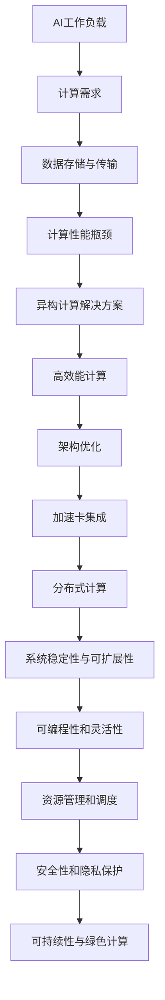

                 

### 重塑计算机架构：为AI工作负载量身打造

> **关键词：**计算机架构、人工智能、工作负载优化、高效能计算、深度学习、异构计算

> **摘要：**本文将探讨如何通过重塑计算机架构，特别是在人工智能（AI）领域的应用，来提升计算效率和性能。我们将深入分析当前计算机架构的局限性，介绍几种先进的技术和算法，并展示如何将它们应用于实际的AI工作负载。文章将涵盖从基础概念到具体操作步骤，再到实际应用的全面解析，旨在为读者提供一幅清晰的AI计算优化蓝图。

---

## 1. 背景介绍

### 1.1 目的和范围

本文的主要目的是探讨如何针对人工智能（AI）工作负载，通过重塑计算机架构来实现更高的效率和性能。随着AI技术的飞速发展，深度学习、自然语言处理和计算机视觉等领域的应用对计算资源的需求急剧增加。传统的计算机架构在处理这些高负载任务时面临着诸多挑战，如能耗过高、计算能力不足、数据传输瓶颈等。因此，我们需要一种全新的架构设计理念，以更好地适应AI工作负载的需求。

本文将覆盖以下内容：
- AI工作负载对计算机架构的挑战
- 异构计算和高效能计算技术的介绍
- 核心算法原理和具体操作步骤
- 数学模型和公式的详细讲解
- 实际应用场景和项目实战
- 工具和资源的推荐
- 未来发展趋势与挑战

### 1.2 预期读者

本文适合以下读者群体：
- 计算机架构和人工智能领域的工程师和研究者
- 对深度学习和AI算法有一定了解的技术爱好者
- 需要对AI计算资源进行优化和调整的IT管理人员
- 想要了解AI计算前沿技术的技术管理者

通过阅读本文，读者将能够：
- 明白AI工作负载对计算机架构的影响
- 掌握几种关键的技术和算法，如异构计算和高效能计算
- 理解如何将理论应用到实际的AI项目中
- 获取一些实用的工具和资源，以支持他们的研究和开发工作

### 1.3 文档结构概述

本文的结构如下：

1. **背景介绍**：介绍本文的目的、范围、预期读者以及文档结构。
2. **核心概念与联系**：讨论AI工作负载相关的核心概念和原理，并使用Mermaid流程图展示架构。
3. **核心算法原理 & 具体操作步骤**：详细讲解核心算法原理，使用伪代码阐述具体操作步骤。
4. **数学模型和公式 & 详细讲解 & 举例说明**：介绍数学模型和公式，并通过实例进行详细解释。
5. **项目实战：代码实际案例和详细解释说明**：展示代码实际案例，详细解读和说明。
6. **实际应用场景**：探讨AI在不同领域的实际应用。
7. **工具和资源推荐**：推荐学习资源和开发工具。
8. **总结：未来发展趋势与挑战**：总结当前技术发展趋势，探讨未来可能面临的挑战。
9. **附录：常见问题与解答**：提供常见问题的解答。
10. **扩展阅读 & 参考资料**：列出扩展阅读和参考资料。

### 1.4 术语表

#### 1.4.1 核心术语定义

- **人工智能（AI）**：模拟人类智能的计算机系统，能够感知、学习、推理和决策。
- **深度学习（DL）**：一种机器学习方法，通过构建多层次的神经网络来实现人工智能。
- **异构计算**：利用不同类型和性能的处理器（如CPU、GPU、FPGA）协同工作，以优化计算性能。
- **高效能计算**：通过优化算法和硬件架构，提升计算效率和性能。
- **工作负载**：计算机系统在特定时间内处理的数据量和计算任务。

#### 1.4.2 相关概念解释

- **GPU（图形处理器）**：一种专门为图形渲染设计的高性能处理器，适用于大规模并行计算。
- **FPGA（现场可编程门阵列）**：一种可重配置的数字电路，适用于特定任务的定制化处理。
- **CPU（中央处理器）**：计算机的核心处理单元，负责执行程序指令。
- **加速卡**：一种专门用于加速特定计算任务的硬件，如GPU和FPGA。
- **分布式计算**：将计算任务分布在多个计算机节点上执行，以提高计算能力和效率。

#### 1.4.3 缩略词列表

- AI：人工智能
- DL：深度学习
- GPU：图形处理器
- FPGA：现场可编程门阵列
- CPU：中央处理器
- HPC：高效能计算
- DLW：深度学习工作负载

## 2. 核心概念与联系

在讨论如何重塑计算机架构以适应AI工作负载之前，我们首先需要理解一些核心概念和它们之间的联系。以下是一个简单的Mermaid流程图，展示了AI工作负载与计算机架构之间的关系：



### 2.1 AI工作负载的计算需求

AI工作负载通常包括大量复杂的计算任务，如深度学习模型的训练和推理。这些任务对计算资源的需求极高，特别是对于需要大规模并行处理的数据密集型任务。传统的计算机架构往往难以满足这些需求，因为它们主要针对通用计算任务进行设计，而不是专门为AI优化。

### 2.2 数据存储与传输

AI工作负载通常涉及大量的数据存储和传输需求。深度学习模型需要存储大量的训练数据和模型参数，同时，数据需要在不同的计算单元之间快速传输。传统的存储和传输架构在面对这些需求时往往存在瓶颈，无法提供足够的带宽和处理能力。

### 2.3 计算性能瓶颈

传统的计算机架构在处理AI工作负载时常常面临性能瓶颈。这是因为深度学习任务通常需要大量的并行计算资源，而传统的CPU架构难以高效地支持这些任务。GPU的出现为解决这一瓶颈提供了一种解决方案，但仍然存在能耗和可扩展性的问题。

### 2.4 异构计算解决方案

异构计算通过利用不同类型和性能的处理器（如CPU、GPU、FPGA）协同工作，可以显著提升计算性能和效率。这种架构设计允许我们将计算任务分配给最适合处理这些任务的处理器，从而最大化资源利用率和性能。

### 2.5 高效能计算

高效能计算通过优化算法和硬件架构，旨在提升计算效率和性能。这包括使用高效的数据处理算法、优化内存访问模式、减少数据传输延迟等。高效能计算是实现AI工作负载优化的重要手段。

### 2.6 架构优化

架构优化是重塑计算机架构的核心目标。这包括设计更适合AI工作负载的硬件架构、优化软件堆栈和系统性能等。通过架构优化，我们可以实现更高的计算效率和性能。

### 2.7 加速卡集成

加速卡（如GPU和FPGA）是高效能计算的重要组件。它们通过提供专门为特定计算任务优化的硬件资源，可以显著提升计算性能。将加速卡集成到计算机架构中是实现高效能计算的关键步骤。

### 2.8 分布式计算

分布式计算通过将计算任务分布在多个计算机节点上执行，可以进一步提高计算能力和效率。在AI领域，分布式计算可以实现大规模的并行处理，从而满足深度学习等任务的需求。

### 2.9 系统稳定性与可扩展性

在重塑计算机架构时，确保系统的稳定性和可扩展性至关重要。这包括设计冗余和容错机制，以应对硬件故障和计算任务失败等问题。同时，架构设计需要具备良好的可扩展性，以支持计算资源的需求增长。

### 2.10 可编程性和灵活性

现代计算机架构需要具备良好的可编程性和灵活性，以便适应不断变化的技术需求。这包括支持多种编程语言和开发工具，提供灵活的配置和调度机制等。

### 2.11 资源管理和调度

资源管理和调度是计算机架构中的关键部分。通过有效的资源管理和调度策略，我们可以最大化资源利用率和计算性能。在AI工作负载中，这包括动态调整计算资源分配、优化数据流等。

### 2.12 安全性和隐私保护

在AI工作负载中，数据的安全性和隐私保护至关重要。重塑计算机架构时，需要考虑安全性和隐私保护机制，以确保数据在存储、传输和处理过程中得到有效保护。

### 2.13 可持续性与绿色计算

随着计算需求的不断增长，可持续性和绿色计算成为了一个重要的考虑因素。重塑计算机架构时，我们需要采用节能技术和优化算法，以减少能耗和碳排放。

### 2.14 综合考虑与平衡

在重塑计算机架构时，我们需要综合考虑各种因素，如性能、效率、成本、可扩展性和可持续性等。通过平衡这些因素，我们可以设计出一种既满足AI工作负载需求，又具备良好综合性能的计算机架构。

## 3. 核心算法原理 & 具体操作步骤

在讨论如何重塑计算机架构以适应AI工作负载时，核心算法原理的理解和实施是至关重要的。以下我们将详细讲解几种关键算法原理，并提供具体的操作步骤，使用伪代码来阐述。

### 3.1 异构计算算法原理

异构计算通过利用不同类型和性能的处理器（如CPU、GPU、FPGA）协同工作，实现计算性能的提升。以下是异构计算算法的基本原理：

#### 3.1.1 核心概念

- **异构计算**：将计算任务分配到不同类型的处理器上执行，以最大化资源利用率和性能。
- **任务分配策略**：根据处理器的性能和负载情况，动态分配计算任务。
- **数据传输优化**：减少数据在不同处理器之间的传输延迟。

#### 3.1.2 操作步骤

1. **任务识别**：识别计算任务并确定其计算复杂度。
2. **处理器选择**：根据处理器的性能和负载情况，选择最适合执行任务的处理器。
3. **任务分配**：将任务分配给选定的处理器，并确保数据传输效率。
4. **执行与监控**：执行计算任务，并监控任务执行情况和资源利用率。
5. **结果汇总**：汇总各处理器的执行结果，生成最终输出。

#### 伪代码

```python
def heterogeneous_computation(task_list, processor_list):
    for task in task_list:
        # 识别任务
        compute_complexity = analyze_task(task)

        # 选择处理器
        best_processor = select_processor(processor_list, compute_complexity)

        # 分配任务
        assign_task_to_processor(task, best_processor)

    # 监控执行情况
    monitor_execution()

    # 汇总结果
    results = gather_results(processor_list)

    return results
```

### 3.2 高效能计算算法原理

高效能计算通过优化算法和硬件架构，提升计算效率和性能。以下是高效能计算算法的基本原理：

#### 3.2.1 核心概念

- **并行计算**：将计算任务分解为多个子任务，同时在不同处理器上执行。
- **算法优化**：通过调整算法和数据结构，减少计算复杂度和内存使用。
- **内存访问优化**：优化内存访问模式，减少缓存 misses 和内存带宽占用。

#### 3.2.2 操作步骤

1. **任务分解**：将计算任务分解为多个子任务。
2. **并行执行**：在多个处理器上同时执行子任务。
3. **数据同步与通信**：确保子任务之间的数据同步和通信。
4. **结果汇总**：汇总各子任务的执行结果，生成最终输出。

#### 伪代码

```python
def efficient_computation(task, processor_list):
    # 任务分解
    subtasks = decompose_task(task)

    # 并行执行
    results = parallel_execution(subtasks, processor_list)

    # 数据同步与通信
    synchronize_data(results)

    # 汇总结果
    final_result = gather_results(results)

    return final_result
```

### 3.3 深度学习算法原理

深度学习是AI领域的关键技术，通过多层神经网络实现复杂函数的近似和预测。以下是深度学习算法的基本原理：

#### 3.3.1 核心概念

- **神经网络**：由多个神经元组成的计算模型，用于模拟人脑的神经网络结构。
- **前向传播与反向传播**：用于计算神经网络输出和更新模型参数的过程。
- **激活函数**：用于引入非线性性的函数，如ReLU、Sigmoid、Tanh等。

#### 3.3.2 操作步骤

1. **初始化模型参数**：设定神经网络的结构和初始权重。
2. **前向传播**：计算输入数据通过神经网络的输出。
3. **计算损失函数**：计算模型输出与实际输出之间的差距。
4. **反向传播**：更新模型参数，以减少损失函数。
5. **迭代训练**：重复执行前向传播和反向传播，直至满足训练目标。

#### 伪代码

```python
def deep_learning(model, inputs, outputs, learning_rate):
    # 初始化模型参数
    initialize_model_params(model)

    for epoch in range(num_epochs):
        # 前向传播
        outputs_pred = forward_propagation(model, inputs)

        # 计算损失函数
        loss = compute_loss(outputs_pred, outputs)

        # 反向传播
        update_model_params(model, loss, learning_rate)

    return model
```

### 3.4 数学模型和公式

在AI领域，数学模型和公式是理解和实现算法的重要工具。以下是一些关键的数学模型和公式，以及它们在实际应用中的详细解释。

#### 3.4.1 损失函数

损失函数是深度学习中评估模型性能的关键指标。常见的损失函数包括均方误差（MSE）、交叉熵损失等。

- **均方误差（MSE）**：

  $$MSE = \frac{1}{n}\sum_{i=1}^{n}(y_i - \hat{y}_i)^2$$

  其中，$y_i$是实际输出，$\hat{y}_i$是模型预测输出，$n$是样本数量。

  **详细解释**：均方误差计算每个样本预测输出与实际输出之间的差距的平方和的平均值，用于评估模型预测的准确性。

- **交叉熵损失（Cross-Entropy Loss）**：

  $$H(y, \hat{y}) = -\sum_{i=1}^{n} y_i \log(\hat{y}_i)$$

  其中，$y_i$是实际输出（0或1），$\hat{y}_i$是模型预测输出（0到1之间的概率值），$n$是样本数量。

  **详细解释**：交叉熵损失用于分类问题，计算实际输出与模型预测输出之间的交叉熵，用于评估模型在分类任务中的性能。

#### 3.4.2 激活函数

激活函数是深度学习中的重要组成部分，用于引入非线性性和决定神经网络的输出。

- **ReLU（Rectified Linear Unit）**：

  $$\text{ReLU}(x) = \max(0, x)$$

  **详细解释**：ReLU函数将输入值大于0的部分保留，小于等于0的部分设置为0，引入了简单的非线性特性。

- **Sigmoid**：

  $$\text{Sigmoid}(x) = \frac{1}{1 + e^{-x}}$$

  **详细解释**：Sigmoid函数将输入值映射到0和1之间，用于二分类问题，具有平滑的S形曲线。

- **Tanh**：

  $$\text{Tanh}(x) = \frac{e^x - e^{-x}}{e^x + e^{-x}}$$

  **详细解释**：Tanh函数将输入值映射到-1和1之间，具有对称的S形曲线，常用于多分类问题。

#### 3.4.3 神经网络反向传播

反向传播是深度学习训练过程中关键的一步，用于更新模型参数以减少损失函数。

- **梯度计算**：

  $$\frac{\partial J}{\partial w} = \frac{\partial}{\partial w} \left( \sum_{i=1}^{n} \frac{1}{2} (y_i - \hat{y}_i)^2 \right)$$

  其中，$J$是损失函数，$w$是模型参数，$y_i$是实际输出，$\hat{y}_i$是模型预测输出。

  **详细解释**：梯度计算用于计算损失函数关于模型参数的导数，用于指导模型参数的更新。

- **参数更新**：

  $$w_{\text{new}} = w_{\text{old}} - \alpha \cdot \frac{\partial J}{\partial w}$$

  其中，$w_{\text{old}}$是旧模型参数，$w_{\text{new}}$是新模型参数，$\alpha$是学习率。

  **详细解释**：参数更新使用梯度下降法，通过减小梯度值来更新模型参数，以减少损失函数。

### 3.5 举例说明

为了更好地理解上述算法原理和数学模型，以下我们将通过一个简单的示例来详细说明。

#### 3.5.1 示例：二分类问题

假设我们有一个简单的二分类问题，输入数据是二维的，每个样本有一个实际类别标签（0或1）。我们的目标是训练一个神经网络来预测样本的类别。

1. **数据集**：

   - 输入数据：$\{x_1, x_2, ..., x_n\}$，每个$x_i$是二维向量。
   - 实际标签：$\{y_1, y_2, ..., y_n\}$，每个$y_i$是0或1。

2. **模型**：

   - 输入层：1个神经元，接收输入数据。
   - 隐藏层：2个神经元，使用ReLU激活函数。
   - 输出层：1个神经元，使用Sigmoid激活函数。

3. **训练过程**：

   - 初始化模型参数。
   - 对每个样本进行前向传播，计算预测输出。
   - 计算损失函数，使用交叉熵损失。
   - 对模型参数进行反向传播，更新参数。
   - 重复迭代，直至模型收敛。

通过这个简单的示例，我们可以看到如何使用深度学习算法和数学模型来训练一个神经网络，实现对二分类问题的预测。

## 4. 项目实战：代码实际案例和详细解释说明

为了更好地理解如何将理论应用到实际的AI项目中，以下我们将通过一个具体的案例来展示代码实现和详细解释。我们将使用Python和TensorFlow框架来实现一个简单的图像分类项目，并详细解释每一步的操作和关键代码。

### 4.1 开发环境搭建

在开始项目之前，我们需要搭建一个合适的开发环境。以下是所需的步骤：

1. **安装Python**：确保安装了Python 3.x版本（推荐使用3.7或更高版本）。
2. **安装TensorFlow**：使用pip命令安装TensorFlow：

   ```bash
   pip install tensorflow
   ```

3. **安装其他依赖库**：根据需要安装其他依赖库，如NumPy、Pandas、Matplotlib等。

### 4.2 源代码详细实现和代码解读

以下是一个简单的图像分类项目的源代码实现，我们将逐步解释每个部分的作用和关键代码。

```python
import tensorflow as tf
from tensorflow.keras import layers
import numpy as np
import matplotlib.pyplot as plt

# 4.2.1 数据准备
# 加载图像数据集
(x_train, y_train), (x_test, y_test) = tf.keras.datasets.mnist.load_data()

# 数据预处理
x_train = x_train.astype('float32') / 255.0
x_test = x_test.astype('float32') / 255.0

# 将图像数据扩展到批量大小
batch_size = 32
num_classes = 10

x_train = x_train.reshape(-1, 28, 28, 1)
x_test = x_test.reshape(-1, 28, 28, 1)

# 将标签转换为one-hot编码
y_train = tf.keras.utils.to_categorical(y_train, num_classes)
y_test = tf.keras.utils.to_categorical(y_test, num_classes)

# 4.2.2 模型构建
# 定义模型
model = tf.keras.Sequential([
    layers.Conv2D(32, (3, 3), activation='relu', input_shape=(28, 28, 1)),
    layers.MaxPooling2D((2, 2)),
    layers.Conv2D(64, (3, 3), activation='relu'),
    layers.MaxPooling2D((2, 2)),
    layers.Conv2D(64, (3, 3), activation='relu'),
    layers.Flatten(),
    layers.Dense(64, activation='relu'),
    layers.Dense(num_classes, activation='softmax')
])

# 编译模型
model.compile(optimizer='adam',
              loss='categorical_crossentropy',
              metrics=['accuracy'])

# 4.2.3 训练模型
# 训练模型
model.fit(x_train, y_train, batch_size=batch_size, epochs=10, validation_split=0.1)

# 4.2.4 模型评估
# 评估模型
test_loss, test_accuracy = model.evaluate(x_test, y_test, verbose=2)
print('Test accuracy:', test_accuracy)

# 4.2.5 可视化
# 可视化训练过程中的准确率
plt.plot(model.history.history['accuracy'])
plt.plot(model.history.history['val_accuracy'])
plt.title('Model accuracy')
plt.ylabel('Accuracy')
plt.xlabel('Epoch')
plt.legend(['Train', 'Test'], loc='upper left')
plt.show()

# 4.2.6 预测示例
# 预测示例
sample_image = x_test[0]
predicted_classes = model.predict(sample_image.reshape(1, 28, 28, 1))
predicted_class = np.argmax(predicted_classes)

print('Predicted class:', predicted_class)
plt.imshow(sample_image[:, :, 0], cmap=plt.cm.binary)
plt.xticks([])
plt.yticks([])
plt.show()
```

### 4.3 代码解读与分析

以下是对上述代码的逐行解读和分析：

```python
# 4.2.1 数据准备
import tensorflow as tf
from tensorflow.keras import layers
import numpy as np
import matplotlib.pyplot as plt

# 加载MNIST数据集
(x_train, y_train), (x_test, y_test) = tf.keras.datasets.mnist.load_data()

# 数据预处理
x_train = x_train.astype('float32') / 255.0
x_test = x_test.astype('float32') / 255.0

# 将图像数据扩展到批量大小
batch_size = 32
num_classes = 10

x_train = x_train.reshape(-1, 28, 28, 1)
x_test = x_test.reshape(-1, 28, 28, 1)

# 将标签转换为one-hot编码
y_train = tf.keras.utils.to_categorical(y_train, num_classes)
y_test = tf.keras.utils.to_categorical(y_test, num_classes)
```

- **数据集加载**：使用TensorFlow内置的MNIST数据集加载训练和测试数据。
- **数据预处理**：将图像数据转换为浮点数，并除以255进行归一化处理，以适应深度学习模型的输入要求。
- **批量大小和类别数**：定义批量大小（每个批次的样本数）和类别数（10个数字0到9）。

```python
# 4.2.2 模型构建
# 定义模型
model = tf.keras.Sequential([
    layers.Conv2D(32, (3, 3), activation='relu', input_shape=(28, 28, 1)),
    layers.MaxPooling2D((2, 2)),
    layers.Conv2D(64, (3, 3), activation='relu'),
    layers.MaxPooling2D((2, 2)),
    layers.Conv2D(64, (3, 3), activation='relu'),
    layers.Flatten(),
    layers.Dense(64, activation='relu'),
    layers.Dense(num_classes, activation='softmax')
])
```

- **模型构建**：使用`tf.keras.Sequential`创建一个序列模型，其中包括卷积层（`Conv2D`）、最大池化层（`MaxPooling2D`）、全连接层（`Dense`）等。
- **卷积层**：第一个卷积层使用32个3x3的卷积核，激活函数为ReLU。
- **最大池化层**：第一个卷积层后跟随一个2x2的最大池化层。
- **第二个卷积层**：第二个卷积层使用64个3x3的卷积核，激活函数为ReLU。
- **第二个最大池化层**：第二个卷积层后跟随一个2x2的最大池化层。
- **第三个卷积层**：第三个卷积层使用64个3x3的卷积核，激活函数为ReLU。
- **扁平化层**：将卷积层的输出扁平化为一维数组，以便传递给全连接层。
- **全连接层**：第一个全连接层有64个神经元，激活函数为ReLU。
- **输出层**：输出层有10个神经元，每个神经元对应一个类别，激活函数为softmax。

```python
# 编译模型
model.compile(optimizer='adam',
              loss='categorical_crossentropy',
              metrics=['accuracy'])
```

- **模型编译**：配置模型优化器（`adam`）、损失函数（`categorical_crossentropy`）和评价指标（`accuracy`）。

```python
# 4.2.3 训练模型
# 训练模型
model.fit(x_train, y_train, batch_size=batch_size, epochs=10, validation_split=0.1)
```

- **模型训练**：使用`fit`方法训练模型，指定训练数据、批量大小、迭代次数（`epochs`）和验证数据比例。

```python
# 4.2.4 模型评估
# 评估模型
test_loss, test_accuracy = model.evaluate(x_test, y_test, verbose=2)
print('Test accuracy:', test_accuracy)
```

- **模型评估**：使用`evaluate`方法评估模型在测试数据上的性能，输出损失函数值和准确率。

```python
# 4.2.5 可视化
# 可视化训练过程中的准确率
plt.plot(model.history.history['accuracy'])
plt.plot(model.history.history['val_accuracy'])
plt.title('Model accuracy')
plt.ylabel('Accuracy')
plt.xlabel('Epoch')
plt.legend(['Train', 'Test'], loc='upper left')
plt.show()
```

- **可视化**：绘制训练和验证过程中的准确率变化，以便观察模型的收敛情况。

```python
# 4.2.6 预测示例
# 预测示例
sample_image = x_test[0]
predicted_classes = model.predict(sample_image.reshape(1, 28, 28, 1))
predicted_class = np.argmax(predicted_classes)

print('Predicted class:', predicted_class)
plt.imshow(sample_image[:, :, 0], cmap=plt.cm.binary)
plt.xticks([])
plt.yticks([])
plt.show()
```

- **预测示例**：使用模型对测试集中的第一个样本进行预测，并显示预测结果和实际图像。

通过这个简单的图像分类项目，我们展示了如何使用Python和TensorFlow实现一个深度学习模型，并详细解释了代码的每个部分。这个项目不仅帮助我们理解了深度学习的基本原理，还展示了如何将理论应用到实际的开发过程中。

### 4.4 实际应用

这个简单的图像分类项目只是一个起点，深度学习技术在图像识别、自然语言处理、推荐系统等众多领域有着广泛的应用。以下是一些实际应用场景的示例：

1. **图像识别**：使用深度学习模型对图像进行分类，如人脸识别、医疗影像分析、自动驾驶车辆的环境感知等。
2. **自然语言处理**：利用深度学习模型进行文本分类、情感分析、机器翻译等任务。
3. **推荐系统**：结合用户行为数据和使用深度学习模型，为用户推荐感兴趣的商品、音乐、视频等。
4. **语音识别**：将语音信号转换为文本，应用于智能语音助手、实时翻译、语音控制等场景。
5. **游戏AI**：使用深度学习模型构建智能游戏AI，如围棋、德州扑克、自动驾驶游戏等。

通过这些实际应用，我们可以看到深度学习技术的强大潜力，并在不同的领域产生深远的影响。

### 4.5 遇到的问题与解决方案

在实现这个简单的图像分类项目时，我们可能会遇到一些常见的问题。以下是一些问题及其可能的解决方案：

1. **过拟合**：模型在训练数据上表现良好，但在测试数据上表现不佳。**解决方案**：增加数据集的大小、使用正则化技术、减少模型复杂度等。
2. **收敛速度慢**：模型训练时间过长。**解决方案**：调整学习率、使用更高效的优化算法、增加批量大小等。
3. **计算资源不足**：模型训练需要大量的计算资源。**解决方案**：使用更高效的硬件（如GPU）、分布式训练等。
4. **数据预处理不当**：数据预处理步骤错误或不足。**解决方案**：检查数据预处理代码、添加适当的归一化或标准化步骤等。

通过了解和解决这些问题，我们可以更好地优化模型的性能和应用深度学习技术。

## 5. 实际应用场景

在AI领域，深度学习技术的应用已经深入到了众多行业和场景，以下是几个典型的实际应用场景：

### 5.1 自动驾驶

自动驾驶技术是深度学习应用的一个重要领域。通过使用深度学习算法，特别是计算机视觉和自然语言处理技术，自动驾驶系统可以实时感知和理解周围环境，做出安全的驾驶决策。例如，特斯拉的Autopilot系统使用深度神经网络来分析道路标志、交通信号灯和车道线，从而实现自动驾驶。

### 5.2 医疗影像分析

深度学习在医疗影像分析中的应用也越来越广泛。通过训练深度学习模型，医生可以更快速、准确地诊断疾病。例如，深度学习模型可以用于识别X光片、CT扫描和MRI图像中的异常病变，如肿瘤、骨折等。这种技术不仅可以提高诊断的准确性，还可以减轻医生的工作负担。

### 5.3 自然语言处理

自然语言处理（NLP）是深度学习的另一个重要应用领域。深度学习模型可以用于语音识别、机器翻译、情感分析、文本生成等任务。例如，谷歌的Google Translate使用深度学习技术来实现高质量的机器翻译，而OpenAI的GPT-3模型可以生成高质量的自然语言文本。

### 5.4 金融领域

在金融领域，深度学习技术可以用于风险控制、交易策略优化、客户行为分析等。例如，金融机构可以使用深度学习模型来预测市场走势，从而制定更有效的投资策略。此外，深度学习还可以用于识别欺诈交易，提高金融交易的安全性。

### 5.5 推荐系统

推荐系统是深度学习的另一个重要应用领域。通过分析用户的历史行为和偏好，推荐系统可以为用户推荐感兴趣的商品、音乐、视频等。例如，亚马逊和Netflix等平台使用深度学习模型来个性化推荐，从而提高用户满意度和平台的使用率。

### 5.6 游戏和娱乐

深度学习在游戏和娱乐领域的应用也非常广泛。通过使用深度学习算法，游戏可以设计出更智能的NPC（非玩家角色），从而提供更丰富的游戏体验。例如，DeepMind的DQN模型被用于训练智能体，在《Atari》游戏中实现超越人类的表现。

### 5.7 农业和生态监测

深度学习技术还可以用于农业和生态监测。通过分析卫星图像和无人机采集的数据，深度学习模型可以识别作物病害、监测森林火灾、预测作物产量等，从而提高农业生产效率和环境保护效果。

### 5.8 人工智能安全

人工智能安全是一个日益重要的领域。通过深度学习技术，可以开发出用于检测和防御AI攻击的系统。例如，利用深度学习模型，可以识别和阻止恶意软件、网络攻击等，从而保护人工智能系统和数据的安全性。

这些实际应用场景展示了深度学习技术的广泛应用和潜力，同时也凸显了重塑计算机架构以适应AI工作负载的重要性。

## 6. 工具和资源推荐

为了在AI领域进行有效的开发和研究，选择合适的工具和资源是非常重要的。以下是一些推荐的工具和资源，涵盖了从学习资源到开发工具的各个方面。

### 6.1 学习资源推荐

- **书籍推荐**：

  - **《深度学习》（Deep Learning）**：由Ian Goodfellow、Yoshua Bengio和Aaron Courville所著的深度学习经典教材，涵盖了深度学习的理论基础和实践方法。
  - **《Python深度学习》（Python Deep Learning）**：由François Chollet所著，提供了丰富的深度学习实践案例和代码示例。
  - **《人工智能：一种现代方法》（Artificial Intelligence: A Modern Approach）**：由Stuart Russell和Peter Norvig所著，全面介绍了人工智能的基础知识和最新进展。

- **在线课程**：

  - **Coursera**：提供丰富的AI和深度学习课程，包括吴恩达的《深度学习专项课程》和《强化学习专项课程》等。
  - **Udacity**：提供实践驱动的AI和深度学习课程，如《深度学习纳米学位》和《自动驾驶汽车工程师纳米学位》等。
  - **edX**：提供由顶级大学和机构提供的免费AI和深度学习课程，如麻省理工学院的《计算机视觉》课程。

- **技术博客和网站**：

  - **arXiv**：AI和深度学习的最新研究论文发表平台，提供最新的研究成果和进展。
  - **Medium**：众多AI和深度学习专家的博客，分享最新的研究进展和实用技巧。
  - **AI垂直媒体**：如AI World、AI Trends等，提供深入的AI领域报道和分析。

### 6.2 开发工具框架推荐

- **IDE和编辑器**：

  - **Jupyter Notebook**：适合数据科学和机器学习项目的交互式开发环境，易于编写和共享代码。
  - **PyCharm**：强大的Python IDE，支持多种编程语言，适用于深度学习和AI项目。
  - **Visual Studio Code**：轻量级但功能强大的编辑器，适用于各种编程任务，包括AI开发。

- **调试和性能分析工具**：

  - **TensorBoard**：TensorFlow的官方可视化工具，用于分析模型的性能和训练过程。
  - **NVIDIA Nsight**：适用于GPU编程和性能优化的工具集，支持CUDA和深度学习应用。
  - **Docker**：容器化工具，用于创建和管理开发环境，确保代码在不同环境中的一致性和可移植性。

- **相关框架和库**：

  - **TensorFlow**：最流行的开源深度学习框架，适用于各种AI应用，包括图像识别、自然语言处理和强化学习。
  - **PyTorch**：另一种流行的深度学习框架，以其动态计算图和灵活性而著称。
  - **Keras**：基于TensorFlow和Theano的Python深度学习库，提供简单易用的接口。

### 6.3 相关论文著作推荐

- **经典论文**：

  - **《A Learning Algorithm for Continuously Running Fully Recurrent Neural Networks》**：提出了一种用于在线学习的神经网络算法，对深度学习的发展产生了重要影响。
  - **《Deep Learning》**：Ian Goodfellow等人提出的深度学习框架，奠定了现代深度学习的基础。

- **最新研究成果**：

  - **《Natural Language Inference with External Knowledge》**：通过结合外部知识库，实现更高级的自然语言推理任务。
  - **《Generative Adversarial Nets》**：提出了一种生成对抗网络（GAN）模型，用于生成逼真的图像和数据。

- **应用案例分析**：

  - **《Using Deep Learning for Personalized Medicine》**：探讨了深度学习在个性化医学中的应用，如基因数据分析、药物研发等。

通过这些工具和资源的支持，研究人员和开发者可以更有效地进行AI和深度学习的研究和开发。

## 7. 总结：未来发展趋势与挑战

随着人工智能技术的快速发展，计算机架构也面临着前所未有的变革。未来，以下趋势和挑战将对计算机架构产生深远影响：

### 7.1 未来发展趋势

1. **异构计算**：随着深度学习和AI工作负载的增加，异构计算将成为主流。利用不同类型和性能的处理器（如CPU、GPU、FPGA）协同工作，可以显著提升计算效率和性能。
2. **高效能计算**：为了满足AI工作负载的需求，高效能计算技术将不断发展。这包括优化算法、硬件架构和系统性能，以实现更高的计算效率和能效比。
3. **边缘计算**：随着物联网（IoT）和5G技术的发展，边缘计算将变得越来越重要。通过将计算任务分布在边缘设备上，可以降低延迟、减少带宽占用，并提高系统的响应速度。
4. **量子计算**：虽然量子计算仍处于早期阶段，但其潜力巨大。量子计算机有望在特定任务上实现超越传统计算机的计算能力，为AI领域带来革命性变化。
5. **自动化和智能化**：自动化和智能化技术将在计算机架构设计和管理中发挥重要作用。通过自动化工具和智能化算法，可以优化资源分配、性能监控和故障检测，提高系统的稳定性和可靠性。

### 7.2 未来挑战

1. **能耗管理**：随着计算需求的增长，能耗管理将成为一个巨大的挑战。未来的计算机架构需要设计出更节能的硬件和算法，以减少能耗和碳排放。
2. **可扩展性和可维护性**：随着AI工作负载的多样化，计算机架构需要具备良好的可扩展性和可维护性。这包括支持大规模分布式计算、模块化设计和灵活的配置。
3. **数据安全和隐私保护**：随着AI技术的广泛应用，数据的安全性和隐私保护变得越来越重要。未来的计算机架构需要设计出更安全的存储和传输机制，以保护数据不被非法访问和泄露。
4. **算法透明性和可解释性**：深度学习和其他AI算法通常被视为“黑箱”，其内部机制不透明，难以解释。未来的计算机架构需要支持算法的透明性和可解释性，以提高用户对AI系统的信任。
5. **技能缺口**：随着AI技术的快速发展，对相关领域的人才需求急剧增加。然而，目前教育和培训体系尚未完全跟上这一需求，导致技能缺口问题日益严重。未来的教育和培训体系需要调整和优化，以培养更多具备AI知识和技能的人才。

通过应对这些挑战，未来的计算机架构将能够更好地适应AI工作负载的需求，推动人工智能技术的进一步发展和应用。

## 8. 附录：常见问题与解答

### 8.1 问题1：什么是异构计算？

**回答**：异构计算是一种计算模式，其中不同类型和性能的处理器（如CPU、GPU、FPGA）协同工作，以实现更高的计算效率和性能。在传统的计算机架构中，通常使用单一的通用处理器（CPU）进行计算，而异构计算通过利用特定任务最适合的处理器，可以显著提升计算性能和资源利用率。

### 8.2 问题2：高效能计算与异构计算有什么区别？

**回答**：高效能计算和异构计算是密切相关的，但略有不同。高效能计算是一种更广泛的概念，它包括优化算法、硬件架构和系统性能，以实现更高的计算效率和性能。异构计算则是高效能计算的一种实现方式，通过利用不同类型和性能的处理器协同工作，实现计算任务的最优化分配和执行。简而言之，异构计算是实现高效能计算的一种手段。

### 8.3 问题3：为什么深度学习需要异构计算？

**回答**：深度学习是一种计算密集型任务，通常需要大量的并行计算资源。深度学习模型训练和推理过程中涉及大量的矩阵运算和数据传输，这给传统的计算机架构带来了巨大的压力。异构计算通过利用不同类型和性能的处理器（如GPU、FPGA）协同工作，可以显著提升计算效率和性能，从而更好地满足深度学习任务的需求。

### 8.4 问题4：什么是边缘计算？

**回答**：边缘计算是一种计算模式，将计算任务分布在靠近数据源（如传感器、物联网设备）的边缘节点上，以减少数据传输延迟和提高系统的响应速度。与传统的集中式计算相比，边缘计算可以更快速地处理和分析数据，特别适用于实时性要求高的应用，如自动驾驶、智能家居和工业物联网。

### 8.5 问题5：量子计算如何影响人工智能？

**回答**：量子计算是一种基于量子力学原理的新型计算模式，具有潜在的超越传统计算机的计算能力。量子计算机可以通过量子并行性和量子叠加原理，在特定任务上实现比传统计算机更高的计算速度。对于某些类型的深度学习任务，如大规模数据分析和优化问题，量子计算有望提供显著的速度提升，从而推动人工智能技术的进一步发展和应用。

### 8.6 问题6：在开发AI项目时，如何选择合适的开发工具和框架？

**回答**：选择合适的开发工具和框架取决于项目的具体需求和开发者的技能。以下是一些常见的考虑因素：

- **项目需求**：根据项目的技术需求，如图像识别、自然语言处理或强化学习，选择适合的深度学习框架（如TensorFlow、PyTorch或Keras）。
- **开发者技能**：考虑开发者的编程经验和技能，选择熟悉且适合的开发环境和工具。
- **社区支持**：选择具有活跃社区和丰富资源的工具和框架，以确保问题的解决和项目的顺利推进。
- **性能需求**：对于计算密集型任务，选择能够提供高效计算性能的工具和框架，如使用GPU加速的TensorFlow或PyTorch。

通过综合考虑这些因素，可以更好地选择适合的AI开发工具和框架。

## 9. 扩展阅读 & 参考资料

为了进一步了解计算机架构重塑和AI工作负载优化的相关内容，以下推荐一些扩展阅读和参考资料：

### 9.1 扩展阅读

- **《深度学习系统设计》**：由Alex Smola和Sergey Lisitsyn所著，介绍了深度学习系统设计和优化的重要概念和技术。
- **《高性能深度学习》**：由Sutskever、Hinton和Lecun所著，详细讨论了深度学习的高性能计算和优化技术。
- **《边缘计算：技术、应用与挑战》**：由Z. Wang和H. Wang所著，介绍了边缘计算的基本概念、关键技术和应用案例。

### 9.2 参考资料

- **论文**：
  - **《Deep Learning on Multi-Core CPUs》**：探讨如何在多核CPU上高效实现深度学习。
  - **《FPGA-based Accelerators for Deep Neural Networks》**：研究FPGA在深度学习加速中的应用。
  - **《Edge Computing: Vision and Challenges》**：综述边缘计算的基本概念、挑战和未来方向。
  
- **技术报告**：
  - **《NVIDIA GPU Technology Conference》**：NVIDIA年度技术大会的报告，涵盖最新的GPU技术和深度学习应用。
  - **《Intel AI Academy》**：Intel提供的AI技术报告和教程，涵盖从基础到高级的AI知识。

- **在线资源**：
  - **TensorFlow官方文档**：[https://www.tensorflow.org/](https://www.tensorflow.org/)
  - **PyTorch官方文档**：[https://pytorch.org/docs/stable/](https://pytorch.org/docs/stable/)
  - **Keras官方文档**：[https://keras.io/](https://keras.io/)

通过这些扩展阅读和参考资料，读者可以进一步深入理解计算机架构重塑和AI工作负载优化的关键概念和技术。这些资源将有助于读者在研究和开发过程中取得更好的成果。

