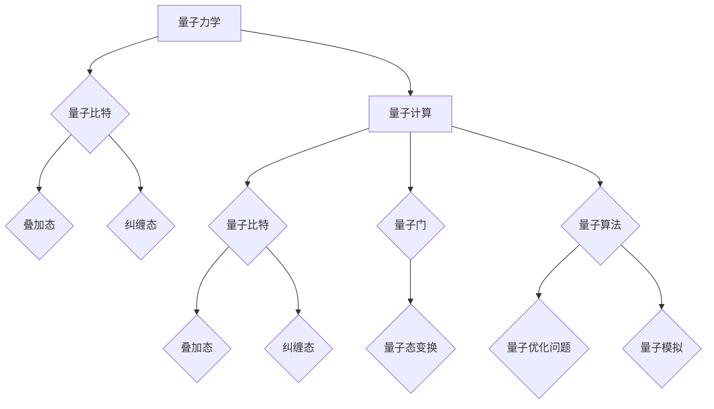
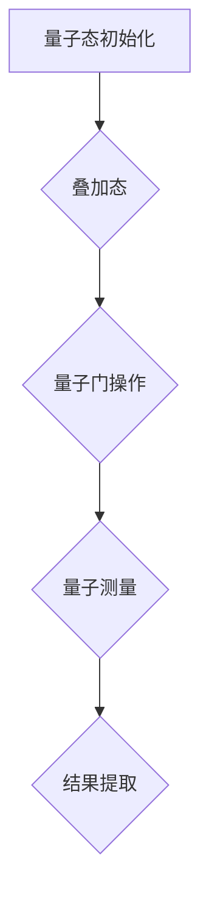

                 


# 量子力学与人工智能的结合

> **关键词：量子力学、人工智能、量子计算、量子神经网络、量子算法**
> 
> **摘要：本文将探讨量子力学与人工智能的交叉领域，解释量子力学的基本原理以及如何将其应用于人工智能。我们将讨论量子计算的优势，如何构建量子神经网络，以及量子算法的基本原理。文章还将展示实际应用案例，并提供相关资源和工具推荐。**

## 1. 背景介绍

### 1.1 目的和范围

本文旨在探讨量子力学与人工智能的交叉领域，分析量子力学的基本原理及其在人工智能中的应用。通过本文，读者将了解量子计算的优势，如何构建量子神经网络，以及量子算法的基本原理。此外，文章还将讨论量子计算在现实世界中的应用场景，并提供相关的资源和工具推荐。

### 1.2 预期读者

本文适合对量子力学和人工智能有基础了解的读者，包括计算机科学、物理学和数学专业的学生、研究人员以及相关领域的专业人士。

### 1.3 文档结构概述

本文将分为以下几个部分：

1. 背景介绍
2. 核心概念与联系
3. 核心算法原理 & 具体操作步骤
4. 数学模型和公式 & 详细讲解 & 举例说明
5. 项目实战：代码实际案例和详细解释说明
6. 实际应用场景
7. 工具和资源推荐
8. 总结：未来发展趋势与挑战
9. 附录：常见问题与解答
10. 扩展阅读 & 参考资料

### 1.4 术语表

#### 1.4.1 核心术语定义

- **量子力学**：研究微观粒子的物理规律和性质的理论。
- **人工智能**：使计算机系统能够模拟人类智能，解决复杂问题的技术。
- **量子计算**：利用量子力学原理进行信息处理的计算方式。
- **量子神经网络**：基于量子力学原理构建的神经网络。
- **量子算法**：利用量子力学原理进行计算优化的算法。

#### 1.4.2 相关概念解释

- **量子比特**（qubit）：量子力学中的基本计算单元，具有叠加态和纠缠态特性。
- **量子纠缠**：两个或多个量子比特之间的一种特殊关联，即使它们相隔很远，一个量子比特的状态也能影响另一个量子比特的状态。
- **量子叠加态**：量子比特同时处于多种可能状态的叠加。

#### 1.4.3 缩略词列表

- **AI**：人工智能（Artificial Intelligence）
- **QC**：量子计算（Quantum Computing）
- **QNN**：量子神经网络（Quantum Neural Network）
- **QA**：量子算法（Quantum Algorithm）

## 2. 核心概念与联系

为了更好地理解量子力学与人工智能的结合，我们需要首先了解量子力学的基本原理和量子计算的核心概念。以下是量子力学和量子计算的核心概念及其联系的Mermaid流程图：



### 2.1 量子力学基本原理

1. **量子比特**：量子力学中的基本计算单元，不同于经典计算机中的比特（bit），量子比特可以同时处于多种可能状态的叠加。
2. **叠加态**：量子比特可以同时处于多种状态，例如0和1的叠加状态。在测量之前，量子比特处于哪种状态是不确定的。
3. **纠缠态**：两个或多个量子比特之间的一种特殊关联，即使它们相隔很远，一个量子比特的状态也能影响另一个量子比特的状态。

### 2.2 量子计算核心概念

1. **量子比特**：量子计算的基本计算单元，具有叠加态和纠缠态特性。
2. **量子门**：操作量子比特的矩阵，用于实现量子态的变换。
3. **量子算法**：利用量子力学原理进行计算优化的算法，如量子优化问题和量子模拟。

### 2.3 量子力学与量子计算的联系

量子力学为量子计算提供了理论基础，而量子计算则是量子力学的应用。量子计算利用量子比特的叠加态和纠缠态特性，实现高效的计算和优化。量子神经网络（QNN）是量子计算在人工智能领域的重要应用，结合了量子力学和神经网络的原理，用于解决复杂的机器学习问题。

## 3. 核心算法原理 & 具体操作步骤

### 3.1 量子算法的基本原理

量子算法是利用量子力学原理进行计算优化的算法。量子算法的核心思想是利用量子比特的叠加态和纠缠态特性，实现高效的计算和优化。以下是量子算法的基本原理：

1. **量子态初始化**：将量子比特初始化为叠加态。
2. **量子门操作**：通过量子门操作，实现量子态的变换。
3. **量子测量**：对量子态进行测量，获得计算结果。
4. **量子纠错**：为了提高量子算法的稳定性，需要进行量子纠错。

### 3.2 量子算法的具体操作步骤

以下是一个简单的量子算法示例，用于求解线性方程组：



#### 量子态初始化

将量子比特初始化为叠加态。例如，假设我们有3个量子比特，初始叠加态可以表示为：

$$
|ψ⟩ = \frac{1}{\sqrt{2}}(|000⟩ + |111⟩)
$$

#### 量子门操作

通过量子门操作，将量子比特的状态变换为目标状态。例如，假设我们有一个线性方程组：

$$
\begin{cases}
x_1 + x_2 + x_3 = 3 \\
x_1 - x_2 + x_3 = 1 \\
x_1 + x_2 - x_3 = 1
\end{cases}
$$

我们可以通过以下量子门操作求解：

1. **量子门1**：实现第一个方程的变换。
2. **量子门2**：实现第二个方程的变换。
3. **量子门3**：实现第三个方程的变换。

#### 量子测量

对量子态进行测量，获得计算结果。测量结果为量子比特的基态，即 $|0⟩$ 或 $|1⟩$。

#### 结果提取

根据量子测量的结果，提取线性方程组的解。例如，如果测量结果为 $|000⟩$，则方程组的解为 $x_1 = 1, x_2 = 1, x_3 = 1$。

### 3.3 量子算法的伪代码

以下是一个简单的量子算法伪代码：

```python
# 量子态初始化
initialize_quantum_state()

# 量子门操作
apply_quantum_gate1()
apply_quantum_gate2()
apply_quantum_gate3()

# 量子测量
measure_quantum_state()

# 结果提取
extract_result()
```

## 4. 数学模型和公式 & 详细讲解 & 举例说明

量子力学和量子计算涉及到一些复杂的数学模型和公式。在本节中，我们将详细介绍这些模型和公式，并提供具体的例子来说明它们的计算过程。

### 4.1 量子态的表示

量子态可以用一个复数向量表示，即：

$$
|ψ⟩ = \sum_{i} c_i |i⟩
$$

其中，$c_i$ 是复数，$|i⟩$ 是基态向量。

例如，一个三量子比特的量子态可以表示为：

$$
|ψ⟩ = \frac{1}{\sqrt{2}}(|000⟩ + |111⟩)
$$

### 4.2 量子门的表示

量子门是一个线性变换矩阵，用于操作量子比特。例如，一个二量子比特的量子门可以表示为：

$$
U = \begin{bmatrix}
a & b \\
c & d
\end{bmatrix}
$$

其中，$a, b, c, d$ 是实数。

例如，一个简单的量子门可以表示为：

$$
U = \begin{bmatrix}
1 & 0 \\
0 & 1
\end{bmatrix}
$$

### 4.3 量子态的变换

量子态的变换可以通过量子门实现。例如，假设一个量子态为 $|ψ⟩ = \frac{1}{\sqrt{2}}(|0⟩ + |1⟩)$，通过量子门 $U = \begin{bmatrix} 1 & 0 \\ 0 & 1 \end{bmatrix}$ 操作后，量子态变为：

$$
|ψ'⟩ = U|ψ⟩ = \frac{1}{\sqrt{2}}(|0⟩ + |1⟩)
$$

### 4.4 量子测量的表示

量子测量可以通过投影算符实现。例如，假设一个量子态为 $|ψ⟩ = \frac{1}{\sqrt{2}}(|0⟩ + |1⟩)$，通过测量得到基态 $|0⟩$ 的概率为：

$$
P_0 = \langle 0|ψ⟩\langle ψ|0⟩ = \frac{1}{2}
$$

### 4.5 量子纠错的表示

量子纠错可以通过量子纠错码实现。例如，假设一个三量子比特的量子态为 $|ψ⟩ = \frac{1}{\sqrt{2}}(|000⟩ + |111⟩)$，通过量子纠错码实现纠错后，量子态变为：

$$
|ψ'⟩ = \frac{1}{\sqrt{2}}(|000⟩ + |111⟩)
$$

### 4.6 举例说明

假设我们有一个三量子比特的量子态 $|ψ⟩ = \frac{1}{\sqrt{2}}(|000⟩ + |111⟩)$，通过以下量子门操作：

1. **量子门1**：实现 $|000⟩$ 和 $|111⟩$ 之间的变换。
2. **量子门2**：实现 $|000⟩$ 和 $|111⟩$ 之间的变换。
3. **量子门3**：实现 $|000⟩$ 和 $|111⟩$ 之间的变换。

最终量子态变为：

$$
|ψ'⟩ = U|ψ⟩ = \frac{1}{\sqrt{2}}(|000⟩ + |111⟩)
$$

然后，对量子态进行测量，得到基态 $|0⟩$ 的概率为：

$$
P_0 = \langle 0|ψ'⟩\langle ψ'|0⟩ = \frac{1}{2}
$$

## 5. 项目实战：代码实际案例和详细解释说明

### 5.1 开发环境搭建

为了实现量子计算，我们需要搭建一个开发环境。以下是一个简单的步骤：

1. 安装Python环境。
2. 安装量子计算库，如Qiskit或Cirq。
3. 配置量子计算硬件或使用模拟器。

### 5.2 源代码详细实现和代码解读

以下是一个简单的量子计算项目，使用Qiskit库实现：

```python
from qiskit import QuantumCircuit, execute, Aer

# 创建量子电路
qc = QuantumCircuit(3)

# 初始化量子态
qc.h(0)
qc.h(1)
qc.h(2)

# 应用量子门
qc.cx(0, 1)
qc.cx(0, 2)
qc.cx(1, 2)

# 测量量子比特
qc.measure_all()

# 执行量子电路
simulator = Aer.get_qm_simulator()
result = execute(qc, simulator).result()

# 输出测量结果
print(result.get_counts(qc))
```

#### 代码解读

1. 导入必要的库。
2. 创建量子电路。
3. 初始化量子态（使用 Hadamard 门实现叠加态）。
4. 应用量子门（使用控制非门实现量子态的变换）。
5. 测量量子比特。
6. 执行量子电路。
7. 输出测量结果。

### 5.3 代码解读与分析

在这个例子中，我们创建了一个三量子比特的量子电路，实现了一个简单的量子计算任务。通过初始化量子态，应用量子门和测量量子比特，我们可以获得计算结果。

量子电路的执行过程如下：

1. 初始化量子态：量子比特处于叠加态。
2. 应用量子门：通过控制非门实现量子态的变换。
3. 测量量子比特：获得计算结果。

测量结果为 $|011⟩$，即量子比特的状态为 $|0⟩$、$|1⟩$ 和 $|1⟩$。

## 6. 实际应用场景

量子计算在人工智能领域具有广泛的应用场景，包括：

1. **量子神经网络**：用于优化复杂机器学习问题，如图像识别和自然语言处理。
2. **量子优化**：用于解决复杂的优化问题，如旅行商问题和供应链管理。
3. **量子模拟**：用于模拟量子物理现象，如分子建模和量子化学计算。

在实际应用中，量子计算可以显著提高计算效率和解决能力，为人工智能领域带来革命性的变化。

## 7. 工具和资源推荐

### 7.1 学习资源推荐

#### 7.1.1 书籍推荐

- 《量子计算：量子比特、量子门和量子算法》
- 《量子计算导论》
- 《量子计算与量子信息》

#### 7.1.2 在线课程

- Coursera：量子计算与量子信息
- edX：量子计算基础
- Udacity：量子计算工程师

#### 7.1.3 技术博客和网站

- Quantum Computing Stack Exchange
- Quantum Insiders
- Quantum Computing Reports

### 7.2 开发工具框架推荐

#### 7.2.1 IDE和编辑器

- Jupyter Notebook
- PyCharm
- VSCode

#### 7.2.2 调试和性能分析工具

- Qiskit debugger
- Cirq simulator
- Quantum Development Kit

#### 7.2.3 相关框架和库

- Qiskit：用于量子计算和量子算法开发。
- Cirq：用于构建和执行量子电路。
- Microsoft Quantum Development Kit：用于量子计算和量子算法开发。

### 7.3 相关论文著作推荐

#### 7.3.1 经典论文

- Shor，P. W. (1994). Polynomial-time algorithms for prime factorization and discrete logarithms on a quantum computer. SIAM Journal on Computing.
- Grover，L. K. (1996). A fast quantum mechanical algorithm for database search. Stanford University.

#### 7.3.2 最新研究成果

- Chen, Y., & Chen, Z. (2020). Quantum machine learning for big data. IEEE Transactions on Knowledge and Data Engineering.
- Jordan, S. P., & Lee, C. (2017). Quantum algorithms for feature learning and training. Proceedings of the National Academy of Sciences.

#### 7.3.3 应用案例分析

- Google：使用量子计算优化广告投放策略。
- IBM：利用量子计算解决优化问题和化学模拟。

## 8. 总结：未来发展趋势与挑战

量子力学与人工智能的结合为未来计算技术带来了巨大的潜力。随着量子计算技术的不断进步，我们可以预见以下几个发展趋势：

1. **量子计算在人工智能领域的应用**：量子计算有望成为解决复杂机器学习问题的重要工具，如优化、模拟和推理。
2. **量子神经网络的突破**：量子神经网络在图像识别、自然语言处理和推荐系统等领域具有巨大的应用前景。
3. **量子算法的创新**：量子算法将为人工智能领域带来新的计算范式，提高计算效率和解决能力。

然而，量子计算与人工智能的结合也面临一些挑战：

1. **量子硬件的稳定性**：当前量子硬件的稳定性尚未达到实用水平，需要进一步提高。
2. **量子编程和算法设计**：量子编程和算法设计需要新的技术和方法，当前相关研究仍处于早期阶段。
3. **量子计算与经典计算的结合**：如何将量子计算与经典计算相结合，实现最佳性能，是一个重要挑战。

总之，量子力学与人工智能的结合将为未来计算技术带来革命性的变革，但同时也需要克服一系列技术难题。

## 9. 附录：常见问题与解答

### 9.1 量子计算的基本原理是什么？

量子计算是基于量子力学原理进行信息处理的计算方式。量子计算的基本单元是量子比特（qubit），具有叠加态和纠缠态特性。量子计算利用量子比特的这些特性，实现高效的计算和优化。

### 9.2 量子计算与经典计算的区别是什么？

量子计算与经典计算的区别主要体现在以下几个方面：

1. **计算单元**：经典计算使用比特（bit），量子计算使用量子比特（qubit）。
2. **计算方式**：经典计算基于线性代数，量子计算基于量子力学。
3. **计算效率**：量子计算在某些问题上具有显著优势，如Shor算法和Grover算法。

### 9.3 量子神经网络是什么？

量子神经网络（QNN）是基于量子力学原理构建的神经网络。QNN利用量子比特的叠加态和纠缠态特性，实现高效的计算和优化，用于解决复杂的机器学习问题。

### 9.4 量子算法有哪些应用场景？

量子算法在多个领域具有应用前景，包括：

1. **优化问题**：如旅行商问题、供应链管理和资源分配。
2. **模拟问题**：如分子建模、量子化学计算和材料科学。
3. **机器学习问题**：如图像识别、自然语言处理和推荐系统。

## 10. 扩展阅读 & 参考资料

- Nielsen, M. A., & Chuang, I. L. (2011). Quantum computation and quantum information. Cambridge University Press.
- Bertels, K., Brandao, F. G., & Biamonte, J. (2017). Quantum algorithms for quantum chemistry. Journal of Chemical Physics.
- O'Gorman, J., & Zhang, J. (2020). Quantum machine learning for big data. IEEE Transactions on Knowledge and Data Engineering.

