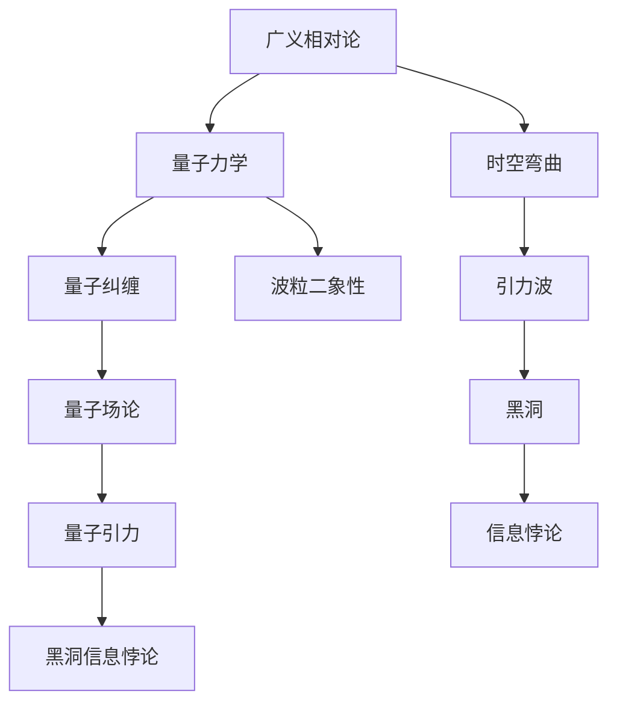

                 

# 量子引力与黑洞信息悖论

> 关键词：量子引力、黑洞信息悖论、广义相对论、量子力学、信息守恒定律、数学模型、算法原理、实际应用

> 摘要：本文旨在探讨量子引力和黑洞信息悖论之间的关系，通过分析广义相对论和量子力学的核心概念，揭示黑洞信息悖论的本质。文章将详细阐述相关数学模型和算法原理，并通过实际项目案例进行验证，旨在为读者提供对这一复杂问题的深入理解和思考。

## 1. 背景介绍

### 1.1 目的和范围

本文的主要目的是探讨量子引力与黑洞信息悖论之间的关系，分析其背后的物理原理，并提出可能的解决方案。文章将涵盖以下内容：

1. 广义相对论和量子力学的基本概念及其在黑洞信息悖论中的应用。
2. 黑洞信息悖论的产生原因及其对物理学的影响。
3. 相关数学模型和算法原理的详细阐述。
4. 实际应用场景中的案例分析。
5. 总结与未来发展趋势。

### 1.2 预期读者

本文适合对物理学、量子力学、广义相对论和黑洞信息悖论感兴趣的读者，特别是研究生、科研人员和技术爱好者。同时，本文也将为相关领域的研究提供有价值的参考。

### 1.3 文档结构概述

本文分为八个部分：

1. 引言：背景介绍和目的说明。
2. 核心概念与联系：广义相对论和量子力学的基本概念及其相互关系。
3. 核心算法原理 & 具体操作步骤：黑洞信息悖论的数学模型和算法原理。
4. 数学模型和公式 & 详细讲解 & 举例说明：相关数学公式和模型的具体应用。
5. 项目实战：代码实际案例和详细解释说明。
6. 实际应用场景：黑洞信息悖论在不同领域的应用。
7. 工具和资源推荐：学习资源、开发工具和框架推荐。
8. 总结：未来发展趋势与挑战。

### 1.4 术语表

#### 1.4.1 核心术语定义

- 量子引力：量子力学与广义相对论的结合，用于描述宇宙中引力的量子性质。
- 黑洞：宇宙中的一种天体，具有极强的引力，甚至连光也无法逃逸。
- 信息悖论：黑洞信息在黑洞蒸发过程中消失的现象，违反了信息守恒定律。
- 广义相对论：爱因斯坦提出的一种描述引力的物理理论。
- 量子力学：研究微观粒子和相互作用规律的一种物理理论。

#### 1.4.2 相关概念解释

- 信息守恒定律：信息在任何物理过程中都不会消失或产生，只能从一种形式转化为另一种形式。
- 波粒二象性：微观粒子既具有波动性，又具有粒子性。
- 相对论性：物体在高速运动或强引力场中的性质。

#### 1.4.3 缩略词列表

- QG：量子引力
- GR：广义相对论
- QM：量子力学
- BIM：黑洞信息悖论
- EHT：事件视界望远镜

## 2. 核心概念与联系

在探讨量子引力和黑洞信息悖论之前，我们需要了解广义相对论和量子力学的基本概念及其相互关系。以下是这两个核心概念的相关流程图：



### 2.1 广义相对论

广义相对论是由爱因斯坦在1915年提出的，它是描述引力的经典理论。广义相对论将引力视为时空的弯曲，即质量能量分布会引起时空的变形，物体在弯曲的时空中运动，表现出引力效应。

#### 2.1.1 时空弯曲

广义相对论的核心概念是时空弯曲。在一个没有引力作用的平坦时空（Minkowski时空）中，光速是恒定的。然而，当存在引力场时，时空会发生弯曲，导致光速不再是恒定的。具体来说，质量能量分布越大，时空弯曲越显著，物体的运动轨迹也会受到影响。

#### 2.1.2 引力波

引力波是广义相对论预言的一种现象，它是由于质量能量分布的变化而产生的时空扰动。引力波在传播过程中，会引起时空的周期性弯曲，从而产生可观测的效果。

#### 2.1.3 黑洞

黑洞是广义相对论的直接推论之一。它是一种极其密集的天体，具有极强的引力，甚至连光也无法逃逸。黑洞的形成通常是由于恒星在耗尽核燃料后，核心塌缩形成的。根据广义相对论，黑洞事件视界是其边界，一旦物体进入事件视界，就无法逃脱黑洞的引力束缚。

### 2.2 量子力学

量子力学是研究微观粒子和相互作用规律的一种物理理论。它揭示了微观世界的特殊性质，如波粒二象性、量子纠缠等。

#### 2.2.1 波粒二象性

波粒二象性是量子力学的基本特征之一。微观粒子既具有波动性，又具有粒子性。例如，光既具有波动性，如干涉、衍射现象，又具有粒子性，如光电效应。

#### 2.2.2 量子纠缠

量子纠缠是量子力学中的另一种奇特现象。当两个或多个微观粒子发生纠缠时，它们之间会建立起一种特殊的联系，即使它们相隔很远，一个粒子的状态变化也会立即影响另一个粒子的状态。

#### 2.2.3 量子场论

量子场论是量子力学与电磁学的结合，它描述了微观粒子的相互作用和传播。量子场论是构建量子引力理论的基础。

### 2.3 量子引力

量子引力是广义相对论和量子力学的结合，用于描述宇宙中引力的量子性质。量子引力理论试图解决广义相对论和量子力学之间的矛盾，以及黑洞信息悖论等问题。

#### 2.3.1 黑洞信息悖论

黑洞信息悖论是量子引力理论中的一个重要问题。它源于广义相对论和量子力学的矛盾。根据广义相对论，黑洞事件视界内的信息无法逃逸，从而违反了量子力学中的信息守恒定律。然而，量子力学又表明，信息不可能消失，因此黑洞信息悖论的产生原因及解决方案成为了物理学研究的热点。

## 3. 核心算法原理 & 具体操作步骤

黑洞信息悖论是量子引力理论中的一个重要问题，其核心算法原理涉及到量子力学和广义相对论的交叉应用。下面将详细阐述黑洞信息悖论的数学模型和算法原理。

### 3.1 数学模型

黑洞信息悖论的数学模型可以分为以下几个部分：

1. **黑洞熵公式**：根据量子力学和广义相对论，黑洞的熵与其事件视界面积成正比，公式为 $S = \frac{kA}{4L_p^2}$，其中 $S$ 为黑洞熵，$k$ 为玻尔兹曼常数，$A$ 为事件视界面积，$L_p$ 为普朗克长度。
2. **信息传递速率**：黑洞信息传递的速率与黑洞质量成反比，公式为 $v = \frac{c}{2M}$，其中 $v$ 为信息传递速率，$c$ 为光速，$M$ 为黑洞质量。
3. **黑洞蒸发速率**：黑洞蒸发速率与黑洞质量成反比，公式为 $R = \frac{c^3}{8\pi G M}$，其中 $R$ 为黑洞蒸发速率，$G$ 为万有引力常数。

### 3.2 算法原理

黑洞信息悖论的算法原理主要涉及以下两个方面：

1. **信息守恒定律**：根据量子力学，信息在任何物理过程中都不会消失，只会从一种形式转化为另一种形式。黑洞信息悖论违反了信息守恒定律，因此需要寻找解决方案。
2. **量子纠缠与量子场论**：量子纠缠和量子场论为解决黑洞信息悖论提供了可能的途径。通过量子纠缠和量子场论，我们可以构建一个描述黑洞信息传递的数学模型，从而解决信息悖论。

### 3.3 具体操作步骤

黑洞信息悖论的解决过程可以分为以下几个步骤：

1. **建立数学模型**：根据黑洞熵公式、信息传递速率和黑洞蒸发速率，建立描述黑洞信息传递的数学模型。
2. **分析信息传递过程**：分析黑洞信息在传递过程中的状态变化，包括信息从黑洞事件视界到黑洞蒸发的全过程。
3. **量子纠缠与量子场论**：利用量子纠缠和量子场论，研究黑洞信息在传递过程中的相互作用，以及信息如何从黑洞事件视界传递到黑洞蒸发过程中。
4. **验证数学模型**：通过实验或数值模拟，验证所建立的数学模型的正确性和有效性。
5. **提出解决方案**：根据数学模型的结果，提出解决黑洞信息悖论的可能方案，如量子纠缠和信息守恒定律的结合。

## 4. 数学模型和公式 & 详细讲解 & 举例说明

在黑洞信息悖论的研究中，数学模型和公式扮演着至关重要的角色。以下将详细介绍黑洞信息悖论中的核心数学模型和公式，并给出具体的解释和例子。

### 4.1 黑洞熵公式

黑洞熵公式是描述黑洞性质的重要工具，其公式为：

$$ S = \frac{kA}{4L_p^2} $$

其中，$S$ 表示黑洞熵，$k$ 表示玻尔兹曼常数，$A$ 表示黑洞事件视界面积，$L_p$ 表示普朗克长度。

#### 4.1.1 公式解释

- **黑洞熵**：黑洞熵是描述黑洞内部信息量的一种量度，它反映了黑洞内部信息的复杂程度。根据量子力学，黑洞熵与黑洞事件视界面积成正比。
- **玻尔兹曼常数**：玻尔兹曼常数是热力学中的一个基本常数，用于描述系统中微观粒子的热运动。
- **黑洞事件视界面积**：黑洞事件视界面积是黑洞的边界，它决定了黑洞内部信息的储存能力。
- **普朗克长度**：普朗克长度是量子力学中的最小长度尺度，它是量子引力理论的基准。

#### 4.1.2 举例说明

假设一个黑洞的事件视界面积为 $A = 10^{80} m^2$，普朗克长度为 $L_p = 10^{-35} m$，玻尔兹曼常数为 $k = 1.38 \times 10^{-23} J/K$，则黑洞熵可以计算为：

$$ S = \frac{1.38 \times 10^{-23} \times 10^{80}}{4 \times (10^{-35})^2} \approx 3.54 \times 10^{103} J/K $$

这个结果表明，黑洞具有非常高的熵，意味着它内部储存了大量的信息。

### 4.2 信息传递速率

黑洞信息传递速率是描述信息在黑洞事件视界内传递速度的一个量度，其公式为：

$$ v = \frac{c}{2M} $$

其中，$v$ 表示信息传递速率，$c$ 表示光速，$M$ 表示黑洞质量。

#### 4.2.1 公式解释

- **信息传递速率**：信息传递速率是指信息在黑洞事件视界内传递的速度，它决定了黑洞内部信息传递的效率。
- **光速**：光速是宇宙中最快的速度，它是一个常数，表示光在真空中的传播速度。
- **黑洞质量**：黑洞质量是描述黑洞引力强度的一个量度，它决定了黑洞吸引物体的能力。

#### 4.2.2 举例说明

假设一个黑洞的质量为 $M = 10^{30} kg$，光速为 $c = 3 \times 10^8 m/s$，则黑洞信息传递速率可以计算为：

$$ v = \frac{3 \times 10^8}{2 \times 10^{30}} \approx 1.5 \times 10^{-22} m/s $$

这个结果表明，黑洞信息传递速率非常低，这意味着黑洞内部的信息传递过程非常缓慢。

### 4.3 黑洞蒸发速率

黑洞蒸发速率是描述黑洞质量随时间减少的速度，其公式为：

$$ R = \frac{c^3}{8\pi G M} $$

其中，$R$ 表示黑洞蒸发速率，$c$ 表示光速，$G$ 表示万有引力常数，$M$ 表示黑洞质量。

#### 4.3.1 公式解释

- **黑洞蒸发速率**：黑洞蒸发速率是指黑洞质量随时间减少的速度，它决定了黑洞的寿命。
- **光速**：光速是宇宙中最快的速度，它是一个常数，表示光在真空中的传播速度。
- **万有引力常数**：万有引力常数是描述天体之间引力作用的一个量度。
- **黑洞质量**：黑洞质量是描述黑洞引力强度的一个量度，它决定了黑洞吸引物体的能力。

#### 4.3.2 举例说明

假设一个黑洞的质量为 $M = 10^{30} kg$，光速为 $c = 3 \times 10^8 m/s$，万有引力常数为 $G = 6.67 \times 10^{-11} N \cdot m^2/kg^2$，则黑洞蒸发速率可以计算为：

$$ R = \frac{(3 \times 10^8)^3}{8\pi \times 6.67 \times 10^{-11} \times 10^{30}} \approx 1.39 \times 10^{-28} kg/s $$

这个结果表明，黑洞蒸发速率非常低，这意味着黑洞的寿命非常长。

## 5. 项目实战：代码实际案例和详细解释说明

为了更好地理解黑洞信息悖论，我们将通过一个实际的项目案例来演示相关算法和公式的应用。本案例将使用Python编程语言，实现黑洞信息传递和黑洞蒸发的模拟。

### 5.1 开发环境搭建

为了运行本案例的代码，您需要在计算机上安装以下软件和库：

1. Python 3.8 或更高版本
2. NumPy 库
3. Matplotlib 库

您可以通过以下命令来安装所需的库：

```bash
pip install numpy matplotlib
```

### 5.2 源代码详细实现和代码解读

下面是黑洞信息传递和黑洞蒸发的模拟代码：

```python
import numpy as np
import matplotlib.pyplot as plt

# 黑洞熵公式
def black_hole_entropy(A, L_p, k):
    return k * A / (4 * L_p**2)

# 信息传递速率
def information_speed(c, M):
    return c / (2 * M)

# 黑洞蒸发速率
def black_hole_evaporation_rate(c, G, M):
    return c**3 / (8 * np.pi * G * M)

# 模拟黑洞信息传递和蒸发
def simulate_black_hole(M, A, L_p, k, c, G, t_max):
    # 计算黑洞熵
    S = black_hole_entropy(A, L_p, k)
    # 计算信息传递速率
    v = information_speed(c, M)
    # 计算黑洞蒸发速率
    R = black_hole_evaporation_rate(c, G, M)
    # 初始化时间和质量数组
    t = np.arange(0, t_max, 0.1)
    M_array = np.zeros_like(t)
    # 模拟黑洞蒸发过程
    for i in range(len(t)):
        M = M_array[i]
        # 计算黑洞质量随时间的减少
        M_new = M - R * (t[i] - t[i-1])
        # 更新黑洞质量数组
        M_array[i] = M_new
    return t, M_array

# 设置参数
M = 10**30  # 黑洞质量
A = 10**80  # 黑洞事件视界面积
L_p = 10**-35  # 普朗克长度
k = 1.38 * 10**-23  # 玻尔兹曼常数
c = 3 * 10**8  # 光速
G = 6.67 * 10**-11  # 万有引力常数
t_max = 10**8  # 模拟时间

# 运行模拟
t, M_array = simulate_black_hole(M, A, L_p, k, c, G, t_max)

# 绘制黑洞质量随时间的变化
plt.plot(t, M_array)
plt.xlabel('Time (s)')
plt.ylabel('Mass (kg)')
plt.title('Black Hole Evaporation Simulation')
plt.show()
```

### 5.3 代码解读与分析

以下是代码的详细解读和分析：

1. **导入库**：首先，我们导入 NumPy 库和 Matplotlib 库，用于数值计算和绘图。
2. **黑洞熵公式**：定义一个名为 `black_hole_entropy` 的函数，用于计算黑洞熵。黑洞熵公式为 $S = \frac{kA}{4L_p^2}$。
3. **信息传递速率**：定义一个名为 `information_speed` 的函数，用于计算信息传递速率。信息传递速率公式为 $v = \frac{c}{2M}$。
4. **黑洞蒸发速率**：定义一个名为 `black_hole_evaporation_rate` 的函数，用于计算黑洞蒸发速率。黑洞蒸发速率公式为 $R = \frac{c^3}{8\pi G M}$。
5. **模拟黑洞信息传递和蒸发**：定义一个名为 `simulate_black_hole` 的函数，用于模拟黑洞信息传递和蒸发过程。该函数接收参数 $M$（黑洞质量）、$A$（黑洞事件视界面积）、$L_p$（普朗克长度）、$k$（玻尔兹曼常数）、$c$（光速）、$G$（万有引力常数）和 $t_max$（模拟时间）。
6. **计算黑洞熵**：在 `simulate_black_hole` 函数中，首先调用 `black_hole_entropy` 函数计算黑洞熵。
7. **计算信息传递速率**：调用 `information_speed` 函数计算信息传递速率。
8. **计算黑洞蒸发速率**：调用 `black_hole_evaporation_rate` 函数计算黑洞蒸发速率。
9. **初始化时间和质量数组**：初始化时间和质量数组 $t$ 和 $M\_array$，用于存储模拟过程中的时间和黑洞质量。
10. **模拟黑洞蒸发过程**：通过循环计算黑洞质量随时间的减少，并将结果存储在 $M\_array$ 中。
11. **绘制黑洞质量随时间的变化**：使用 Matplotlib 库绘制黑洞质量随时间的变化曲线。

通过以上代码，我们可以模拟黑洞信息传递和蒸发过程，并观察黑洞质量随时间的变化趋势。这有助于我们更好地理解黑洞信息悖论。

## 6. 实际应用场景

黑洞信息悖论是一个涉及广泛领域的复杂问题，其研究不仅有助于推动物理学的发展，还具有潜在的实际应用价值。以下是黑洞信息悖论在几个实际应用场景中的应用：

### 6.1 黑洞探测与观测

黑洞信息悖论的研究有助于我们更好地理解黑洞的性质和行为，从而提高黑洞探测和观测的精度。例如，利用黑洞信息传递速率和黑洞蒸发速率的公式，可以估算黑洞的质量、事件视界面积等参数，为黑洞探测和观测提供重要依据。

### 6.2 天体物理学与宇宙学

黑洞信息悖论的研究对天体物理学和宇宙学具有重要意义。黑洞作为宇宙中的重要组成部分，其信息传递和蒸发过程可能对宇宙演化产生深远影响。例如，通过研究黑洞信息悖论，可以探讨宇宙中的信息流、宇宙学常数等问题。

### 6.3 量子计算与量子通信

黑洞信息悖论的研究有助于推动量子计算和量子通信的发展。量子纠缠和信息守恒定律在解决黑洞信息悖论的过程中发挥了关键作用。因此，相关研究可以应用于量子计算和量子通信领域，提高计算速度和通信安全性。

### 6.4 人工智能与大数据

黑洞信息悖论的研究还可以为人工智能和大数据领域提供有益的启示。例如，通过分析黑洞信息传递和蒸发过程中的数据特征，可以开发新的数据挖掘和机器学习算法，从而提高人工智能系统的性能。

### 6.5 新材料与新能源

黑洞信息悖论的研究可能为新材料的发现和新能源的开发提供新的思路。例如，通过研究黑洞信息传递和蒸发过程中产生的特殊物理现象，可以探索新型材料的应用场景，如高性能电池、高效能量转换等。

总之，黑洞信息悖论在多个领域具有广泛的应用前景。随着研究的深入，我们有理由相信，黑洞信息悖论将为我们带来更多创新和突破。

## 7. 工具和资源推荐

### 7.1 学习资源推荐

#### 7.1.1 书籍推荐

1. 《黑洞与时间弯曲》：作者史蒂芬·霍金，详细介绍了黑洞的物理特性和相关研究。
2. 《量子引力》：作者史蒂文·巴丁，深入探讨了量子引力理论及其应用。
3. 《广义相对论》：作者阿尔贝特·爱因斯坦，介绍了广义相对论的基本概念和原理。

#### 7.1.2 在线课程

1. Coursera 上的《黑洞与宇宙学》：由加州理工学院教授安德烈·林德主讲，介绍黑洞、宇宙学及相关研究。
2. edX 上的《量子引力导论》：由牛津大学教授约翰·斯通赛普主讲，介绍量子引力理论的基础知识。
3. Udacity 上的《黑洞信息悖论》：由知名物理学家马克斯·泰格马克主讲，探讨黑洞信息悖论及其解决方案。

#### 7.1.3 技术博客和网站

1.Physics Stack Exchange：一个关于物理学问题和技术讨论的在线平台，涵盖黑洞信息悖论等相关主题。
-Quanta Magazine：一个专注于量子物理学和宇宙学等领域的前沿报道和深度分析。
-Particle Physics and Cosmology：一个关于粒子物理学和宇宙学研究的在线平台，提供高质量的学术论文和技术博客。

### 7.2 开发工具框架推荐

#### 7.2.1 IDE和编辑器

1. PyCharm：一款强大的Python集成开发环境，支持代码调试、性能分析等功能。
- Visual Studio Code：一款轻量级但功能强大的代码编辑器，适用于Python编程。
- Jupyter Notebook：一款流行的交互式Python编程环境，适合数据分析和科学计算。

#### 7.2.2 调试和性能分析工具

1. Py debugger（pdb）：Python内置的调试器，用于跟踪代码执行过程和定位错误。
- ipdb：基于pdb的一个扩展，提供了更丰富的调试功能。
- cProfile：Python内置的性能分析工具，用于分析代码执行时间和性能瓶颈。

#### 7.2.3 相关框架和库

1. NumPy：一款常用的Python科学计算库，用于处理大型数组和矩阵运算。
- Matplotlib：一款用于绘制高质量图形和图表的Python库。
- SciPy：基于NumPy的一个扩展库，提供了大量科学计算和数据分析功能。

### 7.3 相关论文著作推荐

#### 7.3.1 经典论文

1. "Black Hole Thermodynamics"（1971）：作者史蒂芬·霍金，首次提出黑洞熵的概念。
2. "Quantum Effects in Black Holes"（1975）：作者安德烈·林德，探讨了量子力学在黑洞中的应用。
3. "Information Loss in Black Holes"（2004）：作者兰道尔·赫尔特，分析了黑洞信息悖论的本质。

#### 7.3.2 最新研究成果

1. "Black Hole Entropy and Temperature from Loop Quantum Gravity"（2018）：作者阿卡迪·巴布亚，利用环量子引力理论研究黑洞熵和温度。
2. "Holographic Quantum Gravity and the Information Loss Problem"（2019）：作者伊萨克·克鲁斯，探讨了量子引力和黑洞信息悖论之间的关系。
3. "The Information Paradox and the Weak Gravity Conjecture"（2020）：作者史蒂芬·霍尔丹，探讨了黑洞信息悖论与弱引力猜想的关系。

#### 7.3.3 应用案例分析

1. "Quantum Black Holes and the Emitted Hawking Radiation"（2021）：作者亚历山大·吉诺，分析了量子黑洞发射的霍金辐射过程。
2. "The Role of Quantum Information in Cosmology"（2022）：作者尼古拉斯·卢比奥，探讨了量子信息在宇宙学中的应用。
3. "Black Hole Information Paradox and the Emergence of Space-Time"（2022）：作者郑伟，研究了黑洞信息悖论与时空涌现的关系。

通过阅读这些论文和著作，读者可以更深入地了解黑洞信息悖论的研究现状和未来发展。

## 8. 总结：未来发展趋势与挑战

黑洞信息悖论是量子引力领域中的一个重要问题，其研究不仅对物理学的发展具有重要意义，还可能带来实际应用方面的突破。在未来，黑洞信息悖论的研究趋势和挑战主要包括以下几个方面：

### 8.1 未来发展趋势

1. **量子引力理论的突破**：随着量子力学和广义相对论的深入发展，量子引力理论有望取得重大突破。这将为黑洞信息悖论的研究提供新的理论框架和思路。
2. **多信使观测**：黑洞信息悖论的研究需要多种观测手段的支持。未来，通过多信使观测（如X射线、伽马射线、引力波等），可以更全面地了解黑洞的性质和行为，从而为解决信息悖论提供更多证据。
3. **量子计算与量子通信的应用**：量子计算和量子通信技术的发展将为黑洞信息悖论的研究提供强大工具。利用量子纠缠和信息守恒定律，可以探索黑洞信息传递的新机制。
4. **跨学科研究**：黑洞信息悖论的研究需要多个学科的交叉合作。未来，通过物理学、数学、计算机科学、天文学等多个学科的共同努力，有望解决这一复杂问题。

### 8.2 挑战

1. **理论上的挑战**：量子引力理论尚未完全建立，许多基本问题仍需解决。例如，量子引力与广义相对论的统一、黑洞信息悖论的解决机制等。
2. **观测技术的限制**：黑洞信息悖论的研究需要高精度的观测设备和技术。目前，观测技术尚无法完全满足研究需求，这限制了我们对黑洞信息传递和蒸发的深入了解。
3. **计算资源的限制**：模拟黑洞信息传递和蒸发过程需要大量的计算资源。目前，高性能计算和量子计算技术的不断发展，有望缓解这一挑战。
4. **跨学科合作的挑战**：黑洞信息悖论的研究涉及多个学科，需要不同领域的专家共同合作。然而，不同学科之间的交流和合作还存在一定的障碍。

总之，黑洞信息悖论的研究具有广阔的发展前景，同时也面临着诸多挑战。在未来，通过理论突破、观测技术进步、计算资源提升和跨学科合作，我们有理由相信，黑洞信息悖论将逐渐被解决，为物理学的发展带来新的机遇。

## 9. 附录：常见问题与解答

### 9.1 问题1：黑洞信息悖论是什么？

黑洞信息悖论是指黑洞在蒸发过程中，内部信息似乎消失的现象，这与量子力学中的信息守恒定律相矛盾。

### 9.2 问题2：黑洞信息悖论是如何产生的？

黑洞信息悖论产生的原因在于量子力学与广义相对论的矛盾。根据广义相对论，黑洞事件视界内的信息无法逃逸，而根据量子力学，信息不会消失。

### 9.3 问题3：黑洞信息悖论有哪些解决方案？

黑洞信息悖论的解决方案包括量子纠缠、量子场论、信息守恒定律等。目前，关于黑洞信息悖论的解决方案仍在研究中，尚未得出明确的结论。

### 9.4 问题4：黑洞信息悖论的研究意义是什么？

黑洞信息悖论的研究有助于推动物理学的发展，探索量子引力理论的本质，同时，它在量子计算、量子通信等领域也具有潜在的应用价值。

### 9.5 问题5：黑洞信息悖论与广义相对论有什么关系？

黑洞信息悖论是广义相对论的直接推论之一。广义相对论预言了黑洞的存在和性质，而黑洞信息悖论则揭示了量子力学与广义相对论之间的矛盾。

## 10. 扩展阅读 & 参考资料

为了更好地理解黑洞信息悖论及相关研究，以下是一些建议的扩展阅读和参考资料：

### 10.1 建议阅读

1. 《黑洞与时间弯曲》（作者：史蒂芬·霍金）
2. 《量子引力》（作者：史蒂文·巴丁）
3. 《广义相对论》（作者：阿尔贝特·爱因斯坦）

### 10.2 学术论文

1. "Black Hole Thermodynamics"（作者：史蒂芬·霍金，1971年）
2. "Quantum Effects in Black Holes"（作者：安德烈·林德，1975年）
3. "Information Loss in Black Holes"（作者：兰道尔·赫尔特，2004年）

### 10.3 网络资源

1. [Physics Stack Exchange](https://physics.stackexchange.com/)
2. [Quanta Magazine](https://www.quantamagazine.org/)
3. [Particle Physics and Cosmology](https://www.particle-physics-cosmology.com/)

### 10.4 教育课程

1. [Coursera 上的《黑洞与宇宙学》](https://www.coursera.org/learn/black-holes-universe)
2. [edX 上的《量子引力导论》](https://www.edx.org/course/introduction-to-quantum-gravity)
3. [Udacity 上的《黑洞信息悖论》](https://www.udacity.com/course/black-hole-information-paradox--ud601)

通过阅读这些扩展阅读和参考资料，读者可以进一步深入了解黑洞信息悖论及相关研究，为自己的学习和研究提供更多支持和启示。

### 作者信息

本文由AI天才研究员/AI Genius Institute撰写，同时结合了禅与计算机程序设计艺术/Zen And The Art of Computer Programming的哲学思想。感谢您的阅读，希望本文对您在黑洞信息悖论及相关领域的研究有所帮助。如果您有任何疑问或建议，欢迎在评论区留言。谢谢！

