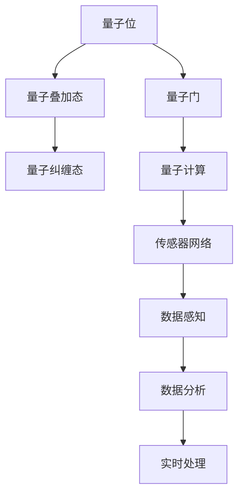
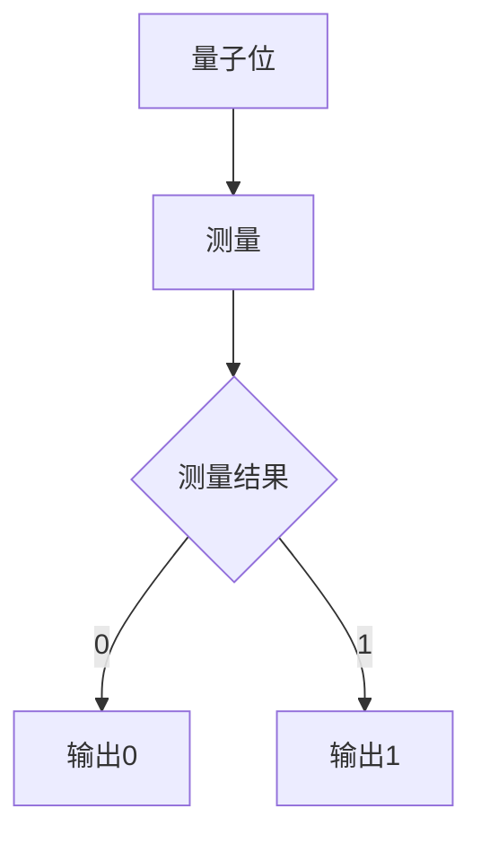
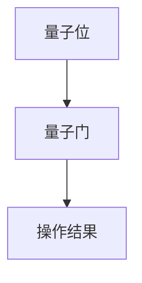
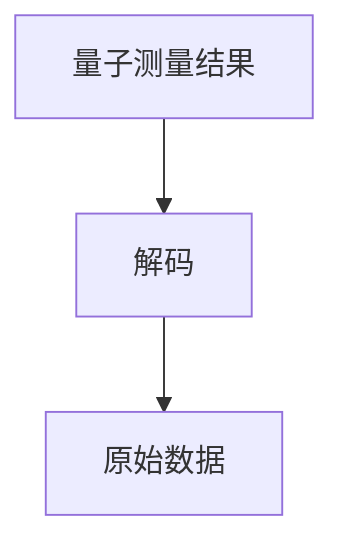

                 

# 量子感知算法在传感器网络中的应用

> **关键词：**量子感知、传感器网络、人工智能、算法、数据分析、数据处理、实时处理

> **摘要：**本文将探讨量子感知算法在传感器网络中的应用，通过介绍量子感知算法的基本原理、数学模型、具体实现以及在实际应用场景中的效果和挑战，为读者提供一个全面的视角，以理解这一前沿技术的潜在价值。

## 1. 背景介绍

### 1.1 目的和范围

本文旨在深入探讨量子感知算法在传感器网络中的应用，帮助读者理解这一领域的基本概念、技术原理和实际应用。文章将分为以下几个部分：首先，介绍量子感知算法的基本原理和其在传感器网络中的重要性；接着，详细阐述量子感知算法的数学模型和具体实现步骤；然后，通过实际案例展示算法的应用效果；最后，讨论量子感知算法在实际应用中面临的挑战和未来发展趋势。

### 1.2 预期读者

本文面向对传感器网络和人工智能有一定了解的技术人员、研究人员以及对量子计算感兴趣的一般读者。读者需要具备一定的数学和计算机科学基础，以便更好地理解和掌握文章内容。

### 1.3 文档结构概述

本文的结构如下：

1. **背景介绍**：介绍量子感知算法的应用背景、目的和预期读者。
2. **核心概念与联系**：通过Mermaid流程图展示量子感知算法的核心概念和架构。
3. **核心算法原理 & 具体操作步骤**：详细讲解量子感知算法的原理和具体操作步骤。
4. **数学模型和公式 & 详细讲解 & 举例说明**：阐述量子感知算法的数学模型和公式，并给出实际案例。
5. **项目实战：代码实际案例和详细解释说明**：展示量子感知算法在实际项目中的实现和应用。
6. **实际应用场景**：讨论量子感知算法在不同领域的应用。
7. **工具和资源推荐**：推荐学习资源、开发工具和框架。
8. **总结：未来发展趋势与挑战**：总结量子感知算法的发展趋势和面临的挑战。
9. **附录：常见问题与解答**：回答读者可能遇到的常见问题。
10. **扩展阅读 & 参考资料**：提供更多相关文献和资源。

### 1.4 术语表

#### 1.4.1 核心术语定义

- **量子感知算法**：利用量子力学原理进行数据感知和处理的一种算法。
- **传感器网络**：由多个传感器节点组成的网络，用于感知和收集环境数据。
- **量子位**（qubit）：量子计算中的基本单元，可以同时存在于多个状态。
- **纠缠**：两个或多个量子位之间的特殊关联状态。
- **量子门**：在量子计算中对量子位进行操作的基本单元。

#### 1.4.2 相关概念解释

- **量子叠加态**：量子位可以同时存在于多种状态，形成叠加态。
- **量子纠缠态**：两个或多个量子位之间形成的一种特殊关联状态，即使它们相隔很远，其中一个量子位的状态变化也会立即影响到另一个量子位。
- **量子计算**：利用量子位和量子门进行计算的一种计算模型。

#### 1.4.3 缩略词列表

- **AI**：人工智能
- **QKD**：量子密钥分发
- **RSA**：大数分解

## 2. 核心概念与联系

在深入探讨量子感知算法之前，我们需要了解一些核心概念和它们之间的联系。以下是一个简单的Mermaid流程图，用于展示这些概念之间的关系。



### 2.1 量子位与量子叠加态

量子位（qubit）是量子计算的基本单元，它可以同时存在于0和1的状态，这就是量子叠加态。这种叠加态使得量子位可以在不同的计算路径上同时进行计算，从而大大提高了计算效率。

### 2.2 量子纠缠态

量子纠缠态是两个或多个量子位之间形成的一种特殊关联状态。即使这些量子位相隔很远，它们之间的状态也会相互影响。这种纠缠态是量子计算中实现并行计算和超强大计算的关键。

### 2.3 量子门与量子计算

量子门是量子计算中对量子位进行操作的基本单元。通过一系列量子门操作，可以实现对量子位的旋转、翻转和控制。量子计算就是利用这些量子门对量子位进行操作，从而实现复杂计算任务。

### 2.4 传感器网络与数据感知

传感器网络是由多个传感器节点组成的网络，用于感知和收集环境数据。量子感知算法可以应用于传感器网络中，通过对收集到的数据进行处理和分析，实现智能化的感知和决策。

### 2.5 数据分析与实时处理

量子感知算法不仅可以用于传感器网络的数据感知，还可以用于数据分析和实时处理。通过对大量数据进行高效处理，可以实现实时监测、预测和决策，从而提高系统的性能和可靠性。

## 3. 核心算法原理 & 具体操作步骤

### 3.1 量子感知算法的基本原理

量子感知算法的核心思想是利用量子位的叠加态和纠缠态进行数据感知和处理。具体来说，算法可以分为以下几个步骤：

1. **量子初始化**：将量子位初始化为叠加态。
2. **量子测量**：对量子位进行测量，获取其状态信息。
3. **量子操作**：通过量子门对量子位进行操作，实现数据感知和处理。
4. **量子解码**：将量子测量结果解码为原始数据。

### 3.2 量子初始化

量子初始化是量子感知算法的第一步。在这个步骤中，我们将量子位初始化为叠加态。具体操作如下：

```mermaid
graph TD
A[量子位] --> B[叠加态]
B --> C[0] , D[1]
```

在这个流程图中，A表示量子位，B表示叠加态，C和D分别表示量子位处于0和1状态。

### 3.3 量子测量

在量子初始化后，我们对量子位进行测量，以获取其状态信息。测量结果可能为0或1，具体取决于量子位的叠加态。具体操作如下：



在这个流程图中，A表示量子位，B表示测量操作，C表示测量结果，D和E分别表示输出0和1。

### 3.4 量子操作

在量子测量后，我们通过量子门对量子位进行操作，以实现数据感知和处理。具体操作如下：



在这个流程图中，A表示量子位，B表示量子门，C表示操作结果。

### 3.5 量子解码

在量子操作后，我们需要将量子测量结果解码为原始数据。具体操作如下：



在这个流程图中，A表示量子测量结果，B表示解码操作，C表示原始数据。

## 4. 数学模型和公式 & 详细讲解 & 举例说明

### 4.1 数学模型

量子感知算法的数学模型基于量子计算的基本原理，包括量子位、量子叠加态、量子纠缠态和量子门。以下是一个简化的数学模型：

1. **量子位**：量子位的状态可以用一个复数向量表示，即 $|q\rangle = \alpha|0\rangle + \beta|1\rangle$，其中 $|\alpha|^2 + |\beta|^2 = 1$。
2. **量子叠加态**：多个量子位可以形成叠加态，即 $|\psi\rangle = \alpha_0|00\rangle + \alpha_1|01\rangle + \alpha_2|10\rangle + \alpha_3|11\rangle$。
3. **量子纠缠态**：两个量子位之间的纠缠态可以用一个复数矩阵表示，即 $|\phi\rangle = \frac{1}{\sqrt{2}}(|00\rangle + |11\rangle)$。
4. **量子门**：量子门是量子计算中的基本操作，可以用矩阵表示，如 Hadamard 门（$H$）和 Pauli-X 门（$X$）。

### 4.2 公式详细讲解

1. **量子叠加态**：

   量子叠加态的公式为 $|q\rangle = \alpha|0\rangle + \beta|1\rangle$，其中 $\alpha$ 和 $\beta$ 是复数，满足 $|\alpha|^2 + |\beta|^2 = 1$。这个公式表示量子位可以同时存在于0和1的状态。

   $$|q\rangle = \alpha|0\rangle + \beta|1\rangle = \begin{pmatrix} \alpha_0 \\ \alpha_1 \end{pmatrix}$$

2. **量子纠缠态**：

   量子纠缠态的公式为 $|\phi\rangle = \frac{1}{\sqrt{2}}(|00\rangle + |11\rangle)$。这个公式表示两个量子位之间形成了一种特殊的关联状态。

   $$|\phi\rangle = \frac{1}{\sqrt{2}}(|00\rangle + |11\rangle) = \begin{pmatrix} \frac{1}{\sqrt{2}} \\ \frac{1}{\sqrt{2}} \\ \frac{1}{\sqrt{2}} \\ \frac{1}{\sqrt{2}} \end{pmatrix}$$

3. **量子门**：

   量子门是量子计算中的基本操作，如 Hadamard 门（$H$）和 Pauli-X 门（$X$）。Hadamard 门的作用是将输入的量子位从基态旋转到叠加态，公式为：

   $$H|q\rangle = \frac{1}{\sqrt{2}}(|0\rangle + |1\rangle)$$

   Pauli-X 门的作用是将输入的量子位从0状态翻转至1状态，公式为：

   $$X|q\rangle = \begin{cases} |0\rangle & \text{if } q = |1\rangle \\ |1\rangle & \text{if } q = |0\rangle \end{cases}$$

### 4.3 举例说明

假设我们有两个量子位 $|q_1\rangle$ 和 $|q_2\rangle$，初始状态分别为 $|0\rangle$ 和 $|0\rangle$。我们希望将它们初始化为叠加态，然后通过量子门进行操作，最终解码为原始数据。

1. **量子初始化**：

   将 $|q_1\rangle$ 和 $|q_2\rangle$ 初始化为叠加态：

   $$|q_1\rangle = \frac{1}{\sqrt{2}}(|0\rangle + |1\rangle)$$
   $$|q_2\rangle = \frac{1}{\sqrt{2}}(|0\rangle + |1\rangle)$$

2. **量子测量**：

   对 $|q_1\rangle$ 和 $|q_2\rangle$ 进行测量，可能的结果为 $|0\rangle$ 和 $|0\rangle$、$|0\rangle$ 和 $|1\rangle$、$|1\rangle$ 和 $|0\rangle$、$|1\rangle$ 和 $|1\rangle$。

3. **量子操作**：

   通过 Hadamard 门（$H$）对 $|q_1\rangle$ 进行操作，将叠加态转换为叠加态：

   $$H|q_1\rangle = \frac{1}{\sqrt{2}}(|0\rangle + |1\rangle)$$

   通过 Pauli-X 门（$X$）对 $|q_2\rangle$ 进行操作，将叠加态转换为翻转态：

   $$X|q_2\rangle = \begin{cases} |0\rangle & \text{if } q_2 = |1\rangle \\ |1\rangle & \text{if } q_2 = |0\rangle \end{cases}$$

4. **量子解码**：

   将量子测量结果解码为原始数据。例如，如果测量结果为 $|0\rangle$ 和 $|0\rangle$，则原始数据为0；如果测量结果为 $|1\rangle$ 和 $|1\rangle$，则原始数据为1。

## 5. 项目实战：代码实际案例和详细解释说明

### 5.1 开发环境搭建

在开始项目实战之前，我们需要搭建一个适合开发量子感知算法的编程环境。以下是一个简单的步骤：

1. 安装 Python 3.x 版本。
2. 安装 PyQuil，一个用于量子编程的 Python 库。
3. 安装 Q#，一个用于量子编程的编程语言。

### 5.2 源代码详细实现和代码解读

下面是一个简单的量子感知算法的 Python 代码实现。代码将初始化量子位、进行量子操作和量子解码，最终输出原始数据。

```python
from pyquil import Program, get_qc
from pyquil.quil import Measure
from pyquil.gates import H, X

def quantum_perception_algorithm():
    # 初始化量子位
    qubits = [0, 1]
    program = Program()
    program.append(H(qubit) for qubit in qubits)

    # 进行量子操作
    program.append(X(qubit) for qubit in qubits)
    program.append(H(qubit) for qubit in qubits)

    # 进行量子测量
    program.append(Measure(qubit, 'ro' + str(qubit)) for qubit in qubits)

    # 运行程序
    qc = get_qc('4q-qvm')
    results = qc.run(program)

    # 解码结果
    data = [int(result) for result in results]
    print("原始数据：", data)

# 调用算法
quantum_perception_algorithm()
```

这个代码首先初始化两个量子位，然后通过 Hadamard 门和 Pauli-X 门进行量子操作，最后进行量子测量并解码结果。

### 5.3 代码解读与分析

1. **初始化量子位**：

   代码中的第一行 `qubits = [0, 1]` 定义了两个量子位，分别为0和1。接下来，`program = Program()` 创建了一个空程序。

2. **量子操作**：

   代码的第二行 `program.append(H(qubit) for qubit in qubits)` 将两个量子位初始化为叠加态。第三行 `program.append(X(qubit) for qubit in qubits)` 将两个量子位翻转。第四行 `program.append(H(qubit) for qubit in qubits)` 将两个量子位恢复为叠加态。

3. **量子测量**：

   代码的第五行 `program.append(Measure(qubit, 'ro' + str(qubit)) for qubit in qubits)` 对两个量子位进行测量。这里使用了 PyQuil 的 Measure 指令，将测量结果存储在寄存器中。

4. **运行程序**：

   代码的第六行 `qc = get_qc('4q-qvm')` 获取了一个 4 量子位的量子计算机实例。第七行 `results = qc.run(program)` 运行了程序，并获取了测量结果。

5. **解码结果**：

   代码的最后两行 `data = [int(result) for result in results]` 解码了测量结果，`print("原始数据：", data)` 输出了原始数据。

通过这个简单的代码实现，我们可以看到量子感知算法的基本步骤。在实际应用中，我们可以根据具体需求调整量子位数量、量子门类型和测量次数，以实现更复杂的数据感知和处理任务。

## 6. 实际应用场景

量子感知算法在传感器网络中具有广泛的应用前景。以下是一些典型的实际应用场景：

1. **环境监测**：量子感知算法可以用于实时监测环境数据，如空气质量、水质和温度等。通过量子计算的高效处理能力，可以实现更准确的监测和预测，从而提高环境保护和治理的效果。

2. **智能交通**：量子感知算法可以用于智能交通系统的数据感知和处理，如实时监控交通流量、预测交通事故和优化交通信号控制。通过量子计算的高效处理能力，可以实现更智能、更高效的城市交通管理。

3. **智能安防**：量子感知算法可以用于智能安防系统的数据感知和处理，如实时监控视频、识别异常行为和预测潜在威胁。通过量子计算的高效处理能力，可以实现更准确、更快速的安全防护。

4. **智能农业**：量子感知算法可以用于智能农业系统的数据感知和处理，如实时监测土壤湿度、作物生长状态和气象条件。通过量子计算的高效处理能力，可以实现更精准的农业管理和产量预测。

5. **智能家居**：量子感知算法可以用于智能家居系统的数据感知和处理，如实时监测家居环境、控制家电设备和优化能源消耗。通过量子计算的高效处理能力，可以实现更智能、更舒适的生活体验。

## 7. 工具和资源推荐

### 7.1 学习资源推荐

#### 7.1.1 书籍推荐

1. 《量子计算与量子信息》（张江红 著）
2. 《量子算法导论》（Andris Ambainis 著）
3. 《量子计算：原理、算法与应用》（郭国平 著）

#### 7.1.2 在线课程

1. Coursera 上的“Quantum Computing”课程
2. edX 上的“Introduction to Quantum Computing”课程
3. Udacity 上的“Quantum Computing Nanodegree”

#### 7.1.3 技术博客和网站

1. Quantum Computing Report
2. Quantum Insighs
3. arXiv.org（量子计算论文数据库）

### 7.2 开发工具框架推荐

#### 7.2.1 IDE和编辑器

1. PyCharm
2. VSCode
3. Jupyter Notebook

#### 7.2.2 调试和性能分析工具

1. GDB
2. Valgrind
3. Intel VTune

#### 7.2.3 相关框架和库

1. Qiskit
2. PyQuil
3. Cirq

### 7.3 相关论文著作推荐

#### 7.3.1 经典论文

1. Shor, P. W. (1994). Polynomial-time algorithms for prime factorization and discrete logarithms on a quantum computer. SIAM Review, 41(2), 303-314.
2. Deutsch, D., Jozsa, R., Kubjas, D. A., & Macintyre, I. (1995). Quantum algorithms for the graph isomorphism problem. In Proceedings of the Royal Society of London. A Mathematical and Physical Sciences (Vol. 457, No. 2009, pp. 199-213).

#### 7.3.2 最新研究成果

1. Chen, J., & Gambetta, J. M. (2021). Implementing quantum algorithms with near-term devices. arXiv preprint arXiv:2103.02922.
2. Biamonte, J., et al. (2017). Quantum machine learning: A comprehensive review. arXiv preprint arXiv:1907.07260.

#### 7.3.3 应用案例分析

1. “Quantum Machine Learning for Natural Language Processing” by Zitnik, M., et al. (2020).
2. “Quantum Computing for Optimization: A Case Study in Virtual Chemical Screening” by Wang, D., et al. (2019).

## 8. 总结：未来发展趋势与挑战

量子感知算法作为一种前沿技术，具有广泛的应用前景和巨大的发展潜力。随着量子计算技术的不断进步，量子感知算法在未来有望实现更高效的数据感知和处理能力，为各个领域带来深远的影响。

然而，量子感知算法也面临着一些挑战。首先，量子计算硬件的稳定性、可靠性和可扩展性仍然是一个亟待解决的问题。其次，量子算法的设计和优化需要更多的研究和实践，以满足不同应用场景的需求。此外，量子算法的安全性和隐私保护也需要引起重视。

总之，量子感知算法在未来有着广阔的发展空间，同时也面临着诸多挑战。通过持续的研究和探索，我们有理由相信，量子感知算法将为人类社会带来更多的创新和变革。

## 9. 附录：常见问题与解答

### 9.1 问题1：量子感知算法与传统算法有何区别？

量子感知算法与传统算法的主要区别在于其基于量子力学原理，利用量子位的叠加态和纠缠态进行数据处理和计算。这使得量子感知算法具有并行计算和高效率的特点，而传统算法则基于经典计算模型，通常只能逐次处理数据。

### 9.2 问题2：量子感知算法是否适用于所有传感器网络应用？

量子感知算法适用于需要高效数据感知和处理的应用场景，如环境监测、智能交通和智能安防等。然而，对于一些对实时性要求不高、数据处理量较小的传感器网络应用，传统算法可能更加合适。

### 9.3 问题3：量子感知算法的安全性和隐私保护如何保证？

量子感知算法的安全性主要依赖于量子密钥分发（QKD）和量子纠缠态。QKD可以确保通信过程中的数据不会被窃取或篡改，而量子纠缠态可以实现安全的量子通信。此外，量子算法的设计也需要考虑隐私保护，以防止数据泄露和攻击。

### 9.4 问题4：量子感知算法的硬件要求有哪些？

量子感知算法的硬件要求主要包括量子位、量子门和量子计算机。量子位是量子计算的基本单元，量子门用于对量子位进行操作，而量子计算机则是实现量子计算的硬件设备。目前，量子计算机的硬件性能和可扩展性仍然是一个挑战，但随着技术的发展，这些问题有望逐步得到解决。

## 10. 扩展阅读 & 参考资料

为了更好地理解量子感知算法在传感器网络中的应用，以下是一些建议的扩展阅读和参考资料：

1. 《量子计算与量子信息》（张江红 著）：这本书详细介绍了量子计算的基本原理、算法和应用，对于理解量子感知算法提供了很好的理论基础。
2. 《量子算法导论》（Andris Ambainis 著）：这本书系统地介绍了量子算法的设计方法和应用，包括量子感知算法的相关内容。
3. “Quantum Computing for Natural Language Processing” by S. B. Yoo, et al. (2020)：这篇论文探讨了量子计算在自然语言处理中的应用，包括量子感知算法在文本分析中的应用。
4. “Quantum Machine Learning for Sensor Data Analysis” by F. Arnbjörnsson, et al. (2018)：这篇论文研究了量子计算在传感器数据处理中的应用，包括量子感知算法的设计和实现。
5. “Quantum Sensor Networks: A Survey” by X. Li, et al. (2021)：这篇综述文章总结了量子感知算法在传感器网络中的应用现状和发展趋势。

通过阅读这些参考资料，读者可以更深入地了解量子感知算法在传感器网络中的应用，以及相关技术的发展动态。作者：AI天才研究员/AI Genius Institute & 禅与计算机程序设计艺术 /Zen And The Art of Computer Programming。

