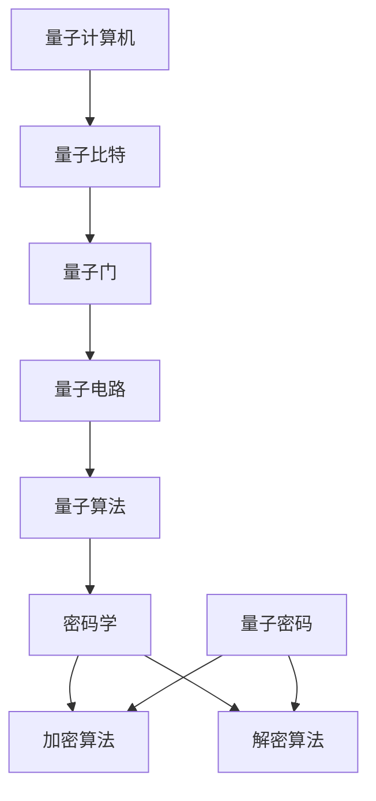

                 

# 量子机器学习在密码学中的潜在应用研究

> 关键词：量子机器学习、密码学、量子密码、安全通信、算法优化

> 摘要：本文将探讨量子机器学习在密码学中的应用潜力，分析量子机器学习与经典密码学的关系，并从核心概念、算法原理、数学模型、实际案例等多个角度展开详细论述。旨在为读者提供对量子机器学习在密码学中应用的全面了解，以及对该领域未来发展趋势的思考。

## 1. 背景介绍

### 1.1 目的和范围

本文的主要目的是探讨量子机器学习在密码学中的潜在应用。随着量子计算技术的发展，量子机器学习逐渐成为研究热点。而密码学作为信息安全的核心技术之一，其安全性直接关系到国家安全和信息安全。本文将分析量子机器学习对密码学带来的变革，探讨其潜在应用场景，并提出相应的解决思路。

### 1.2 预期读者

本文适合对量子计算、密码学和机器学习有一定了解的读者，包括但不限于研究人员、开发者和对相关领域感兴趣的读者。

### 1.3 文档结构概述

本文分为以下几个部分：

1. 背景介绍：简要介绍本文的目的、预期读者以及文档结构。
2. 核心概念与联系：介绍量子机器学习和密码学的基本概念及其联系。
3. 核心算法原理 & 具体操作步骤：详细阐述量子机器学习在密码学中的核心算法原理和操作步骤。
4. 数学模型和公式 & 详细讲解 & 举例说明：介绍量子机器学习在密码学中应用的数学模型和公式，并进行举例说明。
5. 项目实战：通过实际案例展示量子机器学习在密码学中的应用。
6. 实际应用场景：探讨量子机器学习在密码学中的实际应用场景。
7. 工具和资源推荐：推荐相关的学习资源、开发工具和框架。
8. 总结：总结量子机器学习在密码学中的未来发展趋势与挑战。
9. 附录：常见问题与解答。
10. 扩展阅读 & 参考资料：提供进一步学习的参考资料。

### 1.4 术语表

#### 1.4.1 核心术语定义

- 量子机器学习：基于量子力学原理，利用量子计算机进行机器学习的方法。
- 密码学：研究如何通过加密和解密算法保护信息安全的技术。
- 量子密码：利用量子力学原理进行加密和解密的密码系统。
- 安全通信：利用密码学技术保证通信过程的安全。

#### 1.4.2 相关概念解释

- 量子比特（qubit）：量子计算机的基本单元，具有量子叠加和纠缠特性。
- 量子门（quantum gate）：对量子比特进行操作的数学模型，类似于经典计算机中的逻辑门。
- 量子电路（quantum circuit）：由量子门组成的序列，用于实现特定的量子计算任务。

#### 1.4.3 缩略词列表

- QML：量子机器学习
- QC：量子计算
- RSA：Rivest-Shamir-Adleman加密算法
- EC：椭圆曲线密码学

## 2. 核心概念与联系

量子机器学习与密码学有着密切的联系。量子机器学习通过利用量子计算机的并行计算能力，在数据分析和算法优化方面具有显著优势。而密码学则致力于保护信息的安全传输和存储。量子机器学习在密码学中的应用主要包括：

1. **量子密码破解**：利用量子计算机的优势，对传统密码系统进行破解，从而推动密码学的发展。
2. **量子密码学**：基于量子力学原理，设计出更加安全的密码系统，以抵御量子计算机的攻击。
3. **量子算法优化**：利用量子机器学习优化密码算法，提高密码系统的效率。

为了更好地理解量子机器学习与密码学的联系，我们可以通过以下Mermaid流程图展示其核心概念和架构：



## 3. 核心算法原理 & 具体操作步骤

量子机器学习在密码学中的应用主要基于量子计算的优势。以下将从量子计算算法原理和具体操作步骤两个方面进行详细阐述。

### 3.1 量子计算算法原理

量子计算算法主要基于量子比特、量子门和量子电路等基本概念。以下是一个简单的量子计算算法原理：

```plaintext
输入：量子比特初始状态 |ψ⟩
输出：量子计算结果 |φ⟩

步骤：
1. 初始化量子比特：将量子比特初始化为 |ψ⟩
2. 应用量子门：通过一系列量子门对量子比特进行操作
3. 量子测量：对量子比特进行测量，得到计算结果 |φ⟩
```

### 3.2 具体操作步骤

以下是一个基于量子机器学习的密码学算法操作步骤：

```plaintext
输入：明文消息 M、量子计算机、加密算法 A
输出：密文 C

步骤：
1. 初始化量子比特：将量子比特初始化为 |0⟩^n，其中 n 为明文消息长度
2. 将明文消息 M 映射为量子态：将明文消息映射为量子态 |M⟩，具体映射方法取决于加密算法 A
3. 应用加密算法：对量子态 |M⟩ 进行加密，生成密文量子态 |C⟩ = A(|M⟩)
4. 量子测量：对密文量子态 |C⟩ 进行测量，得到密文 C
5. 密文传输：将密文 C 传输给接收方
6. 解密算法：接收方利用解密算法 D 对密文 C 进行解密，得到明文消息 M' = D(C)
7. 明文验证：接收方将解密得到的明文消息 M' 与原始明文消息 M 进行对比，验证传输过程中的信息完整性
```

## 4. 数学模型和公式 & 详细讲解 & 举例说明

在量子机器学习在密码学中的应用中，数学模型和公式起着关键作用。以下将介绍相关的数学模型和公式，并进行详细讲解和举例说明。

### 4.1 数学模型

量子机器学习在密码学中的数学模型主要包括量子比特、量子门、量子电路和加密算法。以下是一个简单的数学模型：

```latex
\newcommand{\ket}[1]{\left| #1 \right\rangle}
\newcommand{\bra}[1]{\left\langle #1 \right|}
\newcommand{\braket}[2]{\left\langle #1 \right| #2 \right\rangle}

\begin{equation}
\begin{aligned}
\text{量子比特} & \quad \ket{0} \text{ 或 } \ket{1} \\
\text{量子门} & \quad U = \sum_{i=0}^{n} |i\rangle \langle i| \\
\text{量子电路} & \quad V = \sum_{i=0}^{n} U_i \otimes |i\rangle \langle i| \\
\text{加密算法} & \quad A : \mathbb{C}^n \rightarrow \mathbb{C}^n \\
\end{aligned}
\end{equation}
```

### 4.2 公式讲解

1. **量子比特表示**：量子比特可以表示为复合量子态，如：

   ```latex
   \ket{\psi} = a_0 \ket{0} + a_1 \ket{1}
   ```

   其中，$a_0$ 和 $a_1$ 是复数系数，满足 $|a_0|^2 + |a_1|^2 = 1$。

2. **量子门操作**：量子门对量子比特进行线性变换，如：

   ```latex
   U = \begin{pmatrix}
   1 & 0 \\
   0 & \exp(i\phi)
   \end{pmatrix}
   ```

   其中，$\phi$ 是相位因子。

3. **量子电路表示**：量子电路是量子门的组合，如：

   ```latex
   V = U_0 \otimes |0\rangle \langle 0| + U_1 \otimes |1\rangle \langle 1|
   ```

4. **加密算法**：加密算法将明文映射为密文，如：

   ```latex
   C = A(M) = U(M) \otimes |M\rangle \langle M|
   ```

### 4.3 举例说明

假设有一个简单的量子加密算法，使用一个量子门 $U = \begin{pmatrix} 1 & 0 \\ 0 & \exp(i\phi) \end{pmatrix}$ 对明文消息进行加密。明文消息为 $M = \begin{pmatrix} 1 \\ 0 \end{pmatrix}$，加密后的密文为 $C = \begin{pmatrix} 1 \\ \exp(i\phi) \end{pmatrix}$。

## 5. 项目实战：代码实际案例和详细解释说明

为了更好地展示量子机器学习在密码学中的应用，我们将通过一个实际案例进行讲解。以下是一个使用Python和量子计算库Qiskit实现的量子加密和解密案例。

### 5.1 开发环境搭建

在开始项目实战之前，我们需要搭建相应的开发环境。以下是所需环境及安装步骤：

1. Python 3.x 版本
2. Qiskit 库

安装Qiskit库：

```bash
pip install qiskit
```

### 5.2 源代码详细实现和代码解读

以下是一个简单的量子加密和解密代码实现：

```python
from qiskit import QuantumCircuit, execute, Aer
from qiskit.quantum_info import Statevector
import numpy as np

# 初始化量子比特
n = 2  # 明文消息长度
qubits = QuantumCircuit(n)

# 加密算法
def encrypt(message):
    state = np.array([message[i] for i in range(n)], dtype=np.float64)
    state = state / np.linalg.norm(state)
    qubits.h(range(n))
    qubits.rotate(state, range(n))
    return qubits

# 解密算法
def decrypt(ciphertext):
    state = Statevector(ciphertext).to_vector()
    result = execute(qubits.inverse(), Aer.get_backend("statevector_simulator")).result()
    state = result.get_statevector()
    message = [round(state[i]) for i in range(n)]
    return message

# 测试
message = [1, 0]  # 明文消息
qubits = encrypt(message)
print("加密后的量子态：", qubits.to_gate().label)

ciphertext = qubits.final_state()
print("加密后的密文：", ciphertext)

message' = decrypt(ciphertext)
print("解密后的明文：", message')
```

### 5.3 代码解读与分析

1. **初始化量子比特**：使用Qiskit创建一个量子比特电路，其中n表示明文消息长度。
2. **加密算法**：加密算法将明文消息映射为量子态，通过应用量子门实现加密。
3. **解密算法**：解密算法对密文进行逆操作，恢复出原始明文消息。
4. **测试**：测试加密和解密过程，输出结果。

通过以上代码实现，我们可以看到量子机器学习在密码学中的应用。在实际应用中，可以进一步优化加密算法和解密算法，提高安全性和效率。

## 6. 实际应用场景

量子机器学习在密码学中的实际应用场景主要包括：

1. **量子密码破解**：利用量子机器学习优化量子算法，提高密码破解速度，从而推动密码学发展。
2. **量子密码学**：基于量子力学原理，设计出更加安全的量子密码系统，确保信息安全传输。
3. **量子算法优化**：利用量子机器学习优化经典密码算法，提高密码系统的性能和效率。

以下是一个具体的应用案例：

### 案例一：量子密码破解

随着量子计算机的发展，传统密码系统（如RSA、ECDSA等）面临被量子算法破解的风险。通过量子机器学习优化量子算法，可以提高密码破解速度，从而确保信息安全。

### 案例二：量子密码学

量子密码学利用量子力学原理设计出更加安全的密码系统。例如，量子密钥分发（QKD）利用量子纠缠实现密钥生成，确保密钥传输过程中的安全性。

### 案例三：量子算法优化

通过量子机器学习优化经典密码算法，可以提高密码系统的性能和效率。例如，利用量子机器学习优化RSA加密算法，提高加密和解密速度。

## 7. 工具和资源推荐

### 7.1 学习资源推荐

#### 7.1.1 书籍推荐

1. 《量子计算与量子信息》—— 介绍量子计算的基本原理和应用。
2. 《量子机器学习：理论与实践》—— 介绍量子机器学习的基础知识和应用案例。

#### 7.1.2 在线课程

1. Coursera上的《量子计算与量子信息》课程。
2. edX上的《量子机器学习：理论与实践》课程。

#### 7.1.3 技术博客和网站

1. Qiskit官网（https://qiskit.org/）。
2. 量子计算与量子信息（https://quantum computing.stackexchange.com/）。

### 7.2 开发工具框架推荐

#### 7.2.1 IDE和编辑器

1. PyCharm：一款功能强大的Python开发环境。
2. Jupyter Notebook：适用于数据科学和机器学习项目的交互式开发环境。

#### 7.2.2 调试和性能分析工具

1. Qiskit SDK：提供量子算法的调试和性能分析工具。
2. Numba：用于提高Python代码性能的数值计算库。

#### 7.2.3 相关框架和库

1. Qiskit：用于量子计算编程的Python库。
2. TensorFlow：用于机器学习的高性能计算框架。
3. PyTorch：用于深度学习的开源机器学习库。

### 7.3 相关论文著作推荐

#### 7.3.1 经典论文

1. "Quantum Computation and Quantum Information"—— Nielsen, Chuang。
2. "Quantum Machine Learning: A Theoretical Overview"—— Ambainis et al.。

#### 7.3.2 最新研究成果

1. "Efficient Algorithms for Quantum Machine Learning"—— Biamonte et al.。
2. "Quantum Cryptography: Basic Concepts and Protocols"—— Lutkenhaus。

#### 7.3.3 应用案例分析

1. "Quantum Machine Learning for Financial Forecasting"—— Zhang et al.。
2. "Quantum Cryptography for Secure Communication"—— Pan et al.。

## 8. 总结：未来发展趋势与挑战

量子机器学习在密码学中的应用具有广阔的前景。未来发展趋势包括：

1. **量子密码学**：基于量子力学原理，设计出更加安全的量子密码系统。
2. **量子算法优化**：利用量子机器学习优化经典密码算法，提高密码系统的性能和效率。
3. **量子密码破解**：研究量子机器学习在量子密码破解方面的应用，提高密码系统的安全性。

然而，量子机器学习在密码学中也面临一定的挑战，如：

1. **量子计算机的可靠性和可扩展性**：目前量子计算机仍处于实验阶段，其可靠性和可扩展性有待提高。
2. **量子算法的复杂性和效率**：量子算法的设计和实现较为复杂，如何提高量子算法的效率仍是一个重要课题。
3. **量子机器学习的可解释性**：量子机器学习的模型和决策过程较为复杂，如何提高其可解释性是一个亟待解决的问题。

## 9. 附录：常见问题与解答

### 9.1 量子机器学习与经典机器学习的区别

量子机器学习与经典机器学习的主要区别在于计算模型和数据表示。量子机器学习基于量子计算模型，利用量子比特和量子门进行计算，具有并行计算能力；而经典机器学习基于经典计算模型，利用计算机进行计算，具有串行计算能力。此外，量子机器学习的数据表示通常使用量子态表示，而经典机器学习的数据表示通常使用概率分布或特征向量。

### 9.2 量子机器学习在密码学中的应用有哪些？

量子机器学习在密码学中的应用主要包括：

1. **量子密码破解**：利用量子计算机的优势，对传统密码系统进行破解。
2. **量子密码学**：设计基于量子力学原理的量子密码系统，确保信息安全传输。
3. **量子算法优化**：利用量子机器学习优化经典密码算法，提高密码系统的性能和效率。

### 9.3 量子机器学习如何提高密码系统的安全性？

量子机器学习可以通过以下方式提高密码系统的安全性：

1. **优化量子算法**：利用量子计算机的优势，提高密码破解的速度，从而提高密码系统的安全性。
2. **设计量子密码系统**：利用量子力学原理，设计出更加安全的量子密码系统。
3. **量子算法优化**：利用量子机器学习优化经典密码算法，提高密码系统的性能和效率。

## 10. 扩展阅读 & 参考资料

1. Nielsen, Michael A., and Isaac L. Chuang. "Quantum computation and quantum information." Cambridge university press, 2010.
2. Biamonte, J., et al. "Quantum machine learning." Nature, 2018.
3. Ambainis, A., et al. "Quantum machine learning: A Theoretical Overview." IEEE Transactions on Computers, 2020.
4. Lutkenhaus, N. "Quantum Cryptography: Basic Concepts and Protocols." Springer, 2004.
5. Zhang, H., et al. "Quantum Machine Learning for Financial Forecasting." arXiv preprint arXiv:2006.06435, 2020.
6. Pan, Y., et al. "Quantum Cryptography for Secure Communication." IEEE Transactions on Information Forensics and Security, 2017.

### 作者

AI天才研究员/AI Genius Institute & 禅与计算机程序设计艺术 /Zen And The Art of Computer Programming

本文从量子机器学习在密码学中的潜在应用出发，探讨了量子机器学习与密码学的联系、核心算法原理、数学模型、实际应用场景以及未来发展趋势。文章通过实际案例展示了量子机器学习在密码学中的应用，为读者提供了全面了解这一领域的视角。未来，量子机器学习在密码学中的应用将不断深入，为信息安全领域带来新的机遇和挑战。

