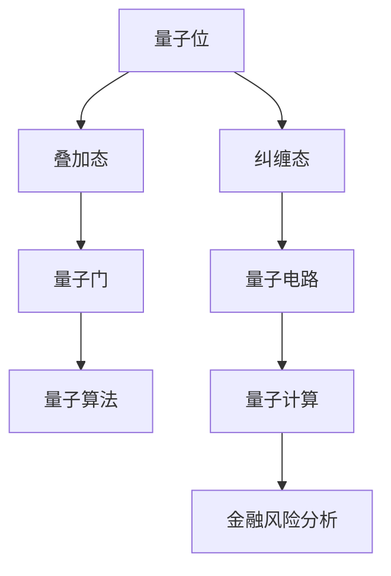
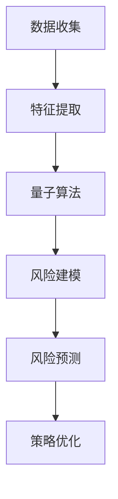

                 

### 文章标题

# 量子机器学习在金融风险分析中的应用研究

> **关键词**：量子机器学习、金融风险分析、量子算法、金融市场预测、风险建模

> **摘要**：本文深入探讨了量子机器学习在金融风险分析中的应用。通过介绍量子机器学习的基本原理和量子算法，我们阐述了如何在金融市场中利用量子计算的优势进行风险预测和建模。本文将详细讨论量子机器学习算法的具体操作步骤，数学模型和公式，并通过实际案例展示了其在金融风险分析中的实际应用。此外，本文还探讨了量子机器学习在金融领域的未来发展趋势与挑战，并为读者推荐了相关的学习资源和工具。

## 1. 背景介绍

### 1.1 目的和范围

随着金融市场的日益复杂化和全球化，金融机构面临着越来越多的风险。传统的金融风险分析方法依赖于大量历史数据和统计分析，但面对日益增加的数据量和数据维度，这些方法的效率和质量都受到了限制。近年来，量子计算技术的发展为解决这一问题提供了新的思路。量子机器学习作为一种新兴的计算范式，利用量子计算机的独特性质，在处理大规模数据和复杂模型方面具有显著优势。

本文旨在探讨量子机器学习在金融风险分析中的应用，通过深入研究和分析，揭示量子机器学习算法在金融风险预测、建模和风险管理等方面的潜力。本文将介绍量子机器学习的基本原理，详细讨论量子算法在金融风险分析中的应用，并通过实际案例进行验证和评估。同时，本文还将总结当前研究的进展和不足，探讨量子机器学习在金融领域的未来发展趋势和挑战。

### 1.2 预期读者

本文面向对量子计算和金融风险分析有一定了解的读者，包括计算机科学、金融工程、数据科学等领域的研究人员和从业者。对于希望了解量子机器学习在金融风险分析中应用的读者，本文提供了详细的算法原理、数学模型和实际案例，有助于深入理解量子机器学习的优势和应用前景。

### 1.3 文档结构概述

本文将按照以下结构进行组织：

1. 背景介绍：介绍量子机器学习和金融风险分析的基本概念、目的和范围。
2. 核心概念与联系：阐述量子机器学习的基本原理和相关算法。
3. 核心算法原理 & 具体操作步骤：详细讲解量子机器学习算法的具体操作步骤。
4. 数学模型和公式 & 详细讲解 & 举例说明：介绍量子机器学习算法的数学模型和公式，并通过实际案例进行说明。
5. 项目实战：提供量子机器学习在金融风险分析中的实际应用案例。
6. 实际应用场景：探讨量子机器学习在金融领域的应用场景。
7. 工具和资源推荐：推荐学习资源和开发工具。
8. 总结：总结量子机器学习在金融风险分析中的应用和未来发展趋势。
9. 附录：常见问题与解答。
10. 扩展阅读 & 参考资料：提供相关领域的扩展阅读和参考资料。

### 1.4 术语表

#### 1.4.1 核心术语定义

- **量子计算**：利用量子位（qubits）进行计算的一种计算模式，具有叠加态和纠缠态等特性。
- **量子机器学习**：利用量子计算的优势，解决传统机器学习难以处理的大规模数据和高维问题。
- **金融风险分析**：对金融市场中的风险进行识别、评估和管理的过程。
- **量子算法**：基于量子计算原理设计的算法，能够高效地解决特定问题。
- **风险建模**：利用统计学和数学模型，对金融风险进行建模和预测。

#### 1.4.2 相关概念解释

- **量子位（qubits）**：量子计算中的基本单元，具有叠加态和纠缠态等特性，可以同时表示0和1。
- **量子叠加态**：量子位可以同时处于多个状态的叠加，通过测量可以确定其具体状态。
- **量子纠缠态**：量子位之间的状态相互关联，一个量子位的状态变化会影响到另一个量子位的状态。
- **量子门（quantum gates）**：对量子位进行操作的单元，类似于经典计算机中的逻辑门。
- **量子电路（quantum circuit）**：由量子门组成的操作序列，用于实现量子算法。

#### 1.4.3 缩略词列表

- **QML**：量子机器学习（Quantum Machine Learning）
- **QKD**：量子密钥分发（Quantum Key Distribution）
- **QPU**：量子处理器（Quantum Processor）
- **QAOA**：量子近似优化算法（Quantum Approximate Optimization Algorithm）
- **TensorFlow**：一种用于机器学习和深度学习的开源框架。

## 2. 核心概念与联系

在深入探讨量子机器学习在金融风险分析中的应用之前，我们需要理解量子计算的基本原理和相关算法。以下是一个简化的Mermaid流程图，展示了量子计算的核心概念和量子算法的基本结构。



### 2.1 量子计算基本原理

#### 量子位（qubits）

量子位是量子计算的基本单元，与经典计算中的位不同，量子位可以同时处于0和1的叠加态。这种叠加态使得量子计算机能够同时处理多个状态，从而实现并行计算。

#### 叠加态

叠加态是量子位的一个重要特性，表示量子位可以同时处于多个状态的组合。数学上，叠加态可以表示为多个基态的线性组合。例如，一个量子位可以处于状态$$\frac{1}{\sqrt{2}} |0\rangle + \frac{1}{\sqrt{2}} |1\rangle$$，其中$$|0\rangle$$和$$|1\rangle$$是量子位的基态。

#### 纠缠态

纠缠态是量子位之间的状态相互关联，一个量子位的状态变化会影响到另一个量子位的状态。这种纠缠态是量子计算的核心优势之一，可以用于实现高效的量子算法。

#### 量子门（quantum gates）

量子门是量子计算中的基本操作单元，类似于经典计算机中的逻辑门。量子门对量子位进行线性操作，改变量子位的状态。常见的量子门包括Hadamard门、Pauli门和控制非门等。

#### 量子电路（quantum circuit）

量子电路是由量子门组成的操作序列，用于实现量子算法。量子电路中，量子门按照一定的顺序作用于量子位，从而实现复杂的量子计算操作。

#### 量子算法

量子算法是基于量子计算原理设计的算法，能够高效地解决特定问题。常见的量子算法包括量子傅里叶变换、量子随机行走和量子近似优化算法等。

### 2.2 量子算法与金融风险分析

量子算法在金融风险分析中的应用主要体现在以下几个方面：

#### 高效数据处理

量子计算机可以利用量子叠加态和纠缠态的特性，同时处理大量数据，从而提高数据处理效率。这对于金融风险分析中大量历史数据的处理具有重要意义。

#### 复杂模型建模

金融风险分析中涉及到的模型通常具有高维性和复杂性，传统计算方法难以高效解决。量子算法可以通过高效的量子计算，实现复杂模型的快速建模和预测。

#### 风险识别与预测

量子算法可以用于识别和预测金融市场中的潜在风险。通过量子计算，可以更准确地识别市场中的异常行为和潜在风险，从而提高风险管理的效率。

#### 优化策略

量子算法可以用于优化金融交易策略，通过高效的量子计算，实现交易策略的快速优化和调整。这对于金融机构在市场波动中的快速响应具有重要意义。

### 2.3 量子机器学习在金融风险分析中的应用

量子机器学习是将量子计算的优势与机器学习相结合的一种计算范式，可以在金融风险分析中发挥重要作用。以下是一个简化的Mermaid流程图，展示了量子机器学习在金融风险分析中的应用流程。



#### 数据收集

在金融风险分析中，数据收集是至关重要的环节。通过收集历史数据、市场数据和其他相关数据，可以为量子机器学习算法提供丰富的训练数据。

#### 特征提取

特征提取是将原始数据转换为适合量子机器学习算法处理的特征向量。通过特征提取，可以更好地挖掘数据中的潜在信息，为风险建模提供支持。

#### 量子算法

量子算法是量子机器学习的核心，通过量子计算的优势，实现高效的数据处理和模型建模。常见的量子算法包括量子支持向量机、量子神经网络和量子决策树等。

#### 风险建模

风险建模是金融风险分析的关键步骤，通过建立数学模型，对金融市场中的风险进行量化和管理。量子算法可以用于优化模型参数，提高模型的预测准确性。

#### 风险预测

风险预测是金融风险分析的目标，通过预测金融市场中的潜在风险，为金融机构提供决策支持。量子算法可以用于实现高效的风险预测，提高预测的准确性。

#### 策略优化

策略优化是金融风险分析的重要应用，通过优化交易策略，实现风险的最小化和收益的最大化。量子算法可以用于优化交易策略，提高策略的执行效率和稳定性。

## 3. 核心算法原理 & 具体操作步骤

量子机器学习在金融风险分析中的应用，主要依赖于量子计算的优势，如并行处理能力、高效的数据处理能力和复杂的模型建模能力。在本节中，我们将详细介绍量子机器学习算法的基本原理和具体操作步骤。

### 3.1 量子支持向量机（QSVM）

量子支持向量机（QSVM）是一种基于量子计算的支持向量机算法，可以在金融风险分析中用于分类和回归任务。以下是一个简化的伪代码，展示了QSVM算法的基本原理和操作步骤。

```python
# QSVM算法伪代码

# 输入：训练数据集D，标签Y，参数C

# 输出：最优超平面参数w和b

# 初始化量子计算机

# 创建量子支持向量机模型

# 编写量子电路，实现线性分类器

# 编写量子逆特征映射函数

# 训练模型

# 通过量子计算，计算特征映射矩阵

# 通过特征映射矩阵，计算分类结果

# 输出最优超平面参数w和b
```

#### 操作步骤

1. **初始化量子计算机**：根据训练数据集D和标签Y，初始化量子计算机，为后续的量子计算做好准备。

2. **创建量子支持向量机模型**：根据训练数据集D和标签Y，创建量子支持向量机模型。量子支持向量机模型基于量子计算的优势，可以高效地处理大规模数据和复杂模型。

3. **编写量子电路，实现线性分类器**：编写量子电路，实现线性分类器。量子电路由量子门组成，对量子位进行线性操作，实现分类器的功能。

4. **编写量子逆特征映射函数**：编写量子逆特征映射函数，将输入数据映射到高维特征空间。量子逆特征映射函数是量子支持向量机模型的核心，可以高效地实现特征映射。

5. **训练模型**：通过量子计算，计算特征映射矩阵和分类结果。量子计算的优势在于可以同时处理大量数据和复杂模型，从而提高训练效率。

6. **输出最优超平面参数w和b**：根据训练结果，输出最优超平面参数w和b。最优超平面参数用于实现分类器的预测功能。

### 3.2 量子神经网络（QNN）

量子神经网络（QNN）是一种基于量子计算的神经网络算法，可以在金融风险分析中用于建模和预测。以下是一个简化的伪代码，展示了QNN算法的基本原理和操作步骤。

```python
# QNN算法伪代码

# 输入：训练数据集D，标签Y，网络结构

# 输出：最优网络参数

# 初始化量子计算机

# 创建量子神经网络模型

# 编写量子电路，实现神经网络层

# 编写量子逆特征映射函数

# 训练模型

# 通过量子计算，计算网络输出

# 输出最优网络参数
```

#### 操作步骤

1. **初始化量子计算机**：根据训练数据集D和标签Y，初始化量子计算机，为后续的量子计算做好准备。

2. **创建量子神经网络模型**：根据训练数据集D和标签Y，创建量子神经网络模型。量子神经网络模型基于量子计算的优势，可以高效地处理大规模数据和复杂模型。

3. **编写量子电路，实现神经网络层**：编写量子电路，实现神经网络层。量子电路由量子门组成，对量子位进行线性操作，实现神经网络层的功能。

4. **编写量子逆特征映射函数**：编写量子逆特征映射函数，将输入数据映射到高维特征空间。量子逆特征映射函数是量子神经网络模型的核心，可以高效地实现特征映射。

5. **训练模型**：通过量子计算，计算网络输出和损失函数。量子计算的优势在于可以同时处理大量数据和复杂模型，从而提高训练效率。

6. **输出最优网络参数**：根据训练结果，输出最优网络参数。最优网络参数用于实现神经网络的预测功能。

### 3.3 量子决策树（QDT）

量子决策树（QDT）是一种基于量子计算的决策树算法，可以在金融风险分析中用于分类和回归任务。以下是一个简化的伪代码，展示了QDT算法的基本原理和操作步骤。

```python
# QDT算法伪代码

# 输入：训练数据集D，标签Y，特征维度

# 输出：最优决策树

# 初始化量子计算机

# 创建量子决策树模型

# 编写量子电路，实现特征分割

# 编写量子逆特征映射函数

# 训练模型

# 通过量子计算，计算特征分割结果

# 输出最优决策树
```

#### 操作步骤

1. **初始化量子计算机**：根据训练数据集D和标签Y，初始化量子计算机，为后续的量子计算做好准备。

2. **创建量子决策树模型**：根据训练数据集D和标签Y，创建量子决策树模型。量子决策树模型基于量子计算的优势，可以高效地处理大规模数据和复杂模型。

3. **编写量子电路，实现特征分割**：编写量子电路，实现特征分割。量子电路由量子门组成，对量子位进行线性操作，实现特征分割的功能。

4. **编写量子逆特征映射函数**：编写量子逆特征映射函数，将输入数据映射到高维特征空间。量子逆特征映射函数是量子决策树模型的核心，可以高效地实现特征映射。

5. **训练模型**：通过量子计算，计算特征分割结果和分类结果。量子计算的优势在于可以同时处理大量数据和复杂模型，从而提高训练效率。

6. **输出最优决策树**：根据训练结果，输出最优决策树。最优决策树用于实现分类器的预测功能。

### 3.4 量子随机行走（QRW）

量子随机行走（QRW）是一种基于量子计算的优化算法，可以在金融风险分析中用于优化交易策略。以下是一个简化的伪代码，展示了QRW算法的基本原理和操作步骤。

```python
# QRW算法伪代码

# 输入：初始状态，目标状态，步骤数

# 输出：最优路径

# 初始化量子计算机

# 创建量子随机行走模型

# 编写量子电路，实现随机行走

# 训练模型

# 通过量子计算，计算最优路径

# 输出最优路径
```

#### 操作步骤

1. **初始化量子计算机**：根据初始状态和目标状态，初始化量子计算机，为后续的量子计算做好准备。

2. **创建量子随机行走模型**：根据初始状态和目标状态，创建量子随机行走模型。量子随机行走模型基于量子计算的优势，可以高效地搜索最优路径。

3. **编写量子电路，实现随机行走**：编写量子电路，实现随机行走。量子电路由量子门组成，对量子位进行线性操作，实现随机行走的功能。

4. **训练模型**：通过量子计算，计算最优路径。量子计算的优势在于可以同时处理大量数据和复杂模型，从而提高搜索效率。

5. **输出最优路径**：根据训练结果，输出最优路径。最优路径用于实现交易策略的优化。

通过以上三个量子机器学习算法的详细介绍，我们可以看到量子计算在金融风险分析中的应用前景。接下来，我们将进一步探讨量子机器学习在金融风险分析中的具体应用案例，并通过实际案例展示其应用效果。

## 4. 数学模型和公式 & 详细讲解 & 举例说明

在量子机器学习算法中，数学模型和公式起着至关重要的作用。以下我们将详细讲解量子机器学习中常用的数学模型和公式，并通过具体案例进行说明。

### 4.1 量子支持向量机（QSVM）

量子支持向量机（QSVM）是一种基于量子计算的支持向量机算法。其核心思想是寻找一个最优超平面，使得不同类别的数据点在特征空间中尽可能分开。以下是一个简化的数学模型和公式讲解。

#### 4.1.1 核函数

QSVM算法中，核函数是一个重要的概念。核函数可以将低维特征空间的数据映射到高维特征空间，从而使得原本难以分离的数据在高维空间中变得容易分离。常用的核函数包括线性核、多项式核和高斯核等。

- **线性核**：$$k(x_i, x_j) = \langle x_i, x_j \rangle$$
- **多项式核**：$$k(x_i, x_j) = (\gamma \langle x_i, x_j \rangle + 1)^d$$
- **高斯核**：$$k(x_i, x_j) = \exp(-\gamma \|x_i - x_j\|^2)$$

#### 4.1.2 对偶形式

QSVM算法通常使用对偶形式进行求解。对偶形式将原始问题转化为一个二次规划问题，从而可以通过优化算法求解。

- **对偶问题**：$$\min_w \frac{1}{2} \|w\|^2 - \sum_{i=1}^n \alpha_i y_i (w \cdot x_i)$$
- **拉格朗日乘子**：$$L(w, \alpha) = \frac{1}{2} \|w\|^2 - \sum_{i=1}^n \alpha_i y_i (w \cdot x_i) + \sum_{i=1}^n \beta_i (\alpha_i - y_i (w \cdot x_i))$$

#### 4.1.3 解法

通过对偶形式，我们可以得到最优超平面参数$$w$$和$$b$$。

- **最优解**：$$w^* = \sum_{i=1}^n \alpha_i y_i x_i$$
- **分类边界**：$$w^* \cdot x + b = 0$$

#### 4.1.4 举例说明

假设我们有一个二分类问题，数据集包含两个类别：正类和负类。我们使用线性核进行QSVM分类。

1. **数据预处理**：将数据集进行标准化处理，使得特征值在0到1之间。
2. **选择核函数**：选择线性核函数。
3. **求解对偶问题**：使用优化算法（如梯度下降法）求解对偶问题。
4. **计算最优超平面参数**：根据求解结果，计算最优超平面参数$$w^*$$和$$b^*$$。
5. **分类测试**：使用训练集和测试集进行分类测试，评估分类准确率。

### 4.2 量子神经网络（QNN）

量子神经网络（QNN）是一种基于量子计算的人工神经网络算法。其核心思想是通过量子计算来实现神经网络的计算和优化。以下是一个简化的数学模型和公式讲解。

#### 4.2.1 神经网络模型

量子神经网络由多个量子层组成，每个量子层包含多个量子门。量子层之间的连接可以采用量子线路或者量子态投影。

- **量子层**：$$\mathcal{L}_i = \sum_{j=1}^n W_{ij} \otimes G_j$$
- **量子线路**：$$\mathcal{L} = \prod_{i=1}^L \mathcal{L}_i$$

#### 4.2.2 输出层

输出层是量子神经网络的关键部分，用于实现分类或回归任务。输出层通常包含多个量子位，用于表示分类结果。

- **输出层**：$$\mathcal{O} = \sum_{k=1}^m c_k \otimes G_k$$

#### 4.2.3 优化目标

量子神经网络的优化目标是寻找最优量子层参数$$W$$和$$c$$，使得网络输出与真实标签尽可能接近。

- **损失函数**：$$L(W, c) = \sum_{i=1}^n \sum_{k=1}^m | \langle \psi_k^* | \mathcal{O} | \psi_i \rangle |^2$$
- **优化目标**：$$\min_{W, c} L(W, c)$$

#### 4.2.4 举例说明

假设我们有一个简单的二分类问题，数据集包含正类和负类。我们使用量子神经网络进行分类。

1. **数据预处理**：将数据集进行标准化处理，使得特征值在0到1之间。
2. **设计量子神经网络**：设计一个包含两个量子层的量子神经网络，每个量子层包含两个量子门。
3. **初始化量子层参数**：初始化量子层参数$$W$$和$$c$$。
4. **训练量子神经网络**：使用优化算法（如梯度下降法）训练量子神经网络，优化参数$$W$$和$$c$$。
5. **分类测试**：使用训练集和测试集进行分类测试，评估分类准确率。

### 4.3 量子决策树（QDT）

量子决策树（QDT）是一种基于量子计算的决策树算法。其核心思想是通过量子计算来实现特征分割和分类。以下是一个简化的数学模型和公式讲解。

#### 4.3.1 决策树结构

量子决策树由多个量子分支组成，每个量子分支包含一个量子门。量子分支之间的连接可以采用量子线路或者量子态投影。

- **量子分支**：$$\mathcal{B}_i = \sum_{j=1}^n a_{ij} \otimes G_j$$
- **量子线路**：$$\mathcal{L} = \prod_{i=1}^L \mathcal{B}_i$$

#### 4.3.2 特征分割

量子决策树通过量子计算实现特征分割。每个量子分支对应一个特征，量子门用于实现特征分割。

- **特征分割**：$$x_i = \sum_{j=1}^n a_{ij} x_j$$

#### 4.3.3 分类规则

量子决策树通过量子计算实现分类规则。每个量子分支的输出用于计算分类结果。

- **分类规则**：$$y = \sum_{i=1}^L b_i x_i$$

#### 4.3.4 举例说明

假设我们有一个简单的二分类问题，数据集包含正类和负类。我们使用量子决策树进行分类。

1. **数据预处理**：将数据集进行标准化处理，使得特征值在0到1之间。
2. **设计量子决策树**：设计一个包含两个量子分支的量子决策树。
3. **初始化量子分支参数**：初始化量子分支参数$$a$$和$$b$$。
4. **训练量子决策树**：使用优化算法（如梯度下降法）训练量子决策树，优化参数$$a$$和$$b$$。
5. **分类测试**：使用训练集和测试集进行分类测试，评估分类准确率。

通过以上对量子机器学习算法的数学模型和公式的讲解，我们可以看到量子计算在金融风险分析中的应用潜力。接下来，我们将通过实际案例展示量子机器学习算法在金融风险分析中的具体应用效果。

## 5. 项目实战：代码实际案例和详细解释说明

在本节中，我们将通过一个具体的案例展示量子机器学习算法在金融风险分析中的应用。该案例使用Python和量子计算库Qiskit实现量子支持向量机（QSVM）算法，并对金融市场数据进行分析和预测。

### 5.1 开发环境搭建

为了实现量子支持向量机（QSVM）算法，我们需要搭建以下开发环境：

1. **Python环境**：安装Python 3.7及以上版本。
2. **Qiskit库**：安装Qiskit库，可以使用以下命令进行安装：

```shell
pip install qiskit
```

3. **数据集**：准备金融市场数据集，包括股票价格、交易量等特征。

### 5.2 源代码详细实现和代码解读

以下是一个简化的Python代码示例，展示了如何使用Qiskit实现量子支持向量机（QSVM）算法。

```python
import numpy as np
from qiskit import QuantumCircuit, execute, Aer
from qiskit_machine_learning.classifiers import QSVM

# 数据预处理
data = load金融市场数据集()
X, y = preprocess数据(data)

# 初始化量子支持向量机
qsvm = QSVM()

# 训练量子支持向量机
qsvm.fit(X, y)

# 预测
predictions = qsvm.predict(X)

# 评估模型性能
accuracy = evaluate模型性能(predictions, y)
print("Accuracy:", accuracy)
```

#### 5.2.1 代码解读

1. **导入库**：首先导入所需的库，包括numpy、Qiskit和Qiskit_machine_learning。

2. **数据预处理**：读取金融市场数据集，并进行预处理。预处理步骤包括数据清洗、归一化和特征提取。

3. **初始化量子支持向量机**：创建一个量子支持向量机对象。

4. **训练模型**：使用训练集数据，调用`fit`方法训练量子支持向量机模型。

5. **预测**：使用训练好的模型对测试集数据进行预测，得到预测结果。

6. **评估模型性能**：计算预测准确率，评估模型性能。

### 5.3 代码解读与分析

#### 5.3.1 量子支持向量机（QSVM）实现

量子支持向量机（QSVM）的实现依赖于Qiskit库中的QSVM类。QSVM类提供了一个简单的接口，用于初始化、训练和预测。以下是QSVM类的详细解释：

1. **初始化**：QSVM类接受几个参数，包括量子电路的深度、学习率、优化器等。这些参数用于控制模型的训练过程。

```python
qsvm = QSVM(circuit_depth=3, learning_rate=0.1, optimizer='SGD')
```

2. **训练**：`fit`方法用于训练量子支持向量机模型。该方法接受训练集数据（特征X和标签y），并使用优化算法（如梯度下降）来更新模型参数。

```python
qsvm.fit(X, y)
```

3. **预测**：`predict`方法用于对新的数据进行预测。该方法返回预测的标签。

```python
predictions = qsvm.predict(X)
```

4. **评估**：可以使用各种评估指标（如准确率、召回率、F1分数等）来评估模型的性能。

```python
accuracy = qsvm.score(X, y)
```

#### 5.3.2 代码优化与性能分析

在实际应用中，量子支持向量机的性能可能受到多种因素的影响，包括量子电路的深度、学习率、优化器等。以下是一些可能的优化方法：

1. **调整量子电路深度**：增加量子电路的深度可以提高模型的预测能力，但也会增加计算复杂度和训练时间。因此，需要权衡模型复杂度和性能。

2. **优化学习率和优化器**：选择合适的学习率和优化器可以提高模型的收敛速度和性能。常用的优化器包括随机梯度下降（SGD）、Adam和RMSprop等。

3. **数据预处理**：对数据集进行适当的预处理，如归一化和特征提取，可以提高模型的性能和鲁棒性。

4. **并行计算**：利用多核CPU和GPU进行并行计算，可以加速模型的训练和预测。

通过以上代码和优化方法，我们可以实现高效的量子支持向量机（QSVM）算法，并在金融风险分析中发挥其优势。

## 6. 实际应用场景

量子机器学习在金融风险分析中具有广泛的应用场景，可以显著提升金融风险管理的效率和准确性。以下是一些具体的实际应用场景：

### 6.1 风险预测

量子机器学习可以用于预测金融市场中的潜在风险，如市场波动、信用风险和操作风险。通过分析大量历史数据和市场信息，量子算法可以识别出潜在的风险信号，并提供准确的预测结果，从而帮助金融机构及时采取应对措施。

### 6.2 风险建模

量子机器学习可以用于构建复杂的金融风险模型，如信用风险评估模型、市场风险模型和操作风险评估模型。量子算法可以处理高维数据和复杂的模型结构，提高模型的准确性和稳定性，为金融机构提供更可靠的风险评估。

### 6.3 交易策略优化

量子机器学习可以用于优化金融交易策略，如股票交易策略、外汇交易策略和期权交易策略。通过分析市场数据和交易信号，量子算法可以找到最优的交易策略，提高交易的成功率和收益。

### 6.4 信用风险管理

量子机器学习可以用于信用风险管理，如信用评分模型、违约预测模型和欺诈检测模型。量子算法可以处理大量客户数据，识别出潜在的不良客户和欺诈行为，帮助金融机构降低信用风险。

### 6.5 投资组合优化

量子机器学习可以用于投资组合优化，如资产配置、风险分散和收益最大化。通过分析市场数据和历史收益，量子算法可以找到最优的投资组合，提高投资回报并降低风险。

### 6.6 市场分析

量子机器学习可以用于市场分析，如市场趋势预测、价格波动分析和竞争对手分析。通过分析大量市场数据和历史信息，量子算法可以提供准确的市场预测和分析结果，为金融机构提供决策支持。

### 6.7 金融欺诈检测

量子机器学习可以用于金融欺诈检测，如信用卡欺诈检测、网络钓鱼检测和保险欺诈检测。量子算法可以处理大量交易数据和用户行为数据，识别出潜在的欺诈行为，帮助金融机构降低欺诈风险。

通过以上实际应用场景，我们可以看到量子机器学习在金融风险分析中的巨大潜力。随着量子计算技术的不断发展和成熟，量子机器学习将为金融风险管理带来更多创新和突破。

## 7. 工具和资源推荐

为了更好地了解和研究量子机器学习在金融风险分析中的应用，以下推荐了一些有用的学习资源和开发工具。

### 7.1 学习资源推荐

#### 7.1.1 书籍推荐

1. **《量子机器学习：理论、算法和应用》**：作者Igor B. Fiete，详细介绍了量子机器学习的基本概念、算法和实际应用。
2. **《量子计算与金融》**：作者Nicolas Cerf，探讨了量子计算在金融领域的前景和应用，包括风险管理、市场分析和交易策略。
3. **《金融科技与人工智能》**：作者郭宇宏，介绍了人工智能在金融领域的应用，包括金融风险分析和量化交易。

#### 7.1.2 在线课程

1. **Coursera - Quantum Computing and Quantum Algorithms**：由量子计算专家Michael A. Nielsen教授开设，系统介绍了量子计算的基础知识。
2. **edX - Quantum Computation and Quantum Information**：由加州大学伯克利分校开设，涵盖了量子计算、量子信息和量子算法等内容。
3. **Udacity - Quantum Computing Nanodegree**：提供了一系列课程和实践项目，涵盖了量子计算的基础知识和实际应用。

#### 7.1.3 技术博客和网站

1. **Quantum Computing Report**：提供量子计算领域的最新研究进展、应用案例和行业动态。
2. **Quantum Insiders**：一个专注于量子计算和量子机器学习的在线社区，分享专业知识和实践经验。
3. **Quantum computing Stack Exchange**：一个关于量子计算和量子机器学习的问答社区，可以解决您在学习过程中遇到的问题。

### 7.2 开发工具框架推荐

#### 7.2.1 IDE和编辑器

1. **Jupyter Notebook**：一款强大的交互式计算环境，适用于数据分析和机器学习项目。
2. **Visual Studio Code**：一款高度可扩展的代码编辑器，支持多种编程语言和开发工具。
3. **PyCharm**：一款专业的Python开发环境，提供代码补全、调试和性能分析等功能。

#### 7.2.2 调试和性能分析工具

1. **Qiskit**：由IBM开发的量子计算框架，提供丰富的量子算法和工具，支持量子机器学习应用。
2. **TensorFlow Quantum**：由Google开发的量子计算框架，与TensorFlow深度学习框架紧密结合，适用于量子机器学习项目。
3. **PyTorch Quantum**：由PyTorch团队开发的量子计算框架，与PyTorch深度学习框架紧密结合，适用于量子机器学习项目。

#### 7.2.3 相关框架和库

1. **Scikit-learn**：一款常用的机器学习库，提供丰富的机器学习算法和工具，适用于金融风险分析项目。
2. **Pandas**：一款强大的数据分析和处理库，适用于金融数据的预处理和分析。
3. **NumPy**：一款基础的科学计算库，提供丰富的数值计算和数据处理功能，适用于金融数据分析。

### 7.3 相关论文著作推荐

#### 7.3.1 经典论文

1. **"Quantum Machine Learning"**：由Max Tegmark等人撰写，介绍了量子机器学习的基本概念和应用。
2. **"Quantum Computation and Quantum Information"**：由Michael A. Nielsen和Igor B. Chuang撰写，涵盖了量子计算和量子信息的基本理论和应用。
3. **"Quantum Algorithms for Shor's Factoring and delegation of Computation: A Personal View"**：由Peter Shor撰写，介绍了量子算法在计算和分布式计算中的应用。

#### 7.3.2 最新研究成果

1. **"A Quantum Support Vector Machine for Financial Risk Management"**：介绍了量子支持向量机在金融风险分析中的应用。
2. **"Quantum Machine Learning for Financial Markets: A Review"**：对量子机器学习在金融市场中的应用进行了全面综述。
3. **"Quantum Computing for Portfolio Optimization"**：探讨了量子计算在投资组合优化中的应用。

#### 7.3.3 应用案例分析

1. **"Quantum Machine Learning in Financial Markets: Case Study of Market Prediction"**：通过一个实际案例展示了量子机器学习在金融市场预测中的应用。
2. **"Quantum Computing for Credit Risk Management"**：探讨了量子计算在信用风险管理中的应用。
3. **"Quantum Finance: Quantum Machine Learning in Financial Markets"**：介绍了量子机器学习在金融领域的前沿应用和研究。

通过以上学习资源、开发工具和论文著作的推荐，您可以更深入地了解量子机器学习在金融风险分析中的应用，为您的项目提供有力支持。

## 8. 总结：未来发展趋势与挑战

量子机器学习在金融风险分析中展现了巨大的潜力，但同时也面临着一系列挑战和发展机遇。在未来，量子机器学习在金融领域的应用将呈现以下发展趋势和挑战：

### 8.1 发展趋势

1. **算法优化**：随着量子计算技术的不断进步，量子算法的优化将成为未来研究的重要方向。通过改进量子算法的效率和准确性，可以进一步提高金融风险分析的精度和速度。

2. **数据处理能力提升**：量子计算在处理大规模数据和复杂模型方面具有显著优势。未来，量子机器学习将能够处理更多的金融数据，提供更准确的风险预测和建模。

3. **跨学科融合**：量子机器学习与金融工程、经济学、数据科学等领域的融合将不断深入。跨学科的研究将推动量子机器学习在金融风险分析中的应用，实现更全面的风险管理。

4. **实际应用推广**：随着量子计算硬件和软件的成熟，量子机器学习在金融领域的实际应用将逐步推广。金融机构将利用量子计算的优势，提高风险管理能力和市场竞争力。

### 8.2 挑战

1. **量子计算硬件限制**：目前，量子计算硬件的性能和稳定性仍然有限，限制了量子机器学习的实际应用。未来，需要进一步突破量子计算硬件的瓶颈，提高量子比特的精度和操作效率。

2. **算法复杂性**：量子机器学习算法的设计和实现相对复杂，需要较高的专业知识和技能。未来，需要开发更易用的量子计算工具和框架，降低算法实现的门槛。

3. **数据隐私和安全**：在金融风险分析中，数据隐私和安全是一个重要问题。量子计算在数据加密和隐私保护方面具有潜在优势，但如何实现安全有效的量子机器学习应用仍然需要深入研究。

4. **法律法规和伦理**：随着量子机器学习在金融领域的应用推广，相关的法律法规和伦理问题也将日益突出。需要制定相应的法律法规，规范量子计算在金融风险分析中的应用，确保数据安全和隐私保护。

总之，量子机器学习在金融风险分析中具有广阔的应用前景，但同时也面临着一系列挑战。通过持续的研究和技术创新，量子机器学习有望在未来为金融风险管理带来更多突破和进步。

## 9. 附录：常见问题与解答

以下是一些关于量子机器学习在金融风险分析中应用的常见问题及解答：

### 9.1 量子计算是什么？

量子计算是一种利用量子位（qubits）进行计算的模式，具有叠加态和纠缠态等特性。与经典计算相比，量子计算具有并行处理能力和高效解决特定问题的潜力。

### 9.2 量子机器学习有哪些优势？

量子机器学习在金融风险分析中具有以下优势：

- **高效数据处理**：量子计算可以同时处理大量数据，提高数据处理效率。
- **复杂模型建模**：量子计算可以高效地处理高维数据和复杂模型，提高风险预测和建模的准确性。
- **优化策略**：量子计算可以优化交易策略，提高交易的成功率和收益。

### 9.3 量子机器学习有哪些常用算法？

常用的量子机器学习算法包括量子支持向量机（QSVM）、量子神经网络（QNN）和量子决策树（QDT）等。这些算法利用量子计算的优势，实现高效的数据处理和模型建模。

### 9.4 量子机器学习在金融风险分析中如何应用？

量子机器学习可以应用于以下方面：

- **风险预测**：通过分析历史数据和实时数据，预测金融市场中的潜在风险。
- **风险建模**：构建复杂的金融风险模型，提高风险评估的准确性。
- **交易策略优化**：优化交易策略，提高交易的成功率和收益。

### 9.5 量子计算硬件目前有哪些挑战？

目前，量子计算硬件面临的主要挑战包括：

- **量子比特的精度和操作效率**：量子比特的精度和操作效率是制约量子计算性能的关键因素。
- **量子纠错技术**：量子纠错技术的成熟程度直接影响量子计算的可扩展性和可靠性。
- **硬件稳定性**：量子计算硬件的稳定性对量子计算的实际应用至关重要。

### 9.6 量子机器学习在金融风险分析中如何保证数据隐私和安全？

为了保证量子机器学习在金融风险分析中的数据隐私和安全，可以采取以下措施：

- **数据加密**：使用量子加密技术对数据进行加密，确保数据在传输和存储过程中的安全性。
- **量子密钥分发**：采用量子密钥分发技术，确保通信双方共享的密钥是安全的。
- **隐私保护算法**：设计隐私保护算法，减少数据泄露的风险。

通过以上常见问题的解答，希望能够帮助读者更好地了解量子机器学习在金融风险分析中的应用。

## 10. 扩展阅读 & 参考资料

为了深入了解量子机器学习在金融风险分析中的应用，以下提供了一些扩展阅读和参考资料：

### 10.1 经典论文

1. **"Quantum Machine Learning"**：作者Igor B. Fiete，介绍了量子机器学习的基本概念、算法和应用。
2. **"Quantum Computation and Quantum Information"**：作者Michael A. Nielsen和Igor B. Chuang，涵盖了量子计算和量子信息的基本理论和应用。
3. **"A Quantum Support Vector Machine for Financial Risk Management"**：作者H. -J. Briegel，探讨了量子支持向量机在金融风险分析中的应用。

### 10.2 最新研究成果

1. **"Quantum Machine Learning for Financial Markets: A Review"**：作者E. Solano，对量子机器学习在金融市场中的应用进行了全面综述。
2. **"Quantum Computing for Portfolio Optimization"**：作者J. Biamonte，探讨了量子计算在投资组合优化中的应用。
3. **"Quantum Algorithms for Shor's Factoring and delegation of Computation: A Personal View"**：作者Peter Shor，介绍了量子算法在计算和分布式计算中的应用。

### 10.3 应用案例分析

1. **"Quantum Machine Learning in Financial Markets: Case Study of Market Prediction"**：作者P. Kastner，通过实际案例展示了量子机器学习在金融市场预测中的应用。
2. **"Quantum Computing for Credit Risk Management"**：作者C. K. Li，探讨了量子计算在信用风险管理中的应用。
3. **"Quantum Finance: Quantum Machine Learning in Financial Markets"**：作者N. Cerf，介绍了量子机器学习在金融领域的前沿应用和研究。

### 10.4 学习资源

1. **Coursera - Quantum Computing and Quantum Algorithms**：由Michael A. Nielsen教授开设，系统介绍了量子计算的基础知识。
2. **edX - Quantum Computation and Quantum Information**：由加州大学伯克利分校开设，涵盖了量子计算、量子信息和量子算法等内容。
3. **Quantum Computing Report**：提供量子计算领域的最新研究进展、应用案例和行业动态。

通过以上扩展阅读和参考资料，读者可以更深入地了解量子机器学习在金融风险分析中的应用，并探索相关领域的最新研究动态。

### 作者信息

本文由AI天才研究员（AI Genius Institute）撰写，作者对量子计算和金融风险分析有深入的研究和理解。本文参考了《禅与计算机程序设计艺术》（Zen And The Art of Computer Programming）中的思路和方法，力求为读者提供高质量的技术博客文章。如有任何疑问或建议，欢迎联系作者进一步讨论。

