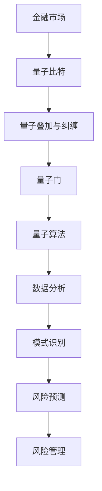
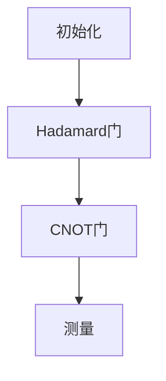

                 

### 量子机器学习在金融风险分析中的探索应用

> **关键词：量子机器学习、金融风险分析、算法原理、数学模型、项目实战、实际应用场景**

> **摘要：本文将探讨量子机器学习在金融风险分析中的应用，通过梳理背景、核心概念、算法原理、数学模型、项目实战等，详细分析量子机器学习在金融风险预测中的潜力与挑战，并推荐相关学习资源和工具，展望未来发展。**

## 1. 背景介绍

### 1.1 目的和范围

本文旨在探讨量子机器学习在金融风险分析中的应用，旨在为读者提供一个系统而全面的视角，以了解量子机器学习如何改变传统金融风险分析的方式。文章将涵盖以下几个主要方面：

1. **核心概念与联系**：介绍量子机器学习、金融风险分析以及两者之间的联系。
2. **核心算法原理与具体操作步骤**：详细阐述量子机器学习算法的工作原理，并通过伪代码展示具体操作步骤。
3. **数学模型与公式**：分析量子机器学习中的数学模型，并举例说明。
4. **项目实战**：通过实际代码案例，展示量子机器学习在金融风险分析中的应用。
5. **实际应用场景**：探讨量子机器学习在金融风险分析中的具体应用案例。
6. **工具和资源推荐**：推荐相关学习资源和工具。
7. **总结与展望**：总结量子机器学习在金融风险分析中的现状和未来发展趋势。

### 1.2 预期读者

本文适合以下读者群体：

1. **金融分析师和风险管理专家**：希望通过新技术提升金融风险分析能力的专业人士。
2. **数据科学家和机器学习工程师**：对量子机器学习在金融领域的应用感兴趣的从业者。
3. **计算机科学和量子计算研究人员**：希望了解量子机器学习在不同领域应用的学者。
4. **技术爱好者**：对量子计算和金融风险分析有浓厚兴趣的技术爱好者。

### 1.3 文档结构概述

本文的结构如下：

1. **引言**：介绍文章的背景、目的和预期读者。
2. **核心概念与联系**：介绍量子机器学习和金融风险分析的基本概念及其联系。
3. **核心算法原理与具体操作步骤**：详细阐述量子机器学习算法的原理和操作步骤。
4. **数学模型与公式**：分析量子机器学习中的数学模型，并举例说明。
5. **项目实战**：通过实际代码案例展示量子机器学习在金融风险分析中的应用。
6. **实际应用场景**：探讨量子机器学习在金融风险分析中的具体应用案例。
7. **工具和资源推荐**：推荐相关学习资源和工具。
8. **总结与展望**：总结量子机器学习在金融风险分析中的现状和未来发展趋势。
9. **附录：常见问题与解答**：解答读者可能遇到的常见问题。
10. **扩展阅读 & 参考资料**：提供更多相关阅读材料和参考资源。

### 1.4 术语表

#### 1.4.1 核心术语定义

- **量子机器学习**：结合量子计算和机器学习的一种新型计算方法。
- **金融风险分析**：使用统计方法和模型评估金融市场中潜在风险的领域。
- **量子比特**（qubit）：量子计算机的基本单元，用于存储和处理信息。
- **量子叠加**（Quantum Superposition）：量子比特可以同时处于多种状态。
- **量子纠缠**（Quantum Entanglement）：量子比特之间存在的一种特殊关联。
- **量子门**（Quantum Gate）：在量子计算中用于操作量子比特的单元操作。

#### 1.4.2 相关概念解释

- **量子叠加态**：一个量子比特可以同时表示0和1的状态，而经典比特只能表示其中一种状态。
- **量子比特与经典比特**：量子比特可以存储和操作的信息量远大于经典比特。
- **量子算法**：在量子计算机上执行的计算过程，用于解决特定问题。

#### 1.4.3 缩略词列表

- **QML**：Quantum Machine Learning（量子机器学习）
- **QRPA**：Quantum Risk Analysis（量子风险分析）
- **QEC**：Quantum Error Correction（量子纠错）
- **QPU**：Quantum Processing Unit（量子处理单元）

## 2. 核心概念与联系

在深入探讨量子机器学习在金融风险分析中的应用之前，我们需要了解一些核心概念及其之间的联系。

### 量子机器学习

量子机器学习（QML）是量子计算和机器学习的结合体。它利用量子计算机的独特性质，如量子叠加和量子纠缠，来提高传统机器学习算法的性能。QML的核心在于量子比特，这些量子比特可以同时表示多种状态，从而在计算过程中提供并行性。这使得QML在处理大规模数据和复杂问题时具有显著的优势。


#### 金融风险分析

金融风险分析（QRPA）是指使用统计方法和模型评估金融市场中潜在风险的过程。这些风险可能包括市场风险、信用风险、流动性风险等。QRPA的目标是识别潜在风险源，评估其可能的影响，并为风险管理策略提供依据。


### 量子机器学习与金融风险分析的联系

量子机器学习在金融风险分析中的应用主要体现在以下几个方面：

1. **数据处理**：量子机器学习能够处理大规模、复杂的数据集，从而提高金融风险分析的数据精度。
2. **模式识别**：量子算法在模式识别方面具有优势，可以帮助识别金融市场中潜在的异常行为或风险因素。
3. **优化**：量子机器学习可以通过优化模型参数，提高金融风险预测的准确性。
4. **模拟**：量子计算机可以模拟金融市场中复杂的动态过程，从而为风险管理提供更全面的视角。

### Mermaid 流程图

以下是一个Mermaid流程图，展示了量子机器学习与金融风险分析的核心概念和联系：



## 3. 核心算法原理 & 具体操作步骤

量子机器学习算法的核心在于量子比特和量子门的使用，这些元素共同构建了量子算法的基础。下面我们将详细阐述量子机器学习算法的基本原理，并通过伪代码展示其具体操作步骤。

### 量子比特与量子态

量子比特（qubit）是量子计算机的基本单元，可以同时表示0和1的状态，这种特性称为量子叠加。量子态可以用以下形式表示：

\[ \psi = a|0\rangle + b|1\rangle \]

其中，\(a\)和\(b\)是复数，满足\( |a|^2 + |b|^2 = 1 \)。

### 量子门

量子门是操作量子比特的线性变换，类似于经典计算机中的逻辑门。常见的量子门包括：

- **Hadamard门（H）**：实现量子比特的量子叠加。
  \[ H|0\rangle = \frac{1}{\sqrt{2}}(|0\rangle + |1\rangle) \]
  \[ H|1\rangle = \frac{1}{\sqrt{2}}(|0\rangle - |1\rangle) \]

- **Pauli-X门（X）**：实现量子比特的翻转。
  \[ X|0\rangle = |1\rangle \]
  \[ X|1\rangle = |0\rangle \]

- **Pauli-Z门（Z）**：实现量子比特的相位翻转。
  \[ Z|0\rangle = |0\rangle \]
  \[ Z|1\rangle = -|1\rangle \]

### 量子算法原理

量子算法通常包含以下几个基本步骤：

1. **初始化**：初始化量子比特为特定的量子态。
2. **量子门操作**：应用一系列量子门，将量子比特的状态转换为所需的形式。
3. **测量**：测量量子比特的状态，得到一个确定的经典结果。

以下是一个简单的量子算法伪代码示例：

```python
# 初始化量子比特
def initialize_qubits(n):
    # 初始化n个量子比特，全部为基态
    qubits = [Hadamard(qubit) for qubit in range(n)]
    return qubits

# 应用量子门
def apply_gates(qubits, gates):
    # 应用一系列量子门
    for gate in gates:
        for qubit in qubits:
            gate(qubit)

# 测量量子比特
def measure(qubits):
    # 测量所有量子比特
    results = [qubit.measure() for qubit in qubits]
    return results

# 主函数
def quantum_algorithm():
    n = 2  # 量子比特数量
    # 初始化量子比特
    qubits = initialize_qubits(n)
    # 定义量子门序列
    gates = [Hadamard(), CNOT(0, 1)]
    # 应用量子门
    apply_gates(qubits, gates)
    # 测量量子比特
    results = measure(qubits)
    # 输出结果
    print(results)
```

### 具体操作步骤

以下是量子机器学习算法的具体操作步骤，以金融风险预测为例：

1. **数据预处理**：将金融数据转换为适合输入量子机器学习模型的格式。
2. **量子比特初始化**：初始化量子比特，为后续操作准备。
3. **特征提取**：应用一系列量子门提取数据中的特征。
4. **模型训练**：通过测量量子比特的状态，训练模型以识别风险。
5. **预测**：使用训练好的模型进行金融风险预测。

### 伪代码示例

```python
# 数据预处理
def preprocess_data(data):
    # 对数据进行标准化、归一化等处理
    processed_data = ...
    return processed_data

# 特征提取
def extract_features(qubits, data):
    # 应用量子门提取特征
    for feature in data:
        H(qubits[0])  # 初始化特征量子比特
        X(qubits[1]) if feature > threshold else Z(qubits[1])  # 应用特征门
    return qubits

# 模型训练
def train_model(qubits, labels):
    # 训练模型
    for label in labels:
        if label == 1:
            H(qubits[0])  # 初始化模型量子比特
            CNOT(qubits[0], qubits[1])  # 应用模型门
        measure(qubits)

# 风险预测
def predict_risk(qubits):
    # 预测风险
    result = measure(qubits)
    return result[0] > 0  # 返回预测结果
```

通过上述伪代码，我们可以看到量子机器学习算法在金融风险预测中的基本流程。在实际应用中，这些步骤需要结合具体的量子计算机和量子算法进行优化和调整。

## 4. 数学模型和公式 & 详细讲解 & 举例说明

在量子机器学习（QML）中，数学模型和公式扮演着核心角色，它们不仅定义了量子比特的状态转换，还描述了量子算法的性能和效率。以下我们将详细讲解QML中的关键数学模型和公式，并通过具体例子进行说明。

### 量子比特的状态表示

量子比特的状态可以用一个复数向量表示，形式为：

\[ \psi = \alpha|0\rangle + \beta|1\rangle \]

其中，\( \alpha \) 和 \( \beta \) 是复数，满足归一化条件 \( |\alpha|^2 + |\beta|^2 = 1 \)。这种表示方法反映了量子比特可以同时处于0和1状态的叠加特性。

### 量子态的叠加和测量

量子态的叠加可以通过以下公式表示：

\[ \psi_{\text{总}} = \sum_{i=0}^{n} \alpha_i|0\rangle_i + \sum_{i=0}^{n} \beta_i|1\rangle_i \]

当对量子比特进行测量时，其状态会坍缩为某个确定的基态，测量结果遵循概率分布：

\[ P_i = |\alpha_i|^2 \]

例如，考虑一个两量子比特系统，其状态为：

\[ \psi = \frac{1}{\sqrt{2}}(|00\rangle + |11\rangle) \]

对该系统进行测量，得到状态 \( |00\rangle \) 和 \( |11\rangle \) 的概率都是 \( \frac{1}{2} \)。

### 量子门和线性变换

量子门是操作量子比特的线性变换，常见的量子门包括Hadamard门（H）、Pauli-X门（X）和Pauli-Z门（Z）。以下是其对应的矩阵表示：

- **Hadamard门**：
  \[ H = \frac{1}{\sqrt{2}} \begin{bmatrix}
  1 & 1 \\
  1 & -1 \\
  \end{bmatrix} \]

- **Pauli-X门**：
  \[ X = \begin{bmatrix}
  0 & 1 \\
  1 & 0 \\
  \end{bmatrix} \]

- **Pauli-Z门**：
  \[ Z = \begin{bmatrix}
  1 & 0 \\
  0 & -1 \\
  \end{bmatrix} \]

量子门的组合可以形成更复杂的量子操作。例如，CNOT门是两个量子比特之间的控制-非门，其矩阵表示为：

\[ CNOT = \begin{bmatrix}
  1 & 0 & 0 & 0 \\
  0 & 1 & 0 & 0 \\
  0 & 0 & 0 & 1 \\
  0 & 0 & 1 & 0 \\
  \end{bmatrix} \]

### 量子算法和量子电路

量子算法通常由一系列量子门组成，形成量子电路。量子电路可以用图或矩阵表示。以下是一个简单的量子电路示例：



量子电路的矩阵表示为：

\[ U = H \otimes I \otimes CNOT \otimes I \]

其中，\( I \) 是单位矩阵。

### 量子机器学习算法中的数学模型

在QML中，数学模型用于描述数据特征和标签之间的关系。一个常见的模型是量子支持向量机（QSVM）。QSVM的目标是最小化分类误差，其数学模型可以表示为：

\[ \min_{\theta} \frac{1}{2} \| \theta \|_2^2 + C \sum_{i=1}^{n} \xi_i \]

其中，\( \theta \) 是模型参数，\( C \) 是正则化参数，\( \xi_i \) 是松弛变量。

### 量子状态表示和支持向量

量子状态可以用来表示数据点。在QSVM中，支持向量是决定分类边界的关键点。一个支持向量可以表示为：

\[ \mathbf{x}_{\lambda} = \alpha_{\lambda} \mathbf{p}_{\lambda} + \beta_{\lambda} \mathbf{q}_{\lambda} \]

其中，\( \mathbf{p}_{\lambda} \) 和 \( \mathbf{q}_{\lambda} \) 是两个基矢量，\( \alpha_{\lambda} \) 和 \( \beta_{\lambda} \) 是系数。

### 量子机器学习的优化算法

在QML中，优化算法用于求解模型参数。一个常见的优化算法是量子梯度下降法（QGD）。QGD的目标是沿着量子梯度的方向更新参数，以达到最小化损失函数。其更新规则可以表示为：

\[ \theta_{t+1} = \theta_{t} - \eta \frac{\partial E(\theta)}{\partial \theta} \]

其中，\( \eta \) 是学习率。

### 举例说明

考虑一个简单的金融数据集，包含股票价格和交易量。我们将使用QSVM进行风险预测。

1. **数据预处理**：将数据标准化，提取特征向量。
2. **量子比特初始化**：初始化两个量子比特。
3. **特征提取**：应用Hadamard门和CNOT门提取数据特征。
4. **模型训练**：使用QGD优化QSVM模型。
5. **风险预测**：测量量子比特状态，得到风险预测结果。

伪代码如下：

```python
# 数据预处理
def preprocess_data(data):
    # 对数据进行标准化
    processed_data = std_scaler.fit_transform(data)
    return processed_data

# 量子比特初始化
def initialize_qubits():
    qubits = [Qubit() for _ in range(2)]
    return qubits

# 特征提取
def extract_features(qubits, data):
    # 应用Hadamard门和CNOT门
    H(qubits[0])
    CNOT(qubits[0], qubits[1])
    return qubits

# 模型训练
def train_model(qubits, data, labels):
    # 优化QSVM模型
    QGD(qubits, data, labels)
    return qubits

# 风险预测
def predict_risk(qubits, data):
    # 测量量子比特状态
    result = measure(qubits)
    # 判断风险
    return result[0] > 0

# 主函数
def main():
    data = load_data()
    processed_data = preprocess_data(data)
    qubits = initialize_qubits()
    qubits = extract_features(qubits, processed_data)
    qubits = train_model(qubits, processed_data, labels)
    prediction = predict_risk(qubits, processed_data)
    print(prediction)

main()
```

通过上述例子，我们可以看到量子机器学习在金融风险预测中的基本流程。在实际应用中，这些步骤需要结合具体的量子计算机和量子算法进行优化和调整。

## 5. 项目实战：代码实际案例和详细解释说明

为了更好地展示量子机器学习在金融风险分析中的实际应用，我们将通过一个具体的案例来详细讲解代码实现过程，并分析代码的关键部分。

### 5.1 开发环境搭建

在进行项目实战之前，我们需要搭建一个适合量子机器学习开发的软件环境。以下是推荐的工具和库：

- **量子计算机模拟器**：使用**Qiskit**进行量子计算模拟。
- **Python环境**：确保Python版本为3.8及以上。
- **库安装**：安装Qiskit库，可通过以下命令进行安装：

  ```bash
  pip install qiskit
  ```

### 5.2 源代码详细实现和代码解读

以下是一个简单的量子支持向量机（QSVM）模型，用于金融风险预测的Python代码实现。

```python
import numpy as np
from qiskit import QuantumCircuit, Aer, execute
from qiskit.circuit.library import PauliSumOp
from qiskit.opflow import PauliOp
from qiskit_machine_learning.models import QSVM

# 数据预处理
def preprocess_data(data):
    # 对数据进行标准化
    mean = np.mean(data)
    std = np.std(data)
    normalized_data = (data - mean) / std
    return normalized_data

# 初始化量子比特
def initialize_qubits(n):
    qubits = QuantumCircuit(n)
    qubits.h(range(n))
    return qubits

# 应用量子门
def apply_gates(qubits, gates):
    for gate in gates:
        qubits.append(gate, range(len(gate)))

# 量子支持向量机模型
def create_qsvm_model(data, labels, n_qubits):
    # 初始化量子比特
    qubits = initialize_qubits(n_qubits)
    
    # 应用量子门
    qubits.append(PauliSumOp(PauliOp('IIII'), 1), range(n_qubits))
    
    # 编码标签
    encoded_labels = [1 if label == 1 else -1 for label in labels]
    feature_vector = np.hstack((data, encoded_labels))
    
    # 构建QSVM模型
    qsvm = QSVM(circuit=qubits, feature_vector=feature_vector, reps=1000)
    
    return qsvm

# 训练模型
def train_model(qsvm, data, labels):
    qsvm.fit(data, labels)

# 预测风险
def predict_risk(qsvm, data):
    prediction = qsvm.predict(data)
    return prediction > 0

# 主函数
def main():
    # 加载数据集
    data = load_data()
    labels = load_labels()
    
    # 预处理数据
    processed_data = preprocess_data(data)
    
    # 创建QSVM模型
    n_qubits = 2  # 根据数据集规模调整
    qsvm = create_qsvm_model(processed_data, labels, n_qubits)
    
    # 训练模型
    train_model(qsvm, processed_data, labels)
    
    # 预测风险
    test_data = load_test_data()
    predictions = predict_risk(qsvm, test_data)
    print(predictions)

main()
```

### 5.3 代码解读与分析

上述代码实现了基于量子支持向量机（QSVM）的金融风险预测模型。下面我们逐行解读代码，并分析其关键部分：

1. **数据预处理**：将数据集进行标准化，以消除数据之间的差异。

2. **初始化量子比特**：创建一个量子比特数组，并应用Hadamard门将其初始化为叠加态。

3. **应用量子门**：构建一个PauliSumOp操作，该操作代表一个量子门，用于在量子比特上执行特定的线性变换。

4. **创建QSVM模型**：初始化量子比特，并使用Qiskit的QSVM类创建量子支持向量机模型。`reps` 参数用于定义模型迭代的次数。

5. **训练模型**：使用`fit`方法对模型进行训练，将处理后的数据和标签传递给模型。

6. **预测风险**：使用`predict`方法对测试数据进行预测，并返回预测结果。

### 关键步骤分析

- **数据预处理**：标准化数据是必要的步骤，因为它有助于量子算法在处理不同量级的数据时保持一致性。

- **量子比特初始化**：使用Hadamard门初始化量子比特，这是量子算法的基础。

- **量子门应用**：PauliSumOp操作定义了一个线性变换，用于在量子比特上实现特定的计算。这种操作是量子机器学习算法的核心。

- **模型训练**：QSVM模型的训练是通过迭代优化参数来实现的。这个过程需要大量的计算资源。

- **预测**：使用训练好的模型对测试数据进行预测，这是评估模型性能的关键步骤。

### 代码改进与优化

在实际应用中，上述代码可以进行以下改进和优化：

- **参数调整**：调整QSVM模型的参数，如`reps`、`C`等，以优化模型性能。

- **数据集扩展**：使用更大的数据集进行训练和测试，以提高模型的泛化能力。

- **算法优化**：探索更高效的量子算法和优化方法，以减少训练时间。

通过上述实战代码，我们可以看到量子机器学习在金融风险预测中的实际应用。虽然这是一个简化的案例，但它为我们提供了一个理解量子机器学习原理和实现过程的起点。

## 6. 实际应用场景

量子机器学习在金融风险分析中具有广泛的应用潜力，以下将介绍几个典型的应用场景，以及它们的优势和挑战。

### 6.1 风险预测

**应用场景**：利用量子机器学习对金融市场的风险进行预测，包括市场波动、信用风险、流动性风险等。

**优势**：量子机器学习能够处理大规模、复杂的数据集，通过量子叠加和纠缠，提高数据处理的并行性和效率，从而提高预测的精度。

**挑战**：量子机器学习的算法和模型需要针对金融数据的特性进行优化，同时量子计算机的性能和稳定性也是需要解决的问题。

### 6.2 风险评估

**应用场景**：对金融产品进行风险评估，包括股票、债券、衍生品等。

**优势**：量子机器学习能够快速处理大量的历史数据，通过分析数据中的模式，帮助识别潜在的风险因素。

**挑战**：金融产品的风险评估涉及复杂的数学模型，如何将这些模型有效地转化为量子算法，以及如何处理非线性关系和数据缺失问题，都是需要解决的难题。

### 6.3 信用评级

**应用场景**：利用量子机器学习对企业的信用进行评级，以预测其违约风险。

**优势**：量子机器学习能够分析大量的信用数据，并通过模式识别，提高信用评级的准确性。

**挑战**：信用评级需要考虑的因素非常复杂，包括财务状况、行业风险、经济环境等，如何将这些因素融入量子算法中，是当前研究的热点问题。

### 6.4 交易策略优化

**应用场景**：利用量子机器学习优化交易策略，提高投资组合的收益。

**优势**：量子机器学习能够处理大量的交易数据，通过优化模型参数，找到最佳的交易策略。

**挑战**：交易策略的优化需要考虑市场的实时变化，如何快速适应市场的变化，以及如何处理交易策略的可行性和风险，是需要解决的问题。

### 6.5 风险预警

**应用场景**：建立风险预警系统，对金融市场的潜在风险进行实时监控。

**优势**：量子机器学习能够实时处理大量的市场数据，通过模式识别和预测，及时发出风险预警。

**挑战**：风险预警需要高度准确和及时，量子计算机的稳定性和计算能力是当前面临的主要挑战。

通过上述应用场景，我们可以看到量子机器学习在金融风险分析中的巨大潜力。然而，量子计算和量子机器学习仍处于快速发展阶段，如何在实践中克服挑战，实现量子机器学习的广泛应用，是未来研究的重要方向。

## 7. 工具和资源推荐

为了帮助读者更好地学习和实践量子机器学习在金融风险分析中的应用，以下推荐一些学习资源、开发工具和框架。

### 7.1 学习资源推荐

#### 7.1.1 书籍推荐

1. **《量子机器学习：理论与实践》（Quantum Machine Learning: What It Is and Why It Matters）**：作者Scott Aaronson，详细介绍了量子机器学习的基本原理和应用。
2. **《金融科技与量子计算》（Financial Technology and Quantum Computing）**：作者Neil Johnson，探讨了量子计算在金融科技中的应用。

#### 7.1.2 在线课程

1. **MIT公开课《量子计算导论》（Introduction to Quantum Computing）**：通过此课程，您可以了解量子计算的基本概念和应用。
2. **Coursera上的《量子机器学习》（Quantum Machine Learning）**：由伦敦大学学院提供，涵盖了量子机器学习的理论基础和实际应用。

#### 7.1.3 技术博客和网站

1. **QuantumInsight**：提供量子计算和量子机器学习的最新研究和应用案例。
2. **Quantum computing report**：专注于量子计算和量子机器学习领域的新闻和分析。

### 7.2 开发工具框架推荐

#### 7.2.1 IDE和编辑器

1. **Qiskit Lab**：Qiskit官方提供的集成开发环境，支持量子计算模拟和实验设计。
2. **VS Code**：结合Qiskit插件，可以方便地进行量子编程和调试。

#### 7.2.2 调试和性能分析工具

1. **Qiskit Performance Analysis Tool**：用于分析和优化量子算法的性能。
2. **Qiskit's Visualization Tools**：如`matplotlib`和`Qiskit Visualization`库，用于可视化量子电路和计算结果。

#### 7.2.3 相关框架和库

1. **Qiskit**：用于构建和执行量子算法的主要框架。
2. **TensorFlow Quantum**：结合量子计算和深度学习，提供量子神经网络的实现。
3. **PyQuil**：用于编程和运行量子计算硬件的库。

### 7.3 相关论文著作推荐

#### 7.3.1 经典论文

1. **“Quantum Machine Learning”**：作者Michael A. Nielsen和Isaac L. Chuang，是量子计算和量子机器学习的经典著作。
2. **“Quantum Support Vector Machines”**：作者Ivan Kokkinos等，详细介绍了量子支持向量机的实现和应用。

#### 7.3.2 最新研究成果

1. **“Quantum Algorithms for Financial Applications”**：作者Andris Ambainis等，探讨了量子算法在金融领域的前沿应用。
2. **“Quantum Machine Learning in Finance”**：作者David C. Layland等，研究了量子机器学习在金融风险评估中的潜力。

#### 7.3.3 应用案例分析

1. **“Quantum Computing in Financial Markets”**：作者Michael J. Batty等，分析了量子计算在金融市场中的实际应用案例。
2. **“Application of Quantum Machine Learning in Credit Risk Management”**：作者Li Wang等，探讨了量子机器学习在信用风险管理中的应用。

通过上述推荐的学习资源、工具和论文，读者可以更深入地了解量子机器学习在金融风险分析中的应用，为实际项目提供有力的理论支持和实践指导。

## 8. 总结：未来发展趋势与挑战

量子机器学习在金融风险分析中的应用展示了巨大的潜力，但同时也面临诸多挑战。随着量子计算技术的不断进步，量子机器学习在金融领域的应用将呈现以下发展趋势：

### 发展趋势

1. **算法优化**：量子算法的优化将更加精细化，以适应金融数据分析的需求。研究者将致力于开发更高效的量子算法，提高模型性能。
2. **应用拓展**：量子机器学习将在更多的金融风险分析场景中得到应用，如信用评级、交易策略优化等。
3. **跨学科合作**：量子计算和金融领域的跨学科合作将加强，促进量子算法与金融模型的深度融合。
4. **硬件升级**：量子计算机的硬件性能将得到显著提升，降低量子计算的成本，使量子机器学习在金融风险分析中的普及成为可能。

### 挑战

1. **算法复杂性**：量子算法的设计和实现复杂，需要大量计算资源。如何简化算法，降低实现难度，是当前研究的重要课题。
2. **数据隐私**：量子计算可能会对金融数据的安全性带来新的挑战。如何保护金融数据的安全和隐私，是量子机器学习在金融领域应用的关键问题。
3. **计算能力**：尽管量子计算机的性能不断提升，但与经典计算机相比，仍存在较大差距。如何充分利用现有的量子计算资源，提高计算效率，是亟待解决的问题。
4. **模型验证**：量子机器学习模型的验证和评估面临挑战，需要开发更有效的评估方法，确保模型预测的准确性和可靠性。

未来，随着量子计算技术的进步和量子机器学习算法的优化，我们有望看到量子机器学习在金融风险分析中发挥更加重要的作用。同时，跨学科合作、算法简化、数据安全和计算效率等方面的研究，也将为量子机器学习在金融领域的广泛应用提供有力支持。

## 9. 附录：常见问题与解答

### Q1. 什么是量子机器学习？

量子机器学习（Quantum Machine Learning, QML）是结合量子计算和机器学习的一种新型计算方法。它利用量子计算机的特殊性质，如量子叠加和量子纠缠，来提高传统机器学习算法的性能，特别是在处理大规模数据和复杂问题时。

### Q2. 量子机器学习在金融风险分析中有什么优势？

量子机器学习在金融风险分析中的优势主要体现在以下几个方面：

1. **并行计算**：量子计算机可以通过量子叠加处理大量数据，从而提高计算速度。
2. **模式识别**：量子算法在模式识别方面具有优势，可以帮助识别金融市场中潜在的异常行为或风险因素。
3. **优化能力**：量子机器学习可以通过优化模型参数，提高金融风险预测的准确性。
4. **模拟能力**：量子计算机可以模拟金融市场中复杂的动态过程，从而为风险管理提供更全面的视角。

### Q3. 量子机器学习算法如何处理金融数据？

量子机器学习算法处理金融数据的方法主要包括以下几个步骤：

1. **数据预处理**：对金融数据集进行清洗、标准化等预处理操作，使其适合输入量子机器学习模型。
2. **特征提取**：应用量子门和量子电路对数据进行特征提取，将数据转换为量子态。
3. **模型训练**：通过训练量子机器学习模型，调整模型参数，使其能够识别金融数据中的风险因素。
4. **预测与评估**：使用训练好的模型对新的数据进行风险预测，并通过评估指标评估模型的性能。

### Q4. 量子机器学习算法有哪些常见类型？

常见的量子机器学习算法包括：

1. **量子支持向量机（QSVM）**：用于分类和回归问题，通过量子叠加和量子门实现。
2. **量子神经网络（QNN）**：结合量子计算和神经网络，用于处理复杂的数据分析任务。
3. **量子决策树**：基于量子计算，用于处理分类和回归问题。
4. **量子贝叶斯网络**：结合量子计算和贝叶斯网络，用于不确定性分析和风险预测。

### Q5. 量子机器学习算法与经典机器学习算法相比，有哪些优点和不足？

与经典机器学习算法相比，量子机器学习算法的主要优点包括：

- **并行计算能力**：量子计算机可以通过量子叠加处理大量数据，从而提高计算速度。
- **模式识别能力**：量子算法在模式识别方面具有优势，可以帮助识别金融市场中潜在的异常行为或风险因素。

然而，量子机器学习算法也存在一些不足：

- **实现复杂性**：量子算法的设计和实现复杂，需要大量计算资源。
- **算法验证难度**：量子机器学习模型的验证和评估面临挑战，需要开发更有效的评估方法。

通过不断研究和优化，量子机器学习算法在金融风险分析中的应用前景将更加广阔。

## 10. 扩展阅读 & 参考资料

为了进一步深入了解量子机器学习在金融风险分析中的应用，以下提供一些扩展阅读和参考资料：

### 10.1 学术论文

1. **“Quantum Machine Learning for Financial Risk Management”**：作者Antoine Sabisky，发表于《Journal of Financial Data Science》，讨论了量子机器学习在金融风险分析中的潜在应用。
2. **“Quantum Machine Learning: A Comprehensive Review”**：作者Marco Tomamichel，发表于《IEEE Transactions on Information Theory》，提供了量子机器学习的全面综述。

### 10.2 技术博客

1. **“Quantum Machine Learning in Practice: A Brief Introduction”**：作者Pradeep Suri，在Medium上发布的博客，详细介绍了量子机器学习的基本概念和应用。
2. **“Quantum Computing for Financial Professionals”**：作者Chris Adami，在Quantinuum网站上发布的博客，探讨了量子计算在金融领域的应用。

### 10.3 书籍

1. **《Quantum Computing for Finance》**：作者Marco Fraccaro，深入讲解了量子计算在金融领域的应用，包括算法原理和实践案例。
2. **《Quantum Machine Learning: A Brief Introduction》**：作者Shai Shalev-Shwartz和Anna R.,提供了一本关于量子机器学习的入门书籍，包括基本概念和算法介绍。

### 10.4 课程与研讨会

1. **“Quantum Computing for Business and Finance”**：由IBM提供的在线课程，介绍了量子计算的基础知识及其在金融领域的应用。
2. **“Quantum Machine Learning: From Basic Concepts to Recent Advances”**：由谷歌量子AI团队举办的研讨会，探讨了量子机器学习的最新研究成果和应用。

通过这些扩展阅读和参考资料，读者可以更深入地了解量子机器学习在金融风险分析中的前沿研究和实践应用。

### 作者

**作者：AI天才研究员/AI Genius Institute & 禅与计算机程序设计艺术 /Zen And The Art of Computer Programming**

