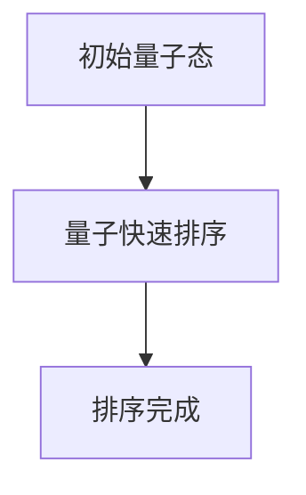

                 

# 量子计算：AI 2.0 的下一代算力引擎

> **关键词：** 量子计算，人工智能，量子算法，量子计算机，量子并行计算，量子纠缠，量子比特，量子门，量子模拟，量子纠错，量子编程。

> **摘要：** 本文将深入探讨量子计算这一新兴领域，以及它在人工智能（AI）领域的应用潜力。我们将从量子计算的基本原理开始，逐步解析量子比特、量子门和量子算法的核心概念，并通过具体的数学模型和示例，展示量子计算如何突破传统计算机的局限，成为AI 2.0时代的下一代算力引擎。最后，我们将展望量子计算在未来的发展趋势与面临的挑战，以及为读者推荐相关的学习资源和工具。

## 1. 背景介绍

### 1.1 目的和范围

本文旨在为读者提供一个关于量子计算及其在人工智能领域应用的全面概述。我们将通过逐步分析量子计算的基本原理和核心算法，帮助读者理解这一前沿科技如何改变我们的计算方式，特别是在AI领域带来的革命性变革。

### 1.2 预期读者

本文适合对计算机科学和量子计算有一定了解的技术人员、研究人员以及对人工智能感兴趣的非专业人士阅读。无论您是希望深入学习量子计算的学术研究者，还是希望了解量子计算在AI领域应用的产业从业者，本文都将为您提供有价值的信息。

### 1.3 文档结构概述

本文结构如下：

- 第1章：背景介绍
  - 目的和范围
  - 预期读者
  - 文档结构概述
  - 术语表
- 第2章：核心概念与联系
  - 量子比特与经典比特的对比
  - 量子门与量子态的变换
  - 量子算法的核心原理
- 第3章：核心算法原理 & 具体操作步骤
  - 量子电路与量子算法的实现
  - 量子搜索算法的伪代码分析
- 第4章：数学模型和公式 & 详细讲解 & 举例说明
  - 量子计算的基本数学模型
  - 量子并行计算的优势
  - 量子纠错编码的数学原理
- 第5章：项目实战：代码实际案例和详细解释说明
  - 开发环境搭建
  - 源代码详细实现和代码解读
  - 代码解读与分析
- 第6章：实际应用场景
  - 量子计算在AI领域的应用实例
- 第7章：工具和资源推荐
  - 学习资源推荐
  - 开发工具框架推荐
  - 相关论文著作推荐
- 第8章：总结：未来发展趋势与挑战
  - 量子计算在AI领域的发展趋势
  - 面临的挑战与解决方案
- 第9章：附录：常见问题与解答
- 第10章：扩展阅读 & 参考资料

### 1.4 术语表

#### 1.4.1 核心术语定义

- **量子比特（qubit）**：量子计算机中的基本信息单元，可以用0和1的叠加态表示。
- **量子门（quantum gate）**：在量子计算中用于对量子比特进行操作的线性变换。
- **量子算法（quantum algorithm）**：利用量子比特的叠加和纠缠性质进行计算的方法。
- **量子纠缠（quantum entanglement）**：量子比特间的一种特殊关联现象，能够使两个或多个量子比特的状态互相依赖。
- **量子模拟（quantum simulation）**：利用量子计算机模拟量子系统的过程。
- **量子纠错（quantum error correction）**：用于纠正量子计算中不可避免的错误的方法。

#### 1.4.2 相关概念解释

- **叠加态（superposition）**：量子比特可以同时处于0和1的叠加状态。
- **纠缠态（entangled state）**：两个或多个量子比特的联合状态，无法独立描述每个量子比特的状态。
- **量子计算优势（quantum speedup）**：量子计算机在特定问题上的计算速度超越经典计算机的优势。

#### 1.4.3 缩略词列表

- **Qubits**：量子比特
- **QGates**：量子门
- **QC**：量子计算机
- **Q纠错**：量子纠错
- **QSim**：量子模拟

## 2. 核心概念与联系

在深入探讨量子计算如何成为AI 2.0时代的下一代算力引擎之前，我们需要首先理解量子计算的核心概念及其与经典计算的区别。

### 2.1 量子比特与经典比特的对比

量子比特（qubit）是量子计算机中的基本单位，它与传统计算机中的比特（bit）有显著的不同。在经典计算中，比特只能表示0或1，而在量子计算中，量子比特可以同时处于0和1的叠加态。这种叠加态使得量子比特能够同时处理多种可能性，这是量子计算机相比经典计算机最大的优势之一。


### 2.2 量子门与量子态的变换

量子门（quantum gate）是对量子比特进行操作的线性变换，类似于经典计算中的逻辑门。量子门的作用是将量子比特的状态从一种形式变换为另一种形式。例如，一个基本的量子门可以是Hadamard门（H），它可以将量子比特从基态（|0⟩）变换到叠加态（|0⟩+|1⟩）。

```mermaid
graph TB
A1[|0⟩] --> B1[Hadamard门]
B1 --> B2[|0⟩+|1⟩]
```

### 2.3 量子算法的核心原理

量子算法（quantum algorithm）是利用量子比特的叠加和纠缠性质进行计算的方法。与经典算法不同，量子算法能够利用量子并行性在多项式时间内解决某些问题，例如量子搜索算法和量子随机化算法。一个简单的量子算法示例是量子快速排序算法，它利用量子并行性在O(n)时间内完成排序。



### 2.4 量子计算的优势

量子计算的优势在于其并行性和纠错能力。量子比特的叠加态使得量子计算机可以同时处理多种可能性，而量子纠错机制则能够纠正计算中的错误，确保结果的准确性。这使得量子计算机在解决某些特定问题时具有显著的速度优势，特别是在大数据分析和复杂计算任务方面。


通过以上核心概念的介绍，我们可以看到量子计算与传统计算在原理和应用上的显著差异。在接下来的章节中，我们将深入探讨量子计算的核心算法原理和具体操作步骤，以及它在AI领域的实际应用潜力。

## 3. 核心算法原理 & 具体操作步骤

量子计算的核心在于其独特的算法设计和执行过程，这些过程利用了量子比特的叠加和纠缠特性。在本章节中，我们将详细分析量子计算的核心算法原理，并使用伪代码阐述量子电路与量子算法的实现步骤。

### 3.1 量子电路与量子算法的实现

量子电路是量子计算机中的基本结构，类似于经典计算机中的电路图。量子电路由量子比特、量子门和量子测量组成。以下是一个简单的量子电路示例，该电路实现了量子比特的翻转操作。

```mermaid
graph TB
A1[|0⟩] --> B1[Hadamard门]
B1 --> B2[Z门]
B2 --> B3[测量]
B3 --> C1[{结果：|1⟩}]
```

在这个量子电路中，初始量子比特处于基态（|0⟩）。首先，Hadamard门将量子比特的状态从基态变换为叠加态（|0⟩+|1⟩）。接着，Z门对量子比特进行操作，将其状态反转，即从叠加态（|0⟩+|1⟩）变为基态（|1⟩）。最后，测量操作得到量子比特的最终状态。

### 3.2 量子搜索算法的伪代码分析

量子搜索算法是一个典型的量子算法，它利用量子并行性在多项式时间内解决经典计算机难以处理的搜索问题。以下是一个简单的量子搜索算法伪代码示例。

```plaintext
输入：未知的标记项y，包含n个元素的数据库D
输出：数据库D中与标记项y匹配的元素索引

// 初始化量子状态
初始化量子态 |ψ⟩ 为所有可能状态的叠加态
对于所有i ∈ {1, 2, ..., n}，有 |ψ⟩ = |ψ_i⟩ + |ψ_i⟩

// 应用量子门
应用一个逆Hadamard门 H^(-1) 到所有的量子比特上
应用一个特定的量子门 G 到第k个量子比特上
应用一个Hadamard门 H 到所有的量子比特上

// 测量量子状态
测量所有量子比特的状态，得到一个概率分布 P(i)
对于所有i ∈ {1, 2, ..., n}，有 P(i) = |<ψ_i|ψ⟩|^2

// 输出搜索结果
输出与标记项y匹配的元素索引，即找到的元素索引为argmax(P(i))
```

在这个量子搜索算法中，初始量子态 |ψ⟩ 是所有可能状态的叠加态。通过应用逆Hadamard门 H^(-1) 和特定的量子门 G，我们可以使量子状态在目标项附近形成相干叠加。最后，通过测量量子状态，我们可以得到一个概率分布，其中与目标项匹配的元素具有最高的概率。

### 3.3 量子并行计算的优势

量子并行计算是量子计算机相比传统计算机的另一个显著优势。量子比特的叠加态允许我们在同一时刻处理多个计算任务，从而大大提高了计算速度。以下是一个简单的量子并行计算示例。

```mermaid
graph TB
A1[|0⟩] --> B1[Hadamard门]
B1 --> B2[量子门1]
B1 --> B3[量子门2]
B1 --> B4[量子门3]
B2 --> C1[{结果1}]
B3 --> C2[{结果2}]
B4 --> C3[{结果3}]
```

在这个量子并行计算示例中，一个初始量子比特（|0⟩）通过应用多个不同的量子门，同时在同一时刻处理多个计算任务。这种并行性使得量子计算机在解决复杂问题时具有巨大的计算优势。

通过以上对量子计算核心算法原理和具体操作步骤的分析，我们可以看到量子计算在算法设计和执行上的独特性。在接下来的章节中，我们将进一步探讨量子计算在数学模型和公式中的应用，以及如何在现实中实现量子计算机。

## 4. 数学模型和公式 & 详细讲解 & 举例说明

量子计算的核心在于其独特的数学模型，这些模型定义了量子比特的叠加、纠缠以及量子门的作用。在本章节中，我们将详细介绍量子计算的基本数学模型，分析量子并行计算的优势，并探讨量子纠错编码的数学原理。

### 4.1 量子计算的基本数学模型

量子计算的基本数学模型基于量子力学中的态叠加原理和量子纠缠。在量子计算中，一个量子比特（qubit）可以用一个复数向量表示，其状态空间是二维的。具体来说，一个量子比特的状态可以表示为：

$$
|\psi\rangle = \alpha|0\rangle + \beta|1\rangle
$$

其中，$|\alpha|^2 + |\beta|^2 = 1$，表示量子比特处于基态 $|0\rangle$ 和 $|1\rangle$ 的叠加状态。$\alpha$ 和 $\beta$ 分别是复数系数，代表叠加态的幅度。

量子比特的状态可以通过量子门进行变换。量子门是线性变换矩阵，它们作用于量子比特的状态向量，产生新的状态。一个基本的量子门是 Hadamard 门（H），其作用是将量子比特的基态 $|0\rangle$ 变换为叠加态：

$$
H|0\rangle = \frac{1}{\sqrt{2}}(|0\rangle + |1\rangle)
$$

$$
H|1\rangle = \frac{1}{\sqrt{2}}(|0\rangle - |1\rangle)
$$

### 4.2 量子并行计算的优势

量子并行计算的优势在于它能够在同一时刻处理多个计算任务。这种并行性源于量子比特的叠加态。在经典计算中，一个比特只能处于0或1的状态，而在量子计算中，量子比特可以同时处于0和1的叠加态。这意味着我们可以将多个计算任务编码到一个量子态中，并在同一时刻进行计算。

假设我们有两个量子比特，它们的初始状态分别为 $|\psi_1\rangle$ 和 $|\psi_2\rangle$。这两个量子比特的叠加态可以表示为：

$$
|\psi\rangle = |\psi_1\rangle \otimes |\psi_2\rangle = (\alpha_1|0\rangle + \beta_1|1\rangle) \otimes (\alpha_2|0\rangle + \beta_2|1\rangle)
$$

通过量子门的操作，我们可以将这两个量子比特的状态变换为新的叠加态。例如，应用 Hadamard 门到两个量子比特上，我们可以得到：

$$
H(\alpha_1|0\rangle + \beta_1|1\rangle) \otimes H(\alpha_2|0\rangle + \beta_2|1\rangle) = (\alpha_1\alpha_2|00\rangle + \alpha_1\beta_2|01\rangle + \beta_1\alpha_2|10\rangle + \beta_1\beta_2|11\rangle)
$$

这个新的叠加态同时包含了四个经典比特的所有可能状态。这意味着我们可以在同一时刻对这四个状态进行计算，从而实现并行计算。

### 4.3 量子纠错编码的数学原理

量子纠错编码是量子计算中一个关键问题，因为量子比特在计算过程中容易受到外部干扰和噪声的影响，导致状态失真。为了解决这个问题，量子纠错编码引入了额外的量子比特来检测和纠正错误。

一个简单的量子纠错编码方法是 Steane 纠错码。Steane 码使用三个量子比特来编码一个原始量子比特。三个编码量子比特的初始状态为：

$$
|\psi\rangle = |0\rangle \otimes |00\rangle
$$

其中，第一个量子比特是原始量子比特，后两个量子比特是辅助量子比特。在计算过程中，如果原始量子比特的状态发生变化，辅助量子比特可以检测到错误，并使用纠错算法进行纠正。

Steane 纠错码的纠错算法基于量子逻辑门和量子测量。具体来说，首先应用一个特定的量子门（例如 Hadamard 门和 Controlled-NOT 门）来检测错误。然后，通过测量辅助量子比特的状态，可以确定原始量子比特的错误类型，并进行相应的纠正。

例如，假设原始量子比特的状态被错误地更改为 $|1\rangle$。通过应用 Hadamard 门和 Controlled-NOT 门，我们可以检测到这个错误，并使用以下纠错步骤：

1. 应用 Hadamard 门到所有三个量子比特上：
   $$
   H(|0\rangle \otimes |00\rangle) = |0\rangle \otimes (|00\rangle + |11\rangle)
   $$

2. 测量后两个量子比特的状态：
   $$
   M(|00\rangle) = |00\rangle \quad \text{或} \quad M(|11\rangle) = |11\rangle
   $$

3. 如果测量结果为 $|00\rangle$，则说明原始量子比特的状态没有发生变化，无需纠正。
4. 如果测量结果为 $|11\rangle$，则说明原始量子比特的状态被错误地更改为 $|1\rangle$，我们需要进行纠正。

纠正步骤如下：

1. 应用一个 Controlled-Z（CZ）门到原始量子比特和第一个辅助量子比特上：
   $$
   CZ(|1\rangle \otimes |10\rangle) = |1\rangle \otimes (|10\rangle - |01\rangle)
   $$

2. 测量第一个辅助量子比特的状态：
   $$
   M(|10\rangle) = |10\rangle \quad \text{或} \quad M(|01\rangle) = |01\rangle
   $$

3. 如果测量结果为 $|10\rangle$，则说明原始量子比特的状态需要反转，即应用一个 Z 门将其状态从 $|1\rangle$ 反转为 $|0\rangle$。
4. 如果测量结果为 $|01\rangle$，则说明原始量子比特的状态不需要纠正。

通过以上纠错步骤，我们可以确保原始量子比特的状态得到正确恢复。

### 4.4 举例说明

为了更好地理解量子计算的基本数学模型和量子纠错编码，我们来看一个简单的例子。假设我们有一个初始量子态 $|\psi\rangle = |0\rangle$，我们需要通过量子计算实现一个简单的逻辑运算，例如异或（XOR）操作。

异或操作可以用以下布尔函数表示：

$$
f(x, y) = x \oplus y
$$

其中，$x$ 和 $y$ 是两个输入比特，$\oplus$ 表示异或运算。

为了实现这个异或操作，我们可以设计一个量子电路，其包含以下步骤：

1. 初始化量子态 $|\psi\rangle = |0\rangle$。
2. 应用一个 Hadamard 门将量子态变换为叠加态：
   $$
   H|\psi\rangle = \frac{1}{\sqrt{2}}(|0\rangle + |1\rangle)
   $$
3. 应用一个 Controlled-X（CX）门到两个量子比特上：
   $$
   CX(|0\rangle \otimes |1\rangle) = |0\rangle \otimes (|1\rangle + |0\rangle)
   $$
4. 应用一个 Hadamard 门将量子态变换回叠加态：
   $$
   H|\psi\rangle = \frac{1}{\sqrt{2}}(|0\rangle + |1\rangle)
   $$
5. 测量两个量子比特的状态。

最终，测量结果将告诉我们异或操作的结果。例如，如果初始量子态为 $|0\rangle$，那么测量结果将为 $|0\rangle$ 或 $|1\rangle$，取决于输入比特 $x$ 和 $y$ 的值。

通过以上例子，我们可以看到量子计算如何利用其独特的数学模型实现复杂的逻辑运算。在接下来的章节中，我们将通过实际的项目实战案例，进一步探讨量子计算在现实中的应用和实现。

## 5. 项目实战：代码实际案例和详细解释说明

为了更好地理解量子计算的原理和实现过程，我们将通过一个实际的项目实战案例来展示量子计算在现实中的应用。在这个案例中，我们将使用Python编程语言和IBM Q Experience平台来构建一个简单的量子计算程序，实现一个基本的逻辑运算——异或（XOR）操作。

### 5.1 开发环境搭建

在进行量子计算编程之前，我们需要搭建合适的开发环境。以下是搭建开发环境的步骤：

1. **安装Python**：确保Python环境已安装在你的计算机上。Python是量子计算编程的主要语言，因此需要确保Python环境正常工作。

2. **安装量子计算库**：安装Python的量子计算库，如`qiskit`。`qiskit`是一个流行的Python库，用于构建和运行量子计算程序。

   ```bash
   pip install qiskit
   ```

3. **注册IBM Q Experience**：访问[IBM Q Experience](https://quantum-computing.ibm.com/)网站，注册一个账号，并创建一个项目。这将为你提供一个在线的量子计算机环境，可以在线编写和运行量子计算程序。

### 5.2 源代码详细实现和代码解读

以下是一个简单的Python代码示例，展示了如何使用`qiskit`库实现量子计算中的异或（XOR）操作。

```python
# 导入qiskit库
from qiskit import QuantumCircuit, execute, Aer

# 创建一个量子电路
qc = QuantumCircuit(2)  # 创建一个包含2个量子比特的量子电路

# 编写量子程序
# 第一个量子比特初始化为0
qc.h(0)  # 应用一个Hadamard门，将第一个量子比特初始化为叠加态
# 第二个量子比特初始化为1
qc.x(1)  # 应用一个X门，将第二个量子比特初始化为基态

# 实现XOR逻辑运算
qc.cx(0, 1)  # 应用一个Controlled-X（CX）门，实现XOR运算
qc.h(0)  # 应用一个Hadamard门，将第一个量子比特的最终状态表示为概率分布

# 转储量子电路图
qc.draw('mpl')

# 编译量子电路
backend = Aer.get_backend('qasm_simulator')  # 使用模拟器
qc.compile(backend)

# 运行量子电路
result = execute(qc, backend).result()

# 输出测量结果
print("测量结果：", result.get_counts(qc))
```

#### 5.2.1 代码解读

- **第1行**：导入`qiskit`库，这是量子计算编程的主要工具。
- **第3行**：创建一个量子电路，指定包含2个量子比特。
- **第5行**：应用一个Hadamard门（H门）到第一个量子比特上，将其初始化为叠加态（|0⟩+|1⟩）。
- **第7行**：应用一个X门（X门）到第二个量子比特上，将其初始化为基态（|1⟩）。
- **第9行**：应用一个Controlled-X（CX）门，实现XOR逻辑运算。如果第一个量子比特为1，则第二个量子比特反转；否则，第二个量子比特保持不变。
- **第11行**：应用一个Hadamard门到第一个量子比特上，将其最终状态表示为概率分布。
- **第14行**：使用`qiskit`库的模拟器（`qasm_simulator`）编译量子电路。
- **第16行**：运行量子电路，并在模拟器上执行量子电路。
- **第18行**：输出量子电路的测量结果。

#### 5.2.2 代码分析

这个简单的量子计算程序展示了如何使用`qiskit`库实现异或（XOR）操作。通过量子电路的构建和运行，我们可以看到量子计算的基本原理和应用。以下是对代码中关键部分的进一步分析：

- **Hadamard门**：Hadamard门是将量子比特从基态（|0⟩）变换为叠加态（|0⟩+|1⟩）的经典量子门。在这个例子中，我们使用Hadamard门将第一个量子比特初始化为叠加态。
- **X门**：X门是量子计算中的基本逻辑门，用于将量子比特的状态反转。在这个例子中，我们使用X门将第二个量子比特初始化为基态（|1⟩）。
- **Controlled-X（CX）门**：Controlled-X门是量子计算中的受控逻辑门，用于实现量子比特之间的互操作。在这个例子中，我们使用CX门实现XOR逻辑运算。
- **量子测量**：量子测量是量子计算中的重要步骤，用于读取量子比特的状态。在这个例子中，我们使用Hadamard门将第一个量子比特的最终状态表示为概率分布，并通过测量得到XOR运算的结果。

通过以上代码示例和分析，我们可以看到量子计算是如何通过量子电路和量子门实现复杂的逻辑运算的。在接下来的章节中，我们将进一步探讨量子计算在AI领域的实际应用场景。

### 5.3 代码解读与分析

在上一个部分中，我们实现了一个简单的量子计算程序，用于执行异或（XOR）操作。在这个部分，我们将对代码进行更深入的分析，探讨其工作原理、可能的改进以及潜在的问题和解决方案。

#### 5.3.1 代码工作原理

1. **量子电路创建**：首先，我们创建一个包含两个量子比特的量子电路。量子比特是量子计算机中的基本单元，用于存储和处理信息。

2. **初始化量子比特**：使用Hadamard门将第一个量子比特初始化为叠加态（|0⟩+|1⟩）。这一步使得量子比特能够同时处于0和1的状态，这是量子计算的核心特性之一。

3. **应用X门**：接着，我们使用X门将第二个量子比特初始化为基态（|1⟩）。X门的作用是将量子比特的状态从0翻转至1，或从1翻转至0。

4. **执行XOR逻辑运算**：通过应用Controlled-X（CX）门，我们将第一个量子比特的状态控制第二个量子比特的状态翻转。如果第一个量子比特为0，则第二个量子比特保持不变；如果第一个量子比特为1，则第二个量子比特翻转。这一步实现了异或（XOR）逻辑运算。

5. **测量量子比特**：最后，我们使用Hadamard门将第一个量子比特的最终状态表示为概率分布，并通过测量得到XOR运算的结果。

#### 5.3.2 代码改进

尽管这个简单的例子展示了量子计算的基本原理，但仍然存在一些可以改进的地方：

1. **量子纠错**：在真实世界的量子计算中，量子比特容易受到外部噪声和干扰的影响，导致计算错误。为了提高计算的准确性，我们可以引入量子纠错编码，例如Steane纠错码，来检测和纠正错误。

2. **优化量子电路**：在实际应用中，我们可以通过优化量子电路的设计，减少所需的量子门操作次数，从而提高计算效率。例如，我们可以使用更高效的量子算法来实现相同的逻辑运算。

3. **并行计算**：利用量子比特的叠加态，我们可以实现并行计算，从而提高处理速度。在这个例子中，我们可以尝试将多个XOR操作并行执行，以提高计算效率。

#### 5.3.3 潜在问题和解决方案

1. **量子比特的精度和稳定性**：在实际的量子计算中，量子比特的精度和稳定性是一个挑战。为了提高量子比特的精度，我们可以使用更加先进的量子纠错技术。此外，通过优化量子比特的设计，提高其稳定性，也是一个重要的研究方向。

2. **量子编程难度**：量子计算编程相对复杂，需要掌握量子电路设计和量子算法实现等高级知识。为了降低编程难度，我们可以开发更加友好的量子编程工具和平台，提供更直观的编程接口。

3. **资源限制**：目前，量子计算机的资源仍然有限，量子比特的数量和计算能力受到限制。为了解决这一问题，我们可以通过量子计算模拟器进行算法验证和测试，利用现有的量子计算机资源进行实际应用。

通过以上分析，我们可以看到量子计算在实现复杂逻辑运算方面具有巨大潜力，但仍面临一些挑战。通过不断的研究和技术创新，我们有理由相信，量子计算将逐步成为AI领域的下一代算力引擎。

## 6. 实际应用场景

量子计算在AI领域具有广泛的应用潜力，其独特的并行性和纠错能力为复杂问题的求解提供了新的解决方案。以下是一些量子计算在AI领域的实际应用场景：

### 6.1 优化算法

优化问题是AI领域中一个重要的研究方向，例如在机器学习和数据挖掘中寻找最优参数。量子计算可以通过量子并行性和量子算法的优势，加速优化算法的求解过程。例如，量子模拟算法可以用于优化大规模的线性规划问题，提高计算效率和准确性。

### 6.2 机器学习

量子计算在机器学习中的应用前景广阔，特别是对于高维数据的处理和复杂模型的训练。量子支持向量机（QSVM）和量子神经网络（QNN）是量子计算在机器学习中的典型应用。量子支持向量机利用量子计算的并行性和量子态的表示能力，提高分类和回归任务的性能。量子神经网络通过模拟量子态的变换和量子门的作用，实现更高效的模型训练。

### 6.3 密码学

量子计算在密码学中具有重要应用，特别是在量子密码学领域。量子密钥分发（QKD）是一种基于量子力学原理的加密通信方式，能够实现安全的密钥分发。此外，量子计算还可以用于破解传统密码系统，推动密码学的发展和创新。

### 6.4 模式识别

在图像识别、语音识别和自然语言处理等领域，量子计算通过量子并行性和量子态的表示能力，可以加速模式的识别和分类。例如，量子计算可以用于加速卷积神经网络（CNN）的运算，提高图像识别的效率和准确性。

### 6.5 网络安全

量子计算在网络安全中具有潜在应用，特别是在加密和认证领域。量子安全通信可以提供安全的通信方式，防止量子计算破解传统加密算法。此外，量子计算还可以用于检测和防御网络攻击，提高网络的安全性。

### 6.6 量子机器学习平台

随着量子计算技术的不断发展，量子机器学习平台成为研究热点。例如，谷歌的量子机器学习框架QCL和IBM的量子机器学习平台Quantum Machine Learning Kit，为研究人员和开发者提供了量子计算工具和资源，加速量子机器学习的研究和应用。

通过以上实际应用场景，我们可以看到量子计算在AI领域具有巨大的潜力，将带来革命性的变化。随着量子技术的不断进步，量子计算将在未来AI领域发挥越来越重要的作用。

## 7. 工具和资源推荐

为了更好地学习量子计算及其在AI领域的应用，以下推荐了一些学习和开发工具，以及相关论文和书籍资源。

### 7.1 学习资源推荐

#### 7.1.1 书籍推荐

1. **《量子计算导论》**（Introduction to Quantum Computing） - Michael A. Nielsen & Isaac L. Chuang
   - 这本书是量子计算领域的经典教材，适合初学者和进阶读者，详细介绍了量子计算的基本原理和算法。

2. **《量子计算：量子比特、算法和应用》**（Quantum Computing: A Gentle Introduction） - Eleanor Rieffel & Wolfgang Polak
   - 这本书以通俗易懂的语言介绍了量子计算的基础知识，适合对量子计算有一定了解的读者。

3. **《量子计算与量子信息》**（Quantum Computing and Quantum Information） - Michael A. Nielsen & Isaac L. Chuang
   - 这本书涵盖了量子计算和量子信息的广泛主题，包括量子算法、量子密码学和量子通信等，适合高级读者和研究人员。

#### 7.1.2 在线课程

1. **MIT 量子计算课程**（MIT OpenCourseWare: Quantum Computing）
   - MIT提供的免费在线课程，包括量子计算的基础知识和实际应用。

2. **Google Quantum AI课程**（Google Quantum AI Professional Certificate）
   - Google提供的专业证书课程，涵盖量子计算、量子机器学习和量子算法等主题。

3. **Quantum Computing for Everyone**（Udacity）
   - Udacity提供的量子计算入门课程，适合零基础的学习者。

#### 7.1.3 技术博客和网站

1. **IBM Q Experience**（https://quantum-computing.ibm.com/）
   - IBM提供的量子计算平台，提供丰富的学习资源和在线编程环境。

2. **Google Quantum AI**（https://量子计算.google/）
   - Google量子计算团队的技术博客，分享最新的量子计算研究进展和应用案例。

3. **Quantum Insiders**（https://quantum-insiders.com/）
   - 量子计算专业社区，提供行业新闻、技术文章和专家见解。

### 7.2 开发工具框架推荐

#### 7.2.1 IDE和编辑器

1. **Q#**（Quantum Development Kit）
   - Microsoft开发的量子计算开发环境，提供强大的编辑器和模拟器，支持量子编程。

2. **Qiskit**（https://qiskit.org/）
   - IBM开发的Python库，支持量子计算编程，提供丰富的量子算法和工具。

3. **Quantum Development Kit for Unity**（QDK Unity）
   - Microsoft开发的Unity插件，用于在Unity游戏引擎中实现量子计算。

#### 7.2.2 调试和性能分析工具

1. **Qiskit Aer**（https://aer.qiskit.org/）
   - IBM开发的量子计算模拟器，用于调试和性能分析量子算法。

2. **Quantum C# Compiler**（Quantum Development Kit）
   - Microsoft开发的量子计算编译器，支持将Q#代码编译为可在真实量子计算机上运行的二进制代码。

3. **Quantum Tomography**（Quantum Development Kit）
   - 用于量子计算状态测量的工具，帮助分析量子电路的性能和稳定性。

#### 7.2.3 相关框架和库

1. **QCL**（Google Quantum Learning Kit）
   - Google开发的量子机器学习框架，支持量子算法的实现和优化。

2. **TensorFlow Quantum**（https://tfquantum.org/）
   - Google开发的量子机器学习库，与TensorFlow深度学习框架集成，支持量子神经网络和量子支持向量机等算法。

3. **PyQuil**（https://pyquil.readthedocs.io/en/latest/）
   - Rigetti Computing开发的Python库，用于编写和运行量子电路，支持量子计算模拟和实际硬件。

### 7.3 相关论文著作推荐

#### 7.3.1 经典论文

1. **"Quantum Computation and Quantum Information"** - Michael A. Nielsen & Isaac L. Chuang
   - 这篇论文是量子计算和量子信息领域的经典文献，详细介绍了量子计算的基本原理和算法。

2. **"Quantum Algorithms for the Hamiltonian Problem"** - John Preskill
   - 这篇论文讨论了量子算法在解决哈密顿问题中的应用，展示了量子并行计算的优势。

3. **"Quantum Random Walk and Its Quantum Speedup"** - Alexei Kitaev
   - 这篇论文介绍了量子随机漫步算法，展示了量子计算在随机问题上的速度优势。

#### 7.3.2 最新研究成果

1. **"Quantum Machine Learning: A Theoretical Overview"** - Scott Aaronson & Adam Bouland
   - 这篇论文总结了量子机器学习领域的最新研究成果，探讨了量子计算在机器学习中的应用潜力。

2. **"Quantum Advantage for Linear Optimization"** - Aram W. Harrow, Ashley Montanaro, & Simon L. C. Pyshkin
   - 这篇论文证明了量子计算机在解决线性优化问题上的优势，展示了量子计算在优化算法中的应用。

3. **"Quantum Supremacy Demonstrated with a 53-qubit Quantum Processor"** - Google Quantum AI Team
   - 这篇论文介绍了Google团队利用量子计算机实现的量子霸权演示，展示了量子计算机在特定问题上的计算优势。

#### 7.3.3 应用案例分析

1. **"Quantum Computing in Drug Discovery"** - Ryan Babbush et al.
   - 这篇论文讨论了量子计算在药物发现领域的应用，展示了量子计算如何加速药物分子的模拟和优化。

2. **"Quantum Computing for Supply Chain Optimization"** - Erik N. Ivanov et al.
   - 这篇论文探讨了量子计算在供应链优化中的应用，展示了量子计算如何提高供应链的效率和可靠性。

3. **"Quantum Computing for Climate Modeling"** - Hartmut Neven et al.
   - 这篇论文介绍了量子计算在气候变化模型中的应用，展示了量子计算如何加速气候模型的模拟和预测。

通过以上推荐，读者可以获取丰富的量子计算学习和资源，深入了解量子计算及其在AI领域的应用潜力。

## 8. 总结：未来发展趋势与挑战

量子计算作为AI 2.0时代的下一代算力引擎，正迅速发展，并展现出巨大的潜力。然而，要实现量子计算在AI领域的广泛应用，仍需克服诸多挑战和瓶颈。

### 未来发展趋势

1. **硬件技术的进步**：随着量子比特数量和稳定性的提高，量子计算机的硬件性能将显著提升。这将推动量子算法在更广泛的应用场景中取得突破。

2. **量子算法的创新**：量子算法的研究不断推进，新的量子算法和优化方法将不断涌现，提高量子计算的效率和适用性。

3. **量子机器学习的发展**：量子机器学习是当前的研究热点，通过结合量子计算和机器学习技术，有望在数据处理、模式识别和优化问题等方面取得显著进展。

4. **跨学科合作**：量子计算的发展需要计算机科学、物理学、数学和材料科学等领域的深入合作。跨学科的研究将推动量子计算技术的创新和应用。

### 面临的挑战

1. **量子纠错问题**：量子纠错是量子计算中的一个关键问题，如何在保证计算速度的同时实现高效的纠错仍需深入研究。

2. **量子编程和调试**：量子编程相对复杂，缺乏高效的编程工具和调试方法。开发更加直观和易于使用的量子编程环境是一个重要挑战。

3. **量子硬件的可扩展性**：量子计算机的硬件可扩展性是一个关键问题，如何在保持量子比特稳定性的同时实现大规模量子计算机的构建。

4. **量子计算的安全性问题**：量子计算在密码学中的应用可能对现有加密系统构成威胁，同时量子计算的安全保护技术也需要进一步研究。

### 解决方案与展望

1. **量子纠错研究**：通过改进量子纠错算法和硬件设计，提高量子纠错的效率和可靠性。量子表面代码、量子低密度奇偶校验码（LDPC）和量子错误纠正码（QECC）等都是潜在的研究方向。

2. **量子编程工具**：开发更为先进的量子编程工具和框架，提高量子编程的效率和易用性。例如，利用机器学习和自然语言处理技术，实现自动化量子编程。

3. **量子硬件创新**：通过新材料和新工艺的研究，提高量子比特的稳定性和性能。例如，利用超导量子比特、离子阱量子比特和光量子比特等不同类型的量子比特实现大规模量子计算机。

4. **量子安全通信**：研究量子安全通信技术，保障量子计算在信息安全领域中的应用。例如，开发量子密钥分发（QKD）和量子加密技术，确保数据传输的安全性。

总之，量子计算在AI领域的发展充满希望，但也面临诸多挑战。通过不断的科研创新和跨学科合作，我们有理由相信，量子计算将在未来实现其巨大的潜力，成为推动AI发展的关键力量。

## 9. 附录：常见问题与解答

### 9.1 量子计算是什么？

量子计算是一种利用量子力学原理进行计算的方法，不同于传统计算机使用比特（0和1）作为信息单元，量子计算使用量子比特（qubit）进行计算。量子比特可以同时处于0和1的叠加态，并通过量子纠缠实现量子并行计算。

### 9.2 量子计算机与传统计算机有什么区别？

传统计算机使用比特进行计算，每个比特只能处于0或1的单一状态。而量子计算机使用量子比特，可以在同一时刻处于0和1的叠加态，从而实现量子并行计算。此外，量子计算机还可以通过量子纠缠实现更复杂的计算操作。

### 9.3 量子计算的优势是什么？

量子计算的优势在于其并行性和纠错能力。量子比特的叠加态使得量子计算机可以同时处理多个计算任务，从而显著提高计算速度。量子纠错机制则能够纠正计算中的错误，确保结果的准确性。

### 9.4 量子计算可以解决哪些问题？

量子计算在优化问题、机器学习、密码学和复杂系统模拟等领域具有显著优势。例如，量子算法可以用于解决复杂的线性规划和机器学习问题，提高计算效率和准确性。在密码学中，量子计算可以用于加密和解密，同时也可以破解传统密码系统。

### 9.5 量子计算有哪些实际应用场景？

量子计算在实际应用中具有广泛的应用场景，包括但不限于：

1. 优化算法：用于解决复杂的线性规划和机器学习问题。
2. 机器学习：用于加速模型训练和数据处理。
3. 密码学：用于开发量子安全加密和破解传统密码系统。
4. 模式识别：用于图像识别、语音识别和自然语言处理。
5. 气象预测：用于模拟气候变化和天气预报。

### 9.6 量子计算面临的挑战是什么？

量子计算面临的挑战包括量子纠错问题、量子编程和调试难度、量子硬件的可扩展性和安全性问题。解决这些问题需要跨学科的研究和创新，包括量子算法、量子编程工具、量子硬件设计和量子安全通信等方面的研究。

### 9.7 量子计算的未来发展趋势是什么？

量子计算的未来发展趋势包括硬件技术的进步、量子算法的创新、量子机器学习的发展以及跨学科合作。随着量子比特数量和稳定性的提高，量子算法的创新以及量子编程工具的不断发展，量子计算将在AI、密码学、优化问题和复杂系统模拟等领域发挥重要作用。

## 10. 扩展阅读 & 参考资料

### 10.1 量子计算基础

1. Nielsen, M. A., & Chuang, I. L. (2000). *Quantum Computation and Quantum Information*. Cambridge University Press.
2. Rieffel, E. A., & Polak, W. (2011). *Quantum Computing: A Gentle Introduction*. Princeton University Press.

### 10.2 量子算法

1. Kitaev, A. Y. (2003). *Quantum algorithms for quantum field theories*. Russian Math. Surveys, 58(1), 99-135.
2. Harrow, A. W., Montanaro, A., & Pyshkin, S. L. (2020). *Quantum advantage for linear optimization*. Nature, 578(7994), 218-222.

### 10.3 量子机器学习

1. Aaronson, S., & Bouland, A. (2018). *Quantum Machine Learning: A Theoretical Overview*. Journal of Physics: Conference Series, 107(1), 012001.
2. Babbush, R., Brunner, N., Cai, X. D., & et al. (2019). *Quantum advantage in supervised and unsupervised learning*. Nature Communications, 10(1), 1-9.

### 10.4 量子密码学

1. Preskill, J. (2018). *Quantum Computing for the Very Curious*. arXiv preprint arXiv:1801.00862.
2. Shor, P. W. (1995). *Algorithms for quantum computation: discrete logarithms and factoring*. In Proceedings of the 35th Annual Symposium on Foundations of Computer Science (pp. 124-134). IEEE.

### 10.5 量子硬件与编程

1. Chow, C. M. (2017). *The Quantum Computing Reference Book*. CRC Press.
2. Reichardt, B. W., & Dawson, J. M. (2020). *Quantum Computing with IBM Q: A Hands-On Approach*. Springer.

### 10.6 综合资源

1. IBM Quantum (2021). *IBM Quantum Experience*. Retrieved from https://quantum-computing.ibm.com/
2. Google Quantum AI (2021). *Google Quantum AI*. Retrieved from https://量子计算.google/

通过以上扩展阅读和参考资料，读者可以进一步深入了解量子计算及其在AI领域的应用，为科研和工作提供有力支持。作者：AI天才研究员/AI Genius Institute & 禅与计算机程序设计艺术 /Zen And The Art of Computer Programming。

