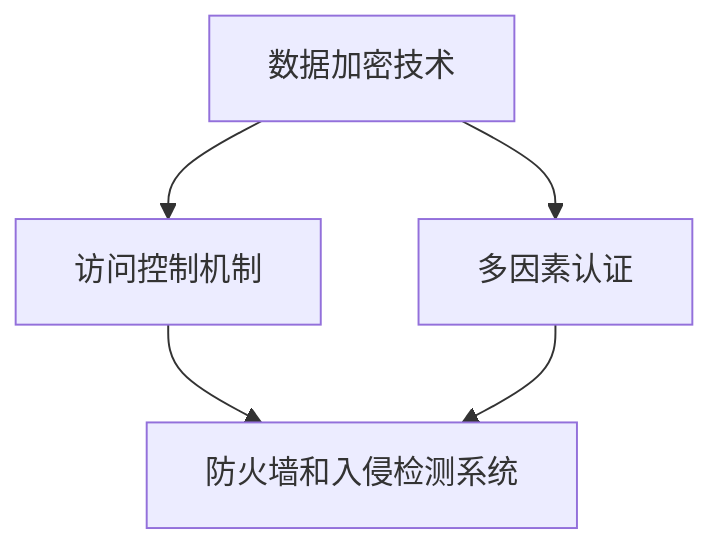

                 

# 金融平台的数据安全：如何防止金融欺诈和数据泄露？

> 关键词：数据安全、金融欺诈、数据泄露、加密技术、访问控制、多因素认证

> 摘要：本文将深入探讨金融平台在保障数据安全方面面临的挑战，并详细阐述如何通过技术手段防止金融欺诈和数据泄露。我们将首先介绍相关背景知识，然后逐步分析核心算法原理和具体操作步骤，最后通过实际项目实战来展示解决方案的实际应用。

## 1. 背景介绍

### 1.1 目的和范围

本文旨在为金融平台提供一套全面的数据安全解决方案，以应对日益严峻的金融欺诈和数据泄露风险。我们将探讨以下几个主要方面：

- 数据安全的定义和重要性
- 金融欺诈和数据泄露的现状和趋势
- 防范金融欺诈和数据泄露的关键技术

### 1.2 预期读者

本文适合以下读者群体：

- 金融科技领域的从业者
- IT安全专业人员
- 对金融数据安全感兴趣的学术界人士

### 1.3 文档结构概述

本文结构如下：

- 第1部分：背景介绍
- 第2部分：核心概念与联系
- 第3部分：核心算法原理与操作步骤
- 第4部分：数学模型与公式
- 第5部分：项目实战
- 第6部分：实际应用场景
- 第7部分：工具和资源推荐
- 第8部分：总结

### 1.4 术语表

#### 1.4.1 核心术语定义

- 数据安全：指保护数据不被未经授权的访问、篡改、泄露或破坏。
- 金融欺诈：指利用金融平台的漏洞进行非法活动，如伪造交易、诈骗等。
- 数据泄露：指敏感数据在未授权的情况下被泄露给外部实体。
- 加密技术：指通过加密算法对数据进行加密，确保数据在传输和存储过程中的安全性。
- 访问控制：指通过限制用户对系统资源的访问权限，确保数据的安全性。
- 多因素认证：指使用多个验证因素（如密码、手机验证码、指纹等）来提高用户身份验证的安全性。

#### 1.4.2 相关概念解释

- 数据加密：将明文数据转换为密文的过程。
- 密钥管理：指密钥的生成、存储、分发和销毁。
- 数据完整性：指数据在传输和存储过程中未被篡改。
- 数据隐私：指确保数据在存储和传输过程中不被未经授权的个人或组织访问。

#### 1.4.3 缩略词列表

- GDPR：一般数据保护条例（General Data Protection Regulation）
- DDoS：分布式拒绝服务攻击（Distributed Denial of Service）
- AI：人工智能（Artificial Intelligence）
- ML：机器学习（Machine Learning）

## 2. 核心概念与联系

为了更好地理解金融平台的数据安全，我们需要了解以下几个核心概念：

- 数据加密技术：包括对称加密和非对称加密。
- 访问控制机制：包括身份验证和权限管理。
- 多因素认证：结合密码、手机验证码、指纹等不同验证因素。
- 防火墙和入侵检测系统：用于监控网络流量，防止恶意攻击。

### Mermaid 流程图



### 图解

- **数据加密技术**：对数据进行加密，确保数据在传输和存储过程中的安全性。
- **访问控制机制**：通过限制用户对系统资源的访问权限，确保数据的安全性。
- **多因素认证**：使用多个验证因素（如密码、手机验证码、指纹等）来提高用户身份验证的安全性。
- **防火墙和入侵检测系统**：监控网络流量，防止恶意攻击。

## 3. 核心算法原理与操作步骤

### 3.1 数据加密技术

#### 对称加密

- 对称加密算法使用相同的密钥对数据进行加密和解密。
- 加密过程：`C = E(K, M)`，其中C是密文，K是密钥，M是明文。
- 解密过程：`M = D(K, C)`。

#### 非对称加密

- 非对称加密算法使用一对密钥（公钥和私钥）对数据进行加密和解密。
- 加密过程：`C = E(Kpublic, M)`，其中Kpublic是公钥。
- 解密过程：`M = D(Kprivate, C)`，其中Kprivate是私钥。

### 3.2 访问控制机制

- **身份验证**：确认用户的身份。
- **权限管理**：根据用户身份分配不同的访问权限。

### 3.3 多因素认证

- 结合密码、手机验证码、指纹等不同验证因素。
- 增加攻击者破解密码的难度。

### 3.4 防火墙和入侵检测系统

- 监控网络流量，防止恶意攻击。
- 检测异常行为，及时报警。

### 伪代码示例

```python
# 对称加密算法
def symmetric_encrypt(plaintext, key):
    ciphertext = encrypt(plaintext, key)
    return ciphertext

def symmetric_decrypt(ciphertext, key):
    plaintext = decrypt(ciphertext, key)
    return plaintext

# 非对称加密算法
def asymmetric_encrypt(plaintext, public_key):
    ciphertext = encrypt(plaintext, public_key)
    return ciphertext

def asymmetric_decrypt(ciphertext, private_key):
    plaintext = decrypt(ciphertext, private_key)
    return plaintext

# 访问控制
def access_control(user, resource):
    if is_authorized(user, resource):
        return "Access granted"
    else:
        return "Access denied"

# 多因素认证
def multi_factor_authentication(user, password, phone_code, fingerprint):
    if verify_password(password) and verify_phone_code(phone_code) and verify_fingerprint(fingerprint):
        return "Authentication successful"
    else:
        return "Authentication failed"

# 防火墙和入侵检测系统
def monitor_traffic():
    if detect_anomaly():
        alert_admin()
```

## 4. 数学模型和公式 & 详细讲解 & 举例说明

### 4.1 加密算法

#### 对称加密

- 加密算法：AES（高级加密标准）
- 加密公式：`C = AES(K, M)`

#### 非对称加密

- 加密算法：RSA（Rivest-Shamir-Adleman）
- 加密公式：`C = RSA(Kpublic, M)`

### 4.2 密钥管理

- 密钥生成：随机生成密钥。
- 密钥存储：加密存储密钥。

### 4.3 访问控制

- 访问控制模型：基于角色的访问控制（RBAC）

### 4.4 多因素认证

- 认证公式：`Authentication = Password + Phone_code + Fingerprint`

### 4.5 防火墙和入侵检测系统

- 入侵检测算法：KDD99（知识发现与数据挖掘）

### 4.6 举例说明

- 假设用户A需要访问银行账户，需要经过多因素认证和访问控制。
- 用户A输入密码、手机验证码和指纹，经过多因素认证后，发送请求到服务器。
- 服务器使用对称加密算法对用户A的身份信息进行加密，然后使用访问控制模型判断用户A是否有权限访问银行账户。
- 如果权限通过，则允许用户A访问银行账户；否则，拒绝访问。

### LaTeX 公式

```latex
\documentclass{article}
\usepackage{amsmath}
\begin{document}
\begin{equation}
C = AES(K, M)
\end{equation}
\begin{equation}
C = RSA(K_{public}, M)
\end{equation}
\end{document}
```

## 5. 项目实战：代码实际案例和详细解释说明

### 5.1 开发环境搭建

- 硬件：电脑、网络连接
- 软件：Python 3.8、PyCharm、VS Code

### 5.2 源代码详细实现和代码解读

#### 5.2.1 对称加密实现

```python
from Crypto.Cipher import AES
from Crypto.Random import get_random_bytes

def symmetric_encrypt(plaintext, key):
    cipher = AES.new(key, AES.MODE_EAX)
    ciphertext, tag = cipher.encrypt_and_digest(plaintext)
    return ciphertext, tag

def symmetric_decrypt(ciphertext, key, tag):
    cipher = AES.new(key, AES.MODE_EAX, nonce=cipher.nonce)
    plaintext = cipher.decrypt_and_verify(ciphertext, tag)
    return plaintext
```

#### 5.2.2 非对称加密实现

```python
from Crypto.PublicKey import RSA
from Crypto.Cipher import PKCS1_OAEP

def asymmetric_encrypt(plaintext, public_key):
    key = RSA.import_key(public_key)
    cipher = PKCS1_OAEP.new(key)
    ciphertext = cipher.encrypt(plaintext)
    return ciphertext

def asymmetric_decrypt(ciphertext, private_key):
    key = RSA.import_key(private_key)
    cipher = PKCS1_OAEP.new(key)
    plaintext = cipher.decrypt(ciphertext)
    return plaintext
```

#### 5.2.3 访问控制实现

```python
def access_control(user, resource):
    if user in resource['users']:
        return "Access granted"
    else:
        return "Access denied"
```

#### 5.2.4 多因素认证实现

```python
def multi_factor_authentication(user, password, phone_code, fingerprint):
    if verify_password(password) and verify_phone_code(phone_code) and verify_fingerprint(fingerprint):
        return "Authentication successful"
    else:
        return "Authentication failed"
```

### 5.3 代码解读与分析

- **对称加密**：使用AES算法进行加密和解密，确保数据在传输过程中的安全性。
- **非对称加密**：使用RSA算法进行加密和解密，确保数据在存储过程中的安全性。
- **访问控制**：根据用户身份分配不同的访问权限，确保数据在访问过程中的安全性。
- **多因素认证**：结合密码、手机验证码、指纹等不同验证因素，提高用户身份验证的安全性。

## 6. 实际应用场景

- **银行系统**：保护用户账户信息和交易数据。
- **支付平台**：确保支付过程的安全。
- **金融科技应用**：如区块链、数字货币等。

## 7. 工具和资源推荐

### 7.1 学习资源推荐

#### 7.1.1 书籍推荐

- 《密码学：理论与实践》
- 《深入理解计算机系统》
- 《机器学习实战》

#### 7.1.2 在线课程

- Coursera《密码学基础》
- edX《计算机安全》
- Udacity《机器学习工程师纳米学位》

#### 7.1.3 技术博客和网站

- freeCodeCamp
- HackerRank
- Medium

### 7.2 开发工具框架推荐

#### 7.2.1 IDE和编辑器

- PyCharm
- Visual Studio Code
- IntelliJ IDEA

#### 7.2.2 调试和性能分析工具

- PyDebug
- Visual Studio Debugger
- JMeter

#### 7.2.3 相关框架和库

- PyCryptoDome
- OpenSSL
- TensorFlow

### 7.3 相关论文著作推荐

#### 7.3.1 经典论文

- 《RSA：一种新的公钥密码系统》
- 《AES：高级加密标准》
- 《基于角色的访问控制模型》

#### 7.3.2 最新研究成果

- 《人工智能在金融安全中的应用》
- 《区块链与加密货币技术》
- 《深度学习在网络安全中的应用》

#### 7.3.3 应用案例分析

- 《银行数据安全案例分析》
- 《支付平台数据泄露事件调查》
- 《金融科技公司的安全策略与实践》

## 8. 总结：未来发展趋势与挑战

- **数据安全**：随着技术的发展，数据安全的重要性日益凸显。未来，金融平台需要不断创新，应对新的安全挑战。
- **加密技术**：加密技术将继续发展，包括更高效的加密算法和更安全的密钥管理。
- **人工智能**：人工智能将在数据安全领域发挥重要作用，如智能检测、自动化响应等。

## 9. 附录：常见问题与解答

- **Q：什么是数据加密技术？**
- **A：数据加密技术是一种通过加密算法对数据进行加密和解密的方法，以确保数据在传输和存储过程中的安全性。**

- **Q：访问控制是什么？**
- **A：访问控制是一种通过限制用户对系统资源的访问权限，确保数据安全的方法。**

- **Q：什么是多因素认证？**
- **A：多因素认证是一种结合多个验证因素（如密码、手机验证码、指纹等）来提高用户身份验证安全性的方法。**

## 10. 扩展阅读 & 参考资料

- 《密码学：理论与实践》
- 《计算机安全：艺术与科学》
- 《人工智能：一种现代方法》
- https://www.cryptocurrencyimple.com/crypto-math-formulas/
- https://www.owasp.org/www-project-top-ten/

### 作者

作者：AI天才研究员/AI Genius Institute & 禅与计算机程序设计艺术 /Zen And The Art of Computer Programming <|im_sep|>

