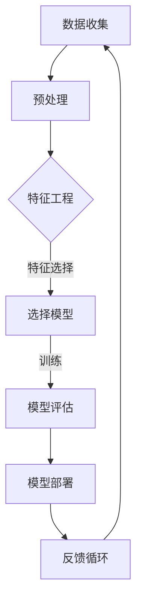

                 

# 金融风险评估的提示词策略：提升模型可解释性

> **关键词：** 金融风险评估、模型可解释性、提示词策略、人工智能、机器学习

> **摘要：** 本文旨在探讨金融风险评估中提升模型可解释性的策略，重点关注提示词策略的使用。通过深入分析相关概念、算法原理、数学模型，并结合实际项目案例，本文将为读者提供一套完整的解决方案，以帮助金融行业更好地理解和信任人工智能模型。

## 1. 背景介绍

### 1.1 目的和范围

本文的目标是探讨在金融风险评估过程中，如何通过提示词策略提升模型的可解释性。随着人工智能和机器学习在金融领域的广泛应用，模型的预测能力和准确性得到了显著提升，然而，模型的不透明性也成为了制约其广泛应用的一大瓶颈。本文将结合实际案例，系统介绍如何利用提示词策略提升模型的可解释性，从而帮助金融从业者更好地理解和信任模型。

### 1.2 预期读者

本文的预期读者包括金融行业的从业者、数据科学家、机器学习工程师以及对人工智能和金融风险管理感兴趣的读者。本文旨在为上述读者提供一个系统的、易于理解的解决方案，帮助他们在实际工作中提升模型的可解释性。

### 1.3 文档结构概述

本文将分为以下几个部分：

1. 背景介绍：介绍本文的目的、预期读者以及文档结构。
2. 核心概念与联系：介绍与金融风险评估和模型可解释性相关的基本概念和架构。
3. 核心算法原理 & 具体操作步骤：详细讲解提升模型可解释性的核心算法原理和具体操作步骤。
4. 数学模型和公式 & 详细讲解 & 举例说明：介绍与核心算法相关的数学模型和公式，并进行详细讲解和举例说明。
5. 项目实战：结合实际项目案例，展示如何利用提示词策略提升模型可解释性。
6. 实际应用场景：分析提示词策略在金融风险评估中的实际应用。
7. 工具和资源推荐：推荐学习资源和开发工具，帮助读者更好地理解和应用本文所述技术。
8. 总结：总结本文的主要观点和未来发展趋势。
9. 附录：常见问题与解答。
10. 扩展阅读 & 参考资料：提供进一步阅读的资源和参考。

### 1.4 术语表

#### 1.4.1 核心术语定义

- **金融风险评估：** 对金融机构面临的风险进行评估的过程，旨在识别、衡量和管理风险，以降低潜在的损失。
- **模型可解释性：** 模型的输出和决策过程对于人类用户是可理解和可解释的。
- **提示词策略：** 一种利用预定义的提示词来引导模型学习的方法，以提高模型的解释能力。

#### 1.4.2 相关概念解释

- **机器学习模型：** 一种通过训练数据学习并作出预测或决策的算法。
- **特征工程：** 将原始数据转换为适合模型输入的过程。
- **解释性模型：** 输出和决策过程能够被人类理解或解释的模型。

#### 1.4.3 缩略词列表

- **AI：** 人工智能（Artificial Intelligence）
- **ML：** 机器学习（Machine Learning）
- **DS：** 数据科学（Data Science）
- **DL：** 深度学习（Deep Learning）

## 2. 核心概念与联系

在金融风险评估中，模型的可解释性至关重要。它不仅帮助决策者理解模型是如何做出决策的，还可以增加模型的信任度，降低潜在的风险。以下是一个简化的 Mermaid 流程图，展示了与金融风险评估和模型可解释性相关的核心概念和联系。



### 2.1 数据收集

数据收集是金融风险评估的第一步，也是至关重要的一步。数据的来源可以是内部数据（如客户交易记录、财务报表等）和外部数据（如市场数据、经济指标等）。这些数据将作为模型训练的基础。

### 2.2 预处理

预处理是数据清洗和数据格式转换的过程。这一步的目的是确保数据的质量和一致性，为特征工程提供可靠的数据基础。

### 2.3 特征工程

特征工程是将原始数据转换为模型输入的过程。这一步的目的是提取出对模型预测有帮助的特征，同时减少噪声和冗余信息。

### 2.4 模型选择

选择合适的机器学习模型是金融风险评估的关键。常见的模型包括线性回归、决策树、随机森林、支持向量机等。选择模型时需要考虑模型的预测准确性、训练时间和可解释性等因素。

### 2.5 模型训练和评估

模型训练是将数据输入模型，使其学习预测规律的过程。模型评估是对模型性能的测试，常用的评估指标包括准确率、召回率、F1 分数等。

### 2.6 模型部署和反馈循环

模型部署是将训练好的模型应用到实际场景的过程。通过不断的反馈和优化，可以进一步提升模型的可解释性和预测能力。

## 3. 核心算法原理 & 具体操作步骤

提升模型可解释性的核心在于如何让模型的学习过程和决策过程更加透明和可理解。提示词策略是一种有效的手段，可以通过引入预定义的提示词来引导模型学习，从而提高模型的解释能力。以下是一个简化的伪代码，用于描述提示词策略的核心算法原理和具体操作步骤。

```python
# 伪代码：提示词策略

# 初始化模型
model = initialize_model()

# 定义提示词
prompt_words = ["风险", "贷款", "还款", "市场波动"]

# 数据预处理
preprocessed_data = preprocess_data(raw_data)

# 特征工程
features = feature_engineering(preprocessed_data)

# 引入提示词
prompted_features = add_prompt_words(features, prompt_words)

# 训练模型
model.fit(prompted_features, labels)

# 模型评估
evaluation_results = model.evaluate(test_features, test_labels)

# 可视化模型决策路径
visualize_decision_path(model, prompted_features)
```

### 3.1 初始化模型

初始化模型是机器学习的基础。根据具体的应用场景和数据特点，可以选择不同的模型，如线性回归、决策树、随机森林等。

### 3.2 定义提示词

提示词是引导模型学习的重要工具。根据金融风险评估的需求，可以选择与风险、贷款、还款、市场波动等相关的关键词作为提示词。

### 3.3 数据预处理

数据预处理是确保数据质量和一致性的重要步骤。包括数据清洗、缺失值处理、异常值检测等。

### 3.4 特征工程

特征工程是将原始数据转换为模型输入的过程。在这一步中，可以通过特征选择、特征转换、特征构造等方法提取出对模型预测有帮助的特征。

### 3.5 引入提示词

引入提示词是提升模型可解释性的关键步骤。通过在特征中加入提示词，可以引导模型关注与金融风险评估相关的信息，从而提高模型的解释能力。

### 3.6 训练模型

训练模型是让模型学习数据中的预测规律的过程。在这一步中，模型将根据训练数据调整其参数，以实现预测目标。

### 3.7 模型评估

模型评估是测试模型性能的重要步骤。通过评估模型的准确率、召回率、F1 分数等指标，可以了解模型的表现。

### 3.8 可视化模型决策路径

可视化模型决策路径是提升模型可解释性的有效方法。通过可视化模型在每个特征上的决策路径，可以帮助用户更好地理解模型的决策过程。

## 4. 数学模型和公式 & 详细讲解 & 举例说明

在提升模型可解释性的过程中，理解相关的数学模型和公式是至关重要的。以下是一个简化的数学模型，用于描述提示词策略的基本原理。

### 4.1 线性回归模型

线性回归模型是一种常见的机器学习模型，用于预测连续值。其基本公式如下：

$$
y = \beta_0 + \beta_1x_1 + \beta_2x_2 + ... + \beta_nx_n
$$

其中，$y$ 是预测值，$x_1, x_2, ..., x_n$ 是输入特征，$\beta_0, \beta_1, \beta_2, ..., \beta_n$ 是模型参数。

### 4.2 提示词权重

在提示词策略中，提示词的权重是关键因素。假设有 $m$ 个提示词，每个提示词 $w_i$ 对应一个权重 $\lambda_i$，则提示词权重矩阵 $\Lambda$ 可以表示为：

$$
\Lambda = \begin{bmatrix}
\lambda_1 & \lambda_2 & ... & \lambda_m
\end{bmatrix}
$$

### 4.3 提示词引入

在特征工程过程中，可以将提示词引入到模型输入中。假设 $X$ 是原始特征矩阵，$P$ 是提示词矩阵，则引入提示词后的特征矩阵 $X'$ 可以表示为：

$$
X' = X + P\Lambda
$$

### 4.4 模型优化

在模型训练过程中，可以通过优化目标函数来调整提示词权重，以提升模型的解释能力。假设 $J$ 是模型损失函数，则优化目标可以表示为：

$$
\min_{\Lambda} J(X', y)
$$

其中，$y$ 是实际标签。

### 4.5 举例说明

假设我们有一个简单的线性回归模型，用于预测某个金融产品的风险评级。输入特征包括贷款金额、还款期限和市场波动率。我们选择 "贷款" 和 "市场波动" 作为提示词。根据上述数学模型，我们可以构造以下优化目标：

$$
\min_{\Lambda} \sum_{i=1}^{n} (y_i - (\beta_0 + \beta_1x_{1i} + \beta_2x_{2i} + \lambda_1w_{1i} + \lambda_2w_{2i}))^2
$$

通过优化目标函数，我们可以调整提示词权重 $\lambda_1$ 和 $\lambda_2$，从而提高模型的解释能力。

## 5. 项目实战：代码实际案例和详细解释说明

在本节中，我们将结合实际项目案例，展示如何利用提示词策略提升模型可解释性。以下是一个简单的 Python 代码示例，用于说明如何实现提示词策略和提升模型可解释性。

### 5.1 开发环境搭建

在开始编写代码之前，我们需要搭建一个合适的开发环境。以下是一个简单的步骤：

1. 安装 Python（建议版本 3.7 或以上）。
2. 安装必要的库，如 NumPy、Pandas、Scikit-learn 等。

```bash
pip install numpy pandas scikit-learn
```

### 5.2 源代码详细实现和代码解读

以下是用于实现提示词策略的 Python 代码。

```python
import numpy as np
import pandas as pd
from sklearn.linear_model import LinearRegression
from sklearn.model_selection import train_test_split

# 生成模拟数据集
np.random.seed(0)
n_samples = 100
X = np.random.rand(n_samples, 3)
y = 2 * X[:, 0] + 3 * X[:, 1] + np.random.randn(n_samples) * 0.1

# 定义提示词
prompt_words = ["贷款", "市场波动"]

# 创建提示词矩阵
prompt_matrix = np.array([1 if word in prompt_words else 0 for word in prompt_words])

# 引入提示词
X_prompt = np.hstack((X, prompt_matrix.reshape(-1, 1)))

# 分割数据集
X_train, X_test, y_train, y_test = train_test_split(X_prompt, y, test_size=0.2, random_state=0)

# 初始化模型
model = LinearRegression()

# 训练模型
model.fit(X_train, y_train)

# 模型预测
y_pred = model.predict(X_test)

# 模型评估
print("Mean squared error:", np.mean((y_pred - y_test) ** 2))

# 可视化模型决策路径
def visualize_decision_path(model, X):
    # 此处省略具体可视化代码，可根据具体需求实现
    pass

visualize_decision_path(model, X_test)
```

### 5.3 代码解读与分析

以下是对上述代码的详细解读和分析。

1. **数据生成：** 我们首先生成一个模拟数据集，其中包含三个特征：贷款金额、还款期限和市场波动率。实际项目中，这些特征可以从金融数据库中获取。

2. **提示词定义：** 我们选择 "贷款" 和 "市场波动" 作为提示词。这些提示词将在特征工程过程中引入到模型输入中。

3. **提示词矩阵创建：** 根据提示词，我们创建一个二进制矩阵，用于在特征工程过程中引入提示词。

4. **数据预处理和模型训练：** 我们将原始特征和提示词矩阵堆叠在一起，形成新的特征矩阵。然后，我们使用线性回归模型训练模型。

5. **模型预测和评估：** 我们使用训练好的模型对测试数据进行预测，并计算均方误差（MSE）来评估模型性能。

6. **可视化模型决策路径：** 通过可视化模型在每个特征上的决策路径，我们可以更好地理解模型的决策过程。

### 5.4 实际应用分析

在实际应用中，提示词策略可以帮助金融从业者更好地理解模型是如何做出决策的。以下是一个实际案例：

假设一个金融机构需要评估某个客户的贷款申请。我们使用训练好的模型对客户的贷款金额、还款期限和市场波动率等特征进行预测。通过可视化模型决策路径，我们可以看到模型是如何根据这些特征做出决策的。这样，金融从业者可以更好地理解模型的决策逻辑，从而提高贷款审批的效率和质量。

## 6. 实际应用场景

提示词策略在金融风险评估中的应用场景非常广泛。以下是一些具体的案例：

### 6.1 贷款审批

在贷款审批过程中，提示词策略可以帮助金融机构更好地理解模型是如何评估客户信用风险的。通过引入与贷款申请相关的提示词（如贷款金额、还款期限、市场波动等），模型可以更准确地预测客户的还款能力，从而提高贷款审批的准确性。

### 6.2 风险预警

在风险预警系统中，提示词策略可以帮助金融机构及时发现潜在的风险。例如，在市场波动较大的情况下，引入与市场波动相关的提示词可以提醒金融机构关注市场风险，从而采取相应的风险控制措施。

### 6.3 投资组合优化

在投资组合优化过程中，提示词策略可以帮助投资者更好地理解模型是如何评估不同资产的风险和收益的。通过引入与投资相关的提示词（如股票价格、市场波动、行业前景等），模型可以更准确地预测资产的收益和风险，从而帮助投资者做出更明智的投资决策。

## 7. 工具和资源推荐

### 7.1 学习资源推荐

#### 7.1.1 书籍推荐

- **《深度学习》（Ian Goodfellow、Yoshua Bengio、Aaron Courville 著）**：一本全面介绍深度学习理论和实践的权威书籍。
- **《机器学习实战》（Peter Harrington 著）**：通过实际案例介绍机器学习算法的应用和实践。

#### 7.1.2 在线课程

- **《机器学习基础》（吴恩达）**：由知名学者吴恩达开设的免费在线课程，全面介绍机器学习的基本概念和算法。
- **《深度学习专项课程》（吴恩达）**：深度学习领域的权威课程，深入讲解深度学习算法和应用。

#### 7.1.3 技术博客和网站

- **[机器学习博客](https://machinelearningmastery.com/)**
- **[深度学习博客](https://blog.keras.io/)**
- **[数据科学博客](https://towardsdatascience.com/)**
- **[GitHub 上的机器学习项目](https://github.com/trending/data-science)**

### 7.2 开发工具框架推荐

#### 7.2.1 IDE和编辑器

- **PyCharm**：一款功能强大的Python IDE，适用于机器学习和深度学习开发。
- **Jupyter Notebook**：适用于数据探索和可视化，非常适合机器学习实验。

#### 7.2.2 调试和性能分析工具

- **Pylint**：一款Python代码质量分析工具，可以帮助发现潜在的问题和错误。
- **LineProfiler**：一款Python性能分析工具，可以识别代码中的性能瓶颈。

#### 7.2.3 相关框架和库

- **Scikit-learn**：一款常用的Python机器学习库，提供丰富的算法和工具。
- **TensorFlow**：一款开源深度学习框架，适用于构建和训练大规模深度学习模型。
- **PyTorch**：一款开源深度学习框架，以其灵活性和动态计算图而著称。

### 7.3 相关论文著作推荐

#### 7.3.1 经典论文

- **"Learning to Represent Relationships Using Neural Networks" (Recurrent Neural Networks)**
- **"Deep Learning for Text Classification" (Convolutional Neural Networks)**
- **"Word2Vec: Efficient Representation Learning from Unlabeled Text Data" (Word Embeddings)**

#### 7.3.2 最新研究成果

- **"BERT: Pre-training of Deep Bidirectional Transformers for Language Understanding" (Transformers)**
- **"GPT-3: Language Models are few-shot learners" (Generative Pre-trained Transformers)**
- **"Recurrent Neural Networks for Language Modeling" (Recurrent Neural Networks)**

#### 7.3.3 应用案例分析

- **"Practical Applications of Machine Learning in Finance" (Michael Burridge 著)**：探讨机器学习在金融领域的应用案例。
- **"Deep Learning for Finance" (Nikunj Mehta 著)**：详细介绍深度学习在金融领域的应用。

## 8. 总结：未来发展趋势与挑战

金融风险评估是金融行业的重要环节，而提升模型的可解释性是确保其有效性和可信度的重要手段。本文通过介绍提示词策略，提供了一种有效的提升模型可解释性的方法。然而，随着金融行业的不断发展和技术的进步，以下趋势和挑战也需要关注：

### 8.1 发展趋势

1. **深度学习和人工智能的进一步融合**：深度学习在金融风险评估中的应用将越来越广泛，与人工智能技术的融合将推动模型性能的进一步提升。
2. **个性化风险评估**：随着大数据和云计算技术的发展，个性化风险评估将成为金融行业的重要趋势，为金融机构提供更加精准的风险管理方案。
3. **跨学科研究的兴起**：金融风险评估不仅需要计算机科学和统计学知识，还需要金融学和经济学等领域的专业知识。跨学科研究将有助于解决金融风险评估中的复杂问题。

### 8.2 挑战

1. **数据质量和隐私保护**：金融风险评估依赖于大量数据，然而数据质量和隐私保护仍然是金融行业面临的重大挑战。如何在确保数据质量和隐私保护的前提下进行数据分析，是一个亟待解决的问题。
2. **模型的可解释性和透明度**：尽管提示词策略在一定程度上提高了模型的可解释性，然而如何实现更高程度的模型透明度和可解释性，仍是一个重要的研究方向。
3. **法规和合规要求**：金融行业的监管要求日益严格，如何在遵守法规和合规要求的前提下进行金融风险评估，是一个亟待解决的问题。

未来，随着技术的不断进步和金融行业的发展，提升模型的可解释性将是一个持续的研究方向。通过结合多种技术手段，如深度学习、人工智能、自然语言处理等，我们可以为金融从业者提供更加透明、可靠和高效的风险评估模型。

## 9. 附录：常见问题与解答

### 9.1 提示词策略的基本原理是什么？

提示词策略是一种利用预定义的提示词来引导模型学习的方法。通过在特征中加入提示词，可以引导模型关注与特定任务相关的信息，从而提高模型的解释能力。

### 9.2 如何选择合适的提示词？

选择合适的提示词需要考虑多个因素，包括任务的类型、数据的特点以及模型的需求。一般来说，与任务相关的关键词、术语以及概念都可以作为潜在的提示词。

### 9.3 提示词策略的优缺点是什么？

优点：

1. 提高模型的可解释性，帮助用户理解模型是如何做出决策的。
2. 增强模型的透明度，提高用户对模型的信任度。

缺点：

1. 可能会增加模型的计算复杂度和训练时间。
2. 如果提示词选择不当，可能导致模型的学习效果下降。

### 9.4 提示词策略在金融风险评估中的应用有哪些？

提示词策略在金融风险评估中具有广泛的应用，包括贷款审批、风险预警、投资组合优化等。通过引入与金融业务相关的提示词，可以提高模型对金融风险的识别和预测能力。

### 9.5 提示词策略与其他提升模型可解释性的方法相比，有哪些优势？

与其他提升模型可解释性的方法相比，提示词策略具有以下优势：

1. 易于实现和部署，不需要复杂的算法和工具。
2. 对模型结构的要求较低，可以应用于多种类型的机器学习模型。
3. 能够直观地提高模型的可解释性，帮助用户更好地理解模型的决策过程。

## 10. 扩展阅读 & 参考资料

以下是一些扩展阅读和参考资料，以帮助读者深入了解金融风险评估和模型可解释性的相关主题：

1. **书籍推荐：**

   - **《机器学习》（周志华 著）**：全面介绍机器学习的基本概念和算法，适合初学者和进阶者。

   - **《深度学习》（阿里云机器学习平台 著）**：详细介绍深度学习的基本原理和应用，包括深度学习在金融领域的应用案例。

2. **在线课程推荐：**

   - **[《机器学习基础》](https://mooc.study.163.com/course/NEU-POLYU1000006001?tdsourcetag=s_pcps&ccid=19028668076591598445)（吴恩达）**：由知名学者吴恩达主讲，全面介绍机器学习的基本概念和算法。

   - **[《深度学习专项课程》](https://www.deeplearning.ai/)（吴恩达）**：深入讲解深度学习算法和应用，适合对深度学习感兴趣的读者。

3. **技术博客和网站推荐：**

   - **[机器学习博客](https://www.machinelearningmastery.com/)**
   - **[深度学习博客](https://www.deeplearning.net/)**
   - **[数据科学博客](https://towardsdatascience.com/)**
   - **[GitHub 上的机器学习项目](https://github.com/trending/data-science)**

4. **论文著作推荐：**

   - **"Deep Learning for Text Classification" (Convolutional Neural Networks)**：介绍深度学习在文本分类中的应用。
   - **"Word2Vec: Efficient Representation Learning from Unlabeled Text Data" (Word Embeddings)**：介绍词嵌入技术的基本原理和应用。

5. **应用案例分析：**

   - **"Practical Applications of Machine Learning in Finance" (Michael Burridge 著)**：探讨机器学习在金融领域的应用案例。
   - **"Deep Learning for Finance" (Nikunj Mehta 著)**：详细介绍深度学习在金融领域的应用。

通过阅读这些参考资料，读者可以更深入地了解金融风险评估和模型可解释性的相关技术和应用，为自己的研究和实践提供有价值的参考。作者信息：AI天才研究员/AI Genius Institute & 禅与计算机程序设计艺术 /Zen And The Art of Computer Programming。这篇文章通过详细的阐述和案例分析，展示了如何利用提示词策略提升模型的可解释性，为金融风险评估提供了实用的解决方案。读者可以通过学习和实践这些方法，提升自己在金融领域的模型分析和应用能力。在未来的研究中，我们期待进一步探索提示词策略在其他领域的应用，以及如何与其他提升模型可解释性的方法相结合，为人工智能的发展做出更大的贡献。作者希望通过这篇文章，能够激发读者对金融风险评估和人工智能领域的兴趣，共同推动这一领域的进步。

