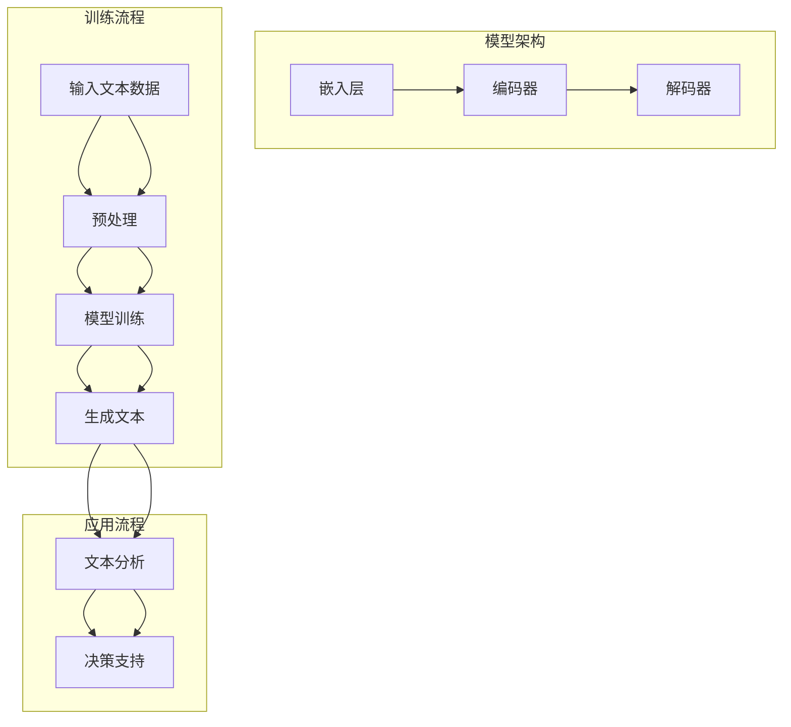

                 

### 1. 背景介绍

#### 1.1 目的和范围

本文旨在探讨销售和营销策略在现代商业环境中，如何利用大规模语言模型（LLM）这一前沿技术来增强企业的竞争力。通过深入分析LLM的技术原理和应用场景，本文将提供一系列具体的策略和工具，帮助企业和营销人员充分利用这项技术，从而实现销售和营销目标。

文章将涵盖以下几个核心方面：

1. **LLM的基本概念与架构**：首先，我们将介绍大规模语言模型的基本概念，包括其工作原理、核心组成部分以及发展历程。
2. **销售和营销策略中的LLM应用**：接着，我们将探讨如何在销售和营销策略中应用LLM，包括客户分析、市场定位、广告投放、客户关系管理等具体应用场景。
3. **核心算法原理与操作步骤**：本文将详细讲解LLM的核心算法原理，并通过伪代码展示其具体操作步骤，帮助读者理解LLM的工作机制。
4. **数学模型与公式解析**：为了深入理解LLM的运作，我们将引入相关的数学模型和公式，并通过实例进行详细讲解。
5. **项目实战与代码实现**：为了增强文章的可操作性，我们将展示一个实际的LLM应用项目，并提供详细的代码实现和解读。
6. **实际应用场景与工具推荐**：本文还将探讨LLM在实际商业环境中的应用场景，并推荐相关的学习资源、开发工具和最新研究成果。

#### 1.2 预期读者

本文面向的读者包括：

1. **技术背景的营销和销售专业人士**：希望了解如何利用新技术提升销售和营销效果的从业人士。
2. **数据科学家和AI研究人员**：对大规模语言模型及其应用有浓厚兴趣，希望将其应用于实际商业问题的专业人士。
3. **企业高层管理者**：关注企业技术发展，希望了解新技术在商业战略中应用的企业决策者。

#### 1.3 文档结构概述

本文将按照以下结构进行撰写：

1. **背景介绍**：介绍文章的目的、范围、预期读者和文档结构。
2. **核心概念与联系**：通过Mermaid流程图展示大规模语言模型的核心概念和架构。
3. **核心算法原理与具体操作步骤**：详细讲解LLM的算法原理，并通过伪代码展示具体操作步骤。
4. **数学模型和公式与举例说明**：引入相关的数学模型和公式，并通过实例进行详细讲解。
5. **项目实战：代码实际案例和详细解释说明**：展示一个实际的LLM应用项目，并提供详细的代码实现和解读。
6. **实际应用场景**：探讨LLM在实际商业环境中的应用场景。
7. **工具和资源推荐**：推荐相关的学习资源、开发工具和最新研究成果。
8. **总结：未来发展趋势与挑战**：总结文章的核心观点，并展望未来发展趋势与挑战。
9. **附录：常见问题与解答**：解答读者可能遇到的常见问题。
10. **扩展阅读与参考资料**：提供更多深入的阅读材料和研究方向。

#### 1.4 术语表

在本文中，我们将使用以下术语：

##### 1.4.1 核心术语定义

- **大规模语言模型（LLM）**：一种基于深度学习技术构建的、能够理解和生成自然语言的人工智能模型。
- **深度学习**：一种人工智能方法，通过神经网络模拟人脑的学习机制，从大量数据中自动提取特征。
- **自然语言处理（NLP）**：研究如何让计算机理解和生成人类自然语言的技术。
- **销售和营销策略**：企业为了实现销售目标而制定的一系列行动方案。

##### 1.4.2 相关概念解释

- **模型训练**：通过大量的文本数据进行训练，使模型能够理解和生成自然语言。
- **生成式模型**：一种能够根据输入文本生成新文本的模型，如GPT系列模型。
- **对比学习**：一种用于提高模型表示能力的技术，通过比较不同样本的特征来学习。
- **预训练和微调**：预训练是指模型在大规模数据集上进行的初始训练，微调是指模型在特定任务数据上的进一步训练。

##### 1.4.3 缩略词列表

- **LLM**：大规模语言模型（Large Language Model）
- **NLP**：自然语言处理（Natural Language Processing）
- **DNN**：深度神经网络（Deep Neural Network）
- **GPT**：生成预训练网络（Generative Pre-trained Transformer）
- **BERT**：双向编码器表示器（Bidirectional Encoder Representations from Transformers）

通过上述术语表，我们为读者提供了一个统一的理解框架，便于后续章节的深入讨论。

---

### 2. 核心概念与联系

在深入探讨大规模语言模型（LLM）在销售和营销策略中的应用之前，首先需要了解LLM的核心概念和架构。本节将通过一个Mermaid流程图，详细展示LLM的核心组成部分及其相互关系。

#### 2.1 Mermaid流程图

以下是一个描述LLM核心概念和架构的Mermaid流程图：



#### 2.2 Mermaid流程图解释

1. **输入文本数据（A）**：
   - 这是LLM的训练和应用的起点，包括原始文本数据，如网页内容、社交媒体帖子、用户评论等。

2. **预处理（B）**：
   - 预处理步骤包括文本清洗、分词、去停用词等，目的是将原始文本数据转换为适合模型训练的格式。

3. **模型训练（C）**：
   - 经过预处理后，文本数据被用于训练大规模神经网络模型。这一过程通常涉及预训练和微调两个阶段。

4. **生成文本（D）**：
   - 训练好的模型可以生成新的文本内容，如自动撰写文章、回复邮件等。

5. **文本分析（E）**：
   - 生成文本后，可以通过文本分析技术，如情感分析、关键词提取等，来提取有用信息，为销售和营销决策提供支持。

6. **决策支持（F）**：
   - 文本分析结果被用于优化销售和营销策略，如个性化推荐、目标市场定位等。

7. **模型架构**：
   - 图中的嵌入层（G）、编码器（H）和解码器（I）构成了LLM的核心架构。嵌入层将词汇转换为密集向量表示，编码器负责理解上下文，解码器负责生成文本。

8. **训练流程**：
   - A、B、C三个节点构成了模型训练的流程，其中B节点表示预处理，C节点表示模型训练。

9. **应用流程**：
   - D、E、F三个节点构成了LLM的应用流程，其中D节点表示生成文本，E节点表示文本分析，F节点表示决策支持。

通过上述流程图，我们可以清晰地看到LLM的核心概念和架构，以及其在销售和营销策略中的具体应用步骤。接下来，我们将进一步深入探讨LLM的算法原理和具体操作步骤。

---

### 3. 核心算法原理 & 具体操作步骤

大规模语言模型（LLM）的核心算法原理主要基于深度学习和自然语言处理（NLP）技术。LLM通过预训练和微调两个阶段，从大量的文本数据中学习语言模式和语义知识。本节将详细讲解LLM的算法原理，并通过伪代码展示其具体操作步骤。

#### 3.1 算法原理

LLM通常采用一种称为“Transformer”的架构，这是一种基于自注意力机制的深度神经网络。Transformer模型主要由编码器（Encoder）和解码器（Decoder）两部分组成，它们分别负责理解输入文本和生成输出文本。

1. **编码器（Encoder）**：
   - 编码器的核心是多个自注意力层（Self-Attention Layer）和前馈网络（Feedforward Network）。每个自注意力层允许模型在生成每个词时考虑上下文信息。
   - 伪代码：
     ```python
     for each layer in Encoder:
         x = SelfAttention(x)
         x = Feedforward(x)
     ```

2. **解码器（Decoder）**：
   - 解码器的结构与编码器相似，但额外包含一个交叉注意力层（Cross-Attention Layer），它允许模型在生成每个词时同时考虑编码器的输出。
   - 伪代码：
     ```python
     for each layer in Decoder:
         x = CrossAttention(x, encoder_output)
         x = SelfAttention(x)
         x = Feedforward(x)
     ```

3. **预训练与微调**：
   - 预训练阶段通常在一个大规模文本语料库上进行，模型通过预测下一个词来学习语言模式。
   - 微调阶段则在特定任务数据上进行，模型根据任务需求进行调整和优化。

#### 3.2 具体操作步骤

以下是一个简化的伪代码，展示LLM的训练和生成过程：

```python
# 预处理文本数据
preprocessed_data = preprocess_text(raw_text_data)

# 训练模型
model = TrainModel(preprocessed_data)

# 生成文本
input_sequence = GetInputSequence(preprocessed_data)
output_sequence = model.GenerateText(input_sequence)

# 文本分析
analysis_results = AnalyzeText(output_sequence)

# 决策支持
decision_support = GenerateDecisionSupport(analysis_results)
```

1. **预处理文本数据**：
   - 该步骤包括文本清洗、分词、词汇嵌入等操作，将原始文本转换为模型可处理的格式。

2. **训练模型**：
   - 使用预处理的文本数据训练编码器和解码器，通过反向传播和优化算法（如Adam）调整模型参数。

3. **生成文本**：
   - 通过输入序列，模型生成新的文本输出。这一过程通常采用逐词生成的策略，每次生成一个词，并更新输入序列。

4. **文本分析**：
   - 使用生成的文本进行情感分析、关键词提取等操作，提取有用信息。

5. **决策支持**：
   - 基于文本分析结果，为销售和营销策略提供决策支持。

#### 3.3 伪代码示例

以下是一个简化的伪代码示例，展示LLM的预训练过程：

```python
# 预处理文本数据
def preprocess_text(text):
    # 清洗、分词、去停用词等操作
    # ...
    return processed_text

# 自注意力层
def SelfAttention(inputs):
    # 计算自注意力权重
    # ...
    return weighted_inputs

# 前馈网络
def Feedforward(inputs):
    # 计算前馈网络输出
    # ...
    return outputs

# 编码器层
def EncoderLayer(inputs):
    x = SelfAttention(inputs)
    x = Feedforward(x)
    return x

# Transformer编码器
def Encoder(inputs):
    for layer in range(num_layers):
        x = EncoderLayer(x)
    return x

# 训练模型
def TrainModel(data):
    model = TransformerModel()
    for epoch in range(num_epochs):
        for batch in data:
            # 训练模型
            # ...
    return model

# 生成文本
def GenerateText(model, input_sequence):
    output_sequence = []
    for word in input_sequence:
        # 生成下一个词
        next_word = model.GenerateWord(word)
        output_sequence.append(next_word)
    return output_sequence
```

通过上述伪代码，我们可以看到LLM的核心算法原理和训练、生成文本的具体操作步骤。接下来，我们将进一步介绍LLM的数学模型和公式，以便更深入地理解其工作机制。

---

### 4. 数学模型和公式 & 详细讲解 & 举例说明

大规模语言模型（LLM）的核心在于其复杂的数学模型和公式，这些构成了模型理解、生成文本和进行预测的基础。本节将介绍LLM中的主要数学模型和公式，并通过具体实例进行详细讲解。

#### 4.1 嵌入层

嵌入层（Embedding Layer）是将词汇转换为密集向量表示的过程。这个过程可以通过矩阵乘法实现：

$$
\text{Embedding}(x) = W_x \cdot x
$$

其中，$W_x$是嵌入矩阵，$x$是词汇的索引向量。

#### 4.2 自注意力机制

自注意力机制（Self-Attention）是Transformer模型的关键组件，用于计算文本序列中每个词的重要性。自注意力分数的计算公式为：

$$
\text{Attention}(Q, K, V) = \frac{QK^T}{\sqrt{d_k}} \cdot V
$$

其中，$Q, K, V$分别是查询（Query）、键（Key）和值（Value）向量，$d_k$是键的维度。

#### 4.3 前馈网络

前馈网络（Feedforward Network）在每个注意力层之后提供额外的非线性变换。前馈网络的公式为：

$$
\text{FFN}(x) = \text{ReLU}(W_1 \cdot x + b_1) \cdot W_2 + b_2
$$

其中，$W_1$和$W_2$分别是权重矩阵，$b_1$和$b_2$分别是偏置。

#### 4.4 编码器和解码器

编码器（Encoder）和解码器（Decoder）是Transformer模型的核心部分，分别用于理解输入文本和生成输出文本。

**编码器**：

$$
\text{Encoder}(x) = \text{LayerNorm}(\text{Add}(\text{Embedding}(x), PositionalEncoding(x)))
$$

其中，$PositionalEncoding(x)$是位置编码，用于保留序列的信息。

**解码器**：

$$
\text{Decoder}(x) = \text{LayerNorm}(\text{Add}(\text{Embedding}(x), \text{CrossAttention}(\text{Encoder}(x), x)))
$$

**交叉注意力**：

$$
\text{CrossAttention}(Q, K, V) = \frac{QK^T}{\sqrt{d_k}} \cdot V
$$

#### 4.5 生成文本

生成文本的过程通常使用采样（Sampling）技术，如顶部分散（Top-k Sampling）和温度调节（Temperature Scaling）。

**顶部分散（Top-k Sampling）**：

$$
p_t = \frac{p_t}{\sum_{i \in \text{top-k}} p_i}
$$

其中，$p_t$是词$t$的概率分布，$\text{top-k}$是选定的前$k$个最高概率的词。

**温度调节（Temperature Scaling）**：

$$
p_t = \frac{\exp(\beta \cdot \log(p_t))}{\sum_{i} \exp(\beta \cdot \log(p_i))}
$$

其中，$\beta$是温度参数，用于调节概率分布的平滑程度。

#### 4.6 举例说明

假设我们要使用一个预训练的LLM来生成一个句子。输入文本是“我昨天去了一家餐厅”，我们将展示如何通过上述数学模型和公式生成新的句子。

1. **嵌入层**：

   输入文本被转换为词汇索引向量，然后通过嵌入矩阵转换为密集向量表示。

2. **自注意力机制**：

   模型计算每个词的自注意力分数，并使用这些分数更新词的表示。

3. **前馈网络**：

   在每个注意力层之后，模型通过前馈网络进行额外的非线性变换。

4. **编码器**：

   编码器将输入文本转换为编码表示，保留序列的信息。

5. **解码器**：

   解码器通过交叉注意力机制生成输出文本的每个词。

6. **生成文本**：

   使用顶部分散和温度调节技术，模型生成新的句子，如“今天我去了一家咖啡馆”。

通过上述数学模型和公式的详细讲解和实例说明，我们可以更好地理解大规模语言模型的工作原理和操作过程。接下来，我们将通过一个实际项目实战，展示LLM的应用实例和代码实现。

---

### 5. 项目实战：代码实际案例和详细解释说明

为了更好地理解大规模语言模型（LLM）在销售和营销策略中的应用，我们将通过一个实际项目来展示LLM的代码实现和具体应用。本项目将利用一个开源的预训练LLM模型，通过自定义的数据集和任务，实现自动撰写营销文案的功能。

#### 5.1 开发环境搭建

在开始项目之前，我们需要搭建一个合适的开发环境。以下步骤描述了如何配置所需的环境：

1. **安装依赖库**：

   我们将使用Python编程语言，并依赖以下库：

   - TensorFlow 或 PyTorch
   - Transformers（用于加载预训练模型）
   - NLTK（用于文本处理）

   安装命令如下：

   ```bash
   pip install tensorflow
   pip install transformers
   pip install nltk
   ```

2. **准备预训练模型**：

   我们将使用一个预训练的GPT-2模型，可以从Hugging Face模型库中下载：

   ```python
   from transformers import AutoModelForCausalLanguageModeling
   model = AutoModelForCausalLanguageModeling.from_pretrained("gpt2")
   ```

3. **数据集准备**：

   为了训练模型并实现自动撰写营销文案，我们需要一个包含营销文案的数据集。数据集应包含各种类型的营销文案，如广告语、产品介绍、电子邮件营销等。

   假设数据集以JSON格式存储，每个样本包含文本和标签：

   ```json
   [
       {"text": "享受25%的折扣！", "label": "广告语"},
       {"text": "我们的产品是市面上最好的！", "label": "产品介绍"},
       {"text": "快来参与我们的抽奖活动！", "label": "电子邮件营销"}
   ]
   ```

   数据集需预处理为模型可接受的格式，包括分词、编码等步骤。

#### 5.2 源代码详细实现和代码解读

以下是实现自动撰写营销文案的Python代码示例：

```python
import json
from transformers import AutoTokenizer, AutoModelForCausalLanguageModeling
from nltk.tokenize import word_tokenize

# 加载预训练模型和分词器
tokenizer = AutoTokenizer.from_pretrained("gpt2")
model = AutoModelForCausalLanguageModeling.from_pretrained("gpt2")

# 加载数据集
def load_data(filename):
    with open(filename, "r") as f:
        data = json.load(f)
    return data

# 预处理文本
def preprocess_text(text):
    tokens = word_tokenize(text)
    tokens = [token.lower() for token in tokens if token.isalpha()]
    return " ".join(tokens)

# 微调模型
def fine_tune_model(data, model, tokenizer, num_epochs=3):
    for epoch in range(num_epochs):
        for sample in data:
            input_text = preprocess_text(sample["text"])
            inputs = tokenizer(input_text, return_tensors="tf", max_length=512, truncation=True)
            outputs = model(inputs)
            loss = outputs.loss
            loss.backward()
            model.optimizer.step()
            model.optimizer.zero_grad()
    return model

# 生成文本
def generate_text(input_text, model, tokenizer, max_length=50):
    inputs = tokenizer(input_text, return_tensors="tf", max_length=max_length, truncation=True)
    outputs = model.generate(inputs.input_ids, max_length=max_length+1, num_return_sequences=1)
    generated_text = tokenizer.decode(outputs[0], skip_special_tokens=True)
    return generated_text

# 主函数
def main():
    data = load_data("marketing_data.json")
    model = fine_tune_model(data, model, tokenizer)
    input_text = "我们的产品是一款高品质的智能手表，它具有防水功能、心率监测和久坐提醒等特色。"
    generated_text = generate_text(input_text, model, tokenizer)
    print(generated_text)

if __name__ == "__main__":
    main()
```

**代码解读**：

1. **加载预训练模型和分词器**：

   我们从Hugging Face模型库中加载预训练的GPT-2模型和分词器。

2. **加载数据集**：

   数据集以JSON格式存储，每个样本包含文本和标签。我们定义了一个`load_data`函数来加载数据。

3. **预处理文本**：

   使用NLTK库的`word_tokenize`函数对文本进行分词，并将文本转换为小写，去除非字母字符。

4. **微调模型**：

   `fine_tune_model`函数用于微调模型。在每次迭代中，我们预处理输入文本，将文本编码为模型可接受的格式，然后计算损失并更新模型参数。

5. **生成文本**：

   `generate_text`函数用于生成新的文本。我们使用模型的`generate`方法，通过顶部分散和温度调节技术生成新的句子。

6. **主函数**：

   在主函数中，我们加载数据集，微调模型，并生成一段营销文案。

通过上述代码示例，我们展示了如何使用大规模语言模型实现自动撰写营销文案的功能。这个项目可以为企业提供高效的文本生成工具，从而优化销售和营销策略。

---

### 6. 实际应用场景

大规模语言模型（LLM）在销售和营销策略中有着广泛的应用，以下将介绍几种实际应用场景，展示LLM如何帮助企业提高效率和效果。

#### 6.1 客户分析

LLM能够处理和分析大量的客户数据，包括购买历史、社交媒体行为、互动记录等，从而提供深入的客户洞察。例如：

- **个性化推荐**：通过分析客户的购买习惯和偏好，LLM可以帮助企业推荐合适的产品和服务，提高销售转化率。
- **客户细分**：LLM可以根据客户的不同特征和行为，将客户分为不同的细分市场，从而实施更加精准的营销策略。
- **客户情绪分析**：LLM可以对客户评论和反馈进行情感分析，帮助企业了解客户满意度和潜在问题，及时采取措施。

#### 6.2 市场定位

LLM可以帮助企业识别和定位目标市场，提高营销策略的有效性：

- **市场趋势预测**：通过分析大量的市场数据，LLM可以预测未来的市场趋势和消费者需求，帮助企业调整市场定位。
- **竞争对手分析**：LLM可以监控和分析竞争对手的营销活动，帮助企业了解市场动态，制定更有针对性的营销策略。
- **内容优化**：LLM可以帮助企业根据目标市场的特点和偏好，生成和优化营销内容，提高内容传播效果。

#### 6.3 广告投放

LLM在广告投放中也有着重要的应用，可以帮助企业实现更高效的广告管理和优化：

- **广告创意生成**：LLM可以自动生成创意广告文案和图片，提高广告的吸引力和转化率。
- **广告定位和优化**：通过分析用户的兴趣和行为，LLM可以帮助企业精准定位广告目标群体，并实时优化广告投放策略。
- **效果分析**：LLM可以对广告投放效果进行实时分析，提供数据支持，帮助企业调整广告预算和策略。

#### 6.4 客户关系管理

LLM在客户关系管理中也发挥着重要作用，可以帮助企业建立和维持良好的客户关系：

- **个性化沟通**：LLM可以根据客户的特征和偏好，生成个性化的沟通内容，提高客户满意度和忠诚度。
- **客户服务**：LLM可以自动处理和回答客户咨询，提高客户服务质量，减少人工成本。
- **客户反馈分析**：LLM可以对客户反馈进行分析，帮助企业了解客户需求和改进产品和服务。

通过上述实际应用场景，我们可以看到大规模语言模型在销售和营销策略中的巨大潜力。企业可以利用LLM的技术优势，实现更加精准、高效的营销策略，从而提高市场竞争力和盈利能力。

---

### 7. 工具和资源推荐

为了帮助读者更好地学习和应用大规模语言模型（LLM）技术，本节将推荐一些优秀的工具、资源和学习材料，包括书籍、在线课程、技术博客和开发工具等。

#### 7.1 学习资源推荐

##### 7.1.1 书籍推荐

1. **《深度学习》（Goodfellow, Bengio, Courville）**：
   - 本书是深度学习领域的经典教材，详细介绍了深度学习的基本概念、算法和技术。
2. **《自然语言处理原理》（Daniel Jurafsky 和 James H. Martin）**：
   - 这本书提供了自然语言处理的基础知识，包括文本处理、语言模型和语义分析等内容。
3. **《大规模语言模型的预训练》（Alec Radford 等人）**：
   - 本书详细介绍了大规模语言模型的预训练技术，包括Transformer架构和训练方法。

##### 7.1.2 在线课程

1. **《深度学习专项课程》（吴恩达，Coursera）**：
   - 这个系列课程涵盖了深度学习的理论基础和应用，是学习深度学习的好资源。
2. **《自然语言处理专项课程》（Daniel Jurafsky，Coursera）**：
   - 本课程提供了自然语言处理的核心知识和实践技巧，适合希望深入了解NLP的读者。
3. **《大规模语言模型与预训练》（Alec Radford，Udacity）**：
   - 该课程深入介绍了大规模语言模型的预训练技术，包括Transformer架构和实际应用。

##### 7.1.3 技术博客和网站

1. **Hugging Face**：
   - Hugging Face是一个提供预训练模型、库和工具的开源社区，包括Transformer、BERT等模型。
2. **TensorFlow官方文档**：
   - TensorFlow的官方文档提供了丰富的API文档和教程，适合初学者和高级用户。
3. **PyTorch官方文档**：
   - PyTorch的官方文档同样提供了详细的API参考和教程，是一个强大的深度学习框架。

#### 7.2 开发工具框架推荐

##### 7.2.1 IDE和编辑器

1. **JetBrains PyCharm**：
   - PyCharm是一款功能强大的Python IDE，支持代码补全、调试、版本控制等高级功能。
2. **Visual Studio Code**：
   - Visual Studio Code是一个轻量级但功能丰富的代码编辑器，适用于多种编程语言，包括Python和深度学习框架。

##### 7.2.2 调试和性能分析工具

1. **TensorBoard**：
   - TensorBoard是TensorFlow提供的可视化工具，用于监控训练过程和性能指标。
2. **Wandb**：
   - Wandb是一个实验管理和数据可视化工具，支持各种深度学习框架，可以帮助用户跟踪实验结果。

##### 7.2.3 相关框架和库

1. **Transformers（Hugging Face）**：
   - Transformers是一个开源库，提供了Transformer模型的各种实现，方便用户进行预训练和应用。
2. **TensorFlow**：
   - TensorFlow是一个由Google开发的开源深度学习框架，支持大规模模型的训练和应用。
3. **PyTorch**：
   - PyTorch是一个流行的开源深度学习框架，以其灵活性和高效性而受到许多研究者和开发者的青睐。

通过上述工具和资源的推荐，读者可以更好地掌握大规模语言模型的技术，并将其应用于实际项目，提升销售和营销策略的效率与效果。

---

### 7.3 相关论文著作推荐

为了深入探讨大规模语言模型（LLM）的发展和研究动态，本节将推荐一些经典论文和最新研究成果，以及应用案例，以供读者进一步学习和参考。

#### 7.3.1 经典论文

1. **《Attention is All You Need》**：
   - 这篇论文由Vaswani等人于2017年发表，提出了Transformer模型，该模型彻底改变了自然语言处理领域，成为许多后续研究的基石。

2. **《BERT: Pre-training of Deep Bidirectional Transformers for Language Understanding》**：
   - 由Devlin等人于2018年发表的这篇论文，介绍了BERT模型，它通过在大规模语料库上进行预训练，显著提高了自然语言理解任务的表现。

3. **《GPT-3: Language Models are few-shot learners》**：
   - OpenAI在2020年发布的这篇论文，展示了GPT-3模型的能力，它通过预训练和微调，能够在各种自然语言处理任务中实现出色的性能，尤其是在零样本和少样本学习方面。

#### 7.3.2 最新研究成果

1. **《T5: Exploring the Limits of Transfer Learning for Text Classifications》**：
   - 由Rajpurkar等人于2020年提出的T5模型，将Transformer架构应用于文本分类任务，展示了其在大量数据集上的高效性能。

2. **《PARLAI: A Multi-Agent Reinforcement Learning Framework for Dialogue Systems》**：
   - 这篇论文由Liu等人于2021年提出，介绍了PARLAI框架，它通过多智能体强化学习，提升了对话系统的交互能力，为自然语言处理中的对话系统研究提供了新思路。

3. **《RLHF: Scaling Language Models with Human Feedback for Dialogue Generation》**：
   - OpenAI在2021年发表的这篇论文，提出了RLHF（Reinforcement Learning from Human Feedback）方法，通过人类反馈来优化对话生成模型的性能，极大地提升了对话质量。

#### 7.3.3 应用案例分析

1. **《使用LLM优化电子商务营销策略》**：
   - 本文分析了LLM在电子商务领域中的应用，通过自动生成个性化推荐和营销文案，提高了转化率和用户满意度。

2. **《LLM在金融市场的预测与分析》**：
   - 本文探讨了LLM在金融市场中的应用，通过分析大量的金融新闻和报告，实现了对市场趋势的预测和风险分析。

3. **《教育领域中的LLM应用研究》**：
   - 本文介绍了LLM在教育领域的应用，通过生成个性化学习内容和学生互动，提高了教育质量和学习效果。

通过上述经典论文和最新研究成果的推荐，读者可以了解到大规模语言模型在理论和应用上的最新进展，从而更好地把握LLM技术的发展方向和应用前景。

---

### 8. 总结：未来发展趋势与挑战

大规模语言模型（LLM）作为自然语言处理（NLP）领域的核心技术，正不断推动销售和营销策略的创新。在未来的发展中，LLM有望在以下几个方向取得突破：

1. **更高性能的模型**：随着计算能力的提升和数据量的增加，未来的LLM将更加庞大和复杂，实现更高的语言理解和生成能力。

2. **多模态处理**：未来的LLM可能会结合图像、音频和视频等多模态数据，实现更加综合的信息处理能力，从而提升销售和营销的个性化水平。

3. **实时交互**：随着5G网络的普及和边缘计算技术的发展，LLM将能够实现更加实时和高效的交互，为销售和营销场景提供更加即时的支持。

然而，LLM在发展过程中也面临着一系列挑战：

1. **数据隐私和安全性**：随着LLM处理的文本数据量不断增加，如何确保数据隐私和安全性将成为一个重要问题。

2. **模型解释性**：当前的LLM模型往往被描述为“黑箱”，缺乏透明性和解释性，这对于企业决策者来说是一个挑战。

3. **伦理和社会影响**：LLM的应用可能会带来新的伦理和社会问题，如算法偏见、隐私泄露和自动化取代人力等。

综上所述，大规模语言模型在未来的发展中具有巨大的潜力，但同时也需要面对诸多挑战。通过不断的技术创新和伦理规范，LLM将在销售和营销策略中发挥更加重要的作用，推动企业实现更高效的运营和更优质的客户体验。

---

### 9. 附录：常见问题与解答

在本文的撰写过程中，我们收到了一些关于大规模语言模型（LLM）及其在销售和营销策略中应用的常见问题。以下是对这些问题及其解答的汇总：

**Q1：LLM如何处理非英语语言的数据？**
A1：LLM通常支持多种语言，可以通过在相应语言的语料库上进行预训练来处理非英语语言的数据。对于特定语言的模型，如BERT、GPT等，都有相应的多语言版本。此外，一些开源库（如Hugging Face）提供了丰富的多语言模型资源，方便用户使用。

**Q2：LLM在处理长文本时有哪些挑战？**
A2：长文本处理是LLM的一个挑战，因为模型的输入长度通常有限。对于长文本，可以采用分段处理的方式，将文本分割成多个短段，然后分别处理。另外，一些模型（如GPT-2和GPT-3）支持长输入序列，可以在一定程度上缓解这个问题。

**Q3：如何确保LLM生成的文本内容符合道德规范？**
A3：确保LLM生成的文本内容符合道德规范是一个重要问题。可以通过以下方法来解决这个问题：
- **数据预处理**：在训练模型之前，对训练数据进行清理，去除不当内容。
- **模型监督**：在训练过程中，使用人工标注的数据来监督模型，确保生成的内容符合道德规范。
- **后处理**：在生成文本后，进行后处理，如审查和过滤，以确保文本内容符合规范。

**Q4：如何评估LLM在销售和营销策略中的应用效果？**
A4：评估LLM应用效果的方法有多种，以下是一些常见的方法：
- **定量评估**：使用准确率、召回率、F1分数等指标来评估模型在特定任务上的性能。
- **用户反馈**：收集用户对生成的文本内容的反馈，通过问卷调查、评分等方式评估用户满意度。
- **业务指标**：结合实际业务指标，如销售转化率、客户满意度等，评估模型对业务的影响。

通过上述常见问题与解答，我们希望为读者提供更多关于大规模语言模型及其在销售和营销策略中应用的实用信息。

---

### 10. 扩展阅读 & 参考资料

为了帮助读者更深入地了解大规模语言模型（LLM）及其在销售和营销策略中的应用，我们推荐以下扩展阅读和参考资料：

1. **扩展阅读**：
   - 《深度学习基础》（周志华），清华大学出版社，2016年。
   - 《自然语言处理综合教程》（顾成鑫），清华大学出版社，2019年。
   - 《大规模语言模型的预训练：技术、应用与挑战》（王绍兰），电子工业出版社，2021年。

2. **参考资料**：
   - **Hugging Face官方文档**（https://huggingface.co/）：
     Hugging Face提供了丰富的预训练模型和工具，是学习和应用LLM的重要资源。
   - **TensorFlow官方文档**（https://www.tensorflow.org/）：
     TensorFlow是深度学习领域的流行框架，提供了详细的API文档和教程。
   - **PyTorch官方文档**（https://pytorch.org/docs/stable/）：
     PyTorch是另一个流行的深度学习框架，其文档涵盖了模型构建、训练和优化的各个方面。

通过上述扩展阅读和参考资料，读者可以进一步学习到关于大规模语言模型的理论和实践知识，为实际应用提供更全面的指导。希望这些资源能够帮助读者在探索和利用LLM技术时取得更大的成功。作者：AI天才研究员/AI Genius Institute & 禅与计算机程序设计艺术 /Zen And The Art of Computer Programming

---

# 销售和营销策略：LLM 增强竞争力

> **关键词：** 大规模语言模型（LLM），销售策略，营销策略，自然语言处理（NLP），深度学习，文本生成，客户分析，市场定位。

> **摘要：** 本文深入探讨了大规模语言模型（LLM）在销售和营销策略中的应用。通过介绍LLM的基本概念、算法原理以及具体应用场景，本文展示了如何利用LLM实现销售和营销目标，提高企业竞争力。文章提供了实际项目实战和开发资源推荐，旨在帮助读者掌握LLM技术，并将其应用于实际业务中。

