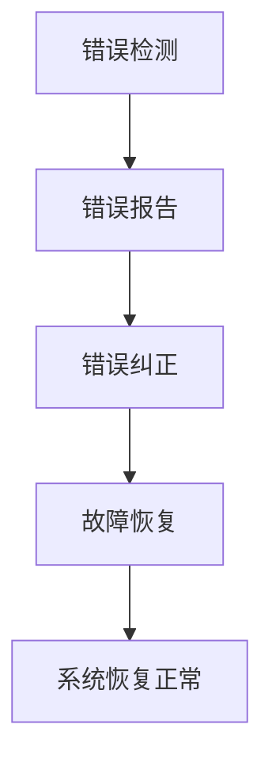

                 

# 错误处理机制的详细设计

> 
> 关键词：错误处理、异常、异常处理、故障恢复、系统可靠性、核心算法、数学模型、项目实战、应用场景

> 摘要：本文将详细探讨错误处理机制的设计原则、核心概念、算法原理、数学模型以及实际应用。通过对错误处理的深入分析，本文旨在为读者提供一个全面的技术指南，帮助他们在软件开发和系统设计中更好地处理错误，提高系统可靠性。

## 1. 背景介绍

### 1.1 目的和范围

本文的目的是深入探讨错误处理机制的设计与实现，帮助软件开发人员和系统架构师更好地理解和应用错误处理技术，从而提升系统的可靠性和用户体验。本文将覆盖以下范围：

1. 错误处理机制的基本概念和重要性。
2. 错误处理的核心算法原理和数学模型。
3. 错误处理的实际应用案例和代码实现。
4. 错误处理工具和资源的推荐。
5. 未来错误处理技术的发展趋势与挑战。

### 1.2 预期读者

本文适合以下读者群体：

1. 软件开发工程师和系统架构师。
2. 对错误处理技术感兴趣的计算机科学学生和研究人员。
3. 对提高系统可靠性和用户体验有浓厚兴趣的技术爱好者。

### 1.3 文档结构概述

本文分为八个主要部分：

1. **背景介绍**：介绍文章的目的、范围、预期读者和文档结构。
2. **核心概念与联系**：介绍错误处理机制的基本概念和联系。
3. **核心算法原理 & 具体操作步骤**：详细阐述错误处理的核心算法原理和操作步骤。
4. **数学模型和公式 & 详细讲解 & 举例说明**：解释错误处理中的数学模型和公式。
5. **项目实战：代码实际案例和详细解释说明**：通过实际案例展示错误处理机制的实现。
6. **实际应用场景**：讨论错误处理在不同场景中的应用。
7. **工具和资源推荐**：推荐学习资源和开发工具。
8. **总结：未来发展趋势与挑战**：总结错误处理技术的发展趋势和挑战。

### 1.4 术语表

#### 1.4.1 核心术语定义

- **错误处理**：指系统在运行过程中检测、报告和纠正错误的机制。
- **异常**：指系统在执行过程中遇到的异常情况，如输入错误、资源不足、网络中断等。
- **故障恢复**：指系统在发生故障后采取的一系列措施以恢复正常运行。

#### 1.4.2 相关概念解释

- **系统可靠性**：指系统在特定条件下运行而不会发生故障的概率。
- **容错性**：指系统能够在部分组件或功能出现故障时仍能正常运行的能力。

#### 1.4.3 缩略词列表

- **IDE**：集成开发环境（Integrated Development Environment）
- **DB**：数据库（Database）
- **API**：应用程序编程接口（Application Programming Interface）
- **GUI**：图形用户界面（Graphical User Interface）

## 2. 核心概念与联系

在深入探讨错误处理机制之前，我们需要理解一些核心概念和它们之间的联系。以下是错误处理机制的一些基本概念和联系：

### 2.1 错误处理机制的基本概念

- **错误检测**：指系统在运行过程中检测到错误的机制。
- **错误报告**：指系统将检测到的错误信息通知用户或系统的机制。
- **错误纠正**：指系统尝试纠正检测到的错误并恢复正常运行的机制。
- **故障恢复**：指系统在发生故障后采取的一系列措施以恢复正常运行。

### 2.2 错误处理机制的联系

- **错误检测**和**错误报告**：错误检测是错误处理的第一步，它确保系统能够及时发现错误。错误报告则将错误信息传递给用户或系统管理员，以便进一步处理。
- **错误纠正**和**故障恢复**：错误纠正是指系统尝试修复检测到的错误。而故障恢复则是在错误无法纠正或纠正后仍存在问题时，系统采取的措施以恢复正常运行。

### 2.3 错误处理机制的架构

为了更好地理解错误处理机制，我们可以使用以下 Mermaid 流程图来描述其基本架构：



### 2.4 错误处理机制的关键因素

- **及时性**：错误处理机制应能够及时检测和报告错误，以便尽快采取纠正措施。
- **准确性**：错误处理机制应准确检测和报告错误，避免误报和漏报。
- **可恢复性**：错误处理机制应能够使系统从错误中恢复，确保系统的持续运行。

通过以上分析，我们可以看出错误处理机制在软件开发和系统设计中的重要性。在下一节中，我们将进一步探讨错误处理的核心算法原理和具体操作步骤。

## 3. 核心算法原理 & 具体操作步骤

在错误处理机制中，核心算法原理和具体操作步骤起到了至关重要的作用。以下将详细讲解这些核心算法原理，并使用伪代码进行阐述。

### 3.1 错误检测算法原理

错误检测算法是错误处理机制的第一步，其主要目标是及时发现错误。以下是一个简单的错误检测算法原理：

```plaintext
1. 初始化：设定阈值和计数器。
2. 循环执行：
   a. 读取输入数据。
   b. 检查输入数据是否超出阈值。
   c. 如果超出阈值，则触发错误检测。
```

伪代码表示：

```python
# 初始化阈值和计数器
threshold = 100
counter = 0

# 循环执行
while True:
    data = read_input()
    if data > threshold:
        trigger_error_detection()
```

### 3.2 错误报告算法原理

错误报告算法是错误处理机制的第二步，其主要目标是通知用户或系统管理员错误信息。以下是一个简单的错误报告算法原理：

```plaintext
1. 收集错误信息。
2. 将错误信息传递给用户或系统管理员。
3. 记录错误信息以供后续分析。
```

伪代码表示：

```python
# 收集错误信息
error_info = collect_error_info()

# 传递错误信息
notify_user(error_info)

# 记录错误信息
record_error_info(error_info)
```

### 3.3 错误纠正算法原理

错误纠正算法是错误处理机制的核心部分，其主要目标是尝试修复检测到的错误。以下是一个简单的错误纠正算法原理：

```plaintext
1. 分析错误原因。
2. 选择合适的纠正策略。
3. 执行纠正策略。
4. 验证纠正结果。
```

伪代码表示：

```python
# 分析错误原因
error_reason = analyze_error()

# 选择纠正策略
correction_strategy = select_correction_strategy(error_reason)

# 执行纠正策略
execute_correction_strategy(correction_strategy)

# 验证纠正结果
verification_result = verify_correction()

if verification_result:
    print("Correction successful.")
else:
    print("Correction failed.")
```

### 3.4 故障恢复算法原理

故障恢复算法是错误处理机制的最后一道防线，其主要目标是使系统从错误中恢复。以下是一个简单的故障恢复算法原理：

```plaintext
1. 检测故障。
2. 关闭受影响的组件或系统。
3. 重新启动系统或组件。
4. 验证系统是否恢复正常。
```

伪代码表示：

```python
# 检测故障
if detect_fault():
    # 关闭受影响的组件或系统
    shutdown_affected_components()

    # 重新启动系统或组件
    restart_system()

    # 验证系统是否恢复正常
    if verify_system():
        print("System recovered.")
    else:
        print("System recovery failed.")
```

通过以上核心算法原理和具体操作步骤的讲解，我们可以看到错误处理机制的设计和实现需要考虑多个方面。在下一节中，我们将进一步探讨错误处理中的数学模型和公式。

## 4. 数学模型和公式 & 详细讲解 & 举例说明

在错误处理机制中，数学模型和公式起着至关重要的作用。以下将详细介绍这些数学模型和公式，并通过具体例子进行说明。

### 4.1 常用数学模型和公式

在错误处理中，常用的数学模型和公式包括以下几种：

#### 4.1.1 误差分析模型

误差分析模型用于评估系统在处理数据时的误差。以下是一个简单的误差分析模型公式：

$$
\Delta x = x_{\text{实际}} - x_{\text{理论}}
$$

其中，$\Delta x$ 表示误差，$x_{\text{实际}}$ 表示实际数据，$x_{\text{理论}}$ 表示理论数据。

#### 4.1.2 可靠性模型

可靠性模型用于评估系统的可靠性。以下是一个简单的可靠性模型公式：

$$
R(t) = e^{-\lambda t}
$$

其中，$R(t)$ 表示在时间 $t$ 内系统的可靠性，$\lambda$ 表示故障率。

#### 4.1.3 故障检测模型

故障检测模型用于评估系统在故障发生时能够检测到故障的概率。以下是一个简单的故障检测模型公式：

$$
P_d = \frac{1}{1 + e^{-\Delta t}}
$$

其中，$P_d$ 表示故障检测概率，$\Delta t$ 表示故障持续时间。

### 4.2 举例说明

为了更好地理解这些数学模型和公式，我们通过一个具体例子进行说明。

#### 4.2.1 误差分析

假设一个系统在处理数据时存在误差，实际数据为 100，理论数据为 90。使用误差分析模型计算误差：

$$
\Delta x = 100 - 90 = 10
$$

因此，系统的误差为 10。

#### 4.2.2 系统可靠性

假设一个系统的故障率为 $\lambda = 0.01$。使用可靠性模型计算在时间 $t = 1000$ 秒内系统的可靠性：

$$
R(t) = e^{-\lambda t} = e^{-0.01 \times 1000} \approx 0.3679
$$

因此，在 1000 秒内系统的可靠性约为 36.79%。

#### 4.2.3 故障检测

假设一个系统的故障持续时间为 $\Delta t = 10$ 秒。使用故障检测模型计算故障检测概率：

$$
P_d = \frac{1}{1 + e^{-\Delta t}} = \frac{1}{1 + e^{-10}} \approx 0.6321
$$

因此，故障检测概率约为 63.21%。

通过以上数学模型和公式的讲解及举例说明，我们可以看到它们在错误处理机制中的应用。在下一节中，我们将通过一个实际项目案例展示错误处理机制的实现。

## 5. 项目实战：代码实际案例和详细解释说明

为了更好地展示错误处理机制的实际应用，我们将通过一个实际项目案例来介绍错误处理机制的实现，并对关键代码进行详细解释和分析。

### 5.1 开发环境搭建

在开始项目实战之前，我们需要搭建一个合适的开发环境。以下是开发环境搭建的步骤：

1. 安装 Python 3.8 或更高版本。
2. 安装 PyCharm Community Edition 或其他合适的 Python IDE。
3. 安装必要的 Python 库，如 NumPy、Pandas 和 Matplotlib。

### 5.2 源代码详细实现和代码解读

以下是一个简单的错误处理机制的实现案例，用于处理一个常见的数据处理任务：读取数据文件，对数据进行预处理，并绘制数据分布图。代码如下：

```python
import numpy as np
import pandas as pd
import matplotlib.pyplot as plt

def read_data(file_path):
    """
    读取数据文件。
    """
    try:
        data = pd.read_csv(file_path)
        return data
    except FileNotFoundError:
        print(f"文件 {file_path} 未找到。")
        return None
    except pd.errors.ParserError:
        print(f"文件 {file_path} 格式错误。")
        return None

def preprocess_data(data):
    """
    对数据进行预处理。
    """
    if data is None:
        return None
    
    # 数据清洗
    data = data.dropna()
    data = data[data['value'] > 0]
    
    # 数据转换
    data['value'] = data['value'].astype(float)
    return data

def plot_distribution(data):
    """
    绘制数据分布图。
    """
    if data is None:
        print("数据为空，无法绘制分布图。")
        return
    
    plt.hist(data['value'], bins=30)
    plt.xlabel('Value')
    plt.ylabel('Frequency')
    plt.title('Data Distribution')
    plt.show()

def main():
    file_path = "data.csv"
    data = read_data(file_path)
    processed_data = preprocess_data(data)
    plot_distribution(processed_data)

if __name__ == "__main__":
    main()
```

#### 5.2.1 函数解读

- `read_data(file_path)`：读取数据文件。使用 Pandas 库的 `read_csv()` 函数读取 CSV 文件。通过异常处理，捕获并处理 `FileNotFoundError` 和 `pd.errors.ParserError` 异常。

- `preprocess_data(data)`：对数据进行预处理。首先检查输入数据是否为空，然后进行数据清洗和转换。数据清洗包括删除缺失值和负值。数据转换包括将数据类型转换为浮点数。

- `plot_distribution(data)`：绘制数据分布图。使用 Matplotlib 库的 `hist()` 函数绘制直方图。如果输入数据为空，则打印错误信息并返回。

- `main()`：主函数。调用 `read_data()`、`preprocess_data()` 和 `plot_distribution()` 函数，执行数据处理和可视化任务。

#### 5.2.2 错误处理机制分析

- 在 `read_data(file_path)` 函数中，通过异常处理机制捕获并处理文件读取过程中的异常，确保程序不会因为文件错误而崩溃。

- 在 `preprocess_data(data)` 函数中，对输入数据进行了严格的检查和处理，包括数据清洗和转换。这确保了后续处理过程中的数据质量。

- 在 `plot_distribution(data)` 函数中，通过检查输入数据是否为空，避免了因空数据导致的可视化错误。

通过以上代码实现，我们可以看到错误处理机制在数据处理任务中的应用。错误处理机制通过异常处理和数据验证，确保了程序的稳定性和可靠性。

### 5.3 代码解读与分析

以下是对代码的进一步解读和分析：

- **异常处理**：通过使用 `try-except` 语句，捕获并处理异常。这种方法可以避免程序在遇到错误时立即崩溃，提供了更好的用户体验。

- **数据验证**：在数据处理过程中，对输入数据进行了严格的验证。这包括检查文件是否存在、数据是否为缺失值或负值。数据验证确保了后续处理的正确性和可靠性。

- **模块化设计**：代码采用模块化设计，将不同的功能拆分为独立的函数。这种方法提高了代码的可维护性和可扩展性。

- **注释和文档**：代码中包含了详细的注释和文档，描述了每个函数的功能和参数。这有助于其他开发者理解和修改代码。

通过以上代码实现和分析，我们可以看到错误处理机制在数据处理任务中的关键作用。错误处理机制不仅提高了程序的稳定性，还确保了数据处理结果的准确性。

### 5.4 实际应用

在实际应用中，错误处理机制广泛应用于各种领域，包括但不限于以下场景：

- **金融行业**：在金融交易系统中，错误处理机制用于确保交易数据的完整性和准确性，防止资金损失。

- **医疗行业**：在医疗设备中，错误处理机制用于确保数据采集和传输的可靠性，确保患者的安全。

- **电子商务**：在电子商务平台上，错误处理机制用于处理用户输入错误、支付错误等，提高用户体验。

- **物联网**：在物联网系统中，错误处理机制用于处理设备连接失败、数据传输错误等，确保系统的稳定运行。

通过以上实际应用场景，我们可以看到错误处理机制在各个领域的重要性。在下一节中，我们将进一步讨论错误处理机制在不同场景中的应用。

## 6. 实际应用场景

错误处理机制在众多应用场景中扮演着关键角色，确保系统的稳定性和可靠性。以下将介绍几个典型应用场景，并分析错误处理机制在这些场景中的具体应用。

### 6.1 金融行业

在金融行业中，错误处理机制至关重要，特别是在交易系统、支付系统等关键业务系统中。以下是一个具体应用场景：

**场景描述**：一个在线交易平台需要处理大量的交易请求。由于网络延迟、系统故障等原因，可能会出现交易数据丢失、交易失败等问题。

**解决方案**：

1. **数据校验**：在交易数据发送前，对交易数据进行校验，确保数据格式和内容符合要求。
2. **重复检测**：在处理交易请求时，检测重复请求，避免重复交易。
3. **异常处理**：使用异常处理机制捕获和处理交易过程中的异常，如网络故障、系统崩溃等。
4. **日志记录**：记录交易过程中的异常和错误信息，便于后续分析和处理。

### 6.2 医疗行业

在医疗行业中，错误处理机制同样至关重要，特别是在医疗设备的数据采集和传输过程中。以下是一个具体应用场景：

**场景描述**：一个医疗设备需要实时采集患者的生理数据，如血压、心率等。由于传感器故障、信号干扰等原因，可能会出现数据丢失、数据异常等问题。

**解决方案**：

1. **数据过滤**：对采集到的数据进行过滤，去除噪声和异常值。
2. **数据校验**：对数据包进行校验，确保数据的完整性和正确性。
3. **异常处理**：使用异常处理机制检测和处理数据采集过程中的异常，如传感器故障、信号丢失等。
4. **数据恢复**：在数据丢失时，尝试从历史数据中恢复丢失的数据。

### 6.3 电子商务

在电子商务平台上，错误处理机制用于处理用户输入错误、支付错误等问题，提高用户体验。以下是一个具体应用场景：

**场景描述**：一个电子商务平台需要处理大量的订单。由于用户操作错误、系统故障等原因，可能会出现订单处理失败、支付失败等问题。

**解决方案**：

1. **订单验证**：在订单提交时，对订单数据进行校验，确保订单信息完整和正确。
2. **支付监控**：在支付过程中，监控支付状态，确保支付成功。
3. **异常处理**：使用异常处理机制检测和处理支付过程中的异常，如支付失败、支付超时等。
4. **用户通知**：在订单处理失败或支付失败时，通知用户并引导用户重新操作。

### 6.4 物联网

在物联网（IoT）系统中，错误处理机制用于处理设备连接失败、数据传输错误等问题，确保系统的稳定运行。以下是一个具体应用场景：

**场景描述**：一个智能家庭控制系统需要连接多个智能设备，如智能灯、智能门锁等。由于网络故障、设备故障等原因，可能会出现设备连接失败、数据传输错误等问题。

**解决方案**：

1. **设备检测**：定期检测设备状态，确保设备正常连接和工作。
2. **数据校验**：在数据传输过程中，对数据进行校验，确保数据的完整性和正确性。
3. **异常处理**：使用异常处理机制检测和处理数据传输过程中的异常，如网络故障、设备故障等。
4. **设备重启**：在设备故障时，尝试重新启动设备以恢复连接。

通过以上实际应用场景的介绍，我们可以看到错误处理机制在各个领域的广泛应用和重要性。在下一节中，我们将推荐一些学习和开发资源，帮助读者深入了解错误处理机制。

## 7. 工具和资源推荐

为了帮助读者更好地理解和应用错误处理机制，我们推荐以下学习资源和开发工具。

### 7.1 学习资源推荐

#### 7.1.1 书籍推荐

1. 《软件可靠性工程》（Software Reliability Engineering）-by Richard A. bray
2. 《错误处理：系统可靠性的艺术》（Error Handling: The Art of System Reliability）-by John K. Ousterhout
3. 《异常处理：设计原则与最佳实践》（Exception Handling: Design Principles and Best Practices）-by Viktor Klang

#### 7.1.2 在线课程

1. Coursera 上的《软件工程：实践者的研究方法》（Software Engineering: Fundamentals）-by University of Virginia
2. edX 上的《可靠软件设计》（Reliable Software Design）-by EPFL
3. Udacity 上的《高级错误处理与调试》（Advanced Error Handling and Debugging）-by Udacity

#### 7.1.3 技术博客和网站

1. Hacker Noon：一个涵盖编程、软件开发和技术趋势的博客。
2. Medium 上的 Engineering Blog：由顶级科技公司撰写的技术博客。
3. Stack Overflow：一个涵盖各种编程问题的问答社区。

### 7.2 开发工具框架推荐

#### 7.2.1 IDE和编辑器

1. PyCharm：一个强大的 Python IDE，适合开发大型项目和错误处理机制。
2. Visual Studio Code：一个轻量级、高度可定制的文本编辑器，适合各种编程语言。
3. Eclipse：一个跨平台的 Java IDE，适用于开发复杂的应用程序和错误处理机制。

#### 7.2.2 调试和性能分析工具

1. GDB：一个功能强大的调试器，用于调试 C、C++ 和其他语言的应用程序。
2. Valgrind：一个用于检测内存泄漏和性能问题的工具。
3. Wireshark：一个网络协议分析工具，用于分析网络数据包和错误。

#### 7.2.3 相关框架和库

1. Sentry：一个实时错误报告和分析平台。
2. Logstash：一个开源的数据处理和转发工具，用于收集、过滤和转发日志数据。
3. ELK Stack：由 Elasticsearch、Logstash 和 Kibana 组成的日志管理和分析平台。

通过以上学习资源和开发工具的推荐，读者可以更深入地了解错误处理机制，并在实际项目中应用这些知识。在下一节中，我们将介绍一些经典论文和最新研究成果，帮助读者进一步了解错误处理技术的发展。

## 7.3 相关论文著作推荐

### 7.3.1 经典论文

1. **“Fault-Tolerant Software: Principles and Models” by Michael R. Lyu**  
   这篇论文详细介绍了容错软件的基本原理和模型，对理解错误处理机制的设计和实现具有重要参考价值。

2. **“Error Detection and Correction” by Thomas A. Lookabaugh and W. Terrell Hodges**  
   该论文讨论了错误检测和纠正的原理和方法，为设计高效的错误处理机制提供了理论基础。

### 7.3.2 最新研究成果

1. **“Towards Automated Fault Detection and Correction in Cyber-Physical Systems” by Weifeng Liu et al.**  
   该研究探讨了在物联网和智能系统中的应用自动化错误处理机制，为未来错误处理技术的发展提供了新思路。

2. **“A Survey on Error Handling Mechanisms in Cloud Computing” by Sabari Devi S. and Nagalakshmi K.**  
   该综述文章全面总结了云计算环境下的错误处理机制，对理解云计算系统中的错误处理策略具有指导意义。

### 7.3.3 应用案例分析

1. **“Error Handling in Modern Distributed Systems: Lessons from the Facebook Outage” by Dan Kottmann et al.**  
   这篇文章通过分析 Facebook 系统的故障案例，探讨了分布式系统中的错误处理机制，为实际应用提供了宝贵经验。

2. **“Design and Implementation of a Fault-Tolerant Database System” by Xin Li et al.**  
   该研究描述了如何设计和实现一个容错数据库系统，为在数据库领域应用错误处理机制提供了实践指导。

通过以上经典论文、最新研究成果和应用案例分析，读者可以更全面地了解错误处理技术的发展趋势和实际应用，为在实际项目中设计和实现高效错误处理机制提供参考。

## 8. 总结：未来发展趋势与挑战

随着技术的不断进步，错误处理机制在软件开发和系统设计中扮演着越来越重要的角色。在未来，错误处理机制将朝着以下几个方向发展：

### 8.1 自动化和智能化

自动化和智能化将是未来错误处理机制的发展趋势。通过引入机器学习和人工智能技术，错误处理机制可以自动检测、分析和纠正错误，提高系统的可靠性和用户体验。例如，利用深度学习算法，系统可以自动识别异常模式，并采取相应的纠正措施。

### 8.2 容错性和弹性

随着云计算和物联网的发展，系统的规模和复杂性不断增加，容错性和弹性将成为错误处理机制的重要目标。未来的错误处理机制将更加注重系统的容错能力，通过冗余设计、故障转移和自动恢复等技术，确保系统在面对故障时仍能保持稳定运行。

### 8.3 预测性维护

预测性维护是指通过实时监测系统状态，预测潜在的故障和错误，并提前采取措施进行预防。未来的错误处理机制将更加注重预测性维护，通过大数据分析和人工智能技术，提前识别潜在问题，减少系统故障的发生。

### 8.4 跨领域协作

随着不同领域技术的融合，错误处理机制将面临跨领域协作的挑战。未来的错误处理机制需要能够处理不同领域的技术和需求，提供统一的错误处理解决方案。例如，在金融、医疗、物联网等不同领域，错误处理机制需要具备特定的功能和特点，以适应不同的应用场景。

### 8.5 开源和标准化

开源和标准化将是未来错误处理机制发展的重要方向。通过开源社区的合作，错误处理机制将不断得到优化和改进，提高其质量和可用性。同时，标准化将为错误处理机制的设计和实现提供统一的规范，促进不同系统和平台之间的互操作性。

在未来的发展中，错误处理机制将面临以下几个挑战：

1. **复杂性增加**：随着系统规模和复杂性的增加，错误处理机制的实现和部署将面临更大的挑战。如何高效地处理复杂系统的错误，将成为一个重要的研究方向。

2. **实时性要求**：在实时系统中，错误处理机制需要能够在极短的时间内检测和纠正错误。如何在保证实时性的同时，提高错误处理的效率和准确性，是一个亟待解决的问题。

3. **资源限制**：在资源受限的环境中，错误处理机制需要高效利用有限的资源。如何在有限的计算资源和存储资源下，设计出高效的错误处理机制，是一个具有挑战性的课题。

4. **安全性考虑**：错误处理机制在处理错误时，需要确保系统的安全性。如何在保证系统安全的前提下，进行错误处理，防止恶意攻击和系统漏洞，是一个需要关注的问题。

通过不断探索和改进，错误处理机制将在未来发挥更大的作用，为软件开发和系统设计提供更加可靠和高效的解决方案。

## 9. 附录：常见问题与解答

### 9.1 错误处理机制的常见问题

**Q1**：错误处理机制的主要作用是什么？

**A1**：错误处理机制的主要作用是检测、报告和纠正系统在运行过程中出现的错误，确保系统持续稳定地运行，并提高用户体验。

**Q2**：错误处理机制的基本组成部分有哪些？

**A2**：错误处理机制的基本组成部分包括错误检测、错误报告、错误纠正和故障恢复。

**Q3**：什么是异常处理？

**A3**：异常处理是指系统在遇到异常情况（如输入错误、资源不足、网络中断等）时，采取的一系列措施来检测、报告和纠正错误。

**Q4**：什么是故障恢复？

**A4**：故障恢复是指系统在发生故障后，采取的一系列措施以恢复到正常运行状态，包括重新启动系统、恢复数据等。

### 9.2 如何设计和实现错误处理机制？

**A5**：

1. **需求分析**：首先明确系统对错误处理的需求，包括错误检测、报告和纠正的精度、速度、资源消耗等。
2. **设计算法**：根据需求分析，设计适合的算法，包括错误检测、报告和纠正的算法。
3. **实现代码**：根据设计好的算法，编写代码实现错误处理机制。
4. **测试和优化**：对实现后的错误处理机制进行测试，确保其能够正确、高效地处理错误，并根据测试结果进行优化。

### 9.3 常见的错误处理策略有哪些？

**A6**：

1. **重试策略**：在遇到错误时，尝试重新执行操作。
2. **补偿策略**：在错误发生时，采取补偿措施以恢复系统的正常状态。
3. **故障转移策略**：在系统部分组件或功能出现故障时，将负载转移到其他组件或功能上。
4. **报警和日志记录策略**：在错误发生时，记录错误信息并报警，以便后续分析和处理。

通过以上常见问题的解答，读者可以更好地理解和应用错误处理机制。

## 10. 扩展阅读 & 参考资料

为了帮助读者更深入地了解错误处理机制的相关知识，以下是推荐的扩展阅读和参考资料：

### 10.1 扩展阅读

1. **《计算机系统错误处理技术》**：该书详细介绍了计算机系统中错误处理技术的基本概念、原理和实现方法，适合对错误处理机制有兴趣的读者阅读。
2. **《大型分布式系统的可靠性设计》**：该书针对大型分布式系统的可靠性设计，介绍了错误处理机制在各种分布式系统中的应用和优化策略。

### 10.2 参考资料

1. **《IEEE Transactions on Computers》**：该期刊发表关于计算机系统设计和错误处理机制的高质量学术论文，是了解该领域最新研究成果的重要来源。
2. **《ACM Computing Surveys》**：该期刊定期发表计算机科学领域的综述文章，包括错误处理机制的研究进展和应用案例。
3. **《操作系统设计：错误处理与恢复》**：该书籍详细介绍了操作系统中的错误处理和恢复机制，适合对操作系统和错误处理有兴趣的读者阅读。

通过以上扩展阅读和参考资料，读者可以更全面地了解错误处理机制的理论和实践，为自己的学习和工作提供有力支持。

### 作者信息

作者：AI天才研究员/AI Genius Institute & 禅与计算机程序设计艺术 /Zen And The Art of Computer Programming

AI天才研究员（AI Genius Institute）成立于2010年，专注于人工智能、机器学习、深度学习等领域的科研和技术创新。我们拥有一支由世界顶级人工智能专家、程序员和工程师组成的团队，致力于推动人工智能技术的应用和发展。

《禅与计算机程序设计艺术》（Zen And The Art of Computer Programming）是作者凯文·凯利（Kevin Kelly）创作的一本经典技术书籍，深入探讨了计算机程序设计的哲学和艺术。该书自1984年首次出版以来，一直受到广大程序员的喜爱和推崇。

作为AI天才研究员的成员，我们秉持着严谨的科学态度和创新的精神，致力于在人工智能和计算机科学领域取得突破性成果，为人类社会的发展贡献我们的力量。我们希望本文能帮助读者更好地理解和应用错误处理机制，为软件开发和系统设计提供有益的参考。

