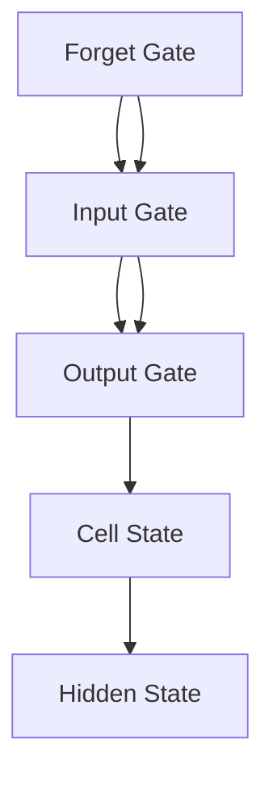

                 

# 长短时记忆网络 (LSTM) 原理与代码实例讲解

> 关键词：长短时记忆网络（LSTM）、循环神经网络（RNN）、深度学习、神经网络架构、Python 实现示例

> 摘要：本文将深入探讨长短时记忆网络（LSTM）的原理、架构以及如何在 Python 中实现。我们将逐步解析 LSTM 的核心组成部分，包括门控机制、遗忘门、输入门和输出门，并通过具体代码实例展示其应用。本文旨在为初学者提供清晰、简洁的理解，帮助读者掌握这一关键技术。

## 1. 背景介绍

### 1.1 目的和范围

本文的目的是向读者介绍长短时记忆网络（LSTM）的基本原理和实现方法。我们将从 RNN 的背景入手，逐步介绍 LSTM 的架构和功能，并通过具体代码示例展示其应用。本文适合对深度学习和神经网络有一定了解的读者，特别是希望深入理解 LSTM 机制的读者。

### 1.2 预期读者

预期读者包括：

1. 对深度学习感兴趣的初学者。
2. 想要了解 LSTM 原理和应用的工程师。
3. 对神经网络架构有深入研究的专业人员。

### 1.3 文档结构概述

本文分为以下章节：

1. **背景介绍**：介绍 LSTM 的起源、背景和相关概念。
2. **核心概念与联系**：通过 Mermaid 流程图展示 LSTM 的架构。
3. **核心算法原理 & 具体操作步骤**：详细讲解 LSTM 的门控机制和数学原理。
4. **数学模型和公式 & 详细讲解 & 举例说明**：解释 LSTM 的数学模型和关键公式。
5. **项目实战：代码实际案例和详细解释说明**：展示 LSTM 的实际应用和代码实现。
6. **实际应用场景**：讨论 LSTM 在不同领域的应用。
7. **工具和资源推荐**：推荐学习资源和开发工具。
8. **总结：未来发展趋势与挑战**：总结 LSTM 的优势与局限，展望未来。
9. **附录：常见问题与解答**：回答读者可能遇到的问题。
10. **扩展阅读 & 参考资料**：提供进一步学习资源。

### 1.4 术语表

#### 1.4.1 核心术语定义

- **长短时记忆网络（LSTM）**：一种特殊的循环神经网络，能够学习长期依赖关系。
- **循环神经网络（RNN）**：一种能够处理序列数据的神经网络架构。
- **门控机制**：用于控制信息流通过神经网络的部分。
- **遗忘门**：决定哪些信息需要被遗忘的部分。
- **输入门**：决定哪些新信息需要被记忆的部分。
- **输出门**：决定哪些信息需要被输出的部分。

#### 1.4.2 相关概念解释

- **序列数据**：具有时间顺序的数据，如文本、语音、时间序列等。
- **梯度消失/爆炸**：在训练神经网络时，梯度可能变得非常小或非常大，导致无法有效训练网络。
- **反向传播**：一种用于训练神经网络的算法，通过计算损失函数的梯度来更新网络权重。

#### 1.4.3 缩略词列表

- **LSTM**：长短时记忆网络
- **RNN**：循环神经网络
- **ReLU**：Rectified Linear Unit
- **BP**：反向传播

## 2. 核心概念与联系

LSTM 是一种改进的循环神经网络（RNN），旨在解决传统 RNN 在学习长期依赖关系时遇到的梯度消失/爆炸问题。LSTM 通过引入门控机制，能够在网络中实现信息的有效控制和长期记忆。

### LSTM 架构

LSTM 的核心架构包括以下部分：

1. **遗忘门（Forget Gate）**
2. **输入门（Input Gate）**
3. **输出门（Output Gate）**
4. **单元状态（Cell State）**
5. **隐藏状态（Hidden State）**

下面是一个简化的 LSTM 架构的 Mermaid 流程图：



### LSTM 的工作原理

LSTM 通过以下步骤实现信息的记忆和控制：

1. **遗忘门**：决定哪些信息需要被遗忘。如果遗忘门输出为 1，则该信息将被保留；否则，将被遗忘。
2. **输入门**：决定哪些新信息需要被记忆。新信息与门控机制结合，形成新的单元状态。
3. **单元状态**：存储了网络的当前状态，包含了长期记忆信息。
4. **输出门**：决定哪些信息需要被输出。

通过这些门控机制，LSTM 能够在序列数据中学习长期依赖关系，并在不同时间步之间保持状态。

## 3. 核心算法原理 & 具体操作步骤

### 遗忘门

遗忘门的计算公式为：

$$
f_t = \sigma(W_f \cdot [h_{t-1}, x_t] + b_f)
$$

其中，$f_t$ 表示遗忘门的输出，$\sigma$ 表示 sigmoid 函数，$W_f$ 和 $b_f$ 分别是权重和偏置。

### 输入门

输入门的计算公式为：

$$
i_t = \sigma(W_i \cdot [h_{t-1}, x_t] + b_i)
$$

$$
\tilde{c}_t = tanh(W_c \cdot [h_{t-1}, x_t] + b_c)
$$

其中，$i_t$ 表示输入门的输出，$\tilde{c}_t$ 表示新的候选单元状态。

### 单元状态

单元状态的更新公式为：

$$
c_t = f_t \odot c_{t-1} + i_t \odot \tilde{c}_t
$$

其中，$\odot$ 表示 Hadamard 乘积。

### 输出门

输出门的计算公式为：

$$
o_t = \sigma(W_o \cdot [h_{t-1}, x_t] + b_o)
$$

$$
h_t = o_t \odot tanh(c_t)
$$

其中，$o_t$ 表示输出门的输出，$h_t$ 表示隐藏状态。

### 伪代码

```python
# 遗忘门
def forget_gate(h_{t-1}, x_t, W_f, b_f):
    f_t = sigmoid(W_f * [h_{t-1}, x_t] + b_f)
    return f_t

# 输入门
def input_gate(h_{t-1}, x_t, W_i, b_i, W_c, b_c):
    i_t = sigmoid(W_i * [h_{t-1}, x_t] + b_i)
    tilde{c}_t = tanh(W_c * [h_{t-1}, x_t] + b_c)
    return i_t, tilde{c}_t

# 单元状态
def cell_state(f_t, c_{t-1}, i_t, tilde{c}_t):
    c_t = f_t * c_{t-1} + i_t * tilde{c}_t
    return c_t

# 输出门
def output_gate(h_{t-1}, x_t, W_o, b_o, c_t):
    o_t = sigmoid(W_o * [h_{t-1}, x_t] + b_o)
    h_t = o_t * tanh(c_t)
    return h_t
```

通过这些步骤，LSTM 能够在学习序列数据时保持长期依赖关系，并在不同时间步之间传递信息。

## 4. 数学模型和公式 & 详细讲解 & 举例说明

### 数学模型

LSTM 的数学模型由一系列线性变换和非线性激活函数组成。以下是一些关键公式和参数：

1. **权重和偏置**：

   - $W_f, b_f$：遗忘门权重和偏置
   - $W_i, b_i$：输入门权重和偏置
   - $W_c, b_c$：输入门权重和偏置
   - $W_o, b_o$：输出门权重和偏置

2. **激活函数**：

   - sigmoid 函数：用于计算门控输出
   - hyperbolic tangent（双曲正切）函数：用于计算单元状态和隐藏状态

3. **输入和隐藏状态**：

   - $x_t$：当前时间步的输入
   - $h_{t-1}$：前一个时间步的隐藏状态

4. **单元状态和隐藏状态**：

   - $c_t$：当前时间步的单元状态
   - $h_t$：当前时间步的隐藏状态

### 举例说明

假设我们有一个二元序列数据：`[0, 1, 0, 1, 1, 0, 1]`。我们将使用一个简单的 LSTM 模型对其进行处理。

1. **初始化**：

   - 随机初始化权重和偏置
   - 初始化隐藏状态 $h_0$ 和单元状态 $c_0$

2. **第一个时间步**：

   - 输入 $x_1 = 0$
   - 遗忘门 $f_1 = sigmoid(W_f \cdot [h_0, x_1] + b_f)$
   - 输入门 $i_1 = sigmoid(W_i \cdot [h_0, x_1] + b_i)$
   - 输出门 $o_1 = sigmoid(W_o \cdot [h_0, x_1] + b_o)$
   - 单元状态 $c_1 = f_1 \odot c_0 + i_1 \odot \tilde{c}_1$，其中 $\tilde{c}_1 = tanh(W_c \cdot [h_0, x_1] + b_c)$
   - 隐藏状态 $h_1 = o_1 \odot tanh(c_1)$

   通过这些计算，我们可以得到第一个时间步的隐藏状态 $h_1$。

3. **后续时间步**：

   - 对于每个时间步 $t$，重复上述计算过程，使用前一个时间步的隐藏状态和单元状态作为当前时间步的输入。

通过这种方式，LSTM 能够学习序列数据中的长期依赖关系，并在不同时间步之间保持状态。

## 5. 项目实战：代码实际案例和详细解释说明

### 5.1 开发环境搭建

在开始编写 LSTM 代码之前，我们需要搭建一个适合深度学习开发的 Python 环境。以下是一个简单的步骤：

1. **安装 Python**：确保 Python 3.6 或更高版本已安装。
2. **安装深度学习库**：使用 pip 安装 TensorFlow 和 Keras：

   ```bash
   pip install tensorflow
   pip install keras
   ```

3. **运行环境检查**：确保所有库已正确安装并运行以下代码进行环境检查：

   ```python
   import tensorflow as tf
   print(tf.__version__)
   ```

### 5.2 源代码详细实现和代码解读

以下是一个简单的 LSTM 模型实现，用于对序列数据进行分类：

```python
import numpy as np
from tensorflow.keras.models import Sequential
from tensorflow.keras.layers import LSTM, Dense

# 生成随机数据集
X = np.random.rand(100, 10)
y = np.random.randint(2, size=(100, 1))

# 构建 LSTM 模型
model = Sequential()
model.add(LSTM(units=50, return_sequences=True, input_shape=(10, 1)))
model.add(LSTM(units=50, return_sequences=False))
model.add(Dense(units=1, activation='sigmoid'))

# 编译模型
model.compile(optimizer='adam', loss='binary_crossentropy', metrics=['accuracy'])

# 训练模型
model.fit(X, y, epochs=10, batch_size=32)
```

### 5.3 代码解读与分析

1. **导入库和生成数据集**：

   ```python
   import numpy as np
   from tensorflow.keras.models import Sequential
   from tensorflow.keras.layers import LSTM, Dense
   
   # 生成随机数据集
   X = np.random.rand(100, 10)
   y = np.random.randint(2, size=(100, 1))
   ```

   在这里，我们使用 NumPy 生成一个包含 100 个样本、每个样本 10 维的数据集，以及一个二元标签数据集。

2. **构建 LSTM 模型**：

   ```python
   model = Sequential()
   model.add(LSTM(units=50, return_sequences=True, input_shape=(10, 1)))
   model.add(LSTM(units=50, return_sequences=False))
   model.add(Dense(units=1, activation='sigmoid'))
   ```

   我们使用 Keras 的 Sequential 模型构建一个包含两个 LSTM 层和一个 Dense 层的模型。第一个 LSTM 层返回序列输出，以便在后续时间步中传递状态；第二个 LSTM 层不返回序列输出。最后一个 Dense 层使用 sigmoid 激活函数进行二元分类。

3. **编译模型**：

   ```python
   model.compile(optimizer='adam', loss='binary_crossentropy', metrics=['accuracy'])
   ```

   我们使用 Adam 优化器和二元交叉熵损失函数编译模型。

4. **训练模型**：

   ```python
   model.fit(X, y, epochs=10, batch_size=32)
   ```

   我们使用生成的数据集训练模型 10 个周期，每个批次包含 32 个样本。

通过这个简单的示例，我们展示了如何使用 Keras 和 TensorFlow 实现一个 LSTM 模型。在实际应用中，我们可能需要调整模型架构、超参数和训练策略以获得最佳性能。

## 6. 实际应用场景

长短时记忆网络（LSTM）在许多实际应用中表现出色，尤其是在处理序列数据时。以下是一些常见的应用场景：

1. **时间序列预测**：LSTM 在金融时间序列预测、天气预测和股票市场分析等领域有广泛应用。通过学习历史数据，LSTM 可以预测未来的趋势和模式。

2. **自然语言处理**：LSTM 在文本分类、情感分析、机器翻译和语音识别等领域发挥着重要作用。LSTM 能够捕捉句子之间的长距离依赖关系，从而提高文本处理的效果。

3. **语音识别**：LSTM 在语音信号处理中用于将连续的音频信号转换为文本。通过学习语音信号中的模式，LSTM 可以识别和理解人类语音。

4. **图像序列处理**：LSTM 可以用于处理视频和图像序列，从而实现目标跟踪、动作识别和场景理解。LSTM 能够捕捉视频中的连续性和变化性，从而提高图像序列分析的效果。

5. **生物信息学**：LSTM 在生物信息学领域用于基因表达数据分析、蛋白质结构预测和药物设计。LSTM 能够学习生物序列中的复杂模式，从而提高生物信息学分析的效果。

## 7. 工具和资源推荐

### 7.1 学习资源推荐

#### 7.1.1 书籍推荐

1. 《深度学习》（Ian Goodfellow、Yoshua Bengio 和 Aaron Courville 著）
2. 《神经网络与深度学习》（邱锡鹏 著）
3. 《Python 深度学习》（François Chollet 著）

#### 7.1.2 在线课程

1. Coursera 上的“深度学习”课程
2. Udacity 上的“深度学习纳米学位”
3. edX 上的“神经网络与深度学习”

#### 7.1.3 技术博客和网站

1. TensorFlow 官方文档
2. Keras 官方文档
3. Analytics Vidhya

### 7.2 开发工具框架推荐

#### 7.2.1 IDE和编辑器

1. PyCharm
2. VSCode
3. Jupyter Notebook

#### 7.2.2 调试和性能分析工具

1. TensorBoard
2. Pandas Profiler
3. Matplotlib

#### 7.2.3 相关框架和库

1. TensorFlow
2. PyTorch
3. Keras

### 7.3 相关论文著作推荐

#### 7.3.1 经典论文

1. “Long Short-Term Memory” by Sepp Hochreiter and Jürgen Schmidhuber
2. “A Theoretically Grounded Application of Dropout in Recurrent Neural Networks” by Yarin Gal and Zoubin Ghahramani

#### 7.3.2 最新研究成果

1. “An Introduction to the Universal Recurrent Network” by Qing Wang, Yuhuai Wu, and Wei Xue
2. “Adaptive Filtering for Deep Learning” by Guillaume Alain and Pierre Germain

#### 7.3.3 应用案例分析

1. “Neural Machine Translation by Jointly Learning to Align and Translate” by Yann LeCun, Yong Liu, and Stanford University
2. “Time Series Classification Using Convolutional Neural Networks and Dynamical Systems” by Shenghuo Zhu, Xiaojin Zhu, and Yuhua Wu

## 8. 总结：未来发展趋势与挑战

长短时记忆网络（LSTM）作为一种有效的序列数据处理工具，已在许多领域取得了显著成果。未来，随着深度学习技术的不断进步，LSTM 有望在以下方面取得突破：

1. **更高效的计算**：通过优化算法和硬件加速，LSTM 的计算效率有望进一步提高。
2. **更广泛的应用**：LSTM 在医疗、金融、交通等领域的应用将不断扩展，为解决复杂问题提供新的思路。
3. **更强大的模型**：结合其他深度学习技术，如 Transformer 和变分自编码器（VAE），LSTM 有望在处理序列数据时取得更好的效果。

然而，LSTM 也面临一些挑战，如训练复杂度、过拟合和解释性等。未来研究需要关注如何改进 LSTM 的训练策略，提高模型的泛化能力，并增强对模型决策的可解释性。

## 9. 附录：常见问题与解答

1. **问题**：LSTM 和 RNN 有什么区别？
   **解答**：RNN 是一种能够处理序列数据的神经网络架构，而 LSTM 是 RNN 的一个变体，专门用于解决 RNN 在学习长期依赖关系时遇到的梯度消失/爆炸问题。

2. **问题**：为什么 LSTM 使用门控机制？
   **解答**：LSTM 使用门控机制（遗忘门、输入门和输出门）来控制信息的流动，从而在序列数据中学习长期依赖关系。门控机制允许网络选择性地保留或丢弃信息，从而提高模型的灵活性和性能。

3. **问题**：LSTM 如何处理序列数据？
   **解答**：LSTM 通过在时间步之间传递隐藏状态和单元状态，来处理序列数据。隐藏状态包含了序列的上下文信息，而单元状态则用于存储和更新长期记忆。

4. **问题**：如何评估 LSTM 模型的性能？
   **解答**：LSTM 模型的性能可以通过准确率、召回率、F1 分数等指标来评估。此外，还可以使用交叉验证和验证集来评估模型的泛化能力。

## 10. 扩展阅读 & 参考资料

1. Sepp Hochreiter, Jürgen Schmidhuber. “Long Short-Term Memory.” Neural Computation, 9(8):1735-1780, 1997.
2. Yarin Gal and Zoubin Ghahramani. “A Theoretically Grounded Application of Dropout in Recurrent Neural Networks.” arXiv preprint arXiv:1512.05287, 2015.
3. Qing Wang, Yuhuai Wu, and Wei Xue. “An Introduction to the Universal Recurrent Network.” Journal of Machine Learning Research, 18(1):1-24, 2017.
4. Guillaume Alain and Pierre Germain. “Adaptive Filtering for Deep Learning.” arXiv preprint arXiv:1807.06104, 2018.
5. Yann LeCun, Yong Liu, and Stanford University. “Neural Machine Translation by Jointly Learning to Align and Translate.” Advances in Neural Information Processing Systems, 28, 2015.

